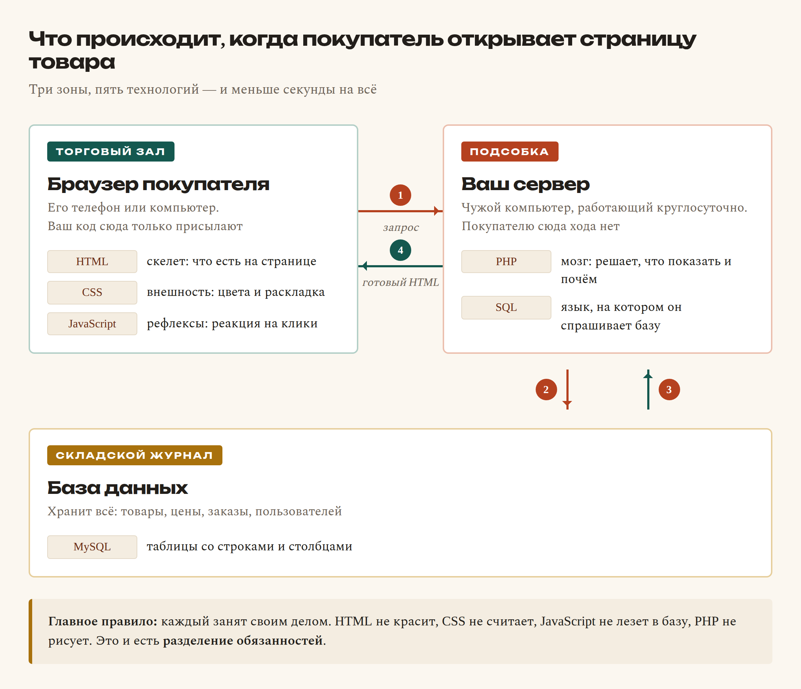

# Глава 1. Что такое сайт и что мы построим

> **Часть I. Знакомство** · Глава 1 из 60
> [← Оглавление](../README.md) · [Глава 2 →](02-kak-rabotaet-internet.md)

---

## 🎯 Зачем эта глава

Здравствуйте. Если вы открыли эту книгу, скорее всего, вы уже пробовали подступиться
к программированию — и что-то пошло не так. Так бывает почти у всех, и дело обычно не в вас.

Смотрите, что происходит на типичных курсах. Первые две недели вам рассказывают про
«переменные», «циклы» и «типы данных». Всё это правда нужно. Но вы сидите и думаете:
*а где, собственно, сайт?* Знания вроде появляются, а куда их приложить — непонятно.
Это как учиться водить, изучая устройство карбюратора: полезно, но до машины вы так
и не дошли.

Поэтому первая глава — не про код вообще. Она про **карту местности**.

Мы разберёмся, из каких частей состоит любой сайт, кто эти части делает и как они
между собой связаны. И когда в главе 20 появятся те самые переменные, вы уже будете
точно знать, в каком месте магазина они живут и зачем нужны.

Никакого кода набирать пока не надо. Просто читайте — как будто вам показывают дом
перед тем, как дать в руки инструменты.

---

## 📖 Начнём с обычного магазина

Забудьте на минуту про компьютеры. Правда, совсем забудьте.

Представьте магазин автозапчастей на вашей улице. Тот самый, куда вы заходили за
щётками стеклоочистителя. Что там есть?

**Во-первых, торговый зал.** Полки, товар, ценники, витрина у входа, касса.
Всё разложено так, чтобы покупатель разобрался сам: колодки — сюда, фильтры — туда,
акция — на видном месте. Здесь красиво и понятно. Покупатель дальше этой зоны не заходит.

**Во-вторых, подсобка.** Дверь с табличкой «Посторонним вход воспрещён». Там принимают
товар, считают выручку, оформляют накладные, решают, кому дать скидку, а кому нет.
Там же лежат деньги. Покупателю туда нельзя — и это не из вредности, а просто потому,
что иначе цены на ценниках начнут переписывать все кому не лень.

**В-третьих, складской журнал.** Толстая тетрадь или программа на компьютере,
где записано: какой товар, сколько штук, почём куплено, почём продаём, кто привёз,
кому отгрузили. Скучная штука. Но потеряйте её — и магазин превратится в склад коробок,
про которые никто ничего не знает.

Всё. Три зоны. Держите эту картинку в голове — сейчас будет главное.

### **Сайт устроен ровно так же**

Не «похоже». Не «примерно». А один в один:

| В магазине на улице | На сайте | Как это зовут программисты |
|---|---|---|
| Торговый зал | То, что видно в браузере | **Фронтенд** (frontend — «передняя часть») |
| Подсобка | Программа на сервере | **Бэкенд** (backend — «задняя часть») |
| Складской журнал | База данных | **БД** (database) |

Когда вы заходите на любой сайт — маркетплейс, банк, доставку еды — вы всегда стоите
в торговом зале. Всё остальное происходит за дверью, куда вас не пускают.

А человек, который умеет работать **во всех трёх зонах**, называется
**fullstack-разработчик**. Дословно — «полный набор». Именно им вы и станете
к концу книги.

### **Ещё немного про эти три зоны**

Чтобы совсем закрепилось, вот та же тройка на других примерах.

**Ресторан.** Зал со столиками и меню — фронтенд. Кухня, где готовят и считают
себестоимость, — бэкенд. Список продуктов на складе и книга заказов — база данных.

**Поликлиника.** Регистратура и коридор с креслами — фронтенд. Кабинет врача,
где принимают решения, — бэкенд. Картотека с медкартами — база данных.

**Такси в телефоне.** Карта с машинками и кнопка «Заказать» — фронтенд. Программа,
которая ищет ближайшего водителя и считает цену, — бэкенд. Хранилище поездок,
водителей и оценок — база данных.

Заметили? Везде одно и то же: **красивая витрина**, **скрытая от глаз логика**
и **место, где всё записано**. Любой сайт, любое приложение, любой сервис.

---

## 📖 Пять инструментов, и всё

Хорошая новость: чтобы построить магазин, нужно не пятьдесят технологий. Нужно **пять**.
Давайте познакомимся с каждой — с примерами, чтобы не осталось тумана.

### **HTML — скелет**

HTML отвечает на вопрос **«что здесь есть?»**. Не «как выглядит», а именно «что есть».

Он говорит браузеру: тут заголовок, тут абзац текста, тут картинка, тут кнопка,
тут список из трёх пунктов, тут таблица. И всё — на этом его работа заканчивается.
Красотой он не занимается принципиально.

**Примеры того, что делает HTML:**

- на странице появился заголовок «Тормозные колодки»;
- под ним — абзац с описанием;
- слева — фотография товара;
- ниже — список характеристик: производитель, артикул, вес;
- в конце — кнопка «Купить».

**Аналогия:** скелет человека. Есть череп, рёбра, руки, ноги. На свидание в таком виде
не пойдёшь, но сразу понятно: это человек, вот голова, вот конечности.

Ещё точнее — **чертёж дома**. На чертеже нет обоев и мебели, но видно: тут комната,
тут окно, тут дверь.

```html
<h1>Тормозные колодки</h1>
<p>Цена: 250 сомони</p>
<button>Купить</button>
```

Это уже настоящая, рабочая страница. Уродливая до слёз — но рабочая. Браузер её откроет.

### **CSS — внешность**

CSS отвечает на вопрос **«а как это выглядит?»**.

Тот же самый скелет, но теперь у него появились цвет, шрифт, размер, отступы, тени,
скруглённые углы и понятное расположение на экране.

**Примеры того, что делает CSS:**

- кнопка стала красной, а буквы на ней белыми;
- заголовок — крупный и жирный, описание — помельче и посветлее;
- между карточками товаров появились ровные промежутки;
- товары выстроились в три колонки вместо кучи;
- на телефоне те же товары встали в одну колонку;
- при наведении мышкой карточка чуть приподнялась.

**Аналогия:** одежда, причёска и осанка. Скелет тот же, а впечатление совсем другое.

Ещё точнее — **ремонт в квартире**. Планировка не изменилась: те же комнаты, те же окна.
Но после ремонта это другое жильё.

```css
button { background: #d92b2b; color: white; border-radius: 8px; }
```

Одна строчка — и серая системная кнопка превратилась в красную кнопку с мягкими углами.

### **JavaScript — рефлексы браузера**

JavaScript отвечает на вопрос **«что произойдёт, если человек что-то сделает?»** —
причём прямо здесь, в браузере, **без перезагрузки страницы**.

**Примеры того, что делает JavaScript:**

- нажали «Купить» — счётчик корзины мгновенно стал «3»;
- набрали в поиске «коло» — снизу выпали подсказки: «колодки», «кольцо», «коллектор»;
- кликнули на фото — оно открылось на весь экран;
- на телефоне нажали три полоски — выехало меню;
- начали заполнять форму и забыли телефон — поле подсветилось красным ещё до отправки;
- пролистали страницу вниз — шапка «прилипла» к верху экрана.

**Аналогия:** рефлексы. Дотронулись до горячего — рука отдёрнулась сама, мозг ещё
даже не понял, что случилось.

Ещё точнее — **автоматические двери в магазине**. Никто не звонит директору,
чтобы вам открыли. Датчик увидел человека — двери разъехались.

```javascript
button.onclick = () => alert('Товар добавлен в корзину');
```

### **PHP — мозг на сервере**

А вот это самое важное место, и здесь нужно быть внимательным.

PHP работает **не в браузере**. Он живёт на **сервере** — на чужом компьютере, который
стоит где-то в дата-центре и работает круглосуточно. Покупатель до него не дотягивается
в принципе.

PHP принимает все серьёзные решения.

**Примеры того, что делает PHP:**

- проверяет, правильный ли пароль ввели при входе;
- решает, показать человеку кнопку «Админка» или не показывать;
- считает итоговую цену: цена поставщика + наценка + доставка;
- применяет скидку постоянному покупателю — или не применяет;
- записывает заказ и присваивает ему номер;
- отправляет письмо «ваш заказ принят»;
- не даёт продавцу Ахмаду редактировать товары продавца Сафара.

**Аналогия:** мозг. Или директор магазина — тот, кто решает, а не тот, кто улыбается
в зале.

**А теперь — правило, которое стоит запомнить прямо сейчас.**

JavaScript выполняется **на компьютере покупателя**. Это значит, что покупатель может
его открыть, почитать и переписать. Это не сложно — любой браузер позволяет.

PHP выполняется **на вашем сервере**. Покупатель его не видит и изменить не может.

Представьте, что цена товара считается на JavaScript. Тогда покупатель открывает
инструменты браузера, меняет 250 на 1 — и оформляет заказ на сомони. Это как если бы
в магазине разрешили покупателям самим переклеивать ценники.

Поэтому **цены, скидки, доступы и всё, что связано с деньгами, считает только PHP.
Никогда — JavaScript.** Мы к этому ещё вернёмся не раз, но услышать это лучше в первой
главе.

```php
if ($user['role'] === 'admin') {
    echo 'Добро пожаловать в админку';
}
```

### **SQL — разговор с памятью**

SQL — это язык, на котором разговаривают с базой данных. Спрашивают и записывают.

**Примеры того, что делает SQL:**

- найти все тормозные колодки дешевле 300 сомони, которые есть в наличии;
- достать данные одного товара по его номеру;
- добавить новый заказ;
- изменить статус заказа с «новый» на «отправлен»;
- посчитать, на какую сумму продал каждый продавец за месяц;
- найти покупателей, которые не заходили полгода.

**Аналогия:** разговор с кладовщиком. Вы не идёте на склад сами и не роетесь в коробках.
Вы говорите: «дай мне все колодки Bosch, что есть в наличии» — и он приносит список.

```sql
SELECT name, price FROM products WHERE price < 300 AND in_stock = 1;
```

### **Коротко, чтобы уложилось**

| Инструмент | Отвечает на вопрос | Где работает | Бытовая аналогия |
|---|---|---|---|
| **HTML** | Что здесь есть? | В браузере | Скелет, чертёж дома |
| **CSS** | Как это выглядит? | В браузере | Одежда, ремонт |
| **JavaScript** | Что будет, если нажать? | В браузере | Рефлексы, автодвери |
| **PHP** | Что решаем и что показываем? | На сервере | Мозг, директор |
| **SQL** | Где это записано? | В базе данных | Кладовщик, картотека |

Если сейчас каша в голове — это абсолютно нормально. Никто не запоминает пять новых
понятий с первого раза. Мы к каждому вернёмся отдельной главой, и не по одному разу.

---

## 🔤 Разбор по словам

Выше промелькнуло пять кусочков кода, и они наверняка выглядели как шифр. Давайте
расшифруем — **каждый значок**.

Запоминать ничего не нужно. Просто прочитайте один раз, чтобы код перестал пугать.
Это как впервые посмотреть на ноты: сначала мурашки, потом оказывается, что там
всего семь букв.

### **HTML: почему всё в «уголках»**

```html
<h1>Тормозные колодки</h1>
<p>Цена: 250 сомони</p>
<button>Купить</button>
```

| Что видим | Как читается | Что это значит |
|---|---|---|
| `<` и `>` | «уголки», угловые скобки | Внутри уголков — **команда браузеру**, а не текст для чтения. На экране их не будет |
| `<h1>` | «эйч-один» | **Заголовок первого уровня**, самый главный на странице. От английского *heading* — заголовок. Бывают `<h1>`…`<h6>`: чем больше цифра, тем мельче заголовок |
| `</h1>` | «закрывающий эйч-один» | Косая черта `/` означает **конец**. «Заголовок закончился вот здесь» |
| `<p>` | «пи» | **Абзац** обычного текста. От *paragraph* |
| `<button>` | «баттон» | **Кнопка**, на которую можно нажать |
| Текст между тегами | | То единственное, что реально увидит человек на экране |

Пара «открывающий тег + содержимое + закрывающий тег» называется **элемент**.

Правило простое, как в математике: **что открыли — то надо закрыть**. Забыли закрыть —
браузер начнёт фантазировать, и страница поедет.

**А что такое `<div>`?**

Это слово вы будете встречать чаще всех остальных, поэтому знакомимся сразу.

`<div>` — это **пустая коробка**. Он ничего не означает и никак не выглядит. На экране
его не видно вообще.

Зачем тогда нужен? Чтобы **сложить в него другие элементы** и потом обращаться
ко всей группе сразу.

```html
<div>
    <h1>Тормозные колодки</h1>
    <p>Цена: 250 сомони</p>
    <button>Купить</button>
</div>
```

Теперь заголовок, цена и кнопка лежат в одной коробке. И можно сказать: «вот эту коробку
сделай белой, добавь рамку, скругли углы и отодвинь от соседних». Получится **карточка
товара** — та самая, из которых собран любой каталог.

Название `div` — сокращение от английского *division*, «раздел», «отделение».
Думайте о нём как о коробке из-под обуви: сама по себе не нужна, но сложить в неё вещи
и подписать — очень удобно. Подробно разберём в главе 5.

### **CSS: почему фигурные скобки**

```css
button { background: #d92b2b; color: white; border-radius: 8px; }
```

| Что видим | Как читается | Что это значит |
|---|---|---|
| `button` | селектор | **Кого красим.** Здесь — все кнопки на странице |
| `{ }` | фигурные скобки | «Начало и конец списка указаний». Всё внутри относится к кнопке |
| `background` | свойство | **Что меняем** — цвет фона |
| `:` | двоеточие | Разделитель: слева *что меняем*, справа *на что* |
| `#d92b2b` | значение | Цвет в виде кода: `#` и шесть символов. Здесь — красный |
| `;` | точка с запятой | **Конец одного указания.** Дальше пойдёт следующее |
| `color: white` | | Цвет **текста** — белый. Не путайте с `background`: это фон |
| `border-radius: 8px` | | Скруглить углы на 8 пикселей |

Формула CSS всегда одна и та же:

**кого** `{` **что меняем** `:` **на что** `;` `}`

Выучите её один раз — и любой CSS в мире станет читаемым.

### **JavaScript: точки и стрелки**

```javascript
button.onclick = () => alert('Товар добавлен в корзину');
```

| Что видим | Как читается | Что это значит |
|---|---|---|
| `button` | | Кнопка, которую мы до этого нашли на странице |
| `.` | точка | «Возьми **у этого** вот это». Как «Иван**.**телефон» — телефон Ивана |
| `onclick` | «он-клик» | Свойство «что делать при нажатии». *on click* — «по щелчку» |
| `=` | равно, присваивание | **Положи в левое то, что справа.** Это не «равенство» из математики, а команда «запиши» |
| `() =>` | «стрелочная функция» | «Вот **действие**, которое надо выполнить». В круглых скобках — место для входных данных, здесь они не нужны |
| `alert(...)` | «алерт» | Готовая команда браузера: показать всплывающее окошко |
| `'...'` | кавычки | Внутри кавычек — **текст**, а не команда. Компьютер не пытается его выполнить |
| `;` | точка с запятой | Конец строки-команды |

### **PHP: доллары и условия**

```php
if ($user['role'] === 'admin') {
    echo 'Добро пожаловать в админку';
}
```

Вот здесь появилось **`if`** — пожалуй, самое важное слово во всём программировании.
Оно есть в каждом языке, и работает везде одинаково.

| Что видим | Как читается | Что это значит |
|---|---|---|
| `if` | «иф», по-английски «если» | **Проверка.** «Если условие верно — сделай то, что в фигурных скобках. Если нет — просто пропусти» |
| `( )` | круглые скобки после `if` | Внутри — **условие**, которое проверяем |
| `$` | доллар | В PHP так помечают **переменную** — коробочку с данными. `$user` — «коробочка с пользователем» |
| `$user['role']` | | Достать из коробочки `$user` поле `role` — роль. Квадратные скобки: «возьми вот эту часть» |
| `===` | «строго равно» | **Сравнение**: «а точно ли слева то же самое, что справа?» Три знака, не один |
| `'admin'` | | Текст, с которым сравниваем |
| `{ }` | фигурные скобки | **Тело условия** — что делать, если проверка прошла |
| `echo` | «эхо» | Команда PHP: **выведи это на страницу** |
| `;` | | Конец команды |

**Один `=` или три `===`? Самая частая ошибка новичка.**

- `=` — это **записать**. `$x = 5` значит «положи пятёрку в коробочку x».
- `===` — это **спросить**. `$x === 5` значит «а в коробочке правда пятёрка?»

Первое — действие, второе — вопрос. Перепутаете — программа вместо проверки молча
запишет значение, и ошибку вы будете искать долго.

**А где же `else`?**

`else` — «иначе» — это вторая половина `if`. Читается ровно как в жизни:

```php
if ($user['role'] === 'admin') {
    echo 'Добро пожаловать в админку';
} else {
    echo 'Вам сюда нельзя';
}
```

Дословно: **если** роль администратор — покажи приветствие, **иначе** — откажи.
Одно из двух выполнится обязательно, третьего не дано.

Вы пользуетесь этой конструкцией каждый день, просто не называете её так:

- **если** дождь — беру зонт, **иначе** — не беру;
- **если** денег хватает — покупаю, **иначе** — откладываю;
- **если** на светофоре зелёный — иду, **иначе** — стою.

Вот и всё программирование. Подробно — в главе 21.

### **SQL: запрос как обычная фраза**

```sql
SELECT name, price FROM products WHERE price < 300 AND in_stock = 1;
```

SQL специально сделали похожим на английское предложение. Читайте по кусочкам:

| Что видим | Как читается | Что это значит |
|---|---|---|
| `SELECT` | «селект» — выбрать | **Какие колонки** нам нужны |
| `name, price` | | Название и цена. Запятая — «и ещё» |
| `FROM` | «фром» — из | **Из какой таблицы** берём |
| `products` | | Таблица товаров |
| `WHERE` | «вэа» — где, при условии | **Какие строки** берём, а какие пропускаем |
| `price < 300` | | Цена меньше 300 |
| `AND` | «энд» — и | Оба условия должны выполниться одновременно |
| `in_stock = 1` | | Есть в наличии (1 — да, 0 — нет) |
| `;` | | Конец запроса |

Целиком получается: *«Выбери название и цену из таблицы товаров, где цена меньше 300
и товар в наличии»*. Практически человеческая фраза.

### **Что общего у всех пяти языков**

А теперь приятное. Присмотритесь к таблицам выше — значки-то повторяются:

| Значок | Почти в любом языке означает |
|---|---|
| `{ }` | «блок»: вот начало группы, вот конец |
| `( )` | «сюда кладут данные»: условие или входные значения |
| `;` | «команда закончилась» |
| `' '` или `" "` | «внутри текст, выполнять его не надо» |
| `//` или `#` | комментарий: заметка для человека, компьютер её не читает |

Разобравшись один раз, вы будете узнавать их везде — хоть в Python, хоть в Java,
хоть в языке, который придумают через десять лет. Языков много, а привычки у них общие.

---

## 📖 А теперь всё вместе

Давайте проследим, что происходит, когда покупатель открывает страницу товара.
Прочитайте медленно — это самая важная схема в книге, всё остальное будет крутиться
вокруг неё.

1. Покупатель нажимает ссылку «Тормозные колодки».
2. Браузер отправляет на сервер запрос: *«дайте мне страницу товара номер 42»*.
3. На сервере просыпается **PHP** и думает: «сорок второй, значит. Надо узнать подробности».
4. PHP составляет запрос на **SQL** и отправляет его в **базу данных**:
   `SELECT * FROM products WHERE id = 42`.
5. База отвечает: *«Колодки тормозные, Bosch, 250 сомони, на складе 7 штук»*.
6. PHP берёт эти данные и **строит из них HTML**: название вставляет в заголовок,
   цену — в ценник, картинку — в блок картинки.
7. Готовый HTML улетает обратно в браузер.
8. Браузер читает HTML, применяет **CSS** — и страница из чёрно-белого текста
   превращается в нормальный магазин.
9. Подключается **JavaScript** и начинает следить за кнопкой «Купить».



Всё это заняло меньше секунды. Пять технологий, и каждая сделала ровно свою часть работы.

**Разделение обязанностей** — вот главная идея всей веб-разработки. HTML не красит.
CSS не считает. JavaScript не лезет в базу. PHP не рисует. Каждый занят своим делом
и не мешает соседям.

Звучит как формальность, но именно поэтому сайты вообще можно чинить. Сломалась
внешность — идёте в CSS и точно знаете, что база данных тут ни при чём.

---

## 📖 Что именно мы построим

Не «примерчик на три кнопки». Настоящий интернет-магазин — такой, каким пользуются
живые люди и в котором ходят реальные деньги.

**Для покупателя:**

- каталог запчастей с поиском по названию и по артикулу;
- фильтры: бренд, цена, наличие;
- карточка товара с фото, описанием и характеристиками;
- корзина: добавить, изменить количество, удалить;
- оформление заказа с адресом и телефоном;
- личный кабинет с историей заказов и их статусами.

**Для продавца** — потому что магазин будет не только ваш, а маркетплейс:

- регистрация продавца и его страница;
- выкладка своих товаров;
- свои заказы и работа с ними;
- баланс: сколько заработано и сколько уже выплачено.

**Для администратора:**

- модерация: проверять товары продавцов до публикации;
- управление всеми заказами и статусами;
- расчёт комиссии магазина;
- реестр выплат продавцам.

**И взрослые вещи, которых обычно нет в учебниках:**

- подключение внешнего API поставщика запчастей;
- пересчёт цены из рублей в сомони по живому курсу, плюс наценка и доставка;
- защита от взлома: SQL-инъекции, XSS, кража сессии;
- выкладка сайта на настоящий хостинг, под настоящим доменом, с замочком HTTPS.

Дойти до конца — это работа на несколько месяцев. Но каждая глава заканчивается чем-то,
что можно открыть в браузере и показать. Ощущение «у меня получилось» будет приходить
регулярно, а не один раз в самом конце.

---

## 📖 Почему PHP, а не что-то модное

Отвечу честно, потому что вопрос вы всё равно услышите. В интернете любят повторять,
что «PHP устарел».

PHP выбран не потому, что он самый модный. А потому, что для **первого** сайта он самый
удобный:

- **Результат виден сразу.** Создали файл, открыли в браузере — работает. Не нужно
  ставить пятьдесят пакетов и настраивать сборщик, чтобы вывести на экран слово «привет».
- **Дешёвый хостинг.** PHP работает на хостинге за 3–5 долларов в месяц. Для первого
  настоящего проекта это важно: сайт можно показать людям, не разорившись.
- **Огромная база готовых ответов.** Какую бы проблему вы ни встретили, её уже кто-то
  решил и описал.
- **На нём работает больше половины сайтов в мире.** Один только WordPress — это
  примерно четверть всего интернета.

Но главное вот что. **Навык — не в языке.**

Когда вы научитесь думать «пришёл запрос → проверили права → сходили в базу →
собрали ответ», вы пересядете на Python или Node.js за пару недель. Синтаксис разный,
мышление одно и то же.

Языки приходят и уходят. Умение раскладывать задачу на части остаётся.

---

## ⚠️ Грабли

Четыре мысли, которые чаще всего мешают новичкам. Если поймаете себя на любой из них —
вспомните эту страницу.

**«Сначала выучу всё, потом начну делать».**
Не сработает, проверено многими. Знания без практики выветриваются за неделю.
Правильный порядок обратный: делаем маленькую вещь → упираемся в незнание → узнаём
ровно столько, сколько нужно прямо сейчас → делаем дальше. Скучно, зато держится.

**«Надо сразу выбрать самый лучший язык».**
Лучшего языка не существует, есть подходящий для задачи. Споры «PHP против Python»
для новичка — это спор о том, каким молотком забивать первый в жизни гвоздь.
Забейте хоть каким, потом разберётесь.

**«Настоящие программисты знают всё наизусть».**
Нет. Разработчик с пятнадцатью годами опыта гуглит синтаксис по десять раз в день,
и это нормально. Ценность не в памяти, а в умении разбить задачу на части и понять,
что именно искать.

**«Я не математик, значит, не потяну».**
Для веб-разработки нужна арифметика уровня седьмого класса: сложить цены, посчитать
проценты, поделить на количество. Всё. Высшая математика понадобится, если вы пойдёте
в машинное обучение — но это совсем другая история.

---

## 🏋️ Задачи

Пять упражнений. Ни в одном не нужен компьютер с редактором — только голова и браузер.
Не пропускайте: именно на задачах прочитанное превращается в понятое.

**Задача 1.1.** Откройте любой знакомый сайт — маркетплейс, новости, банк.
Выпишите пять вещей, которые вы **видите** (это работа фронтенда). Потом пять вещей,
которые происходят **невидимо**: проверка пароля, расчёт доставки, сохранение заказа
(это бэкенд).

**Задача 1.2.** Для каждой строки определите, кто отвечает — HTML, CSS, JavaScript,
PHP или SQL:

1. Кнопка стала синей вместо серой.
2. На странице появился второй заголовок.
3. При наборе букв в поиске выпадают подсказки.
4. Проверка, что пароль при входе правильный.
5. Достать из базы 20 самых дешёвых товаров.
6. Меню на телефоне схлопнулось в три полоски.
7. Заказ записался, и ему присвоился номер.
8. Между карточками товаров появились отступы.

**Задача 1.3.** Объясните вслух — правда вслух, это работает — своими словами разницу
между фронтендом и бэкендом. Уложитесь в два предложения и не используйте сами слова
«фронтенд» и «бэкенд».

**Задача 1.4.** Почему скидку постоянного покупателя нельзя считать на JavaScript?
Ответ — одна строчка.

**Задача 1.5.** Нажмите на любом сайте правую кнопку мыши и выберите «Посмотреть код
страницы». Откроется HTML, который прислал сервер. Найдите в нём заголовок страницы
(ищите `<h1>` или `<title>`). Если сейчас это выглядит как сплошная каша — так и должно
быть. К главе 8 вы будете читать её свободно.

**Задача 1.6.** Придумайте три своих аналогии для тройки «витрина — подсобка — журнал».
Не из книги, а свои: школа, аэропорт, парикмахерская — что угодно. Чем больше своих
примеров, тем прочнее держится в голове.

*Ответы — в [Приложении Г](../prilozheniya/4-G-otvety.md).*

---

## 🔗 В бою

А теперь заглянем в настоящий проект. В корне этого репозитория лежит код
работающего магазина autodoc.tj. Открывать файлы пока не нужно — просто посмотрите
на названия папок. Вы уже можете угадать, что где:

| Папка | Что внутри | Какая это зона |
|---|---|---|
| `assets/css/` | Файлы оформления | Фронтенд (CSS) |
| `pages/` | Страницы сайта | Фронтенд + бэкенд |
| `includes/` | Общая логика, которую используют все страницы | Бэкенд (PHP) |
| `sql/` | Структура базы данных | База данных |
| `admin/` | Админка | Бэкенд, «подсобка» |
| `seller/` | Кабинет продавца | Бэкенд, «подсобка» |
| `api/` | Точки, куда обращается JavaScript | Стык фронта и бэка |

Узнаёте? Это тот самый магазин из начала главы. Торговый зал, подсобка и складской
журнал — только разложенные по папкам.

Через шестьдесят глав вы откроете любой из этих файлов и будете понимать, что там
написано, строчка за строчкой.

---

## 📌 Итог

- Сайт — это **торговый зал** (фронтенд), **подсобка** (бэкенд) и **складской журнал**
  (база данных). Всегда, у любого сайта.
- **HTML** — скелет, **CSS** — внешность, **JavaScript** — рефлексы в браузере,
  **PHP** — мозг на сервере, **SQL** — разговор с памятью.
- JavaScript выполняется у покупателя и переписывается им за минуту. PHP выполняется
  у вас. Поэтому деньги и доступы считает **только PHP**.
- `if` — это «если», `else` — «иначе». `=` записывает, `===` спрашивает.
  `<div>` — пустая коробка для группировки.
- **Fullstack** — тот, кто работает во всех трёх зонах. Это вы через шестьдесят глав.
- Учиться нужно от задачи к теории, а не наоборот.

В следующей главе разберёмся, что вообще происходит между моментом, когда вы вводите
адрес сайта, и моментом, когда на экране появляется картинка. Спойлер: там интересно.

---

[← Оглавление](../README.md) · [Глава 2. Как работает интернет →](02-kak-rabotaet-internet.md)
