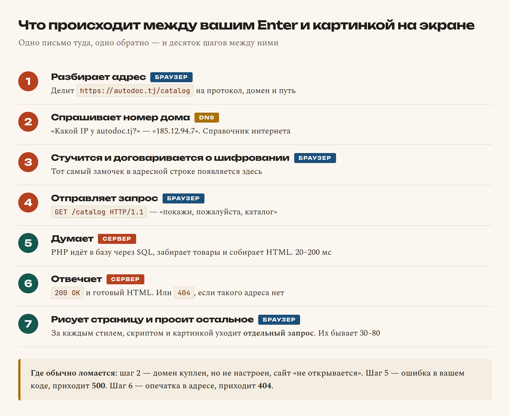

# Глава 2. Как работает интернет

> **Часть I. Знакомство** · Глава 2 из 60
> [← Глава 1](01-chto-takoe-sait.md) · [Глава 3 →](03-instrumenty.md)

## 🎯 Зачем эта глава

Вы вводите в браузере адрес, жмёте Enter — и через полсекунды видите страницу.
Кажется, что там нечего объяснять: нажал и появилось.

На самом деле за эти полсекунды происходит примерно десять отдельных событий,
и каждое из них однажды у вас сломается. Сайт не открывается, картинки не грузятся,
форма отправилась «в никуда», на телефоне работает, а на компьютере нет.

Человек, который не понимает эту цепочку, в такие моменты просто разводит руками.
Человек, который понимает, спокойно спрашивает себя: «так, а на каком шаге сломалось?» —
и находит причину за пять минут.

Поэтому потратим главу на то, что происходит между вашим Enter и картинкой на экране.
Кода снова не будет. Будет понимание, без которого дальше всё превратится в магию.

## 📖 Интернет — это почта

Самое вредное представление об интернете — «где-то там облако, и в нём всё лежит».
Давайте заменим его на правильное.

**Интернет — это почтовая служба.** Огромная, быстрая, но обычная почта.

Есть отправитель. Есть получатель с адресом. Есть письмо с вопросом и письмо с ответом.
Есть курьеры, которые везут письма по маршруту. Всё, никакой магии.

Когда вы открываете сайт, происходит ровно это:

1. Вы (браузер) пишете письмо: «здравствуйте, пришлите мне, пожалуйста, главную страницу».
2. Письмо едет по адресу.
3. Там его читает сервер и готовит ответ.
4. Ответ приезжает обратно.
5. Браузер разворачивает конверт и показывает содержимое.

Одно письмо туда, одно обратно. Это называется **запрос** и **ответ**
(по-английски *request* и *response*). Запомните эту пару — она будет встречаться
в книге сотни раз.



## 📖 Клиент и сервер

Два слова, которые нужно развести раз и навсегда.

**Клиент** — тот, кто просит. В нашем случае это **браузер**: Chrome, Safari, Firefox,
Яндекс.Браузер — любой. Он живёт на вашем телефоне или компьютере.

**Сервер** — тот, у кого просят. Это компьютер, который включён круглосуточно и умеет
отвечать на письма.

И вот тут первое открытие для многих: **сервер — это обычный компьютер**. Не волшебный
ящик. У него есть процессор, память, диск и операционная система. Отличий всего три:

- он не выключается;
- у него нет монитора и клавиатуры — им управляют по сети;
- он стоит не дома, а в дата-центре, где хороший интернет и не пропадает электричество.

**Ваш ноутбук тоже может стать сервером.** Мы это сделаем уже в главе 4: запустим на нём
маленький сервер и откроем собственный сайт. Никакой мистики.

Кстати, «клиент» и «сервер» — это **роли, а не предметы**. Один и тот же компьютер может
быть сервером для одних и клиентом для других. Наш магазин будет сервером для покупателей
и клиентом, когда пойдёт спрашивать цены у поставщика.

## 📖 Что происходит, когда вы жмёте Enter

Теперь подробно. Вы набрали `autodoc.tj` и нажали Enter. Поехали.

### **Шаг 1. Браузер разбирает адрес**

Адрес сайта — это не одно слово, а несколько частей. Возьмём полный вид:

```
https://autodoc.tj/catalog/brakes?page=2
```

| Кусок | Как называется | Что значит |
|---|---|---|
| `https` | протокол | На каком языке разговаривать. `https` — «по-человечески, но зашифрованно» |
| `://` | разделитель | Просто знак, что дальше идёт адрес |
| `autodoc.tj` | домен | Имя дома, куда едем |
| `/catalog/brakes` | путь | Какая именно комната в доме нужна |
| `?page=2` | параметры | Уточнение: «вторая страница» |

Браузер это всё раскладывает и понимает, куда собирается.

### **Шаг 2. Браузер узнаёт настоящий адрес — DNS**

Вот тут интересное. Компьютеры **не умеют** находить друг друга по именам вроде
`autodoc.tj`. Они работают с числами — **IP-адресами**, например `185.12.94.7`.

Имя нужно людям. Число нужно машинам.

Поэтому существует **DNS** — телефонный справочник интернета. Браузер спрашивает:
«какой номер у `autodoc.tj`?» — и получает: «185.12.94.7».

**Аналогия проще некуда.** Вы же не помните номер телефона мамы — вы открываете
контакты и жмёте «Мама». Контакты сами подставляют цифры. DNS — это контакты интернета.

⚠️ Почему это важно знать: если сайт «не открывается», очень часто виноват именно DNS.
Домен купили, но не настроили — и справочник просто не знает, куда вас отправить.
В главе 58 мы это настроим руками.

### **Шаг 3. Браузер стучится в дверь**

Зная IP-адрес, браузер устанавливает **соединение** с сервером. Как позвонить и дождаться,
пока снимут трубку.

Если адрес начинался с `https`, то в этот момент собеседники ещё и договариваются
о шифровании: «давай дальше разговаривать так, чтобы посторонние не поняли».
Именно поэтому в браузере появляется замочек.

**Чем `https` отличается от `http` на бытовом уровне:**

- `http` — открытка. Её может прочитать любой почтальон по дороге.
- `https` — запечатанный конверт. Видно, что письмо едет, но не видно, что внутри.

Пароли и номера карт по открыткам не отправляют. Поэтому сегодня `https` обязателен.

### **Шаг 4. Браузер отправляет запрос**

Наконец само письмо. Выглядит оно примерно так:

```
GET /catalog/brakes HTTP/1.1
Host: autodoc.tj
User-Agent: Chrome
Accept-Language: ru
```

Не пугайтесь, читается легко:

| Строка | Что говорит |
|---|---|
| `GET` | «Дай посмотреть». Это **метод** — тип просьбы |
| `/catalog/brakes` | Что именно дать |
| `HTTP/1.1` | На какой версии языка говорим |
| `Host:` | В какой дом стучимся |
| `User-Agent:` | Кто пришёл: браузер представляется |
| `Accept-Language:` | «Я предпочитаю русский» |

Строки после первой называются **заголовками** — это уточнения к просьбе.

**Методов запроса всего несколько**, и два из них вам понадобятся постоянно:

| Метод | Смысл | Пример из жизни магазина |
|---|---|---|
| **GET** | «Покажи» | Открыть каталог, посмотреть товар |
| **POST** | «Прими и запиши» | Оформить заказ, отправить форму |
| PUT | «Замени целиком» | Обновить карточку товара |
| DELETE | «Удали» | Удалить товар из корзины |

Разницу GET и POST разберём подробно в главе 24, когда будем делать формы.
Пока запомните так: **GET смотрит, POST меняет**.

### **Шаг 5. Сервер думает**

Письмо дошло. Сервер его прочитал и понял: просят страницу каталога тормозных колодок.

И вот здесь просыпается всё то, о чём мы говорили в первой главе. Запускается **PHP**.
Он идёт в **базу данных** с запросом на **SQL**, получает список товаров, подставляет
их в шаблон и собирает **HTML**.

Занимает это обычно от 20 до 200 миллисекунд. Если дольше — пользователи начинают
уходить, и в главе 30 мы будем разбираться, почему тормозит.

### **Шаг 6. Сервер отвечает**

Ответ выглядит так:

```
HTTP/1.1 200 OK
Content-Type: text/html; charset=UTF-8

<!DOCTYPE html>
<html>
  <head><title>Тормозные колодки</title></head>
  <body>...</body>
</html>
```

Сверху — служебная часть, снизу, после пустой строки, — сам HTML.

**`200 OK`** — это **код ответа**. Сервер всегда сообщает, чем закончилось дело.
Вот те коды, которые вы будете видеть каждый день:

| Код | Что означает | Когда вы его встретите |
|---|---|---|
| **200** | Всё хорошо, вот страница | Обычная работа |
| **301 / 302** | Переехали, идите по другому адресу | Перенаправление, например с `http` на `https` |
| **403** | Вижу вас, но не пущу | Полез в админку без прав |
| **404** | Такой страницы нет | Опечатка в адресе, удалённый товар |
| **500** | Сервер сам сломался | **Ошибка в вашем коде.** Самый частый гость новичка |
| **503** | Сервер перегружен | Слишком много посетителей разом |

Запомните различие, оно экономит часы: **404 — вы ошиблись адресом. 500 — ошиблись вы,
но в коде.** Первое лечится ссылкой, второе — чтением логов (глава 56).

### **Шаг 7. Браузер рисует страницу**

HTML приехал. Браузер читает его сверху вниз и строит из него страницу.

Но HTML — это только текст. По дороге ему встречаются ссылки на другие файлы:
стили, картинки, скрипты. И за каждым файлом браузер **отправляет отдельный запрос**.

Вот это открытие обычно удивляет: одна страница — это не одно письмо, а **десятки**.

```
Запрос 1  → сама страница (HTML)
Запрос 2  → файл стилей (CSS)
Запрос 3  → скрипт (JavaScript)
Запрос 4  → логотип
Запрос 5  → фото товара №1
Запрос 6  → фото товара №2
...и так далее
```

Обычная страница магазина — это 30-80 запросов. Поэтому сайты и «весят»: не текст
тяжёлый, а картинки, которых много.

### **Шаг 8. Оживает JavaScript**

Последним включается JavaScript и начинает следить за действиями: клики, ввод,
прокрутка. Страница из картинки превращается в живую.

## 🔤 Разбор по словам

Собрали много новых слов. Разложим по полочкам — это ваш словарь на все оставшиеся главы.

| Слово | Как читается | Что это простыми словами |
|---|---|---|
| **HTTP** | «эйч-ти-ти-пи» | Язык, на котором браузер разговаривает с сервером. Правила переписки |
| **HTTPS** | «эйч-ти-ти-пи-эс» | То же самое, но зашифрованное. `S` — от *secure*, «безопасный» |
| **Запрос** (request) | | Письмо от браузера к серверу: «дай мне вот это» |
| **Ответ** (response) | | Письмо обратно: «вот, держи» или «не могу, вот почему» |
| **Клиент** | | Тот, кто просит. Обычно браузер |
| **Сервер** | | Тот, у кого просят. Компьютер, который всегда включён |
| **IP-адрес** | «ай-пи» | Номер компьютера в сети: `185.12.94.7` |
| **Домен** | | Человеческое имя сайта: `autodoc.tj` |
| **DNS** | «ди-эн-эс» | Справочник, который переводит имя в номер |
| **Хостинг** | | Услуга: вам сдают в аренду место на сервере |
| **Заголовки** (headers) | | Уточнения к письму: кто я, что понимаю, на каком языке |
| **GET** | «гет» | Метод «покажи» |
| **POST** | «пост» | Метод «прими и запиши» |
| **Код ответа** | | Число-итог: 200 — хорошо, 404 — нет такого, 500 — сломалось |
| **Порт** | | Номер двери в доме. У `http` дверь 80, у `https` — 443 |

**Про порт чуть подробнее**, потому что он вам скоро встретится. Если IP-адрес — это дом,
то порт — квартира в этом доме. На одном компьютере может работать несколько программ,
и каждая слушает свою дверь. Когда в главе 4 мы запустим сервер на своём компьютере,
адрес будет выглядеть как `localhost:8000` — вот `8000` и есть номер двери.

А `localhost` — это «мой собственный компьютер». Всегда. На любой машине.
Его IP — `127.0.0.1`, и он тоже всегда один и тот же.

## 🖥 Посмотрите на это своими глазами

Всё описанное можно увидеть прямо сейчас, без единой строчки кода.

1. Откройте любой сайт в Chrome.
2. Нажмите **F12** (на Mac — **Cmd+Option+I**). Откроется панель разработчика.
3. Перейдите на вкладку **Network** («Сеть»).
4. Обновите страницу клавишей **F5**.

Вы увидите список — это все те самые запросы. Каждая строка: имя файла, код ответа,
размер, сколько миллисекунд занял.

Пощёлкайте по строкам. Справа откроются заголовки запроса и ответа — те же самые,
что мы разбирали выше, только настоящие.

**Это не учебная симуляция. Это реальная переписка вашего браузера с сервером.**
Профессиональные разработчики смотрят в эту вкладку каждый день.

## ⚠️ Грабли

**«Сайт лежит» — а на самом деле нет.**
Прежде чем паниковать, откройте его в другом браузере, с телефона по мобильному
интернету и в режиме инкогнито. Очень часто «лежит» только у вас: кэш, DNS,
провайдер, старая версия страницы.

**Кэш — ваш главный обманщик.**
Браузер запоминает файлы, чтобы не качать их дважды. Полезно для скорости, вредно
при разработке: вы поправили стили, а браузер показывает старые. Лечится
жёстким обновлением: **Ctrl+F5** (на Mac **Cmd+Shift+R**). Запомните эту комбинацию —
она сэкономит вам десятки часов недоумения.

**Путать 404 и 500.**
404 — «я не нашёл такой адрес». 500 — «я нашёл, но при выполнении всё упало».
Это разные проблемы и разные места поиска.

**Думать, что `https` защищает сайт от взлома.**
Не защищает. `https` шифрует только дорогу между браузером и сервером. Если в вашем
коде дыра, шифрование канала не поможет никак. Безопасностью займёмся в главе 36.

**Считать, что домен и хостинг — одно и то же.**
Домен — это имя. Хостинг — это место, где живёт сайт. Покупаются отдельно, часто
у разных компаний. Как отдельно взять номер телефона и отдельно снять квартиру.

## 🏋️ Задачи

**Задача 2.1.** Разберите адрес на части — назовите протокол, домен, путь и параметры:
`https://autodoc.tj/search?q=kolodki&brand=bosch`

**Задача 2.2.** Какой код ответа вы получите в каждом случае?

1. Открыли главную страницу работающего сайта.
2. Ошиблись в адресе на одну букву.
3. Программист забыл точку с запятой, и PHP упал.
4. Зашли в админку, не будучи администратором.

**Задача 2.3.** Откройте панель разработчика (F12 → Network) на любимом сайте
и обновите страницу. Сколько всего запросов ушло? Какой файл оказался самым тяжёлым?
Запишите числа — в главе 57 мы вернёмся к ним, когда будем ускорять свой сайт.

**Задача 2.4.** Объясните своими словами, что такое DNS. Одно предложение,
без слова «DNS».

**Задача 2.5.** Что произойдёт, если DNS сломается, а сайт при этом работает?
Сможете ли вы попасть на сайт вообще?

**Задача 2.6.** Почему форму оформления заказа отправляют методом POST, а не GET?
Подсказка: подумайте, что окажется в адресной строке браузера.

*Ответы — в [Приложении Г](../prilozheniya/4-G-otvety.md).*

## 🔗 В бою

В коде autodoc.tj эта глава встречается буквально везде.

Загляните в любой файл в папке `api/` — например `api/vin_order_request.php`.
Первые строки почти каждого такого файла проверяют **метод запроса**:

```php
if ($_SERVER['REQUEST_METHOD'] !== 'POST') {
    http_response_code(405);
    exit;
}
```

Дословно: «если пришли не методом POST — верни код 405 („метод не разрешён“)
и заканчивай». Это защита: страницу, которая создаёт заказ, нельзя открывать
простой ссылкой.

Через двадцать глав вы будете писать такие проверки не задумываясь.

## 📌 Итог

- Интернет — это почта. **Запрос** туда, **ответ** обратно.
- **Клиент** просит (браузер), **сервер** отвечает. Сервер — обычный компьютер,
  который не выключают.
- **DNS** переводит имя `autodoc.tj` в номер `185.12.94.7`. Как контакты в телефоне.
- **HTTP** — язык переписки. **GET** смотрит, **POST** записывает.
- **Коды ответа**: 200 — хорошо, 404 — нет адреса, 500 — сломался код, 403 — не пущу.
- Одна страница — это десятки запросов: HTML, стили, скрипты, каждая картинка.
- **F12 → Network** показывает всю эту переписку вживую. Пользуйтесь.
- **Ctrl+F5** обновляет страницу мимо кэша. Запомните прямо сейчас.

В следующей главе перестанем читать и наконец возьмём инструменты в руки.

[← Глава 1](01-chto-takoe-sait.md) · [Глава 3. Инструменты →](03-instrumenty.md)
