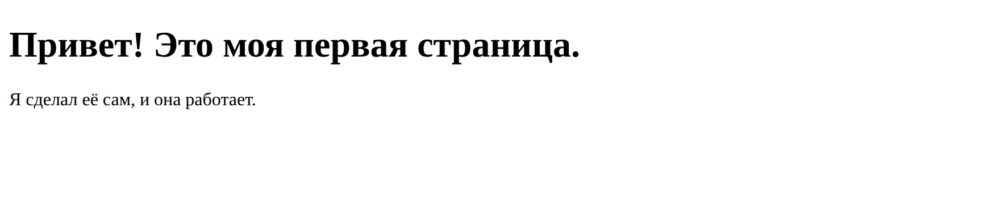
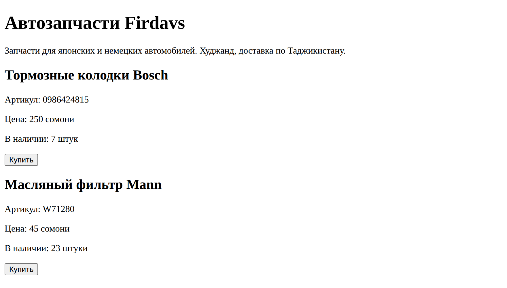

# Глава 4. Первый файл на экране

> **Часть I. Знакомство** · Глава 4 из 60
> [← Глава 3](03-instrumenty.md) · [Глава 5 →](05-teg-i-struktura.md)

## 🎯 Зачем эта глава

Три главы мы читали. Хватит.

Сейчас вы сделаете страницу, откроете её в браузере и увидите на экране то,
что написали своими руками. Это займёт минут пятнадцать.

Момент, когда браузер впервые показывает **вашу** страницу, — важный. Не потому,
что страница получится красивой (она получится страшной), а потому, что с этой секунды
интернет перестаёт быть чем-то, что делают «где-то там другие люди».

Единственная просьба: **набирайте руками**. Не копируйте мышкой. Пальцы запоминают
синтаксис быстрее, чем глаза.

## 📖 Делаем страницу

### **Шаг 1. Заводим папку**

Откройте терминал и выполните (или сделайте то же самое мышкой в проводнике):

```bash
cd ~
mkdir -p projects/moi-magazin
cd projects/moi-magazin
```

Мы в папке будущего магазина. Отсюда и начнём.

### **Шаг 2. Открываем папку в редакторе**

Запустите VS Code, выберите *Файл → Открыть папку* и укажите `projects/moi-magazin`.

Слева появится пустое дерево файлов. Это ваш проект.

**Почему открывать именно папку, а не файл:** редактор тогда видит весь проект целиком —
может искать по всем файлам, подсказывать пути, показывать структуру. Привыкайте
работать папками.

### **Шаг 3. Создаём файл**

В панели слева нажмите иконку «новый файл» и назовите его:

```
index.html
```

Имя важное, не придумывайте своё. **`index.html` — это имя по умолчанию.**
Когда браузер приходит по адресу сайта, а конкретная страница не указана,
сервер отдаёт именно `index.html`. Как «главная дверь» дома.

### **Шаг 4. Пишем**

Наберите это. Именно наберите:

```html
<!DOCTYPE html>
<html lang="ru">
<head>
    <meta charset="UTF-8">
    <title>Моя первая страница</title>
</head>
<body>
    <h1>Привет! Это моя первая страница.</h1>
    <p>Я сделал её сам, и она работает.</p>
</body>
</html>
```

Сохраните: **Ctrl+S** (на Mac **Cmd+S**).

### **Шаг 5. Открываем в браузере**

Найдите файл в проводнике и **дважды щёлкните** по нему. Откроется браузер.

Вот что вы увидите:



Работает. Вы только что сделали веб-страницу.

Посмотрите на адресную строку — там будет что-то вроде
`file:///Users/firdavs/projects/moi-magazin/index.html`. Обратите внимание на `file://` —
это значит «файл с моего компьютера», а не из интернета. Пока так и нужно.

## 🔤 Разбор по словам

Теперь разберём каждую строчку. Ни одна не написана «просто потому что».

### **Строка 1: `<!DOCTYPE html>`**

```html
<!DOCTYPE html>
```

Читается «доктайп эйч-ти-эм-эл». Это **не тег**, а объявление: «дорогой браузер,
дальше идёт современный HTML, показывай по современным правилам».

Зачем нужно: если его не написать, браузер включит «режим совместимости» — притворится
браузером из 1999 года. Вёрстка поедет, и вы будете долго искать причину.

Пишется **всегда первой строкой**, ровно так, один раз на страницу. Больше о нём
думать не нужно.

### **Строки 2: `<html lang="ru">`**

```html
<html lang="ru">
```

| Часть | Что это |
|---|---|
| `<html>` | **Корневой элемент.** Внутри него живёт вся страница. Открывается в начале, закрывается в самом конце |
| `lang="ru"` | **Атрибут.** Сообщает: содержимое на русском |

Вот и новое понятие — **атрибут**.

**Атрибут — это уточнение к тегу.** Пишется внутри уголков, после имени тега,
в формате `имя="значение"`.

Аналогия: тег — это существительное, атрибут — прилагательное. `<html>` — «страница»,
`lang="ru"` — «русскоязычная».

Зачем `lang` на практике: браузер поймёт, на каком языке текст, и правильно предложит
перевод. Программы для незрячих прочитают текст с русским произношением, а не с английским.
Поисковики покажут ваш сайт русскоязычным пользователям.

### **Строки 3–6: `<head>` — служебная часть**

```html
<head>
    <meta charset="UTF-8">
    <title>Моя первая страница</title>
</head>
```

`<head>` («хед», голова) — это **служебная информация о странице**. Всё, что внутри
`<head>`, на самой странице **не видно**.

Аналогия: это как поля на конверте — адрес, индекс, марка. Само письмо внутри,
а это данные о письме.

| Строка | Что делает |
|---|---|
| `<meta charset="UTF-8">` | **Кодировка.** Объясняет браузеру, как понимать буквы |
| `<title>` | **Название страницы.** Оно видно на вкладке браузера и в результатах поиска |

**Про `charset="UTF-8"` — запомните намертво.**

Компьютер хранит не буквы, а числа. Кодировка — это таблица «какое число какой букве
соответствует». UTF-8 — таблица, в которой есть всё: русский, английский, таджикский,
китайский, эмодзи.

Если эту строчку не написать, браузер начнёт гадать. И русский текст превратится в
`привет` — знаменитые «кракозябры».

Правило: **`<meta charset="UTF-8">` пишется всегда, в каждом файле, без исключений.**

Заметьте ещё: у `<meta>` **нет закрывающего тега**. Такие теги называются
**одиночными** — им нечего в себе содержать, они сами по себе законченная команда.
Одиночных тегов немного: `<meta>`, ``, `<br>`, `<input>`, `<hr>`.

### **Строки 7–10: `<body>` — то, что видно**

```html
<body>
    <h1>Привет! Это моя первая страница.</h1>
    <p>Я сделал её сам, и она работает.</p>
</body>
```

`<body>` («боди», тело) — **всё видимое содержимое страницы**. Текст, картинки, кнопки,
меню — всё живёт здесь.

Правило простое: **не видно на экране → это в `<head>`. Видно → это в `<body>`.**

`<h1>` и `<p>` вы уже встречали в первой главе: заголовок и абзац.

### **Общая схема любой HTML-страницы**

```
<!DOCTYPE html>            ← «дальше современный HTML»
<html>                     ← вся страница
    <head>                 ← служебное, невидимое
        кодировка
        название вкладки
    </head>
    <body>                 ← видимое содержимое
        заголовки
        текст
        картинки
    </body>
</html>
```

Эта структура **одинакова у всех страниц в интернете**. Откройте код любого сайта —
увидите её же. Через неделю вы будете набирать её не задумываясь.

### **Про отступы**

Заметили, что строки внутри `<head>` сдвинуты вправо? Это **отступы**, и они делаются
специально.

Браузеру они не нужны — ему всё равно. Отступы нужны **человеку**: по ним сразу видно,
что внутри чего лежит.

Правило: **каждый вложенный уровень сдвигается вправо** (обычно на 4 пробела или Tab).

Код без отступов — как текст без абзацев и знаков препинания: прочитать можно,
но мучительно.

## 📖 Делаем страницу похожей на магазин

Первая страница работает. Теперь наполним её чем-то осмысленным.

Замените содержимое `<body>` на это:

```html
<body>
    <h1>Автозапчасти Firdavs</h1>
    <p>Запчасти для японских и немецких автомобилей. Худжанд, доставка по Таджикистану.</p>

    <h2>Тормозные колодки Bosch</h2>
    <p>Артикул: 0986424815</p>
    <p>Цена: 250 сомони</p>
    <p>В наличии: 7 штук</p>
    <button>Купить</button>

    <h2>Масляный фильтр Mann</h2>
    <p>Артикул: W71280</p>
    <p>Цена: 45 сомони</p>
    <p>В наличии: 23 штуки</p>
    <button>Купить</button>
</body>
```

Не забудьте поменять и `<title>` — пусть будет «Автозапчасти — мой магазин».

Сохраните и **обновите страницу в браузере** клавишей **F5**.

## 🖥 На экране



Вот честный результат — ровно то, что вы увидите у себя.

Давайте признаем прямо: **выглядит ужасно.** Чёрный текст на белом, всё в одну колонку,
кнопки серые и системные. Ни один покупатель на таком сайте ничего не купит.

**И это абсолютно правильный результат.** Потому что мы написали только HTML —
а HTML отвечает за содержание, не за красоту. Помните первую главу? Скелет.

Смотрите, что при этом **уже работает**:

- заголовки крупнее обычного текста, а `<h1>` крупнее `<h2>`;
- абзацы отделены друг от друга воздухом;
- кнопки нажимаются — можете щёлкнуть, они «продавливаются»;
- на вкладке браузера видно название из `<title>`;
- русский текст читается, кракозябр нет — спасибо `charset="UTF-8"`.

Всё это браузер сделал сам, по умолчанию, потому что вы **правильно назвали части**.
Сказали «это заголовок» — он и оформлен как заголовок.

Красоту наведём в третьей части, начиная с главы 9. За один вечер эта же страница
превратится в нормальный магазин. Но фундамент — вот он, уже стоит.

## ⚠️ Грабли

**Открылся текст кода вместо страницы.**
Файл сохранился как `index.html.txt`. На Windows расширения по умолчанию скрыты.
Лечение: Проводник → Вид → поставить галочку «Расширения имён файлов», потом
переименовать.

**Вместо русского — `привет`.**
Забыли `<meta charset="UTF-8">` или сохранили файл не в UTF-8. VS Code по умолчанию
сохраняет правильно, так что почти всегда дело в забытой строчке.

**Поменял файл, а в браузере всё по-старому.**
Сначала проверьте, что файл сохранён (в VS Code у несохранённого файла точка на вкладке).
Потом нажмите **Ctrl+F5** — обновление мимо кэша.

**Забыл закрыть тег.**
Написали `<h1>` и не написали `</h1>` — дальше вся страница станет огромным заголовком.
Браузер не ругается, он просто делает как понял. VS Code обычно закрывает теги сам,
но проверять полезно.

**Кавычки «не те».**
Атрибуты пишутся в **прямых** кавычках: `lang="ru"`. Если скопировать код из Word
или мессенджера, кавычки могут превратиться в «ёлочки» — и атрибут сломается.
Ещё один довод набирать руками.

## 🏋️ Задачи

**Задача 4.1.** Сделайте страницу из главы у себя. Убедитесь, что она открывается
и русский текст читается.

**Задача 4.2.** Поменяйте `<title>` на своё имя. Сохраните, обновите браузер.
Где именно изменился текст? (Подсказка: смотрите не на страницу.)

**Задача 4.3.** Добавьте в каталог третий товар — на ваш выбор, с названием, артикулом,
ценой и наличием. Скопируйте структуру существующих.

**Задача 4.4.** Специально сломайте страницу и посмотрите, что будет:

1. Уберите `</h1>` у первого заголовка. Обновите. Что стало со страницей?
2. Верните обратно.
3. Уберите строку `<meta charset="UTF-8">`. Обновите. Что стало с русским текстом?
4. Верните обратно.

Ломать специально — лучший способ понять, зачем нужна каждая строчка.
Так вы потом узна́ете симптом мгновенно.

**Задача 4.5.** Попробуйте `<h1>`, `<h2>`, `<h3>`, `<h4>`, `<h5>`, `<h6>` подряд
с одинаковым текстом. Как меняется размер?

**Задача 4.6.** Откройте свою страницу и нажмите **F12 → Elements**. Найдите там
`<h1>`, который написали. Разверните дерево. Узнаёте свою структуру?

**Задача 4.7.** Откройте на любом крупном сайте код страницы (правая кнопка →
«Посмотреть код страницы») и найдите в нём `<!DOCTYPE html>`, `<head>`, `<body>`
и `<meta charset`. Убедитесь: у всех одно и то же.

*Ответы — в [Приложении Г](../prilozheniya/4-G-otvety.md).*

## 🔗 В бою

Откройте в этом репозитории файл `index.php` — главную страницу настоящего магазина.

Кода там много и он пока непонятен. Но найдите глазами `<head>`, `<meta charset`,
`<title>` и `<body>`. Они там есть, ровно в том же порядке, что и в вашем файле.

Разница между вашей страницей и боевой — не в структуре. Структура одна.
Разница в количестве наполнения. А его мы будем добавлять шестьдесят глав.

## 📌 Итог

- Страница называется **`index.html`** — это имя главной по умолчанию.
- `<!DOCTYPE html>` — первая строка всегда, включает современный режим.
- `<html lang="ru">` — вся страница, язык русский.
- `<head>` — служебное и невидимое: кодировка, название вкладки.
- `<body>` — всё, что видно человеку.
- **`<meta charset="UTF-8">` обязателен**, иначе русский превратится в кракозябры.
- **Атрибут** — уточнение к тегу: `имя="значение"`.
- **Одиночные теги** (`<meta>`, ``, `<br>`) не закрываются.
- **Отступы** нужны человеку, а не браузеру. Делайте их всегда.
- Страница без CSS выглядит ужасно — и это нормально. HTML отвечает за смысл.

Со следующей главы начинается настоящий HTML: разберём теги по-серьёзному
и научимся размечать что угодно.

[← Глава 3](03-instrumenty.md) · [Глава 5. Теги и структура документа →](05-teg-i-struktura.md)
