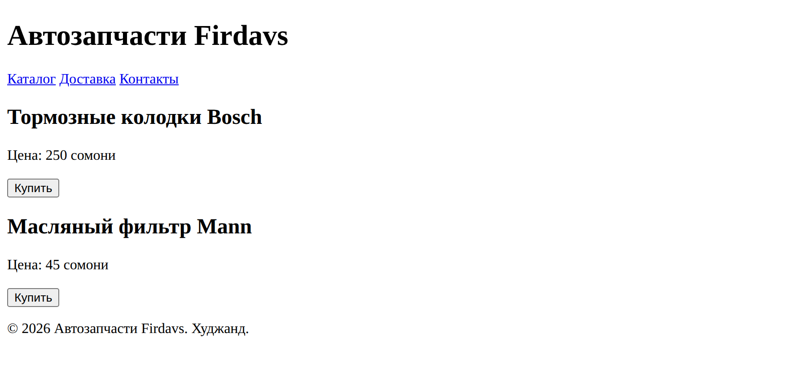

# Глава 5. Теги и структура документа

> **Часть II. HTML — скелет страницы** · Глава 5 из 60
> [← Глава 4](04-pervyi-fail.md) · [Глава 6 →](06-tekst-ssylki-kartinki.md)

## 🎯 Зачем эта глава

В прошлой главе вы написали страницу и она заработала. Но написали вы её «по образцу» —
как переписывают иероглифы, не зная языка.

Пора выучить язык. В этой главе разберёмся:

- что такое тег на самом деле и по каким правилам он живёт;
- почему одни элементы занимают всю строку, а другие — только своё место;
- зачем нужны `<div>` и `<span>`, если они ничего не делают;
- и главное — что такое **семантика** и почему из-за неё сайты попадают или не попадают
  в поиск.

После этой главы вы перестанете «списывать» и начнёте писать HTML осмысленно.

## 📖 Что такое тег

**Тег — это метка, которой вы называете кусок содержимого.**

Вы не «рисуете заголовок». Вы **говорите браузеру: вот это — заголовок**. А как его
показать, браузер решит сам.

```html
<h1>Автозапчасти Firdavs</h1>
```

Здесь три части:

| Часть | Название | Что делает |
|---|---|---|
| `<h1>` | **открывающий тег** | «Внимание, начинается заголовок» |
| `Автозапчасти Firdavs` | **содержимое** | То, что видит человек |
| `</h1>` | **закрывающий тег** | «Заголовок закончился» |

Всё вместе — **элемент**.

### **Правило вложенности**

Элементы можно класть друг в друга. Но **закрывать нужно в обратном порядке** —
как матрёшки.

**Правильно:**

```html
<p>Цена: <strong>250 сомони</strong></p>
```

Открыли `<p>`, внутри открыли `<strong>`, закрыли `</strong>`, потом закрыли `</p>`.
Внутренняя матрёшка закрылась первой.

**Неправильно:**

```html
<p>Цена: <strong>250 сомони</p></strong>
```

Тут `<p>` закрылся раньше, чем `<strong>`. Браузер не выдаст ошибку — он попытается
догадаться. И часто догадается неправильно, а вы полчаса будете искать, почему поехала
вёрстка.

**Запомните так:** что открыли последним — закрываете первым.

### **Атрибуты — уточнения к тегу**

Атрибут добавляет тегу подробностей. Пишется внутри открывающего тега:

```html
<html lang="ru">

<a href="/catalog">Каталог</a>
```

Формула всегда одна:

```
имя="значение"
```

| Правило | Пояснение |
|---|---|
| Кавычки **прямые** | `lang="ru"`, а не `lang=«ru»` |
| Атрибутов может быть много | Разделяются пробелом |
| Порядок не важен | `` = `` |
| Некоторые атрибуты без значения | `<input required>` — просто «обязательное» |

**Два атрибута, которые есть почти у любого тега** и понадобятся в главе 9:

- **`class`** — «этот элемент относится к такой-то группе». По классу CSS будет
  находить элементы и красить: `<div class="tovar">`.
- **`id`** — «у этого элемента уникальное имя». На странице `id` должен быть один:
  `<div id="korzina">`.

Разница простая: **класс — как «студент группы 101»** (таких много).
**`id` — как номер паспорта** (такой один).

## 📖 Блочные и строчные элементы

Вот важное различие, которое объясняет половину «непонятного поведения» вёрстки.

### **Блочные — занимают всю строку**

Блочный элемент **всегда начинается с новой строки и растягивается на всю ширину**,
даже если содержимого в нём одно слово.

Примеры: `<h1>`…`<h6>`, `<p>`, `<div>`, `<ul>`, `<table>`, `<form>`.

Аналогия: **абзац в книге**. Даже если в нём одно слово, он всё равно занимает
отдельную строку и никого рядом не пускает.

### **Строчные — занимают только своё место**

Строчный элемент **встраивается в строку** и занимает ровно столько, сколько нужно
его содержимому.

Примеры: `<a>`, `<strong>`, `<em>`, `<span>`, ``.

Аналогия: **выделенное слово в предложении**. Оно внутри строки, не разрывает её.

### **Сравните на примере**

```html
<p>Первый абзац</p>
<p>Второй абзац</p>
```

Встанут **друг под другом**, потому что `<p>` — блочный.

```html
<strong>Первое</strong>
<strong>Второе</strong>
```

Встанут **в одну строку**, потому что `<strong>` — строчный.

**Практический вывод.** Когда вы недоумеваете «почему эти два блока не встают рядом»
или «почему кнопка растянулась на весь экран» — почти всегда ответ здесь.
В главе 11 мы научимся управлять этим через CSS.

## 📖 `<div>` и `<span>` — коробки без смысла

Два тега, которые вы будете использовать чаще всех.

| Тег | Тип | Смысл | Зачем |
|---|---|---|---|
| `<div>` | блочный | никакого | Сгруппировать блок содержимого |
| `<span>` | строчный | никакого | Выделить кусочек внутри строки |

Оба **ничего не означают и никак не выглядят**. Это чистые контейнеры.

### **Зачем нужна пустая коробка**

Возьмём карточку товара из прошлой главы:

```html
<h2>Тормозные колодки Bosch</h2>
<p>Артикул: 0986424815</p>
<p>Цена: 250 сомони</p>
<button>Купить</button>
```

Четыре отдельных элемента. Браузер не знает, что они связаны — для него это просто
заголовок, два абзаца и кнопка, идущие подряд.

Заворачиваем в коробку:

```html
<div class="tovar">
    <h2>Тормозные колодки Bosch</h2>
    <p>Артикул: 0986424815</p>
    <p>Цена: 250 сомони</p>
    <button>Купить</button>
</div>
```

Теперь это **одна вещь**, у которой есть имя — `tovar`. И можно сказать одной строчкой
CSS: «все элементы с классом `tovar` сделать белыми, с рамкой, скруглёнными углами
и отступом». Все карточки оформятся разом.

### **А `<span>` зачем**

Когда нужно выделить кусочек **внутри** строки:

```html
<p>Цена: <span class="cena">250</span> сомони</p>
```

Теперь можно покрасить только число, не трогая слова вокруг.

**Правило выбора:** нужно завернуть блок содержимого — `<div>`. Нужно выделить пару
слов внутри текста — `<span>`.

## 📖 Семантика: главная идея HTML

А вот теперь — самое важное в этой главе.

### **Проблема**

Технически можно построить весь сайт из `<div>`. Вообще весь:

```html
<div class="zagolovok">Автозапчасти</div>
<div class="menu">Каталог Доставка Контакты</div>
<div class="tovar">Колодки Bosch</div>
<div class="podval">© 2026</div>
```

Работать будет. Выглядеть после CSS — прилично. Но это плохой код, и вот почему.

**Для браузера, поисковика и программы для незрячих это четыре одинаковые безымянные
коробки.** Слово `zagolovok` в атрибуте `class` ничего им не говорит — они читают теги,
а не ваши выдумки. С тем же успехом там могло быть написано `korobka1`.

### **Решение: теги, у которых есть смысл**

В HTML есть **семантические теги** — теги со значением. Вместо безымянной коробки
вы говорите, что это за часть страницы:

| Тег | Что означает | Что было бы вместо |
|---|---|---|
| `<header>` | Шапка: логотип, название | `<div class="header">` |
| `<nav>` | Меню, навигация | `<div class="menu">` |
| `<main>` | Основное содержимое страницы | `<div class="content">` |
| `<article>` | Самостоятельный кусок: товар, статья | `<div class="item">` |
| `<section>` | Раздел страницы | `<div class="block">` |
| `<aside>` | Боковая колонка, дополнительное | `<div class="sidebar">` |
| `<footer>` | Подвал: контакты, копирайт | `<div class="footer">` |

Пишутся они **точно так же**, как `<div>`, и ведут себя так же — блочные, без вида.
Разница только в одном: **у них есть смысл**.

### **Как выглядит правильная страница**

```html
<body>
    <header>
        <h1>Автозапчасти Firdavs</h1>
    </header>

    <nav>
        <a href="/catalog">Каталог</a>
        <a href="/delivery">Доставка</a>
        <a href="/contacts">Контакты</a>
    </nav>

    <main>
        <article>
            <h2>Тормозные колодки Bosch</h2>
            <p>Цена: 250 сомони</p>
            <button>Купить</button>
        </article>

        <article>
            <h2>Масляный фильтр Mann</h2>
            <p>Цена: 45 сомони</p>
            <button>Купить</button>
        </article>
    </main>

    <footer>
        <p>© 2026 Автозапчасти Firdavs. Худжанд.</p>
    </footer>
</body>
```



Выглядит так же скучно, как раньше, — семантика не про внешность. Но теперь структура
страницы **читается** по одному только коду.

### **Что вы за это получаете**

Три очень практичных выигрыша:

**1. Поисковики понимают страницу.**
Google видит `<main>` и знает: вот здесь главное, а `<nav>` и `<footer>` можно
не учитывать. Правильная семантика — часть SEO, то есть попадания сайта в поиск.

**2. Незрячие люди могут пользоваться сайтом.**
Программы-чтецы умеют перепрыгивать по разделам: «перейти к основному содержимому»,
«перейти к меню». Если у вас одни `<div>`, прыгать не по чему — человек вынужден
слушать всё подряд, включая меню на каждой странице.

**3. Код читаемый.**
Через полгода вы откроете свой файл. `</div></div></div></div>` в конце — ад.
`</main></body>` — понятно.

**Правило на всю жизнь:** *есть подходящий по смыслу тег — берите его.
`<div>` — когда подходящего нет.*

## 🔤 Разбор по словам

Новые слова этой главы, собранные вместе:

| Слово | Что означает |
|---|---|
| **Тег** | Метка в уголках: `<p>` |
| **Элемент** | Открывающий тег + содержимое + закрывающий |
| **Атрибут** | Уточнение внутри тега: `class="tovar"` |
| **Вложенность** | Элементы внутри элементов, как матрёшки |
| **Блочный** | Занимает всю строку: `<div>`, `<p>`, `<h1>` |
| **Строчный** | Занимает своё место в строке: `<span>`, `<a>`, `<strong>` |
| **Семантика** | Смысл тега. `<header>` вместо `<div class="header">` |
| **`class`** | Имя группы. Таких может быть много |
| **`id`** | Уникальное имя. Такой один на странице |

## ⚠️ Грабли

**Ставить `<h1>` несколько раз.**
`<h1>` — главный заголовок страницы, он **один**. Дальше по убыванию: `<h2>` для разделов,
`<h3>` внутри них. Не прыгайте через уровень (`<h1>` → `<h3>`) и не выбирайте заголовок
по размеру — размер настроим в CSS.

**Выбирать тег по внешнему виду.**
«Мне нужен мелкий текст, возьму `<h6>`» — так нельзя. Тег выбирают **по смыслу**,
внешний вид задаёт CSS. Это ошибка, которую совершают почти все новички.

**Заворачивать всё подряд в лишние `<div>`.**
Если внутри коробки лежит ровно один элемент и коробка ничего не группирует —
она не нужна. Лишние обёртки делают код нечитаемым.

**Пробел внутри тега.**
`< p>` — не сработает. Между `<` и именем тега пробела быть не должно.

**Русские буквы в `class` и `id`.**
Технически возможно, практически — источник проблем. Только латиница:
`class="tovar"`, а не `class="товар"`.

## 🏋️ Задачи

**Задача 5.1.** Перепишите свою страницу из главы 4, добавив семантические теги:
`<header>` с названием магазина, `<nav>` с тремя ссылками, `<main>` с товарами
(каждый в `<article>`), `<footer>` с копирайтом.

**Задача 5.2.** Для каждого определите — блочный или строчный:
`<p>`, `<span>`, `<div>`, `<a>`, `<h2>`, `<strong>`, `<article>`, `<em>`.

**Задача 5.3.** Найдите ошибку и объясните, в чём она:

```html
<p>Цена: <strong>250 сомони</p></strong>
```

**Задача 5.4.** Замените `<div>` на подходящий семантический тег:

```html
<div class="header">...</div>
<div class="menu">...</div>
<div class="content">...</div>
<div class="sidebar">...</div>
<div class="footer">...</div>
```

**Задача 5.5.** В каком случае берут `<div>`, а в каком `<span>`? Приведите свой
пример на каждый.

**Задача 5.6.** Откройте крупный интернет-магазин, нажмите F12 → Elements и поищите
теги `<header>`, `<nav>`, `<main>`, `<footer>`. Есть ли они? У некоторых крупных сайтов
их нет — сплошные `<div>`. Как думаете, почему так вышло?

**Задача 5.7.** Объясните своими словами, почему `<div class="zagolovok">` хуже,
чем `<h1>`. Два предложения.

*Ответы — в [Приложении Г](../prilozheniya/G-otvety.md).*

## 🔗 В бою

Откройте `index.php` в корне репозитория и поищите в нём `<div class=`. Найдёте много.

Это правда жизни: боевой код никогда не бывает идеальным. Сайт autodoc.tj построен
на готовом шаблоне Mazlay, а шаблоны обычно щедры на `<div>`.

Важный вывод, который стоит усвоить сразу: **работающий код с недостатками лучше,
чем идеальный код, которого нет.** Стремитесь к семантике в том, что пишете сами,
но не переписывайте рабочий сайт ради красоты — у бизнеса есть задачи поважнее.

## 📌 Итог

- **Элемент** = открывающий тег + содержимое + закрывающий.
- Вложенность закрывается **в обратном порядке**, как матрёшки.
- **Атрибут** — уточнение: `имя="значение"`, кавычки прямые.
- **`class`** — имя группы (много), **`id`** — уникальное имя (один).
- **Блочные** занимают всю строку, **строчные** — только своё место.
- **`<div>`** — блочная коробка, **`<span>`** — строчная. Обе без смысла.
- **Семантика**: `<header>`, `<nav>`, `<main>`, `<article>`, `<footer>` — то же самое,
  но со смыслом. Нужны для поиска, для незрячих и для читаемости.
- Тег выбирают **по смыслу**, а не по внешнему виду.

В следующей главе наполним каркас содержимым: текст, ссылки, картинки и списки.

[← Глава 4](04-pervyi-fail.md) · [Глава 6. Текст, ссылки, картинки, списки →](06-tekst-ssylki-kartinki.md)
