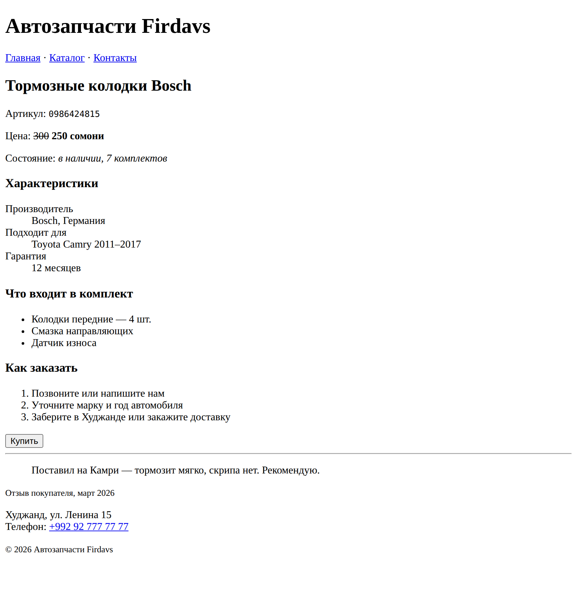

# Глава 6. Текст, ссылки, картинки, списки

> **Часть II. HTML — скелет страницы** · Глава 6 из 60
> [← Глава 5](05-teg-i-struktura.md) · [Глава 7 →](07-tablicy-i-formy.md)

## 🎯 Зачем эта глава

Каркас страницы у вас есть. Теперь научимся наполнять его тем, из чего состоит
любой сайт: текстом, ссылками, картинками и списками.

Тегов здесь будет много, но пугаться не надо — это как выучить названия инструментов
в мастерской. Каждый простой, каждый делает одну вещь. К концу главы вы сможете
разметить любую страницу с текстом.

## 📖 Текст

### **Заголовки: от `<h1>` до `<h6>`**

```html
<h1>Автозапчасти Firdavs</h1>
<h2>Тормозная система</h2>
<h3>Колодки</h3>
```

Шесть уровней. Работают как оглавление книги: часть → глава → раздел.

**Три правила, которые нарушают все:**

1. **`<h1>` на странице один.** Это её название. Не два, не три.
2. **Не прыгать через уровень.** После `<h1>` идёт `<h2>`, а не `<h3>`.
3. **Не выбирать по размеру.** Нужен мелкий заголовок — берите правильный уровень
   и уменьшайте его в CSS.

Почему это важно: по заголовкам строится «оглавление» страницы. Им пользуются поисковики
и программы для незрячих. Сломанная иерархия — сломанное оглавление.

### **Абзацы и переносы**

```html
<p>Первый абзац текста.</p>
<p>Второй абзац текста.</p>
```

Абзац — `<p>`, блочный, сам отделяется отступами.

**Важная особенность HTML:** он **не видит ваших переносов строк и лишних пробелов**.

```html
<p>Слово           другое
слово</p>
```

Браузер покажет: `Слово другое слово`. Все пробелы подряд он сожмёт в один, а перенос
строки посчитает пробелом.

Это не ошибка, а правило: **пустое место в коде нужно человеку, а не браузеру.**
Поэтому можно спокойно делать отступы и переносы для читаемости — на результат
не влияет.

Нужен настоящий перенос строки внутри абзаца — есть одиночный тег `<br>`:

```html
<p>Худжанд, ул. Ленина, 15<br>Телефон: +992 92 777 77 77</p>
```

⚠️ Не используйте `<br><br>` для отступов между абзацами. Для этого есть `<p>`
и отступы в CSS. `<br>` — только для случаев, когда перенос **часть содержания**:
адрес, стихи, реквизиты.

### **Выделение: `<strong>` и `<em>`**

```html
<p>Цена: <strong>250 сомони</strong></p>
<p>Товар <em>под заказ</em>, срок 5 дней.</p>
```

| Тег | Как выглядит | Что означает |
|---|---|---|
| `<strong>` | жирный | **Важно.** Обратите внимание |
| `<em>` | курсив | *Смысловое ударение* |

Есть ещё `<b>` (жирный) и `<i>` (курсив). Выглядят так же, но **не несут смысла** —
просто «сделай жирным». Программа для незрячих выделит голосом `<strong>` и проигнорирует `<b>`.

**Правило:** важное — `<strong>`, ударение — `<em>`, а `<b>` и `<i>` не трогайте.

### **Остальные полезные теги**

```html
<p>Артикул: <code>0986424815</code></p>
<p>Цена: <s>300</s> 250 сомони</p>
<p>Гарантия <small>(при сохранении чека)</small></p>
<blockquote>Отличные колодки, тормозит как новая.</blockquote>
<hr>
```

| Тег | Что делает | Где пригодится |
|---|---|---|
| `<code>` | Моноширинный шрифт | Артикулы, коды, куски кода |
| `<s>` | Зачёркнутый | Старая цена при скидке |
| `<small>` | Мелкий текст | Примечания, сноски |
| `<blockquote>` | Цитата | Отзывы покупателей |
| `<hr>` | Линия-разделитель | Разделить разделы |

## 📖 Ссылки

Ссылка — то, ради чего интернет вообще существует. Тег `<a>`, от английского *anchor*, якорь.

```html
<a href="/catalog">Каталог</a>
```

| Часть | Что это |
|---|---|
| `<a>` | Тег ссылки. **Строчный** — встраивается в текст |
| `href` | **Куда ведём.** От *hypertext reference* |
| `Каталог` | Что видит и нажимает человек |

**Без `href` ссылка не работает.** Это её единственный обязательный атрибут.

### **Виды адресов**

Здесь новички путаются чаще всего, поэтому разберём подробно.

```html
<a href="https://autodoc.tj/catalog">На другой сайт</a>
<a href="/catalog">От корня сайта</a>
<a href="catalog.html">Рядом с текущим файлом</a>
<a href="../index.html">На папку выше</a>
<a href="#dostavka">К месту на этой же странице</a>
```

| Запись | Название | Куда ведёт |
|---|---|---|
| `https://...` | **Абсолютный** | Полный адрес. На чужие сайты только так |
| `/catalog` | **От корня** | От начала вашего сайта. Работает с любой страницы |
| `catalog.html` | **Относительный** | Файл в той же папке |
| `../index.html` | **Относительный** | `..` — подняться на папку выше |
| `#dostavka` | **Якорь** | К элементу с `id="dostavka"` на этой странице |

**Практический совет:** внутри своего сайта используйте адреса **от корня** — `/catalog`.
Относительные ломаются, когда вы переносите файл в другую папку, и это одна из самых
раздражающих ошибок.

### **Особые ссылки**

```html
<a href="tel:+992927777777">+992 92 777 77 77</a>
<a href="mailto:info@autodoc.tj">Написать нам</a>
```

На телефоне первая ссылка **сразу звонит**. Вторая открывает почтовую программу.
Мелочь, а покупателю приятно.

### **Открыть в новой вкладке**

```html
<a href="https://bosch.com" target="_blank" rel="noopener">Сайт Bosch</a>
```

`target="_blank"` — открыть в новой вкладке. `rel="noopener"` — обязательная добавка
для безопасности: без неё чужая страница получает доступ к вашей.

**Когда открывать в новой вкладке:** ссылки на **чужие** сайты. Свои страницы —
в той же вкладке, иначе завалите человеку браузер.

## 📖 Картинки

```html

```

`` — **одиночный тег**, закрывать не нужно. Два обязательных атрибута:

| Атрибут | Что значит |
|---|---|
| `src` | **Откуда брать.** Путь к файлу (*source* — источник) |
| `alt` | **Что здесь изображено** словами |

### **Почему `alt` обязателен**

Про него всегда забывают, а он делает три вещи:

1. **Показывается, если картинка не загрузилась.** Битый путь, медленный интернет —
   человек увидит хотя бы описание.
2. **Его читают программы для незрячих.** Без `alt` человек услышит «изображение» —
   и всё.
3. **По нему картинки находят в поиске.** Поиск по картинкам работает именно на `alt`.

**Как писать `alt`:**

```html
   ✅
                                    ❌
                                            ⚠️
```

Пустой `alt=""` — это осознанное «картинка декоративная, читать нечего». Для узоров
и разделителей так правильно. Для товара — нет.

### **Размеры**

```html

```

Указывать размеры полезно: браузер заранее резервирует место, и страница не «прыгает»
во время загрузки. Знакомое раздражение, когда читаешь текст, а он уезжает вниз, —
это как раз незаданные размеры.

### **Форматы**

| Формат | Для чего |
|---|---|
| **JPG** | Фотографии товаров |
| **PNG** | Логотипы, картинки с прозрачностью |
| **SVG** | Иконки, схемы. Не мылятся при увеличении |
| **WebP** | Современный, весит меньше при том же качестве |

⚠️ **Главная ошибка новичка с картинками:** залить фото прямо с телефона.
Такое фото весит 5 МБ. Двадцать товаров — 100 МБ на одной странице.
С мобильного интернета это не откроется никогда. Фото для сайта сжимают
до 100–300 КБ.

## 📖 Списки

### **Маркированный — когда порядок не важен**

```html
<ul>
    <li>Тормозные колодки</li>
    <li>Тормозные диски</li>
    <li>Тормозная жидкость</li>
</ul>
```

`<ul>` — *unordered list*, ненумерованный список. `<li>` — *list item*, пункт.

### **Нумерованный — когда порядок важен**

```html
<ol>
    <li>Выберите товар</li>
    <li>Добавьте в корзину</li>
    <li>Оформите заказ</li>
</ol>
```

`<ol>` — *ordered list*. Номера браузер расставляет сам — не пишите их руками,
иначе при вставке нового пункта придётся перенумеровывать всё.

**Правило:** можно переставить пункты местами без потери смысла — `<ul>`.
Нельзя (это шаги, рейтинг, инструкция) — `<ol>`.

### **Вложенные списки**

```html
<ul>
    <li>Тормозная система
        <ul>
            <li>Колодки</li>
            <li>Диски</li>
        </ul>
    </li>
    <li>Двигатель</li>
</ul>
```

Внимание: вложенный список кладут **внутрь `<li>`**, а не между ними. Так делают
многоуровневые меню каталога.

### **Список описаний**

Редкий, но очень удобный для характеристик товара:

```html
<dl>
    <dt>Производитель</dt>
    <dd>Bosch</dd>
    <dt>Артикул</dt>
    <dd>0986424815</dd>
    <dt>Гарантия</dt>
    <dd>12 месяцев</dd>
</dl>
```

`<dl>` — список, `<dt>` — термин, `<dd>` — описание.

## 💻 Собираем всё вместе

Страница товара, использующая всё из этой главы:

```html
<!DOCTYPE html>
<html lang="ru">
<head>
    <meta charset="UTF-8">
    <title>Тормозные колодки Bosch — Автозапчасти Firdavs</title>
</head>
<body>
    <header>
        <h1>Автозапчасти Firdavs</h1>
    </header>

    <nav>
        <a href="/">Главная</a> ·
        <a href="/catalog">Каталог</a> ·
        <a href="/contacts">Контакты</a>
    </nav>

    <main>
        <article>
            <h2>Тормозные колодки Bosch</h2>

            

            <p>Артикул: <code>0986424815</code></p>
            <p>Цена: <s>300</s> <strong>250 сомони</strong></p>
            <p>Состояние: <em>в наличии, 7 комплектов</em></p>

            <h3>Характеристики</h3>
            <dl>
                <dt>Производитель</dt>
                <dd>Bosch, Германия</dd>
                <dt>Подходит для</dt>
                <dd>Toyota Camry 2011–2017</dd>
                <dt>Гарантия</dt>
                <dd>12 месяцев</dd>
            </dl>

            <h3>Что входит в комплект</h3>
            <ul>
                <li>Колодки передние — 4 шт.</li>
                <li>Смазка направляющих</li>
                <li>Датчик износа</li>
            </ul>

            <h3>Как заказать</h3>
            <ol>
                <li>Позвоните или напишите нам</li>
                <li>Уточните марку и год автомобиля</li>
                <li>Заберите в Худжанде или закажите доставку</li>
            </ol>

            <button>Купить</button>

            <hr>

            <blockquote>Поставил на Камри — тормозит мягко, скрипа нет. Рекомендую.</blockquote>
            <p><small>Отзыв покупателя, март 2026</small></p>
        </article>
    </main>

    <footer>
        <p>Худжанд, ул. Ленина 15<br>
        Телефон: <a href="tel:+992927777777">+992 92 777 77 77</a></p>
        <p><small>© 2026 Автозапчасти Firdavs</small></p>
    </footer>
</body>
</html>
```

## 🖥 На экране



Опять некрасиво — и опять правильно. Зато посмотрите, **сколько всего уже работает
само по себе**:

- заголовки выстроились по важности;
- ссылки синие и подчёркнутые, нажимаются;
- список с точками, нумерованный — с цифрами;
- зачёркнутая старая цена рядом с новой;
- цитата отодвинута от края;
- характеристики выстроились в два уровня;
- телефон на мобильном будет звонить одним касанием.

Всё это браузер сделал сам, потому что вы **правильно назвали каждую часть**.
Добавим CSS — и та же страница станет магазином.

## ⚠️ Грабли

**Картинка не отображается.** Три причины по частоте:
неверный путь в `src` (проверьте регистр букв — `Kolodki.JPG` и `kolodki.jpg` для
сервера разные файлы), файл не туда положили, опечатка в расширении.

**`<br>` вместо абзацев.** Признак кода, написанного наугад. Абзац — `<p>`.

**Ссылка без `href`.** `<a>Каталог</a>` — не ссылка, а просто текст.

**Ссылки на весь сайт в новой вкладке.** Раздражает. `target="_blank"` — только
для чужих сайтов.

**Фото по 5 МБ.** Сожмите до 100–300 КБ, иначе сайт будет открываться минуту.

**`alt="фото"`.** Бессмысленно. Пишите, что на картинке, или ставьте пустой `alt=""`,
если она декоративная.

## 🏋️ Задачи

**Задача 6.1.** Сделайте страницу товара из примера у себя. Возьмите свой товар,
не колодки.

**Задача 6.2.** Найдите ошибки:

```html
<a>Каталог</a>

<ul>
    <p>Первый пункт</p>
    <p>Второй пункт</p>
</ul>
<h1>Заголовок</h1>
<h1>Другой заголовок</h1>
```

**Задача 6.3.** Что покажет браузер? Ответьте, не запуская:

```html
<p>Один      два
три</p>
```

**Задача 6.4.** Сделайте меню каталога вложенным списком, три раздела по два
подраздела в каждом.

**Задача 6.5.** Разметьте свою визитку: имя `<h1>`, должность абзацем,
телефон ссылкой `tel:`, почта ссылкой `mailto:`, три навыка списком.

**Задача 6.6.** Когда `<ul>`, а когда `<ol>`?

1. Список ингредиентов плова.
2. Шаги приготовления плова.
3. Топ-5 самых продаваемых товаров.
4. Что входит в комплект поставки.

**Задача 6.7.** Скачайте любое фото, положите рядом с `index.html` и вставьте
на страницу с осмысленным `alt`. Потом специально сломайте путь в `src`
и обновите — увидите, как выглядит `alt` в деле.

*Ответы — в [Приложении Г](../prilozheniya/G-otvety.md).*

## 🔗 В бою

Откройте `pages/` в этом репозитории и посмотрите, как в боевом коде выводятся
характеристики товара и меню каталога. Найдёте те же `<ul>`, `<li>`, `<a>` и `` —
только значения в них подставляет PHP, а не человек руками.

Вот к чему мы идём: **разметку пишете вы один раз, а данные в неё подставляются
из базы**. Одна страница товара обслуживает десять тысяч товаров.

## 📌 Итог

- Заголовки `<h1>`–`<h6>` — иерархия, а не размер. `<h1>` один на страницу.
- HTML **сжимает пробелы и переносы**. Форматируйте код как удобно.
- `<strong>` — важное, `<em>` — ударение. `<b>` и `<i>` не используйте.
- Ссылка `<a href="...">`. Внутри сайта — адреса **от корня**: `/catalog`.
- `tel:` и `mailto:` — звонок и письмо одним касанием.
- `` — **одиночный** тег. `alt` обязателен.
- Фото сжимать до 100–300 КБ. Не заливать прямо с телефона.
- `<ul>` — порядок не важен, `<ol>` — важен, `<dl>` — характеристики.

Дальше — таблицы и формы: научимся принимать данные от покупателя.

[← Глава 5](05-teg-i-struktura.md) · [Глава 7. Таблицы и формы →](07-tablicy-i-formy.md)
