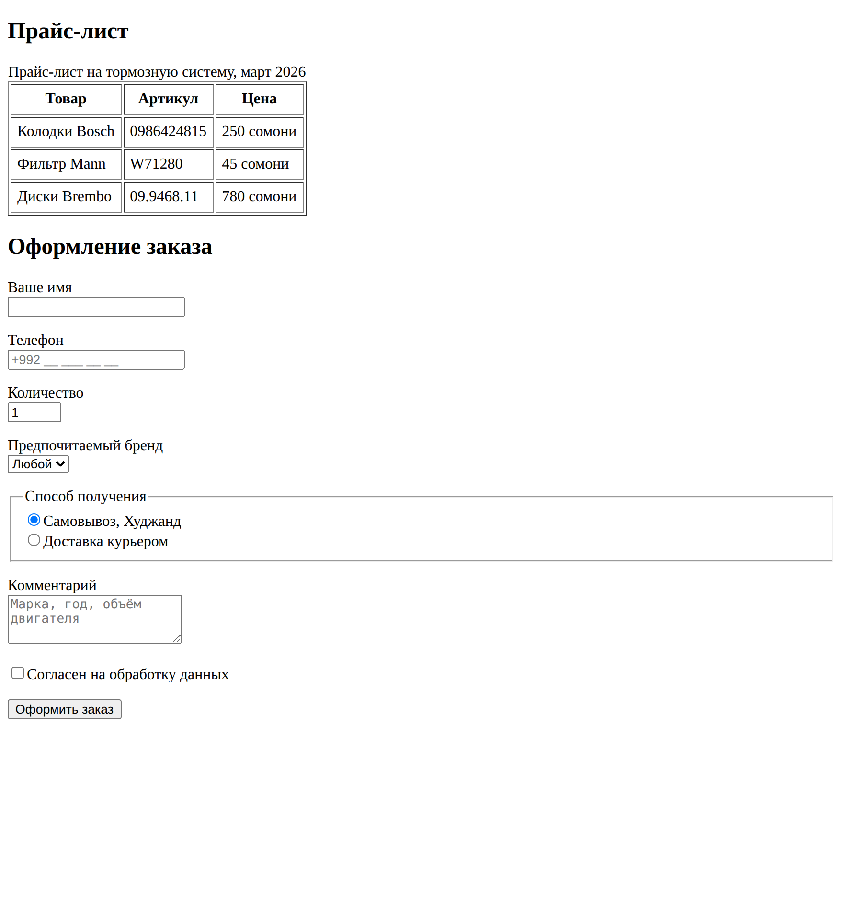

# Глава 7. Таблицы и формы

> **Часть II. HTML — скелет страницы** · Глава 7 из 60
> [← Глава 6](06-tekst-ssylki-kartinki.md) · [Глава 8 →](08-praktika-katalog.md)

## 🎯 Зачем эта глава

До сих пор мы только **показывали** информацию. Теперь научимся двум вещам посерьёзнее:

- **таблицы** — показывать данные, у которых есть строки и столбцы;
- **формы** — принимать данные **от покупателя**.

Форма — это первый раз, когда информация побежит в обратную сторону: не от сайта
к человеку, а от человека к сайту. Регистрация, вход, поиск, заказ, отзыв — всё это формы.

Отправлять данные по-настоящему мы научимся в главе 24, когда появится PHP.
Сейчас построим саму форму — и разберём каждое поле.

## 📖 Таблицы

### **Когда таблица уместна, а когда нет**

Сразу главное правило, потому что его нарушают постоянно:

**Таблица — для данных, у которых есть строки и столбцы.** Прайс-лист, характеристики,
расписание, отчёт о продажах.

**Таблица — не для раскладки страницы.** Двадцать лет назад сайты верстали таблицами,
потому что другого способа не было. Сегодня для раскладки есть Flexbox и Grid (глава 11),
а таблица в этой роли ломает мобильную версию и мешает незрячим.

### **Из чего состоит таблица**

```html
<table>
    <thead>
        <tr>
            <th>Товар</th>
            <th>Артикул</th>
            <th>Цена</th>
        </tr>
    </thead>
    <tbody>
        <tr>
            <td>Колодки Bosch</td>
            <td>0986424815</td>
            <td>250 сомони</td>
        </tr>
        <tr>
            <td>Фильтр Mann</td>
            <td>W71280</td>
            <td>45 сомони</td>
        </tr>
    </tbody>
</table>
```

| Тег | Расшифровка | Что это |
|---|---|---|
| `<table>` | | Вся таблица |
| `<thead>` | *table head* | Шапка таблицы |
| `<tbody>` | *table body* | Тело: собственно данные |
| `<tr>` | *table row* | **Строка** |
| `<th>` | *table header* | **Ячейка-заголовок**. Жирная и по центру |
| `<td>` | *table data* | **Обычная ячейка** с данными |

Логика такая: таблица состоит из **строк** (`<tr>`), а строка — из **ячеек**
(`<th>` или `<td>`).

⚠️ Частая путаница: люди пытаются описать таблицу по столбцам. Нельзя.
HTML знает только строки. Столбцы получаются сами, когда в каждой строке
одинаковое число ячеек.

### **Объединение ячеек**

```html
<tr>
    <td colspan="2">Занимает два столбца</td>
    <td>Обычная</td>
</tr>
<tr>
    <td rowspan="2">Занимает две строки</td>
    <td>Ячейка</td>
</tr>
```

`colspan` — объединить по горизонтали, `rowspan` — по вертикали. Как в Excel.

### **Подпись**

```html
<table>
    <caption>Прайс-лист на тормозную систему, март 2026</caption>
    ...
</table>
```

`<caption>` — заголовок таблицы. Пишется сразу после `<table>`. Полезен и людям,
и незрячим.

## 📖 Формы

Теперь главное в этой главе.

### **Что такое форма**

**Форма — это конверт, в который складывают данные и отправляют на сервер.**

```html
<form action="/order.php" method="POST">
    <input type="text" name="phone">
    <button type="submit">Отправить</button>
</form>
```

| Часть | Что делает |
|---|---|
| `<form>` | Сам конверт. Всё внутри отправится вместе |
| `action` | **Куда отправить.** Адрес обработчика на сервере |
| `method` | **Как отправить.** `GET` или `POST` |
| `<input>` | Поле для ввода |
| `<button type="submit">` | Кнопка «отправить» |

### **GET или POST**

Помните из главы 2? Теперь применим.

| | GET | POST |
|---|---|---|
| Где едут данные | В адресной строке | Внутри письма, не видно |
| Видно в адресе | `?q=kolodki&brand=bosch` | Ничего не видно |
| Можно ли добавить в закладки | Да | Нет |
| Ограничение по размеру | Есть, около 2000 символов | Практически нет |
| Для чего | **Поиск, фильтры** | **Заказы, вход, регистрация** |

**Простое правило:** данные, которые не жалко показать в адресной строке и которыми
хочется поделиться ссылкой, — GET. Всё остальное — POST.

Пароль в адресной строке — это пароль в истории браузера, в логах сервера
и в закладках. Поэтому вход — только POST.

### **Атрибут `name` — самый важный**

```html
<input type="text" name="phone">
```

**Без `name` поле не отправится вообще.** Совсем. Человек заполнит, нажмёт кнопку,
данные потеряются.

Почему: `name` — это **подпись на данных**. Сервер получит `phone=992927777777`
и по слову `phone` поймёт, что это телефон. Без подписи он получит непонятную строку
без имени и просто её выбросит.

Запомните: **нет `name` — нет данных.** Это ошибка номер один в формах.

## 📖 Виды полей

`<input>` — один тег, но его поведение полностью меняется атрибутом `type`.

### **Текстовые**

```html
<input type="text"     name="name"    placeholder="Ваше имя">
<input type="email"    name="email"   placeholder="pochta@example.com">
<input type="tel"      name="phone"   placeholder="+992 __ ___ __ __">
<input type="password" name="password">
<input type="number"   name="qty"     min="1" max="99" value="1">
<input type="search"   name="q"       placeholder="Поиск по каталогу">
```

| type | Что даёт |
|---|---|
| `text` | Обычная строка |
| `email` | Браузер проверит, что есть `@`. На телефоне — клавиатура с `@` |
| `tel` | На телефоне откроется **цифровая** клавиатура |
| `password` | Символы прячутся за точками |
| `number` | Только числа, появляются стрелочки. `min` и `max` ограничивают |
| `search` | Поле поиска, у него появляется крестик очистки |

**Про мобильную клавиатуру — недооценённая мелочь.** Поставили `type="tel"` —
человек на телефоне сразу видит цифры вместо букв. Не поставили — он мучается,
переключая раскладку. Такие детали и отличают удобный сайт от неудобного.

### **Выбор**

```html
<!-- Один из нескольких -->
<input type="radio" name="dostavka" value="samovyvoz" id="d1">
<label for="d1">Самовывоз</label>

<input type="radio" name="dostavka" value="kurier" id="d2">
<label for="d2">Курьером</label>

<!-- Галочка -->
<input type="checkbox" name="soglasie" id="s1">
<label for="s1">Согласен на обработку данных</label>
```

**Ключевая разница:**

- **radio** — выбрать **одно** из нескольких. Чтобы они работали как группа,
  у них должен быть **одинаковый `name`**. Это самая частая ошибка: разные `name` —
  и можно выбрать все варианты сразу.
- **checkbox** — включить или выключить. Каждый сам по себе.

### **Выпадающий список**

```html
<select name="brand">
    <option value="">Все бренды</option>
    <option value="bosch">Bosch</option>
    <option value="mann" selected>Mann</option>
    <option value="denso">Denso</option>
</select>
```

`value` — что уйдёт на сервер, текст между тегами — что видит человек.
`selected` — вариант по умолчанию.

### **Большое поле для текста**

```html
<textarea name="comment" rows="4" placeholder="Комментарий к заказу"></textarea>
```

⚠️ У `<textarea>` **есть закрывающий тег**, в отличие от `<input>`. И значение
по умолчанию пишется **между тегами**, а не в атрибут `value`.

### **Прочее**

```html
<input type="date"   name="dostavka_data">
<input type="file"   name="foto">
<input type="hidden" name="tovar_id" value="42">
```

`hidden` — скрытое поле. Человек его не видит, но оно отправится вместе с формой.
Так передают служебные данные: номер товара, защитный токен.

## 📖 `<label>` — обязательная вещь

```html
<label for="phone">Телефон</label>
<input type="tel" id="phone" name="phone">
```

Связка простая: **`for` у метки совпадает с `id` у поля**.

Зачем это нужно:

1. **Клик по надписи ставит курсор в поле.** Особенно важно для маленьких галочек:
   попасть пальцем в квадратик 15×15 на телефоне трудно, а в надпись рядом — легко.
2. **Программы для незрячих прочитают, что это за поле.** Без метки человек услышит
   «поле ввода» и не узнает, что туда вводить.

**Правило: каждое поле должно иметь `<label>`.** Без исключений.

⚠️ `placeholder` — **не замена метки**. Он исчезает, как только человек начинает
печатать. Заполнили полформы, отвлеклись — и уже не помните, что в каком поле.

## 📖 Проверка прямо в браузере

Браузер умеет проверять поля сам, без единой строчки кода:

```html
<input type="email" name="email" required>
<input type="tel" name="phone" required pattern="[0-9+ ]{9,20}">
<input type="number" name="qty" min="1" max="99" required>
<input type="text" name="name" minlength="2" maxlength="50" required>
```

| Атрибут | Что проверяет |
|---|---|
| `required` | Поле обязательное, пустым не отправится |
| `min` / `max` | Границы для чисел |
| `minlength` / `maxlength` | Длина текста |
| `pattern` | Соответствие шаблону |

Очень удобно. Но запомните намертво — мы вернёмся к этому в главе 36:

⚠️ **Проверка в браузере — это удобство, а не защита.** Её отключают за десять секунд
через F12. Все данные **обязательно** проверяются ещё раз на сервере в PHP.
Всегда. Без исключений.

## 💻 Форма заказа целиком

```html
<h2>Оформление заказа</h2>

<form action="/order.php" method="POST">

    <input type="hidden" name="tovar_id" value="42">

    <p>
        <label for="name">Ваше имя</label><br>
        <input type="text" id="name" name="name" required minlength="2">
    </p>

    <p>
        <label for="phone">Телефон</label><br>
        <input type="tel" id="phone" name="phone" required placeholder="+992 __ ___ __ __">
    </p>

    <p>
        <label for="qty">Количество</label><br>
        <input type="number" id="qty" name="qty" value="1" min="1" max="20">
    </p>

    <p>
        <label for="brand">Предпочитаемый бренд</label><br>
        <select id="brand" name="brand">
            <option value="">Любой</option>
            <option value="bosch">Bosch</option>
            <option value="mann">Mann</option>
        </select>
    </p>

    <fieldset>
        <legend>Способ получения</legend>
        <input type="radio" id="d1" name="dostavka" value="samovyvoz" checked>
        <label for="d1">Самовывоз, Худжанд</label><br>
        <input type="radio" id="d2" name="dostavka" value="kurier">
        <label for="d2">Доставка курьером</label>
    </fieldset>

    <p>
        <label for="comment">Комментарий</label><br>
        <textarea id="comment" name="comment" rows="3"
                  placeholder="Марка, год, объём двигателя"></textarea>
    </p>

    <p>
        <input type="checkbox" id="soglasie" name="soglasie" required>
        <label for="soglasie">Согласен на обработку данных</label>
    </p>

    <button type="submit">Оформить заказ</button>
</form>
```

Новый тег: `<fieldset>` группирует связанные поля, а `<legend>` даёт группе название.
Полезно для радиокнопок.

## 🖥 На экране



Нажмите «Оформить заказ», не заполнив поля, — браузер сам покажет подсказку
«Заполните это поле». Это работает `required`, и мы не написали ни строчки кода.

Форма пока никуда не отправляет — обработчика `/order.php` не существует.
Сделаем его в главе 24.

## 🔤 Разбор по словам

| Слово | Что означает |
|---|---|
| `<table>` / `<tr>` / `<th>` / `<td>` | Таблица / строка / ячейка-заголовок / ячейка данных |
| `colspan` / `rowspan` | Объединить ячейки по горизонтали / вертикали |
| `<form>` | Конверт для данных |
| `action` | Куда отправлять |
| `method` | Как отправлять: GET или POST |
| `name` | **Подпись на данных.** Без него данные не дойдут |
| `value` | Значение, которое уйдёт на сервер |
| `<label for="...">` | Подпись к полю, связана с `id` |
| `placeholder` | Серая подсказка внутри поля. Исчезает при вводе |
| `required` | Обязательное поле |
| `<fieldset>` / `<legend>` | Группа полей / её название |
| `type="hidden"` | Невидимое поле для служебных данных |

## ⚠️ Грабли

**Забыть `name`.** Поле не отправится. Проверяйте в первую очередь.

**Разные `name` у радиокнопок.** Они перестают быть группой — можно выбрать всё сразу.

**`placeholder` вместо `<label>`.** Подсказка исчезает при вводе, и человек забывает,
что заполняет.

**Верить проверке в браузере.** Отключается за секунды. Проверяйте на сервере.

**Пароль методом GET.** Он окажется в адресной строке, истории и логах.
Только POST.

**Таблица для раскладки страницы.** Ломает мобильную версию. Для раскладки — CSS.

**Кнопка без `type`.** Внутри формы кнопка по умолчанию отправляет её. Если кнопка
нужна для другого — пишите `type="button"`.

## 🏋️ Задачи

**Задача 7.1.** Сделайте таблицу-прайс на пять товаров: название, артикул, бренд,
цена, наличие. С шапкой `<thead>` и подписью `<caption>`.

**Задача 7.2.** Найдите три ошибки:

```html
<form>
    <input type="text" placeholder="Имя">
    <input type="radio" name="a" value="1"> Первый
    <input type="radio" name="b" value="2"> Второй
    <input type="password" name="pass">
</form>
```

**Задача 7.3.** Какой `type` подойдёт лучше всего?

1. Год выпуска автомобиля.
2. Адрес электронной почты.
3. Номер телефона.
4. Согласие с условиями.
5. Выбор города из двадцати.
6. Выбор одного из трёх способов оплаты.
7. Пароль при регистрации.

**Задача 7.4.** Сделайте форму поиска по каталогу: строка поиска, выпадающий список
брендов, поля «цена от» и «цена до», кнопка. Какой метод здесь правильный — GET
или POST? Объясните почему.

**Задача 7.5.** Сделайте форму обратной связи: имя, телефон, тема (выпадающий список),
сообщение (textarea), галочка согласия. Все поля с `<label>` и обязательные.

**Задача 7.6.** Откройте форму входа на любом сайте, нажмите F12 → Elements
и найдите поля. Какой у формы `method`? Какие `name` у полей?

**Задача 7.7.** Проверьте свою форму: нажмите отправить с пустыми полями.
Появилась подсказка браузера? Теперь уберите `required` у одного поля
и попробуйте снова.

*Ответы — в [Приложении Г](../prilozheniya/4-G-otvety.md).*

## 🔗 В бою

Найдите в этом репозитории `auth/` — там формы входа и регистрации настоящего магазина.
Посмотрите: у всех `method="POST"`, у всех полей есть `name`, есть скрытые поля
со служебными данными.

Одно такое скрытое поле особенно интересное — **CSRF-токен**. Это защита от подделки
запроса: злоумышленник не сможет отправить форму от вашего имени с чужого сайта.
Разберём его в главе 36.

## 📌 Итог

- Таблица — для **данных со строками и столбцами**, не для раскладки.
- `<tr>` — строка, `<th>` — заголовок, `<td>` — данные. Столбцов в HTML нет,
  они получаются сами.
- Форма — конверт. `action` — куда, `method` — как.
- **GET** для поиска и фильтров, **POST** для заказов, входа, регистрации.
- **`name` обязателен.** Нет `name` — данные не дойдут.
- Радиокнопки одной группы имеют **одинаковый `name`**.
- **`<label for>` для каждого поля.** `placeholder` его не заменяет.
- Проверка в браузере — удобство, **защита только на сервере**.

Следующая глава — практическая. Соберём полноценный каталог и закрепим весь HTML.

[← Глава 6](06-tekst-ssylki-kartinki.md) · [Глава 8. Практика: каталог →](08-praktika-katalog.md)
