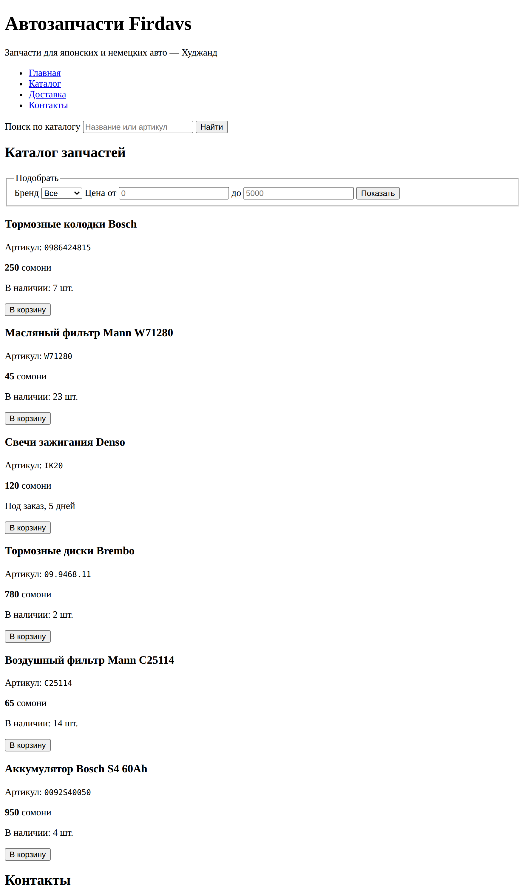

# Глава 8. Практика: карточка товара и каталог

> **Часть II. HTML — скелет страницы** · Глава 8 из 60
> [← Глава 7](07-tablicy-i-formy.md) · [Глава 9 →](09-podklyuchaem-css.md)

## 🎯 Зачем эта глава

Четыре главы мы разбирали теги поодиночке. Пора собрать из них настоящую страницу.

Сегодня вы сделаете **главную страницу магазина** целиком: шапку с меню, фильтры,
каталог из шести товаров, подвал с контактами. Это будет тот самый файл, который
мы будем улучшать всю оставшуюся книгу — сначала оформим в CSS, потом оживим
на JavaScript, потом начнём подставлять товары из базы данных.

Новых тегов почти не будет. Будет **сборка** и несколько приёмов, о которых
в учебниках обычно молчат.

## 📖 Сначала — план

Профессиональный приём, который экономит часы: **прежде чем писать теги, набросайте
структуру словами**.

Что должно быть на главной странице магазина?

```
Шапка
    Название магазина
    Меню: Каталог, Доставка, Контакты
    Строка поиска

Основная часть
    Заголовок «Каталог запчастей»
    Фильтры: бренд, цена от/до
    Список товаров, у каждого:
        фото
        название
        артикул
        цена
        наличие
        кнопка «Купить»

Подвал
    Адрес и телефон
    Копирайт
```

Теперь у каждой строчки этого плана есть подходящий тег. План превращается в код
почти механически:

| План | Тег |
|---|---|
| Шапка | `<header>` |
| Меню | `<nav>` + `<ul>` + `<li>` + `<a>` |
| Строка поиска | `<form>` + `<input type="search">` |
| Основная часть | `<main>` |
| Каждый товар | `<article>` |
| Фото | `` |
| Цена | `<p>` + `<strong>` |
| Подвал | `<footer>` |

**Совет:** делайте так всегда, особенно на первых порах. Гораздо легче править план
из десяти строк, чем распутывать сто строк готового кода.

## 📖 Собираем карточку товара

Начнём с одного товара — потом просто повторим.

```html
<article class="tovar">
    

    <h3>Тормозные колодки Bosch</h3>

    <p class="artikul">Артикул: <code>0986424815</code></p>
    <p class="cena"><strong>250</strong> сомони</p>
    <p class="nalichie">В наличии: 7 шт.</p>

    <form action="/cart.php" method="POST">
        <input type="hidden" name="tovar_id" value="1">
        <button type="submit">В корзину</button>
    </form>
</article>
```

Что здесь важного:

**Заголовок товара — `<h3>`, а не `<h1>`.** Потому что `<h1>` уже занят названием
магазина, `<h2>` — заголовком «Каталог». Товар — третий уровень. Иерархия соблюдена.

**Классы расставлены заранее.** `tovar`, `cena`, `nalichie` пока ничего не делают —
CSS-то нет. Но в главе 9 мы по ним найдём элементы и оформим. Привыкайте называть
части сразу.

**Кнопка внутри формы.** Товар в корзину — это изменение данных, значит POST.
Скрытое поле передаёт, какой именно товар положить.

## 📖 Три приёма, о которых обычно молчат

### **1. Комментарии в коде**

```html
<!-- Шапка сайта -->
<header>
    ...
</header>
<!-- /Шапка -->
```

Всё между `<!--` и `-->` браузер игнорирует. Это заметки для человека.

Зачем: когда файл вырастет до трёхсот строк, комментарии станут указателями.
Особенно полезно помечать **конец** большого блока — сразу видно, какой `</div>`
что закрывает.

⚠️ HTML-комментарии видны в исходном коде страницы любому. Никогда не пишите в них
пароли, заметки вроде «тут костыль, не трогать» или служебные адреса.

### **2. `&nbsp;` — неразрывный пробел**

```html
<p>Цена: 250&nbsp;сомони</p>
<p>Телефон: +992&nbsp;92&nbsp;777&nbsp;77&nbsp;77</p>
```

Обычный пробел позволяет браузеру перенести строку. Иногда это уродливо:

```
Цена: 250
сомони
```

`&nbsp;` — пробел, по которому **нельзя переносить**. Число и единица измерения
останутся вместе.

Где ставить: между числом и единицей (`250&nbsp;сомони`, `12&nbsp;мес`), в номерах
телефонов, между инициалами и фамилией.

Такие записи называются **спецсимволами** и всегда начинаются с `&`:

| Запись | Что даёт | Зачем |
|---|---|---|
| `&nbsp;` | Неразрывный пробел | Не разрывать «250 сомони» |
| `&mdash;` | — | Тире по-русски |
| `&laquo;` `&raquo;` | « » | Кавычки-ёлочки |
| `&copy;` | © | Копирайт |
| `&lt;` `&gt;` | < > | Показать уголки как текст |
| `&amp;` | & | Показать сам амперсанд |

Последние три обязательны, если нужно **написать теги как текст**. Иначе браузер
попытается их выполнить.

### **3. Один товар — потом копия**

Не пишите шесть карточек подряд руками. Сделайте **одну и отладьте её**, а потом
копируйте.

Почему это важно: если в единственной карточке ошибка, вы поправите её один раз.
Если вы уже размножили карточку с ошибкой на шесть штук — править придётся шесть раз,
и обязательно где-то забудете.

Это, кстати, прямая дорога к главному принципу программирования, который встретится
в главе 23: **не повторяйся**. Скоро мы вообще перестанем копировать карточки —
их будет создавать PHP в цикле.

## 💻 Главная страница целиком

Вот полный файл. Наберите его — это ваш магазин.

```html
<!DOCTYPE html>
<html lang="ru">
<head>
    <meta charset="UTF-8">
    <meta name="viewport" content="width=device-width, initial-scale=1">
    <title>Автозапчасти Firdavs — запчасти в Худжанде</title>
    <meta name="description" content="Автозапчасти для японских и немецких
          автомобилей в Худжанде. Доставка по Таджикистану.">
</head>
<body>

<!-- Шапка -->
<header>
    <h1>Автозапчасти Firdavs</h1>
    <p>Запчасти для японских и немецких авто &mdash; Худжанд</p>

    <nav>
        <ul>
            <li><a href="/">Главная</a></li>
            <li><a href="/catalog">Каталог</a></li>
            <li><a href="/delivery">Доставка</a></li>
            <li><a href="/contacts">Контакты</a></li>
        </ul>
    </nav>

    <form action="/search" method="GET">
        <label for="q">Поиск по каталогу</label>
        <input type="search" id="q" name="q" placeholder="Название или артикул">
        <button type="submit">Найти</button>
    </form>
</header>
<!-- /Шапка -->

<main>
    <h2>Каталог запчастей</h2>

    <!-- Фильтры -->
    <form action="/catalog" method="GET">
        <fieldset>
            <legend>Подобрать</legend>

            <label for="brand">Бренд</label>
            <select id="brand" name="brand">
                <option value="">Все</option>
                <option value="bosch">Bosch</option>
                <option value="mann">Mann</option>
                <option value="denso">Denso</option>
                <option value="brembo">Brembo</option>
            </select>

            <label for="min">Цена от</label>
            <input type="number" id="min" name="min" min="0" placeholder="0">

            <label for="max">до</label>
            <input type="number" id="max" name="max" min="0" placeholder="5000">

            <button type="submit">Показать</button>
        </fieldset>
    </form>
    <!-- /Фильтры -->

    <!-- Товары -->
    <article class="tovar">
        <h3>Тормозные колодки Bosch</h3>
        <p class="artikul">Артикул: <code>0986424815</code></p>
        <p class="cena"><strong>250</strong>&nbsp;сомони</p>
        <p class="nalichie">В наличии: 7&nbsp;шт.</p>
        <form action="/cart.php" method="POST">
            <input type="hidden" name="tovar_id" value="1">
            <button type="submit">В корзину</button>
        </form>
    </article>

    <article class="tovar">
        <h3>Масляный фильтр Mann W71280</h3>
        <p class="artikul">Артикул: <code>W71280</code></p>
        <p class="cena"><strong>45</strong>&nbsp;сомони</p>
        <p class="nalichie">В наличии: 23&nbsp;шт.</p>
        <form action="/cart.php" method="POST">
            <input type="hidden" name="tovar_id" value="2">
            <button type="submit">В корзину</button>
        </form>
    </article>

    <article class="tovar">
        <h3>Свечи зажигания Denso</h3>
        <p class="artikul">Артикул: <code>IK20</code></p>
        <p class="cena"><strong>120</strong>&nbsp;сомони</p>
        <p class="nalichie nety">Под заказ, 5&nbsp;дней</p>
        <form action="/cart.php" method="POST">
            <input type="hidden" name="tovar_id" value="3">
            <button type="submit">В корзину</button>
        </form>
    </article>

    <article class="tovar">
        <h3>Тормозные диски Brembo</h3>
        <p class="artikul">Артикул: <code>09.9468.11</code></p>
        <p class="cena"><strong>780</strong>&nbsp;сомони</p>
        <p class="nalichie">В наличии: 2&nbsp;шт.</p>
        <form action="/cart.php" method="POST">
            <input type="hidden" name="tovar_id" value="4">
            <button type="submit">В корзину</button>
        </form>
    </article>

    <article class="tovar">
        <h3>Воздушный фильтр Mann C25114</h3>
        <p class="artikul">Артикул: <code>C25114</code></p>
        <p class="cena"><strong>65</strong>&nbsp;сомони</p>
        <p class="nalichie">В наличии: 14&nbsp;шт.</p>
        <form action="/cart.php" method="POST">
            <input type="hidden" name="tovar_id" value="5">
            <button type="submit">В корзину</button>
        </form>
    </article>

    <article class="tovar">
        <h3>Аккумулятор Bosch S4 60Ah</h3>
        <p class="artikul">Артикул: <code>0092S40050</code></p>
        <p class="cena"><strong>950</strong>&nbsp;сомони</p>
        <p class="nalichie">В наличии: 4&nbsp;шт.</p>
        <form action="/cart.php" method="POST">
            <input type="hidden" name="tovar_id" value="6">
            <button type="submit">В корзину</button>
        </form>
    </article>
    <!-- /Товары -->
</main>

<!-- Подвал -->
<footer>
    <h2>Контакты</h2>
    <p>Худжанд, ул. Ленина&nbsp;15<br>
       Телефон: <a href="tel:+992927777777">+992&nbsp;92&nbsp;777&nbsp;77&nbsp;77</a><br>
       Почта: <a href="mailto:info@autodoc.tj">info@autodoc.tj</a></p>

    <h3>Режим работы</h3>
    <ul>
        <li>Пн&ndash;Пт: 9:00&ndash;18:00</li>
        <li>Сб: 9:00&ndash;14:00</li>
        <li>Вс: выходной</li>
    </ul>

    <p><small>&copy; 2026 Автозапчасти Firdavs</small></p>
</footer>
<!-- /Подвал -->

</body>
</html>
```

## 🔤 Разбор по словам

В коде появились две новые строки в `<head>`. Разберём — они обе важные.

### **`<meta name="viewport" ...>`**

```html
<meta name="viewport" content="width=device-width, initial-scale=1">
```

**Это строка, без которой сайт не работает на телефоне.**

Без неё мобильный браузер решает: «сайт, наверное, старый и рассчитан на компьютер».
Он делает вид, что экран шириной 980 пикселей, и **уменьшает всю страницу**, чтобы
влезла. Текст становится нечитаемым, и человек вынужден растягивать пальцами.

| Часть | Что говорит |
|---|---|
| `width=device-width` | «Ширина страницы = настоящая ширина экрана» |
| `initial-scale=1` | «Не уменьшать при открытии» |

Пишется в каждой странице, всегда. Мы вернёмся к ней в главе 12, когда займёмся
мобильной версией всерьёз.

### **`<meta name="description" ...>`**

```html
<meta name="description" content="Автозапчасти для японских и немецких автомобилей...">
```

**Это текст, который человек увидит в результатах поиска Google** — серое описание
под синей ссылкой.

Если его не написать, поисковик выдернет случайный кусок текста со страницы,
и выглядеть это будет так себе. Пишите 120–160 символов, по-человечески,
с пользой для читателя.

Вместе с `<title>` это два поля, которые решают, кликнет человек по вашему сайту
в поиске или пролистает дальше.

### **Ещё раз про иерархию заголовков**

Посмотрите на нашу страницу целиком:

```
<h1> Автозапчасти Firdavs        ← название сайта, ОДИН
    <h2> Каталог запчастей       ← раздел
        <h3> Тормозные колодки   ← товар
        <h3> Масляный фильтр     ← товар
    <h2> Контакты                ← раздел
        <h3> Режим работы        ← подраздел
```

Ровное дерево без пропусков. Именно так поисковик строит «оглавление» вашей страницы.

## 🖥 На экране



Вот он, ваш магазин. Пока — длинная чёрно-белая простыня.

Давайте честно: **до нормального сайта отсюда далеко**. Товары идут в столбик,
формы разъехались, фильтры выглядят как случайный набор полей.

Но остановитесь на секунду и посмотрите, **что уже есть**:

- поиск работает как поле поиска, на телефоне вызовет нужную клавиатуру;
- фильтр по бренду раскрывается списком;
- поля цены принимают только числа;
- у каждого товара своя кнопка со своим номером;
- телефон нажимается и звонит;
- структура страницы правильная и семантичная;
- поисковик увидит и заголовок, и описание.

**Скелет готов и он правильный.** Дальше — одежда.

И вот что приятно: в следующей главе мы **не будем трогать этот файл почти совсем**.
Мы создадим рядом файл со стилями, подключим его одной строчкой — и та же самая
страница превратится в магазин. Разделение обязанностей из первой главы —
вот оно, в действии.

## ⚠️ Грабли

**Забыть `viewport`.** На телефоне сайт будет крошечным. Проверьте: откройте свою
страницу на телефоне или включите F12 → значок телефона в углу панели.

**Не закрыть тег в середине файла.** Страница поедет начиная с этого места.
Ищите так: сузьте область — закомментируйте половину `<!-- -->`, посмотрите,
осталась ли проблема, и так далее. Приём называется «деление пополам»,
им ищут ошибки во всём.

**Забыть `alt` у картинок.** В нашем примере картинок нет специально — чтобы
страница работала у всех. Как только добавите свои фото, `alt` обязателен.

**Скопировать карточку и забыть поменять `tovar_id`.** Все шесть кнопок будут
класть в корзину один и тот же товар. Классическая ошибка копирования.

## 🏋️ Задачи

**Задача 8.1.** Соберите эту страницу у себя целиком. Замените товары на свои —
хоть на телефоны, хоть на книги, хоть на цветы. Магазин необязательно должен быть
автомобильным.

**Задача 8.2.** Добавьте седьмой и восьмой товар. Не забудьте про `tovar_id`.

**Задача 8.3.** Сделайте вторую страницу — `tovar.html`, подробную карточку одного
товара. Возьмите пример из главы 6 и добавьте: таблицу характеристик, форму заказа
из главы 7, ссылку «← Назад в каталог».

**Задача 8.4.** Свяжите страницы: в каталоге сделайте название каждого товара
ссылкой на `tovar.html`. Проверьте, что переходы работают в обе стороны.

**Задача 8.5.** Добавьте в подвал вложенное меню каталога (`<ul>` внутри `<li>`):
три раздела, в каждом по два подраздела.

**Задача 8.6.** Проверьте свою страницу валидатором. Откройте `validator.w3.org`,
вкладка *Validate by Direct Input*, вставьте свой код и нажмите Check.

Валидатор — это проверка HTML на ошибки. Он найдёт незакрытые теги, неправильную
вложенность, забытые атрибуты. Сколько ошибок у вас? Исправьте все.

**Задача 8.7.** Откройте страницу на телефоне (или через F12 → значок телефона).
Всё читается? Теперь уберите строку `viewport`, обновите и посмотрите снова.
Разницу видно?

**Задача 8.8.** Напишите план (словами, как в начале главы) для страницы «Доставка
и оплата». Какие теги подойдут каждому пункту? Потом соберите её.

*Ответы — в [Приложении Г](../prilozheniya/G-otvety.md).*

## 🔗 В бою

Вы сейчас сделали руками то, что настоящий магазин делает автоматически.

Откройте в репозитории `index.php` — там та же структура: шапка, каталог, подвал.
Но карточки товаров не написаны шесть раз. Там **один шаблон карточки**, который
PHP повторяет в цикле столько раз, сколько товаров пришло из базы.

Шесть товаров или шесть тысяч — кода одинаково.

Именно поэтому мы учим сначала HTML: **чтобы было что повторять**. В главе 25 вы
возьмёте эту самую карточку и научите PHP размножать её самостоятельно.

## 📌 Итог

- Перед кодом — **план словами**. Потом каждой строке плана подбирается тег.
- Карточка товара: `<article>` + `<h3>` + данные + форма с `<input type="hidden">`.
- **Комментарии** `<!-- -->` — заметки для человека. Не пишите в них секретов.
- **`&nbsp;`** не даёт разорвать «250 сомони». `&mdash;`, `&laquo;`, `&copy;` —
  тире, кавычки, копирайт.
- **`<meta name="viewport">`** обязателен, иначе сайт непригоден на телефоне.
- **`<meta name="description">`** — текст под ссылкой в результатах поиска.
- Иерархия заголовков без пропусков: `<h1>` → `<h2>` → `<h3>`.
- Отладьте **одну** карточку, потом копируйте. Скоро копировать перестанем совсем.
- Проверяйте себя валидатором `validator.w3.org`.

**Часть II закончена.** Вы умеете размечать страницы. Со следующей главы начинается
CSS — и ваш магазин наконец станет красивым.

[← Глава 7](07-tablicy-i-formy.md) · [Глава 9. Подключаем CSS →](09-podklyuchaem-css.md)
