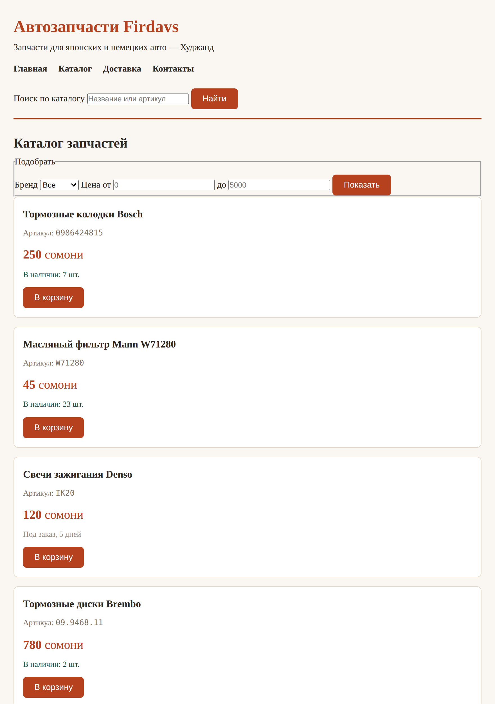

# Глава 9. Подключаем CSS и учим селекторы

> **Часть III. CSS — внешность** · Глава 9 из 60
> [← Глава 8](08-praktika-katalog.md) · [Глава 10 →](10-cvet-shrift-otstupy.md)

## 🎯 Зачем эта глава

Вы построили страницу магазина. Она правильная, семантичная — и абсолютно
непривлекательная.

Начинаем это исправлять. CSS — это то, что превращает чёрно-белую простыню
в сайт, на котором хочется что-то купить.

В этой главе разберёмся с двумя вещами:

1. **Как подключить CSS** к странице (три способа, правильный — один).
2. **Как объяснить браузеру, что именно красить** — это называется селекторы.

Второе важнее. Умение точно указать «вот этот элемент и никакой другой» —
основа всей работы с CSS.

## 📖 Что такое CSS

**CSS** — *Cascading Style Sheets*, «каскадные таблицы стилей».

Название страшное, суть простая: **список указаний, как показывать элементы страницы**.

Одно указание — одно **правило**:

```css
button {
    background: #b5411f;
    color: white;
    border-radius: 6px;
}
```

Читается: «все кнопки на странице сделай с красно-рыжим фоном, белым текстом
и скруглёнными на 6 пикселей углами».

Из чего состоит правило:

| Часть | Название | Что делает |
|---|---|---|
| `button` | **Селектор** | Кого оформляем |
| `{ }` | | Границы списка указаний |
| `background` | **Свойство** | Что меняем |
| `#b5411f` | **Значение** | На что меняем |
| `;` | | Конец одного указания |

Пара «свойство: значение» называется **объявлением**. Их в правиле может быть
сколько угодно.

## 📖 Три способа подключить CSS

### **Способ 1: отдельный файл — правильный**

```html
<head>
    <meta charset="UTF-8">
    <title>Автозапчасти Firdavs</title>
    <link rel="stylesheet" href="style.css">
</head>
```

Создаём рядом с `index.html` файл `style.css` и подключаем одной строкой.

| Атрибут | Что значит |
|---|---|
| `<link>` | Одиночный тег: «подключить внешний файл» |
| `rel="stylesheet"` | Что подключаем — таблицу стилей |
| `href="style.css"` | Где она лежит |

**Почему так правильно:**

- один файл стилей на **все** страницы сайта — поменяли цвет кнопки в одном месте,
  изменилось везде;
- браузер скачает `style.css` один раз и запомнит — остальные страницы откроются быстрее;
- код разделён: разметка отдельно, оформление отдельно.

**Так делают всегда.** Остальные два способа — для особых случаев.

### **Способ 2: в `<head>` страницы**

```html
<head>
    <style>
        button { background: #b5411f; }
    </style>
</head>
```

Стили внутри самой страницы. Годится для быстрой пробы или для крошечной
одностраничной вещи. На настоящем сайте — нет: придётся дублировать на каждой странице.

### **Способ 3: прямо в теге — так не надо**

```html
<button style="background: #b5411f;">Купить</button>
```

Называется **инлайн-стиль**. Работает, но плох почти всем:

- относится только к этому одному элементу;
- смешивает разметку и оформление;
- **перебивает** все остальные стили, из-за чего потом невозможно ничего изменить.

Встречается в реальном коде (обычно там, где стиль задаёт программа), но своими
руками так писать не стоит.

## 📖 Селекторы: как указать, кого красить

Вот тут — самое полезное в главе.

### **По имени тега**

```css
p { color: #333; }
h1 { font-size: 32px; }
button { background: #b5411f; }
```

Найдёт **все** такие теги на странице. Просто, но грубо: покрасит вообще все кнопки,
включая те, которые вы красить не собирались.

### **По классу — главный рабочий инструмент**

```html
<p class="cena">250 сомони</p>
```

```css
.cena { color: #b5411f; font-weight: bold; }
```

**Точка перед именем** означает «это класс».

Класс можно:

- повесить на **много** элементов — все оформятся одинаково;
- повесить **несколько** на один элемент через пробел:

```html
<p class="nalichie nety">Под заказ</p>
```

```css
.nalichie { color: green; }
.nety     { color: gray; }
```

Элемент получит оба правила. Очень удобно: базовый вид плюс модификация.

**90% вашего CSS будет по классам.** Привыкайте.

### **По id — редко**

```html
<div id="korzina">...</div>
```

```css
#korzina { position: fixed; right: 20px; }
```

**Решётка** означает «это id». Напоминаю: `id` уникален, один на странице.

Используйте редко. У `id` слишком большая «сила» (см. ниже про приоритеты),
и он мешает переиспользованию.

### **Вложенность — «внутри чего-то»**

```css
.tovar h3 { font-size: 18px; }
```

Читается: «заголовки `<h3>`, которые лежат **внутри** элемента с классом `tovar`».
Другие `<h3>` на странице не тронутся.

Пробел здесь — важный знак. Он означает «внутри».

```css
nav a        { color: #333; }        /* ссылки внутри меню */
footer a     { color: gray; }        /* ссылки в подвале */
.tovar .cena { font-size: 20px; }    /* цена внутри карточки товара */
```

### **Несколько селекторов сразу**

```css
h1, h2, h3 {
    font-family: Georgia, serif;
}
```

Запятая означает «и ещё». Одно правило применится ко всем трём.

### **По состоянию — псевдоклассы**

```css
a:hover        { color: #b5411f; }      /* когда навели мышь */
button:hover   { background: #8f3418; }
input:focus    { border-color: #b5411f; }  /* когда поле активно */
li:first-child { font-weight: bold; }      /* первый элемент списка */
li:last-child  { border-bottom: none; }    /* последний */
```

Двоеточие означает «в состоянии».

`:hover` — самый частый. Это то самое «кнопка потемнела, когда навёл мышь».
Мелочь, а сайт сразу кажется живым.

### **Все элементы**

```css
* { margin: 0; padding: 0; }
```

Звёздочка — «вообще все». Применяют обычно один раз в начале файла, чтобы сбросить
разнобой браузерных настроек по умолчанию.

### **Сводка селекторов**

| Запись | Кого выберет |
|---|---|
| `p` | Все абзацы |
| `.cena` | Все с `class="cena"` |
| `#korzina` | Элемент с `id="korzina"` |
| `.tovar h3` | `<h3>` внутри `.tovar` |
| `h1, h2` | И заголовки первого, и второго уровня |
| `a:hover` | Ссылка под курсором |
| `*` | Все элементы |

Этих семи хватит на 95% задач. Есть ещё десятки, но они понадобятся нескоро.

## 📖 Каскад: кто победит, если правил несколько

«Каскадные» в названии CSS — вот про это.

Ситуация: на один элемент действуют два правила, и они противоречат друг другу.
Кто выиграет?

### **Правило 1: кто ниже, тот и прав**

```css
p { color: red; }
p { color: blue; }
```

Текст будет **синим**. Побеждает то правило, которое написано **позже**.

Отсюда практический вывод: подключайте свои стили **после** чужих (например, после
готового шаблона), иначе они не перебьют.

### **Правило 2: кто точнее, тот и прав**

Но порядок работает только при равной точности. Более точный селектор побеждает
независимо от порядка:

```css
.tovar .cena { color: red; }     /* точнее */
.cena        { color: blue; }    /* написан ниже, но проиграет */
```

Цена будет **красной**.

Шкала силы, от слабого к сильному:

| Сила | Что это | Пример |
|---|---|---|
| 1 | Тег | `p` |
| 10 | Класс, псевдокласс | `.cena`, `:hover` |
| 100 | id | `#korzina` |
| 1000 | Инлайн-стиль | `style="..."` |
| ∞ | `!important` | `color: red !important;` |

Считается сложением. `.tovar .cena` = 10 + 10 = 20, побеждает `.cena` = 10.

### **Про `!important`**

```css
.cena { color: red !important; }
```

Перебивает всё. И именно поэтому — **не пользуйтесь им**.

`!important` кажется решением («не работает — допишу important»), но это долг,
который придётся отдавать. Через месяц вам понадобится перекрыть этот стиль,
и вы напишете ещё один `!important`. Потом ещё. Через полгода в файле их сорок,
и никто не понимает, что откуда берётся.

Правильный способ — написать **более точный селектор**.

## 💻 Первый стиль для нашего магазина

Создайте рядом с `index.html` файл `style.css`:

```css
/* Сброс: у браузеров разные отступы по умолчанию */
* {
    margin: 0;
    padding: 0;
    box-sizing: border-box;
}

/* Основа страницы */
body {
    font-family: Georgia, 'Times New Roman', serif;
    font-size: 16px;
    line-height: 1.6;
    color: #2b2622;
    background: #faf7f2;
    padding: 24px;
}

/* Шапка */
header {
    border-bottom: 2px solid #b5411f;
    padding-bottom: 16px;
    margin-bottom: 24px;
}

h1 {
    font-size: 30px;
    color: #b5411f;
}

/* Меню */
nav ul {
    list-style: none;
    display: flex;
    gap: 20px;
    margin: 12px 0;
}

nav a {
    color: #2b2622;
    text-decoration: none;
    font-weight: bold;
}

nav a:hover {
    color: #b5411f;
}

/* Карточка товара */
.tovar {
    background: white;
    border: 1px solid #e3d8c6;
    border-radius: 8px;
    padding: 16px;
    margin-bottom: 16px;
}

.tovar h3 {
    font-size: 18px;
    margin-bottom: 8px;
}

.artikul {
    color: #7c7166;
    font-size: 14px;
}

.cena {
    font-size: 22px;
    color: #b5411f;
    margin: 8px 0;
}

.nalichie {
    color: #14584f;
    font-size: 14px;
}

/* Нет в наличии — приглушаем */
.nalichie.nety {
    color: #9a9088;
}

/* Кнопки */
button {
    background: #b5411f;
    color: white;
    border: none;
    padding: 10px 20px;
    border-radius: 6px;
    font-size: 15px;
    cursor: pointer;
    margin-top: 10px;
}

button:hover {
    background: #8f3418;
}

/* Подвал */
footer {
    margin-top: 32px;
    padding-top: 16px;
    border-top: 1px solid #e3d8c6;
    color: #7c7166;
    font-size: 14px;
}
```

И подключите его в `<head>`:

```html
<link rel="stylesheet" href="style.css">
```

## 🖥 На экране

Было — та самая простыня из прошлой главы. Стало:



**Мы не тронули HTML.** Ни одного тега. Добавили одну строку `<link>` и файл стилей —
и страница превратилась в магазин.

Вот оно, разделение обязанностей из первой главы. HTML говорит **что**,
CSS говорит **как**.

Обратите внимание на детали, которые уже работают:

- меню выстроилось в строку (это `display: flex`, разберём в главе 11);
- карточки стали белыми с рамкой и тенью-отступами;
- цена крупная и рыжая, артикул мелкий и серый;
- «Под заказ» приглушено серым, потому что у него два класса: `nalichie nety`;
- наведите мышь на кнопку — она потемнеет, на ссылку в меню — станет рыжей.

## 🔤 Разбор по словам

| Запись | Как читается | Что значит |
|---|---|---|
| `.cena` | «точка цена» | Класс `cena` |
| `#korzina` | «решётка корзина» | Элемент с `id="korzina"` |
| `.tovar h3` | «h3 внутри tovar» | Пробел = «внутри» |
| `h1, h2` | «h1 и h2» | Запятая = «и ещё» |
| `a:hover` | «а при наведении» | Двоеточие = состояние |
| `*` | «все» | Любой элемент |
| `/* ... */` | комментарий | Заметка для человека |
| `cursor: pointer` | | Курсор станет «рукой» — видно, что кликабельно |
| `text-decoration: none` | | Убрать подчёркивание у ссылки |
| `list-style: none` | | Убрать точки у списка |
| `box-sizing: border-box` | | Считать ширину вместе с рамкой и отступами. Разберём в главе 10 |

**Про комментарии в CSS.** В HTML они писались `<!-- -->`, в CSS — `/* */`.
Разные языки, разные знаки. В PHP и JavaScript будет `//`. Не путайтесь:
это тот случай, когда каждый язык изобрёл своё.

## ⚠️ Грабли

**Стили не применились вообще.** Четыре причины по частоте:

1. Опечатка в пути: файл называется `style.css`, а в `<link>` написано `styles.css`.
2. `<link>` стоит не в `<head>`.
3. Забыли `rel="stylesheet"`.
4. Браузер показывает старую версию — жмите **Ctrl+F5**.

**Забыть точку перед классом.** `cena { }` ищет **тег** `<cena>`, которого не бывает.
Нужно `.cena { }`. Одна из самых частых ошибок новичка, и браузер про неё молчит.

**Забыть точку с запятой.** Одно пропущенное `;` ломает **следующее** объявление,
а не своё. Ищешь ошибку в одном месте, а она строкой выше.

**Путать `-` и пробел в именах классов.** `class="tovar cena"` — это **два класса**.
`class="tovar-cena"` — **один класс** с дефисом в имени. Разница огромная.

**Лечить `!important`.** Симптом лечится, болезнь остаётся. Пишите точнее селектор.

## 🏋️ Задачи

**Задача 9.1.** Подключите `style.css` к своей странице из главы 8 и перенесите
туда стили из примера. Убедитесь, что всё применилось.

**Задача 9.2.** Что выберет каждый селектор? Ответьте словами:

1. `.tovar`
2. `.tovar h3`
3. `nav a:hover`
4. `h1, h2, h3`
5. `#poisk`
6. `footer .telefon`
7. `button:hover`

**Задача 9.3.** Какой будет цвет текста? Объясните почему:

```css
p        { color: red; }
.text    { color: blue; }
p.text   { color: green; }
```
```html
<p class="text">Какого я цвета?</p>
```

**Задача 9.4.** Поменяйте цветовую схему магазина на свою. Найдите три цвета
(основной, фон, акцент) и замените. Сайты для подбора: `coolors.co`.

**Задача 9.5.** Добавьте эффекты при наведении:

- карточка товара слегка меняет цвет рамки;
- ссылки в подвале подчёркиваются;
- поле поиска подсвечивается при фокусе (`input:focus`).

**Задача 9.6.** Сделайте товары «нет в наличии» визуально отличными: приглушите цену,
а кнопку сделайте серой. Подсказка: два класса на одном элементе.

**Задача 9.7.** Откройте любой сайт, F12 → Elements. Выберите элемент — справа
увидите его стили. Найдите там правило с зачёркнутым текстом: это правило,
которое **проиграло** в каскаде. Найдите, кто его перебил.

**Задача 9.8.** Прямо в панели F12 поменяйте цвет фона любого сайта. Обновите
страницу. Изменения пропали — почему? (Ответ важный, посмотрите обязательно.)

*Ответы — в [Приложении Г](../prilozheniya/G-otvety.md).*

## 🔗 В бою

В этом репозитории все наши стили лежат в **одном** файле — `assets/css/custom.css`.
Файлы темы `assets/mazlay-*` не редактируются никогда.

Почему так: тема куплена и может обновиться. Если править её файлы, при обновлении
все правки затрутся. Поэтому свои стили пишут **отдельно и подключают позже** —
и они перебивают тему по правилу «кто ниже, тот и прав».

Вы только что выучили это правило. Вот его практическое применение на боевом проекте.

Ещё деталь: файл подключается так — `custom.css?v=<время изменения файла>`.
Приписка `?v=...` меняется при каждой правке и заставляет браузер скачать файл заново.
Это лекарство от того самого «поправил стили, а в браузере старое».

## 📌 Итог

- CSS-правило: **селектор** `{` **свойство**`:` **значение**`;` `}`.
- Подключать — **отдельным файлом** через `<link rel="stylesheet" href="style.css">`.
- Инлайн-стили `style="..."` — не надо.
- Селекторы: `тег`, `.класс`, `#id`, `.а .б` (внутри), `а, б` (и ещё), `:hover` (состояние).
- **Классы — главный инструмент.** Их 90% вашего CSS.
- Каскад: при равной силе побеждает **тот, кто ниже**; более **точный** побеждает всегда.
- Сила: тег 1 → класс 10 → id 100 → инлайн 1000.
- **`!important` не использовать.** Пишите точнее селектор.
- Комментарии в CSS — `/* так */`.

Дальше — свойства: цвет, шрифт, отступы, рамки. И главная головоломка новичка,
блочная модель.

[← Глава 8](08-praktika-katalog.md) · [Глава 10. Цвет, шрифт, отступы →](10-cvet-shrift-otstupy.md)
