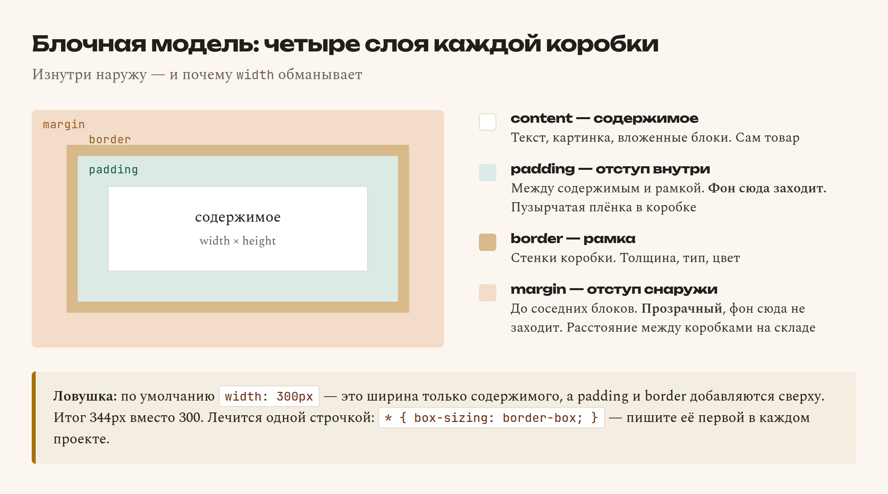

# Глава 10. Цвет, шрифт, отступы, рамки

> **Часть III. CSS — внешность** · Глава 10 из 60
> [← Глава 9](09-podklyuchaem-css.md) · [Глава 11 →](11-flexbox-i-grid.md)

## 🎯 Зачем эта глава

Селекторы вы знаете — умеете указать, кого красить. Теперь разберёмся, **чем** красить.

Свойств в CSS несколько сотен. Учить все не нужно и вредно. Мы возьмём три десятка,
которыми пользуются каждый день, и разберём **блочную модель** — ту самую вещь,
из-за которой у новичков «непонятно почему всё разъезжается».

Блочная модель — самая важная тема в CSS. Если понять её один раз, половина будущих
проблем исчезнет.

## 📖 Цвет

### **Четыре способа записать цвет**

```css
color: red;                      /* по имени */
color: #b5411f;                  /* шестнадцатеричный */
color: rgb(181, 65, 31);         /* по составу */
color: rgba(181, 65, 31, 0.5);   /* с прозрачностью */
```

| Способ | Когда применяют |
|---|---|
| **Имя** (`red`, `white`) | Быстрая проба. В работе почти не используют — оттенков мало |
| **`#b5411f`** | **Основной способ.** Так пишут 90% времени |
| **`rgb()`** | Когда цвет считает программа |
| **`rgba()`** | Когда нужна **прозрачность** |

### **Как читать `#b5411f`**

Решётка и шесть символов. Это три пары:

```
#b5  41  1f
 ↑   ↑   ↑
красный зелёный синий
```

Каждая пара — количество своего цвета от `00` (нет совсем) до `ff` (максимум).

| Запись | Что получится |
|---|---|
| `#000000` | Чёрный (ничего нет) |
| `#ffffff` | Белый (всё на максимуме) |
| `#ff0000` | Чистый красный |
| `#b5411f` | Много красного, немного зелёного, чуть синего → рыжий |

Если пары одинаковые, можно писать сокращённо: `#fff` = `#ffffff`, `#000` = `#000000`.

**Не нужно вычислять цвета в уме.** Их берут из палитры. Полезные сайты:
`coolors.co` (генератор палитр), `colorhunt.co` (готовые сочетания).

### **Прозрачность**

```css
background: rgba(181, 65, 31, 0.1);   /* 10% непрозрачности */
```

Четвёртое число — от `0` (полностью прозрачный) до `1` (полностью плотный).

Очень полезно для лёгких подложек: тот же цвет, что и акцент, но еле заметный.

### **Два разных свойства: `color` и `background`**

```css
.cena {
    color: white;              /* цвет ТЕКСТА */
    background: #b5411f;       /* цвет ФОНА */
}
```

Путают постоянно. `color` — только про буквы.

## 📖 Шрифт и текст

### **Основные свойства**

```css
body {
    font-family: Georgia, 'Times New Roman', serif;
    font-size: 16px;
    line-height: 1.6;
    color: #2b2622;
}
```

| Свойство | Что делает |
|---|---|
| `font-family` | Какой шрифт |
| `font-size` | Размер |
| `font-weight` | Насыщенность: `normal`, `bold` или число 100–900 |
| `font-style` | `italic` для курсива |
| `line-height` | **Межстрочное расстояние** |
| `text-align` | Выравнивание: `left`, `center`, `right` |
| `text-decoration` | `none` убирает подчёркивание, `underline` добавляет |
| `text-transform` | `uppercase` — ВСЁ ЗАГЛАВНЫМИ, `lowercase` — строчными |
| `letter-spacing` | Расстояние между буквами |

### **Почему в `font-family` несколько шрифтов**

```css
font-family: Georgia, 'Times New Roman', serif;
```

Это **список запасных вариантов**. Браузер пробует по очереди: нет Georgia — берёт
Times New Roman, нет и его — берёт любой шрифт с засечками.

Последним всегда ставят **семейство**: `serif` (с засечками), `sans-serif` (без засечек),
`monospace` (моноширинный). Так вы гарантируете хоть какой-то разумный результат
на любом устройстве.

Названия из двух слов берут в кавычки: `'Times New Roman'`.

### **`line-height` — недооценённое свойство**

```css
line-height: 1.6;
```

Число без единиц означает «в 1,6 раза больше размера шрифта».

**Это самое влиятельное свойство для читаемости текста.** Строки, стоящие впритык,
читать тяжело — глаз теряет строку.

| Значение | Где применяют |
|---|---|
| `1.2` | Крупные заголовки |
| `1.5–1.7` | **Обычный текст.** Золотая середина |
| `2` | Очень воздушно, для коротких блоков |

Поставьте `line-height: 1.6` в `body` — и сайт сразу станет приятнее. Одна строчка.

### **Единицы размера**

```css
font-size: 16px;     /* пиксели — фиксированно */
font-size: 1.2rem;   /* относительно размера страницы */
font-size: 1.2em;    /* относительно размера родителя */
width: 50%;          /* от ширины родителя */
```

| Единица | Смысл | Когда |
|---|---|---|
| `px` | Пиксель, жёстко | Рамки, мелкие отступы |
| `rem` | Кратно базовому размеру страницы (обычно 16px) | **Шрифты, отступы.** Лучший выбор |
| `em` | Кратно размеру родителя | Осторожно: вложенность умножается |
| `%` | Доля от родителя | Ширина блоков |

**Совет:** начинайте с `px` — они понятнее. Когда освоитесь, переходите на `rem`:
человек, увеличивший шрифт в настройках браузера, увидит увеличенный сайт,
а не поехавший.

## 📖 Блочная модель — главная тема главы

Вот та вещь, из-за которой всё «непонятно разъезжается».

**Каждый элемент на странице — это прямоугольная коробка.** У коробки четыре слоя,
изнутри наружу:

```
        ┌─────────── margin (внешний отступ) ───────────┐
        │  ┌──────── border (рамка) ────────────────┐   │
        │  │  ┌───── padding (внутренний отступ) ─┐  │   │
        │  │  │                                   │  │   │
        │  │  │          содержимое               │  │   │
        │  │  │                                   │  │   │
        │  │  └───────────────────────────────────┘  │   │
        │  └────────────────────────────────────────┘   │
        └───────────────────────────────────────────────┘
```



| Слой | Что это | Аналогия |
|---|---|---|
| **content** | Само содержимое | Товар |
| **padding** | Отступ **внутри**, между содержимым и рамкой | Пузырчатая плёнка в коробке |
| **border** | Рамка | Стенки коробки |
| **margin** | Отступ **снаружи**, до соседей | Расстояние между коробками на складе |

### **`padding` и `margin` — не путайте**

Это самая частая путаница у новичков. Запомните так:

- **`padding` отодвигает содержимое от края** своей же коробки. Фон коробки на него
  распространяется.
- **`margin` отодвигает коробку от соседей.** Он прозрачный — фон туда не заходит.

Практический пример: у кнопки `padding` делает её больше и «толще» (кликать удобнее),
а `margin` отодвигает её от текста выше.

### **Как их записывать**

```css
padding: 16px;                   /* со всех сторон */
padding: 16px 24px;              /* сверху-снизу | слева-справа */
padding: 8px 16px 12px 16px;     /* сверху | справа | снизу | слева */

padding-top: 16px;               /* только сверху */
padding-left: 24px;              /* только слева */
```

Четыре значения читаются **по часовой стрелке, начиная сверху**: верх, право, низ, лево.

То же самое работает для `margin`.

### **`box-sizing` — строчка, которая всё чинит**

А вот главная ловушка блочной модели.

```css
.karta {
    width: 300px;
    padding: 20px;
    border: 2px solid #ccc;
}
```

Вопрос: какой ширины получится карточка?

Ответ по умолчанию — **344 пикселя**. Потому что браузер считает так:

```
300 (содержимое) + 20 + 20 (padding) + 2 + 2 (border) = 344
```

То есть `width: 300px` задаёт ширину **содержимого**, а рамка и отступы добавляются
сверху. Абсолютно не то, чего ожидает человек.

Отсюда все «почему блоки не влезают в строку» и «почему две колонки по 50% съехали».

**Лечится одной строчкой в начале файла:**

```css
* {
    box-sizing: border-box;
}
```

Теперь `width: 300px` означает **300 пикселей вместе с рамкой и отступами**.
Как человек и думал.

**Пишите это в каждом проекте.** Это первое, что добавляют в свой CSS все разработчики.

### **Схлопывание внешних отступов**

Ещё одна странность, о которой полезно знать заранее.

```css
.a { margin-bottom: 20px; }
.b { margin-top: 30px; }
```

Между блоками будет **30 пикселей**, а не 50. Вертикальные `margin` соседей
не складываются — берётся **больший**.

Это не ошибка, а правило CSS. Знать полезно, чтобы не удивляться. Обходится
использованием `padding` у родителя или `gap` во флексе (глава 11).

## 📖 Рамки, скругления, тени

```css
.tovar {
    border: 1px solid #e3d8c6;
    border-radius: 8px;
    box-shadow: 0 2px 8px rgba(0, 0, 0, 0.08);
}
```

### **`border` — рамка**

```css
border: 1px solid #e3d8c6;
        ↑     ↑      ↑
     толщина  тип   цвет
```

Типы: `solid` (сплошная), `dashed` (пунктир), `dotted` (точки), `none` (нет).

Можно только с одной стороны:

```css
border-bottom: 2px solid #b5411f;   /* подчёркивание заголовка */
border-left: 4px solid #b5411f;     /* цветной корешок у блока */
```

### **`border-radius` — скругление**

```css
border-radius: 8px;      /* все углы */
border-radius: 50%;      /* круг — если элемент квадратный */
```

Скруглённые углы визуально «смягчают» интерфейс. 6–10 пикселей — универсальное
значение для карточек и кнопок.

### **`box-shadow` — тень**

```css
box-shadow: 0 2px 8px rgba(0, 0, 0, 0.08);
            ↑  ↑   ↑         ↑
          сдвиг   размытие   цвет с прозрачностью
          X  Y
```

**Главный совет по теням:** делайте их **еле заметными**. `0.08` вместо `0.5`.
Тень должна создавать ощущение объёма, а не бросаться в глаза. Резкие чёрные тени —
самый узнаваемый признак любительской вёрстки.

## 📖 Кнопки: собираем всё вместе

```css
button {
    background: #b5411f;
    color: white;
    border: none;
    padding: 10px 20px;
    border-radius: 6px;
    font-size: 15px;
    font-family: inherit;
    cursor: pointer;
    transition: background 0.2s;
}

button:hover {
    background: #8f3418;
}

button:active {
    transform: translateY(1px);
}
```

Три детали, которые отличают хорошую кнопку:

**`cursor: pointer`** — курсор превращается в руку. Без этого человек не понимает,
что на элемент можно нажать.

**`font-family: inherit`** — кнопки по умолчанию используют системный шрифт,
а не ваш. Эта строчка заставляет их взять шрифт страницы.

**`transition: background 0.2s`** — цвет меняется **плавно** за 0,2 секунды,
а не рывком. Одно из самых выгодных свойств в CSS: минимум усилий, максимум ощущения
качества.

`:active` — состояние «прямо сейчас нажимают». `translateY(1px)` сдвигает кнопку
на пиксель вниз — она как будто продавливается.

## 🔤 Разбор по словам

| Свойство | Что делает |
|---|---|
| `color` | Цвет **текста** |
| `background` | Цвет **фона** |
| `font-family` | Шрифт, списком запасных вариантов |
| `font-size` | Размер шрифта |
| `font-weight` | Насыщенность: `bold` или 100–900 |
| `line-height` | Межстрочное расстояние. `1.6` для текста |
| `text-align` | Выравнивание |
| `text-decoration: none` | Убрать подчёркивание |
| `padding` | Отступ **внутри** коробки |
| `margin` | Отступ **снаружи**, до соседей |
| `border` | Рамка: толщина, тип, цвет |
| `border-radius` | Скругление углов |
| `box-shadow` | Тень |
| `box-sizing: border-box` | Считать ширину вместе с рамкой и отступами |
| `cursor: pointer` | Курсор-рука |
| `transition` | Плавное изменение |
| `inherit` | «Взять у родителя» |

## ⚠️ Грабли

**Забыть `box-sizing: border-box`.** Блоки перестают влезать, колонки съезжают.
Первая строчка в любом CSS-файле.

**Путать `padding` и `margin`.** Внутри — `padding`, снаружи — `margin`.
Проверить легко: покрасьте элемент в яркий цвет. Фон зальёт `padding`, но не `margin`.

**Тени как из фотошопа 2005 года.** `rgba(0,0,0,0.08)` — хорошо.
`box-shadow: 5px 5px 0 black` — плохо.

**Слишком много шрифтов.** Два шрифта на сайт: один для заголовков, один для текста.
Три — уже перебор.

**Мелкий `line-height` в тексте.** Значение по умолчанию (`normal`, около 1.2)
слишком плотное для чтения. Ставьте 1.5–1.7.

**Задавать `width` кнопкам и полям.** Лучше `padding` — тогда элемент подстроится
под содержимое сам.

## 🏋️ Задачи

**Задача 10.1.** Посчитайте в уме итоговую ширину, без `box-sizing: border-box`:

```css
.blok { width: 200px; padding: 15px; border: 3px solid black; }
```

А с `border-box`?

**Задача 10.2.** Что делает каждая строчка? Опишите словами:

```css
padding: 10px 20px;
margin: 0 auto;
border-bottom: 2px solid #b5411f;
border-radius: 50%;
line-height: 1.6;
text-transform: uppercase;
```

(Второе — фокус, который часто встречается. Разберитесь, что он делает.)

**Задача 10.3.** Оформите карточку товара: белый фон, рамка `1px` светло-серая,
скругление `8px`, внутренний отступ `20px`, внешний отступ снизу `16px`,
еле заметная тень.

**Задача 10.4.** Сделайте кнопку «Купить» приятной: свой цвет, белый текст,
без рамки, скругление, `cursor: pointer`, плавное потемнение при наведении,
продавливание при нажатии.

**Задача 10.5.** Наберите три цвета для магазина и примените:
основной (заголовки), фоновый (страница), акцентный (цены и кнопки).
Возьмите на `coolors.co`.

**Задача 10.6.** Эксперимент с блочной моделью. Сделайте `<div>` с текстом, задайте
ему яркий фон и по очереди попробуйте:

1. `padding: 30px` — что изменилось?
2. Уберите, поставьте `margin: 30px` — что изменилось?
3. В чём разница по фону?

**Задача 10.7.** Откройте F12 → Elements, выберите любой элемент. Внизу справа
увидите разноцветную схему блочной модели: синий — содержимое, зелёный — `padding`,
жёлтый — `border`, оранжевый — `margin`. Наведите на каждый слой.

**Задача 10.8.** Найдите на своём сайте три места, где напрашивается `transition`,
и добавьте.

*Ответы — в [Приложении Г](../prilozheniya/4-G-otvety.md).*

## 🔗 В бою

Откройте `assets/css/custom.css` в этом репозитории. Найдите там правила
для карточек товаров.

Увидите то же самое: `border`, `border-radius`, `padding`, `box-shadow`, `transition`.
Никакой магии — те же двадцать свойств, что вы только что выучили.

Обратите внимание: цвета в боевом файле вынесены в переменные наверху файла.
Это следующий уровень организации — поменял одно значение, изменилось везде.
Тоже несложно, дойдём.

## 📌 Итог

- Цвет: `#b5411f` — основной способ, `rgba(...)` — когда нужна прозрачность.
- `color` — текст, `background` — фон.
- `line-height: 1.6` — самое выгодное свойство для читаемости.
- В `font-family` — **список запасных** вариантов, последним семейство.
- **Блочная модель**: content → padding → border → margin.
- **`padding` внутри, `margin` снаружи.**
- **`* { box-sizing: border-box; }`** — первая строчка любого CSS.
- Вертикальные `margin` соседей **схлопываются** — берётся больший.
- Тени еле заметные: `rgba(0,0,0,0.08)`.
- `cursor: pointer` и `transition` — две мелочи, которые делают сайт живым.

Дальше — раскладка. Научимся ставить блоки рядом, в сетку и по центру.

[← Глава 9](09-podklyuchaem-css.md) · [Глава 11. Flexbox и Grid →](11-flexbox-i-grid.md)
