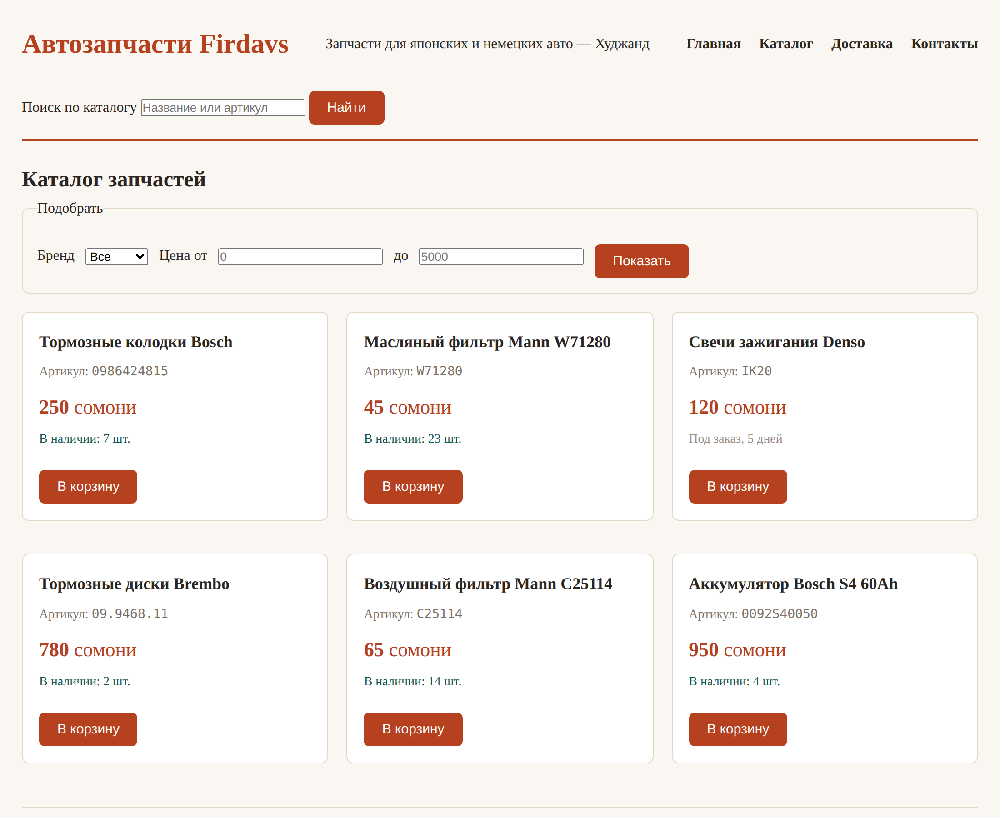

# Глава 11. Flexbox и Grid: раскладка

> **Часть III. CSS — внешность** · Глава 11 из 60
> [← Глава 10](10-cvet-shrift-otstupy.md) · [Глава 12 →](12-adaptivnost.md)

## 🎯 Зачем эта глава

Ваш каталог сейчас идёт **в один столбик**. Шесть карточек одна под другой,
на широком экране справа пусто.

Причина известна из главы 5: `<article>` — блочный элемент, а блочные занимают
всю строку.

В этой главе научимся управлять раскладкой. Двумя инструментами:

- **Flexbox** — выстроить элементы **в ряд** (или в столбец) и распределить между ними место;
- **Grid** — разложить элементы по **сетке** из строк и столбцов.

Это самая практичная тема во всём CSS. После неё вы сможете сверстать любую страницу.

## 📖 Flexbox: элементы в ряд

### **Одна строчка меняет всё**

```css
nav ul {
    display: flex;
}
```

Всё. Пункты меню, которые стояли столбиком, встали в строку.

**Как это работает.** Вы говорите **родителю**: «ты теперь флекс-контейнер».
И он начинает выстраивать своих детей в ряд, независимо от того, блочные они или нет.

Два понятия, которые нужно развести:

- **Контейнер** — родитель, которому написали `display: flex`;
- **Элементы** — его прямые дети. Они выстраиваются.

Важно: `display: flex` действует **только на прямых детей**. Внуки не затрагиваются.

### **Направление**

```css
.spisok {
    display: flex;
    flex-direction: row;      /* в строку — по умолчанию */
}
```

| Значение | Как расставит |
|---|---|
| `row` | В строку, слева направо (по умолчанию) |
| `column` | В столбец, сверху вниз |
| `row-reverse` | В строку, справа налево |
| `column-reverse` | В столбец, снизу вверх |

### **Промежутки — `gap`**

```css
nav ul {
    display: flex;
    gap: 20px;
}
```

`gap` ставит расстояние **между** элементами. Без внешних краёв, без схлопывания,
без возни с `margin`.

**Пользуйтесь `gap` вместо `margin` для промежутков во флексе.** Это проще
и предсказуемее.

### **Распределение по горизонтали: `justify-content`**

```css
header {
    display: flex;
    justify-content: space-between;
}
```

| Значение | Что делает |
|---|---|
| `flex-start` | Всё влево (по умолчанию) |
| `center` | Всё по центру |
| `flex-end` | Всё вправо |
| `space-between` | **Первый влево, последний вправо, остальные равномерно** |
| `space-around` | Равные промежутки вокруг каждого |
| `space-evenly` | Совсем равные промежутки везде |

`space-between` — самое востребованное. Это классическая шапка сайта:
логотип слева, меню справа, между ними пусто.

### **Выравнивание по вертикали: `align-items`**

```css
.tovar-stroka {
    display: flex;
    align-items: center;
}
```

| Значение | Что делает |
|---|---|
| `stretch` | Растянуть на всю высоту (по умолчанию) |
| `center` | **По центру вертикали** |
| `flex-start` | По верхнему краю |
| `flex-end` | По нижнему краю |
| `baseline` | По базовой линии текста |

**`align-items: center` — решение вечной задачи «как выровнять по вертикали».**
До Flexbox это была настоящая головная боль с костылями. Теперь — одна строчка.

### **Как запомнить, где какое**

Частая путаница: `justify-content` или `align-items`?

Запомните привязку к направлению:

- **`justify-content` работает вдоль основного направления** (при `row` — по горизонтали);
- **`align-items` — поперёк** (при `row` — по вертикали).

Если поставить `flex-direction: column`, они поменяются ролями. Логично, но
поначалу непривычно.

### **Перенос на новую строку**

```css
.katalog {
    display: flex;
    flex-wrap: wrap;
    gap: 16px;
}
```

По умолчанию флекс **сжимает** элементы, лишь бы уместить в одну строку.
`flex-wrap: wrap` разрешает переносить их на следующую.

**Для каталога товаров это обязательно.** Без него шесть карточек сожмутся в ниточки.

### **Как элементы делят место: `flex`**

```css
.tovar {
    flex: 1;            /* все поровну */
}
```

```css
.osnovnoe { flex: 2; }  /* вдвое шире */
.bokovaya { flex: 1; }
```

`flex: 1` означает «занимай равную долю свободного места».

Практический приём для карточек:

```css
.tovar {
    flex: 1 1 280px;
}
```

Читается: «расти можно, сжиматься можно, базовая ширина 280px». Карточки сами
заполнят ряд, а лишние перенесутся вниз. Ровно то, что нужно каталогу.

### **Центрирование чего угодно**

```css
.centr {
    display: flex;
    justify-content: center;
    align-items: center;
    min-height: 300px;
}
```

Три строчки — и содержимое ровно по центру и по горизонтали, и по вертикали.
Задача, которая двадцать лет была мемом среди верстальщиков.

## 📖 Grid: раскладка по сетке

Flexbox думает **одной линией** — ряд или столбец. Grid думает **двумя измерениями
сразу** — строки и столбцы.

### **Простая сетка**

```css
.katalog {
    display: grid;
    grid-template-columns: 1fr 1fr 1fr;
    gap: 20px;
}
```

Три колонки одинаковой ширины, промежуток 20 пикселей.

**`fr`** — новая единица, «доля свободного места». `1fr 1fr 1fr` = три равные доли.

```css
grid-template-columns: 2fr 1fr;        /* левая вдвое шире */
grid-template-columns: 300px 1fr;      /* левая фиксированная, правая тянется */
grid-template-columns: repeat(4, 1fr); /* то же, что 1fr 1fr 1fr 1fr */
```

### **Самая полезная строчка Grid**

```css
.katalog {
    display: grid;
    grid-template-columns: repeat(auto-fill, minmax(260px, 1fr));
    gap: 20px;
}
```

Выглядит сложно, читается просто:

| Кусок | Что говорит |
|---|---|
| `repeat(auto-fill, ...)` | «Сделай столько колонок, сколько влезет» |
| `minmax(260px, 1fr)` | «Каждая колонка не у́же 260px, но может растянуться» |

**Что это даёт:** на широком мониторе получится пять колонок, на ноутбуке три,
на планшете две, на телефоне одна. **Автоматически, без единого медиазапроса.**

Это лучшее решение для каталога товаров, и его стоит просто запомнить наизусть.

### **Раскладка всей страницы**

Grid умеет то, чего не умеет Flexbox, — расставлять блоки по именованным областям:

```css
body {
    display: grid;
    grid-template-areas:
        "shapka  shapka"
        "bok     osnova"
        "podval  podval";
    grid-template-columns: 240px 1fr;
    gap: 20px;
}

header { grid-area: shapka; }
aside  { grid-area: bok; }
main   { grid-area: osnova; }
footer { grid-area: podval; }
```

Раскладка нарисована прямо в коде — видно глазами, как выглядит страница.

### **Flexbox или Grid?**

Простое правило:

| Задача | Инструмент |
|---|---|
| Элементы **в ряд**: меню, кнопки, шапка | **Flexbox** |
| Выровнять по центру | **Flexbox** |
| **Сетка** карточек: каталог, галерея | **Grid** |
| Раскладка **всей страницы** | **Grid** |
| Содержимое **внутри** карточки | **Flexbox** |

И главное: **они не конкуренты, а напарники.** Обычная страница — Grid снаружи,
Flexbox внутри каждой ячейки.

## 💻 Каталог в сетку

Добавьте в `style.css`:

```css
/* Каталог — автоматическая сетка */
.katalog {
    display: grid;
    grid-template-columns: repeat(auto-fill, minmax(260px, 1fr));
    gap: 20px;
    margin-top: 20px;
}

/* Карточка — колонка, кнопка прижата вниз */
.tovar {
    display: flex;
    flex-direction: column;
    background: white;
    border: 1px solid #e3d8c6;
    border-radius: 8px;
    padding: 18px;
    transition: box-shadow 0.2s, border-color 0.2s;
}

.tovar:hover {
    border-color: #b5411f;
    box-shadow: 0 4px 16px rgba(181, 65, 31, 0.12);
}

/* Пустое место «распирает» карточку, прижимая кнопку к низу */
.tovar form {
    margin-top: auto;
    padding-top: 12px;
}

/* Шапка: название слева, меню справа */
header {
    display: flex;
    flex-wrap: wrap;
    justify-content: space-between;
    align-items: center;
    gap: 16px;
}

/* Фильтры в строку */
.filtry fieldset {
    display: flex;
    flex-wrap: wrap;
    align-items: center;
    gap: 12px;
    border: 1px solid #e3d8c6;
    border-radius: 8px;
    padding: 16px;
}
```

В HTML нужно завернуть товары в контейнер:

```html
<div class="katalog">
    <article class="tovar">...</article>
    <article class="tovar">...</article>
    ...
</div>
```

### **Приём с `margin-top: auto`**

Обратите внимание на одну хитрость:

```css
.tovar { display: flex; flex-direction: column; }
.tovar form { margin-top: auto; }
```

`margin-top: auto` во флексе означает «забери всё свободное место сверху».
Кнопка прижимается к низу карточки.

**Зачем:** у товаров названия разной длины, карточки получаются разной высоты,
и кнопки оказываются на разных уровнях — выглядит неряшливо. С этим приёмом
кнопки всегда на одной линии.

Мелочь, которая отличает аккуратную вёрстку от небрежной.

## 🖥 На экране



Тот же HTML, те же товары — но теперь это выглядит как магазин, а не как список.

Попробуйте изменить ширину окна браузера: колонки перестроятся сами.
Мы не написали для этого ни одного условия — работает `auto-fill` с `minmax`.

## 🔤 Разбор по словам

| Свойство | Где пишется | Что делает |
|---|---|---|
| `display: flex` | у родителя | Выстроить детей в ряд |
| `flex-direction` | у родителя | `row` (строка) или `column` (столбец) |
| `gap` | у родителя | Промежуток между элементами |
| `justify-content` | у родителя | Распределение **вдоль** направления |
| `align-items` | у родителя | Выравнивание **поперёк** |
| `flex-wrap: wrap` | у родителя | Разрешить перенос на новую строку |
| `flex: 1` | у ребёнка | Занять равную долю места |
| `margin-top: auto` | у ребёнка | Прижать к низу |
| `display: grid` | у родителя | Включить сетку |
| `grid-template-columns` | у родителя | Сколько колонок и какой ширины |
| `1fr` | | Доля свободного места |
| `repeat(auto-fill, minmax(260px, 1fr))` | | Столько колонок, сколько влезет |
| `grid-template-areas` | у родителя | Раскладка страницы «картинкой» |

## ⚠️ Грабли

**Писать `display: flex` не тому элементу.** Флекс задаётся **родителю**,
а выстраиваются **дети**. Хотите поставить карточки в ряд — `display: flex`
пишется контейнеру, а не карточке.

**Забыть `flex-wrap: wrap`.** Восемь карточек сожмутся в узкие полоски вместо
переноса на вторую строку.

**Путать `justify-content` и `align-items`.** Запомните: `justify` — вдоль,
`align` — поперёк.

**Задавать карточкам жёсткую `width`.** Ломает и Flexbox, и Grid.
Пусть шириной управляет раскладка: `flex: 1 1 280px` или `minmax()`.

**Строить сетку карточек на Flexbox.** Можно, но в последнем ряду карточки
растянутся и станут шире остальных. Grid такого не делает — для сеток берите Grid.

**Городить `float`.** Если увидите этот способ в старой статье — не берите.
`float` придуман для обтекания картинки текстом, раскладку им делали от безысходности
до появления Flexbox.

## 🏋️ Задачи

**Задача 11.1.** Переведите каталог на Grid по примеру из главы. Проверьте,
как перестраивается при изменении ширины окна.

**Задача 11.2.** Что произойдёт в каждом случае?

```css
.a { display: flex; justify-content: center; }
.b { display: flex; flex-direction: column; align-items: center; }
.c { display: flex; justify-content: space-between; align-items: center; }
.d { display: grid; grid-template-columns: 1fr 2fr; }
```

**Задача 11.3.** Сделайте шапку: название слева, меню справа, по центру
по вертикали. Одним `display: flex`.

**Задача 11.4.** Выровняйте блок ровно по центру экрана — и по горизонтали,
и по вертикали. Три строчки.

**Задача 11.5.** Сделайте карточку товара горизонтальной: фото слева,
описание справа, кнопка прижата к правому краю.

**Задача 11.6.** Сколько будет колонок при ширине окна 1200px, если написано
`repeat(auto-fill, minmax(280px, 1fr))` и `gap: 20px`? Посчитайте, потом проверьте
в браузере.

**Задача 11.7.** Разложите страницу через `grid-template-areas`: шапка на всю ширину,
слева фильтры 250px, справа каталог, внизу подвал на всю ширину.

**Задача 11.8.** Откройте `flexboxfroggy.com` — игра, где нужно довести лягушку
до листика с помощью свойств Flexbox. 24 уровня, полчаса времени, и Flexbox
укладывается в голову намертво. Есть русская версия.

*Ответы — в [Приложении Г](../prilozheniya/4-G-otvety.md).*

## 🔗 В бою

Магазин autodoc.tj построен на Bootstrap — это готовый набор классов для раскладки.
Там пишут не `display: flex`, а `class="row"` и `class="col-md-4"`.

Под капотом у Bootstrap — тот же Flexbox. Классы просто дают ему готовые имена.

**Вывод, который стоит запомнить:** сначала изучают, как работает механизм,
потом — готовые надстройки над ним. Кто выучил только классы Bootstrap,
беспомощен, как только нужно что-то нестандартное. Кто понимает Flexbox,
разберётся в любом фреймворке за вечер.

## 📌 Итог

- **Flexbox** — одна линия: ряд или столбец. **Grid** — сетка из строк и столбцов.
- `display: flex` пишется **родителю**, выстраиваются **дети**.
- `gap` — промежутки. Лучше, чем `margin`.
- `justify-content` — **вдоль** направления, `align-items` — **поперёк**.
- `flex-wrap: wrap` обязателен, если элементов много.
- Центрирование: `display: flex; justify-content: center; align-items: center;`
- **Каталог товаров:** `grid-template-columns: repeat(auto-fill, minmax(260px, 1fr))`.
  Запомните наизусть — работает без медиазапросов.
- `margin-top: auto` прижимает кнопку к низу карточки.
- Обычная страница: **Grid снаружи, Flexbox внутри**.

Дальше — адаптивность: сделаем так, чтобы сайт был удобен на телефоне.

[← Глава 10](10-cvet-shrift-otstupy.md) · [Глава 12. Адаптивность →](12-adaptivnost.md)
