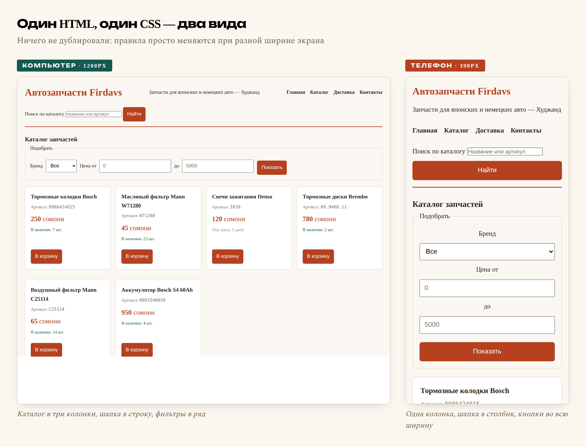

# Глава 12. Адаптивность: сайт на телефоне

> **Часть III. CSS — внешность** · Глава 12 из 60
> [← Глава 11](11-flexbox-i-grid.md) · [Глава 13 →](13-praktika-krasivyi-katalog.md)

## 🎯 Зачем эта глава

Один факт, который меняет приоритеты: **больше половины покупателей зайдут
в ваш магазин с телефона.** В Таджикистане доля мобильных ещё выше — многие
вообще не пользуются компьютером.

Это значит, что сайт, удобный только на большом экране, — это сайт, неудобный
для большинства.

В этой главе научимся делать так, чтобы одна и та же страница выглядела правильно
и на мониторе, и на телефоне. Инструментов понадобится немного, и один вы уже видели.

## 📖 Что такое адаптивность

**Адаптивный сайт** — тот, который подстраивается под ширину экрана.

Не «мобильная версия на отдельном адресе» — так делали пятнадцать лет назад,
и это означало поддерживать два сайта. Сегодня подход другой: **один HTML,
один CSS, разное поведение** в зависимости от ширины.

Три вещи, которые для этого нужны:

1. `<meta name="viewport">` — вы уже написали её в главе 8;
2. **Гибкие размеры** вместо жёстких;
3. **Медиазапросы** — правила, которые включаются при определённой ширине.

## 📖 Гибкие размеры

Половина проблем решается до всяких медиазапросов — просто отказом от жёстких чисел.

### **Что заменить**

```css
/* Плохо — не поместится на телефоне */
.karta { width: 400px; }

/* Хорошо — подстроится */
.karta { max-width: 400px; width: 100%; }
```

`max-width` означает «не шире, чем», но уже — можно. На широком экране карточка
будет 400px, на узком — по ширине экрана.

**Правило:** пишите `max-width` вместо `width` почти всегда.

### **Контейнер по центру**

```css
.container {
    max-width: 1200px;
    margin: 0 auto;
    padding: 0 16px;
}
```

Три строчки, которые есть на любом сайте:

- `max-width` — на огромном мониторе текст не растянется на всю ширину
  (читать строку в 300 символов невозможно);
- `margin: 0 auto` — **центрирование блока**. `auto` слева и справа делит
  свободное место поровну;
- `padding: 0 16px` — на телефоне текст не прилипнет к краям экрана.

### **Гибкие картинки**

```css
img {
    max-width: 100%;
    height: auto;
}
```

Две строчки, которые нужно написать в каждом проекте. Без них большое фото
вылезет за края экрана и появится горизонтальная прокрутка — одна из самых
раздражающих вещей на телефоне.

`height: auto` сохраняет пропорции при сжатии.

## 📖 Медиазапросы

Теперь главный инструмент.

**Медиазапрос — это блок правил, которые включаются только при определённом
условии.** Обычно условие — ширина экрана.

```css
/* Обычные правила — работают всегда */
.katalog {
    grid-template-columns: repeat(3, 1fr);
}

/* А это включится только на экранах уже 768px */
@media (max-width: 768px) {
    .katalog {
        grid-template-columns: 1fr;
    }
}
```

Читается: «если ширина экрана **не больше** 768 пикселей — сделать одну колонку».

### **Как это устроено**

```css
@media (max-width: 768px) { ... }
@media (min-width: 1024px) { ... }
@media (min-width: 768px) and (max-width: 1023px) { ... }
```

| Условие | Когда сработает |
|---|---|
| `max-width: 768px` | Экран **у́же или равен** 768px |
| `min-width: 1024px` | Экран **шире или равен** 1024px |
| `and` | Оба условия сразу |

⚠️ Частая путаница: `max-width` в медиазапросе означает «до этой ширины»,
то есть **более узкие** экраны. Легко перепутать с `max-width` у элемента,
где смысл другой.

### **Типовые точки перелома**

```css
/* Телефон:      до 600px  */
/* Планшет:      600-900px */
/* Ноутбук:      900-1200px */
/* Большой экран: от 1200px */
```

Эти числа не священны. Правильный подход — **сужать окно браузера и смотреть,
где вёрстка начинает выглядеть плохо**. Вот там и ставить точку перелома.

Гнаться за конкретными моделями телефонов бессмысленно: их сотни, и каждый год
выходят новые.

## 📖 Mobile-first: правильный порядок

Есть два способа писать адаптивный CSS.

### **Способ 1: от большого к малому**

```css
.katalog { grid-template-columns: repeat(4, 1fr); }

@media (max-width: 900px) { .katalog { grid-template-columns: repeat(2, 1fr); } }
@media (max-width: 600px) { .katalog { grid-template-columns: 1fr; } }
```

Сначала пишем для компьютера, потом «чиним» для телефона.

### **Способ 2: mobile-first — от малого к большому**

```css
.katalog { grid-template-columns: 1fr; }

@media (min-width: 600px) { .katalog { grid-template-columns: repeat(2, 1fr); } }
@media (min-width: 900px) { .katalog { grid-template-columns: repeat(4, 1fr); } }
```

Сначала пишем **для телефона**, потом добавляем колонки на широких экранах.

### **Почему mobile-first лучше**

**Практическая причина.** Телефон получает только базовые правила — простые
и лёгкие. Компьютер получает базовые плюс дополнительные. Телефон, у которого
обычно слабее и связь, и процессор, делает меньше работы.

**Причина посерьёзнее — про мышление.** Начиная с узкого экрана, вы вынуждены
сразу отвечать на вопрос: *что здесь действительно важно?* На 360 пикселях
не поместится всё — придётся выбирать главное.

А потом на большом экране добавить второстепенное — легко.

Если начать с компьютера, вы напихаете всего, а потом будете мучительно решать,
что выбросить. Обычно кончается тем, что не выбрасывают ничего, и на телефоне
получается каша.

## 💻 Адаптивные стили для магазина

Добавьте в конец `style.css`:

```css
/* ===== Основа: пишем для телефона ===== */

.container {
    max-width: 1200px;
    margin: 0 auto;
    padding: 0 16px;
}

img {
    max-width: 100%;
    height: auto;
}

body {
    font-size: 16px;
    padding: 16px;
}

h1 { font-size: 24px; }
h2 { font-size: 20px; }

/* Шапка на телефоне — в столбик */
header {
    display: flex;
    flex-direction: column;
    align-items: flex-start;
    gap: 12px;
}

/* Меню переносится, если не влезает */
nav ul {
    display: flex;
    flex-wrap: wrap;
    gap: 16px;
    list-style: none;
}

/* Каталог: одна колонка */
.katalog {
    display: grid;
    grid-template-columns: 1fr;
    gap: 16px;
}

/* Фильтры в столбик */
.filtry fieldset {
    display: flex;
    flex-direction: column;
    gap: 10px;
}

.filtry input,
.filtry select {
    width: 100%;
    padding: 10px;
    font-size: 16px;
}

/* Кнопки на телефоне — во всю ширину, пальцем не промахнёшься */
button {
    width: 100%;
    padding: 14px;
    font-size: 16px;
}

/* ===== Планшет: от 600px ===== */
@media (min-width: 600px) {
    body { padding: 24px; }
    h1 { font-size: 28px; }

    .katalog { grid-template-columns: repeat(2, 1fr); }

    .filtry fieldset {
        flex-direction: row;
        flex-wrap: wrap;
        align-items: center;
    }

    .filtry input,
    .filtry select { width: auto; }

    button { width: auto; }
}

/* ===== Компьютер: от 900px ===== */
@media (min-width: 900px) {
    h1 { font-size: 32px; }

    header {
        flex-direction: row;
        justify-content: space-between;
        align-items: center;
    }

    .katalog {
        grid-template-columns: repeat(auto-fill, minmax(260px, 1fr));
    }
}
```

Заметьте порядок: сначала — как на телефоне, потом добавки.

## 📖 Мелочи, которые решают на телефоне

Несколько вещей, о которых обычно не пишут в учебниках, но которые сразу видно
живому человеку.

### **Размер шрифта в полях — минимум 16px**

```css
input, select, textarea {
    font-size: 16px;
}
```

**Почему именно 16.** Safari на iPhone автоматически **увеличивает страницу**,
когда человек нажимает на поле со шрифтом меньше 16px. Выглядит как сбой:
человек тапнул в поле — сайт «прыгнул».

Ровно 16px и больше — не прыгает.

### **Кнопки не меньше 44 пикселей**

```css
button, .knopka {
    min-height: 44px;
    padding: 12px 20px;
}
```

44 пикселя — размер, который Apple вывела как минимальный для уверенного попадания
пальцем. Меньше — человек промахивается и раздражается.

### **Ссылки в меню — с отступами**

Маленькие ссылки рядом друг с другом на телефоне — беда. Отступ 12–16px между ними
спасает от случайных нажатий.

### **Горизонтальная прокрутка — всегда ошибка**

Если на телефоне страницу можно двигать вбок — что-то вылезло за края.
Обычно виновники: широкая картинка без `max-width: 100%`, таблица,
блок с жёсткой `width` или длинное слово без переносов.

Ищется так: в F12 включите режим телефона и постепенно сужайте — увидите,
на чём начинается прокрутка.

### **Таблицы на телефоне**

Таблица шириной в шесть колонок на экране 360px не помещается никак.
Простейшее решение — разрешить ей прокручиваться внутри своего блока:

```css
.tablica-obertka {
    overflow-x: auto;
}
```

```html
<div class="tablica-obertka">
    <table>...</table>
</div>
```

Теперь прокручивается только таблица, а страница остаётся на месте.

## 🖥 На экране

Тот же самый файл, та же страница. Слева — на компьютере, справа — на телефоне
шириной 390 пикселей:



Мы не делали вторую версию сайта. **Один HTML, один CSS** — просто правила
меняются при разной ширине.

Обратите внимание, что изменилось на узком экране:

- каталог стал одноколоночным;
- шапка встала в столбик;
- фильтры выстроились вертикально и растянулись на всю ширину;
- кнопки стали во всю ширину — пальцем не промахнуться;
- поля крупные, страница не прыгает при нажатии.

## 📖 Как это проверять

**Способ 1: F12 → значок телефона.**
В панели разработчика есть кнопка переключения на мобильный вид (слева вверху панели,
значок телефона с планшетом). Можно выбрать модель или задать ширину вручную.

**Способ 2: просто сузить окно браузера.**
Грубее, но быстро и показывает, где вёрстка ломается.

**Способ 3: открыть на настоящем телефоне.**
Самый честный. Пока сайт лежит у вас на компьютере, откройте его так:

```bash
php -S 0.0.0.0:8000
```

Узнайте свой IP в локальной сети (команда `ipconfig` на Windows, `ifconfig`
или `ip a` на Mac и Linux) и откройте на телефоне `http://192.168.1.5:8000`,
подставив свой адрес. Компьютер и телефон должны быть в одной Wi-Fi-сети.

**Обязательно проверяйте на настоящем телефоне.** Эмулятор в браузере не покажет,
как реагирует ваш палец, как ведёт себя клавиатура и насколько мелкий на самом деле
текст.

## 🔤 Разбор по словам

| Запись | Что означает |
|---|---|
| `@media (max-width: 768px)` | Правила для экранов **уже** 768px |
| `@media (min-width: 900px)` | Правила для экранов **шире** 900px |
| `max-width` у элемента | «Не шире, чем». Уже — можно |
| `margin: 0 auto` | Центрировать блок по горизонтали |
| `width: 100%` | Во всю ширину родителя |
| `overflow-x: auto` | Разрешить горизонтальную прокрутку **внутри** блока |
| `min-height: 44px` | Минимальная высота — палец попадёт |
| **mobile-first** | Сначала стили для телефона, потом добавки для широких экранов |
| **точка перелома** | Ширина, на которой меняется раскладка |

## ⚠️ Грабли

**Забыть `<meta name="viewport">`.** Всё остальное бессмысленно: телефон уменьшит
страницу целиком, и медиазапросы даже не сработают. Проверьте первым делом.

**Жёсткая `width` у блоков.** Главная причина горизонтальной прокрутки.
Замените на `max-width`.

**Шрифт в полях меньше 16px.** Страница будет прыгать на iPhone.

**Слишком много точек перелома.** Три-четыре достаточно. Десять — и вы сами
перестанете понимать, что где включается.

**Прятать содержимое на телефоне через `display: none`.** Соблазнительно
(«не влезает — уберу»), но человек с телефона хочет того же, что и с компьютера.
Не прячьте, а перестраивайте.

**Проверять только в эмуляторе.** Откройте на настоящем телефоне хотя бы раз —
обязательно найдёте что-то, чего эмулятор не показал.

## 🏋️ Задачи

**Задача 12.1.** Сделайте свой каталог адаптивным по примеру из главы.
Проверьте на трёх ширинах: 360px, 768px, 1200px.

**Задача 12.2.** На какой ширине сработает каждый запрос?

```css
@media (max-width: 600px) { }
@media (min-width: 900px) { }
@media (min-width: 600px) and (max-width: 899px) { }
```

**Задача 12.3.** Перепишите в стиле mobile-first:

```css
.blok { display: flex; gap: 20px; }
@media (max-width: 700px) {
    .blok { display: block; }
}
```

**Задача 12.4.** Сузьте окно браузера на своём сайте до 320px — самый узкий
современный телефон. Появилась горизонтальная прокрутка? Найдите виновника и почините.

**Задача 12.5.** Сделайте таблицу прайса из главы 7 прокручиваемой на телефоне.

**Задача 12.6.** Откройте свой сайт на настоящем телефоне. Запишите три вещи,
которые оказались неудобными. Почините их.

**Задача 12.7.** Проверьте свой сайт в `pagespeed.web.dev` — это бесплатный
инструмент Google. Он покажет оценку для мобильных и список проблем.
Какая оценка? Что он предлагает исправить?

**Задача 12.8.** Найдите на любом сайте место, где на телефоне неудобно.
Сформулируйте, почему именно, и как бы вы это исправили. Умение замечать
неудобство — половина работы дизайнера.

*Ответы — в [Приложении Г](../prilozheniya/G-otvety.md).*

## 🔗 В бою

Загляните в `assets/css/custom.css` и поищите `@media`. Найдёте несколько блоков.

Самое интересное там — правила для меню каталога: на компьютере это боковая колонка,
на телефоне оно превращается в выпадающий список. Не спрятано, а **перестроено** —
ровно то, о чём мы говорили.

И маленький штрих из жизни: карточки товаров на боевом сайте специально сделаны
с крупными кнопками. Не для красоты — потому что покупатель обычно стоит у машины,
на улице, одной рукой держит телефон, и промахиваться ему нечем.

## 📌 Итог

- Больше половины покупателей придут **с телефона**. Это не «потом», это сразу.
- Три опоры адаптивности: **viewport**, **гибкие размеры**, **медиазапросы**.
- `max-width` вместо `width`. `img { max-width: 100%; height: auto; }` в каждый проект.
- `margin: 0 auto` центрирует блок.
- `@media (max-width: ...)` — для узких, `(min-width: ...)` — для широких.
- **Mobile-first**: сначала телефон, потом добавки. Заставляет выбрать главное.
- Шрифт в полях — **минимум 16px**, иначе iPhone будет прыгать.
- Кнопки — **минимум 44px** высотой.
- Горизонтальная прокрутка на телефоне — всегда ошибка.
- Не прячьте содержимое на телефоне. Перестраивайте.
- Проверяйте на **настоящем** телефоне.

Следующая глава — практическая. Доведём магазин до вида, который не стыдно показать.

[← Глава 11](11-flexbox-i-grid.md) · [Глава 13. Практика: красивый каталог →](13-praktika-krasivyi-katalog.md)
