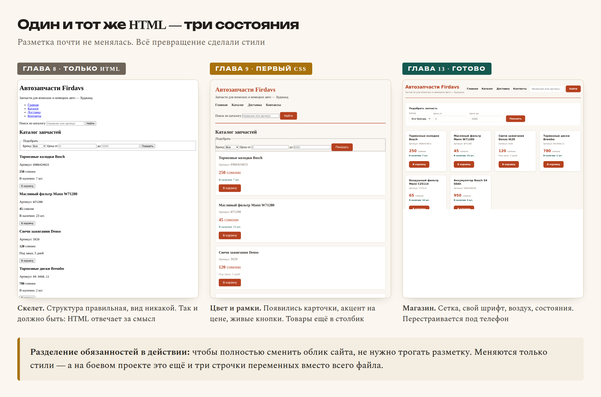

# Глава 13. Практика: каталог становится красивым

> **Часть III. CSS — внешность** · Глава 13 из 60
> [← Глава 12](12-adaptivnost.md) · [Глава 14 →](14-js-peremennye.md)

## 🎯 Зачем эта глава

Каталог у вас уже работает и перестраивается под телефон. Но между «работает»
и «выглядит хорошо» есть расстояние, и сегодня мы его пройдём.

Разберём то, о чём обычно не говорят в учебниках по CSS, а зря — потому что именно
это отличает сайт, сделанный дизайнером, от сайта, сделанного программистом:

- **переменные** — как перекрасить весь сайт, поменяв три строчки;
- **шрифты** — как подключить нормальный шрифт вместо системного;
- **шесть правил вёрстки**, которые сразу видно;
- **состояния** — что показывать, когда товаров нет.

К концу главы у вас будет магазин, который не стыдно показать.

## 📖 Переменные CSS

### **Проблема**

Откройте свой `style.css` и посчитайте, сколько раз там встречается `#b5411f`.
Наверняка раз восемь: заголовок, цена, кнопка, наведение на кнопку, рамка, линия
в шапке.

Теперь представьте, что заказчик просит сменить фирменный цвет. Восемь замен,
и одну вы точно пропустите.

### **Решение**

```css
:root {
    --cvet-osnovnoy:  #b5411f;
    --cvet-temnyi:    #8f3418;
    --cvet-text:      #2b2622;
    --cvet-tihii:     #7c7166;
    --cvet-fon:       #faf7f2;
    --cvet-karta:     #ffffff;
    --cvet-ramka:     #e3d8c6;
    --cvet-uspeh:     #14584f;

    --radius:  8px;
    --otstup:  16px;
    --ten:     0 2px 8px rgba(34, 30, 26, 0.06);
}
```

Теперь используем:

```css
h1     { color: var(--cvet-osnovnoy); }
button { background: var(--cvet-osnovnoy); border-radius: var(--radius); }
.tovar { border: 1px solid var(--cvet-ramka); box-shadow: var(--ten); }
```

| Часть | Что значит |
|---|---|
| `:root` | «Корень документа» — переменные видны везде |
| `--cvet-osnovnoy` | Имя переменной. **Обязательно два дефиса** в начале |
| `var(--cvet-osnovnoy)` | Подставить значение |

**Что вы получаете.** Меняете одну строчку — перекрашивается весь сайт.
Можно за минуту показать заказчику три варианта цветовой схемы.

**Как называть переменные.** По смыслу, а не по цвету:

```css
--cvet-osnovnoy: #b5411f;   ✅ понятно, зачем
--ryzhiy: #b5411f;          ❌ а если станет синим?
```

Это общее правило для программирования: имена дают **по роли**, а не по текущему
значению.

## 📖 Нормальный шрифт

Системные шрифты (Georgia, Arial) есть у всех, но выглядят обыденно.
Свой шрифт сразу поднимает уровень.

### **Как подключить**

```html
<head>
    <link rel="preconnect" href="https://fonts.googleapis.com">
    <link rel="preconnect" href="https://fonts.gstatic.com" crossorigin>
    <link href="https://fonts.googleapis.com/css2?family=Manrope:wght@400;600;800&display=swap"
          rel="stylesheet">
</head>
```

```css
body {
    font-family: 'Manrope', system-ui, sans-serif;
}
```

Шрифты берутся с `fonts.google.com` — бесплатно, в том числе для коммерческих сайтов.

⚠️ **Проверяйте кириллицу.** Далеко не все шрифты её поддерживают. На Google Fonts
есть фильтр по языкам — выберите Cyrillic, иначе русский текст подставится другим
шрифтом и будет выглядеть чужеродно.

### **Хорошие пары для магазина**

| Заголовки | Текст | Настроение |
|---|---|---|
| Manrope | Manrope | Современно, чисто |
| Unbounded | Golos Text | Ярко, характерно |
| Playfair Display | Source Sans 3 | Дорого, солидно |
| Oswald | PT Sans | Плотно, по-деловому |

**Правило: два шрифта максимум.** Три — уже разнобой. Многие хорошие сайты
обходятся одним, играя насыщенностью и размером.

### **Сколько начертаний брать**

```
family=Manrope:wght@400;600;800
```

Каждое начертание — отдельный файл, который скачает браузер. Три штуки достаточно:
обычное (400), полужирное (600), очень жирное (800). Не подключайте все девять —
сайт будет открываться дольше.

## 📖 Шесть правил, которые сразу видно

Не дизайнерская теория, а конкретные приёмы. Примените — и разница будет заметна.

### **1. Отступы кратны одному числу**

Возьмите базу — обычно 8 пикселей — и используйте только кратные:
`8, 16, 24, 32, 40, 48`.

```css
:root {
    --s1: 8px;
    --s2: 16px;
    --s3: 24px;
    --s4: 32px;
}
```

Почему работает: случайные `13px`, `17px`, `22px` создают ощущение неаккуратности,
даже если человек не может объяснить, что его смущает. Кратная сетка выглядит
собранно.

### **2. Меньше цветов**

Три-четыре цвета, не больше:

- основной (акцент, кнопки, цены);
- тёмный (текст);
- светлый (фон);
- один служебный (успех/ошибка).

Радуга из десяти цветов — верный признак любительской работы.

### **3. Меньше размеров шрифта**

Четыре-пять размеров на весь сайт:

```css
--text-mal:   14px;   /* мелочи: артикул, примечания */
--text-osn:   16px;   /* основной текст */
--text-bol:   20px;   /* цена, подзаголовки */
--text-zag:   28px;   /* заголовки разделов */
--text-glav:  36px;   /* заголовок страницы */
```

### **4. Воздух важнее украшений**

Самая частая ошибка новичка — всё лепится друг к другу.

Увеличьте отступы вдвое от того, что кажется достаточным. Почти всегда станет лучше.
Пустое место — не потерянное место, а инструмент: оно показывает, что с чем связано.

### **5. Выравнивание по одной линии**

Всё, что можно выровнять, должно быть выровнено. Заголовки, текст, кнопки
в карточках — по одной вертикали.

Помните приём `margin-top: auto` из главы 11? Он ровно для этого: кнопки во всех
карточках оказываются на одной линии.

### **6. Контраст текста**

Светло-серый текст на белом фоне выглядит «дизайнерски», но читается плохо,
особенно на телефоне при солнце.

Минимум — `#666` на белом. Лучше темнее. Проверить можно на `webaim.org/resources/contrastchecker`.

## 📖 Состояния, о которых забывают

Ваш каталог показывает шесть товаров. А что будет, если товаров **ноль**?

Три состояния, которые новички не делают, а потом получают «сайт сломался»:

### **Пусто**

```html
<div class="pusto">
    <p class="pusto-znak">🔍</p>
    <h3>Ничего не нашлось</h3>
    <p>Попробуйте изменить фильтры или поискать по артикулу.</p>
    <a href="/catalog" class="knopka">Показать все товары</a>
</div>
```

```css
.pusto {
    text-align: center;
    padding: 48px 24px;
    color: var(--cvet-tihii);
}
.pusto-znak { font-size: 40px; margin-bottom: 8px; }
```

**Важно: пустой экран должен подсказывать, что делать дальше.** Не просто
«ничего не найдено», а кнопка выхода из тупика.

### **Загрузка**

Когда данные ещё едут, показывают заглушки-«скелеты» вместо пустоты:

```css
.skelet {
    background: linear-gradient(90deg, #eee 25%, #f5f5f5 50%, #eee 75%);
    background-size: 200% 100%;
    animation: perelив 1.4s infinite;
    border-radius: var(--radius);
    height: 180px;
}

@keyframes perelив {
    0%   { background-position: 200% 0; }
    100% { background-position: -200% 0; }
}
```

Это серый прямоугольник с бегущим бликом. Человек видит, что процесс идёт,
и не думает, что сайт завис.

### **Ошибка**

```html
<div class="oshibka">
    <p>Не удалось загрузить товары. Проверьте связь и попробуйте снова.</p>
    <button>Повторить</button>
</div>
```

Правило: **сообщение об ошибке должно говорить, что делать**, а не только
что случилось.

Плохо: «Ошибка 500». Хорошо: «Не удалось загрузить. Попробуйте обновить страницу».

## 💻 Итоговый файл стилей

```css
/* ===== Переменные ===== */
:root {
    --cvet-osnovnoy: #b5411f;
    --cvet-temnyi:   #8f3418;
    --cvet-text:     #2b2622;
    --cvet-tihii:    #7c7166;
    --cvet-fon:      #faf7f2;
    --cvet-karta:    #ffffff;
    --cvet-ramka:    #e8dfd0;
    --cvet-uspeh:    #14584f;

    --s1: 8px;  --s2: 16px;  --s3: 24px;  --s4: 32px;
    --radius: 10px;
    --ten:      0 2px 8px rgba(34, 30, 26, 0.05);
    --ten-navel: 0 8px 24px rgba(181, 65, 31, 0.14);
}

/* ===== Сброс ===== */
* { margin: 0; padding: 0; box-sizing: border-box; }

img { max-width: 100%; height: auto; display: block; }

body {
    font-family: 'Manrope', system-ui, -apple-system, sans-serif;
    font-size: 16px;
    line-height: 1.6;
    color: var(--cvet-text);
    background: var(--cvet-fon);
}

.container {
    max-width: 1200px;
    margin: 0 auto;
    padding: var(--s3) var(--s2);
}

/* ===== Шапка ===== */
header {
    display: flex;
    flex-direction: column;
    gap: var(--s2);
    padding-bottom: var(--s3);
    border-bottom: 2px solid var(--cvet-osnovnoy);
    margin-bottom: var(--s4);
}

.logo {
    font-size: 26px;
    font-weight: 800;
    color: var(--cvet-osnovnoy);
    letter-spacing: -0.02em;
}

.slogan { color: var(--cvet-tihii); font-size: 14px; }

nav ul { display: flex; flex-wrap: wrap; gap: var(--s3); list-style: none; }

nav a {
    color: var(--cvet-text);
    text-decoration: none;
    font-weight: 600;
    padding: var(--s1) 0;
    border-bottom: 2px solid transparent;
    transition: color .2s, border-color .2s;
}

nav a:hover {
    color: var(--cvet-osnovnoy);
    border-bottom-color: var(--cvet-osnovnoy);
}

/* ===== Поиск ===== */
.poisk { display: flex; gap: var(--s1); }

.poisk input {
    flex: 1;
    padding: 12px var(--s2);
    font-size: 16px;
    font-family: inherit;
    border: 1px solid var(--cvet-ramka);
    border-radius: var(--radius);
    background: var(--cvet-karta);
    transition: border-color .2s, box-shadow .2s;
}

.poisk input:focus {
    outline: none;
    border-color: var(--cvet-osnovnoy);
    box-shadow: 0 0 0 3px rgba(181, 65, 31, 0.12);
}

/* ===== Кнопки ===== */
button, .knopka {
    display: inline-flex;
    align-items: center;
    justify-content: center;
    min-height: 44px;
    padding: 12px var(--s3);
    font-size: 15px;
    font-family: inherit;
    font-weight: 600;
    color: #fff;
    background: var(--cvet-osnovnoy);
    border: none;
    border-radius: var(--radius);
    cursor: pointer;
    text-decoration: none;
    transition: background .2s, transform .1s;
}

button:hover, .knopka:hover { background: var(--cvet-temnyi); }
button:active { transform: translateY(1px); }

/* ===== Фильтры ===== */
.filtry {
    background: var(--cvet-karta);
    border: 1px solid var(--cvet-ramka);
    border-radius: var(--radius);
    padding: var(--s3);
    margin-bottom: var(--s4);
}

.filtry fieldset { border: none; display: flex; flex-direction: column; gap: var(--s2); }
.filtry legend { font-weight: 800; margin-bottom: var(--s1); }

.filtry label { font-size: 14px; color: var(--cvet-tihii); display: block; margin-bottom: 4px; }

.filtry input, .filtry select {
    width: 100%;
    padding: 10px 12px;
    font-size: 16px;
    font-family: inherit;
    border: 1px solid var(--cvet-ramka);
    border-radius: var(--radius);
    background: var(--cvet-karta);
}

/* ===== Каталог ===== */
.katalog {
    display: grid;
    grid-template-columns: 1fr;
    gap: var(--s3);
}

.tovar {
    display: flex;
    flex-direction: column;
    background: var(--cvet-karta);
    border: 1px solid var(--cvet-ramka);
    border-radius: var(--radius);
    padding: var(--s3);
    box-shadow: var(--ten);
    transition: transform .2s, box-shadow .2s, border-color .2s;
}

.tovar:hover {
    transform: translateY(-2px);
    border-color: var(--cvet-osnovnoy);
    box-shadow: var(--ten-navel);
}

.tovar h3 { font-size: 17px; line-height: 1.35; margin-bottom: var(--s1); }

.artikul { font-size: 13px; color: var(--cvet-tihii); }

.cena {
    font-size: 24px;
    font-weight: 800;
    color: var(--cvet-osnovnoy);
    margin: var(--s2) 0 4px;
}
.cena span { font-size: 14px; font-weight: 400; color: var(--cvet-tihii); }

.nalichie { font-size: 13px; color: var(--cvet-uspeh); font-weight: 600; }
.nalichie.nety { color: var(--cvet-tihii); font-weight: 400; }

.tovar form { margin-top: auto; padding-top: var(--s3); }
.tovar button { width: 100%; }

/* ===== Пусто ===== */
.pusto { text-align: center; padding: 48px var(--s3); color: var(--cvet-tihii); }
.pusto h3 { color: var(--cvet-text); margin-bottom: var(--s1); }
.pusto p { margin-bottom: var(--s3); }

/* ===== Подвал ===== */
footer {
    margin-top: 48px;
    padding-top: var(--s3);
    border-top: 1px solid var(--cvet-ramka);
    color: var(--cvet-tihii);
    font-size: 14px;
}
footer a { color: var(--cvet-osnovnoy); }

/* ===== Планшет ===== */
@media (min-width: 640px) {
    .katalog { grid-template-columns: repeat(2, 1fr); }
    .filtry fieldset { flex-direction: row; flex-wrap: wrap; align-items: flex-end; }
    .filtry input, .filtry select { width: auto; }
    .tovar button { width: auto; }
}

/* ===== Компьютер ===== */
@media (min-width: 960px) {
    header {
        flex-direction: row;
        justify-content: space-between;
        align-items: center;
        flex-wrap: wrap;
    }
    .logo { font-size: 30px; }
    .katalog { grid-template-columns: repeat(auto-fill, minmax(250px, 1fr)); }
}
```

## 🖥 На экране

Весь путь одной картинкой — от голого HTML до готового магазина:



Ещё раз, потому что это важно: **HTML почти не менялся.** Мы добавили пару классов
и обёрток. Всё превращение сделал CSS.

## ⚠️ Грабли

**Переменные не в `:root`.** Объявите их внутри какого-нибудь класса — и они будут
видны только там. Всегда `:root`.

**Забыть два дефиса.** `--cvet: red;` — правильно. `-cvet` или `cvet` — не сработает.

**Подключить десять начертаний шрифта.** Каждое — отдельный файл. Сайт станет
заметно медленнее. Хватит трёх.

**Шрифт без кириллицы.** Проверяйте на Google Fonts фильтром Cyrillic.

**Слишком много всего.** Пять цветов, четыре шрифта, тени на всём, градиенты,
анимации везде. Хороший интерфейс — сдержанный.

**Забыть про пустое состояние.** Первый же покупатель отфильтрует так, что ничего
не найдётся, и увидит белый экран.

## 🏋️ Задачи

**Задача 13.1.** Переведите свой `style.css` на переменные. Все цвета, отступы
и скругления — в `:root`.

**Задача 13.2.** Поменяйте фирменный цвет магазина на другой, изменив **одну**
строчку. Убедитесь, что перекрасилось всё.

**Задача 13.3.** Подключите шрифт с Google Fonts. Обязательно проверьте
поддержку кириллицы.

**Задача 13.4.** Сделайте состояние «ничего не найдено» с кнопкой возврата.
Чтобы увидеть, временно закомментируйте товары.

**Задача 13.5.** Проверьте свои отступы. Все ли кратны 8? Найдите и почините
случайные значения.

**Задача 13.6.** Проверьте контраст текста на `webaim.org/resources/contrastchecker`.
Основной текст должен набрать не меньше 4.5:1.

**Задача 13.7.** Сделайте три цветовые схемы своего магазина, меняя только
переменные. Сохраните как три варианта и выберите лучшую.

**Задача 13.8.** Покажите сайт трём людям, которые не программируют. Задайте
каждому три вопроса: что это за сайт? как найти товар? как купить? Записывайте,
где они запинаются.

Это называется **юзабилити-тест**, и он работает лучше любой теории. Три человека
находят большинство проблем.

*Ответы — в [Приложении Г](../prilozheniya/G-otvety.md).*

## 🔗 В бою

В `assets/css/custom.css` вы найдёте те же приёмы: переменные наверху файла,
кратные отступы, состояния для пустого каталога.

Обратите внимание на одну боевую деталь: у карточек товаров задана
**минимальная высота**. Причина простая — названия запчастей бывают очень разной
длины («Колодки Bosch» и «Комплект сцепления Sachs 3000 951 081 в сборе»),
и без минимальной высоты сетка выглядела рвано.

Такие вещи невозможно предусмотреть заранее. Они находятся, когда в каталог
заливают настоящие данные. **Верстайте на реальных, а не на придуманных данных** —
это сэкономит вам переделку.

## 📌 Итог

- **Переменные** в `:root` через `--imya` и `var(--imya)`. Меняете один раз —
  перекрашивается всё.
- Имена переменных — **по роли**, а не по цвету.
- Шрифт с Google Fonts, обязательно с кириллицей. **Максимум два** шрифта,
  три начертания.
- Отступы **кратны 8**. Цветов **3-4**. Размеров шрифта **4-5**.
- **Воздуха больше**, чем кажется нужным.
- Контраст текста не ниже 4.5:1.
- Обязательно сделайте состояния: **пусто**, **загрузка**, **ошибка**.
  Каждое должно подсказывать, что делать.
- Верстайте на настоящих данных, а не на «Товар 1, Товар 2».

**Часть III закончена.** У вас есть красивый адаптивный магазин. Но он
неподвижен: кнопки ничего не делают, поиск не ищет.

Со следующей главы начинается JavaScript — и страница оживёт.

[← Глава 12](12-adaptivnost.md) · [Глава 14. JavaScript: переменные и условия →](14-js-peremennye.md)
