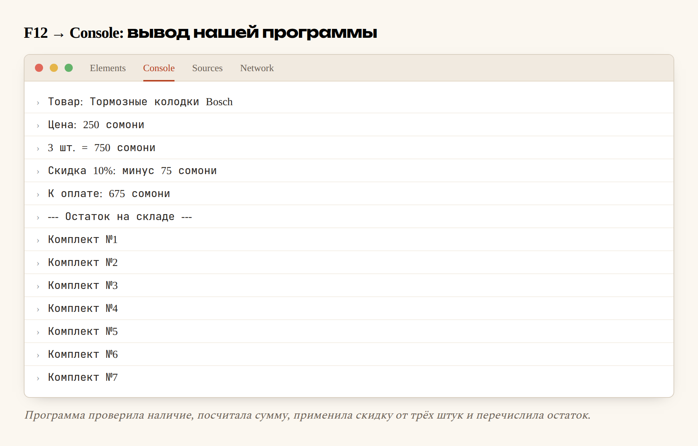

# Глава 14. JavaScript: переменные, условия, циклы

> **Часть IV. JavaScript — оживляем страницу** · Глава 14 из 60
> [← Глава 13](13-praktika-krasivyi-katalog.md) · [Глава 15 →](15-js-funkcii-massivy.md)

## 🎯 Зачем эта глава

Ваш магазин красивый, но мёртвый. Кнопка «В корзину» ничего не делает. Поиск
не ищет. Фильтры не фильтруют.

Начинаем это исправлять. И заодно — вот важное — **вы впервые встретитесь
с настоящим программированием**.

HTML и CSS программированием не являются. Это языки описания: «здесь заголовок»,
«сделай красным». В них нет решений, нет повторений, нет вычислений.

JavaScript — другое дело. Здесь появляются **переменные**, **условия**, **циклы**.
И вот эта тройка есть в **каждом** языке программирования на свете. Выучив её один
раз на JavaScript, вы узнаете её же в PHP (глава 20), а потом в Python, Java —
где угодно.

Так что эта глава важнее, чем кажется. Мы учим не JavaScript. Мы учим
программирование, а JavaScript просто оказался первым.

## 📖 Куда писать код

Три способа, как и с CSS.

### **Отдельный файл — правильный**

```html
<body>
    ...всё содержимое страницы...

    <script src="script.js"></script>
</body>
```

⚠️ Обратите внимание: `<script>` ставят **в самом конце `<body>`**, перед `</body>`,
а не в `<head>`.

Причина простая: браузер читает страницу сверху вниз. Если скрипт стоит в начале,
он выполнится, когда элементов на странице ещё нет — и не найдёт того, с чем должен
работать. Классическая ошибка новичка, которую мы обойдём заранее.

### **Прямо в странице — для проб**

```html
<script>
    console.log('Привет');
</script>
```

### **В консоли браузера — для опытов**

Нажмите **F12 → Console**, напишите что угодно и нажмите Enter. Код выполнится сразу.

**Пользуйтесь этим постоянно, пока учитесь.** Не нужно создавать файл, чтобы
проверить одну строчку. Консоль — ваш черновик.

## 📖 `console.log` — окно в программу

Первая команда, которую нужно выучить:

```javascript
console.log('Привет!');
console.log(250);
console.log('Цена:', 250, 'сомони');
```

`console.log` выводит значение в консоль браузера (F12 → Console).

**Зачем это нужно.** Программа выполняется молча. Вы не видите, что происходит внутри:
какое значение получилось, зашло ли выполнение в условие, сколько раз повторился цикл.

`console.log` делает невидимое видимым. Это **основной инструмент отладки** —
не только новичка, но и профессионала. Не стесняйтесь ставить его везде.

Правило на будущее: **не понимаете, что делает программа — поставьте `console.log`
и посмотрите.**

## 📖 Переменные — коробочки с данными

### **Что это такое**

Переменная — **именованное место, где лежит значение**.

```javascript
let cena = 250;
```

Читается: «создай коробочку с именем `cena` и положи в неё 250».

Дальше можно пользоваться именем вместо значения:

```javascript
console.log(cena);        // 250
console.log(cena * 2);    // 500
```

**Зачем это нужно.** Три причины:

1. **Значение можно посчитать один раз и использовать много.**
2. **Код становится понятным.** `itogo = cena * kolichestvo` читается,
   а `250 * 3` — нет.
3. **Менять легко.** Цена в одном месте, а не в двадцати.

### **`let` и `const`**

```javascript
let kolichestvo = 3;      // значение будет меняться
const NDS = 0.18;         // значение постоянное
```

| Слово | Что означает | Когда |
|---|---|---|
| `const` | **Постоянная.** Изменить нельзя | По умолчанию — берите её |
| `let` | **Переменная.** Значение будет меняться | Когда действительно нужно менять |
| `var` | Устаревший способ | **Не используйте.** Встретите в старом коде |

**Правило, которое экономит нервы: всегда начинайте с `const`.** Если попробуете
изменить — программа честно сообщит об ошибке, и вы задумаетесь, точно ли надо.
Меняйте на `let` только тогда, когда действительно нужно.

Почему это важно: чем меньше в программе меняющихся вещей, тем легче понять,
что происходит. Это не педантизм, а способ уменьшить количество ошибок.

### **Как называть переменные**

```javascript
let cenaTovara = 250;        ✅ понятно
let c = 250;                 ❌ что за c?
let x1 = 250;                ❌ и это тоже
let цена = 250;              ❌ кириллица — технически можно, практически нельзя
```

Правила:

- **Только латиница**, цифры, `_` и `$`. Начинать с цифры нельзя.
- **Регистр важен**: `cena` и `Cena` — разные переменные.
- Принято писать **camelCase**: слова слитно, каждое следующее с большой буквы:
  `cenaTovara`, `kolichestvoNaSklade`.
- Имя должно объяснять, **что внутри**.

Хорошее имя переменной — половина понятного кода. Программист читает код
в десять раз чаще, чем пишет, и пишет он его в первую очередь для людей.

## 📖 Типы данных

В коробочку можно положить разное. От того, что внутри, зависит, что можно делать.

```javascript
const nazvanie = 'Тормозные колодки';     // строка
const cena = 250;                          // число
const estVNalichii = true;                 // да/нет
const skidka = null;                       // «ничего», осознанно
let brend;                                 // «не задано»
```

| Тип | Как называется | Примеры |
|---|---|---|
| Строка | `string` | `'текст'`, `"текст"`, `` `текст` `` |
| Число | `number` | `250`, `-5`, `3.14` |
| Логический | `boolean` | `true`, `false` |
| Пусто (осознанно) | `null` | `null` |
| Не задано | `undefined` | переменная без значения |

Проверить тип можно так:

```javascript
console.log(typeof cena);       // "number"
console.log(typeof nazvanie);   // "string"
```

### **Строки: кавычки и склейка**

```javascript
const a = 'Bosch';
const b = "Bosch";
const c = `Bosch`;
```

Все три работают. Одинарные и двойные равноправны — главное, быть последовательным.

А вот **обратные кавычки** (`` ` ``, клавиша слева от единицы) умеют кое-что особенное:

```javascript
const nazvanie = 'Колодки Bosch';
const cena = 250;

// Старый способ — склейка через плюс
const text1 = 'Товар: ' + nazvanie + ', цена ' + cena + ' сомони';

// Современный способ — шаблонная строка
const text2 = `Товар: ${nazvanie}, цена ${cena} сомони`;
```

Обе строки дадут одно и то же. Но вторая читается в разы лучше — видно готовую фразу,
а не мешанину из плюсов и кавычек.

**Синтаксис:** обратные кавычки вокруг всей строки, `${...}` вокруг подставляемого
значения.

Пользуйтесь шаблонными строками всегда. Это одна из тех вещей, которые сразу отличают
современный код от кода десятилетней давности.

### **Числа: осторожно с дробями**

```javascript
console.log(0.1 + 0.2);      // 0.30000000000000004
```

Нет, это не ошибка в браузере. Так работают дробные числа **во всех языках
программирования** — они хранятся в двоичном виде, и некоторые десятичные дроби
в него точно не переводятся.

**Практический вывод для магазина: не храните деньги в дробях.** Храните в самых
мелких единицах — в дирамах (1 сомони = 100 дирамов), — то есть целыми числами.
250 сомони = 25000. Делите на 100 только при показе.

Это правило работает во всех финансовых системах мира. Запомните сейчас, чтобы
не переписывать потом.

## 📖 Условия: `if`, `else`

Вы уже видели `if` в первой главе. Теперь по-настоящему.

```javascript
const ostatok = 7;

if (ostatok > 0) {
    console.log('В наличии');
} else {
    console.log('Нет в наличии');
}
```

Дословно: **если** остаток больше нуля — напиши «в наличии», **иначе** — «нет».

### **Операторы сравнения**

```javascript
a === b     // строго равно
a !== b     // строго не равно
a > b       // больше
a < b       // меньше
a >= b      // больше или равно
a <= b      // меньше или равно
```

⚠️ **Три знака, не два.** В JavaScript есть и `==` (два знака), но он ведёт себя
странно:

```javascript
console.log(5 == '5');    // true  — сравнил, приведя типы
console.log(5 === '5');   // false — число и строка, разные вещи
```

`==` пытается «догадаться» и приводит типы друг к другу. Это источник загадочных
ошибок.

**Правило без исключений: всегда `===` и `!==`.** Забудьте про `==`.

### **Несколько условий**

```javascript
const cena = 250;
const ostatok = 7;

if (ostatok > 0 && cena < 300) {
    console.log('Есть и недорого');
}

if (ostatok === 0 || cena > 1000) {
    console.log('Или нет, или дорого');
}

if (!estSkidka) {
    console.log('Скидки нет');
}
```

| Знак | Название | Смысл |
|---|---|---|
| `&&` | И | **Оба** условия верны |
| `\|\|` | ИЛИ | **Хотя бы одно** верно |
| `!` | НЕ | Переворачивает: было `true` — стало `false` |

Читается вслух почти по-русски: «если остаток больше нуля **и** цена меньше 300».

### **Несколько веток**

```javascript
if (ostatok === 0) {
    console.log('Нет в наличии');
} else if (ostatok < 3) {
    console.log('Осталось мало');
} else {
    console.log('В наличии');
}
```

Проверяется **сверху вниз**, выполняется **первое подошедшее** — остальные пропускаются.

Порядок важен! Если поставить `ostatok < 3` перед `ostatok === 0`, то ноль
попадёт в «осталось мало», потому что ноль тоже меньше трёх.

### **Короткая запись**

```javascript
const status = ostatok > 0 ? 'В наличии' : 'Под заказ';
```

Называется **тернарный оператор**. Читается: «условие **?** если да **:** если нет».

Удобно для коротких случаев. Для сложной логики берите обычный `if` — вложенные
тернарники нечитаемы.

## 📖 Циклы: делать много раз

### **Зачем**

У вас 6 товаров. Или 600. Писать 600 раз «покажи товар» — нереально.
Цикл делает это за вас.

### **`for` — когда знаете, сколько раз**

```javascript
for (let i = 1; i <= 5; i++) {
    console.log(`Товар номер ${i}`);
}
```

Напечатает пять строк. Разберём заголовок цикла — там три части через `;`:

| Часть | Что делает | Когда выполняется |
|---|---|---|
| `let i = 1` | Создать счётчик и задать начало | Один раз, в начале |
| `i <= 5` | **Условие продолжения** | Перед каждым повтором |
| `i++` | Увеличить счётчик на 1 | После каждого повтора |

`i++` — сокращение для `i = i + 1`. Есть и `i--` (уменьшить), и `i += 5`
(увеличить на 5).

**Имя `i`** — от слова *index*. Это одно из немногих коротких имён, которое
считается нормальным: все программисты мира понимают, что `i` — счётчик цикла.

### **`while` — пока условие верно**

```javascript
let ostatok = 5;

while (ostatok > 0) {
    console.log(`Продали, осталось ${ostatok - 1}`);
    ostatok = ostatok - 1;
}
```

Повторяется, **пока** условие истинно.

⚠️ **Главная опасность `while`** — забыть менять условие внутри:

```javascript
let i = 0;
while (i < 5) {
    console.log('Бесконечно!');
    // забыли i++
}
```

Это **бесконечный цикл**. Браузер зависнет намертво. Спасение — закрыть вкладку.

Совершали такую ошибку все. Просто знайте, где искать.

### **Прервать и пропустить**

```javascript
for (let i = 1; i <= 10; i++) {
    if (i === 5) break;      // выйти из цикла совсем
    if (i % 2 === 0) continue;  // пропустить этот повтор
    console.log(i);
}
```

`break` — «хватит, выходим». `continue` — «этот пропускаем, идём к следующему».

`%` — остаток от деления. `i % 2 === 0` означает «i делится на 2 без остатка»,
то есть чётное. Приём, которым проверяют чётность во всех языках.

## 💻 Соберём вместе

```javascript
// Данные о товаре
const nazvanie = 'Тормозные колодки Bosch';
const cenaZaShtuku = 250;
const ostatokNaSklade = 7;
const skidkaProcent = 10;

// Сколько хочет покупатель
const hochetKupit = 3;

console.log(`Товар: ${nazvanie}`);
console.log(`Цена: ${cenaZaShtuku} сомони`);

// Проверяем наличие
if (ostatokNaSklade === 0) {
    console.log('Нет в наличии, можно заказать');
} else if (hochetKupit > ostatokNaSklade) {
    console.log(`Столько нет. Доступно только ${ostatokNaSklade} шт.`);
} else {
    // Считаем стоимость
    let itogo = cenaZaShtuku * hochetKupit;
    console.log(`${hochetKupit} шт. = ${itogo} сомони`);

    // Скидка от трёх штук
    if (hochetKupit >= 3) {
        const skidka = itogo * skidkaProcent / 100;
        itogo = itogo - skidka;
        console.log(`Скидка ${skidkaProcent}%: минус ${skidka} сомони`);
    }

    console.log(`К оплате: ${itogo} сомони`);
}

// Покажем весь остаток по одной штуке
console.log('--- Остаток на складе ---');
for (let i = 1; i <= ostatokNaSklade; i++) {
    console.log(`Комплект №${i}`);
}
```

## 🖥 На экране

Откройте F12 → Console, вставьте код и нажмите Enter:



Программа посчитала стоимость, применила скидку и перечислила остаток.
Это первая настоящая программа в книге: она **принимает решения** и **повторяет
действия**.

## 🔤 Разбор по словам

| Запись | Как читается | Что делает |
|---|---|---|
| `const` | «конст» | Постоянная, менять нельзя |
| `let` | «лет» | Переменная, можно менять |
| `=` | присвоить | **Положить** справа в левое |
| `===` | строго равно | **Спросить**, одинаковы ли |
| `!==` | не равно | Спросить, различны ли |
| `&&` | и | Оба условия |
| `\|\|` | или | Хотя бы одно |
| `!` | не | Перевернуть |
| `${...}` | подстановка | Вставить значение в шаблонную строку |
| `` ` `` | обратная кавычка | Границы шаблонной строки |
| `i++` | инкремент | Увеличить на 1 |
| `%` | остаток | Остаток от деления |
| `console.log()` | | Показать значение в консоли |
| `typeof` | | Узнать тип значения |
| `break` | | Выйти из цикла |
| `continue` | | Пропустить один повтор |
| `//` | комментарий | Заметка для человека |

## ⚠️ Грабли

**Путать `=` и `===`.** `=` кладёт, `===` спрашивает. Самая частая ошибка
на свете. Если условие ведёт себя странно — проверьте это первым делом.

**Использовать `==`.** Всегда `===`.

**Бесконечный `while`.** Забыли менять условие — браузер завис.

**`<script>` в `<head>`.** Код выполнится раньше, чем появятся элементы,
и ничего не найдёт. Ставьте перед `</body>`.

**Деньги в дробях.** `0.1 + 0.2 !== 0.3`. Считайте в дирамах, целыми числами.

**Кириллица в именах переменных.** Формально разрешена, практически — источник
проблем.

**Забыть, что регистр важен.** `cena` и `Cena` — две разные переменные,
и браузер не подскажет.

## 🏋️ Задачи

Все задачи решаются прямо в консоли F12. Не переписывайте — **набирайте**.

**Задача 14.1.** Создайте переменные для своего товара: название, цена, остаток,
бренд. Выведите их одной шаблонной строкой.

**Задача 14.2.** Что выведет каждая строка? Ответьте, **не запуская**, потом
проверьте:

```javascript
console.log(5 + 3);
console.log('5' + 3);
console.log(5 === '5');
console.log(5 == '5');
console.log(10 % 3);
console.log(typeof '250');
console.log(!true);
```

Вторая строка — важный сюрприз. Разберитесь, почему так.

**Задача 14.3.** Напишите проверку: если товаров на складе больше 10 — «много»,
от 1 до 10 — «есть», ноль — «нет». Проверьте на трёх значениях.

**Задача 14.4.** Посчитайте стоимость заказа со скидкой: от 3 штук — 5%,
от 10 штук — 10%, от 50 — 15%. Внимание к порядку условий!

**Задача 14.5.** Циклом выведите числа от 1 до 20, но только чётные.
Двумя способами: через `%` и через `i += 2`.

**Задача 14.6.** Циклом посчитайте сумму чисел от 1 до 100. Проверка: должно
получиться 5050.

**Задача 14.7.** Напишите «таблицу умножения» для числа 7, от 1 до 10,
в виде `7 × 3 = 21`.

**Задача 14.8.** Найдите ошибку и объясните, в чём она:

```javascript
let cena = 250;
if (cena = 300) {
    console.log('Цена 300');
}
```

**Задача 14.9.** Переведите на JavaScript условие: «если товар в наличии
и цена меньше 500, или если у покупателя есть промокод — показать кнопку купить».

**Задача 14.10.** Что произойдёт? Не запускайте, просто подумайте:

```javascript
let i = 10;
while (i > 0) {
    console.log(i);
}
```

*Ответы — в [Приложении Г](../prilozheniya/G-otvety.md).*

## 🔗 В бою

Загляните в `assets/js/` этого репозитория. Найдёте те же самые вещи: `const`,
`if`, циклы, шаблонные строки.

Особенно посмотрите на код счётчика корзины — там ровно та логика, которую вы
только что изучили: проверить остаток, посчитать сумму, показать результат.

И одна деталь из жизни: в боевом коде вы **не найдёте** `console.log` —
их убирают перед выкладкой на сайт. Пока учитесь, ставьте сколько угодно.
Просто помните, что в готовом сайте их быть не должно: они замедляют работу
и показывают посторонним внутреннюю кухню.

## 📌 Итог

- Переменные, условия и циклы есть **в каждом языке**. Учим не JavaScript —
  учим программирование.
- `<script>` ставится **перед `</body>`**.
- `console.log()` — главный инструмент отладки. Не понимаете — выведите.
- **`const` по умолчанию**, `let` — только когда нужно менять. `var` не используйте.
- Имена — латиницей, camelCase, по смыслу.
- Шаблонные строки: `` `Цена ${cena} сомони` ``. Пользуйтесь всегда.
- **Деньги — целыми числами** в мелких единицах. Дроби врут.
- `=` кладёт, `===` спрашивает. **Только `===`**, никогда `==`.
- `&&` — и, `||` — или, `!` — не.
- `for` — когда знаете количество, `while` — пока условие верно.
- Забыть менять условие в `while` = зависший браузер.

Дальше — функции и массивы: научимся хранить список товаров и не повторять код.

[← Глава 13](13-praktika-krasivyi-katalog.md) · [Глава 15. Функции, массивы, объекты →](15-js-funkcii-massivy.md)
