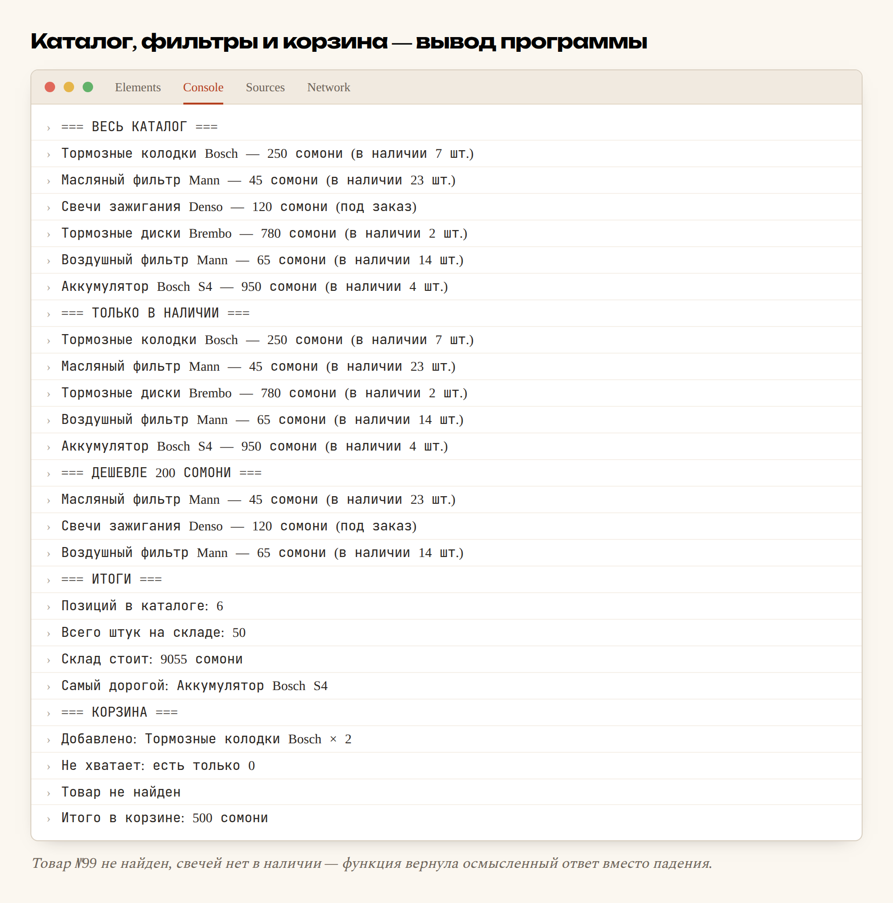

# Глава 15. Функции, массивы, объекты

> **Часть IV. JavaScript — оживляем страницу** · Глава 15 из 60
> [← Глава 14](14-js-peremennye.md) · [Глава 16 →](16-dom.md)

## 🎯 Зачем эта глава

В прошлой главе у нас был **один** товар, разложенный по четырём переменным.
А в магазине их шестьсот.

Заводить `nazvanie1`, `cena1`, `nazvanie2`, `cena2`… — очевидная нелепость.
Нужен способ хранить **список** и способ описывать **один товар целиком**.

Плюс третья вещь: мы уже дважды писали похожий код для расчёта скидки.
Нужен способ **написать один раз и вызывать по имени**.

Три инструмента этой главы:

- **функции** — свой код по имени;
- **массивы** — списки;
- **объекты** — сложные данные одной штукой.

Это последняя «теоретическая» глава JavaScript. Со следующей начнём менять
настоящую страницу.

## 📖 Функции

### **Что это и зачем**

**Функция — это кусок кода с именем.** Написали один раз — вызываете сколько угодно.

```javascript
function pozdorovatsya() {
    console.log('Добро пожаловать в наш магазин!');
}

pozdorovatsya();
pozdorovatsya();
```

| Часть | Что означает |
|---|---|
| `function` | «Дальше идёт функция» |
| `pozdorovatsya` | Имя, по которому будем звать |
| `()` | Место для входных данных |
| `{ }` | Тело: что делать |
| `pozdorovatsya();` | **Вызов** — вот сейчас выполни |

⚠️ Важно: объявление функции её **не выполняет**. Функция ждёт, пока её позовут.
Забыть скобки при вызове — частая ошибка: `pozdorovatsya` без `()` не запускает
её, а лишь упоминает.

### **Параметры — данные на вход**

```javascript
function pokazatTovar(nazvanie, cena) {
    console.log(`${nazvanie} — ${cena} сомони`);
}

pokazatTovar('Колодки Bosch', 250);
pokazatTovar('Фильтр Mann', 45);
```

Одна функция, разные данные, разный результат.

- **Параметры** — имена в объявлении (`nazvanie`, `cena`);
- **Аргументы** — реальные значения при вызове (`'Колодки Bosch'`, `250`).

Названия разные, но путать их не страшно — многие используют вперемешку.

### **`return` — результат наружу**

Функция может не только печатать, но и **возвращать значение**:

```javascript
function schitatItogo(cena, kolichestvo) {
    return cena * kolichestvo;
}

const itogo = schitatItogo(250, 3);
console.log(itogo);              // 750
console.log(schitatItogo(45, 2)); // 90
```

`return` делает две вещи сразу:

1. **отдаёт значение** тому, кто вызвал;
2. **немедленно завершает** функцию — код после него не выполнится.

Второе свойство удобно для проверок:

```javascript
function schitatSoSkidkoy(cena, kolichestvo) {
    if (kolichestvo <= 0) {
        return 0;                 // дальше не идём
    }

    let itogo = cena * kolichestvo;

    if (kolichestvo >= 3) {
        itogo = itogo * 0.9;      // скидка 10%
    }

    return itogo;
}

console.log(schitatSoSkidkoy(250, 3));   // 675
console.log(schitatSoSkidkoy(250, 0));   // 0
```

Такой приём называется **ранний выход**: сначала отсекаем плохие случаи, потом
спокойно пишем основную логику. Код получается плоским, без глубоко вложенных `if`.

### **Значения по умолчанию**

```javascript
function schitatDostavku(summa, gorod = 'Худжанд') {
    if (gorod === 'Худжанд') return 0;
    return 50;
}

console.log(schitatDostavku(500));             // 0 — город не указали
console.log(schitatDostavku(500, 'Душанбе'));  // 50
```

Если аргумент не передали, возьмётся значение по умолчанию.

### **Стрелочные функции**

Современная короткая запись — та самая, что мелькала в первой главе:

```javascript
// Обычная
function udvoit(x) {
    return x * 2;
}

// Стрелочная
const udvoit = (x) => {
    return x * 2;
};

// Совсем короткая: одно выражение — return не нужен
const udvoit = x => x * 2;
```

Все три делают одно и то же.

Стрелочные функции особенно удобны, когда функцию передают внутрь другой функции —
а это в JavaScript происходит постоянно (увидим ниже и в главе 17).

### **Зачем вообще функции: три причины**

**1. Не повторяться.** Логика скидки написана один раз. Меняются правила —
правите в одном месте.

**2. Имя объясняет смысл.** `schitatSoSkidkoy(250, 3)` понятно без комментариев,
а `250 * 3 * 0.9` — нет.

**3. Можно проверять по отдельности.** Функцию легко вызвать с разными данными
и убедиться, что она считает верно.

**Правило хорошего тона:** одна функция — одно дело. Если в названии просится «и»
(`proveritIsohranit`), это две функции.

## 📖 Массивы — списки

### **Что это**

**Массив — упорядоченный список значений.**

```javascript
const brendy = ['Bosch', 'Mann', 'Denso', 'Brembo'];
const ceny = [250, 45, 120, 780];
```

Квадратные скобки, значения через запятую.

### **Обращение по номеру**

```javascript
console.log(brendy[0]);   // 'Bosch'
console.log(brendy[1]);   // 'Mann'
console.log(brendy[3]);   // 'Brembo'
console.log(brendy[9]);   // undefined — такого нет
```

⚠️ **Нумерация с нуля.** Первый элемент — `[0]`, не `[1]`.

Это сбивает с толку всех новичков. Так устроено почти во всех языках
программирования, и придётся привыкнуть. Полезный образ: номер — это не «который
по счёту», а «на сколько шагов отступить от начала». От начала до первого элемента
шагов ноль.

### **Длина и последний элемент**

```javascript
console.log(brendy.length);              // 4
console.log(brendy[brendy.length - 1]);  // 'Brembo' — последний
```

Раз нумерация с нуля, последний элемент всегда `length - 1`. Запомните эту формулу,
она понадобится много раз.

### **Изменение массива**

```javascript
const korzina = [];

korzina.push('Колодки');       // добавить в конец
korzina.push('Фильтр');
console.log(korzina);          // ['Колодки', 'Фильтр']

korzina.pop();                 // убрать последний
console.log(korzina);          // ['Колодки']

korzina.unshift('Свечи');      // добавить в начало
korzina.shift();               // убрать первый

console.log(korzina.includes('Колодки'));  // true — есть ли такой
console.log(korzina.indexOf('Колодки'));   // 0 — на каком месте
```

⚠️ Заметьте: массив объявлен через `const`, но мы его меняем — и это работает.

`const` запрещает **заменить саму коробку**, но не запрещает менять её содержимое.
Нельзя `korzina = ['другое']`, можно `korzina.push('другое')`.

Тонкость, которая поначалу удивляет, но логика в ней есть: `const` про переменную,
а не про данные.

### **Перебор массива**

Способ первый — обычный цикл `for`:

```javascript
for (let i = 0; i < brendy.length; i++) {
    console.log(brendy[i]);
}
```

Способ второй, удобнее — `for...of`:

```javascript
for (const brend of brendy) {
    console.log(brend);
}
```

Читается почти по-английски: «для каждого бренда **из** списка брендов».
Не нужно возиться со счётчиком и не ошибёшься с границами.

**Берите `for...of`, когда номер элемента не нужен.**

## 📖 Объекты — один товар целиком

### **Проблема**

Хранить товар в отдельных переменных неудобно:

```javascript
const nazvanie = 'Колодки Bosch';
const cena = 250;
const ostatok = 7;
```

А если товаров шесть? Восемнадцать переменных, и никак не видно, что связано с чем.

### **Решение**

```javascript
const tovar = {
    nazvanie: 'Тормозные колодки Bosch',
    artikul: '0986424815',
    cena: 250,
    ostatok: 7,
    brend: 'Bosch',
    vNalichii: true
};
```

**Объект — набор пар «имя: значение»**, собранных в фигурные скобки.

| Часть | Название |
|---|---|
| `nazvanie` | **Ключ** (или свойство) |
| `'Тормозные колодки Bosch'` | **Значение** |
| `:` | Разделитель |
| `,` | Между парами |

### **Чтение и запись**

```javascript
console.log(tovar.nazvanie);      // через точку — основной способ
console.log(tovar['cena']);       // через скобки — когда имя в переменной

tovar.cena = 230;                 // изменить
tovar.foto = 'kolodki.jpg';       // добавить новое свойство

console.log(tovar.vesa);          // undefined — такого свойства нет
```

Обращение к несуществующему свойству — не ошибка, а `undefined`. Это спасает
от падений, но иногда прячет опечатки: `tovar.cenа` (с русской «а») молча вернёт
`undefined`.

### **Массив объектов — вот оно, главное**

Соединяем два инструмента и получаем каталог:

```javascript
const tovary = [
    {
        id: 1,
        nazvanie: 'Тормозные колодки Bosch',
        cena: 250,
        ostatok: 7,
        brend: 'Bosch'
    },
    {
        id: 2,
        nazvanie: 'Масляный фильтр Mann',
        cena: 45,
        ostatok: 23,
        brend: 'Mann'
    },
    {
        id: 3,
        nazvanie: 'Свечи зажигания Denso',
        cena: 120,
        ostatok: 0,
        brend: 'Denso'
    },
    {
        id: 4,
        nazvanie: 'Тормозные диски Brembo',
        cena: 780,
        ostatok: 2,
        brend: 'Brembo'
    },
    {
        id: 5,
        nazvanie: 'Воздушный фильтр Mann',
        cena: 65,
        ostatok: 14,
        brend: 'Mann'
    },
    {
        id: 6,
        nazvanie: 'Аккумулятор Bosch S4',
        cena: 950,
        ostatok: 4,
        brend: 'Bosch'
    },
];

for (const t of tovary) {
    console.log(`${t.nazvanie} — ${t.cena} сомони`);
}
```

**Вот в таком виде данные приходят из базы данных.** Ровно в таком. Когда в главе 34
мы начнём доставать товары из MySQL, PHP отдаст нам именно массив объектов.

Так что вы сейчас учите не «структуру данных JavaScript», а способ, которым
устроены данные почти во всех веб-приложениях.

## 📖 Три метода, которые заменяют циклы

Для массивов есть готовые методы. Они короче цикла и понятнее.

### **`filter` — отобрать подходящие**

```javascript
const vNalichii = tovary.filter(t => t.ostatok > 0);
const deshevye  = tovary.filter(t => t.cena < 200);
const boschi    = tovary.filter(t => t.brend === 'Bosch');
```

`filter` проходит по всем элементам и оставляет те, для которых условие истинно.
**Возвращает новый массив**, исходный не трогает.

Это **фильтры каталога**, ровно те, что вы сверстали в главе 8.

### **`map` — превратить каждый**

```javascript
const nazvaniya = tovary.map(t => t.nazvanie);
// ['Тормозные колодки Bosch', 'Масляный фильтр Mann', ...]

const soSkidkoy = tovary.map(t => ({
    ...t,
    cena: Math.round(t.cena * 0.9)
}));
```

`map` берёт каждый элемент и превращает во что-то другое. На выходе массив
той же длины.

`...t` — **spread**, «возьми всё из t». Здесь: скопируй товар целиком, но цену
замени. Пригодится часто.

`Math.round()` — округление. Есть ещё `Math.floor()` (вниз), `Math.ceil()` (вверх),
`Math.max()`, `Math.min()`.

### **`find` — найти один**

```javascript
const tovar = tovary.find(t => t.id === 3);
console.log(tovar.nazvanie);   // 'Свечи зажигания Denso'
```

`find` возвращает **первый подошедший элемент** (не массив!) или `undefined`.

Это поиск товара по номеру — то, что делает страница товара.

### **`reduce` — свести к одному значению**

```javascript
const summa = tovary.reduce((itog, t) => itog + t.cena, 0);
console.log(summa);   // 2210
```

Чуть сложнее остальных: `reduce` идёт по массиву и накапливает результат.
`itog` — накопленное, `t` — текущий элемент, `0` — с чего начать.

Это **сумма корзины**.

### **Цепочки**

Методы можно соединять — и вот тут становится красиво:

```javascript
const itogo = tovary
    .filter(t => t.ostatok > 0)        // только те, что есть
    .filter(t => t.cena < 500)         // и недорогие
    .map(t => t.cena)                  // взять цены
    .reduce((a, b) => a + b, 0);       // сложить

console.log(itogo);
```

Читается сверху вниз как список действий. Тот же результат циклом занял бы
строк десять и читался бы хуже.

## 💻 Каталог целиком

```javascript
const tovary = [
    {
        id: 1,
        nazvanie: 'Тормозные колодки Bosch',
        cena: 250,
        ostatok: 7,
        brend: 'Bosch'
    },
    {
        id: 2,
        nazvanie: 'Масляный фильтр Mann',
        cena: 45,
        ostatok: 23,
        brend: 'Mann'
    },
    {
        id: 3,
        nazvanie: 'Свечи зажигания Denso',
        cena: 120,
        ostatok: 0,
        brend: 'Denso'
    },
    {
        id: 4,
        nazvanie: 'Тормозные диски Brembo',
        cena: 780,
        ostatok: 2,
        brend: 'Brembo'
    },
    {
        id: 5,
        nazvanie: 'Воздушный фильтр Mann',
        cena: 65,
        ostatok: 14,
        brend: 'Mann'
    },
    {
        id: 6,
        nazvanie: 'Аккумулятор Bosch S4',
        cena: 950,
        ostatok: 4,
        brend: 'Bosch'
    },
];

// Показать товар одной строкой
function opisat(t) {
    const status = t.ostatok > 0 ? `в наличии ${t.ostatok} шт.` : 'под заказ';
    return `${t.nazvanie} — ${t.cena} сомони (${status})`;
}

console.log('=== ВЕСЬ КАТАЛОГ ===');
for (const t of tovary) {
    console.log(opisat(t));
}

console.log('=== ТОЛЬКО В НАЛИЧИИ ===');
tovary.filter(t => t.ostatok > 0).forEach(t => console.log(opisat(t)));

console.log('=== ДЕШЕВЛЕ 200 СОМОНИ ===');
tovary.filter(t => t.cena < 200).forEach(t => console.log(opisat(t)));

// Считаем итоги
const vsegoPozicii = tovary.length;
const naSklade = tovary.reduce((s, t) => s + t.ostatok, 0);
const stoimostSklada = tovary.reduce((s, t) => s + t.cena * t.ostatok, 0);
const samyiDorogoy = tovary.reduce((max, t) => t.cena > max.cena ? t : max);

console.log('=== ИТОГИ ===');
console.log(`Позиций в каталоге: ${vsegoPozicii}`);
console.log(`Всего штук на складе: ${naSklade}`);
console.log(`Склад стоит: ${stoimostSklada} сомони`);
console.log(`Самый дорогой: ${samyiDorogoy.nazvanie}`);

// Корзина
const korzina = [];
function dobavitVKorzinu(id, kolichestvo) {
    const tovar = tovary.find(t => t.id === id);
    if (!tovar) return 'Товар не найден';
    if (tovar.ostatok < kolichestvo) return `Не хватает: есть только ${tovar.ostatok}`;
    korzina.push({ tovar, kolichestvo });
    return `Добавлено: ${tovar.nazvanie} × ${kolichestvo}`;
}

console.log('=== КОРЗИНА ===');
console.log(dobavitVKorzinu(1, 2));
console.log(dobavitVKorzinu(3, 1));
console.log(dobavitVKorzinu(99, 1));

const summaKorziny = korzina.reduce((s, p) => s + p.tovar.cena * p.kolichestvo, 0);
console.log(`Итого в корзине: ${summaKorziny} сомони`);
```

## 🖥 На экране



Заметьте, что произошло в строке про товар 99 и про свечи: функция **проверила**
и вернула осмысленный ответ вместо того, чтобы упасть. Это и есть аккуратный код.

## 🔤 Разбор по словам

| Запись | Что означает |
|---|---|
| `function имя() { }` | Объявить функцию |
| `имя()` | **Вызвать** её |
| `return` | Вернуть значение и **выйти** из функции |
| `(x) => x * 2` | Стрелочная функция |
| `[1, 2, 3]` | Массив |
| `массив[0]` | **Первый** элемент. Нумерация с нуля |
| `.length` | Сколько элементов |
| `.push()` / `.pop()` | Добавить / убрать с конца |
| `for (const x of массив)` | Перебрать все элементы |
| `{ kluch: znachenie }` | Объект |
| `obekt.kluch` | Прочитать свойство |
| `.filter(...)` | Отобрать подходящие → новый массив |
| `.map(...)` | Превратить каждый → новый массив |
| `.find(...)` | Найти **первый** подходящий → один элемент |
| `.reduce(...)` | Свести к одному значению |
| `.forEach(...)` | Сделать что-то с каждым, ничего не возвращая |
| `...obekt` | Spread: «взять всё отсюда» |
| `Math.round()` | Округлить |

## ⚠️ Грабли

**Забыть скобки при вызове.** `pozdorovatsya` — упоминание, `pozdorovatsya()` — вызов.

**Считать с единицы.** Первый элемент — `[0]`. Последний — `[length - 1]`.

**Ждать, что `filter` изменит массив.** Не изменит. Он **возвращает новый**:
`const novyi = staryi.filter(...)`.

**Путать `find` и `filter`.** `find` даёт **один элемент**, `filter` — **массив**.
Обратиться к `.nazvanie` у результата `filter` — получить `undefined`.

**Забыть `return`.** Функция без `return` возвращает `undefined`. Если результат
«не приходит» — проверьте это.

**Опечатка в имени свойства.** `tovar.cenа` с русской «а» вернёт `undefined`
без всякой ошибки. Ищется мучительно.

**Считать, что `const` защищает содержимое массива.** Не защищает. Он лишь
запрещает заменить сам массив.

## 🏋️ Задачи

**Задача 15.1.** Напишите функцию `sSkidkoy(cena, procent)`, которая возвращает
цену со скидкой. Проверьте на трёх значениях.

**Задача 15.2.** Что вернёт каждая строка?

```javascript
const a = [10, 20, 30, 40];
console.log(a[0]);
console.log(a[4]);
console.log(a.length);
console.log(a[a.length - 1]);
```

**Задача 15.3.** Возьмите массив товаров из главы и выведите:

1. только товары бренда Mann;
2. только те, что дороже 100 сомони;
3. только названия, без остальных данных;
4. общее количество штук на складе.

**Задача 15.4.** Напишите функцию `naitiPoArtikulu(artikul)`, которая ищет товар
и возвращает его или строку «не найден».

**Задача 15.5.** Напишите функцию `dostavka(summa)`: до 300 сомони — доставка 50,
от 300 до 1000 — 25, свыше 1000 — бесплатно.

**Задача 15.6.** Отсортируйте товары по цене. Подсказка:

```javascript
const po_cene = [...tovary].sort((a, b) => a.cena - b.cena);
```

Зачем здесь `[...tovary]`? Попробуйте без него и посмотрите, что стало с исходным
массивом. Вывод важный.

**Задача 15.7.** Сгруппируйте товары по брендам: сколько позиций у каждого бренда.

**Задача 15.8.** Найдите ошибку:

```javascript
const tovar = tovary.filter(t => t.id === 3);
console.log(tovar.nazvanie);
```

**Задача 15.9.** Напишите функцию `korzinaItogo(korzina)`, которая принимает
массив покупок и возвращает объект `{ pozicii, shtuk, summa }`.

**Задача 15.10.** Перепишите цикл в цепочку методов:

```javascript
let summa = 0;
for (const t of tovary) {
    if (t.ostatok > 0 && t.cena < 500) {
        summa = summa + t.cena;
    }
}
```

*Ответы — в [Приложении Г](../prilozheniya/4-G-otvety.md).*

## 🔗 В бою

Массив объектов — то, как выглядят данные **на всём пути** внутри магазина.

Смотрите цепочку: в базе лежат строки таблицы → PHP забирает их и получает массив
массивов → отдаёт в браузер как JSON → JavaScript получает массив объектов
и рисует карточки.

Форма одна и та же на каждом этапе. Поэтому то, что вы выучили в этой главе,
пригодится и в PHP (глава 22), и в SQL (глава 27), и в работе с чужими API
(глава 49).

Заглянуть можно в `api/` — там PHP отдаёт данные именно в таком виде.

## 📌 Итог

- **Функция** — код с именем. Объявили один раз, вызываете сколько нужно.
- `return` возвращает значение **и завершает** функцию. Отсекайте плохие случаи
  в начале.
- Одна функция — одно дело.
- **Массив** `[...]` — список. Нумерация **с нуля**, последний — `length - 1`.
- `for...of` — лучший способ перебрать, когда номер не нужен.
- **Объект** `{...}` — набор «ключ: значение». Один товар целиком.
- **Массив объектов** — то, как приходят данные из любой базы.
- `filter` отбирает, `map` превращает, `find` находит один, `reduce` сводит к числу.
- Эти методы **не меняют** исходный массив, а возвращают новый.
- `const` защищает переменную, а не содержимое массива.

Дальше — самое интересное: научимся менять настоящую страницу из кода.

[← Глава 14](14-js-peremennye.md) · [Глава 16. DOM: меняем страницу →](16-dom.md)
