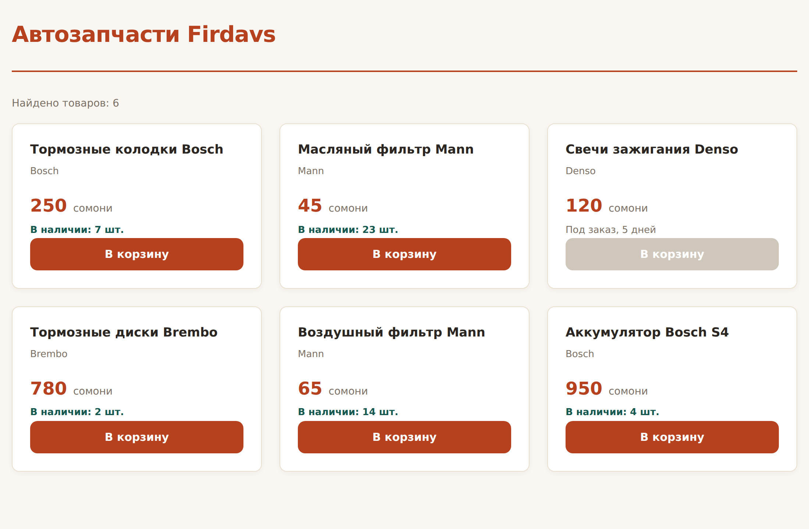

# Глава 16. DOM: меняем страницу из кода

> **Часть IV. JavaScript — оживляем страницу** · Глава 16 из 60
> [← Глава 15](15-js-funkcii-massivy.md) · [Глава 17 →](17-sobytiya.md)

## 🎯 Зачем эта глава

Две главы мы писали в консоль. Полезно для учёбы, бесполезно для покупателя —
он консоль не открывает.

Пора соединить JavaScript со страницей. В этой главе научимся:

- **находить** элементы на странице;
- **менять** их текст, стили и классы;
- **создавать** новые элементы из данных.

Последнее — самое важное. Помните массив товаров из прошлой главы?
Сейчас мы превратим его в настоящие карточки на странице. Это ровно то, чем
занимается любой современный сайт.

## 📖 Что такое DOM

Когда браузер получает HTML, он не хранит его как текст. Он строит **дерево
объектов** — по одному объекту на каждый тег.

Это дерево и называется **DOM** — *Document Object Model*, «объектная модель
документа».

```
document
└── html
    ├── head
    │   ├── meta
    │   └── title
    └── body
        ├── header
        │   └── h1
        └── main
            ├── article
            │   ├── h3
            │   └── p
            └── article
```

Ключевая мысль: **JavaScript меняет не HTML-файл, а это дерево.** Файл на диске
остаётся прежним. Меняется то, что браузер держит в памяти — и сразу же
перерисовывает на экране.

Отсюда важное следствие: **все изменения пропадают при обновлении страницы.**
Браузер перечитает файл и построит дерево заново.

Чтобы изменения сохранялись, их нужно записать на сервер — этим займёмся
в части про PHP.

`document` — точка входа, «вся страница». С него начинается любая работа с DOM.

## 📖 Находим элементы

### **Два метода, которых достаточно**

```javascript
const zagolovok = document.querySelector('h1');
const vseTovary = document.querySelectorAll('.tovar');
```

| Метод | Что возвращает |
|---|---|
| `querySelector` | **Первый** подошедший элемент (или `null`) |
| `querySelectorAll` | **Все** подошедшие, списком |

Отличная новость: **внутрь пишутся обычные CSS-селекторы** — те самые, что
вы учили в главе 9.

```javascript
document.querySelector('#poisk');              // по id
document.querySelector('.cena');               // по классу
document.querySelector('.tovar h3');           // вложенность
document.querySelector('input[type="search"]'); // по атрибуту
document.querySelectorAll('.tovar');           // все карточки
```

Ничего нового учить не надо. Знаете CSS — умеете искать в DOM.

### **Если не нашлось**

```javascript
const knopka = document.querySelector('.knopka-kotoroy-net');
console.log(knopka);   // null
```

`querySelector` вернёт `null`, а обращение к свойству `null` **уронит программу**:

```javascript
knopka.textContent = 'Купить';
// TypeError: Cannot read properties of null
```

Это **самая частая ошибка новичка в DOM**. Причины почти всегда две:

1. Опечатка в селекторе (забыли точку перед классом);
2. Скрипт выполнился **раньше**, чем появился элемент — тот самый случай,
   ради которого `<script>` ставят перед `</body>`.

Защититься просто:

```javascript
const knopka = document.querySelector('.knopka');
if (knopka) {
    knopka.textContent = 'Купить';
}
```

### **Перебрать найденные**

```javascript
const tovary = document.querySelectorAll('.tovar');

console.log(tovary.length);      // сколько нашлось

tovary.forEach(t => {
    console.log(t.textContent);
});
```

`querySelectorAll` возвращает не совсем массив, а похожую на него коллекцию.
`forEach` и `for...of` работают, а вот `map` и `filter` — нет. Если нужны они,
превратите в настоящий массив: `[...tovary]`.

## 📖 Меняем содержимое

### **`textContent` — текст**

```javascript
const zagolovok = document.querySelector('h1');

console.log(zagolovok.textContent);        // прочитать
zagolovok.textContent = 'Новое название';  // записать
```

### **`innerHTML` — с разметкой**

```javascript
const blok = document.querySelector('.cena');
blok.innerHTML = '<strong>250</strong> сомони';
```

Разница принципиальная:

| | `textContent` | `innerHTML` |
|---|---|---|
| Теги внутри | Покажет как текст | **Выполнит** как разметку |
| Скорость | Быстрее | Медленнее |
| Безопасность | **Безопасно** | **Опасно** для чужих данных |

### **Почему `innerHTML` опасен**

Представьте, что вы показываете отзыв покупателя:

```javascript
otzyv.innerHTML = tekstOtPolzovatelya;
```

А покупатель написал в отзыве:

```html
<script>ukrastCookie()</script>
```

Браузер честно выполнит этот код — на странице, у всех остальных посетителей.
Это называется **XSS-атака**, и она входит в тройку самых распространённых
способов взлома сайтов.

**Правило: для чужих данных всегда `textContent`.**
`innerHTML` — только для разметки, которую вы написали сами.

Подробно разберём в главе 36. Но привычку вырабатывайте сейчас.

## 📖 Меняем стили

### **Через `classList` — правильный способ**

```javascript
const karta = document.querySelector('.tovar');

karta.classList.add('vydelena');        // добавить класс
karta.classList.remove('vydelena');     // убрать
karta.classList.toggle('vydelena');     // есть — убрать, нет — добавить
console.log(karta.classList.contains('vydelena'));  // проверить
```

А сам вид описан в CSS:

```css
.tovar.vydelena {
    border-color: #b5411f;
    box-shadow: 0 4px 16px rgba(181, 65, 31, 0.2);
}
```

**Почему это правильно:** оформление остаётся в CSS, JavaScript только переключает
состояние. Разделение обязанностей из первой главы соблюдено.

### **Через `style` — когда значение вычисляется**

```javascript
element.style.display = 'none';
element.style.width = progress + '%';
```

Годится, когда значение известно только во время работы — например, ширина полосы
загрузки.

⚠️ Обратите внимание на две особенности:

```javascript
element.style.backgroundColor = 'red';   // не background-color!
element.style.width = '300px';           // единицы обязательны!
```

В JavaScript свойства пишутся **camelCase** вместо дефисов, а числовые значения
требуют единиц измерения. `width = 300` без `px` просто не сработает.

**Правило выбора:** есть заранее известный набор состояний — `classList`.
Значение вычисляется — `style`.

## 📖 Работа с атрибутами

```javascript
const kartinka = document.querySelector('img');

kartinka.src = 'novoe-foto.jpg';
kartinka.alt = 'Новое описание';

const ssylka = document.querySelector('a');
ssylka.href = '/catalog';

const pole = document.querySelector('input');
console.log(pole.value);       // что ввёл человек
pole.value = 'Bosch';          // подставить значение
```

⚠️ Для полей ввода нужен **`value`**, а не `textContent`. Частая ошибка.

### **Свои данные в атрибутах**

```html
<button data-tovar-id="42" data-cena="250">В корзину</button>
```

```javascript
const knopka = document.querySelector('button');
console.log(knopka.dataset.tovarId);   // "42"
console.log(knopka.dataset.cena);      // "250"
```

Атрибуты, начинающиеся с `data-`, — **официальный способ хранить свои данные
прямо в разметке**. Читаются через `dataset`, причём `data-tovar-id`
превращается в `dataset.tovarId` (дефисы уходят, camelCase появляется).

Незаменимо, когда нужно понять, **какой именно** товар кликнули.

⚠️ Всё, что приходит из `dataset`, — **строка**. `"250" + 1` даст `"2501"`,
а не `251`. Превращайте в число: `Number(knopka.dataset.cena)`.

## 📖 Создаём элементы

Вот главное умение этой главы.

### **Способ 1: собрать по частям**

```javascript
const karta = document.createElement('article');
karta.className = 'tovar';

const zagolovok = document.createElement('h3');
zagolovok.textContent = 'Тормозные колодки Bosch';

karta.append(zagolovok);
document.querySelector('.katalog').append(karta);
```

| Метод | Что делает |
|---|---|
| `createElement('div')` | Создать элемент (пока нигде не показан) |
| `append(что)` | Вложить внутрь, в конец |
| `prepend(что)` | Вложить в начало |
| `remove()` | Удалить элемент |

Способ надёжный и безопасный, но многословный.

### **Способ 2: через `innerHTML`**

```javascript
const katalog = document.querySelector('.katalog');

katalog.innerHTML = `
    <article class="tovar">
        <h3>Тормозные колодки Bosch</h3>
        <p class="cena">250 сомони</p>
    </article>
`;
```

Короче и нагляднее. Годится, когда данные **свои**, а не пришли от пользователя.

### **Способ 3: рисуем весь каталог из массива**

А теперь соединим всё, что знаем:

```javascript
const tovary = [
    { id: 1, nazvanie: 'Тормозные колодки Bosch', cena: 250, ostatok: 7 },
    { id: 2, nazvanie: 'Масляный фильтр Mann',    cena: 45,  ostatok: 23 },
    { id: 3, nazvanie: 'Свечи зажигания Denso',   cena: 120, ostatok: 0 }
];

function narisovatKatalog(spisok) {
    const katalog = document.querySelector('.katalog');

    if (spisok.length === 0) {
        katalog.innerHTML = '<p class="pusto">Ничего не нашлось</p>';
        return;
    }

    katalog.innerHTML = spisok.map(t => `
        <article class="tovar">
            <h3>${t.nazvanie}</h3>
            <p class="cena">${t.cena} <span>сомони</span></p>
            <p class="nalichie ${t.ostatok > 0 ? '' : 'nety'}">
                ${t.ostatok > 0 ? `В наличии: ${t.ostatok} шт.` : 'Под заказ'}
            </p>
            <button data-id="${t.id}">В корзину</button>
        </article>
    `).join('');
}

narisovatKatalog(tovary);
```

Разберём, что здесь происходит:

1. `map` превращает каждый товар в кусок HTML;
2. `join('')` склеивает все куски в одну строку;
3. `innerHTML` вставляет всё разом.

**Это и есть современный подход к сайтам.** Разметка не пишется руками —
она **строится из данных**. Три товара или три тысячи — код тот же.

Именно так работают React, Vue и все остальные модные библиотеки. Внутри у них,
конечно, сложнее и умнее, но идея ровно эта.

## 💻 Живой пример

```html
<!DOCTYPE html>
<html lang="ru">
<head>
    <meta charset="UTF-8">
    <title>Каталог из данных</title>
    <link rel="stylesheet" href="style.css">
</head>
<body>
<div class="container">
    <header>
        <div class="logo">Автозапчасти Firdavs</div>
    </header>

    <main>
        <p class="schetchik"></p>
        <div class="katalog"></div>
    </main>
</div>

<script src="script.js"></script>
</body>
</html>
```

Обратите внимание: **каталог в HTML пустой**. Ни одной карточки. Всё нарисует
JavaScript.

```javascript
const tovary = [
    {
        id: 1,
        nazvanie: 'Тормозные колодки Bosch',
        cena: 250,
        ostatok: 7,
        brend: 'Bosch'
    },
    {
        id: 2,
        nazvanie: 'Масляный фильтр Mann',
        cena: 45,
        ostatok: 23,
        brend: 'Mann'
    },
    {
        id: 3,
        nazvanie: 'Свечи зажигания Denso',
        cena: 120,
        ostatok: 0,
        brend: 'Denso'
    },
    {
        id: 4,
        nazvanie: 'Тормозные диски Brembo',
        cena: 780,
        ostatok: 2,
        brend: 'Brembo'
    },
    {
        id: 5,
        nazvanie: 'Воздушный фильтр Mann',
        cena: 65,
        ostatok: 14,
        brend: 'Mann'
    },
    {
        id: 6,
        nazvanie: 'Аккумулятор Bosch S4',
        cena: 950,
        ostatok: 4,
        brend: 'Bosch'
    },
];

function kartochka(t) {
    const estOstatok = t.ostatok > 0;
    return `
        <article class="tovar">
            <h3>${t.nazvanie}</h3>
            <p class="artikul">${t.brend}</p>
            <p class="cena">${t.cena} <span>сомони</span></p>
            <p class="nalichie ${estOstatok ? '' : 'nety'}">${
                estOstatok ? `В наличии: ${t.ostatok} шт.` : 'Под заказ, 5 дней'
            }</p>
            <button data-id="${t.id}" ${estOstatok ? '' : 'disabled'}>В корзину</button>
        </article>
    `;
}

function narisovat(spisok) {
    const katalog = document.querySelector('.katalog');
    const schetchik = document.querySelector('.schetchik');

    schetchik.textContent = `Найдено товаров: ${spisok.length}`;

    if (spisok.length === 0) {
        katalog.innerHTML = '<p class="pusto">Ничего не нашлось</p>';
        return;
    }

    katalog.innerHTML = spisok.map(kartochka).join('');
}

narisovat(tovary);
```

Обратите внимание на `disabled` у кнопки: если товара нет, кнопка автоматически
становится неактивной. Логика вида задаётся **данными**, а не руками.

## 🖥 На экране



Откройте F12 → Elements. Вы увидите **все шесть карточек** в дереве — хотя
в исходном файле их нет.

Теперь нажмите правую кнопку → «Посмотреть код страницы». Там пусто.

**Разница между этими двумя окнами и есть DOM.** «Код страницы» — то, что прислал
сервер. «Elements» — то, что сейчас в памяти браузера.

## 🔤 Разбор по словам

| Запись | Что делает |
|---|---|
| `document` | Вся страница, точка входа |
| `querySelector('.класс')` | Найти **первый** по CSS-селектору |
| `querySelectorAll('.класс')` | Найти **все** |
| `.textContent` | Текст элемента. **Безопасно** |
| `.innerHTML` | Содержимое с разметкой. **Опасно** для чужих данных |
| `.value` | Значение поля ввода |
| `.classList.add/remove/toggle` | Управление классами |
| `.style.backgroundColor` | Стиль напрямую. camelCase, единицы обязательны |
| `.dataset.tovarId` | Прочитать `data-tovar-id`. Всегда строка |
| `createElement('div')` | Создать элемент |
| `.append(что)` | Вложить в конец |
| `.remove()` | Удалить |
| `.map(...).join('')` | Собрать HTML из массива |
| `null` | Ничего не нашлось |

## ⚠️ Грабли

**`Cannot read properties of null`.** Элемент не найден. Проверьте селектор
(точка перед классом!) и положение `<script>` — он должен быть перед `</body>`.

**Забыть точку или решётку.** `querySelector('tovar')` ищет **тег** `<tovar>`.
Нужно `.tovar`.

**`innerHTML` с чужими данными.** Дыра в безопасности. Для отзывов, имён,
комментариев — только `textContent`.

**`textContent` вместо `value` для полей.** У `<input>` значение читается
через `value`.

**Забыть единицы в `style`.** `el.style.width = 300` не работает. Нужно `'300px'`.

**`dataset` возвращает строку.** `Number(...)` перед арифметикой.

**Ждать, что изменения сохранятся.** Обновили страницу — всё вернулось.
DOM живёт только в памяти.

**Перерисовывать весь список в цикле по одному.** `katalog.innerHTML += ...`
внутри цикла заставляет браузер перестраивать дерево на каждой итерации.
Собирайте строку целиком, вставляйте один раз.

## 🏋️ Задачи

**Задача 16.1.** Найдите на своей странице заголовок и поменяйте его текст из консоли.

**Задача 16.2.** Что вернёт каждая строка на странице из примера?

```javascript
document.querySelector('.tovar');
document.querySelectorAll('.tovar').length;
document.querySelector('.tovar h3').textContent;
document.querySelector('.netu-takogo');
```

**Задача 16.3.** Постройте каталог из массива по примеру главы. Добавьте
в массив седьмой товар и убедитесь, что он появился сам.

**Задача 16.4.** Напишите функцию, которая рисует только товары в наличии.
Подсказка: `narisovat(tovary.filter(...))`.

**Задача 16.5.** Сделайте так, чтобы товары дороже 500 сомони получали класс
`dorogoy`, а в CSS у него была золотая рамка.

**Задача 16.6.** Найдите ошибку:

```javascript
const cena = document.querySelector('.cena');
const novaya = cena.textContent + 100;
console.log(novaya);
```

**Задача 16.7.** Выведите на страницу итоги: сколько позиций, сколько штук
на складе, общая стоимость склада. Используйте `reduce` из главы 15.

**Задача 16.8.** Через `data-` атрибуты передайте в каждую кнопку id и цену товара.
Выведите их в консоль для всех кнопок сразу.

**Задача 16.9.** Откройте любой крупный сайт, F12 → Elements. Найдите блок
с товаром и удалите его клавишей Delete. Он исчез. Обновите страницу — вернулся.
Объясните своими словами, почему.

*Ответы — в [Приложении Г](../prilozheniya/4-G-otvety.md).*

## 🔗 В бою

В `assets/js/` этого репозитория найдите код, который рисует карточки товаров
в результатах поиска. Увидите ту же связку `map` + `join` + `innerHTML`.

Одна боевая деталь, которую стоит заметить: перед вставкой все данные от поставщика
**прогоняются через экранирование** — превращают `<` в `&lt;`, чтобы чужой текст
никогда не выполнился как разметка.

Это защита от XSS, о которой мы говорили. На боевом сайте она обязательна:
названия запчастей приходят из чужого API, и никто не гарантирует, что там
не окажется чего-то опасного.

## 📌 Итог

- **DOM** — дерево объектов, которое браузер строит из HTML и держит в памяти.
- JavaScript меняет **дерево**, а не файл. Обновление страницы всё вернёт.
- `querySelector` — первый, `querySelectorAll` — все. **Внутри обычные CSS-селекторы.**
- Не нашлось — `null`. Обращение к `null` роняет программу.
- `textContent` — текст и **безопасность**. `innerHTML` — разметка и **риск XSS**.
- Для чужих данных **только `textContent`**.
- `classList` для состояний, `style` для вычисленных значений.
- `data-` атрибуты + `dataset` — хранение своих данных в разметке. Всегда строка.
- **`map` + `join` + `innerHTML`** — построить разметку из данных. Главный приём главы.
- Собирайте строку целиком и вставляйте один раз.

Дальше — события: научимся реагировать на клики и ввод.

[← Глава 15](15-js-funkcii-massivy.md) · [Глава 17. События →](17-sobytiya.md)
