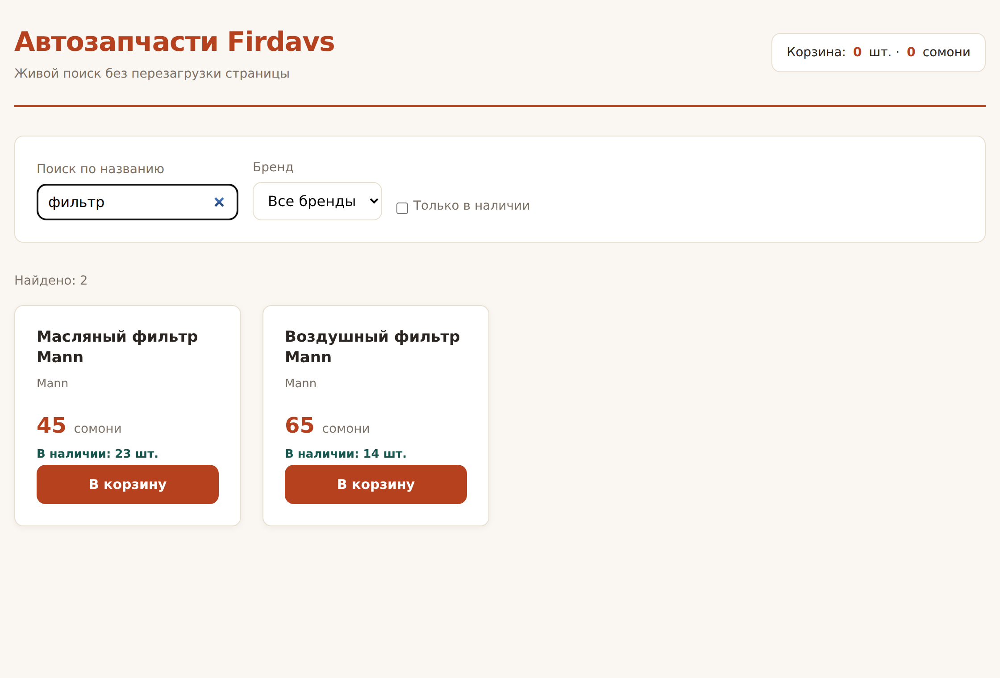
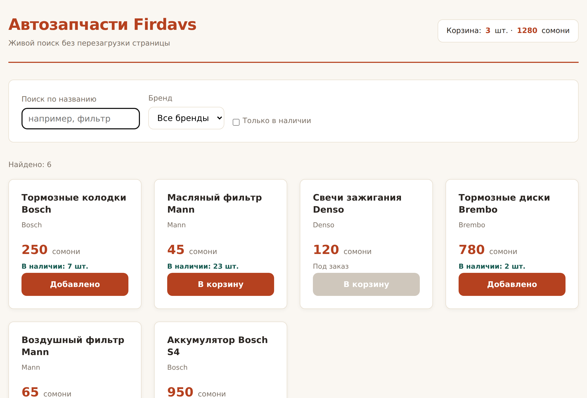

# Глава 17. События: реакция на действия

> **Часть IV. JavaScript — оживляем страницу** · Глава 17 из 60
> [← Глава 16](16-dom.md) · [Глава 18 →](18-praktika-poisk-korzina.md)

## 🎯 Зачем эта глава

Каталог рисуется из данных — уже хорошо. Но он всё ещё не реагирует на человека.
Нажали кнопку — ничего. Набрали в поиске — ничего.

**Событие** — это «что-то произошло»: щелчок, ввод буквы, прокрутка, отправка формы.
Научившись их ловить, вы сможете сделать интерфейс по-настоящему живым.

Эта глава — последний кусок теории JavaScript. Дальше только практика.

## 📖 Как поймать событие

### **Основной способ**

```javascript
const knopka = document.querySelector('button');

knopka.addEventListener('click', function () {
    console.log('Нажали!');
});
```

Читается: «кнопка, слушай событие `click`, и когда оно случится — выполни вот это».

| Часть | Что означает |
|---|---|
| `addEventListener` | «Добавить слушателя события» |
| `'click'` | Какое событие ждём |
| `function () {...}` | Что делать, когда случится |

Со стрелочной функцией короче:

```javascript
knopka.addEventListener('click', () => {
    console.log('Нажали!');
});
```

### **Почему не `onclick`**

Есть и такой способ:

```javascript
knopka.onclick = () => console.log('Нажали');
```

Работает, но у него ограничение: **обработчик может быть только один**.
Назначите второй — первый пропадёт.

`addEventListener` позволяет повесить сколько угодно обработчиков на одно событие.
Пользуйтесь им.

И совсем плохой способ, который встречается в старом коде:

```html
<button onclick="dobavit()">В корзину</button>
```

Логика в разметке — то же самое, что инлайн-стили из главы 9. Смешивает
обязанности и мешает поддерживать.

## 📖 События, которые нужны

| Событие | Когда происходит | Где применяется |
|---|---|---|
| `click` | Щелчок мышью или тап пальцем | Кнопки, ссылки |
| `input` | **Каждое изменение** поля ввода | Живой поиск |
| `change` | Поле изменилось **и потеряло фокус** | Выпадающие списки, галочки |
| `submit` | Отправка формы | Проверка перед отправкой |
| `keydown` | Нажали клавишу | Горячие клавиши, Enter |
| `focus` / `blur` | Поле получило / потеряло фокус | Подсказки |
| `mouseenter` / `mouseleave` | Курсор вошёл / вышел | Всплывающие подсказки |
| `scroll` | Прокрутка страницы | Прилипающая шапка |
| `DOMContentLoaded` | Страница построена | Запуск скрипта |

### **`input` против `change` — важная разница**

```javascript
const pole = document.querySelector('input');

pole.addEventListener('input', () => {
    console.log('Изменилось:', pole.value);   // на каждую букву
});

pole.addEventListener('change', () => {
    console.log('Закончили:', pole.value);    // когда ушли из поля
});
```

Для **живого поиска** нужен `input` — он срабатывает на каждую букву.
Для **выпадающего списка** удобнее `change`.

## 📖 Объект события

Обработчик получает на вход объект с подробностями:

```javascript
knopka.addEventListener('click', (event) => {
    console.log(event.target);       // на чём именно кликнули
    console.log(event.type);         // 'click'
});
```

| Свойство | Что даёт |
|---|---|
| `event.target` | **Элемент, на котором произошло событие** |
| `event.type` | Название события |
| `event.key` | Какая клавиша (для клавиатурных) |
| `event.preventDefault()` | Отменить обычное поведение браузера |

Имя `event` можно сокращать до `e` — так делают почти все.

### **`preventDefault` — отменить поведение по умолчанию**

У некоторых элементов есть встроенное поведение: ссылка переходит, форма
перезагружает страницу.

```javascript
const forma = document.querySelector('form');

forma.addEventListener('submit', (e) => {
    e.preventDefault();          // страница НЕ перезагрузится
    console.log('Обрабатываем сами');
});
```

**Зачем.** Форма по умолчанию отправляется на сервер и перезагружает страницу.
Иногда это правильно (глава 24). Но если мы хотим обработать данные прямо здесь,
без перезагрузки, — нужен `preventDefault`.

## 📖 Делегирование — важнейший приём

### **Проблема**

Повесим обработчик на все кнопки каталога:

```javascript
document.querySelectorAll('.tovar button').forEach(knopka => {
    knopka.addEventListener('click', () => {
        console.log('В корзину');
    });
});
```

Работает. Но есть две беды.

**Беда первая.** Кнопки, созданные **после** этого кода, обработчик не получат.
А в прошлой главе мы рисуем каталог из данных — и перерисовываем его при каждом
фильтре. Все обработчики теряются.

**Беда вторая.** Шестьсот товаров — шестьсот слушателей в памяти.

### **Решение**

Вешаем **один** обработчик на родителя и смотрим, куда именно кликнули:

```javascript
document.querySelector('.katalog').addEventListener('click', (e) => {
    const knopka = e.target.closest('button');
    if (!knopka) return;                    // кликнули мимо кнопки

    const id = Number(knopka.dataset.id);
    console.log('В корзину товар', id);
});
```

Это называется **делегирование событий**.

Разберём:

| Строка | Что делает |
|---|---|
| Слушатель на `.katalog` | Ловим клики по **всему** каталогу |
| `e.target` | Элемент, на который реально попал клик |
| `.closest('button')` | Подняться вверх до ближайшей кнопки |
| `if (!knopka) return` | Кликнули не по кнопке — выходим |

**Зачем `closest`.** Внутри кнопки может быть иконка или текст. Клик попадёт
в них, а не в саму кнопку. `closest` поднимается по дереву вверх и находит
ближайшего подходящего предка (или сам элемент).

**Что мы выиграли:**

- один слушатель вместо шестисот;
- работает для элементов, которых **ещё не существует**;
- каталог можно перерисовывать сколько угодно — обработчик не потеряется.

**Запомните этот приём.** Он используется в любом реальном проекте.

## 📖 Запускать скрипт вовремя

Если `<script>` стоит в `<head>`, элементов ещё нет:

```javascript
document.addEventListener('DOMContentLoaded', () => {
    // здесь вся страница уже построена
    narisovat(tovary);
});
```

Событие `DOMContentLoaded` — «дерево готово».

Но если `<script>` стоит **перед `</body>>`**, как мы и договорились в главе 14,
это уже не нужно: к моменту выполнения скрипта страница построена.

Знать полезно: вы обязательно встретите эту обёртку в чужом коде.

## 💻 Оживляем каталог

Собираем всё: рисование из данных, фильтры, поиск, корзину.

```javascript
const tovary = [
    {
        id: 1,
        nazvanie: 'Тормозные колодки Bosch',
        cena: 250,
        ostatok: 7,
        brend: 'Bosch'
    },
    {
        id: 2,
        nazvanie: 'Масляный фильтр Mann',
        cena: 45,
        ostatok: 23,
        brend: 'Mann'
    },
    {
        id: 3,
        nazvanie: 'Свечи зажигания Denso',
        cena: 120,
        ostatok: 0,
        brend: 'Denso'
    },
    {
        id: 4,
        nazvanie: 'Тормозные диски Brembo',
        cena: 780,
        ostatok: 2,
        brend: 'Brembo'
    },
    {
        id: 5,
        nazvanie: 'Воздушный фильтр Mann',
        cena: 65,
        ostatok: 14,
        brend: 'Mann'
    },
    {
        id: 6,
        nazvanie: 'Аккумулятор Bosch S4',
        cena: 950,
        ostatok: 4,
        brend: 'Bosch'
    },
];

// Корзина живёт здесь
const korzina = [];

// --- Отрисовка ---

function kartochka(t) {
    const est = t.ostatok > 0;
    return `
        <article class="tovar">
            <h3>${t.nazvanie}</h3>
            <p class="artikul">${t.brend}</p>
            <p class="cena">${t.cena} <span>сомони</span></p>
            <p class="nalichie ${est ? '' : 'nety'}">${
                est ? `В наличии: ${t.ostatok} шт.` : 'Под заказ'
            }</p>
            <button data-id="${t.id}" ${est ? '' : 'disabled'}>В корзину</button>
        </article>`;
}

function narisovat(spisok) {
    const katalog = document.querySelector('.katalog');
    document.querySelector('.schetchik').textContent = `Найдено: ${spisok.length}`;

    katalog.innerHTML = spisok.length
        ? spisok.map(kartochka).join('')
        : '<p class="pusto">Ничего не нашлось. Попробуйте другой запрос.</p>';
}

// --- Фильтрация ---

function primenitFiltry() {
    const zapros = document.querySelector('#poisk').value.trim().toLowerCase();
    const brend = document.querySelector('#brend').value;
    const tolkoVNalichii = document.querySelector('#v-nalichii').checked;

    let spisok = tovary;

    if (zapros) {
        spisok = spisok.filter(t => t.nazvanie.toLowerCase().includes(zapros));
    }
    if (brend) {
        spisok = spisok.filter(t => t.brend === brend);
    }
    if (tolkoVNalichii) {
        spisok = spisok.filter(t => t.ostatok > 0);
    }

    narisovat(spisok);
}

// --- Корзина ---

function obnovitKorzinu() {
    const shtuk = korzina.reduce((s, p) => s + p.kolichestvo, 0);
    const summa = korzina.reduce((s, p) => s + p.tovar.cena * p.kolichestvo, 0);

    document.querySelector('.korzina-shtuk').textContent = shtuk;
    document.querySelector('.korzina-summa').textContent = summa;
}

function dobavitVKorzinu(id) {
    const tovar = tovary.find(t => t.id === id);
    if (!tovar) return;

    const uzheEst = korzina.find(p => p.tovar.id === id);
    if (uzheEst) {
        uzheEst.kolichestvo = uzheEst.kolichestvo + 1;
    } else {
        korzina.push({ tovar, kolichestvo: 1 });
    }

    obnovitKorzinu();
}

// --- События ---

document.querySelector('#poisk').addEventListener('input', primenitFiltry);
document.querySelector('#brend').addEventListener('change', primenitFiltry);
document.querySelector('#v-nalichii').addEventListener('change', primenitFiltry);

// Делегирование: один слушатель на весь каталог
document.querySelector('.katalog').addEventListener('click', (e) => {
    const knopka = e.target.closest('button');
    if (!knopka || knopka.disabled) return;

    dobavitVKorzinu(Number(knopka.dataset.id));

    // Короткая обратная связь — человек должен видеть, что нажатие сработало
    knopka.textContent = 'Добавлено';
    setTimeout(() => { knopka.textContent = 'В корзину'; }, 900);
});

// Форма поиска не должна перезагружать страницу
document.querySelector('.filtry').addEventListener('submit', (e) => {
    e.preventDefault();
    primenitFiltry();
});

// Первый показ
narisovat(tovary);
obnovitKorzinu();
```

### **Что здесь важного**

**`setTimeout(функция, 900)`** — «выполни через 900 миллисекунд». Кнопка на секунду
меняет надпись и возвращается. Мелочь, но без неё человек не понимает, сработало ли
нажатие.

**Обратная связь обязательна.** Любое действие должно быть заметно: изменилась
надпись, дёрнулся счётчик, мигнула карточка. Интерфейс, который молчит в ответ
на нажатие, кажется сломанным.

**`.trim()`** убирает пробелы по краям, **`.toLowerCase()`** приводит к нижнему
регистру. Вместе они делают поиск нечувствительным к регистру и случайным пробелам —
человек напишет « Bosch » и всё равно найдёт.

**`.includes(zapros)`** проверяет, содержится ли подстрока. Это и есть поиск
по названию.

## 🖥 На экране

Набрали в поиске «фильтр» — каталог мгновенно сузился, счётчик обновился:



Страница **не перезагружалась**. Ни одного запроса на сервер. Всё происходит
в браузере, мгновенно.

Нажали «В корзину» — счётчик вырос, кнопка отчиталась:



## 🔤 Разбор по словам

| Запись | Что делает |
|---|---|
| `addEventListener('click', fn)` | Слушать событие |
| `'click'` | Щелчок или тап |
| `'input'` | Каждое изменение поля |
| `'change'` | Изменилось и потеряло фокус |
| `'submit'` | Отправка формы |
| `e.target` | Элемент, на котором произошло событие |
| `e.preventDefault()` | Отменить обычное поведение |
| `.closest('button')` | Найти ближайшего подходящего предка |
| **делегирование** | Один слушатель на родителе вместо многих на детях |
| `setTimeout(fn, 900)` | Выполнить через 900 мс |
| `.trim()` | Убрать пробелы по краям |
| `.toLowerCase()` | В нижний регистр |
| `.includes('текст')` | Содержит ли подстроку |
| `.checked` | Отмечена ли галочка |
| `DOMContentLoaded` | Дерево страницы готово |

## ⚠️ Грабли

**Обработчики теряются после перерисовки.** Классика. Лечится делегированием.

**Забыть `preventDefault` у формы.** Страница перезагрузится, и покажется,
что «ничего не работает».

**Вешать слушателя на элемент, которого ещё нет.** `querySelector` вернёт `null`,
и `addEventListener` уронит программу. Проверьте порядок и положение `<script>`.

**Вызвать функцию вместо того, чтобы передать её.**

```javascript
knopka.addEventListener('click', primenitFiltry());   // ❌ вызовется сразу
knopka.addEventListener('click', primenitFiltry);     // ✅ передали саму функцию
```

Разница в скобках. Ошибка коварная: код «работает один раз при загрузке»,
а на клик не реагирует.

**Не давать обратной связи.** Нажали — ничего не изменилось — нажали ещё пять раз.

**Обработчик на `input` без ограничения.** Если внутри тяжёлая операция или запрос
на сервер, он полетит на каждую букву. Лечится приёмом debounce — разберём в главе 35.

## 🏋️ Задачи

**Задача 17.1.** Соберите пример из главы. Проверьте: поиск, фильтр по бренду,
галочка наличия, кнопки корзины.

**Задача 17.2.** Добавьте сортировку: выпадающий список «по цене возрастанию /
убыванию / по названию». Событие `change`.

**Задача 17.3.** Сделайте кнопку «Сбросить фильтры»: очищает поиск, ставит бренд
«все», снимает галочку и перерисовывает каталог.

**Задача 17.4.** Добавьте фильтр по цене: два поля «от» и «до», событие `input`.

**Задача 17.5.** Сделайте так, чтобы по нажатию Enter в поле поиска страница
не перезагружалась. Подсказка: событие `keydown` и `e.key === 'Enter'`,
либо `submit` формы.

**Задача 17.6.** Найдите ошибку:

```javascript
document.querySelectorAll('.tovar button').forEach(k => {
    k.addEventListener('click', () => dobavitVKorzinu(k.dataset.id));
});
narisovat(tovary);
```

Две проблемы. Найдите обе.

**Задача 17.7.** Сделайте раскрывающийся блок «Подробнее» у каждой карточки.
Через делегирование и `classList.toggle`.

**Задача 17.8.** Добавьте счётчику корзины анимацию при изменении: пусть
на мгновение увеличивается. Подсказка: добавить класс, снять через `setTimeout`.

**Задача 17.9.** Сделайте кнопку «Очистить корзину» с подтверждением через
`confirm('Точно?')`.

**Задача 17.10.** Откройте любой интернет-магазин, нажмите «в корзину» и следите
за F12 → Network. Ушёл ли запрос на сервер? Что это говорит о том, где хранится
корзина?

*Ответы — в [Приложении Г](../prilozheniya/4-G-otvety.md).*

## 🔗 В бою

В боевом магазине делегирование используется везде — иначе после каждого фильтра
пришлось бы заново развешивать обработчики на сотни карточек.

Но есть принципиальная разница с нашим примером, и её важно понять.

**У нас корзина живёт в переменной `korzina`.** Обновите страницу — она пуста.

**В настоящем магазине корзина хранится на сервере.** Нажатие «в корзину»
отправляет запрос в `api/`, PHP записывает товар в сессию или в базу, и корзина
переживает и обновление страницы, и закрытие браузера, и переход с телефона
на компьютер.

Почему нельзя оставить корзину в JavaScript: покупатель может подделать что угодно
в браузере, включая цены. Помните правило из первой главы? **Деньги считает только
сервер.**

Как это сделать — в главе 38.

## 📌 Итог

- `addEventListener('событие', функция)` — основной способ. Не `onclick`,
  не атрибуты в разметке.
- `click` — нажатие, `input` — каждая буква, `change` — после потери фокуса,
  `submit` — отправка формы.
- `e.target` — где произошло, `e.preventDefault()` — отменить обычное поведение.
- **Делегирование**: один слушатель на родителе + `closest`. Работает
  для будущих элементов и экономит память. **Главный приём главы.**
- Передавайте функцию **без скобок**: `addEventListener('click', fn)`.
- Каждое действие должно давать **обратную связь**.
- `trim()` + `toLowerCase()` + `includes()` — базовый поиск по тексту.
- Корзина в JavaScript исчезает при обновлении. Настоящая живёт на сервере.

Следующая глава — практическая. Доведём поиск и корзину до готового вида.

[← Глава 16](16-dom.md) · [Глава 18. Практика: поиск и корзина →](18-praktika-poisk-korzina.md)
