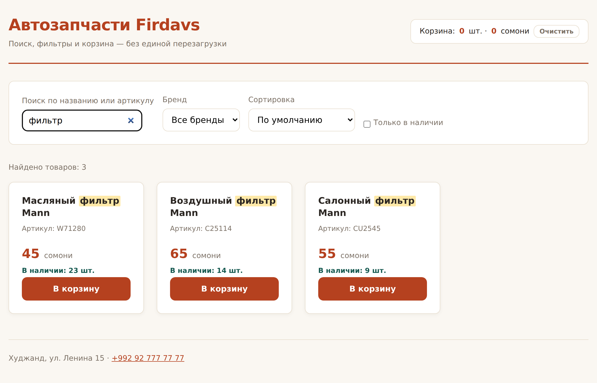
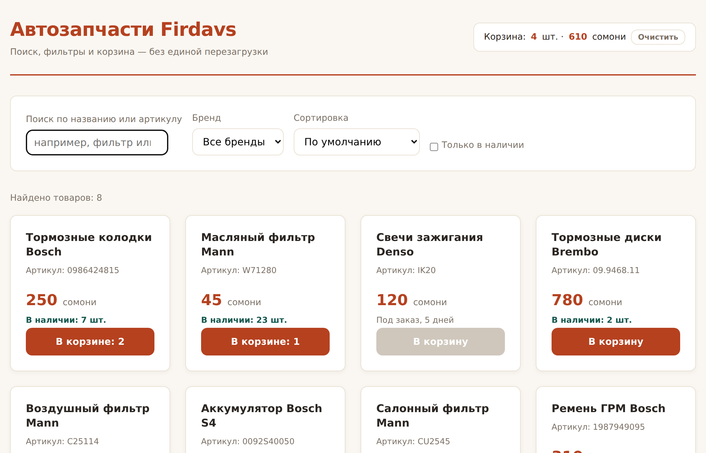

# Глава 18. Практика: живой поиск и корзина

> **Часть IV. JavaScript — оживляем страницу** · Глава 18 из 60
> [← Глава 17](17-sobytiya.md) · [Глава 19 →](19-chto-delaet-php.md)

## 🎯 Зачем эта глава

Соберём всё, чему научились, в законченную вещь: каталог с поиском, фильтрами,
сортировкой и корзиной, которая **не пропадает при обновлении страницы**.

И разберём четыре приёма, которые отличают учебный код от рабочего:

- **`localStorage`** — как запомнить данные в браузере;
- **debounce** — как не дёргать поиск на каждую букву;
- **подсветка совпадений** — и почему здесь легко открыть дыру в безопасности;
- **честные состояния** — что показывать, когда ничего не нашлось.

## 📖 `localStorage` — память браузера

### **Проблема**

Наша корзина живёт в переменной. Обновили страницу — пусто. Покупатель, который
случайно нажал F5, теряет всё.

### **Решение**

У браузера есть небольшое хранилище, которое переживает и обновление, и закрытие:

```javascript
localStorage.setItem('korzina', '...');    // записать
const dannye = localStorage.getItem('korzina');  // прочитать
localStorage.removeItem('korzina');        // удалить
localStorage.clear();                      // очистить всё
```

⚠️ **Хранить можно только строки.** Массив или объект придётся превратить в текст:

```javascript
// Сохраняем
localStorage.setItem('korzina', JSON.stringify(korzina));

// Читаем
const sohranennoe = localStorage.getItem('korzina');
const korzina = sohranennoe ? JSON.parse(sohranennoe) : [];
```

| Функция | Что делает |
|---|---|
| `JSON.stringify(объект)` | Превратить объект или массив **в строку** |
| `JSON.parse(строка)` | Превратить строку **обратно** в объект |

**JSON** — формат обмена данными, похожий на объект JavaScript. С ним вы будете
встречаться постоянно: в нём общаются браузер и сервер (глава 49), в нём приходят
данные от чужих API.

### **Что важно знать про `localStorage`**

| Свойство | Подробность |
|---|---|
| Объём | Около 5 МБ. Для корзины с запасом |
| Срок жизни | Бессрочно, пока не удалят |
| Область | Только **этот сайт** в **этом браузере** |
| Другое устройство | Не увидит. Это память браузера, не аккаунта |
| Доступ из JavaScript | Полный — и в этом главная опасность |

⚠️ **Никогда не храните в `localStorage`:**

- пароли;
- номера карт;
- токены доступа;
- **цены, по которым будете считать заказ**.

Любой скрипт на странице может это прочитать и изменить. `localStorage` годится
для удобства (что лежало в корзине, какие фильтры выбраны, тёмная тема),
но не для того, за что отвечают деньги.

**В корзине храните только номера товаров и количество.** Цену возьмите
с сервера при оформлении. Иначе покупатель откроет консоль, поменяет цену на 1
и оформит заказ.

## 📖 Debounce — не дёргать на каждую букву

Наш поиск работает по событию `input` — на каждую букву. Для шести товаров
в памяти это нормально.

А если товаров десять тысяч и поиск идёт **на сервере**? Человек набирает
«колодки» — уходит семь запросов, шесть из которых уже никому не нужны.

**Debounce** — приём «подожди, пока перестанут печатать»:

```javascript
function debounce(funkciya, zaderzhka = 300) {
    let tajmer;
    return function (...argumenty) {
        clearTimeout(tajmer);
        tajmer = setTimeout(() => funkciya(...argumenty), zaderzhka);
    };
}

// Применяем
const poiskSZaderzhkoy = debounce(primenitFiltry, 300);
document.querySelector('#poisk').addEventListener('input', poiskSZaderzhkoy);
```

Как работает: каждое нажатие **отменяет** предыдущий таймер и ставит новый.
Пока человек печатает, функция не вызывается. Замолчал на 300 мс — сработала
один раз.

Разберём непривычное:

| Запись | Что означает |
|---|---|
| `clearTimeout(tajmer)` | Отменить запланированное |
| `...argumenty` | «Сколько бы аргументов ни было — забери все» |
| Функция возвращает функцию | Обычное дело в JavaScript. Внутренняя помнит `tajmer` |

Функция, возвращающая функцию, поначалу выглядит странно. Просто примите как
рабочий приём — со временем станет привычным.

**300 миллисекунд** — хорошее значение по умолчанию: человек не замечает задержки,
а запросов становится в разы меньше.

## 📖 Подсветка совпадений — и ловушка в ней

Хочется подсветить найденное:

```javascript
function podsvetit(tekst, zapros) {
    if (!zapros) return tekst;
    const regexp = new RegExp(`(${zapros})`, 'gi');
    return tekst.replace(regexp, '<mark>$1</mark>');
}
```

`<mark>` — семантический тег «выделенное», браузер красит его жёлтым.

⚠️ **А теперь ловушка.** Мы вставляем результат через `innerHTML`, а внутри —
текст, который **набрал пользователь**. Если он введёт ``,
код выполнится.

На нашей странице это безобидно — вредит только себе. Но если поисковый запрос
попадает в ссылку, которой можно поделиться, — это уже настоящая XSS-уязвимость.

**Лечится экранированием — превращением опасных символов в безопасные:**

```javascript
function ekranirovat(tekst) {
    return String(tekst)
        .replace(/&/g, '&amp;')
        .replace(/</g, '&lt;')
        .replace(/>/g, '&gt;')
        .replace(/"/g, '&quot;');
}

function podsvetit(tekst, zapros) {
    const bezopasnyiTekst = ekranirovat(tekst);
    if (!zapros) return bezopasnyiTekst;

    const bezopasnyiZapros = ekranirovat(zapros).replace(/[.*+?^${}()|[\]\\]/g, '\\$&');
    const regexp = new RegExp(`(${bezopasnyiZapros})`, 'gi');
    return bezopasnyiTekst.replace(regexp, '<mark>$1</mark>');
}
```

Теперь `<` превращается в `&lt;` и показывается **как текст**, а не выполняется.

Второй `replace` с непонятными символами экранирует спецсимволы регулярных
выражений — без него запрос вроде `(` уронит поиск. Регулярные выражения —
отдельная большая тема; пока достаточно знать, что эта строчка защищает от падения.

**Запомните правило.** Данные от пользователя опасны **всегда**. Даже свои
собственные — сегодня поле заполняете вы, завтра оно приедет из чужого API.
Экранируйте.

## 💻 Готовый каталог

```javascript
// ===== Данные =====

const tovary = [
    { id: 1, nazvanie: 'Тормозные колодки Bosch',  artikul: '0986424815', cena: 250, ostatok: 7,  brend: 'Bosch' },
    { id: 2, nazvanie: 'Масляный фильтр Mann',     artikul: 'W71280',     cena: 45,  ostatok: 23, brend: 'Mann' },
    { id: 3, nazvanie: 'Свечи зажигания Denso',    artikul: 'IK20',       cena: 120, ostatok: 0,  brend: 'Denso' },
    { id: 4, nazvanie: 'Тормозные диски Brembo',   artikul: '09.9468.11', cena: 780, ostatok: 2,  brend: 'Brembo' },
    { id: 5, nazvanie: 'Воздушный фильтр Mann',    artikul: 'C25114',     cena: 65,  ostatok: 14, brend: 'Mann' },
    { id: 6, nazvanie: 'Аккумулятор Bosch S4',     artikul: '0092S40050', cena: 950, ostatok: 4,  brend: 'Bosch' },
    { id: 7, nazvanie: 'Салонный фильтр Mann',     artikul: 'CU2545',     cena: 55,  ostatok: 9,  brend: 'Mann' },
    { id: 8, nazvanie: 'Ремень ГРМ Bosch',         artikul: '1987949095', cena: 310, ostatok: 3,  brend: 'Bosch' }
];

// ===== Корзина: только id и количество =====
// Цену не храним осознанно: её должен считать сервер, иначе покупатель
// поменяет число в браузере и оформит заказ по своей цене.

let korzina = zagruzitKorzinu();

function zagruzitKorzinu() {
    try {
        const dannye = localStorage.getItem('korzina');
        return dannye ? JSON.parse(dannye) : [];
    } catch (e) {
        // Данные могли испортиться — начинаем с пустой, а не падаем
        return [];
    }
}

function sohranitKorzinu() {
    localStorage.setItem('korzina', JSON.stringify(korzina));
}

// ===== Вспомогательное =====

function ekranirovat(tekst) {
    return String(tekst)
        .replace(/&/g, '&amp;')
        .replace(/</g, '&lt;')
        .replace(/>/g, '&gt;')
        .replace(/"/g, '&quot;');
}

function podsvetit(tekst, zapros) {
    const bezopasnyi = ekranirovat(tekst);
    if (!zapros) return bezopasnyi;
    const shablon = ekranirovat(zapros).replace(/[.*+?^${}()|[\]\\]/g, '\\$&');
    return bezopasnyi.replace(new RegExp(`(${shablon})`, 'gi'), '<mark>$1</mark>');
}

function debounce(funkciya, zaderzhka = 300) {
    let tajmer;
    return (...argumenty) => {
        clearTimeout(tajmer);
        tajmer = setTimeout(() => funkciya(...argumenty), zaderzhka);
    };
}

// ===== Отрисовка =====

function kartochka(t, zapros) {
    const est = t.ostatok > 0;
    const vKorzine = korzina.find(p => p.id === t.id);

    return `
        <article class="tovar">
            <h3>${podsvetit(t.nazvanie, zapros)}</h3>
            <p class="artikul">Артикул: ${podsvetit(t.artikul, zapros)}</p>
            <p class="cena">${t.cena} <span>сомони</span></p>
            <p class="nalichie ${est ? '' : 'nety'}">${
                est ? `В наличии: ${t.ostatok} шт.` : 'Под заказ, 5 дней'
            }</p>
            <button data-id="${t.id}" ${est ? '' : 'disabled'}>
                ${vKorzine ? `В корзине: ${vKorzine.kolichestvo}` : 'В корзину'}
            </button>
        </article>`;
}

function narisovat(spisok, zapros) {
    const katalog = document.querySelector('.katalog');
    document.querySelector('.schetchik').textContent =
        spisok.length ? `Найдено товаров: ${spisok.length}` : '';

    if (spisok.length === 0) {
        katalog.innerHTML = `
            <div class="pusto">
                <h3>Ничего не нашлось</h3>
                <p>Попробуйте другой запрос или сбросьте фильтры.</p>
                <button class="sbros">Показать все товары</button>
            </div>`;
        return;
    }

    katalog.innerHTML = spisok.map(t => kartochka(t, zapros)).join('');
}

// ===== Фильтры =====

function primenitFiltry() {
    const zapros  = document.querySelector('#poisk').value.trim();
    const nizhnij = zapros.toLowerCase();
    const brend   = document.querySelector('#brend').value;
    const tolkoEst = document.querySelector('#v-nalichii').checked;
    const sortirovka = document.querySelector('#sort').value;

    let spisok = [...tovary];

    if (nizhnij) {
        spisok = spisok.filter(t =>
            t.nazvanie.toLowerCase().includes(nizhnij) ||
            t.artikul.toLowerCase().includes(nizhnij)
        );
    }
    if (brend)     spisok = spisok.filter(t => t.brend === brend);
    if (tolkoEst)  spisok = spisok.filter(t => t.ostatok > 0);

    if (sortirovka === 'cena-vozr')  spisok.sort((a, b) => a.cena - b.cena);
    if (sortirovka === 'cena-ubyv')  spisok.sort((a, b) => b.cena - a.cena);
    if (sortirovka === 'nazvanie')   spisok.sort((a, b) => a.nazvanie.localeCompare(b.nazvanie));

    narisovat(spisok, zapros);
}

// ===== Корзина =====

function obnovitKorzinu() {
    const shtuk = korzina.reduce((s, p) => s + p.kolichestvo, 0);
    const summa = korzina.reduce((s, p) => {
        const t = tovary.find(x => x.id === p.id);
        return s + (t ? t.cena * p.kolichestvo : 0);
    }, 0);

    document.querySelector('.korzina-shtuk').textContent = shtuk;
    document.querySelector('.korzina-summa').textContent = summa;
    document.querySelector('.korzina-ochistit').hidden = shtuk === 0;
}

function dobavit(id) {
    const tovar = tovary.find(t => t.id === id);
    if (!tovar || tovar.ostatok === 0) return;

    const est = korzina.find(p => p.id === id);
    if (est) {
        if (est.kolichestvo >= tovar.ostatok) return;   // больше, чем на складе, нельзя
        est.kolichestvo++;
    } else {
        korzina.push({ id, kolichestvo: 1 });
    }

    sohranitKorzinu();
    obnovitKorzinu();
}

function ochistit() {
    korzina = [];
    sohranitKorzinu();
    obnovitKorzinu();
    primenitFiltry();
}

// ===== События =====

document.querySelector('#poisk').addEventListener('input', debounce(primenitFiltry, 300));
document.querySelector('#brend').addEventListener('change', primenitFiltry);
document.querySelector('#v-nalichii').addEventListener('change', primenitFiltry);
document.querySelector('#sort').addEventListener('change', primenitFiltry);

document.querySelector('.filtry').addEventListener('submit', (e) => {
    e.preventDefault();
    primenitFiltry();
});

// Одно делегирование на весь каталог
document.querySelector('.katalog').addEventListener('click', (e) => {
    const sbros = e.target.closest('.sbros');
    if (sbros) {
        document.querySelector('#poisk').value = '';
        document.querySelector('#brend').value = '';
        document.querySelector('#v-nalichii').checked = false;
        primenitFiltry();
        return;
    }

    const knopka = e.target.closest('button[data-id]');
    if (!knopka || knopka.disabled) return;

    dobavit(Number(knopka.dataset.id));
    primenitFiltry();      // перерисуем, чтобы кнопка показала количество
});

document.querySelector('.korzina-ochistit').addEventListener('click', () => {
    if (confirm('Очистить корзину?')) ochistit();
});

// ===== Старт =====

primenitFiltry();
obnovitKorzinu();
```

## 🖥 На экране

Набрали «фильтр» — совпадения подсвечены, счётчик обновился:



Добавили товары — кнопки показывают количество, корзина считает сумму:



**А теперь главное: обновите страницу клавишей F5.** Корзина осталась.
Это `localStorage`.

## ⚠️ Грабли

**`JSON.parse` на испорченных данных падает.** Пользователь мог руками поменять
`localStorage`, или у вас поменялся формат. Оборачивайте в `try/catch`,
как в примере.

**Хранить цены в `localStorage`.** Покупатель поменяет и оформит по своей цене.
Только id и количество.

**Подсветка через `innerHTML` без экранирования.** Прямая дыра XSS.

**Debounce на обработчике фильтров.** Выпадающий список и галочка должны
срабатывать **сразу** — задержка там только раздражает. Debounce нужен только
для текстового ввода.

**Перерисовывать каталог ради счётчика корзины.** Дорого. Правильнее менять
только нужный элемент. В нашем примере перерисовка допустима — товаров восемь.
На тысяче так делать нельзя.

**Забыть, что `localStorage` привязан к браузеру.** Корзина не переедет
на телефон покупателя. Настоящие магазины хранят её на сервере — сделаем
в главе 38.

## 🏋️ Задачи

**Задача 18.1.** Соберите каталог из главы целиком. Проверьте: поиск, фильтры,
сортировку, корзину, сохранение после F5.

**Задача 18.2.** Добавьте кнопку «−» рядом с «В корзине: N», чтобы можно было
убавлять количество.

**Задача 18.3.** Сделайте выпадающую панель корзины: список товаров с названиями,
количеством и суммой по каждому.

**Задача 18.4.** Добавьте фильтр по цене «от» и «до». Не забудьте debounce
для текстовых полей.

**Задача 18.5.** Сохраняйте в `localStorage` ещё и выбранные фильтры. Вернулись
на сайт — фильтры на месте.

**Задача 18.6.** Сделайте так, чтобы поиск игнорировал регистр **и** лишние
пробелы внутри запроса: «тормозные   колодки» должно находить.

**Задача 18.7.** Проверьте безопасность: введите в поиск `<b>тест</b>`.
Текст должен показаться **как есть**, а не стать жирным. Если стал жирным —
экранирование не работает.

**Задача 18.8.** Замерьте разницу от debounce. Поставьте `console.log`
в `primenitFiltry`, наберите «колодки» и посчитайте вызовы с задержкой и без.

**Задача 18.9.** Добавьте в карточки кнопку «Сравнить» — до трёх товаров,
список тоже в `localStorage`.

**Задача 18.10.** Откройте F12 → Application → Local Storage. Найдите свою
корзину. Поменяйте количество руками и обновите страницу.

Получилось? Тогда объясните своими словами, почему цены нельзя доверять браузеру.

*Ответы — в [Приложении Г](../prilozheniya/G-otvety.md).*

## 🔗 В бою

Ваш каталог работает целиком в браузере — потому что все восемь товаров лежат
в файле со скриптом.

В настоящем магазине так нельзя, и вот почему:

| | Наш каталог | Боевой магазин |
|---|---|---|
| Где товары | В коде страницы | В базе, десятки тысяч |
| Кто фильтрует | Браузер | **Сервер**, запросом к базе |
| Что приходит | Всё сразу | Только текущая страница, 20 штук |
| Где корзина | `localStorage` | На сервере, в сессии или базе |
| Кто считает цену | Браузер | **Только сервер** |

Загрузить десять тысяч товаров в браузер невозможно: страница будет открываться
минуту, а на мобильном интернете — вечность.

**Но приёмы остаются те же.** Делегирование, debounce, экранирование, состояния
«пусто» — всё это в боевом коде есть. Меняется только источник данных: вместо
массива в файле — запрос на сервер.

Этим и займёмся со следующей главы.

## 📌 Итог

- **`localStorage`** хранит строки и переживает перезагрузку. `JSON.stringify`
  и `JSON.parse` для объектов.
- В корзине — **только id и количество**. Цены считает сервер.
- Никаких паролей, токенов и денег в `localStorage`.
- **Debounce** — задержка для текстового ввода. 300 мс. Для списков и галочек
  не нужен.
- **Экранируйте** всё, что приходит от пользователя, перед вставкой в `innerHTML`.
- Оборачивайте `JSON.parse` в `try/catch`.
- Состояние «ничего не нашлось» должно предлагать выход.
- Каталог целиком в браузере годится для десятков товаров, не для тысяч.

**Часть IV закончена.** Вы умеете делать интерфейс живым.

Со следующей главы начинается **бэкенд** — та самая подсобка из первой главы.
Мы наконец дойдём до сервера, где считаются настоящие деньги.

[← Глава 17](17-sobytiya.md) · [Глава 19. Что делает PHP →](19-chto-delaet-php.md)
