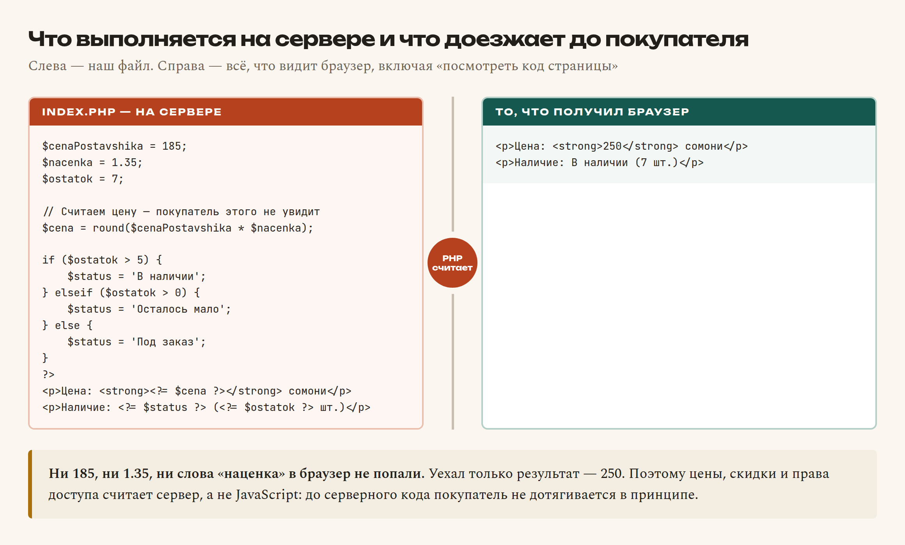
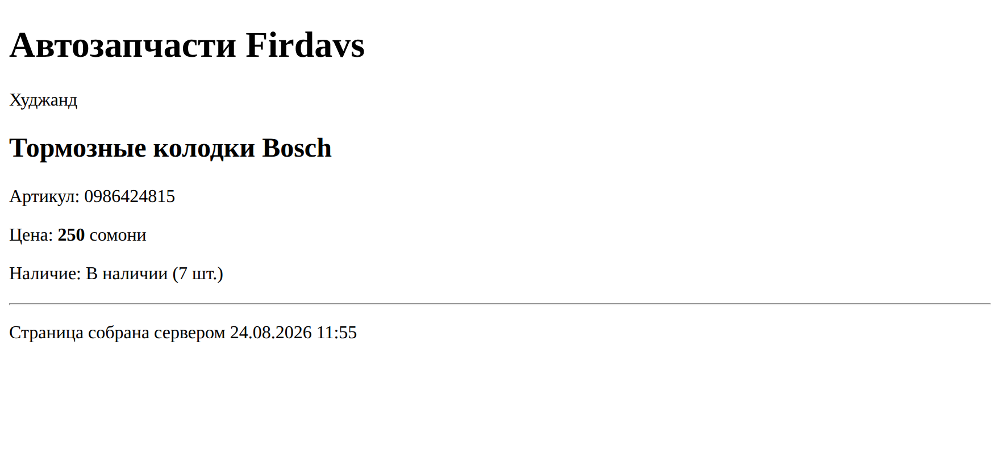

# Глава 19. Что делает PHP и первый скрипт

> **Часть V. PHP — сервер** · Глава 19 из 60
> [← Глава 18](18-praktika-poisk-korzina.md) · [Глава 20 →](20-php-peremennye.md)

## 🎯 Зачем эта глава

Мы переходим из торгового зала в подсобку.

До сих пор весь код выполнялся **у покупателя** — в его браузере. Теперь мы уходим
на **сервер**, и это меняет очень многое:

- покупатель больше не видит наш код;
- покупатель не может его изменить;
- зато мы получаем доступ к базе данных, файлам и чужим сервисам.

Именно здесь считаются деньги, проверяются пароли и решается, кого пускать в админку.

В этой главе установим PHP, запустим первый скрипт и — главное — **на практике
почувствуем разницу** между тем, что выполняется в браузере, и тем, что на сервере.

## 📖 Ставим PHP

### **Что нужно**

Для работы понадобятся три вещи, но ставятся они одним махом:

| Что | Зачем |
|---|---|
| **PHP** | Выполняет наш серверный код |
| **MySQL** | База данных. Понадобится с главы 26 |
| **Веб-сервер** | Принимает запросы из браузера |

### **Как поставить**

| Система | Что ставить | Откуда |
|---|---|---|
| Windows | **OpenServer** или **XAMPP** | `ospanel.io` / `apachefriends.org` |
| macOS | **XAMPP** или через Homebrew | `apachefriends.org` |
| Linux | Через пакетный менеджер | `sudo apt install php mysql-server` |

Ставится как обычная программа. После установки запускаете панель управления
и нажимаете «Старт».

### **Проверяем**

Откройте терминал и наберите:

```bash
php -v
```

Должно ответить что-то вроде:

```
PHP 8.3.14 (cli) (built: Nov 21 2024)
```

Если пишет «команда не найдена» — PHP установился, но система не знает, где его
искать. На Windows это лечится добавлением пути к PHP в переменную `PATH`;
в панели OpenServer есть готовая кнопка «Добавить в PATH».

**Версия PHP 8 или выше.** Седьмая ещё работает, но многое из книги в ней
недоступно.

## 📖 Первый скрипт

### **Создаём файл**

В папке проекта создайте `index.php`. Обратите внимание на расширение:
не `.html`, а **`.php`**.

```php
<?php
echo 'Привет! Это работает на сервере.';
```

### **Запускаем**

У PHP есть встроенный сервер — его достаточно для учёбы. В терминале, находясь
в папке проекта:

```bash
php -S localhost:8000
```

Ответит примерно так:

```
PHP 8.3.14 Development Server (http://localhost:8000) started
```

Теперь откройте в браузере `http://localhost:8000`.

⚠️ **Терминал не закрывайте.** Пока команда работает, работает и сервер.
Закроете — сайт перестанет открываться. Остановить сервер: **Ctrl+C**.

### **Что важно в адресе**

Смотрите на адресную строку. Раньше было:

```
file:///Users/firdavs/projects/moi-magazin/index.html
```

Теперь:

```
http://localhost:8000
```

Это принципиальная разница:

| | `file://` | `http://localhost` |
|---|---|---|
| Кто открывает файл | Браузер, напрямую с диска | **Сервер** обрабатывает и отдаёт результат |
| PHP выполняется | **Нет.** Покажет исходный код | Да |
| Это «настоящий сайт» | Нет | Да, только пока локальный |

**PHP-файл, открытый двойным щелчком, не работает.** Обязательно через сервер.
Это первое, обо что спотыкаются все новички.

## 📖 Как PHP уживается с HTML

### **Теги `<?php` и `?>`**

```php
<h1>Каталог</h1>

<?php
    $tovar = 'Тормозные колодки';
    echo $tovar;
?>

<p>Обычный HTML снова.</p>
```

Всё между `<?php` и `?>` — код PHP. Всё снаружи — обычный HTML, который отдаётся
как есть.

⚠️ **Если в файле только PHP-код, закрывающий `?>` не ставят.** Это не каприз:
случайный пробел или перенос строки после `?>` попадёт в ответ и может сломать
заголовки или загрузку файлов. Ошибку эту ищут долго и мучительно.

### **Короткая запись для вывода**

```php
<h1><?php echo $nazvanie; ?></h1>
<h1><?= $nazvanie ?></h1>
```

`<?=` — то же самое, что `<?php echo`. В шаблонах пишут именно так: короче
и читается лучше.

### **Смешивать можно**

```php
<?php
$tovary = ['Колодки', 'Фильтр', 'Свечи'];
?>

<ul>
<?php foreach ($tovary as $tovar): ?>
    <li><?= $tovar ?></li>
<?php endforeach; ?>
</ul>
```

Получится список из трёх пунктов. Разберём эту конструкцию подробно в главе 22 —
пока просто посмотрите, что HTML и PHP спокойно переплетаются.

Обратите внимание на непривычную запись `foreach (...):` … `endforeach;`
вместо фигурных скобок. В шаблонах она удобнее: сразу видно, что чем закрывается,
когда между ними двадцать строк разметки.

## 📖 Главное отличие от JavaScript

Вот тот момент, ради которого стоило начинать с JavaScript. Сравните.

**JavaScript** выполняется **после** того, как страница пришла в браузер.
Покупатель может открыть F12 и увидеть весь код.

**PHP** выполняется **до** того, как страница отправится. Покупатель получает
только **результат**.

### **Убедитесь сами**

Создайте `test.php`:

```php
<?php
$sekretnayaNacenka = 1.35;
$cenaPostavshika = 185;
$cenaDlyaPokupatelya = $cenaPostavshika * $sekretnayaNacenka;
?>

<h1>Тормозные колодки</h1>
<p>Цена: <?= round($cenaDlyaPokupatelya) ?> сомони</p>
```

Откройте через сервер, потом нажмите правую кнопку → «Посмотреть код страницы».

Вы увидите:

```html
<h1>Тормозные колодки</h1>
<p>Цена: 250 сомони</p>
```

**И всё.** Ни наценки, ни цены поставщика, ни самой формулы. Покупатель видит
только итог.

Если бы тот же расчёт был на JavaScript, покупатель узнал бы и закупочную цену,
и размер наценки — и, возможно, пошёл бы к поставщику напрямую.

**Вот зачем нужен сервер.** Не «чтобы было сложнее», а чтобы прятать то,
что не должно быть видно.



## 📖 Правила синтаксиса

Несколько вещей, которые отличаются от JavaScript. Перечислю сразу, чтобы
не спотыкаться.

### **Точка с запятой обязательна**

```php
echo 'Привет';
$cena = 250;
```

В JavaScript её часто можно опустить. **В PHP — нет.** Забыли — синтаксическая
ошибка и белый экран.

### **Переменные с долларом**

```php
$cena = 250;
$nazvanie = 'Колодки';
```

Всегда `$`. Забыть его — самая частая опечатка при переходе с JavaScript.

### **Склейка строк — точкой, а не плюсом**

```php
$text = 'Цена: ' . $cena . ' сомони';
```

⚠️ В JavaScript было `+`. **В PHP `+` — это только сложение чисел.**
Для склейки строк — **точка**.

Перепутаете — получите неожиданный результат или предупреждение.

### **Подстановка в двойных кавычках**

```php
$nazvanie = 'Колодки';

echo "Товар: $nazvanie";      // Товар: Колодки
echo 'Товар: $nazvanie';      // Товар: $nazvanie
```

**Двойные кавычки подставляют переменные, одинарные — нет.**

Это не мелочь, а важное отличие от JavaScript, где кавычки равноправны.

Для сложных случаев переменную берут в фигурные скобки:

```php
echo "Цена: {$tovar['cena']} сомони";
```

**Практический совет:** используйте одинарные кавычки по умолчанию и двойные —
когда нужна подстановка. Так сразу видно, где происходит вставка значений.

### **Комментарии**

```php
// однострочный
# тоже однострочный, но так почти не пишут
/* многострочный
   комментарий */
```

## 📖 Как читать ошибки PHP

Ошибки — не беда, а подсказка. Но их нужно **видеть**.

### **Включите показ ошибок**

Для учёбы добавьте в начало файла:

```php
<?php
ini_set('display_errors', 1);
error_reporting(E_ALL);
```

⚠️ **На боевом сайте так делать нельзя.** Текст ошибки может выдать пути на диске,
имена таблиц и другие внутренности. Там ошибки пишут в лог, а посетителю показывают
вежливое сообщение (глава 56).

### **Как читать ошибку**

```
Parse error: syntax error, unexpected token ";" in /var/www/index.php on line 12
```

Разбирается механически:

| Часть | Что говорит |
|---|---|
| `Parse error` | **Тип**: синтаксическая ошибка |
| `unexpected token ";"` | **Что не так**: точка с запятой не на месте |
| `/var/www/index.php` | **В каком файле** |
| `on line 12` | **В какой строке** |

⚠️ **Важная тонкость:** PHP часто указывает на строку, **где заметил** проблему,
а не где она возникла. Забытая точка с запятой в строке 11 покажется ошибкой
в строке 12.

**Правило: увидели ошибку в строке N — проверьте и строку N−1.**

### **Типы ошибок**

| Тип | Что означает | Пример |
|---|---|---|
| **Parse error** | Синтаксис. Файл вообще не запустился | Забыли `;` или скобку |
| **Fatal error** | Выполнение остановилось | Вызвали несуществующую функцию |
| **Warning** | Что-то не так, но работаем дальше | Файл не найден |
| **Notice / Deprecated** | Мелкие замечания | Обращение к несуществующему ключу |

**Белый экран без текста** — почти всегда Parse error при выключенном показе
ошибок. Включите — и увидите причину.

## 💻 Первая осмысленная страница

```php
<?php
ini_set('display_errors', 1);
error_reporting(E_ALL);

// Данные о магазине
$nazvanieMagazina = 'Автозапчасти Firdavs';
$gorod = 'Худжанд';

// Данные о товаре
$tovar = 'Тормозные колодки Bosch';
$artikul = '0986424815';
$cenaPostavshika = 185;
$nacenka = 1.35;
$ostatok = 7;

// Считаем цену — покупатель этого не увидит
$cena = round($cenaPostavshika * $nacenka);

// Определяем статус
if ($ostatok > 5) {
    $status = 'В наличии';
} elseif ($ostatok > 0) {
    $status = 'Осталось мало';
} else {
    $status = 'Под заказ';
}

// Текущая дата — её знает только сервер
$data = date('d.m.Y H:i');
?>
<!DOCTYPE html>
<html lang="ru">
<head>
    <meta charset="UTF-8">
    <title><?= $tovar ?> — <?= $nazvanieMagazina ?></title>
</head>
<body>
    <h1><?= $nazvanieMagazina ?></h1>
    <p><?= $gorod ?></p>

    <h2><?= $tovar ?></h2>
    <p>Артикул: <?= $artikul ?></p>
    <p>Цена: <strong><?= $cena ?></strong> сомони</p>
    <p>Наличие: <?= $status ?> (<?= $ostatok ?> шт.)</p>

    <hr>
    <p>Страница собрана сервером <?= $data ?></p>
</body>
</html>
```

**Обратите внимание на дату.** Она берётся с сервера — браузер её не вычислял.
Обновите страницу: время изменится. Значит, страница **собирается заново
при каждом запросе**.

В этом ключевое отличие от статичного HTML-файла, который просто лежит на диске.

## 🖥 На экране



Цена 250 сомони. А в исходном коде страницы, который получил браузер, нет ни числа
185, ни коэффициента 1.35 — только результат.

## 🔤 Разбор по словам

| Запись | Как читается | Что делает |
|---|---|---|
| `<?php` | | Начало кода PHP |
| `?>` | | Конец. **В чистом PHP-файле не ставится** |
| `<?= $x ?>` | | Короткая запись `<?php echo $x; ?>` |
| `echo` | «эхо» | Вывести на страницу |
| `$cena` | | Переменная. **Доллар обязателен** |
| `.` | точка | **Склейка строк** (в JS был `+`) |
| `;` | | Конец команды. **Обязательна** |
| `'текст'` | | Строка **без** подстановки переменных |
| `"текст $x"` | | Строка **с** подстановкой |
| `round()` | | Округлить |
| `date('d.m.Y')` | | Текущая дата сервера |
| `elseif` | | «Иначе если». В PHP пишется слитно |
| `php -S localhost:8000` | | Запустить встроенный сервер |
| `localhost` | | Ваш собственный компьютер |

## ⚠️ Грабли

**Открыть `.php` двойным щелчком.** Браузер покажет исходник. Только через сервер.

**Забыть `$`.** `cena = 250` — PHP решит, что это константа, и выдаст ошибку.

**Склеить строки плюсом.** `'Цена: ' + $cena` — в PHP это попытка сложения.

**Забыть точку с запятой.** Parse error, обычно с указанием на следующую строку.

**Оставить `?>` в конце файла.** Пробел после него попадёт в вывод. В файлах
с одним PHP закрывающий тег не ставят.

**Белый экран.** Включите `display_errors` — увидите причину.

**Закрыть терминал с запущенным сервером.** Сервер остановится, сайт перестанет
открываться.

**Русские буквы превратились в кракозябры.** Проверьте `<meta charset="UTF-8">`
и что сам файл сохранён в UTF-8.

## 🏋️ Задачи

**Задача 19.1.** Поставьте PHP, проверьте `php -v`, запустите встроенный сервер
и откройте страницу в браузере.

**Задача 19.2.** Сделайте страницу товара из примера. Замените товар на свой.

**Задача 19.3.** Что выведет каждая строка?

```php
<?php
$a = 5;
$b = '5';
echo $a + $b;
echo 'Цена: ' . $a;
echo "Цена: $a";
echo 'Цена: $a';
```

**Задача 19.4.** Найдите три ошибки:

```php
<?php
cena = 250
echo "Цена: " + cena;
```

**Задача 19.5.** Сделайте страницу, которая показывает разное приветствие
в зависимости от времени суток: до 12 — «Доброе утро», до 18 — «Добрый день»,
позже — «Добрый вечер». Подсказка: `date('H')` даёт текущий час.

**Задача 19.6.** Посчитайте на сервере цену со скидкой: если товаров больше трёх,
скидка 10%. Выведите обе цены — исходную и итоговую.

**Задача 19.7.** Откройте «Посмотреть код страницы» на своей PHP-странице.
Найдите там формулу расчёта цены. Нашли? Объясните, почему нет.

**Задача 19.8.** Специально сломайте файл: уберите точку с запятой.
Что покажет браузер? Теперь включите `display_errors` и посмотрите снова.

**Задача 19.9.** Сделайте так, чтобы страница показывала, сколько дней осталось
до Нового года. Подсказка: `strtotime('2027-01-01')` и `time()`.

*Ответы — в [Приложении Г](../prilozheniya/G-otvety.md).*

## 🔗 В бою

Откройте `index.php` в корне этого репозитория. Первые строки будут вам знакомы:
подключение общих файлов, проверки, подготовка данных — и только потом HTML.

Это стандартная структура PHP-страницы: **сначала логика, потом разметка**.

Ещё обратите внимание: в боевом коде нет `ini_set('display_errors', 1)`.
Настройки показа ошибок вынесены в конфигурацию сервера — на рабочем сайте они
выключены, а ошибки пишутся в лог.

## 📌 Итог

- PHP выполняется **на сервере**, до отправки страницы. Покупатель видит только
  результат.
- Поэтому цены, наценки и доступы считает PHP, а не JavaScript.
- Расширение файла — **`.php`**, открывать только **через сервер**:
  `php -S localhost:8000`.
- `<?php ... ?>` — код, `<?= $x ?>` — короткий вывод.
- **`$` перед переменными обязателен**, **`;` в конце обязательна**.
- Склейка строк — **точка**, не плюс.
- Двойные кавычки подставляют переменные, одинарные — нет.
- В чистом PHP-файле **не ставьте `?>`** в конце.
- Ошибка в строке N — проверьте и строку N−1.
- Белый экран = Parse error при выключенном показе ошибок.

Дальше — переменные и типы PHP подробно.

[← Глава 18](18-praktika-poisk-korzina.md) · [Глава 20. Переменные и типы →](20-php-peremennye.md)
