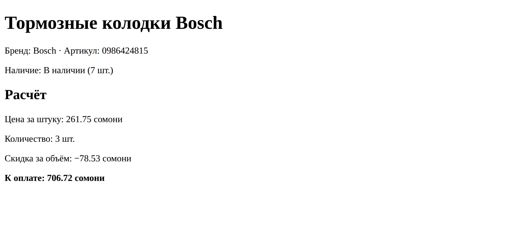

# Глава 20. Переменные, типы и вывод

> **Часть V. PHP — сервер** · Глава 20 из 60
> [← Глава 19](19-chto-delaet-php.md) · [Глава 21 →](21-php-usloviya-cikly.md)

## 🎯 Зачем эта глава

Хорошая новость: вы уже знаете эту тему. Переменные, строки, числа — всё это было
в главе 14, когда мы учили JavaScript.

Плохая новость: в PHP всё это записывается немного иначе, и на мелких отличиях
спотыкаются даже опытные люди, переключающиеся между языками.

Поэтому глава построена как **сравнение**: что одинаково, что различается
и где именно вас подстерегает ошибка.

## 📖 Переменные

### **Объявление**

```php
$cena = 250;
$nazvanie = 'Тормозные колодки';
$vNalichii = true;
```

| В JavaScript | В PHP |
|---|---|
| `const cena = 250;` | `$cena = 250;` |
| `let cena = 250;` | `$cena = 250;` |

**Никаких `let` и `const`.** Просто имя со знаком доллара.

⚠️ **Доллар обязателен всегда** — и при создании, и при использовании:

```php
$cena = 250;
echo $cena;         // ✅
echo cena;          // ❌ PHP решит, что это константа, и выдаст ошибку
```

### **Константы — если значение не должно меняться**

```php
define('NDS', 0.18);
const KURS_RUBLYA = 1.15;

echo NDS;               // без доллара!
```

Константы пишут ЗАГЛАВНЫМИ — это соглашение всех языков. Меняться они не могут.

### **Имена**

Правила те же, что в JavaScript: латиница, цифры, `_`, начинать не с цифры,
регистр важен.

А вот стиль другой:

```php
$cena_tovara = 250;         // так принято в PHP: snake_case
$cenaTovara = 250;          // тоже встречается, но реже
```

**В PHP принят `snake_case`** — слова через подчёркивание. В JavaScript был
`camelCase`.

Строгого запрета нет, но **придерживайтесь одного стиля в проекте**. Разнобой —
признак неаккуратности.

## 📖 Типы данных

```php
$cena = 250;                  // int — целое
$ves = 1.5;                   // float — дробное
$nazvanie = 'Колодки';        // string — строка
$estVNalichii = true;         // bool — да/нет
$skidka = null;               // null — ничего
$tovary = ['a', 'b'];         // array — массив (глава 22)
```

Проверить тип:

```php
var_dump($cena);        // int(250)
var_dump($nazvanie);    // string(7) "Колодки"
var_dump($estVNalichii);// bool(true)
```

**`var_dump()` — главный инструмент отладки в PHP.** Аналог `console.log`,
но показывает ещё и тип, и длину. Пользуйтесь им постоянно.

Для массивов удобнее:

```php
print_r($tovary);
```

Красивее всего — в `<pre>`, чтобы сохранились отступы:

```php
echo '<pre>';
print_r($tovary);
echo '</pre>';
```

## 📖 Строки: три отличия от JavaScript

### **Отличие 1: склейка точкой**

```php
$text = 'Цена: ' . $cena . ' сомони';
```

⚠️ В JavaScript был `+`. В PHP плюс — **только сложение чисел**.

```php
echo 'Цена: ' + 250;    // ❌ ошибка или неожиданный результат
echo 'Цена: ' . 250;    // ✅
```

Есть и сокращение для дописывания:

```php
$text = 'Товар: ';
$text .= 'Колодки';       // теперь 'Товар: Колодки'
```

### **Отличие 2: кавычки не равноправны**

```php
$nazvanie = 'Колодки';

echo "Товар: $nazvanie";       // Товар: Колодки
echo 'Товар: $nazvanie';       // Товар: $nazvanie
```

| Кавычки | Подставляют переменные | Работают быстрее |
|---|---|---|
| Одинарные `'...'` | Нет | Да |
| Двойные `"..."` | **Да** | Чуть медленнее |

Для сложных выражений — фигурные скобки:

```php
echo "Цена: {$tovar['cena']} сомони";
echo "Итого: {$cena} сомони";
```

**Совет:** одинарные по умолчанию, двойные — когда нужна подстановка.
Так по кавычкам сразу видно, где происходит вставка.

### **Отличие 3: нет шаблонных строк с обратными кавычками**

Того, к чему вы привыкли в JavaScript, здесь нет:

```javascript
`Цена ${cena} сомони`     // так в JavaScript
```

```php
"Цена $cena сомони"       // так в PHP
```

⚠️ Обратные кавычки в PHP означают совсем другое — выполнение команды операционной
системы. Никогда их не используйте: это прямая дорога к взлому сервера.

### **Полезные функции для строк**

```php
strlen('Колодки');                   // длина в байтах
mb_strlen('Колодки');                // длина в символах — для русского нужна эта
mb_strtolower('BOSCH');              // bosch
mb_strtoupper('bosch');              // BOSCH
trim('  текст  ');                   // убрать пробелы по краям
str_replace('Bosch', 'BOSCH', $s);   // заменить
mb_substr($s, 0, 10);                // первые 10 символов
str_contains($s, 'фильтр');          // содержит ли (PHP 8+)
explode(',', 'a,b,c');               // разбить в массив
implode(', ', $massiv);              // склеить массив в строку
number_format(1234.5, 2, '.', ' ');  // 1 234.50
```

⚠️ **Обратите внимание на приставку `mb_`** — от *multibyte*, «многобайтовый».

Русская буква занимает **два байта**, английская — один. Обычная `strlen('Привет')`
вернёт 12, а не 6. `substr` может разрезать букву пополам и выдать мусор.

**Правило: для строк с русским текстом всегда берите функции с `mb_`.**
Это одна из тех вещей, о которых не пишут в учебниках, а потом полдня ищут причину
странного поведения.

## 📖 Числа

```php
$a = 10;
$b = 3;

echo $a + $b;      // 13
echo $a - $b;      // 7
echo $a * $b;      // 30
echo $a / $b;      // 3.3333333333333
echo $a % $b;      // 1  — остаток
echo $a ** 2;      // 100 — возведение в степень
echo intdiv($a, $b); // 3 — целочисленное деление
```

Полезные функции:

```php
round(3.7);           // 4
round(3.14159, 2);    // 3.14
floor(3.7);           // 3  — вниз
ceil(3.2);            // 4  — вверх
abs(-5);              // 5
max(3, 7, 2);         // 7
min(3, 7, 2);         // 2
rand(1, 100);         // случайное
number_format(1234567); // 1,234,567
```

### **Деньги — снова про целые числа**

Помните правило из главы 14? В PHP оно тоже действует:

```php
var_dump(0.1 + 0.2 === 0.3);   // false
```

**Храните деньги в дирамах, целыми числами.** 250 сомони = 25000 дирамов.
Делите на 100 только при показе.

## 📖 Приведение типов — главная ловушка PHP

Вот тема, на которой ловятся все.

PHP **очень свободно** обращается с типами. Иногда это удобно, иногда опасно.

```php
echo '5' + 3;         // 8   — строка стала числом
echo '5 сомони' + 3;  // 8   — с предупреждением
echo 5 . 3;           // 53  — числа стали строкой
```

### **Сравнение: `==` против `===`**

```php
var_dump(5 == '5');      // true  — сравнил, приведя типы
var_dump(5 === '5');     // false — разные типы

var_dump(0 == 'abc');    // false в PHP 8 (в PHP 7 было true!)
var_dump('' == null);    // true
var_dump('0' == false);  // true
```

⚠️ Эти сравнения — источник **реальных уязвимостей**. Классический пример:
проверка токена через `==`, где токен, начинающийся с `0e`, случайно совпадал
с другим.

**Правило без исключений: всегда `===` и `!==`.**

### **Явное превращение**

```php
$stroka = '250';

$chislo = (int) $stroka;        // 250
$drobnoe = (float) '3.14';      // 3.14
$text = (string) 250;           // '250'
$logika = (bool) 1;             // true

// Аккуратнее и понятнее:
$chislo = intval($stroka);
$drobnoe = floatval($stroka);
```

**Данные из формы всегда приходят строками.** `$_POST['kolichestvo']` — это
строка `'3'`, а не число. Перед арифметикой превращайте явно.

### **Что считается «пустым»**

```php
empty('');        // true
empty('0');       // true  ← внимание!
empty(0);         // true
empty([]);        // true
empty(null);      // true
empty('текст');   // false
```

⚠️ **`empty('0')` возвращает `true`.** Это ловушка: если человек ввёл в поле
цифру ноль, `empty()` решит, что поле не заполнено.

Для проверки «поле заполнено» надёжнее:

```php
if (isset($_POST['kol']) && $_POST['kol'] !== '') { ... }
```

| Функция | Что проверяет |
|---|---|
| `isset($x)` | Переменная **существует** и не `null` |
| `empty($x)` | Существует и «пустая» (см. ловушку выше) |
| `is_numeric($x)` | Является ли числом (в том числе строкой-числом) |
| `$x === null` | Строго ли `null` |

## 📖 Вывод

```php
echo 'Привет';
echo 'Цена: ', $cena, ' сомони';    // можно через запятую

print 'Привет';                     // почти то же самое

printf('Цена: %d сомони', $cena);   // с форматированием
echo number_format(1234.5, 2);      // 1,234.50
```

`echo` — основной способ. `printf` пригодится для форматирования чисел.

### **Экранирование при выводе — обязательная привычка**

Помните XSS из главы 16? В PHP та же опасность:

```php
$imya = $_POST['imya'];          // а вдруг там <script>...
echo $imya;                       // ❌ опасно
echo htmlspecialchars($imya);     // ✅ безопасно
```

`htmlspecialchars()` превращает `<` в `&lt;`, `>` в `&gt;`, кавычки — в их коды.
Опасный код показывается как текст и не выполняется.

**Правило: любое значение, пришедшее извне, выводится через `htmlspecialchars()`.**
Извне — это форма, база данных, чужой API, адресная строка. То есть почти всё.

Многие пишут короткую обёртку:

```php
function e(string $text): string {
    return htmlspecialchars($text, ENT_QUOTES, 'UTF-8');
}

echo e($imya);
```

Подробно — в главе 36, но привычку заводите сейчас.

## 💻 Собираем страницу товара

```php
<?php
ini_set('display_errors', 1);
error_reporting(E_ALL);

function e(string $text): string {
    return htmlspecialchars($text, ENT_QUOTES, 'UTF-8');
}

// Данные (потом придут из базы)
$tovar = 'Тормозные колодки Bosch';
$artikul = '0986424815';
$brend = 'Bosch';

// Деньги — в дирамах, целыми
$cena_postavshika_diram = 18500;
$nacenka_procent = 35;
$dostavka_diram = 1200;

$ostatok = 7;
$kolichestvo = 3;

// Считаем
$cena_diram = (int) round($cena_postavshika_diram * (1 + $nacenka_procent / 100));
$cena_diram += $dostavka_diram;
$itogo_diram = $cena_diram * $kolichestvo;

// Скидка от трёх штук
$skidka_diram = 0;
if ($kolichestvo >= 3) {
    $skidka_diram = (int) round($itogo_diram * 0.10);
    $itogo_diram -= $skidka_diram;
}

// Для показа — переводим в сомони
function somoni(int $diram): string {
    return number_format($diram / 100, 2, '.', ' ');
}

$status = $ostatok > 5 ? 'В наличии' : ($ostatok > 0 ? 'Осталось мало' : 'Под заказ');
?>
<!DOCTYPE html>
<html lang="ru">
<head>
    <meta charset="UTF-8">
    <title><?= e($tovar) ?></title>
</head>
<body>
    <h1><?= e($tovar) ?></h1>
    <p>Бренд: <?= e($brend) ?> · Артикул: <?= e($artikul) ?></p>
    <p>Наличие: <?= $status ?> (<?= $ostatok ?> шт.)</p>

    <h2>Расчёт</h2>
    <p>Цена за штуку: <?= somoni($cena_diram) ?> сомони</p>
    <p>Количество: <?= $kolichestvo ?> шт.</p>
    <?php if ($skidka_diram > 0): ?>
        <p>Скидка за объём: −<?= somoni($skidka_diram) ?> сомони</p>
    <?php endif; ?>
    <p><strong>К оплате: <?= somoni($itogo_diram) ?> сомони</strong></p>
</body>
</html>
```

Обратите внимание на три вещи:

**Деньги в дирамах.** Все расчёты целыми числами, перевод в сомони только
при выводе.

**`function somoni(int $diram): string`** — здесь указаны **типы**: на входе целое,
на выходе строка. PHP проверит и сообщит, если передадут не то. Необязательно,
но очень полезно — ошибки находятся сразу.

**Всё выводится через `e()`.** Даже там, где данные пока свои. Привычка.

## 🖥 На экране



## 🔤 Разбор по словам

| PHP | JavaScript | Что делает |
|---|---|---|
| `$cena = 250;` | `let cena = 250;` | Переменная |
| `.` | `+` | **Склейка строк** |
| `.=` | `+=` | Дописать к строке |
| `"текст $x"` | `` `текст ${x}` `` | Подстановка |
| `echo` | `console.log` (примерно) | Вывести |
| `var_dump()` | `console.log` | Показать значение **и тип** |
| `print_r()` | — | Показать массив читаемо |
| `===` | `===` | Строгое сравнение. **Всегда так** |
| `(int) $x` | `Number(x)` | В число |
| `mb_strlen()` | `.length` | Длина **с учётом русских букв** |
| `htmlspecialchars()` | — | **Экранировать перед выводом** |
| `isset()` | `!== undefined` | Существует ли |
| `empty()` | — | Пустая ли. Осторожно с `'0'` |
| `number_format()` | `toLocaleString` | Красиво вывести число |

## ⚠️ Грабли

**Забыть `$`.** Самая частая опечатка при переходе с JavaScript.

**Склеить строки плюсом.** В PHP это сложение.

**`strlen` на русском тексте.** Вернёт байты, а не буквы. Нужен `mb_strlen`.

**Использовать `==`.** Источник настоящих уязвимостей. Только `===`.

**`empty('0')` считает ноль пустым.** Для форм используйте `isset` плюс
сравнение с `''`.

**Не экранировать вывод.** Дыра XSS. `htmlspecialchars` для всего внешнего.

**Ждать, что данные из формы придут числами.** Всегда строки. Превращайте явно.

**Деньги в дробях.** Дирамы, целые числа.

## 🏋️ Задачи

**Задача 20.1.** Что выведет каждая строка? Ответьте, потом проверьте:

```php
<?php
$a = 5;
$b = '5';
var_dump($a == $b);
var_dump($a === $b);
echo $a + $b;
echo $a . $b;
echo "Значение: $a";
echo 'Значение: $a';
```

**Задача 20.2.** Найдите четыре ошибки:

```php
<?php
cena = 250;
$nazvanie = 'Колодки'
echo "Товар: " + $nazvanie
echo 'Цена: $cena';
```

**Задача 20.3.** Напишите функцию `somoni($diram)`, которая переводит дирамы
в сомони с двумя знаками после точки и пробелом между тысячами.

**Задача 20.4.** Посчитайте: цена поставщика 4300 рублей, курс 1.15 сомони
за рубль, наценка 40%, доставка 80 сомони. Какая итоговая цена? Считайте
в дирамах.

**Задача 20.5.** Проверьте разницу:

```php
<?php
$s = 'Колодки';
echo strlen($s);
echo mb_strlen($s);
```

Почему числа разные? Объясните своими словами.

**Задача 20.6.** Что вернёт `empty()` для каждого значения: `''`, `'0'`, `0`,
`'текст'`, `[]`, `null`, `false`, `'false'`? Проверьте все восемь.

**Задача 20.7.** Напишите функцию `sklonenie($n, $odin, $dva, $mnogo)`,
которая возвращает правильное слово: 1 товар, 2 товара, 5 товаров.

Подсказка: смотрите на остаток от деления на 10 и на 100.

**Задача 20.8.** Проверьте экранирование. Присвойте переменной
`'<script>alert(1)</script>'` и выведите двумя способами: через `echo`
и через `htmlspecialchars`. Посмотрите исходный код страницы. В чём разница?

**Задача 20.9.** Сделайте страницу «прайс-лист» из пяти товаров, где цена
считается из закупочной с наценкой. Все деньги — целыми числами.

*Ответы — в [Приложении Г](../prilozheniya/4-G-otvety.md).*

## 🔗 В бою

Откройте `includes/` в этом репозитории и поищите вызовы `htmlspecialchars`.
Найдёте их всюду, где что-то выводится.

Ещё найдите работу с ценами — увидите то же правило: расчёты в целых числах,
форматирование только при показе.

И одна деталь, важная именно для нашего проекта: цены приходят от поставщика
в рублях и пересчитываются в сомони по курсу с наценкой. Все промежуточные
вычисления идут в мелких единицах, иначе на тысяче товаров накопится расхождение
в несколько сомони — и бухгалтерия не сойдётся.

## 📌 Итог

- `$переменная` — доллар обязателен. Никаких `let` и `const`.
- Склейка строк — **точка**, не плюс.
- Двойные кавычки подставляют переменные, одинарные — нет.
- `var_dump()` показывает значение **и тип**. Главный инструмент отладки.
- Для русского текста — функции с приставкой **`mb_`**.
- **Только `===`.** `==` в PHP опаснее, чем в JavaScript.
- Данные из формы — **всегда строки**. Превращайте явно.
- `empty('0')` возвращает `true`. Помните об этом при проверке форм.
- **Экранируйте вывод** через `htmlspecialchars()`.
- Деньги — целыми числами в мелких единицах.
- В PHP принят `snake_case`.

Дальше — условия и циклы: та же логика, что в JavaScript, но с важными
шаблонными приёмами.

[← Глава 19](19-chto-delaet-php.md) · [Глава 21. Условия и циклы →](21-php-usloviya-cikly.md)
