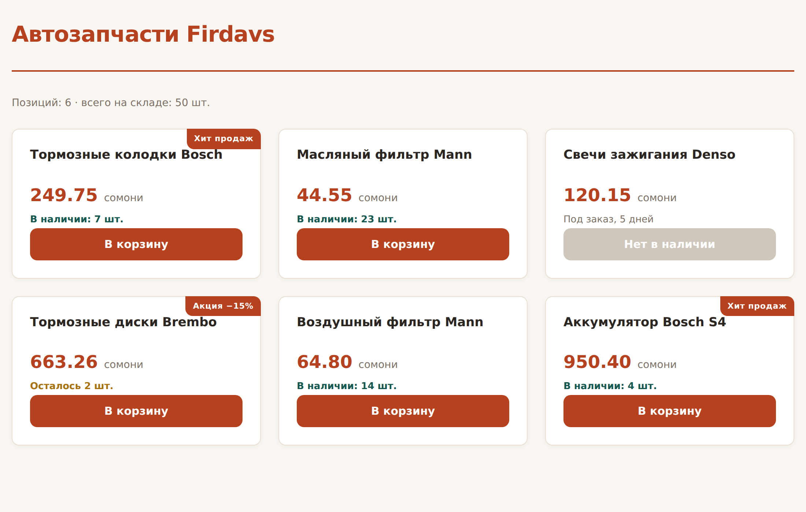

# Глава 21. Условия и циклы

> **Часть V. PHP — сервер** · Глава 21 из 60
> [← Глава 20](20-php-peremennye.md) · [Глава 22 →](22-php-massivy.md)

## 🎯 Зачем эта глава

Логика в PHP устроена так же, как в JavaScript: `if`, `else`, `for`, `while`.
Вы это уже знаете.

Но есть два важных дополнения, ради которых стоит прочитать главу:

1. **Особая запись для шаблонов** — когда PHP переплетается с HTML.
2. **`switch` и `match`** — удобные конструкции для множественного выбора,
   которые в шаблонах магазина встречаются постоянно.

Плюс разберём, как **не превратить страницу в кашу** из тегов и кода.

## 📖 Условия

### **Основное**

```php
if ($ostatok > 0) {
    echo 'В наличии';
} elseif ($ostatok === 0 && $pod_zakaz) {
    echo 'Под заказ';
} else {
    echo 'Нет';
}
```

Единственное отличие от JavaScript: **`elseif` пишется слитно**.
`else if` раздельно тоже работает, но принято слитно.

### **Операторы**

```php
$a === $b      // строго равно
$a !== $b      // строго не равно
$a > $b        // больше
$a <= $b       // меньше или равно
$a && $b       // и
$a || $b       // или
!$a            // не
$a <=> $b      // «космический корабль»: -1, 0 или 1
```

`<=>` пригодится для сортировки в главе 22.

### **Короткие записи**

```php
// Тернарный — как в JavaScript
$status = $ostatok > 0 ? 'Есть' : 'Нет';

// Если пусто — взять запасное (PHP 7+)
$brend = $_GET['brend'] ?? 'Все';

// То же с присваиванием
$_SESSION['korzina'] ??= [];
```

**`??` — оператор «null coalescing»**, и он невероятно полезен.

```php
$stranica = $_GET['page'] ?? 1;
```

Читается: «взять `$_GET['page']`, а если его нет или он `null` — взять 1».

Без него пришлось бы писать:

```php
$stranica = isset($_GET['page']) ? $_GET['page'] : 1;
```

⚠️ Не путайте `??` с `?:`:

| Оператор | Срабатывает, когда слева |
|---|---|
| `??` | **не существует** или `null` |
| `?:` | «пусто» — `0`, `''`, `[]`, `false` тоже |

Для параметров из адресной строки берите `??` — иначе `page=0` неожиданно
превратится в единицу.

## 📖 Множественный выбор

### **`switch`**

```php
switch ($status) {
    case 'new':
        $podpis = 'Новый заказ';
        break;
    case 'paid':
        $podpis = 'Оплачен';
        break;
    case 'shipped':
    case 'delivering':
        $podpis = 'В пути';
        break;
    default:
        $podpis = 'Неизвестный статус';
}
```

⚠️ **`break` обязателен.** Без него выполнение «протечёт» в следующий `case`.
Иногда это нужно нарочно (как выше для `shipped` и `delivering`), но чаще
это забытый `break` и загадочная ошибка.

### **`match` — современная замена (PHP 8)**

```php
$podpis = match ($status) {
    'new' => 'Новый заказ',
    'paid' => 'Оплачен',
    'shipped', 'delivering' => 'В пути',
    'done' => 'Доставлен',
    default => 'Неизвестный статус',
};
```

Чем `match` лучше:

| | `switch` | `match` |
|---|---|---|
| `break` | Нужен | Не нужен |
| Сравнение | `==` (нестрогое!) | **`===` строгое** |
| Возвращает значение | Нет | **Да** |
| Забыли вариант | Молча пропустит | **Ошибка** |

**Берите `match`, если у вас PHP 8.** Он короче и безопаснее. Статусы заказов,
роли пользователей, типы доставки — всё это ложится на `match` идеально.

## 📖 Циклы

### **`for` и `while` — как в JavaScript**

```php
for ($i = 1; $i <= 5; $i++) {
    echo "Страница $i ";
}

$ostatok = 3;
while ($ostatok > 0) {
    echo "Продали, осталось " . (--$ostatok) . "\n";
}
```

### **`foreach` — главный цикл PHP**

```php
$brendy = ['Bosch', 'Mann', 'Denso'];

foreach ($brendy as $brend) {
    echo $brend;
}
```

С ключами:

```php
$ceny = ['kolodki' => 250, 'filtr' => 45];

foreach ($ceny as $kod => $cena) {
    echo "$kod: $cena сомони\n";
}
```

`foreach` — аналог `for...of` из JavaScript, но умеет ещё и ключи.
**В работе с массивами используется в 90% случаев.**

Подробно — в следующей главе, там же и про массивы.

### **`break` и `continue`**

```php
foreach ($tovary as $t) {
    if ($t['ostatok'] === 0) continue;   // пропустить
    if ($t['cena'] > 1000) break;        // выйти совсем
    echo $t['nazvanie'];
}
```

## 📖 Шаблонный синтаксис — важная тема

Вот то, ради чего написана эта глава.

### **Проблема**

Когда PHP смешивается с HTML, обычные фигурные скобки читаются плохо:

```php
<?php if ($ostatok > 0) { ?>
    <p class="est">В наличии</p>
    <button>Купить</button>
<?php } else { ?>
    <p class="net">Под заказ</p>
<?php } ?>
```

Между `{` и `}` двадцать строк разметки, и уже непонятно, что чему принадлежит.
Одинокая `}` в начале строки среди HTML выглядит как мусор.

### **Решение: альтернативный синтаксис**

```php
<?php if ($ostatok > 0): ?>
    <p class="est">В наличии</p>
    <button>Купить</button>
<?php else: ?>
    <p class="net">Под заказ</p>
<?php endif; ?>
```

Вместо `{` пишется `:`, вместо `}` — **осмысленное слово**: `endif`, `endforeach`,
`endfor`, `endwhile`, `endswitch`.

Сразу видно, **что именно** закрывается — особенно когда конструкций несколько
подряд.

### **Полный набор**

```php
<?php if ($x): ?>      ... <?php endif; ?>
<?php foreach ($a as $b): ?> ... <?php endforeach; ?>
<?php for ($i=0; $i<5; $i++): ?> ... <?php endfor; ?>
<?php while ($x): ?>   ... <?php endwhile; ?>
```

**Правило, принятое почти везде:**

- В **логике** (расчёты, обработка данных) — обычные фигурные скобки.
- В **шаблоне** (где вперемешку с HTML) — двоеточие и `endif`.

## 📖 Как не превратить страницу в кашу

Ещё одно правило, важнее синтаксиса.

### **Плохо: логика вперемешку с разметкой**

```php
<div class="katalog">
<?php
foreach ($tovary as $t) {
    $cena = $t['zakup'] * 1.35;
    if ($t['ostatok'] > 0) {
        $cena = $cena * 0.95;
    }
    echo '<article><h3>' . $t['nazvanie'] . '</h3>';
    echo '<p>' . round($cena) . ' сомони</p></article>';
}
?>
</div>
```

Читать это тяжело: расчёты, условия и разметка перемешаны, HTML спрятан
внутри строк.

### **Хорошо: сначала данные, потом вывод**

```php
<?php
// 1. ЛОГИКА — считаем всё заранее
foreach ($tovary as &$t) {
    $t['cena'] = (int) round($t['zakup'] * 1.35);
    if ($t['ostatok'] > 0) {
        $t['cena'] = (int) round($t['cena'] * 0.95);
    }
}
unset($t);   // обязательно после цикла со ссылкой
?>

<!-- 2. ВЫВОД — только показываем готовое -->
<div class="katalog">
    <?php foreach ($tovary as $t): ?>
        <article class="tovar">
            <h3><?= e($t['nazvanie']) ?></h3>
            <p class="cena"><?= $t['cena'] ?> сомони</p>
        </article>
    <?php endforeach; ?>
</div>
```

Разница огромная:

- **Сверху** — вся логика, видна целиком;
- **Снизу** — чистая разметка, читается как HTML;
- Верстальщик может править низ, не боясь сломать расчёты.

**Это правило распространяется на весь бэкенд.** Оно называется «отделение
логики от представления», и на нём построены все шаблонизаторы и фреймворки.

⚠️ Про `&$t` в примере: амперсанд означает «работать с оригиналом, а не с копией»,
иначе изменения потеряются. А `unset($t)` после цикла обязателен — без него
переменная остаётся ссылкой на последний элемент, и следующий цикл его затрёт.
Это классическая ловушка PHP; в главе 22 разберём подробнее и покажем, как
обойтись без ссылок вовсе.

## 💻 Каталог со статусами

```php
<?php
ini_set('display_errors', 1);
error_reporting(E_ALL);

function e(string $t): string {
    return htmlspecialchars($t, ENT_QUOTES, 'UTF-8');
}

// --- Данные ---
$tovary = [
    [
        'nazvanie' => 'Тормозные колодки Bosch',
        'zakup' => 18500,
        'ostatok' => 7,
        'status' => 'hit',
    ],
    [
        'nazvanie' => 'Масляный фильтр Mann',
        'zakup' => 3300,
        'ostatok' => 23,
        'status' => 'obychny',
    ],
    [
        'nazvanie' => 'Свечи зажигания Denso',
        'zakup' => 8900,
        'ostatok' => 0,
        'status' => 'obychny',
    ],
    [
        'nazvanie' => 'Тормозные диски Brembo',
        'zakup' => 57800,
        'ostatok' => 2,
        'status' => 'akciya',
    ],
    [
        'nazvanie' => 'Воздушный фильтр Mann',
        'zakup' => 4800,
        'ostatok' => 14,
        'status' => 'obychny',
    ],
    [
        'nazvanie' => 'Аккумулятор Bosch S4',
        'zakup' => 70400,
        'ostatok' => 4,
        'status' => 'hit',
    ],
];

// --- Логика: считаем цены и статусы ---
$nacenka = 1.35;
$gotovye = [];

foreach ($tovary as $t) {
    $cena_diram = (int) round($t['zakup'] * $nacenka);

    // Акционным — минус 15%
    if ($t['status'] === 'akciya') {
        $cena_diram = (int) round($cena_diram * 0.85);
    }

    // Подпись наличия
    if ($t['ostatok'] === 0) {
        $nalichie = 'Под заказ, 5 дней';
        $klass_nalichiya = 'nety';
    } elseif ($t['ostatok'] <= 3) {
        $nalichie = "Осталось {$t['ostatok']} шт.";
        $klass_nalichiya = 'malo';
    } else {
        $nalichie = "В наличии: {$t['ostatok']} шт.";
        $klass_nalichiya = '';
    }

    // Метка — match вместо трёх if
    $metka = match ($t['status']) {
        'hit'    => 'Хит продаж',
        'akciya' => 'Акция −15%',
        default  => '',
    };

    $gotovye[] = [
        'nazvanie'  => $t['nazvanie'],
        'cena'      => number_format($cena_diram / 100, 2, '.', ' '),
        'nalichie'  => $nalichie,
        'klass'     => $klass_nalichiya,
        'metka'     => $metka,
        'mozhno_kupit' => $t['ostatok'] > 0,
    ];
}

$vsego_shtuk = 0;
foreach ($tovary as $t) {
    $vsego_shtuk += $t['ostatok'];
}
?>
<!DOCTYPE html>
<html lang="ru">
<head>
    <meta charset="UTF-8">
    <title>Каталог</title>
    <link rel="stylesheet" href="style.css">
</head>
<body>
<div class="container">
    <header>
        <div class="logo">Автозапчасти Firdavs</div>
    </header>

    <main>
        <p class="schetchik">
            Позиций: <?= count($gotovye) ?> · всего на складе: <?= $vsego_shtuk ?> шт.
        </p>

        <div class="katalog">
            <?php foreach ($gotovye as $t): ?>
                <article class="tovar">
                    <?php if ($t['metka'] !== ''): ?>
                        <span class="metka"><?= e($t['metka']) ?></span>
                    <?php endif; ?>

                    <h3><?= e($t['nazvanie']) ?></h3>
                    <p class="cena"><?= $t['cena'] ?> <span>сомони</span></p>
                    <p class="nalichie <?= $t['klass'] ?>"><?= e($t['nalichie']) ?></p>

                    <?php if ($t['mozhno_kupit']): ?>
                        <button>В корзину</button>
                    <?php else: ?>
                        <button disabled>Нет в наличии</button>
                    <?php endif; ?>
                </article>
            <?php endforeach; ?>
        </div>
    </main>
</div>
</body>
</html>
```

Обратите внимание на структуру: **сверху сплошная логика, снизу чистая разметка**.
Ни одного `echo` с HTML внутри.

## 🖥 На экране



Метки «Хит продаж» и «Акция», разные подписи наличия, неактивная кнопка
у отсутствующего товара — всё решено на сервере.

Откройте исходный код страницы: там только готовый HTML. Ни закупочных цен,
ни коэффициента наценки, ни логики скидок.

## 🔤 Разбор по словам

| Запись | Что делает |
|---|---|
| `elseif` | «Иначе если». **Слитно** |
| `??` | Взять запасное, если не существует или `null` |
| `?:` | Взять запасное, если «пусто» (включая 0 и '') |
| `<=>` | Сравнение для сортировки: −1, 0, 1 |
| `switch` / `case` / `break` | Множественный выбор. **`break` обязателен** |
| `match` | Современная замена `switch`. Строгое сравнение, возвращает значение |
| `foreach ($a as $v)` | Перебрать значения |
| `foreach ($a as $k => $v)` | Перебрать ключи и значения |
| `<?php if (): ?> ... <?php endif; ?>` | **Шаблонный синтаксис** |
| `count($massiv)` | Сколько элементов |
| `&$t` | Ссылка: работать с оригиналом |
| `unset($t)` | Удалить переменную. **Обязательно после цикла со ссылкой** |

## ⚠️ Грабли

**Забыть `break` в `switch`.** Выполнение протечёт в следующий вариант.
Берите `match`, там этой проблемы нет.

**`switch` сравнивает нестрого.** `switch (0)` совпадёт с `case 'abc'` в старых
версиях. `match` строгий.

**Путать `??` и `?:`.** `$page = $_GET['page'] ?: 1` превратит `page=0` в 1.

**Смешивать логику и разметку.** Сначала посчитайте всё, потом выводите.

**Забыть `unset` после `foreach` со ссылкой.** Одна из самых коварных ошибок PHP:
последний элемент массива непредсказуемо меняется.

**Писать HTML внутри `echo`.** Кавычки внутри кавычек, экранирование, нечитаемо.
Выходите из PHP и пишите разметку как разметку.

## 🏋️ Задачи

**Задача 21.1.** Перепишите на `match`:

```php
if ($rol === 'admin') $podpis = 'Администратор';
elseif ($rol === 'manager') $podpis = 'Менеджер';
elseif ($rol === 'seller') $podpis = 'Продавец';
else $podpis = 'Покупатель';
```

**Задача 21.2.** Что выведет? Объясните почему:

```php
<?php
$page = 0;
echo $page ?? 5;
echo "\n";
echo $page ?: 5;
```

**Задача 21.3.** Напишите функцию, которая по статусу заказа возвращает и подпись,
и цвет: `new` — «Новый», серый; `paid` — «Оплачен», синий; `shipped` — «Отправлен»,
жёлтый; `done` — «Доставлен», зелёный; `cancelled` — «Отменён», красный.

**Задача 21.4.** Перепишите в шаблонном синтаксисе:

```php
<?php if ($user) { ?>
    <p>Привет, <?= $user ?></p>
<?php } else { ?>
    <a href="/login">Войти</a>
<?php } ?>
```

**Задача 21.5.** Сделайте пагинацию: выведите ссылки на страницы с 1 по 10,
причём текущая страница — жирным без ссылки.

**Задача 21.6.** Циклом выведите таблицу умножения от 1 до 9 настоящей
HTML-таблицей.

**Задача 21.7.** Найдите ошибку:

```php
<?php
switch ($status) {
    case 'new':
        echo 'Новый';
    case 'paid':
        echo 'Оплачен';
}
```

**Задача 21.8.** Сделайте каталог из примера, добавьте седьмой товар со статусом
`akciya` и убедитесь, что метка и скидка применились сами.

**Задача 21.9.** Добавьте вывод: сколько товаров в наличии, сколько под заказ,
на какую сумму весь склад.

*Ответы — в [Приложении Г](../prilozheniya/4-G-otvety.md).*

## 🔗 В бою

Откройте `pages/` или `admin/` в этом репозитории и посмотрите на любой шаблон.
Увидите ровно эту структуру: наверху логика, ниже разметка с `<?php foreach: ?>`
и `<?php endforeach; ?>`.

Найдите обработку статусов заказа — там как раз `match` или `switch`
с человеческими подписями. Статусы в базе хранятся короткими кодами
(`new`, `paid`, `shipped`), а покупателю показываются по-русски.

Так делают всегда: **в базе — код, на экране — перевод**. Иначе при смене
формулировки пришлось бы обновлять все записи в базе.

## 📌 Итог

- `if`, `elseif`, `else` — как в JavaScript, но `elseif` слитно.
- `??` — «если не существует или null». Для параметров из адреса — только он.
- **`match`** лучше `switch`: строгое сравнение, не нужен `break`, возвращает
  значение.
- `foreach` — главный цикл PHP. Умеет ключи: `as $k => $v`.
- **В шаблонах пишите `if (): ... endif;`** вместо фигурных скобок.
- **Сначала логика, потом разметка.** Не смешивайте.
- Не пишите HTML внутри `echo`.
- После `foreach` со ссылкой `&$t` обязателен `unset($t)`.

Дальше — массивы: как хранить каталог и что с ним можно делать.

[← Глава 20](20-php-peremennye.md) · [Глава 22. Массивы →](22-php-massivy.md)
