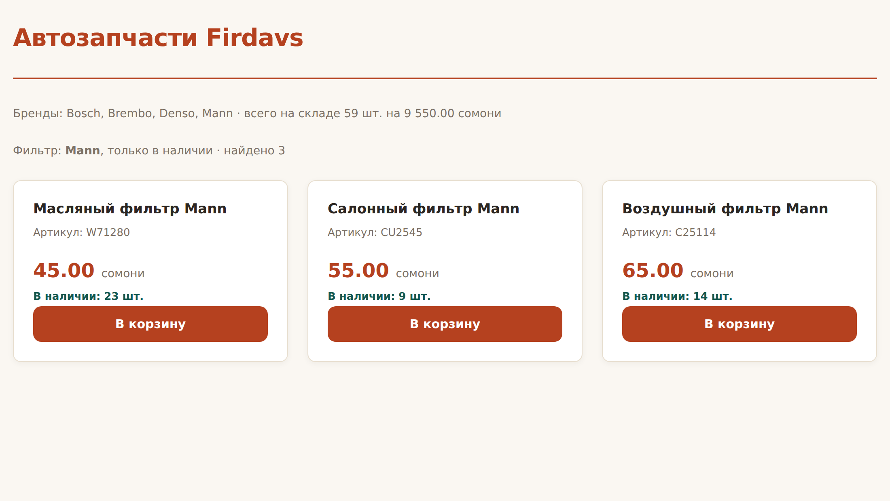

# Глава 22. Массивы

> **Часть V. PHP — сервер** · Глава 22 из 60
> [← Глава 21](21-php-usloviya-cikly.md) · [Глава 23 →](23-php-funkcii-include.md)

## 🎯 Зачем эта глава

Массив — самая используемая вещь в PHP. Каталог товаров, строки из базы данных,
данные формы, настройки, результат запроса к чужому API — всё это массивы.

В PHP массивы устроены иначе, чем в JavaScript, и это отличие принципиальное:
**в PHP массив и объект — одно и то же**. Того разделения на `[...]` и `{...}`,
к которому вы привыкли, здесь нет.

Разберёмся с этим, а заодно с двумя десятками функций, которые делают за вас
почти всю работу.

## 📖 Два вида массивов

### **Список — как в JavaScript**

```php
$brendy = ['Bosch', 'Mann', 'Denso'];

echo $brendy[0];        // Bosch
echo count($brendy);    // 3
```

Ключи здесь — числа, начиная с нуля. Знакомо.

### **Ассоциативный — вместо объектов**

```php
$tovar = [
    'nazvanie' => 'Тормозные колодки Bosch',
    'artikul'  => '0986424815',
    'cena'     => 25000,
    'ostatok'  => 7,
];

echo $tovar['nazvanie'];
echo $tovar['cena'];
```

Ключи — строки. **Это и есть замена объекта из JavaScript.**

| JavaScript | PHP |
|---|---|
| `const t = { cena: 250 }` | `$t = ['cena' => 250];` |
| `t.cena` | `$t['cena']` |
| `t['cena']` | `$t['cena']` |

⚠️ **Точка не работает.** В PHP точка — это склейка строк. Только квадратные
скобки и кавычки: `$tovar['cena']`.

Забыть кавычки — распространённая ошибка:

```php
echo $tovar[cena];      // ❌ PHP ищет константу cena
echo $tovar['cena'];    // ✅
```

### **Массив массивов — каталог**

```php
$tovary = [
    ['id' => 1, 'nazvanie' => 'Колодки Bosch', 'cena' => 25000, 'brend' => 'Bosch'],
    ['id' => 2, 'nazvanie' => 'Фильтр Mann',   'cena' => 4500,  'brend' => 'Mann'],
    ['id' => 3, 'nazvanie' => 'Свечи Denso',   'cena' => 12000, 'brend' => 'Denso'],
];

echo $tovary[0]['nazvanie'];    // Колодки Bosch
echo $tovary[2]['cena'];        // 12000
```

**Запомните эту структуру.** Ровно в таком виде вам придут данные из MySQL
в главе 32. Каждая строка таблицы — ассоциативный массив, все строки вместе —
список.

## 📖 Основные операции

```php
$korzina = [];

// Добавить
$korzina[] = 'Колодки';              // в конец
$korzina[] = 'Фильтр';
array_push($korzina, 'Свечи');       // то же самое

// По ключу
$tovar['cena'] = 26000;              // изменить или добавить

// Удалить
unset($korzina[1]);                  // удалить элемент
array_pop($korzina);                 // убрать последний
array_shift($korzina);               // убрать первый

// Проверить
count($korzina);                     // сколько элементов
empty($korzina);                     // пустой ли
in_array('Колодки', $korzina);       // есть ли значение
array_key_exists('cena', $tovar);    // есть ли ключ
isset($tovar['cena']);               // есть ли ключ и не null
```

⚠️ **Ловушка с `unset`.** После удаления элемента из середины ключи
**не перенумеровываются**:

```php
$a = ['x', 'y', 'z'];
unset($a[1]);
print_r($a);   // [0 => 'x', 2 => 'z']  — ключа 1 больше нет!
```

Если нужна сплошная нумерация, перестройте массив:

```php
$a = array_values($a);   // [0 => 'x', 1 => 'z']
```

Это важно, когда массив уходит в JSON: массив с «дырками» превратится
в объект, и JavaScript получит не то, что ждал.

## 📖 Перебор

```php
// Только значения
foreach ($tovary as $t) {
    echo $t['nazvanie'];
}

// Ключ и значение
foreach ($tovar as $kluch => $znachenie) {
    echo "$kluch: $znachenie\n";
}

// С номером по порядку
foreach ($tovary as $i => $t) {
    echo ($i + 1) . '. ' . $t['nazvanie'];
}
```

### **Про ссылки `&` — и почему лучше без них**

```php
foreach ($tovary as &$t) {
    $t['cena'] = $t['cena'] * 1.1;
}
unset($t);      // ОБЯЗАТЕЛЬНО
```

Без `&` вы меняете **копию**, и изменения теряются. Со ссылкой — оригинал.

Но `&` — источник знаменитой ловушки PHP. Если забыть `unset($t)`, переменная
остаётся ссылкой на последний элемент, и следующий `foreach` его затрёт.
Ошибка находится тяжело: массив «сам собой» портится.

**Способ надёжнее — собирать новый массив:**

```php
$s_cenami = [];
foreach ($tovary as $t) {
    $t['cena'] = (int) round($t['cena'] * 1.1);
    $s_cenami[] = $t;
}
```

Или через `array_map` (см. ниже). Ссылки нужны редко — обходитесь без них,
пока не появится настоящая причина.

## 📖 Функции, которые делают работу за вас

В PHP их несколько сотен, но реально нужны примерно двадцать.

### **Фильтрация и преобразование**

```php
// Отобрать подходящие
$v_nalichii = array_filter($tovary, fn($t) => $t['ostatok'] > 0);

// Превратить каждый
$nazvaniya = array_map(fn($t) => $t['nazvanie'], $tovary);

// Свести к одному значению
$summa = array_reduce($tovary, fn($itog, $t) => $itog + $t['cena'], 0);
```

Знакомо? Это те же `filter`, `map`, `reduce` из главы 15 — только записываются иначе.

| JavaScript | PHP |
|---|---|
| `arr.filter(fn)` | `array_filter($arr, fn)` |
| `arr.map(fn)` | `array_map(fn, $arr)` ⚠️ порядок другой! |
| `arr.reduce(fn, 0)` | `array_reduce($arr, fn, 0)` |

⚠️ **У `array_map` функция идёт первой**, а у `array_filter` — второй.
Досадная непоследовательность языка, о которой нужно просто помнить.

`fn($t) => ...` — короткая стрелочная функция (PHP 7.4+). Полная запись:

```php
array_filter($tovary, function ($t) {
    return $t['ostatok'] > 0;
});
```

⚠️ **`array_filter` сохраняет ключи.** После фильтрации в массиве могут остаться
дырки: `[0 => ..., 3 => ..., 5 => ...]`. Если это мешает — `array_values()`.

### **Работа с ключами и значениями**

```php
array_keys($tovar);                       // все ключи
array_values($tovar);                     // все значения
array_column($tovary, 'nazvanie');        // колонка из массива массивов
array_column($tovary, 'nazvanie', 'id');  // колонка с ключом по id
array_combine($kluchi, $znacheniya);      // собрать массив из двух
```

**`array_column` — незаменимая вещь** для работы с данными из базы:

```php
// Все названия одной строкой
$nazvaniya = array_column($tovary, 'nazvanie');

// Быстрый поиск по id: превращаем список в справочник
$po_id = array_column($tovary, null, 'id');
echo $po_id[3]['nazvanie'];    // мгновенно, без перебора
```

### **Сортировка**

```php
sort($massiv);          // по значениям, ключи теряются
rsort($massiv);         // по убыванию
asort($massiv);         // по значениям, ключи сохраняются
ksort($massiv);         // по ключам

// По полю — самое нужное
usort($tovary, fn($a, $b) => $a['cena'] <=> $b['cena']);          // дешёвые первыми
usort($tovary, fn($a, $b) => $b['cena'] <=> $a['cena']);          // дорогие первыми
usort($tovary, fn($a, $b) => strcmp($a['nazvanie'], $b['nazvanie'])); // по названию
```

Вот и пригодился оператор `<=>` из прошлой главы: он возвращает −1, 0 или 1 —
ровно то, что нужно сортировке.

⚠️ **`usort` меняет исходный массив**, а не возвращает новый. Нужна копия —
сделайте её заранее.

### **Объединение и части**

```php
array_merge($a, $b);            // склеить два массива
array_slice($tovary, 0, 20);    // первые 20 — пагинация!
array_unique($brendy);          // убрать повторы
array_search('Bosch', $brendy); // найти ключ по значению
in_array('Bosch', $brendy);     // есть ли такое значение
array_sum($ceny);               // сумма
array_reverse($tovary);         // перевернуть
```

**`array_slice` — это постраничный вывод:**

```php
$na_stranice = 20;
$stranica = 2;
$kusok = array_slice($tovary, ($stranica - 1) * $na_stranice, $na_stranice);
```

## 📖 Массивы и формы

Забегая вперёд в главу 24: **данные из формы приходят массивом**.

```php
$_GET['brend']       // ?brend=bosch
$_POST['name']       // из формы методом POST
$_SESSION['korzina'] // корзина в сессии
```

Это обычные ассоциативные массивы. Всё, что вы выучили, к ним применимо.

Одна тонкость: форма умеет присылать сразу массив значений:

```html
<input type="checkbox" name="brendy[]" value="bosch">
<input type="checkbox" name="brendy[]" value="mann">
```

```php
$vybrannye = $_POST['brendy'] ?? [];   // массив отмеченных
```

Квадратные скобки в `name` — вот что превращает поля в массив.

## 💻 Каталог с фильтрами и сортировкой

```php
<?php
ini_set('display_errors', 1);
error_reporting(E_ALL);

function e(string $t): string {
    return htmlspecialchars($t, ENT_QUOTES, 'UTF-8');
}
function somoni(int $diram): string {
    return number_format($diram / 100, 2, '.', ' ');
}

// --- Каталог: так же придут данные из базы ---
$tovary = [
    ['id'=>1,'nazvanie'=>'Тормозные колодки Bosch','artikul'=>'0986424815','cena'=>25000,'ostatok'=>7, 'brend'=>'Bosch'],
    ['id'=>2,'nazvanie'=>'Масляный фильтр Mann',   'artikul'=>'W71280',    'cena'=>4500, 'ostatok'=>23,'brend'=>'Mann'],
    ['id'=>3,'nazvanie'=>'Свечи зажигания Denso',  'artikul'=>'IK20',      'cena'=>12000,'ostatok'=>0, 'brend'=>'Denso'],
    ['id'=>4,'nazvanie'=>'Тормозные диски Brembo', 'artikul'=>'09.9468.11','cena'=>78000,'ostatok'=>2, 'brend'=>'Brembo'],
    ['id'=>5,'nazvanie'=>'Воздушный фильтр Mann',  'artikul'=>'C25114',    'cena'=>6500, 'ostatok'=>14,'brend'=>'Mann'],
    ['id'=>6,'nazvanie'=>'Аккумулятор Bosch S4',   'artikul'=>'0092S40050','cena'=>95000,'ostatok'=>4, 'brend'=>'Bosch'],
    ['id'=>7,'nazvanie'=>'Салонный фильтр Mann',   'artikul'=>'CU2545',    'cena'=>5500, 'ostatok'=>9, 'brend'=>'Mann'],
];

// --- Фильтры (пока задаём прямо здесь, в главе 24 возьмём из формы) ---
$filtr_brend = 'Mann';
$tolko_v_nalichii = true;
$sortirovka = 'cena_vozr';

// --- Обработка ---
$spisok = $tovary;

if ($filtr_brend !== '') {
    $spisok = array_filter($spisok, fn($t) => $t['brend'] === $filtr_brend);
}
if ($tolko_v_nalichii) {
    $spisok = array_filter($spisok, fn($t) => $t['ostatok'] > 0);
}

// после array_filter ключи с дырками — выравниваем
$spisok = array_values($spisok);

match ($sortirovka) {
    'cena_vozr' => usort($spisok, fn($a, $b) => $a['cena'] <=> $b['cena']),
    'cena_ubyv' => usort($spisok, fn($a, $b) => $b['cena'] <=> $a['cena']),
    'nazvanie'  => usort($spisok, fn($a, $b) => strcmp($a['nazvanie'], $b['nazvanie'])),
    default     => null,
};

// --- Сводка по всему каталогу ---
$vse_brendy = array_values(array_unique(array_column($tovary, 'brend')));
sort($vse_brendy);

$vsego_shtuk = array_sum(array_column($tovary, 'ostatok'));
$stoimost_sklada = array_reduce(
    $tovary,
    fn($itog, $t) => $itog + $t['cena'] * $t['ostatok'],
    0
);
?>
<!DOCTYPE html>
<html lang="ru">
<head>
    <meta charset="UTF-8">
    <title>Каталог</title>
    <link rel="stylesheet" href="style.css">
</head>
<body>
<div class="container">
    <header>
        <div class="logo">Автозапчасти Firdavs</div>
    </header>

    <main>
        <p class="schetchik">
            Бренды: <?= e(implode(', ', $vse_brendy)) ?> ·
            всего на складе <?= $vsego_shtuk ?> шт. на
            <?= somoni($stoimost_sklada) ?> сомони
        </p>

        <p class="schetchik">
            Фильтр: <strong><?= e($filtr_brend ?: 'все бренды') ?></strong>,
            <?= $tolko_v_nalichii ? 'только в наличии' : 'все' ?> ·
            найдено <?= count($spisok) ?>
        </p>

        <div class="katalog">
            <?php foreach ($spisok as $t): ?>
                <article class="tovar">
                    <h3><?= e($t['nazvanie']) ?></h3>
                    <p class="artikul">Артикул: <?= e($t['artikul']) ?></p>
                    <p class="cena"><?= somoni($t['cena']) ?> <span>сомони</span></p>
                    <p class="nalichie">В наличии: <?= $t['ostatok'] ?> шт.</p>
                    <button>В корзину</button>
                </article>
            <?php endforeach; ?>
        </div>
    </main>
</div>
</body>
</html>
```

## 🖥 На экране



Три фильтра Mann, отсортированы по возрастанию цены. Сводка сверху посчитана
функциями `array_column`, `array_sum` и `array_reduce` — без единого цикла.

## 🔤 Разбор по словам

| Функция | Что делает |
|---|---|
| `['a', 'b']` | Список |
| `['kluch' => 'znachenie']` | Ассоциативный массив (замена объекта) |
| `$t['cena']` | Обращение по ключу. **Кавычки обязательны** |
| `count()` | Сколько элементов |
| `$a[] = $x` | Добавить в конец |
| `unset($a[1])` | Удалить. **Ключи не перенумеруются** |
| `array_values()` | Перестроить ключи подряд |
| `array_keys()` | Все ключи |
| `array_column($a, 'pole')` | Вытащить колонку |
| `array_column($a, null, 'id')` | Превратить список в справочник по id |
| `array_filter($a, fn)` | Отобрать. **Сохраняет ключи** |
| `array_map(fn, $a)` | Превратить каждый. **Функция первым аргументом** |
| `array_reduce($a, fn, 0)` | Свести к одному значению |
| `array_sum()` | Сумма |
| `array_unique()` | Убрать повторы |
| `array_slice($a, $ot, $skolko)` | Кусок — **пагинация** |
| `array_merge($a, $b)` | Склеить |
| `in_array($v, $a)` | Есть ли значение |
| `usort($a, fn)` | Сортировка по своему правилу. **Меняет оригинал** |
| `implode(', ', $a)` | Массив → строка |
| `explode(',', $s)` | Строка → массив |
| `fn($x) => ...` | Короткая функция |

## ⚠️ Грабли

**Обращаться через точку.** `$tovar.cena` — это склейка строк. Нужны скобки.

**Забыть кавычки в ключе.** `$tovar[cena]` — PHP ищет константу.

**Ждать, что `unset` перенумерует ключи.** Не перенумерует. `array_values()`.

**Забыть `array_values` после `array_filter`.** Массив с дырками при выводе
в JSON превратится в объект, и JavaScript сломается.

**Перепутать порядок аргументов.** `array_map(fn, $a)`, но `array_filter($a, fn)`.

**Забыть `unset($t)` после `foreach` со ссылкой.** Массив портится.

**Считать, что `usort` вернёт новый массив.** Он меняет исходный
и возвращает `true`.

**Обращаться к несуществующему ключу.** В PHP 8 это Warning и `null`.
Проверяйте через `??`: `$t['cena'] ?? 0`.

## 🏋️ Задачи

**Задача 22.1.** Создайте массив из семи товаров. Выведите: все названия, общую
стоимость склада, список уникальных брендов.

**Задача 22.2.** Что выведет?

```php
<?php
$a = ['x', 'y', 'z'];
unset($a[1]);
print_r($a);
echo count($a);
print_r(array_values($a));
```

**Задача 22.3.** Отсортируйте товары по остатку — сначала те, которых больше всего.

**Задача 22.4.** Через `array_column` получите справочник «артикул → название»
и найдите товар по артикулу без перебора.

**Задача 22.5.** Сделайте пагинацию: разбейте каталог по 3 товара на страницу
и выведите вторую страницу.

**Задача 22.6.** Сгруппируйте товары по брендам: получите массив, где ключ —
бренд, а значение — список его товаров.

**Задача 22.7.** Найдите ошибки:

```php
<?php
$tovar = ['cena' => 250];
echo $tovar.cena;
echo $tovar[cena];
$spisok = array_map($tovary, fn($t) => $t['cena']);
```

**Задача 22.8.** Посчитайте средний чек: общая стоимость склада, делённая
на количество позиций. Округлите до целых сомони.

**Задача 22.9.** Напишите функцию `naiti_po_id($tovary, $id)`, которая возвращает
товар или `null`. Двумя способами: циклом и через `array_filter`.

**Задача 22.10.** Возьмите массив товаров и подготовьте из него данные
для выпадающего списка брендов с количеством: «Mann (3)», «Bosch (2)», «Denso (1)».

*Ответы — в [Приложении Г](../prilozheniya/G-otvety.md).*

## 🔗 В бою

Откройте любой файл в `includes/` этого репозитория, где обрабатываются товары.
Вы увидите массивы ровно такого вида — потому что именно так их отдаёт база данных.

Особенно посмотрите, как формируется прайс: `array_column` для выборки цен,
`array_filter` для отсева недоступных, `usort` для сортировки по цене.

Одна практическая деталь: в боевом коде перед `array_filter` часто идёт
проверка `if (empty($tovary)) return [];`. Это защита от «пустого» случая —
если поставщик не ответил и массив пуст, дальше идти незачем.

**Пустые данные — нормальная ситуация**, а не исключительная. Проверяйте их
всегда.

## 📌 Итог

- В PHP **массив заменяет и список, и объект**. Разделения нет.
- Обращение — **только `$t['kluch']`**, точка не работает, кавычки обязательны.
- **Массив ассоциативных массивов** — то, как приходят данные из базы.
- `array_filter` сохраняет ключи → нужен `array_values()`.
- `array_map(fn, $a)`, но `array_filter($a, fn)` — порядок разный.
- `array_column` превращает список в справочник — мгновенный поиск по id.
- `usort` + `<=>` — сортировка по любому полю. **Меняет оригинал.**
- `array_slice` — постраничный вывод.
- Ссылок `&$t` лучше избегать; если использовали — обязателен `unset`.
- Проверяйте существование ключа через `??`.

Дальше — функции и подключение файлов: как перестать копировать код.

[← Глава 21](21-php-usloviya-cikly.md) · [Глава 23. Функции, include и require →](23-php-funkcii-include.md)
