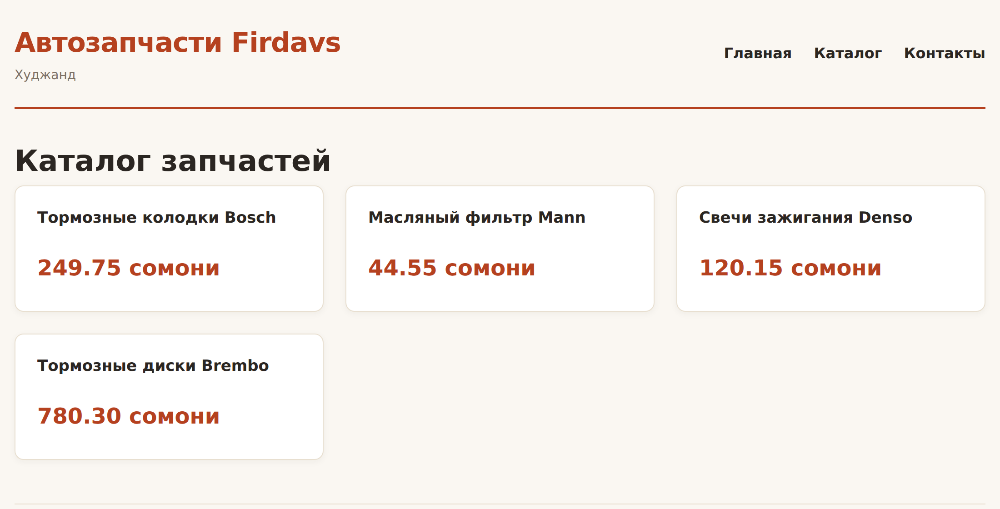

# Глава 23. Функции, include и require

> **Часть V. PHP — сервер** · Глава 23 из 60
> [← Глава 22](22-php-massivy.md) · [Глава 24 →](24-php-formy.md)

## 🎯 Зачем эта глава

У вас уже несколько страниц, и на каждой одно и то же: шапка, меню, подвал,
функция `e()`, функция `somoni()`.

Пока страниц три, копировать терпимо. Когда их станет тридцать, а меню нужно
будет поменять — вы поймёте, почему главный принцип программирования звучит так:

> **Не повторяйся.** Каждый кусок знания должен быть записан ровно в одном месте.

В этой главе научимся выносить общее: **функции** для повторяющейся логики
и **include** для повторяющейся разметки. К концу главы у вашего проекта появится
нормальная структура папок — та самая, что в боевом магазине.

## 📖 Функции

### **Основы — как в JavaScript**

```php
function pokazatCenu($cena) {
    return number_format($cena / 100, 2, '.', ' ') . ' сомони';
}

echo pokazatCenu(25000);    // 250.00 сомони
```

Всё знакомо: `function`, параметры, `return`.

### **Типы — то, чего не было в JavaScript**

```php
function somoni(int $diram): string {
    return number_format($diram / 100, 2, '.', ' ');
}
```

| Часть | Что означает |
|---|---|
| `int $diram` | На вход ожидается **целое число** |
| `: string` | На выходе будет **строка** |

Если передать не то, PHP сообщит об ошибке **сразу**, а не через десять строк
в непонятном месте.

**Указывайте типы всегда.** Это самая дешёвая защита от ошибок, какая бывает:
пишете на пять символов больше, а ловите целый класс проблем.

Доступные типы: `int`, `float`, `string`, `bool`, `array`, `?string`
(строка **или** null), `void` (ничего не возвращает).

```php
function nayti(array $tovary, int $id): ?array {
    foreach ($tovary as $t) {
        if ($t['id'] === $id) return $t;
    }
    return null;
}
```

`?array` означает «массив или ничего». Честное описание: функция может
не найти товар.

### **Значения по умолчанию**

```php
function dostavka(int $summa, string $gorod = 'Худжанд'): int {
    if ($gorod === 'Худжанд') return 0;
    return $summa > 50000 ? 0 : 5000;
}

echo dostavka(30000);              // 0
echo dostavka(30000, 'Душанбе');   // 5000
```

⚠️ Параметры со значением по умолчанию идут **последними**. Иначе их нельзя
пропустить.

### **Именованные аргументы (PHP 8)**

```php
function sozdat_tovar(
    string $nazvanie,
    int $cena,
    int $ostatok = 0,
    bool $aktivnyi = true,
    string $brend = ''
): array {
    return compact('nazvanie', 'cena', 'ostatok', 'aktivnyi', 'brend');
}

// Можно указывать только нужное, по именам
$t = sozdat_tovar(nazvanie: 'Колодки', cena: 25000, brend: 'Bosch');
```

Читается гораздо лучше, чем `sozdat_tovar('Колодки', 25000, 0, true, 'Bosch')` —
где попробуй угадай, что означает `true`.

### **Область видимости — важное отличие от JavaScript**

```php
$nacenka = 1.35;

function poschitat($cena) {
    return $cena * $nacenka;    // ❌ не работает!
}
```

⚠️ **Функция в PHP не видит внешние переменные.** Совсем. В JavaScript видела,
в PHP — нет.

Правильно — передать параметром:

```php
function poschitat(int $cena, float $nacenka): int {
    return (int) round($cena * $nacenka);
}
```

Есть слово `global`, которое даёт доступ к внешней переменной. **Не пользуйтесь им.**
Функция, зависящая от глобального состояния, ведёт себя непредсказуемо: работает
или нет в зависимости от того, что происходило раньше.

**Хорошая функция зависит только от своих параметров.** Такую легко проверить,
легко переиспользовать и легко понять.

### **Одна функция — одно дело**

```php
// ❌ Делает три вещи
function obrabotat_zakaz($dannye) {
    // проверяет
    // сохраняет в базу
    // отправляет письмо
}

// ✅ Три функции
function proverit_zakaz(array $d): array { ... }
function sohranit_zakaz(array $d): int { ... }
function otpravit_pismo(int $id): bool { ... }
```

Признак, что пора разделять: в названии функции просится «и».

## 📖 include и require — подключение файлов

### **Проблема**

Шапка сайта на десяти страницах. Меняем телефон — правим десять файлов.
Один забыли — на сайте два разных телефона.

### **Решение**

Выносим шапку в отдельный файл `includes/header.php` и подключаем:

```php
<?php require 'includes/header.php'; ?>

<h1>Каталог</h1>

<?php require 'includes/footer.php'; ?>
```

Теперь шапка в одном месте.

### **Четыре формы подключения**

| Что писать | Если файла нет |
|---|---|
| `include` | Предупреждение, работа **продолжается** |
| `require` | **Фатальная ошибка**, всё останавливается |
| `include_once` | То же, но не подключит повторно |
| `require_once` | То же, но не подключит повторно |

**Правило:**

- Файл **необходим** для работы (настройки, подключение к базе, функции) —
  **`require_once`**.
- Файл **желателен** (баннер, необязательный блок) — **`include`**.

`_once` защищает от двойного подключения. Если файл с функциями подключить дважды,
PHP выдаст «функция уже объявлена» и упадёт. С `require_once` этого не случится.

**На практике `require_once` покрывает почти все случаи.**

### **Пути — где ошибаются все**

```php
require 'includes/header.php';           // ⚠️ относительно чего?
require __DIR__ . '/includes/header.php'; // ✅ надёжно
```

Проблема относительных путей: они считаются от файла, который **запущен**,
а не от того, где написана строчка. Подключили файл из подпапки — и путь внутри
него сломался.

**`__DIR__`** — это папка, где лежит **текущий** файл. С ним путь всегда верный,
откуда бы файл ни подключили.

Ещё удобнее — задать корень проекта один раз:

```php
// includes/config.php
define('KOREN', __DIR__ . '/..');

// в любом файле
require_once KOREN . '/includes/functions.php';
```

## 📖 Наводим структуру

Вот как выглядит нормально организованный проект:

```
moi-magazin/
├── includes/
│   ├── config.php        настройки
│   ├── functions.php     общие функции
│   ├── header.php        шапка + меню
│   └── footer.php        подвал
├── assets/
│   ├── css/style.css
│   └── js/script.js
├── pages/
│   ├── catalog.php
│   ├── tovar.php
│   └── contacts.php
└── index.php
```

Знакомо? Так устроен и autodoc.tj, код которого лежит рядом с этой книгой.

### **`includes/config.php` — настройки**

```php
<?php
// Всё, что может понадобиться поменять, — здесь

define('SAIT_NAZVANIE', 'Автозапчасти Firdavs');
define('SAIT_GOROD', 'Худжанд');
define('SAIT_TELEFON', '+992 92 777 77 77');
define('SAIT_POCHTA', 'info@autodoc.tj');

define('NACENKA', 1.35);
define('DOSTAVKA_DIRAM', 1200);
define('BESPLATNO_OT_DIRAM', 100000);

define('KOREN', __DIR__ . '/..');
```

⚠️ **Пароли и ключи API в такой файл не пишут**, если проект лежит в git.
Их выносят в отдельный файл, который в репозиторий не попадает. Разберём
в главе 32.

### **`includes/functions.php` — общие функции**

```php
<?php

/** Экранирование для безопасного вывода. Короткое имя — потому что используется всюду. */
function e(?string $text): string {
    return htmlspecialchars((string) $text, ENT_QUOTES, 'UTF-8');
}

/** Дирамы в читаемые сомони. Деньги внутри системы всегда целые. */
function somoni(int $diram): string {
    return number_format($diram / 100, 2, '.', ' ');
}

/** Цена для покупателя из закупочной. */
function cena_prodazhi(int $zakup_diram): int {
    return (int) round($zakup_diram * NACENKA);
}

/** Доставка: бесплатно от определённой суммы. */
function cena_dostavki(int $summa_diram): int {
    return $summa_diram >= BESPLATNO_OT_DIRAM ? 0 : DOSTAVKA_DIRAM;
}

/** Правильное окончание: 1 товар, 2 товара, 5 товаров. */
function sklonenie(int $n, string $odin, string $dva, string $mnogo): string {
    $n = abs($n) % 100;
    if ($n >= 11 && $n <= 19) return $mnogo;
    $n = $n % 10;
    if ($n === 1) return $odin;
    if ($n >= 2 && $n <= 4) return $dva;
    return $mnogo;
}

/** Найти товар по id. Возвращает null, если не нашёлся. */
function nayti_tovar(array $tovary, int $id): ?array {
    foreach ($tovary as $t) {
        if ($t['id'] === $id) return $t;
    }
    return null;
}
```

### **`includes/header.php` — шапка**

```php
<!DOCTYPE html>
<html lang="ru">
<head>
    <meta charset="UTF-8">
    <meta name="viewport" content="width=device-width, initial-scale=1">
    <title><?= e($zagolovok ?? SAIT_NAZVANIE) ?></title>
    <link rel="stylesheet" href="/assets/css/style.css">
</head>
<body>
<div class="container">
    <header>
        <div>
            <div class="logo"><?= e(SAIT_NAZVANIE) ?></div>
            <div class="slogan"><?= e(SAIT_GOROD) ?></div>
        </div>
        <nav>
            <ul>
                <li><a href="/">Главная</a></li>
                <li><a href="/pages/catalog.php">Каталог</a></li>
                <li><a href="/pages/contacts.php">Контакты</a></li>
            </ul>
        </nav>
    </header>
    <main>
```

Обратите внимание на `$zagolovok ?? SAIT_NAZVANIE`: страница может задать свой
заголовок, а если не задала — возьмётся название сайта.

Приём простой, но именно так шаблон становится **гибким**: общий код один,
а отличия задаются переменными.

### **`includes/footer.php` — подвал**

```php
    </main>

    <footer>
        <p><?= e(SAIT_GOROD) ?> ·
           <a href="tel:<?= preg_replace('/\D/', '', SAIT_TELEFON) ?>"><?= e(SAIT_TELEFON) ?></a> ·
           <a href="mailto:<?= e(SAIT_POCHTA) ?>"><?= e(SAIT_POCHTA) ?></a></p>
        <p>&copy; <?= date('Y') ?> <?= e(SAIT_NAZVANIE) ?></p>
    </footer>
</div>
</body>
</html>
```

`date('Y')` подставит текущий год — не придётся править копирайт каждый январь.

### **Страница становится короткой**

```php
<?php
require_once __DIR__ . '/includes/config.php';
require_once __DIR__ . '/includes/functions.php';

$zagolovok = 'Каталог — ' . SAIT_NAZVANIE;
$tovary = [ /* ... */ ];

require __DIR__ . '/includes/header.php';
?>

<h1>Каталог запчастей</h1>

<div class="katalog">
    <?php foreach ($tovary as $t): ?>
        <article class="tovar">
            <h3><?= e($t['nazvanie']) ?></h3>
            <p class="cena"><?= somoni(cena_prodazhi($t['zakup'])) ?> сомони</p>
        </article>
    <?php endforeach; ?>
</div>

<?php require __DIR__ . '/includes/footer.php'; ?>
```

**Страница теперь про своё содержимое, а не про повторяющуюся обвязку.**
Хотите поменять меню — правите один файл. Добавить в шапку счётчик корзины —
тоже один файл, и он появится на всех страницах разом.

## 🖥 На экране



Шапка, подвал и все функции пришли из `includes/`. Сама страница —
двадцать строк.

## 🔤 Разбор по словам

| Запись | Что делает |
|---|---|
| `function имя(int $x): string` | Функция с **типами** входа и выхода |
| `?array` | Массив **или** null |
| `void` | Ничего не возвращает |
| `$gorod = 'Худжанд'` | Значение по умолчанию. Ставится **последним** |
| `imya: znachenie` при вызове | Именованный аргумент (PHP 8) |
| `require` | Подключить. Нет файла — **всё останавливается** |
| `include` | Подключить. Нет файла — предупреждение и дальше |
| `_once` | Не подключать повторно |
| `__DIR__` | Папка **текущего** файла |
| `define('IMYA', ...)` | Константа |
| `date('Y')` | Текущий год |
| `compact('a', 'b')` | Собрать массив из переменных |

## ⚠️ Грабли

**Ждать, что функция увидит внешнюю переменную.** Не увидит. Передавайте
параметром.

**Пользоваться `global`.** Функция становится непредсказуемой.

**Относительные пути в подключениях.** Работает, пока файл не подключили
из другой папки. Используйте `__DIR__`.

**Подключить файл с функциями дважды.** «Cannot redeclare function».
Лечится `require_once`.

**Вывести что-то до `header.php`.** Если в подключаемом файле окажется лишний
пробел или пустая строка до `<?php`, это уйдёт в вывод — и потом сломаются
перенаправления и заголовки. Именно поэтому в чистых PHP-файлах не ставят `?>`.

**Складывать все функции в один огромный файл.** Когда их станет двести,
разделите по смыслу: `functions_tovary.php`, `functions_zakazy.php`.

## 🏋️ Задачи

**Задача 23.1.** Создайте структуру папок из главы и разложите свой проект.

**Задача 23.2.** Вынесите в `functions.php` все функции, которые вы писали
в прошлых главах. Добавьте типы.

**Задача 23.3.** Сделайте так, чтобы каждая страница задавала свой `<title>`
через переменную `$zagolovok`.

**Задача 23.4.** Что произойдёт и почему?

```php
$nacenka = 1.35;
function cena($zakup) {
    return $zakup * $nacenka;
}
echo cena(1000);
```

**Задача 23.5.** Напишите функцию `menu_aktivnyi(string $put): string`,
которая возвращает класс `active`, если текущая страница совпадает
с переданной. Подсказка: `$_SERVER['PHP_SELF']`.

**Задача 23.6.** Добавьте в шапку счётчик товаров в каталоге. Убедитесь,
что он появился на всех страницах сразу.

**Задача 23.7.** Напишите функцию `obrezat(string $text, int $dlina = 100): string`,
которая укорачивает длинный текст и добавляет многоточие. Не разрезайте слово
посередине.

**Задача 23.8.** Найдите три ошибки:

```php
<?php
include 'includes/functions.php';
include 'includes/functions.php';

function skidka($cena, $procent = 10, $tip) {
    return $cena - $cena * $procent / 100;
}
```

**Задача 23.9.** Сделайте `includes/breadcrumbs.php` — «хлебные крошки»
(Главная → Каталог → Товар). Принимает массив ссылок, выводит цепочку.

*Ответы — в [Приложении Г](../prilozheniya/4-G-otvety.md).*

## 🔗 В бою

Откройте `includes/` в корне этого репозитория. Увидите ровно то, о чём глава:
общие функции, подключение к базе, настройки, шаблоны шапки и подвала.

Обратите внимание на две вещи:

**Файл с паролями отделён.** Настройки лежат в `config/`, а сами пароли —
в файле, который не попадает в git. Это жёсткое правило проекта: секреты
никогда не хранятся в репозитории.

**Функции разбиты по смыслу.** Не один `functions.php` на тысячу строк,
а отдельные файлы: работа с товарами, работа с продавцами, финансы.
Когда проект растёт, это единственный способ не утонуть.

## 📌 Итог

- **Не повторяйся.** Каждый кусок знания — в одном месте.
- Указывайте **типы** параметров и возврата. Дешёвая защита от ошибок.
- Функция **не видит внешние переменные**. Передавайте параметром.
- `global` не использовать.
- Одна функция — одно дело.
- **`require_once`** для необходимых файлов, `include` для необязательных.
- Пути через **`__DIR__`**, не относительные.
- Структура: `includes/` для общего, `pages/` для страниц, `assets/` для стилей.
- Шаблон гибок за счёт переменных: `$zagolovok ?? SAIT_NAZVANIE`.
- Не ставьте `?>` в конце PHP-файлов.

Дальше — формы: научимся принимать данные от покупателя.

[← Глава 22](22-php-massivy.md) · [Глава 24. Формы: GET и POST →](24-php-formy.md)
