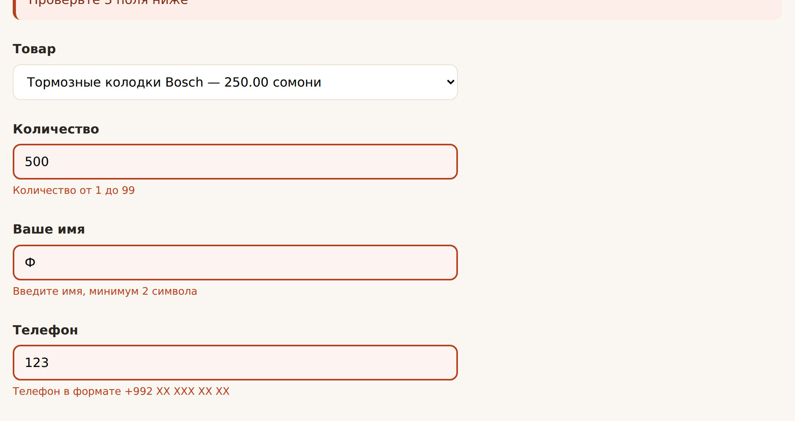
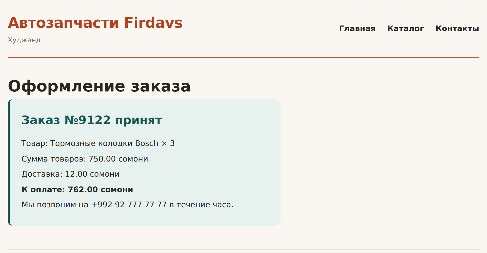

# Глава 24. Формы: GET и POST

> **Часть V. PHP — сервер** · Глава 24 из 60
> [← Глава 23](23-php-funkcii-include.md) · [Глава 25 →](25-praktika-katalog-php.md)

## 🎯 Зачем эта глава

В главе 7 вы сверстали формы, но они никуда не отправлялись — обработчика
не существовало.

Сегодня напишем его. Научимся принимать данные от человека, проверять их
и отвечать осмысленно.

И сразу — самое важное правило этой главы, которое стоит запомнить прежде
всего остального:

> **Никогда не доверяйте данным, пришедшим от пользователя.**

Не потому, что покупатели злые. А потому, что среди тысячи посетителей всегда
найдётся один, кто отправит не то, что вы ожидали, — случайно или нарочно.

## 📖 Как данные попадают в PHP

Помните `$_GET` и `$_POST` из прошлых глав? Это **массивы**, которые PHP заполняет
сам, ещё до того, как выполнится первая строчка вашего кода.

```php
$_GET      // данные из адресной строки
$_POST     // данные из формы, отправленной методом POST
$_REQUEST  // и то, и другое — не используйте, см. ниже
$_SERVER   // сведения о запросе: метод, адрес, браузер
$_FILES    // загруженные файлы
$_SESSION  // сессия (глава 38)
$_COOKIE   // куки
```

Такие массивы называются **суперглобальными**: они видны везде, в том числе
внутри функций (единственное исключение из правила прошлой главы).

⚠️ `$_REQUEST` объединяет GET, POST и COOKIE. Звучит удобно, но это дыра:
злоумышленник может подменить POST-параметр через адресную строку.
**Всегда указывайте источник явно.**

## 📖 GET — данные в адресе

### **Форма**

```html
<form action="/search.php" method="GET">
    <input type="search" name="q" value="">
    <select name="brend">
        <option value="">Все</option>
        <option value="bosch">Bosch</option>
    </select>
    <button type="submit">Найти</button>
</form>
```

После отправки адрес станет таким:

```
/search.php?q=kolodki&brend=bosch
```

### **Обработка**

```php
<?php
$zapros = $_GET['q'] ?? '';
$brend  = $_GET['brend'] ?? '';

echo 'Ищем: ' . e($zapros);
```

`??` обязателен: если параметра нет, обращение к нему выдаст предупреждение.

### **Когда GET**

| Подходит | Не подходит |
|---|---|
| Поиск | Пароли |
| Фильтры каталога | Оформление заказа |
| Пагинация | Что-либо, меняющее данные |
| Сортировка | Загрузка файлов |

**Признак GET:** ссылкой на результат можно поделиться, и повторное открытие
ничего не сломает.

## 📖 POST — данные внутри запроса

### **Форма**

```html
<form action="/order.php" method="POST">
    <input type="text" name="imya" required>
    <input type="tel" name="telefon" required>
    <input type="hidden" name="tovar_id" value="42">
    <button type="submit">Заказать</button>
</form>
```

### **Обработка**

```php
<?php
if ($_SERVER['REQUEST_METHOD'] !== 'POST') {
    http_response_code(405);
    exit('Метод не разрешён');
}

$imya = trim($_POST['imya'] ?? '');
$telefon = trim($_POST['telefon'] ?? '');
$tovar_id = (int) ($_POST['tovar_id'] ?? 0);
```

⚠️ **Проверка метода — обязательна.** Без неё страницу создания заказа можно
открыть простой ссылкой, и она отработает. Помните эту строчку из главы 2 —
теперь понятно, зачем она.

### **Когда POST**

Всё, что **меняет данные** или содержит личное: заказы, регистрация, вход,
отзывы, загрузка файлов.

## 📖 Правило «одна страница — и форма, и обработка»

Новички часто делают две страницы: форма в одной, обработка в другой.
Получается неудобно: при ошибке некуда вернуть введённые данные.

Правильный подход — **одна страница делает всё**:

```php
<?php
$oshibki = [];
$dannye = ['imya' => '', 'telefon' => '', 'kommentariy' => ''];
$uspeh = false;

if ($_SERVER['REQUEST_METHOD'] === 'POST') {
    // 1. Забираем
    $dannye['imya'] = trim($_POST['imya'] ?? '');
    $dannye['telefon'] = trim($_POST['telefon'] ?? '');
    $dannye['kommentariy'] = trim($_POST['kommentariy'] ?? '');

    // 2. Проверяем
    if (mb_strlen($dannye['imya']) < 2) {
        $oshibki['imya'] = 'Имя слишком короткое';
    }
    if (!preg_match('/^\+?[0-9\s\-()]{9,20}$/', $dannye['telefon'])) {
        $oshibki['telefon'] = 'Проверьте номер телефона';
    }

    // 3. Если всё хорошо — сохраняем
    if (empty($oshibki)) {
        // здесь будет запись в базу (глава 33)
        $uspeh = true;
    }
}
?>

<?php if ($uspeh): ?>
    <div class="uspeh">Заказ принят! Мы позвоним в течение часа.</div>
<?php else: ?>
    <form method="POST">
        <label for="imya">Ваше имя</label>
        <input type="text" id="imya" name="imya"
               value="<?= e($dannye['imya']) ?>"
               class="<?= isset($oshibki['imya']) ? 'oshibka' : '' ?>">
        <?php if (isset($oshibki['imya'])): ?>
            <span class="podskazka"><?= e($oshibki['imya']) ?></span>
        <?php endif; ?>

        <button type="submit">Заказать</button>
    </form>
<?php endif; ?>
```

Три вещи, которые здесь важны:

**`value="<?= e($dannye['imya']) ?>"`** — введённые данные возвращаются в поля.
Без этого человек, ошибившийся в телефоне, будет заполнять форму заново.
Мелочь, из-за которой бросают оформление заказа.

**Ошибки показываются у своего поля**, а не общим списком сверху.

**Форма отправляется сама на себя** — атрибут `action` не нужен.

## 📖 Проверка данных

### **Почему проверка в браузере не считается**

В главе 7 мы поставили `required` и `pattern`. Это удобно для человека —
и совершенно бесполезно для защиты.

Отключить проверку в браузере можно за десять секунд через F12. А можно вообще
не открывать браузер и отправить запрос напрямую:

```bash
curl -X POST http://site.tj/order.php -d "imya=&telefon=взлом"
```

**Проверка в браузере — удобство. Проверка на сервере — защита.**
Нужны обе, но полагаться можно только на вторую.

### **Типовые проверки**

```php
// Обязательное поле
if ($imya === '') {
    $oshibki['imya'] = 'Заполните имя';
}

// Длина — с mb_ для русского
if (mb_strlen($imya) < 2 || mb_strlen($imya) > 50) {
    $oshibki['imya'] = 'От 2 до 50 символов';
}

// Число в диапазоне
$kolichestvo = filter_input(INPUT_POST, 'kol', FILTER_VALIDATE_INT,
    ['options' => ['min_range' => 1, 'max_range' => 99]]);
if ($kolichestvo === false || $kolichestvo === null) {
    $oshibki['kol'] = 'Количество от 1 до 99';
}

// Почта
$pochta = filter_var($_POST['email'] ?? '', FILTER_VALIDATE_EMAIL);
if ($pochta === false) {
    $oshibki['email'] = 'Проверьте адрес почты';
}

// Выбор из списка — только допустимые значения
$dopustimye = ['samovyvoz', 'kurier', 'pochta'];
$dostavka = $_POST['dostavka'] ?? '';
if (!in_array($dostavka, $dopustimye, true)) {
    $oshibki['dostavka'] = 'Выберите способ доставки';
}
```

⚠️ **Последняя проверка особенно важна.** Выпадающий список в браузере
не гарантирует, что придёт одно из его значений — злоумышленник отправит что угодно.
**Всегда сверяйтесь со списком допустимых значений** и передавайте `true`
третьим аргументом `in_array` (строгое сравнение).

### **Очистка против проверки**

Два разных действия, которые часто путают:

| | Что делает | Пример |
|---|---|---|
| **Очистка** | Приводит данные в порядок | `trim()` — убрать пробелы |
| **Проверка** | Решает, годятся ли данные | «телефон должен быть из цифр» |

Сначала очистить, потом проверить. И **экранировать при выводе** —
это третье, отдельное действие.

**Запомните разделение:**

- пришло → **очистить** (`trim`, привести тип);
- перед сохранением → **проверить** (годится или нет);
- перед показом → **экранировать** (`htmlspecialchars`).

Три разных момента, три разных инструмента. Путаница между ними — источник
большинства уязвимостей.

## 📖 Redirect после POST

### **Проблема**

Человек оформил заказ, увидел «спасибо» и нажал F5. Браузер спросит «отправить
данные повторно?» — и создастся второй заказ.

### **Решение**

После успешной обработки — **перенаправить** на другую страницу:

```php
if (empty($oshibki)) {
    // сохранили заказ, получили номер
    $nomer = 1024;

    header('Location: /spasibo.php?zakaz=' . $nomer);
    exit;
}
```

⚠️ Два обязательных момента:

**`exit` после `header`.** Без него код продолжит выполняться.

**Ничего не выводить до `header`.** Ни одного символа, включая пробел
перед `<?php`. Иначе PHP скажет «headers already sent» — заголовки уже отправлены.
Это самая частая причина, по которой перенаправление «не работает».

Приём называется **PRG** — Post/Redirect/Get. Используется всегда, где есть формы.

## 📖 Загрузка файлов

Коротко, потому что тема важная:

```php
if (!empty($_FILES['foto']['name'])) {
    $fail = $_FILES['foto'];

    // 1. Проверить ошибки загрузки
    if ($fail['error'] !== UPLOAD_ERR_OK) {
        $oshibki['foto'] = 'Не удалось загрузить файл';
    }

    // 2. Проверить размер
    if ($fail['size'] > 2 * 1024 * 1024) {
        $oshibki['foto'] = 'Файл больше 2 МБ';
    }

    // 3. Проверить настоящий тип — НЕ по расширению!
    $tip = mime_content_type($fail['tmp_name']);
    if (!in_array($tip, ['image/jpeg', 'image/png', 'image/webp'], true)) {
        $oshibki['foto'] = 'Только JPG, PNG или WebP';
    }

    // 4. Своё имя файла, а не пришедшее
    if (empty($oshibki)) {
        $rasshirenie = match ($tip) {
            'image/jpeg' => 'jpg',
            'image/png'  => 'png',
            'image/webp' => 'webp',
        };
        $imya = bin2hex(random_bytes(16)) . '.' . $rasshirenie;
        move_uploaded_file($fail['tmp_name'], __DIR__ . '/uploads/' . $imya);
    }
}
```

⚠️ **Три правила загрузки файлов, нарушение которых приводит ко взлому:**

1. **Не верьте расширению.** Файл `virus.php.jpg` — не картинка. Проверяйте
   настоящий тип через `mime_content_type`.
2. **Не используйте имя, пришедшее от пользователя.** Оно может содержать
   `../../` и увести файл куда угодно. Генерируйте своё.
3. **Не храните загруженное там, где может выполниться PHP.** Иначе загруженный
   скрипт запустится на вашем сервере.

Не обязательно ставить форму `enctype="multipart/form-data"` — обязательно.
Без этого атрибута файл просто не придёт.

## 💻 Форма заказа целиком

```php
<?php
require_once __DIR__ . '/includes/config.php';
require_once __DIR__ . '/includes/functions.php';

$tovary = [
    1 => ['nazvanie' => 'Тормозные колодки Bosch', 'cena' => 25000],
    2 => ['nazvanie' => 'Масляный фильтр Mann',    'cena' => 4500],
    3 => ['nazvanie' => 'Свечи зажигания Denso',   'cena' => 12000],
];

$oshibki = [];
$uspeh = false;
$nomer_zakaza = null;

$dannye = [
    'tovar_id'    => 1,
    'kolichestvo' => 1,
    'imya'        => '',
    'telefon'     => '',
    'dostavka'    => 'samovyvoz',
    'kommentariy' => '',
];

if ($_SERVER['REQUEST_METHOD'] === 'POST') {

    // --- Очистка ---
    $dannye['tovar_id']    = (int) ($_POST['tovar_id'] ?? 0);
    $dannye['kolichestvo'] = (int) ($_POST['kolichestvo'] ?? 0);
    $dannye['imya']        = trim($_POST['imya'] ?? '');
    $dannye['telefon']     = trim($_POST['telefon'] ?? '');
    $dannye['dostavka']    = $_POST['dostavka'] ?? '';
    $dannye['kommentariy'] = trim($_POST['kommentariy'] ?? '');

    // --- Проверка ---
    if (!isset($tovary[$dannye['tovar_id']])) {
        $oshibki['tovar_id'] = 'Выберите товар';
    }
    if ($dannye['kolichestvo'] < 1 || $dannye['kolichestvo'] > 99) {
        $oshibki['kolichestvo'] = 'Количество от 1 до 99';
    }
    if (mb_strlen($dannye['imya']) < 2) {
        $oshibki['imya'] = 'Введите имя, минимум 2 символа';
    }
    if (!preg_match('/^\+?[0-9\s\-()]{9,20}$/', $dannye['telefon'])) {
        $oshibki['telefon'] = 'Телефон в формате +992 XX XXX XX XX';
    }
    if (!in_array($dannye['dostavka'], ['samovyvoz', 'kurier'], true)) {
        $oshibki['dostavka'] = 'Выберите способ получения';
    }
    if (mb_strlen($dannye['kommentariy']) > 500) {
        $oshibki['kommentariy'] = 'Комментарий слишком длинный';
    }

    // --- Сохранение ---
    if (empty($oshibki)) {
        // Цену берём ИЗ КАТАЛОГА, а не из формы.
        // Придёт из формы — покупатель поставит любую.
        $tovar = $tovary[$dannye['tovar_id']];
        $summa = $tovar['cena'] * $dannye['kolichestvo'];
        $dostavka_diram = $dannye['dostavka'] === 'kurier' ? cena_dostavki($summa) : 0;
        $itogo = $summa + $dostavka_diram;

        // Здесь будет запись в базу (глава 33)
        $nomer_zakaza = random_int(1000, 9999);
        $uspeh = true;
    }
}

$zagolovok = 'Оформление заказа';
require __DIR__ . '/includes/header.php';
?>

<h1>Оформление заказа</h1>

<?php if ($uspeh): ?>

    <div class="uspeh">
        <h2>Заказ №<?= $nomer_zakaza ?> принят</h2>
        <p>Товар: <?= e($tovar['nazvanie']) ?> × <?= $dannye['kolichestvo'] ?></p>
        <p>Сумма товаров: <?= somoni($summa) ?> сомони</p>
        <p>Доставка: <?= $dostavka_diram > 0 ? somoni($dostavka_diram) . ' сомони' : 'бесплатно' ?></p>
        <p><strong>К оплате: <?= somoni($itogo) ?> сомони</strong></p>
        <p>Мы позвоним на <?= e($dannye['telefon']) ?> в течение часа.</p>
    </div>

<?php else: ?>

    <?php if (!empty($oshibki)): ?>
        <div class="oshibka-obshaya">
            Проверьте <?= count($oshibki) ?>
            <?= sklonenie(count($oshibki), 'поле', 'поля', 'полей') ?> ниже
        </div>
    <?php endif; ?>

    <form method="POST" class="forma">

        <div class="pole">
            <label for="tovar_id">Товар</label>
            <select id="tovar_id" name="tovar_id">
                <?php foreach ($tovary as $id => $t): ?>
                    <option value="<?= $id ?>" <?= $dannye['tovar_id'] === $id ? 'selected' : '' ?>>
                        <?= e($t['nazvanie']) ?> — <?= somoni($t['cena']) ?> сомони
                    </option>
                <?php endforeach; ?>
            </select>
        </div>

        <div class="pole">
            <label for="kolichestvo">Количество</label>
            <input type="number" id="kolichestvo" name="kolichestvo" min="1" max="99"
                   value="<?= e((string) $dannye['kolichestvo']) ?>"
                   class="<?= isset($oshibki['kolichestvo']) ? 'plohoe' : '' ?>">
            <?php if (isset($oshibki['kolichestvo'])): ?>
                <span class="podskazka"><?= e($oshibki['kolichestvo']) ?></span>
            <?php endif; ?>
        </div>

        <div class="pole">
            <label for="imya">Ваше имя</label>
            <input type="text" id="imya" name="imya"
                   value="<?= e($dannye['imya']) ?>"
                   class="<?= isset($oshibki['imya']) ? 'plohoe' : '' ?>">
            <?php if (isset($oshibki['imya'])): ?>
                <span class="podskazka"><?= e($oshibki['imya']) ?></span>
            <?php endif; ?>
        </div>

        <div class="pole">
            <label for="telefon">Телефон</label>
            <input type="tel" id="telefon" name="telefon" placeholder="+992 92 777 77 77"
                   value="<?= e($dannye['telefon']) ?>"
                   class="<?= isset($oshibki['telefon']) ? 'plohoe' : '' ?>">
            <?php if (isset($oshibki['telefon'])): ?>
                <span class="podskazka"><?= e($oshibki['telefon']) ?></span>
            <?php endif; ?>
        </div>

        <div class="pole">
            <label>Способ получения</label>
            <label class="galka">
                <input type="radio" name="dostavka" value="samovyvoz"
                       <?= $dannye['dostavka'] === 'samovyvoz' ? 'checked' : '' ?>>
                Самовывоз, Худжанд — бесплатно
            </label>
            <label class="galka">
                <input type="radio" name="dostavka" value="kurier"
                       <?= $dannye['dostavka'] === 'kurier' ? 'checked' : '' ?>>
                Курьером — 12.00 сомони, от 1000 сомони бесплатно
            </label>
        </div>

        <div class="pole">
            <label for="kommentariy">Комментарий</label>
            <textarea id="kommentariy" name="kommentariy" rows="3"
                      placeholder="Марка, год, объём двигателя"><?= e($dannye['kommentariy']) ?></textarea>
        </div>

        <button type="submit">Оформить заказ</button>
    </form>

<?php endif; ?>

<?php require __DIR__ . '/includes/footer.php'; ?>
```

### **Главное в этом коде**

**Цена берётся из каталога, а не из формы.** Перечитайте комментарий в коде —
это не педантизм. Если цену прислать скрытым полем, покупатель поменяет её
в браузере на 1 и оформит заказ. Такие магазины взламывают школьники.

**Правило: из формы приходит только то, что пользователь имеет право выбирать** —
какой товар, сколько штук, куда доставить. Всё остальное — цены, скидки, права —
берётся на сервере.

## 🖥 На экране

Отправили форму с ошибками — данные сохранились, подсказки у своих полей:



Заполнили правильно — заказ принят, сумма посчитана на сервере:



## 🔤 Разбор по словам

| Запись | Что делает |
|---|---|
| `$_GET['q']` | Параметр из адресной строки |
| `$_POST['imya']` | Поле формы, отправленной POST |
| `$_SERVER['REQUEST_METHOD']` | Метод запроса: GET или POST |
| `$_FILES['foto']` | Загруженный файл |
| `?? ''` | Запасное значение, если параметра нет |
| `trim()` | Убрать пробелы по краям |
| `(int) $x` | Превратить в целое |
| `filter_var($x, FILTER_VALIDATE_EMAIL)` | Проверить почту |
| `in_array($x, $spisok, true)` | Есть ли в списке. **`true` — строго** |
| `preg_match('/шаблон/', $x)` | Проверка по образцу |
| `header('Location: ...')` | Перенаправление |
| `exit` | Остановить выполнение |
| `http_response_code(405)` | Задать код ответа |
| `mime_content_type()` | **Настоящий** тип файла |
| `random_int()` / `random_bytes()` | Криптостойкая случайность |
| **PRG** | Post → Redirect → Get. Защита от повторной отправки |

## ⚠️ Грабли

**Доверять данным из формы.** Главная ошибка. Проверяйте всё на сервере.

**Брать цену из скрытого поля.** Прямой путь к бесплатным заказам.

**Не проверять метод запроса.** Обработчик откроется обычной ссылкой.

**Использовать `$_REQUEST`.** Позволяет подменить POST через адресную строку.

**Не возвращать данные в поля при ошибке.** Человек заполняет форму заново
и уходит.

**Забыть `exit` после `header('Location:')`.** Код выполнится дальше.

**«Headers already sent».** Что-то вывелось до `header`. Ищите лишний пробел
или BOM в начале файла.

**Проверять файл по расширению.** `virus.php.jpg` пройдёт. Только `mime_content_type`.

**Не экранировать при выводе.** Даже свои данные — привычка должна быть
безусловной.

## 🏋️ Задачи

**Задача 24.1.** Соберите форму заказа из главы. Проверьте: отправка с ошибками,
сохранение введённого, успешное оформление.

**Задача 24.2.** Сделайте страницу поиска на GET: поле запроса, фильтр бренда,
результаты. Поделитесь ссылкой сами с собой — результаты должны сохраниться.

**Задача 24.3.** Что произойдёт и почему?

```php
<?php
$cena = $_POST['cena'];
$itogo = $cena * $_POST['kolichestvo'];
echo "К оплате: $itogo";
```

Найдите **три** проблемы.

**Задача 24.4.** Добавьте в форму заказа поле «электронная почта» с проверкой
через `filter_var`.

**Задача 24.5.** Реализуйте PRG: после успешного заказа перенаправьте
на `spasibo.php?zakaz=НОМЕР`. Проверьте, что F5 больше не создаёт дубль.

**Задача 24.6.** Сделайте форму обратной связи с загрузкой фотографии.
Проверьте размер, настоящий тип и сгенерируйте своё имя файла.

**Задача 24.7.** Проверьте свою форму «в обход браузера»:

```bash
curl -X POST http://localhost:8000/order.php -d "imya=&telefon=xxx&kolichestvo=-5"
```

Ваши серверные проверки сработали? Если нет — это дыра.

**Задача 24.8.** Напишите функцию `proverit_zakaz(array $post, array $tovary): array`,
которая возвращает массив ошибок. Вынесите в неё всю проверку из примера.

**Задача 24.9.** Сделайте так, чтобы поля с ошибками подсвечивались красной
рамкой, а первое такое поле получало фокус при загрузке страницы.

*Ответы — в [Приложении Г](../prilozheniya/G-otvety.md).*

## 🔗 В бою

Откройте `buyer/checkout.php` в этом репозитории — оформление заказа
настоящего магазина.

Найдите там проверку метода, сбор данных через `??`, проверки перед сохранением
и перенаправление после успеха. Всё то же самое, только проверок больше:
адрес, способ оплаты, наличие товара на момент заказа.

Особенно посмотрите, откуда берётся цена. Она **не приходит из формы** —
считается заново по данным из базы, в момент оформления. Так делают все
серьёзные магазины: между тем, как покупатель открыл страницу, и тем, как нажал
«Заказать», цена могла измениться.

И ещё одна деталь, которую вы увидите: скрытое поле с непонятным длинным
значением. Это **CSRF-токен** — защита от того, чтобы форму отправили с чужого
сайта от вашего имени. Разберём в главе 36.

## 📌 Итог

- `$_GET` — из адреса, `$_POST` — из формы. `$_REQUEST` не использовать.
- **GET** для поиска и фильтров, **POST** для всего, что меняет данные.
- **Проверяйте метод запроса** в обработчике.
- Проверка в браузере — удобство. **Защита только на сервере.**
- Три разных действия: **очистить** → **проверить** → **экранировать**.
- Значения из списков сверяйте с допустимыми: `in_array(..., true)`.
- **Цены и права берите на сервере**, а не из формы.
- Возвращайте введённые данные в поля при ошибке.
- **PRG**: после POST — `header('Location: ...')` и `exit`.
- Файлы: проверять настоящий тип, генерировать своё имя, хранить вне зоны PHP.

Следующая глава — практическая. Соберём каталог на PHP целиком.

[← Глава 23](23-php-funkcii-include.md) · [Глава 25. Практика: каталог на PHP →](25-praktika-katalog-php.md)
