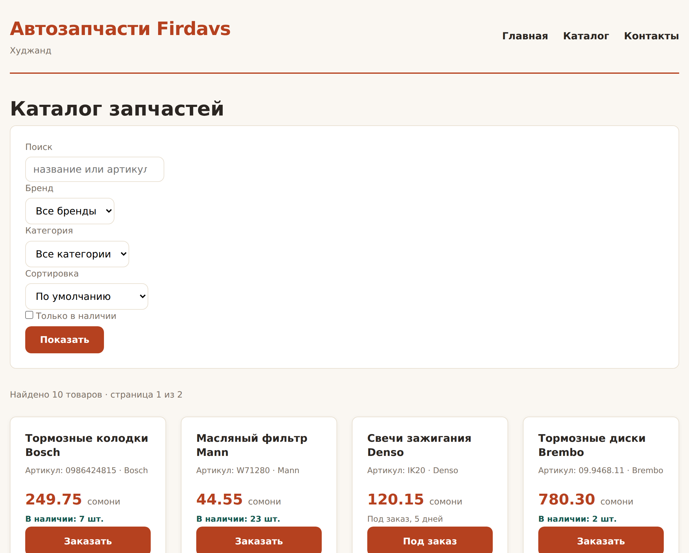
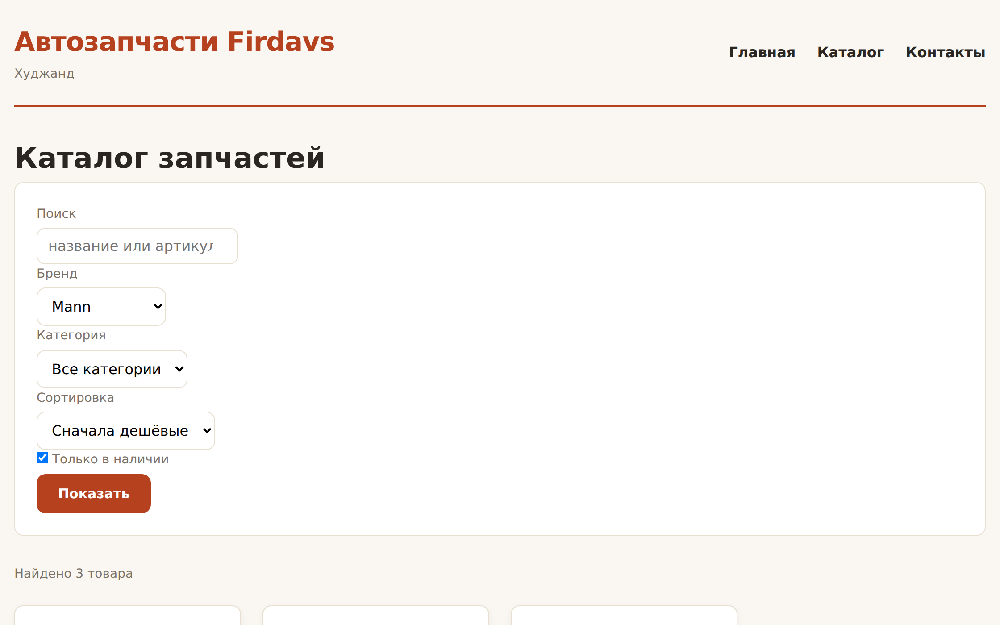
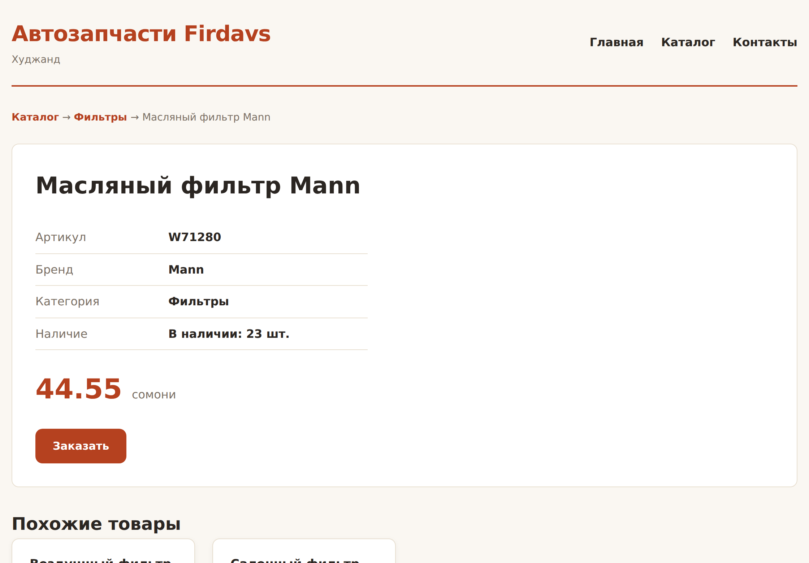

# Глава 25. Практика: каталог на PHP

> **Часть V. PHP — сервер** · Глава 25 из 60
> [← Глава 24](24-php-formy.md) · [Глава 26 →](26-zachem-baza-dannyh.md)

## 🎯 Зачем эта глава

Соберём всё, что накопилось за часть: структуру файлов, функции, массивы,
фильтры из формы, пагинацию, страницу товара.

Получится **работающий каталог** — почти такой, каким он останется до конца книги.
Единственное, чего не хватит, — базы данных. Товары пока лежат в PHP-файле.

В следующей части мы заменим этот файл на MySQL, и — вот что важно — **страницы
почти не изменятся**. Потому что мы сразу напишем их правильно.

## 📖 Сначала — структура

```
moi-magazin/
├── includes/
│   ├── config.php        настройки
│   ├── functions.php     общие функции
│   ├── tovary.php        данные (потом заменим на базу)
│   ├── header.php
│   └── footer.php
├── assets/css/style.css
├── index.php             каталог
├── tovar.php             страница товара
└── zakaz.php             оформление
```

### **`includes/tovary.php` — данные отдельно**

```php
<?php
/**
 * Каталог. Пока — массив в файле.
 * В главе 34 этот же файл будет доставать товары из MySQL,
 * а страницы менять не придётся: наружу отдаются те же функции.
 */

function vse_tovary(): array {
    return [
        ['id'=>1,'nazvanie'=>'Тормозные колодки Bosch','artikul'=>'0986424815','brend'=>'Bosch','zakup'=>18500,'ostatok'=>7, 'kategoriya'=>'Тормоза'],
        ['id'=>2,'nazvanie'=>'Масляный фильтр Mann',   'artikul'=>'W71280',    'brend'=>'Mann', 'zakup'=>3300, 'ostatok'=>23,'kategoriya'=>'Фильтры'],
        ['id'=>3,'nazvanie'=>'Свечи зажигания Denso',  'artikul'=>'IK20',      'brend'=>'Denso','zakup'=>8900, 'ostatok'=>0, 'kategoriya'=>'Зажигание'],
        ['id'=>4,'nazvanie'=>'Тормозные диски Brembo', 'artikul'=>'09.9468.11','brend'=>'Brembo','zakup'=>57800,'ostatok'=>2,'kategoriya'=>'Тормоза'],
        ['id'=>5,'nazvanie'=>'Воздушный фильтр Mann',  'artikul'=>'C25114',    'brend'=>'Mann', 'zakup'=>4800, 'ostatok'=>14,'kategoriya'=>'Фильтры'],
        ['id'=>6,'nazvanie'=>'Аккумулятор Bosch S4',   'artikul'=>'0092S40050','brend'=>'Bosch','zakup'=>70400,'ostatok'=>4, 'kategoriya'=>'Электрика'],
        ['id'=>7,'nazvanie'=>'Салонный фильтр Mann',   'artikul'=>'CU2545',    'brend'=>'Mann', 'zakup'=>4100, 'ostatok'=>9, 'kategoriya'=>'Фильтры'],
        ['id'=>8,'nazvanie'=>'Ремень ГРМ Bosch',       'artikul'=>'1987949095','brend'=>'Bosch','zakup'=>23000,'ostatok'=>3, 'kategoriya'=>'Двигатель'],
        ['id'=>9,'nazvanie'=>'Тормозная жидкость DOT4','artikul'=>'1987479107','brend'=>'Bosch','zakup'=>2900, 'ostatok'=>31,'kategoriya'=>'Тормоза'],
        ['id'=>10,'nazvanie'=>'Свечи NGK Iridium',     'artikul'=>'ILKAR7B11', 'brend'=>'NGK',  'zakup'=>11200,'ostatok'=>6, 'kategoriya'=>'Зажигание'],
    ];
}

/** Один товар по номеру. null, если такого нет. */
function tovar_po_id(int $id): ?array {
    foreach (vse_tovary() as $t) {
        if ($t['id'] === $id) return $t;
    }
    return null;
}

/** Список брендов для фильтра. */
function vse_brendy(): array {
    $b = array_values(array_unique(array_column(vse_tovary(), 'brend')));
    sort($b);
    return $b;
}

/** Список категорий. */
function vse_kategorii(): array {
    $k = array_values(array_unique(array_column(vse_tovary(), 'kategoriya')));
    sort($k);
    return $k;
}
```

**Почему данные отданы через функции, а не просто массивом.**

Это ключевое решение. Страница вызывает `vse_tovary()` и не знает, откуда они
взялись — из файла, из базы или из чужого API. Когда мы подключим MySQL,
поменяется **только внутренность этих функций**. Страницы останутся нетронутыми.

Такой приём называется **отделением слоя данных**. На нём держатся все большие
проекты.

## 📖 Каталог с фильтрами и пагинацией

```php
<?php
// index.php
require_once __DIR__ . '/includes/config.php';
require_once __DIR__ . '/includes/functions.php';
require_once __DIR__ . '/includes/tovary.php';

// --- Параметры из адресной строки ---
$zapros     = trim($_GET['q'] ?? '');
$brend      = $_GET['brend'] ?? '';
$kategoriya = $_GET['kategoriya'] ?? '';
$sort       = $_GET['sort'] ?? '';
$tolko_est  = isset($_GET['est']);
$stranica   = max(1, (int) ($_GET['page'] ?? 1));

const NA_STRANICE = 6;

// --- Отбор ---
$spisok = vse_tovary();

if ($zapros !== '') {
    $nizhnij = mb_strtolower($zapros);
    $spisok = array_filter($spisok, function ($t) use ($nizhnij) {
        return str_contains(mb_strtolower($t['nazvanie']), $nizhnij)
            || str_contains(mb_strtolower($t['artikul']), $nizhnij);
    });
}

// Значения из списков сверяем с допустимыми — из адреса может прийти что угодно
if (in_array($brend, vse_brendy(), true)) {
    $spisok = array_filter($spisok, fn($t) => $t['brend'] === $brend);
} else {
    $brend = '';
}

if (in_array($kategoriya, vse_kategorii(), true)) {
    $spisok = array_filter($spisok, fn($t) => $t['kategoriya'] === $kategoriya);
} else {
    $kategoriya = '';
}

if ($tolko_est) {
    $spisok = array_filter($spisok, fn($t) => $t['ostatok'] > 0);
}

$spisok = array_values($spisok);

// --- Цены считаем ПОСЛЕ отбора: незачем считать то, что не покажем ---
foreach ($spisok as $i => $t) {
    $spisok[$i]['cena'] = cena_prodazhi($t['zakup']);
}

// --- Сортировка ---
match ($sort) {
    'cena_vozr' => usort($spisok, fn($a, $b) => $a['cena'] <=> $b['cena']),
    'cena_ubyv' => usort($spisok, fn($a, $b) => $b['cena'] <=> $a['cena']),
    'nazvanie'  => usort($spisok, fn($a, $b) => strcmp($a['nazvanie'], $b['nazvanie'])),
    default     => null,
};

// --- Пагинация ---
$vsego = count($spisok);
$stranic = max(1, (int) ceil($vsego / NA_STRANICE));
$stranica = min($stranica, $stranic);
$na_ekrane = array_slice($spisok, ($stranica - 1) * NA_STRANICE, NA_STRANICE);

$zagolovok = 'Каталог — ' . SAIT_NAZVANIE;
require __DIR__ . '/includes/header.php';
?>

<h1>Каталог запчастей</h1>

<form class="filtry" method="GET">
    <div class="ryad">
        <div>
            <label for="q">Поиск</label>
            <input type="search" id="q" name="q" value="<?= e($zapros) ?>"
                   placeholder="название или артикул">
        </div>

        <div>
            <label for="brend">Бренд</label>
            <select id="brend" name="brend">
                <option value="">Все бренды</option>
                <?php foreach (vse_brendy() as $b): ?>
                    <option value="<?= e($b) ?>" <?= $brend === $b ? 'selected' : '' ?>>
                        <?= e($b) ?>
                    </option>
                <?php endforeach; ?>
            </select>
        </div>

        <div>
            <label for="kategoriya">Категория</label>
            <select id="kategoriya" name="kategoriya">
                <option value="">Все категории</option>
                <?php foreach (vse_kategorii() as $k): ?>
                    <option value="<?= e($k) ?>" <?= $kategoriya === $k ? 'selected' : '' ?>>
                        <?= e($k) ?>
                    </option>
                <?php endforeach; ?>
            </select>
        </div>

        <div>
            <label for="sort">Сортировка</label>
            <select id="sort" name="sort">
                <option value="">По умолчанию</option>
                <option value="cena_vozr" <?= $sort === 'cena_vozr' ? 'selected' : '' ?>>Сначала дешёвые</option>
                <option value="cena_ubyv" <?= $sort === 'cena_ubyv' ? 'selected' : '' ?>>Сначала дорогие</option>
                <option value="nazvanie"  <?= $sort === 'nazvanie'  ? 'selected' : '' ?>>По названию</option>
            </select>
        </div>

        <label class="galka">
            <input type="checkbox" name="est" value="1" <?= $tolko_est ? 'checked' : '' ?>>
            Только в наличии
        </label>

        <button type="submit">Показать</button>
    </div>
</form>

<p class="schetchik">
    Найдено <?= $vsego ?> <?= sklonenie($vsego, 'товар', 'товара', 'товаров') ?>
    <?php if ($stranic > 1): ?>
        · страница <?= $stranica ?> из <?= $stranic ?>
    <?php endif; ?>
</p>

<?php if ($vsego === 0): ?>

    <div class="pusto">
        <h3>Ничего не нашлось</h3>
        <p>Попробуйте изменить запрос или сбросить фильтры.</p>
        <a class="knopka" href="?">Показать все товары</a>
    </div>

<?php else: ?>

    <div class="katalog">
        <?php foreach ($na_ekrane as $t): ?>
            <article class="tovar">
                <h3>
                    <a href="tovar.php?id=<?= $t['id'] ?>"><?= e($t['nazvanie']) ?></a>
                </h3>
                <p class="artikul">Артикул: <?= e($t['artikul']) ?> · <?= e($t['brend']) ?></p>
                <p class="cena"><?= somoni($t['cena']) ?> <span>сомони</span></p>

                <?php if ($t['ostatok'] > 0): ?>
                    <p class="nalichie">В наличии: <?= $t['ostatok'] ?> шт.</p>
                <?php else: ?>
                    <p class="nalichie nety">Под заказ, 5 дней</p>
                <?php endif; ?>

                <a class="knopka" href="zakaz.php?id=<?= $t['id'] ?>">
                    <?= $t['ostatok'] > 0 ? 'Заказать' : 'Под заказ' ?>
                </a>
            </article>
        <?php endforeach; ?>
    </div>

    <?php if ($stranic > 1): ?>
        <nav class="stranicy">
            <?php for ($i = 1; $i <= $stranic; $i++): ?>
                <?php if ($i === $stranica): ?>
                    <span class="tekushaya"><?= $i ?></span>
                <?php else: ?>
                    <?php
                    // Сохраняем все фильтры, меняем только номер страницы
                    $parametry = $_GET;
                    $parametry['page'] = $i;
                    ?>
                    <a href="?<?= http_build_query($parametry) ?>"><?= $i ?></a>
                <?php endif; ?>
            <?php endfor; ?>
        </nav>
    <?php endif; ?>

<?php endif; ?>

<?php require __DIR__ . '/includes/footer.php'; ?>
```

### **Три приёма, на которые стоит обратить внимание**

**`http_build_query($parametry)`** — собирает адрес из массива параметров.
Без него пришлось бы вручную склеивать `?q=...&brend=...&page=2` и не забыть
про экранирование. Функция делает это правильно.

Это и есть решение задачи «переключить страницу, не потеряв фильтры» —
частая головная боль новичков.

**Сверка с допустимыми значениями.** Обратите внимание: `$brend` проверяется
через `in_array(..., vse_brendy(), true)`. Из адресной строки может прийти что
угодно, включая попытку внедрить код. Мы принимаем **только то, что есть
в нашем списке**.

**Цены считаются после фильтрации.** На десяти товарах разницы нет, на десяти
тысячах — есть. Привычка полезная.

## 📖 Страница товара

```php
<?php
// tovar.php
require_once __DIR__ . '/includes/config.php';
require_once __DIR__ . '/includes/functions.php';
require_once __DIR__ . '/includes/tovary.php';

$id = (int) ($_GET['id'] ?? 0);
$tovar = tovar_po_id($id);

// Товара нет — честная 404, а не пустая страница
if ($tovar === null) {
    http_response_code(404);
    $zagolovok = 'Товар не найден';
    require __DIR__ . '/includes/header.php';
    ?>
    <div class="pusto">
        <h1>Товар не найден</h1>
        <p>Возможно, он снят с продажи или в ссылке опечатка.</p>
        <a class="knopka" href="index.php">Вернуться в каталог</a>
    </div>
    <?php
    require __DIR__ . '/includes/footer.php';
    exit;
}

$cena = cena_prodazhi($tovar['zakup']);

// Похожие товары — той же категории, кроме текущего
$pohozhie = array_slice(array_values(array_filter(
    vse_tovary(),
    fn($t) => $t['kategoriya'] === $tovar['kategoriya'] && $t['id'] !== $tovar['id']
)), 0, 3);

$zagolovok = $tovar['nazvanie'] . ' — ' . SAIT_NAZVANIE;
require __DIR__ . '/includes/header.php';
?>

<nav class="hlebnye-kroshki">
    <a href="index.php">Каталог</a> →
    <a href="index.php?kategoriya=<?= urlencode($tovar['kategoriya']) ?>">
        <?= e($tovar['kategoriya']) ?>
    </a> →
    <span><?= e($tovar['nazvanie']) ?></span>
</nav>

<article class="tovar-podrobno">
    <h1><?= e($tovar['nazvanie']) ?></h1>

    <table class="harakteristiki">
        <tr><th>Артикул</th><td><?= e($tovar['artikul']) ?></td></tr>
        <tr><th>Бренд</th><td><?= e($tovar['brend']) ?></td></tr>
        <tr><th>Категория</th><td><?= e($tovar['kategoriya']) ?></td></tr>
        <tr><th>Наличие</th><td>
            <?= $tovar['ostatok'] > 0
                ? 'В наличии: ' . $tovar['ostatok'] . ' шт.'
                : 'Под заказ, 5 дней' ?>
        </td></tr>
    </table>

    <p class="cena-bolshaya"><?= somoni($cena) ?> <span>сомони</span></p>

    <a class="knopka" href="zakaz.php?id=<?= $tovar['id'] ?>">Заказать</a>
</article>

<?php if ($pohozhie): ?>
    <h2>Похожие товары</h2>
    <div class="katalog">
        <?php foreach ($pohozhie as $p): ?>
            <article class="tovar">
                <h3><a href="tovar.php?id=<?= $p['id'] ?>"><?= e($p['nazvanie']) ?></a></h3>
                <p class="cena"><?= somoni(cena_prodazhi($p['zakup'])) ?> <span>сомони</span></p>
            </article>
        <?php endforeach; ?>
    </div>
<?php endif; ?>

<?php require __DIR__ . '/includes/footer.php'; ?>
```

**Про 404.** Когда товара нет, мы не просто показываем «ничего», а возвращаем
**код ответа 404** — помните главу 2? Это важно: поисковик поймёт, что страницы
нет, и уберёт её из выдачи. Если вернуть 200 с текстом «не найдено», в поиске
накопятся мусорные страницы.

## 🖥 На экране

Каталог с фильтрами и пагинацией:



Отфильтровали по бренду Mann — фильтры сохранились в адресе, ссылкой можно
поделиться:



Страница товара с характеристиками и похожими:



## ⚠️ Грабли

**Не проверять значения из адреса.** `?brend=<script>` попадёт в вывод.
Сверяйтесь со списком допустимых.

**Терять фильтры при переходе на другую страницу.** Собирайте ссылки
через `http_build_query($_GET)`.

**Возвращать 200 для несуществующего товара.** Поисковик наберёт мусорных
страниц.

**Считать всё, потом фильтровать.** Правильный порядок: отобрать, потом считать.

**Складывать данные и вывод в один файл.** Данные — в `includes/tovary.php`,
страница — только показывает.

**`(int)` без проверки диапазона.** `?page=-5` даст отрицательное смещение
и ошибку. `max(1, (int) ...)`.

## 🏋️ Задачи

**Задача 25.1.** Соберите каталог из главы целиком: три файла плюс `includes/`.
Проверьте фильтры, сортировку, пагинацию, страницу товара, 404.

**Задача 25.2.** Добавьте фильтр по цене «от» и «до». Не забудьте про проверку
чисел.

**Задача 25.3.** Сделайте кнопку «Сбросить фильтры», которая появляется, только
если хоть один фильтр задан.

**Задача 25.4.** Добавьте выбор количества товаров на странице: 6, 12, 24.
Значение тоже сохраняйте в адресе.

**Задача 25.5.** Сделайте пагинацию умной: при десяти страницах показывать
не все номера, а «1 2 3 … 9 10» с многоточием.

**Задача 25.6.** Добавьте в каталог подсчёт: сколько товаров у каждого бренда,
и покажите числа прямо в выпадающем списке — «Mann (3)».

**Задача 25.7.** Свяжите каталог с формой заказа из главы 24: кнопка «Заказать»
должна открывать форму с уже выбранным товаром.

**Задача 25.8.** Проверьте безопасность. Откройте:

```
index.php?brend=<script>alert(1)</script>
index.php?page=-100
index.php?sort=' OR 1=1
```

Ничего не сломалось и не выполнилось? Хорошо. Сломалось — почините.

**Задача 25.9.** Замерьте, сколько времени собирается страница. Подсказка:
`microtime(true)` в начале и в конце, разница — время работы.

**Задача 25.10.** Подумайте и запишите: что придётся изменить в этих файлах,
когда товары переедут в базу данных? Сохраните ответ — сверимся в главе 34.

*Ответы — в [Приложении Г](../prilozheniya/G-otvety.md).*

## 🔗 В бою

Ваш каталог и боевой отличаются одним: источником данных.

В `pages/` этого репозитория лежат страницы, устроенные так же — параметры
из `$_GET`, проверка допустимых значений, сборка ссылок, пагинация. Разница
в том, что вместо `vse_tovary()` там запрос к MySQL.

И вот почему мы так старательно вынесли данные в отдельный файл: **переход
на базу окажется почти безболезненным**. Поменяется внутренность трёх функций,
страницы останутся как есть.

Это не случайность, а следствие правильной структуры. Плохо написанный код
пришлось бы переписывать целиком.

## 📌 Итог

- **Данные отделены от вывода.** Страница вызывает `vse_tovary()` и не знает,
  откуда они.
- Значения из адреса **сверяйте с допустимыми** через `in_array(..., true)`.
- `http_build_query($_GET)` — сохранить фильтры при переходе по страницам.
- Порядок: **отобрать → посчитать → отсортировать → нарезать на страницы**.
- Несуществующий товар — **404**, а не пустая страница.
- `max(1, (int) $_GET['page'])` — защита от отрицательных номеров.
- GET-параметры делают страницу **ссылкой, которой можно поделиться**.

**Часть V закончена.** У вас работающий каталог на PHP.

Но товары всё ещё лежат в файле. Добавить товар — значит править код;
десять тысяч товаров туда не поместятся вовсе.

Пора завести базу данных.

[← Глава 24](24-php-formy.md) · [Глава 26. Зачем нужна база данных →](26-zachem-baza-dannyh.md)
