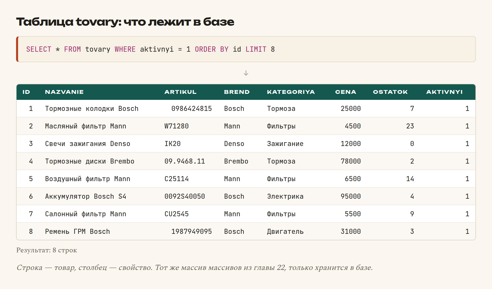

# Глава 26. Зачем нужна база данных

> **Часть VI. База данных** · Глава 26 из 60
> [← Глава 25](25-praktika-katalog-php.md) · [Глава 27 →](27-select.md)

## 🎯 Зачем эта глава

Ваш каталог работает, но товары лежат в PHP-файле. У этого решения три
непреодолимые проблемы:

1. **Добавить товар = править код.** Продавец не может этого делать.
2. **Десять тысяч товаров туда не поместятся.** PHP будет читать весь массив
   при каждом открытии страницы.
3. **Ничего не сохраняется.** Заказ оформили — и он исчез.

Нужно место, где данные **живут постоянно**, куда можно быстро добавлять
и откуда можно быстро доставать нужное. Это и есть база данных.

В этой главе разберёмся, как база устроена, и — самое важное — **спроектируем
таблицы правильно**. Ошибка в проектировании обходится дороже всех остальных:
переделывать структуру, когда в базе уже сто тысяч записей, очень больно.

## 📖 База данных — это картотека

Забудьте слово «база». Представьте **картотеку в поликлинике**.

Ящик с медкартами — это **таблица**. Одна карточка — **строка**. Поля в карточке
(фамилия, год рождения, адрес) — **столбцы**.

Ящиков несколько: пациенты, врачи, приёмы. Это **разные таблицы**.

И есть регистратор, который умеет мгновенно находить нужное: «дай карточки всех,
кто родился до 1980 года и живёт на улице Ленина». Это **SQL-запрос**.

Вот и вся база данных. Никакой магии.

### **Таблица товаров**

| id | nazvanie | artikul | brend | cena | ostatok |
|---|---|---|---|---|---|
| 1 | Тормозные колодки Bosch | 0986424815 | Bosch | 25000 | 7 |
| 2 | Масляный фильтр Mann | W71280 | Mann | 4500 | 23 |
| 3 | Свечи зажигания Denso | IK20 | Denso | 12000 | 0 |

- **Строка** — один товар;
- **Столбец** — одно свойство всех товаров;
- **`id`** — уникальный номер строки.

Узнаёте? Это тот же массив ассоциативных массивов из главы 22. Только теперь
он хранится не в файле, а в специальной программе, умеющей искать по нему
за миллисекунды даже среди миллионов записей.

## 📖 MySQL и его соседи

**СУБД** — система управления базами данных. Программа, которая хранит таблицы
и выполняет запросы.

| СУБД | Особенности |
|---|---|
| **MySQL / MariaDB** | Самая распространённая для сайтов. Есть на любом хостинге |
| **PostgreSQL** | Мощнее, строже. Выбор крупных проектов |
| **SQLite** | Вся база — один файл. Для мелких проектов и мобильных приложений |
| **MongoDB** | Хранит не таблицы, а документы. Другой подход |

Мы берём **MySQL**: он стоит на любом дешёвом хостинге и на нём работает
autodoc.tj.

**SQL** — язык запросов. Он почти одинаков во всех перечисленных СУБД.
Выучив SQL для MySQL, вы будете понимать и PostgreSQL.

## 📖 Как создать таблицу

```sql
CREATE TABLE tovary (
    id          INT AUTO_INCREMENT PRIMARY KEY,
    nazvanie    VARCHAR(255) NOT NULL,
    artikul     VARCHAR(64) NOT NULL,
    brend       VARCHAR(64) NOT NULL,
    kategoriya  VARCHAR(64) NOT NULL,
    cena        INT NOT NULL,
    ostatok     INT NOT NULL DEFAULT 0,
    aktivnyi    TINYINT(1) NOT NULL DEFAULT 1,
    sozdan      DATETIME NOT NULL DEFAULT CURRENT_TIMESTAMP
) ENGINE=InnoDB DEFAULT CHARSET=utf8mb4 COLLATE=utf8mb4_unicode_ci;
```

Разберём построчно.

| Часть | Что означает |
|---|---|
| `CREATE TABLE tovary` | Создать таблицу с именем `tovary` |
| `id INT AUTO_INCREMENT` | Целое число, **растёт само** при добавлении |
| `PRIMARY KEY` | **Первичный ключ** — уникальный номер строки |
| `VARCHAR(255)` | Строка до 255 символов |
| `NOT NULL` | Поле **обязательное**, пустым быть не может |
| `DEFAULT 0` | Значение по умолчанию |
| `DATETIME` | Дата и время |
| `CURRENT_TIMESTAMP` | Текущий момент |
| `ENGINE=InnoDB` | Движок хранения. **Всегда InnoDB** |
| `CHARSET=utf8mb4` | Кодировка. **Всегда utf8mb4** |

### **Два «всегда», которые нужно объяснить**

**`utf8mb4`, а не `utf8`.** Звучит странно, но в MySQL кодировка с именем `utf8` —
**неполноценная**: она хранит только символы до трёх байт. Эмодзи, некоторые
редкие символы и часть азиатских иероглифов в неё не влезают и превращаются
в мусор.

Настоящий UTF-8 в MySQL называется `utf8mb4`. Историческая ошибка разработчиков,
которую теперь приходится помнить всем.

**`InnoDB`, а не `MyISAM`.** InnoDB умеет **транзакции** (глава 41) и **связи
между таблицами**. MyISAM — старый движок, не умеет ни того, ни другого.
На новых версиях MySQL InnoDB и так по умолчанию, но в старых инструкциях
до сих пор встречается MyISAM.

## 📖 Типы данных: выбирайте с умом

Тип — это обещание базе, что будет лежать в столбце. От него зависят и объём,
и скорость, и защита от мусора.

### **Числа**

| Тип | Диапазон | Когда |
|---|---|---|
| `TINYINT` | −128…127 | Флаги: да/нет |
| `SMALLINT` | ±32 тыс. | Количество на складе |
| `INT` | ±2 млрд | **Основной выбор**: id, цены в дирамах |
| `BIGINT` | Очень большой | Крупные счётчики |
| `DECIMAL(10,2)` | Точная дробь | Деньги, если храните дробями |
| `FLOAT` / `DOUBLE` | Приблизительная дробь | Вес, размеры |

⚠️ **`FLOAT` для денег — запрещено.** Помните `0.1 + 0.2 !== 0.3` из главы 14?
В базе то же самое: суммы «поплывут», и бухгалтерия не сойдётся.

Два допустимых варианта: **`INT` в мелких единицах** (дирамах) — наш выбор,
или **`DECIMAL(10,2)`**, который считает точно.

### **Строки**

| Тип | Особенности | Когда |
|---|---|---|
| `VARCHAR(n)` | До n символов, занимает по факту | **Основной выбор** для текста |
| `CHAR(n)` | Ровно n, добивается пробелами | Коды фиксированной длины |
| `TEXT` | До 64 КБ | Описания, отзывы |
| `LONGTEXT` | До 4 ГБ | Очень большие тексты |

⚠️ **`VARCHAR(255)` не «на всякий случай»**, а осознанно. Артикул не бывает
длиннее 64 символов — ставьте 64. Ограничение работает как проверка: мусор
не влезет.

**`TEXT` не индексируется** обычным способом, и по нему медленно искать.
Если по полю нужен поиск — это `VARCHAR`.

### **Дата и время**

| Тип | Что хранит |
|---|---|
| `DATE` | Только дату: `2026-08-24` |
| `DATETIME` | Дату и время. **Основной выбор** |
| `TIMESTAMP` | То же, но с учётом часового пояса. Диапазон до 2038 года |
| `TIME` | Только время |

**Формат в базе всегда `ГГГГ-ММ-ДД`.** Не `24.08.2026`. Русский формат
делается при выводе.

### **Да/нет**

```sql
aktivnyi TINYINT(1) NOT NULL DEFAULT 1
```

В MySQL нет отдельного типа «логический» — используют `TINYINT(1)` со значениями
0 и 1. Слово `BOOLEAN` работает, но это просто псевдоним для того же `TINYINT(1)`.

## 📖 Проектирование: главная тема главы

Вот здесь совершаются самые дорогие ошибки.

### **Ошибка 1: складывать несколько значений в одно поле**

```sql
-- ❌ Плохо
sovmestimost VARCHAR(255)   -- "Toyota Camry, Honda Accord, Nissan Teana"
```

Кажется удобным. Но попробуйте теперь ответить на вопрос «покажи все запчасти
для Toyota Camry». Придётся искать подстроку — медленно, ненадёжно
(«Camry» найдётся и в «Camry Hybrid»), и невозможно построить нормальный фильтр.

```sql
-- ✅ Хорошо: отдельная таблица связей
CREATE TABLE tovar_avto (
    tovar_id INT NOT NULL,
    avto_id  INT NOT NULL,
    PRIMARY KEY (tovar_id, avto_id)
);
```

**Правило: одно поле — одно значение.** Список значений — это отдельная таблица.

### **Ошибка 2: дублировать данные**

```sql
-- ❌ Плохо: имя продавца в каждом товаре
CREATE TABLE tovary (
    id INT,
    nazvanie VARCHAR(255),
    prodavec_imya VARCHAR(255),
    prodavec_telefon VARCHAR(32),
    prodavec_adres VARCHAR(255)
);
```

Продавец сменил телефон — нужно обновить его во **всех** своих товарах.
Забудете один — в базе два разных телефона, и непонятно, какой верный.

```sql
-- ✅ Хорошо: продавцы отдельно, товары ссылаются на них
CREATE TABLE prodavcy (
    id INT AUTO_INCREMENT PRIMARY KEY,
    imya VARCHAR(255) NOT NULL,
    telefon VARCHAR(32) NOT NULL
);

CREATE TABLE tovary (
    id INT AUTO_INCREMENT PRIMARY KEY,
    nazvanie VARCHAR(255) NOT NULL,
    prodavec_id INT NOT NULL,
    FOREIGN KEY (prodavec_id) REFERENCES prodavcy(id)
);
```

Теперь телефон продавца лежит **в одном месте**. Меняем — меняется везде.

Это называется **нормализация**, и правило её звучит так же, как принцип
из главы 23: **каждый факт записан ровно один раз**.

**`FOREIGN KEY`** — внешний ключ. Он говорит базе: «в поле `prodavec_id` может
быть только существующий id продавца». База сама не даст создать товар
несуществующего продавца или удалить продавца, у которого есть товары.

### **Ошибка 3: не думать о том, чего ещё нет**

Через полгода понадобится:

- скрывать товар, не удаляя его → нужно поле `aktivnyi`;
- знать, когда товар добавили → нужно `sozdan`;
- знать, кто последний менял → нужно `izmenen`.

**Три поля, которые стоит добавлять в любую таблицу сразу:**

```sql
sozdan   DATETIME NOT NULL DEFAULT CURRENT_TIMESTAMP,
izmenen  DATETIME NOT NULL DEFAULT CURRENT_TIMESTAMP ON UPDATE CURRENT_TIMESTAMP,
aktivnyi TINYINT(1) NOT NULL DEFAULT 1
```

Стоят они дёшево, а выручают постоянно.

### **Правило про удаление**

⚠️ **В боевых системах данные почти никогда не удаляют физически.**

Вместо `DELETE` ставят `aktivnyi = 0`. Причины:

- удалённый товар мог быть в чьём-то заказе — история сломается;
- удалили по ошибке — не восстановить;
- нужна статистика за прошлый год — а данных нет.

Это называется **мягкое удаление**. Товар исчезает из каталога,
но остаётся в базе.

## 📖 Как назвать таблицы и поля

Мелочь, которая заметно влияет на удобство работы:

| Правило | Пример |
|---|---|
| Только латиница, нижний регистр | `tovary`, не `Товары` |
| Слова через подчёркивание | `prodavec_id`, не `prodavecId` |
| Таблицы во множественном числе | `tovary`, `zakazy`, `polzovateli` |
| Внешний ключ = `таблица_id` | `prodavec_id`, `zakaz_id` |
| Даты — с приставкой | `sozdan`, `izmenen`, `oplachen` |
| Флаги — понятные | `aktivnyi`, а не `flag1` |

**Держитесь одного стиля.** Половина таблиц по-английски, половина
транслитом — верный способ запутаться.

## 💻 Первая таблица

```sql
CREATE TABLE tovary (
    id          INT AUTO_INCREMENT PRIMARY KEY,
    nazvanie    VARCHAR(255) NOT NULL,
    artikul     VARCHAR(64)  NOT NULL,
    brend       VARCHAR(64)  NOT NULL,
    kategoriya  VARCHAR(64)  NOT NULL,
    cena        INT NOT NULL COMMENT 'в дирамах, 1 сомони = 100',
    ostatok     INT NOT NULL DEFAULT 0,
    aktivnyi    TINYINT(1) NOT NULL DEFAULT 1,
    sozdan      DATETIME NOT NULL DEFAULT CURRENT_TIMESTAMP,
    izmenen     DATETIME NOT NULL DEFAULT CURRENT_TIMESTAMP ON UPDATE CURRENT_TIMESTAMP,

    UNIQUE KEY uniq_artikul (artikul),
    KEY idx_brend (brend),
    KEY idx_kategoriya (kategoriya)
) ENGINE=InnoDB DEFAULT CHARSET=utf8mb4 COLLATE=utf8mb4_unicode_ci;
```

Новое здесь:

- **`COMMENT`** — заметка прямо в структуре таблицы. Через год вы забудете,
  что цена в дирамах. Комментарий не забудет.
- **`UNIQUE KEY`** — база не даст создать два товара с одним артикулом.
  Защита от дублей на уровне базы, а не «мы же проверим в PHP».
- **`KEY`** — индекс, ускоряющий поиск. Подробно в главе 30.

Заполняем:

```sql
INSERT INTO tovary (nazvanie, artikul, brend, kategoriya, cena, ostatok) VALUES
('Тормозные колодки Bosch', '0986424815', 'Bosch',  'Тормоза',   25000, 7),
('Масляный фильтр Mann',    'W71280',     'Mann',   'Фильтры',    4500, 23),
('Свечи зажигания Denso',   'IK20',       'Denso',  'Зажигание', 12000, 0);
```

## 🖥 На экране

Смотрим, что получилось:



## 📖 Чем управлять базой

| Инструмент | Для чего |
|---|---|
| **phpMyAdmin** | Через браузер. Идёт в XAMPP и OpenServer. Для начала — идеально |
| **DBeaver** | Отдельная программа, бесплатная, для всех СУБД |
| **MySQL Workbench** | Официальный инструмент MySQL |
| **Командная строка** | `mysql -u root -p`. На сервере часто единственный вариант |

Начните с phpMyAdmin: откройте `http://localhost/phpmyadmin`, создайте базу
(кодировка обязательно `utf8mb4_unicode_ci`) и попробуйте запросы из следующей
главы прямо там.

## 🔤 Разбор по словам

| Запись | Что означает |
|---|---|
| `CREATE TABLE` | Создать таблицу |
| `INT` / `VARCHAR(n)` / `TEXT` / `DATETIME` | Типы данных |
| `AUTO_INCREMENT` | Номер растёт сам |
| `PRIMARY KEY` | Уникальный номер строки |
| `NOT NULL` | Обязательное поле |
| `DEFAULT` | Значение по умолчанию |
| `UNIQUE KEY` | Значения не должны повторяться |
| `KEY` / `INDEX` | Индекс для ускорения поиска |
| `FOREIGN KEY ... REFERENCES` | Связь с другой таблицей |
| `COMMENT` | Заметка в структуре |
| `ENGINE=InnoDB` | Движок. Всегда он |
| `CHARSET=utf8mb4` | Кодировка. **Не `utf8`** |
| **Нормализация** | Каждый факт записан один раз |
| **Мягкое удаление** | `aktivnyi = 0` вместо `DELETE` |

## ⚠️ Грабли

**`utf8` вместо `utf8mb4`.** Эмодзи и часть символов превратятся в мусор.

**`FLOAT` для денег.** Суммы разъедутся. `INT` в дирамах или `DECIMAL`.

**Список значений в одном поле.** «Toyota, Honda, Nissan» — невозможно
нормально искать и фильтровать.

**Дублировать данные вместо связи.** Обновите в одном месте — забудете в другом.

**Физически удалять записи.** История заказов сломается.

**`VARCHAR(255)` для всего.** Ограничение — это ещё и проверка.

**Русские имена таблиц и полей.** Технически возможно, практически — источник
проблем на каждом шагу.

**Не добавить `sozdan` сразу.** Через полгода понадобится, а данных за прошлое
уже не будет.

## 🏋️ Задачи

**Задача 26.1.** Установите phpMyAdmin (идёт с XAMPP/OpenServer), создайте базу
`magazin` с кодировкой `utf8mb4_unicode_ci`.

**Задача 26.2.** Создайте таблицу `tovary` из главы и добавьте пять товаров.

**Задача 26.3.** Какой тип выбрать для каждого поля? Обоснуйте:

1. Название товара.
2. Цена.
3. Количество на складе.
4. Описание на две страницы.
5. Дата добавления.
6. Есть ли скидка.
7. Артикул.
8. Вес в килограммах.

**Задача 26.4.** Найдите ошибки в проектировании:

```sql
CREATE TABLE zakazy (
    nomer INT,
    tovary VARCHAR(500),
    klient_imya VARCHAR(100),
    klient_telefon VARCHAR(20),
    klient_adres VARCHAR(255),
    summa FLOAT,
    data VARCHAR(20)
);
```

Найдите минимум пять проблем.

**Задача 26.5.** Спроектируйте таблицу `otzyvy` — отзывы о товарах. Какие поля
нужны? Как связать с товарами и покупателями?

**Задача 26.6.** Спроектируйте связь «товар подходит к нескольким автомобилям».
Сколько таблиц понадобится?

**Задача 26.7.** Почему поле `cena` лучше назвать `cena_diram`? Что это даёт
через год?

**Задача 26.8.** Откройте `sql/` в этом репозитории и посмотрите на структуру
таблицы товаров боевого магазина. Какие поля есть там, которых нет у вас?
Зачем каждое из них?

*Ответы — в [Приложении Г](../prilozheniya/4-G-otvety.md).*

## 🔗 В бою

В папке `sql/` этого репозитория лежат **миграции** — файлы, которые создают
и изменяют структуру базы.

Обратите внимание на две вещи.

**Каждый файл идемпотентен** — то есть его можно применить дважды без вреда.
Там везде `CREATE TABLE IF NOT EXISTS` и проверки перед добавлением столбца.
Это жёсткое правило проекта: миграция, которая падает при повторном запуске,
однажды уронит боевой сайт.

**Структура меняется только миграциями.** Никто не правит таблицы руками
в phpMyAdmin на боевом сервере. Иначе на тестовом сервере структура одна,
на боевом другая, и код работает то так, то эдак.

## 📌 Итог

- База — картотека: **таблица** = ящик, **строка** = карточка, **столбец** = поле.
- **MySQL** для сайтов, **SQL** — язык запросов, почти одинаковый везде.
- Всегда `ENGINE=InnoDB` и `CHARSET=utf8mb4` (**не `utf8`**).
- Деньги — **`INT` в мелких единицах** или `DECIMAL`. Никогда `FLOAT`.
- **Одно поле — одно значение.** Список — это отдельная таблица.
- **Каждый факт записан один раз.** Дублирование = рассинхронизация.
- `FOREIGN KEY` заставляет базу саму следить за связями.
- Добавляйте `sozdan`, `izmenen`, `aktivnyi` сразу.
- **Мягкое удаление** вместо `DELETE`.
- Имена — латиница, нижний регистр, подчёркивания, таблицы во множественном числе.

Дальше — SELECT: научимся доставать из базы именно то, что нужно.

[← Глава 25](25-praktika-katalog-php.md) · [Глава 27. SELECT →](27-select.md)
