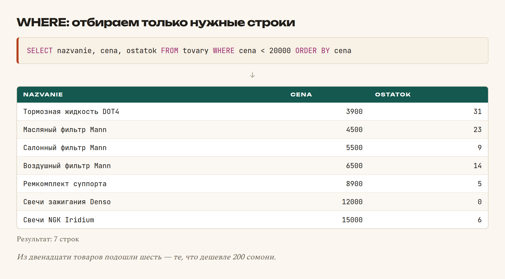
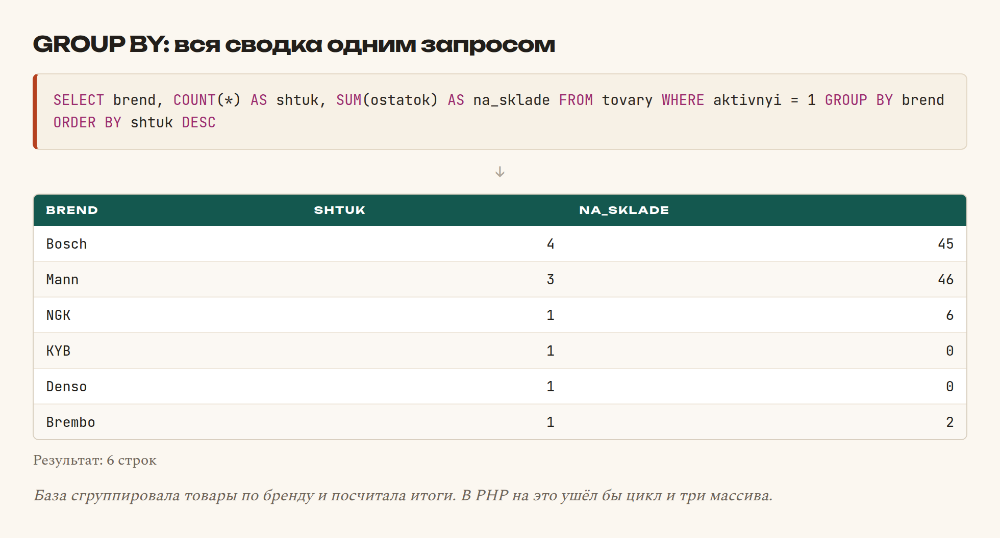
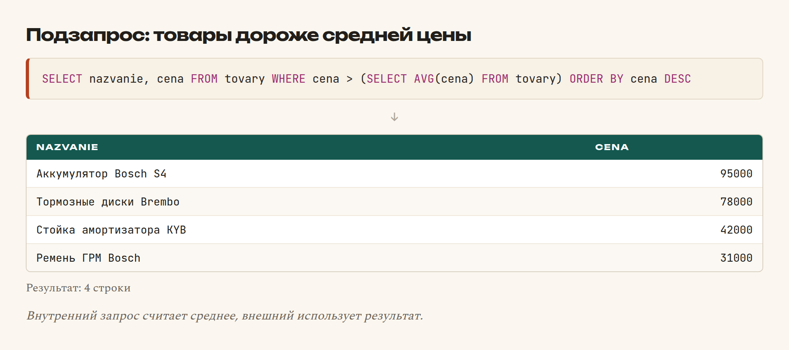
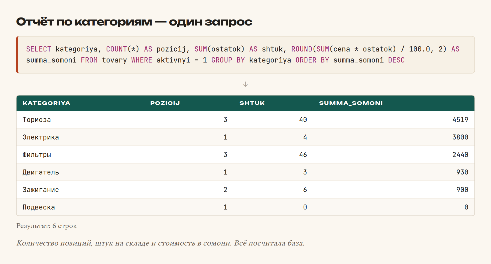

# Глава 27. SELECT: достаём данные

> **Часть VI. База данных** · Глава 27 из 60
> [← Глава 26](26-zachem-baza-dannyh.md) · [Глава 28 →](28-insert-update-delete.md)

## 🎯 Зачем эта глава

`SELECT` — самая используемая команда в вашей будущей жизни. Каталог, поиск,
фильтры, отчёты, личный кабинет — всё это `SELECT`.

Хорошая новость: он читается почти как английская фраза. Плохая: у него много
частей, и порядок их строгий.

Разберём всё по кускам. Каждый пример в этой главе **реально выполнялся**,
и таблицы результатов — настоящие.

## 📖 Скелет запроса

```sql
SELECT   какие столбцы
FROM     из какой таблицы
WHERE    какие строки брать
GROUP BY как группировать
HAVING   какие группы оставить
ORDER BY как отсортировать
LIMIT    сколько показать
```

⚠️ **Порядок частей менять нельзя.** `ORDER BY` перед `WHERE` — ошибка.
Запомните последовательность, она одинакова во всех базах.

Обязательны только `SELECT` и `FROM`. Остальное — по необходимости.

## 📖 Выбираем столбцы

```sql
SELECT * FROM tovary;
SELECT nazvanie, cena FROM tovary;
SELECT nazvanie AS tovar, cena AS stoimost FROM tovary;
```

`*` означает «все столбцы».

⚠️ **`SELECT *` удобен для проб, но плох в рабочем коде.** Причины:

- тянет лишние данные, включая большие описания;
- добавили столбец в таблицу — запрос молча стал тяжелее;
- непонятно, что именно использует код.

**Перечисляйте нужные столбцы явно.**

`AS` задаёт новое имя столбцу в результате. Полезно, когда имя длинное
или столбцы из разных таблиц называются одинаково.

## 📖 WHERE: отбираем строки

```sql
SELECT nazvanie, cena, ostatok
FROM tovary
WHERE cena < 20000;
```



### **Операторы сравнения**

```sql
WHERE cena = 25000
WHERE cena <> 25000        -- не равно (можно и !=)
WHERE cena > 20000
WHERE cena BETWEEN 5000 AND 30000
WHERE brend IN ('Bosch', 'Mann')
WHERE brend NOT IN ('NGK')
WHERE ostatok > 0 AND cena < 20000
WHERE brend = 'Bosch' OR brend = 'Mann'
WHERE NOT (ostatok = 0)
```

`BETWEEN` включает границы: `BETWEEN 5000 AND 30000` возьмёт и 5000, и 30000.

`IN` — короткая запись для «или»: `IN ('a','b','c')` вместо трёх `OR`.

### **Поиск по тексту: LIKE**

```sql
WHERE nazvanie LIKE '%фильтр%'    -- содержит
WHERE nazvanie LIKE 'Тормозные%'  -- начинается с
WHERE artikul LIKE '%815'         -- заканчивается на
```

| Знак | Что означает |
|---|---|
| `%` | Любое количество любых символов |
| `_` | Ровно один любой символ |

⚠️ **`LIKE '%текст%'` — медленный запрос.** База не может использовать индекс
и вынуждена просмотреть все строки. На тысяче товаров незаметно, на миллионе —
катастрофа.

Для серьёзного поиска есть полнотекстовый индекс (`FULLTEXT`) и отдельные
поисковые движки. Разберём в главе 35.

### **Пустые значения: IS NULL**

```sql
WHERE opisanie IS NULL
WHERE opisanie IS NOT NULL
```

⚠️ **`= NULL` не работает никогда.** `NULL` означает «неизвестно», а неизвестное
не равно ничему, даже другому неизвестному. Только `IS NULL`.

Это одна из самых частых ошибок новичков в SQL.

## 📖 ORDER BY: сортировка

```sql
SELECT nazvanie, cena FROM tovary ORDER BY cena;         -- по возрастанию
SELECT nazvanie, cena FROM tovary ORDER BY cena DESC;    -- по убыванию
SELECT nazvanie, cena FROM tovary ORDER BY brend, cena;  -- сначала по бренду, внутри по цене
```

`ASC` — по возрастанию (по умолчанию), `DESC` — по убыванию.

Сортировка по нескольким полям через запятую: сначала по первому, при равенстве —
по второму.

## 📖 LIMIT: сколько показывать

```sql
SELECT nazvanie FROM tovary LIMIT 5;             -- первые 5
SELECT nazvanie FROM tovary LIMIT 5 OFFSET 10;   -- 5 штук, пропустив 10
SELECT nazvanie FROM tovary LIMIT 10, 5;         -- то же короче: пропустить 10, взять 5
```

**Это и есть пагинация.** Формула:

```
OFFSET = (номер_страницы - 1) × товаров_на_странице
```

Третья страница по 20 товаров: `LIMIT 20 OFFSET 40`.

⚠️ **`ORDER BY` обязателен, если используете `LIMIT`.** Без сортировки база
не обязана возвращать строки в каком-то определённом порядке — и на второй
странице может оказаться то же, что на первой.

## 📖 Функции над строками

Здесь начинается по-настоящему полезное.

```sql
SELECT COUNT(*) FROM tovary;                       -- сколько строк
SELECT COUNT(*) FROM tovary WHERE ostatok > 0;     -- сколько в наличии
SELECT SUM(ostatok) FROM tovary;                   -- сумма
SELECT AVG(cena) FROM tovary;                      -- среднее
SELECT MIN(cena), MAX(cena) FROM tovary;           -- минимум и максимум
SELECT SUM(cena * ostatok) FROM tovary;            -- стоимость склада
```

Такие функции называются **агрегатными** — они «схлопывают» много строк в одно
значение.

⚠️ **`COUNT(*)` и `COUNT(stolbec)` — разные вещи.** Первый считает все строки,
второй — только те, где столбец не `NULL`.

## 📖 GROUP BY: считаем по группам

Вот самая мощная часть SQL.

```sql
SELECT brend, COUNT(*) AS shtuk, SUM(ostatok) AS na_sklade
FROM tovary
WHERE aktivnyi = 1
GROUP BY brend
ORDER BY shtuk DESC;
```



**Что произошло.** База сгруппировала строки по бренду и для каждой группы
посчитала итоги. Одним запросом получена вся сводка — в PHP на это ушёл бы
цикл и несколько массивов.

### **Правило GROUP BY**

⚠️ В `SELECT` можно ставить только:

- поля, по которым группируете;
- агрегатные функции.

```sql
-- ❌ Неправильно: nazvanie у каждой строки своё, какое показать?
SELECT brend, nazvanie, COUNT(*) FROM tovary GROUP BY brend;

-- ✅ Правильно
SELECT brend, COUNT(*) FROM tovary GROUP BY brend;
```

MySQL в старых настройках это молча прощал и показывал случайное значение —
источник трудноуловимых ошибок. В новых версиях выдаёт ошибку, и правильно делает.

### **HAVING: фильтр для групп**

```sql
SELECT brend, COUNT(*) AS shtuk
FROM tovary
GROUP BY brend
HAVING COUNT(*) >= 2
ORDER BY shtuk DESC;
```

**Разница `WHERE` и `HAVING` — частый вопрос на собеседованиях:**

| | Когда работает | Над чем |
|---|---|---|
| `WHERE` | **До** группировки | Над отдельными строками |
| `HAVING` | **После** группировки | Над результатами групп |

«Бренды, у которых больше двух товаров» — это `HAVING`, потому что количество
известно только после группировки.

«Товары дороже 200 сомони» — это `WHERE`, потому что цена известна у каждой строки.

## 📖 Полезные функции

```sql
-- Строки
SELECT UPPER(nazvanie), LOWER(brend), LENGTH(artikul) FROM tovary;
SELECT CONCAT(brend, ' — ', nazvanie) AS polnoe FROM tovary;
SELECT SUBSTRING(nazvanie, 1, 20) FROM tovary;
SELECT TRIM(nazvanie) FROM tovary;

-- Числа
SELECT ROUND(cena / 100.0, 2) AS somoni FROM tovary;
SELECT CEIL(cena / 100.0), FLOOR(cena / 100.0) FROM tovary;

-- Даты (MySQL)
SELECT NOW();                                    -- текущие дата и время
SELECT CURDATE();                                -- текущая дата
SELECT DATE_FORMAT(sozdan, '%d.%m.%Y');          -- 24.08.2026
SELECT DATEDIFF(NOW(), sozdan) AS dney_nazad;    -- разница в днях

-- Условие прямо в запросе
SELECT nazvanie,
       CASE
           WHEN ostatok = 0 THEN 'Под заказ'
           WHEN ostatok <= 3 THEN 'Мало'
           ELSE 'В наличии'
       END AS status
FROM tovary;
```

`CASE` — это `if/else` внутри SQL. Иногда удобно посчитать статус сразу в базе,
чтобы не гонять лишние данные в PHP.

## 📖 Подзапросы

Запрос внутри запроса:

```sql
-- Товары дороже среднего
SELECT nazvanie, cena
FROM tovary
WHERE cena > (SELECT AVG(cena) FROM tovary)
ORDER BY cena DESC;
```



Внутренний запрос считает среднее, внешний использует результат.

⚠️ Подзапросы читаемы, но бывают медленными: внутренний может выполняться
для каждой строки. Часто то же самое делается через `JOIN` (глава 29) быстрее.

**Совет:** сначала напишите понятно подзапросом. Если станет медленно —
перепишите через `JOIN`. Преждевременная оптимизация вредна.

## 💻 Запросы для нашего каталога

```sql
-- Каталог: первая страница, только активные и в наличии
SELECT id, nazvanie, artikul, brend, cena, ostatok
FROM tovary
WHERE aktivnyi = 1 AND ostatok > 0
ORDER BY nazvanie
LIMIT 6 OFFSET 0;

-- Поиск по названию или артикулу
SELECT id, nazvanie, cena
FROM tovary
WHERE aktivnyi = 1
  AND (nazvanie LIKE '%фильтр%' OR artikul LIKE '%фильтр%')
ORDER BY cena;

-- Фильтр: бренд и диапазон цены
SELECT nazvanie, brend, cena
FROM tovary
WHERE aktivnyi = 1
  AND brend = 'Mann'
  AND cena BETWEEN 4000 AND 7000
ORDER BY cena;

-- Сколько всего найдено — для пагинации
SELECT COUNT(*) AS vsego
FROM tovary
WHERE aktivnyi = 1 AND ostatok > 0;

-- Список брендов для выпадающего списка, с количеством
SELECT brend, COUNT(*) AS shtuk
FROM tovary
WHERE aktivnyi = 1
GROUP BY brend
ORDER BY brend;

-- Отчёт: стоимость склада по категориям
SELECT kategoriya,
       COUNT(*) AS pozicij,
       SUM(ostatok) AS shtuk,
       ROUND(SUM(cena * ostatok) / 100.0, 2) AS summa_somoni
FROM tovary
WHERE aktivnyi = 1
GROUP BY kategoriya
ORDER BY summa_somoni DESC;

-- Что заканчивается: меньше трёх штук
SELECT nazvanie, ostatok
FROM tovary
WHERE aktivnyi = 1 AND ostatok BETWEEN 1 AND 3
ORDER BY ostatok;
```

## 🖥 На экране

Отчёт по категориям — одним запросом:



Обратите внимание: посчитано количество позиций, штук и общая стоимость,
переведённая в сомони, — всё это база сделала сама.

## 🔤 Разбор по словам

| Запись | Что делает |
|---|---|
| `SELECT` | Какие столбцы вернуть |
| `*` | Все столбцы. **В рабочем коде не используйте** |
| `AS` | Переименовать столбец в результате |
| `FROM` | Из какой таблицы |
| `WHERE` | Какие строки брать |
| `<>` или `!=` | Не равно |
| `BETWEEN a AND b` | В диапазоне, включая границы |
| `IN (...)` | Одно из перечисленных |
| `LIKE '%текст%'` | Содержит. **Медленно** |
| `IS NULL` | Пусто. **`= NULL` не работает** |
| `ORDER BY ... DESC` | Сортировка по убыванию |
| `LIMIT n OFFSET m` | n строк, пропустив m. **Пагинация** |
| `COUNT(*)` | Сколько строк |
| `SUM` / `AVG` / `MIN` / `MAX` | Сумма, среднее, минимум, максимум |
| `GROUP BY` | Сгруппировать и посчитать по группам |
| `HAVING` | Фильтр **после** группировки |
| `CASE WHEN ... THEN ... END` | Условие внутри запроса |
| `CONCAT()` | Склеить строки |
| `DATE_FORMAT()` | Формат даты |

## ⚠️ Грабли

**`= NULL` вместо `IS NULL`.** Не сработает никогда, ошибки не будет.

**`SELECT *` в рабочем коде.** Тянет лишнее, ломается при изменении таблицы.

**`LIMIT` без `ORDER BY`.** Порядок строк не гарантирован, пагинация поедет.

**Путать `WHERE` и `HAVING`.** `WHERE` — до группировки, `HAVING` — после.

**`LIKE '%текст%'` на большой таблице.** Индекс не работает, полный перебор.

**Поле в `SELECT`, которого нет в `GROUP BY`.** Ошибка или случайное значение.

**Забыть про `aktivnyi = 1`.** В каталоге появятся скрытые товары. Помните
про мягкое удаление из главы 26 — фильтр по нему нужен **в каждом** запросе
каталога.

## 🏋️ Задачи

Все задачи выполняйте в phpMyAdmin на своей таблице.

**Задача 27.1.** Выведите все товары бренда Bosch, отсортированные по цене
от дорогих к дешёвым.

**Задача 27.2.** Найдите товары, у которых в названии есть слово «фильтр».

**Задача 27.3.** Сколько товаров в наличии, а сколько под заказ? Два запроса.

**Задача 27.4.** Найдите самый дорогой и самый дешёвый товар. Выведите
их названия, а не только цены.

**Задача 27.5.** Посчитайте среднюю цену по каждому бренду. Отсортируйте
по убыванию средней цены.

**Задача 27.6.** Выведите бренды, у которых больше одного товара.

**Задача 27.7.** Товары второй страницы, если на странице по 4 товара.

**Задача 27.8.** Выведите название, цену в сомони (с двумя знаками)
и текстовый статус наличия через `CASE`.

**Задача 27.9.** Найдите товары дороже средней цены **своего бренда**.
Подсказка: подзапрос со связью.

**Задача 27.10.** Что не так с каждым запросом?

```sql
SELECT * FROM tovary WHERE opisanie = NULL;
SELECT brend, nazvanie, COUNT(*) FROM tovary GROUP BY brend;
SELECT nazvanie FROM tovary LIMIT 10;
SELECT * FROM tovary WHERE COUNT(*) > 5;
```

**Задача 27.11.** Напишите запрос для страницы «Распродажа»: товары с остатком
больше 10 и ценой ниже средней, сначала самые дешёвые, не больше 12 штук.

*Ответы — в [Приложении Г](../prilozheniya/4-G-otvety.md).*

## 🔗 В бою

Откройте `includes/` в этом репозитории и найдите запросы к каталогу.
Увидите ту же структуру: `WHERE aktivnyi = 1`, фильтры, `ORDER BY`, `LIMIT`.

Обратите внимание на одну деталь: рядом с основным запросом почти всегда идёт
**второй запрос с `COUNT(*)`** — он считает общее количество для пагинации.

Почему нельзя обойтись одним: `LIMIT 20` вернёт двадцать строк, и вы не узнаете,
сколько всего подходит под фильтр. А без этого не нарисовать номера страниц.

Так делают все: один запрос за данными, второй за количеством. Условия
в них одинаковые.

## 📌 Итог

- Порядок частей строгий: `SELECT → FROM → WHERE → GROUP BY → HAVING → ORDER BY → LIMIT`.
- Перечисляйте столбцы явно, **не `SELECT *`**.
- `IS NULL`, а не `= NULL`.
- `LIMIT` **всегда с `ORDER BY`**.
- `LIMIT n OFFSET m` — пагинация. `OFFSET = (страница − 1) × на_странице`.
- `GROUP BY` + `COUNT/SUM/AVG` — вся аналитика одним запросом.
- `WHERE` фильтрует строки **до** группировки, `HAVING` — группы **после**.
- `LIKE '%...%'` не использует индекс — медленно на больших таблицах.
- В каталоге всегда фильтруйте по `aktivnyi = 1`.
- Для пагинации нужен второй запрос с `COUNT(*)`.

Дальше — как добавлять, менять и удалять данные.

[← Глава 26](26-zachem-baza-dannyh.md) · [Глава 28. INSERT, UPDATE, DELETE →](28-insert-update-delete.md)
