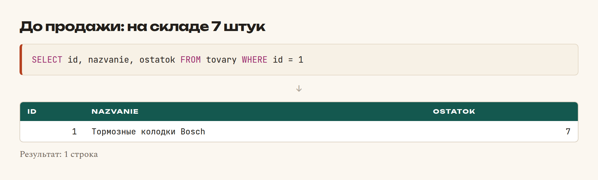
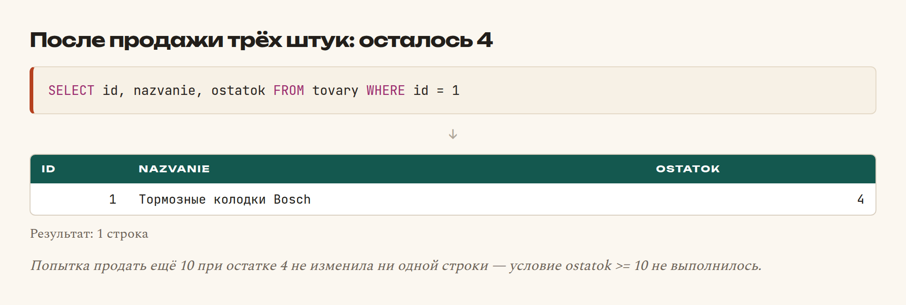

# Глава 28. INSERT, UPDATE, DELETE

> **Часть VI. База данных** · Глава 28 из 60
> [← Глава 27](27-select.md) · [Глава 29 →](29-join.md)

## 🎯 Зачем эта глава

`SELECT` только читает. Теперь научимся менять данные: добавлять товары,
обновлять остатки, скрывать снятое с продажи.

Эти три команды опаснее `SELECT`. Ошиблись в выборке — увидели не то.
Ошиблись в `UPDATE` — **испортили данные**, и без резервной копии
их не вернуть.

Поэтому в этой главе будет много предупреждений. Не пропускайте их: описанные
ошибки совершали все, включая автора.

## 📖 INSERT — добавляем

### **Одна строка**

```sql
INSERT INTO tovary (nazvanie, artikul, brend, kategoriya, cena, ostatok)
VALUES ('Стойка амортизатора KYB', '341341', 'KYB', 'Подвеска', 42000, 5);
```

Порядок значений в `VALUES` должен совпадать с порядком столбцов в скобках.

⚠️ **Всегда перечисляйте столбцы явно.** Можно написать короче:

```sql
INSERT INTO tovary VALUES (NULL, 'Название', ...);   -- ❌ так не надо
```

Но тогда запрос сломается, как только кто-то добавит столбец в таблицу.
А произойдёт это обязательно.

### **Несколько строк сразу**

```sql
INSERT INTO tovary (nazvanie, artikul, brend, kategoriya, cena, ostatok) VALUES
('Свечи NGK Iridium',    'ILKAR7B11', 'NGK',    'Зажигание', 15000, 6),
('Ремень ГРМ Bosch',     '1987949095','Bosch',  'Двигатель', 31000, 3),
('Тормозная жидкость',   '1987479107','Bosch',  'Тормоза',    3900, 31);
```

Один запрос вместо трёх — **в разы быстрее**. Когда будете загружать прайс-лист
поставщика на десять тысяч позиций, разница окажется между «полторы минуты»
и «сорок минут».

Обычно вставляют пачками по 500–1000 строк.

### **Что вернётся**

После вставки база знает номер новой строки:

```sql
SELECT LAST_INSERT_ID();
```

В PHP это будет `$pdo->lastInsertId()` — понадобится в главе 41, когда будем
создавать заказ и сразу добавлять к нему товары.

### **Если такая строка уже есть**

```sql
-- Не вставлять, если конфликт с уникальным ключом
INSERT IGNORE INTO tovary (artikul, nazvanie, ...) VALUES (...);

-- Вставить или обновить существующую
INSERT INTO tovary (artikul, nazvanie, cena, ostatok)
VALUES ('W71280', 'Масляный фильтр Mann', 4500, 23)
ON DUPLICATE KEY UPDATE
    cena = VALUES(cena),
    ostatok = VALUES(ostatok);
```

**`ON DUPLICATE KEY UPDATE`** — крайне полезная штука. Читается: «попробуй
вставить, а если такой артикул уже есть — обнови цену и остаток».

Именно так загружают прайс-листы: новые товары добавляются, у существующих
обновляются цены. Одним запросом, без предварительных проверок.

## 📖 UPDATE — изменяем

```sql
UPDATE tovary
SET cena = 26000
WHERE id = 1;
```

Несколько полей сразу:

```sql
UPDATE tovary
SET cena = 26000,
    ostatok = 5,
    izmenen = NOW()
WHERE id = 1;
```

### **⚠️ Самая дорогая ошибка в SQL**

```sql
UPDATE tovary SET cena = 26000;
```

Заметили? **Нет `WHERE`.** Этот запрос поставит цену 26000 **всем товарам
в таблице**.

Отменить нельзя. Только восстановить из резервной копии — если она есть.

**Правило, которое стоит превратить в рефлекс:**

> Сначала пишете `WHERE`, потом всё остальное.

Ещё надёжнее — **проверить выборкой перед изменением**:

```sql
-- 1. Сначала посмотреть, что затронется
SELECT id, nazvanie, cena FROM tovary WHERE brend = 'Bosch';

-- 2. Убедились, что строки те самые — только теперь менять
UPDATE tovary SET cena = cena * 1.1 WHERE brend = 'Bosch';
```

Тридцать секунд на проверку против часов восстановления. Так делают все, кто
однажды обжёгся.

### **Изменение относительно текущего значения**

```sql
UPDATE tovary SET ostatok = ostatok - 1 WHERE id = 1;
UPDATE tovary SET cena = ROUND(cena * 1.1) WHERE brend = 'Bosch';
```

Это важный приём. Сравните два способа уменьшить остаток:

```sql
-- ❌ Опасно: между чтением и записью кто-то мог купить
SELECT ostatok FROM tovary WHERE id = 1;   -- получили 7
UPDATE tovary SET ostatok = 6 WHERE id = 1;

-- ✅ Безопасно: база сама вычтет от текущего значения
UPDATE tovary SET ostatok = ostatok - 1 WHERE id = 1 AND ostatok > 0;
```

Первый вариант — классическая ошибка «состояния гонки»: два покупателя
одновременно оформили последнюю единицу, и остаток ушёл в минус.

Второй вариант защищает: `AND ostatok > 0` не даст уйти ниже нуля.

### **Ограничение количества**

```sql
UPDATE tovary SET aktivnyi = 0 WHERE brend = 'NGK' LIMIT 1;
```

`LIMIT` в `UPDATE` работает и служит страховкой: если условие вдруг окажется
шире, чем вы думали, пострадает одна строка, а не тысяча.

## 📖 DELETE — удаляем

```sql
DELETE FROM tovary WHERE id = 12;
```

⚠️ **То же смертельное правило: без `WHERE` удалится вся таблица.**

```sql
DELETE FROM tovary;   -- ❌ пустая таблица
```

### **Но чаще удалять не нужно**

Помните мягкое удаление из главы 26?

```sql
-- Вместо DELETE
UPDATE tovary SET aktivnyi = 0 WHERE id = 12;
```

Товар исчезает из каталога, но остаётся в базе. Причины:

- он может быть в чьём-то заказе — история не сломается;
- удалили по ошибке — вернуть можно одной командой;
- статистика за прошлый год останется правдивой.

**В боевых системах физическое удаление применяется редко:** для временных
данных, корзин, логов старше года, сессий.

### **Когда всё-таки удаляют**

```sql
-- Чистка старых записей
DELETE FROM sessii WHERE sozdana < DATE_SUB(NOW(), INTERVAL 30 DAY);

-- Убрать позицию из корзины
DELETE FROM korzina WHERE polzovatel_id = 42 AND tovar_id = 7;
```

### **TRUNCATE — очистить таблицу целиком**

```sql
TRUNCATE TABLE vremennye_dannye;
```

Быстрее, чем `DELETE`, и сбрасывает счётчик `AUTO_INCREMENT`.
Но **отменить нельзя вообще** — используйте только для временных таблиц.

## 📖 Транзакции — всё или ничего

Представьте оформление заказа:

1. создать запись заказа;
2. добавить товары в заказ;
3. уменьшить остатки на складе.

Что будет, если между вторым и третьим шагом оборвётся связь? Заказ есть,
товары есть, а склад показывает старые остатки. Данные разошлись.

**Транзакция** решает это:

```sql
START TRANSACTION;

INSERT INTO zakazy (klient, summa) VALUES ('Фирдавс', 76200);
INSERT INTO zakaz_tovary (zakaz_id, tovar_id, kolichestvo) VALUES (LAST_INSERT_ID(), 1, 3);
UPDATE tovary SET ostatok = ostatok - 3 WHERE id = 1;

COMMIT;
```

| Команда | Что делает |
|---|---|
| `START TRANSACTION` | Начать. Изменения пока «черновые» |
| `COMMIT` | Записать всё разом |
| `ROLLBACK` | Отменить всё, как будто ничего не было |

**Правило: всё выполнится или ничего.** Промежуточного состояния не бывает.

⚠️ Транзакции работают **только на InnoDB**. Вот зачем в главе 26 мы указывали
движок явно.

Подробно разберём в главе 41, когда будем оформлять заказ по-настоящему.

## 📖 Резервные копии

Раз уж мы говорим об опасных операциях — про копии.

```bash
# Сделать копию всей базы
mysqldump -u root -p magazin > kopiya.sql

# Восстановить
mysql -u root -p magazin < kopiya.sql
```

**Три правила, которые пишутся кровью:**

1. **Делайте копию перед любым массовым изменением.** Тридцать секунд против
   потерянного дня.
2. **Проверяйте, что копия разворачивается.** Копия, которую никогда
   не восстанавливали, — это не копия, а надежда.
3. **Храните копию не на том же сервере.** Сгорел диск — сгорело всё.

На боевом сайте копии делаются автоматически, каждую ночь, и хранятся
за последние 30 дней. Займёмся этим в главе 57.

## 💻 Типичные операции магазина

```sql
-- Добавить товар
INSERT INTO tovary (nazvanie, artikul, brend, kategoriya, cena, ostatok)
VALUES ('Стойка амортизатора KYB', '341341', 'KYB', 'Подвеска', 42000, 5);

-- Обновить цену одного товара
UPDATE tovary SET cena = 26000, izmenen = NOW() WHERE id = 1;

-- Поднять цены бренда на 10%
UPDATE tovary SET cena = ROUND(cena * 1.1) WHERE brend = 'Bosch' AND aktivnyi = 1;

-- Продали три штуки — уменьшить остаток безопасно
UPDATE tovary SET ostatok = ostatok - 3 WHERE id = 1 AND ostatok >= 3;

-- Снять с продажи, не удаляя
UPDATE tovary SET aktivnyi = 0 WHERE id = 12;

-- Вернуть в продажу
UPDATE tovary SET aktivnyi = 1 WHERE id = 12;

-- Обнулить остатки бренда, который больше не возим
UPDATE tovary SET ostatok = 0, aktivnyi = 0 WHERE brend = 'NGK';

-- Загрузка прайса: новые добавить, у существующих обновить цену
INSERT INTO tovary (artikul, nazvanie, brend, kategoriya, cena, ostatok)
VALUES ('W71280', 'Масляный фильтр Mann', 'Mann', 'Фильтры', 4700, 30)
ON DUPLICATE KEY UPDATE cena = VALUES(cena), ostatok = VALUES(ostatok);

-- Почистить старые корзины
DELETE FROM korzina WHERE izmenena < DATE_SUB(NOW(), INTERVAL 60 DAY);
```

## 🖥 На экране

Посмотрим, как работает безопасное уменьшение остатка. Было 7 штук:



Выполняем `UPDATE tovary SET ostatok = ostatok - 3 WHERE id = 1 AND ostatok >= 3`:



Теперь попробуем продать ещё 10 штук при остатке 4. Условие `ostatok >= 10`
не выполнится, и **запрос не изменит ничего** — вместо того чтобы увести
остаток в минус.

## 🔤 Разбор по словам

| Запись | Что делает |
|---|---|
| `INSERT INTO ... VALUES` | Добавить строку |
| Несколько наборов через запятую | Вставить пачкой. **Гораздо быстрее** |
| `LAST_INSERT_ID()` | Номер только что добавленной строки |
| `INSERT IGNORE` | Не падать при дубле |
| `ON DUPLICATE KEY UPDATE` | Вставить или обновить. **Загрузка прайсов** |
| `UPDATE ... SET ... WHERE` | Изменить. **`WHERE` обязателен** |
| `SET ostatok = ostatok - 1` | Изменить относительно текущего |
| `DELETE FROM ... WHERE` | Удалить. **`WHERE` обязателен** |
| `TRUNCATE TABLE` | Очистить целиком. Необратимо |
| `START TRANSACTION` / `COMMIT` / `ROLLBACK` | Всё или ничего |
| `NOW()` | Текущие дата и время |
| `DATE_SUB(NOW(), INTERVAL 30 DAY)` | Тридцать дней назад |
| `mysqldump` | Сделать резервную копию |

## ⚠️ Грабли

**`UPDATE` или `DELETE` без `WHERE`.** Самая дорогая ошибка в SQL.
Пишите `WHERE` первым делом.

**Не проверить выборкой перед изменением.** Тридцать секунд экономии против
часов восстановления.

**Читать, потом писать вместо `ostatok = ostatok - 1`.** Два одновременных
заказа уведут остаток в минус.

**Забыть защиту `AND ostatok >= N`.** Остаток станет отрицательным.

**Физически удалять то, что связано с заказами.** История сломается.

**Вставлять строки по одной в цикле.** На больших объёмах — часы вместо минут.

**Не делать копию перед массовой операцией.** Один раз обожжётесь — будете
делать всегда.

**Считать, что транзакция сработала на MyISAM.** Не сработает, `ROLLBACK`
ничего не отменит.

## 🏋️ Задачи

⚠️ Перед выполнением сделайте копию своей учебной базы.

**Задача 28.1.** Добавьте три товара одним запросом.

**Задача 28.2.** Поднимите цену всех товаров категории «Тормоза» на 15%.
Сначала посмотрите выборкой, что затронется.

**Задача 28.3.** Уменьшите остаток товара №2 на 5 штук безопасным способом.
Потом попробуйте уменьшить ещё на 100 — что произошло?

**Задача 28.4.** Снимите с продажи все товары, которых нет в наличии.
Не удаляйте.

**Задача 28.5.** Что сделает каждый запрос? Отвечайте **не выполняя**:

```sql
UPDATE tovary SET cena = 0;
DELETE FROM tovary WHERE brend = 'Bosch';
UPDATE tovary SET ostatok = ostatok + 10 WHERE kategoriya = 'Фильтры';
TRUNCATE TABLE tovary;
```

**Задача 28.6.** Напишите запрос загрузки прайса, который добавит новый товар
или обновит цену существующего по артикулу.

**Задача 28.7.** Сделайте копию базы через `mysqldump`, удалите пару товаров,
восстановите из копии. Убедитесь, что вернулись.

**Задача 28.8.** Напишите цепочку из трёх запросов для оформления заказа
и оберните в транзакцию.

**Задача 28.9.** Найдите опасность:

```sql
SELECT ostatok FROM tovary WHERE id = 5;
-- в PHP: $novyi = $ostatok - $kolichestvo;
UPDATE tovary SET ostatok = 3 WHERE id = 5;
```

*Ответы — в [Приложении Г](../prilozheniya/4-G-otvety.md).*

## 🔗 В бою

В `sql/` этого репозитория лежат миграции. Посмотрите, как они написаны:
везде `IF NOT EXISTS` и проверки перед изменением.

А в `includes/` найдите код уменьшения остатков при заказе. Там будет ровно
`ostatok = ostatok - ?` с условием на неотрицательность — не потому, что так
красивее, а потому, что при двух одновременных заказах иначе получается минус.

Такие вещи не придумываются заранее. Они появляются после первого случая,
когда покупатель заказал товар, которого уже не было.

И ещё: в боевом коде вы **не найдёте `DELETE`** для товаров и заказов.
Только `aktivnyi = 0` и смена статуса. Данные не выбрасывают.

## 📌 Итог

- `INSERT INTO ... VALUES` — добавить. Столбцы перечисляйте **явно**.
- Вставка пачкой в разы быстрее вставки по одной.
- `ON DUPLICATE KEY UPDATE` — вставить или обновить. Так грузят прайсы.
- **`UPDATE` и `DELETE` без `WHERE` портят всю таблицу.** Пишите `WHERE` первым.
- **Проверяйте выборкой перед изменением.**
- `ostatok = ostatok - 1` вместо «прочитал → посчитал → записал».
- Защищайтесь условием `AND ostatok >= N`.
- **Мягкое удаление** вместо `DELETE` для всего, что связано с историей.
- Транзакции — всё или ничего. Только InnoDB.
- Резервная копия перед любой массовой операцией.

Дальше — JOIN: научимся соединять таблицы.

[← Глава 27](27-select.md) · [Глава 29. JOIN →](29-join.md)
