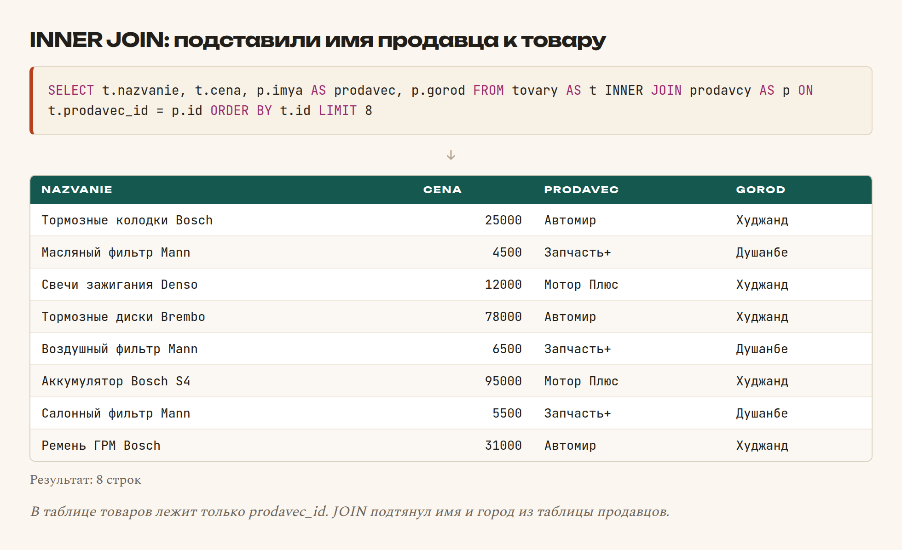
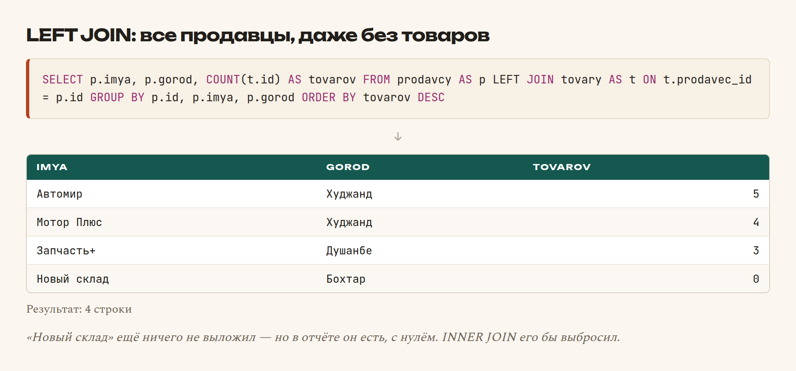
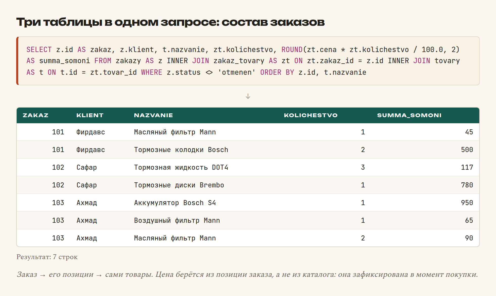
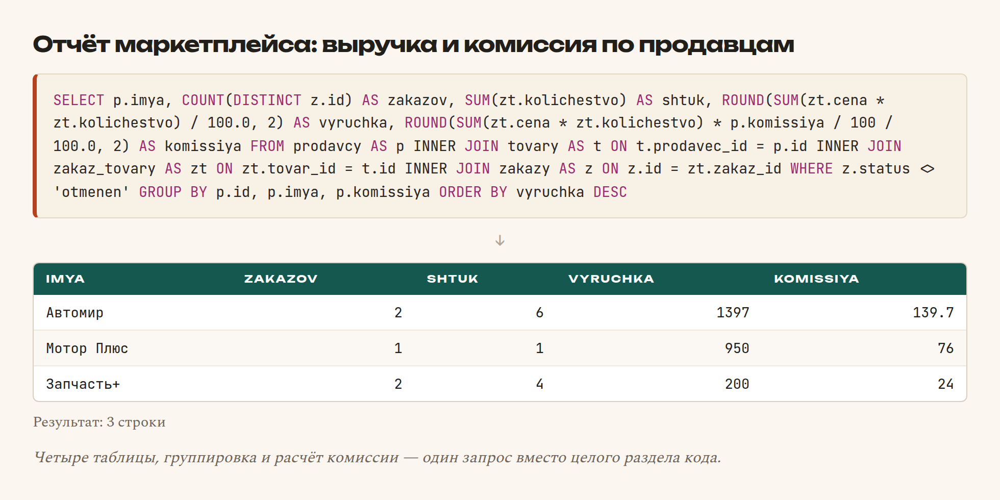

# Глава 29. JOIN: связываем таблицы

> **Часть VI. База данных** · Глава 29 из 60
> [← Глава 28](28-insert-update-delete.md) · [Глава 30 →](30-indeksy.md)

## 🎯 Зачем эта глава

В главе 26 мы договорились не дублировать данные: продавцы отдельно, товары
отдельно, товар лишь ссылается на продавца номером.

Отлично для хранения. Но теперь в каталоге нужно показать **имя** продавца,
а в таблице товаров лежит только `prodavec_id = 3`.

`JOIN` — команда, которая соединяет таблицы по этой связи. Это тема, на которой
новички буксуют дольше всего, и одновременно та, без которой невозможно
написать ни один настоящий отчёт.

Разберём медленно и на картинках.

## 📖 Как связаны таблицы

Вот наши три таблицы:

```
prodavcy                tovary                     zakaz_tovary
├── id           ←──┐   ├── id            ←────┐   ├── id
├── imya            └── ├── prodavec_id        └── ├── tovar_id
├── gorod              ├── nazvanie              ├── zakaz_id  ──→ zakazy.id
└── komissiya          ├── cena                  ├── kolichestvo
                       └── ostatok               └── cena
```

Стрелка означает: «в этом поле лежит `id` строки из другой таблицы».

- `tovary.prodavec_id` указывает на `prodavcy.id`;
- `zakaz_tovary.tovar_id` указывает на `tovary.id`;
- `zakaz_tovary.zakaz_id` указывает на `zakazy.id`.

Такие поля называются **внешними ключами**. Они и есть та ниточка, по которой
`JOIN` соединяет строки.

## 📖 INNER JOIN — только совпадения

```sql
SELECT t.nazvanie, t.cena, p.imya AS prodavec, p.gorod
FROM tovary AS t
INNER JOIN prodavcy AS p ON t.prodavec_id = p.id
ORDER BY t.id
LIMIT 8;
```



### **Разбираем по частям**

| Часть | Что означает |
|---|---|
| `FROM tovary AS t` | Основная таблица. `t` — короткое имя (псевдоним) |
| `INNER JOIN prodavcy AS p` | Присоединяем таблицу продавцов, псевдоним `p` |
| `ON t.prodavec_id = p.id` | **По какому условию соединять** |
| `t.nazvanie`, `p.imya` | Указываем, из какой таблицы столбец |

**Псевдонимы (`AS t`, `AS p`) не обязательны, но крайне удобны.** Без них
пришлось бы писать `tovary.nazvanie` и `prodavcy.imya` — длинно, а в запросе
на пять таблиц ещё и нечитаемо.

**`ON` — это сердце `JOIN`.** Здесь вы объясняете базе, какие строки считать
связанными. Забыли `ON` — база соединит **каждую строку с каждой**, и вместо
двенадцати товаров получите сорок восемь строк мусора.

### **Ключевое свойство INNER JOIN**

**Он возвращает только те строки, для которых нашлась пара.**

Если у товара `prodavec_id` пустой или указывает на несуществующего продавца —
товар в результат **не попадёт**. Молча.

Это одновременно и удобно, и опасно: каталог может «потерять» товары,
а вы даже не заметите. Именно поэтому существует второй вид соединения.

## 📖 LEFT JOIN — все строки левой таблицы

```sql
SELECT p.imya, p.gorod, COUNT(t.id) AS tovarov
FROM prodavcy AS p
LEFT JOIN tovary AS t ON t.prodavec_id = p.id
GROUP BY p.id, p.imya, p.gorod
ORDER BY tovarov DESC;
```



Обратите внимание на последнюю строку: продавец **«Новый склад» без единого
товара** всё равно в списке, с нулём.

**`INNER JOIN` его бы выбросил.** А для отчёта «сколько товаров у каждого
продавца» это была бы ошибка: администратор не увидел бы, что новый продавец
ещё ничего не выложил.

### **Разница на одной строке**

| Соединение | Что вернёт |
|---|---|
| `INNER JOIN` | Только строки, у которых **есть пара** в обеих таблицах |
| `LEFT JOIN` | **Все** строки левой таблицы, даже без пары. Недостающее — `NULL` |
| `RIGHT JOIN` | То же, но наоборот. Используется редко |

**Практическое правило:**

- Показываете список **с обязательной связью** (товары с брендом) — `INNER JOIN`.
- Строите **отчёт** (продавцы и их товары, покупатели и их заказы) — `LEFT JOIN`,
  иначе потеряете тех, у кого пусто.

### **Ловушка с COUNT в LEFT JOIN**

⚠️ Заметьте: в примере написано `COUNT(t.id)`, а не `COUNT(*)`.

Разница принципиальная. Для продавца без товаров `LEFT JOIN` создаст одну строку,
где все поля товара — `NULL`. И тогда:

- `COUNT(*)` посчитает эту строку и вернёт **1**;
- `COUNT(t.id)` не считает `NULL` и вернёт **0** — правильно.

Классическая ошибка отчётов: у всех «нулевых» оказывается по одному.

## 📖 Соединяем три таблицы

```sql
SELECT z.id AS zakaz,
       z.klient,
       t.nazvanie,
       zt.kolichestvo,
       ROUND(zt.cena * zt.kolichestvo / 100.0, 2) AS summa_somoni
FROM zakazy AS z
INNER JOIN zakaz_tovary AS zt ON zt.zakaz_id = z.id
INNER JOIN tovary AS t ON t.id = zt.tovar_id
WHERE z.status <> 'otmenen'
ORDER BY z.id, t.nazvanie;
```



`JOIN` можно писать сколько угодно раз подряд. Каждый следующий присоединяется
к тому, что уже получилось.

**Порядок соединений влияет на читаемость, а не на результат.** Идите
по логике данных: заказ → его позиции → сами товары.

### **Почему цена лежит в `zakaz_tovary`**

Присмотритесь: цена берётся из `zt.cena`, а не из `t.cena`.

Это важное проектное решение. **Цена в заказе фиксируется в момент покупки.**
Завтра товар подорожает, но в старом заказе должна остаться та цена,
по которой человек купил.

Если брать цену из таблицы товаров, вся история заказов начнёт «переписываться»
задним числом при каждом изменении прайса. Бухгалтерия сойдёт с ума.

**Правило: данные, которые должны остаться неизменными, копируются в момент
события.** Это одно из немногих оправданных дублирований.

## 📖 Отчёты — вот где JOIN раскрывается

```sql
-- Сколько заработал каждый продавец
SELECT p.imya,
       COUNT(DISTINCT z.id) AS zakazov,
       SUM(zt.kolichestvo) AS shtuk,
       ROUND(SUM(zt.cena * zt.kolichestvo) / 100.0, 2) AS vyruchka,
       ROUND(SUM(zt.cena * zt.kolichestvo) * p.komissiya / 100 / 100.0, 2) AS komissiya
FROM prodavcy AS p
INNER JOIN tovary AS t ON t.prodavec_id = p.id
INNER JOIN zakaz_tovary AS zt ON zt.tovar_id = t.id
INNER JOIN zakazy AS z ON z.id = zt.zakaz_id
WHERE z.status <> 'otmenen'
GROUP BY p.id, p.imya, p.komissiya
ORDER BY vyruchka DESC;
```



Один запрос — и готов отчёт, за который в маркетплейсе отвечает целый раздел
админки. Ни одного цикла в PHP.

⚠️ **`COUNT(DISTINCT z.id)`** — считает **уникальные** заказы. Без `DISTINCT`
заказ с тремя позициями посчитался бы трижды.

Это вторая классическая ошибка отчётов после `COUNT(*)` в `LEFT JOIN`.

## 📖 Ещё пара приёмов

### **Соединение таблицы с самой собой**

```sql
-- Товары того же продавца, что и товар №1
SELECT t2.nazvanie
FROM tovary AS t1
INNER JOIN tovary AS t2 ON t2.prodavec_id = t1.prodavec_id AND t2.id <> t1.id
WHERE t1.id = 1;
```

Одна и та же таблица под двумя псевдонимами. Так строят «похожие товары»
и иерархии категорий.

### **JOIN с условием против WHERE**

```sql
-- Условие в ON: влияет на соединение
LEFT JOIN zakazy AS z ON z.klient_id = k.id AND z.status = 'dostavlen'

-- Условие в WHERE: отсекает строки после соединения
LEFT JOIN zakazy AS z ON z.klient_id = k.id
WHERE z.status = 'dostavlen'
```

⚠️ Разница огромная и неочевидная.

В первом случае клиенты **без** доставленных заказов останутся в результате
с `NULL`. Во втором — исчезнут, потому что `WHERE` отбросит строки с `NULL`,
и `LEFT JOIN` превратится в `INNER JOIN`.

**Правило: условия на присоединяемую таблицу в `LEFT JOIN` пишите в `ON`,
а не в `WHERE`.**

## 🔤 Разбор по словам

| Запись | Что делает |
|---|---|
| `INNER JOIN ... ON` | Соединить, оставив **только совпадения** |
| `LEFT JOIN ... ON` | Оставить **все строки левой** таблицы |
| `ON t.prodavec_id = p.id` | Условие соединения. **Сердце JOIN** |
| `AS t` | Псевдоним таблицы |
| `t.nazvanie` | Столбец из конкретной таблицы |
| `COUNT(t.id)` | Считать **не-NULL**. В LEFT JOIN — обязательно |
| `COUNT(DISTINCT z.id)` | Считать **уникальные** значения |
| Внешний ключ | Поле, хранящее `id` из другой таблицы |

## ⚠️ Грабли

**Забыть `ON`.** Каждая строка соединится с каждой. Двенадцать товаров
и четыре продавца дадут сорок восемь строк.

**`INNER JOIN` там, где нужен `LEFT`.** Из отчёта тихо исчезнут те, у кого
нет связанных записей.

**`COUNT(*)` в `LEFT JOIN`.** У всех «пустых» окажется по единице вместо нуля.

**Забыть `DISTINCT` при подсчёте заказов.** Заказ из трёх позиций посчитается
трижды.

**Условие на правую таблицу в `WHERE` при `LEFT JOIN`.** Превращает его
в `INNER JOIN`.

**Брать цену из таблицы товаров в отчёте по заказам.** История начнёт меняться
задним числом.

**Соединять по неиндексированному полю.** Запрос будет чудовищно медленным.
Индексы — следующая глава.

## 🏋️ Задачи

**Задача 29.1.** Выведите все товары с именем продавца и его городом.

**Задача 29.2.** Выведите всех продавцов и количество их товаров. Продавцы
без товаров должны остаться в списке с нулём.

**Задача 29.3.** Выведите состав заказа №103: названия товаров, количество,
цена, сумма по позиции.

**Задача 29.4.** Посчитайте сумму каждого заказа. Одним запросом,
с группировкой.

**Задача 29.5.** Найдите товары, которые никто ни разу не заказывал.
Подсказка: `LEFT JOIN` и `IS NULL`.

**Задача 29.6.** Выведите продавцов из Худжанда и общую стоимость их склада.

**Задача 29.7.** Какие клиенты заказывали товары бренда Bosch?

**Задача 29.8.** Что вернёт каждый запрос? Ответьте, потом проверьте:

```sql
SELECT COUNT(*) FROM tovary INNER JOIN prodavcy ON tovary.prodavec_id = prodavcy.id;
SELECT COUNT(*) FROM tovary LEFT JOIN prodavcy ON tovary.prodavec_id = prodavcy.id;
SELECT COUNT(*) FROM tovary, prodavcy;
```

Третий запрос особенно поучителен — объясните результат.

**Задача 29.9.** Постройте отчёт: по каждой категории — сколько заказано штук
и на какую сумму. Только по неотменённым заказам.

**Задача 29.10.** Найдите ошибку:

```sql
SELECT k.imya, COUNT(*) AS zakazov
FROM klienty AS k
LEFT JOIN zakazy AS z ON z.klient_id = k.id
WHERE z.status = 'dostavlen'
GROUP BY k.id;
```

Две проблемы.

*Ответы — в [Приложении Г](../prilozheniya/G-otvety.md).*

## 🔗 В бою

Откройте `admin/orders.php` или `seller/orders.php` в этом репозитории.
Найдёте запросы с двумя-тремя `JOIN`: заказ → позиции → товары → продавец.

Особенно посмотрите на расчёт выплат продавцам в `includes/seller_finance.php`.
Там `JOIN` соединяет заказы, позиции и продавцов, а комиссия считается прямо
в запросе.

Одна боевая деталь, которую вы там увидите: **комиссия хранится в самой записи
заказа**, а не берётся из таблицы продавцов.

Причина та же, что с ценой: условия сотрудничества могут измениться,
но по старым заказам продавцу должны заплатить по тем правилам, что действовали
в момент продажи. Иначе — конфликт и справедливые претензии.

## 📌 Итог

- **Внешний ключ** — поле, хранящее `id` строки другой таблицы.
- `INNER JOIN` — только совпадения. `LEFT JOIN` — все строки левой таблицы.
- **`ON` обязателен**, иначе каждая строка соединится с каждой.
- Псевдонимы `AS t` делают запрос читаемым.
- В `LEFT JOIN` считайте `COUNT(pole)`, а не `COUNT(*)`.
- `COUNT(DISTINCT id)` при подсчёте заказов с несколькими позициями.
- Условие на правую таблицу в `LEFT JOIN` — в `ON`, не в `WHERE`.
- **Цена и комиссия фиксируются в момент события**, а не берутся из справочника.
- Отчёт, который в PHP занял бы сто строк, в SQL — один запрос.

Дальше — почему всё это может работать медленно и как ускорить.

[← Глава 28](28-insert-update-delete.md) · [Глава 30. Индексы →](30-indeksy.md)
