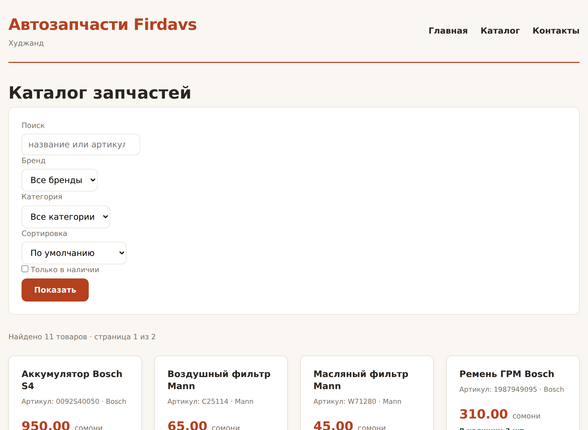

# Глава 32. PDO: подключаемся к базе

> **Часть VII. PHP + база = живой сайт** · Глава 32 из 60
> [← Глава 31](31-praktika-shema-bd.md) · [Глава 33 →](33-podgotovlennye-zaprosy.md)

## 🎯 Зачем эта глава

База спроектирована, PHP освоен. Осталось их познакомить.

В этой главе научимся подключаться к MySQL из PHP, выполнять запросы
и — что важнее — **правильно организовать подключение**, чтобы не пришлось
переделывать через месяц.

Плюс разберём тему, которую обычно откладывают и потом жалеют: **куда девать
пароль от базы**, чтобы он не попал в репозиторий.

## 📖 PDO — единый способ говорить с базой

**PDO** (*PHP Data Objects*) — встроенный в PHP слой для работы с базами.

Есть и другие способы (старый `mysql_*`, чуть менее старый `mysqli`),
но PDO лучше по трём причинам:

1. **Один код для разных баз.** Переехали с MySQL на PostgreSQL — меняется
   одна строка подключения.
2. **Подготовленные запросы из коробки** — защита от SQL-инъекций (глава 33).
3. **Понятные ошибки** через исключения.

⚠️ Если увидите в старом коде или статье функции `mysql_query`, `mysql_connect` —
**не используйте их**. Они удалены из PHP 7 и небезопасны.

## 📖 Подключение

```php
$dsn = 'mysql:host=localhost;dbname=magazin;charset=utf8mb4';
$polzovatel = 'root';
$parol = '';

$pdo = new PDO($dsn, $polzovatel, $parol, [
    PDO::ATTR_ERRMODE            => PDO::ERRMODE_EXCEPTION,
    PDO::ATTR_DEFAULT_FETCH_MODE => PDO::FETCH_ASSOC,
    PDO::ATTR_EMULATE_PREPARES   => false,
]);
```

### **Разбор строки подключения**

```
mysql:host=localhost;dbname=magazin;charset=utf8mb4
  │        │              │              │
  │        │              │              └─ кодировка
  │        │              └─ имя базы
  │        └─ где сервер
  └─ какая СУБД
```

⚠️ **`charset=utf8mb4` обязателен.** Без него русский текст может приехать
в другой кодировке — те самые кракозябры, только теперь из базы.

### **Три настройки, которые надо задать всегда**

| Настройка | Что делает | Почему нужна |
|---|---|---|
| `ERRMODE_EXCEPTION` | Ошибки бросают исключение | Иначе PDO **молча** вернёт `false`, и вы будете искать причину часами |
| `FETCH_ASSOC` | Результат — ассоциативный массив | По умолчанию PDO отдаёт данные **дважды**: и по имени, и по номеру. Лишняя память |
| `EMULATE_PREPARES => false` | Настоящие подготовленные запросы | Не эмуляция средствами PHP, а реальная работа на стороне базы |

Эти три строки стоит просто запомнить и писать всегда. Каждая закрывает
реальную проблему.

## 📖 Куда девать пароль

Вот тема, которую нельзя откладывать.

### **Как делать нельзя**

```php
// config.php — файл лежит в репозитории
define('DB_PAROL', 'SuperSecret123');
```

Загрузили проект на GitHub — пароль от базы стал публичным. И даже если удалить
его следующим коммитом, **он останется в истории git навсегда**.

Существуют программы, которые круглосуточно сканируют GitHub в поисках паролей
и ключей. Находят за минуты.

### **Как правильно**

Держите настройки в файле, который **не попадает в репозиторий**:

```
config/
├── db.php              ← общие настройки, в git
└── db_credentials.php  ← пароли, в .gitignore
```

```php
// config/db.php — в репозитории
$nastroyki = [
    'host'    => 'localhost',
    'baza'    => 'magazin',
    'charset' => 'utf8mb4',
];

// Пароли подтягиваем из файла, которого нет в git
$sekrety = __DIR__ . '/db_credentials.php';
if (!file_exists($sekrety)) {
    exit('Нет файла с доступами. Скопируйте db_credentials.example.php');
}
$nastroyki = array_merge($nastroyki, require $sekrety);
```

```php
// config/db_credentials.php — в .gitignore
return [
    'polzovatel' => 'magazin_user',
    'parol'      => 'настоящий_пароль',
];
```

```
# .gitignore
config/db_credentials.php
```

И обязательно положите рядом **пример** — `db_credentials.example.php`
с пустыми значениями. Тогда новый разработчик сразу поймёт, что нужно создать.

**Второй способ** — переменные окружения:

```php
$parol = getenv('DB_PAROL') ?: '';
```

Так делают на современных хостингах и в контейнерах. Пароль задаётся
в настройках сервера, а в коде его нет вообще.

⚠️ **Правило без исключений: секретов в репозитории быть не должно.**
Ни паролей, ни ключей API, ни токенов. Никогда.

## 📖 Подключение в одном месте

```php
<?php
// includes/db.php

/**
 * Подключение к базе. Создаётся один раз за запрос и переиспользуется.
 */
function db(): PDO
{
    static $pdo = null;

    if ($pdo !== null) {
        return $pdo;
    }

    $nastroyki = require __DIR__ . '/../config/db.php';

    $dsn = sprintf(
        'mysql:host=%s;dbname=%s;charset=%s',
        $nastroyki['host'],
        $nastroyki['baza'],
        $nastroyki['charset']
    );

    try {
        $pdo = new PDO($dsn, $nastroyki['polzovatel'], $nastroyki['parol'], [
            PDO::ATTR_ERRMODE            => PDO::ERRMODE_EXCEPTION,
            PDO::ATTR_DEFAULT_FETCH_MODE => PDO::FETCH_ASSOC,
            PDO::ATTR_EMULATE_PREPARES   => false,
        ]);
    } catch (PDOException $e) {
        // Покупателю — вежливо, в лог — подробно.
        // Текст ошибки PDO содержит адрес сервера и имя пользователя,
        // показывать его посетителю нельзя.
        error_log('Не удалось подключиться к базе: ' . $e->getMessage());
        http_response_code(503);
        exit('Сайт временно недоступен. Попробуйте через несколько минут.');
    }

    return $pdo;
}
```

### **Что здесь важного**

**`static $pdo`** — переменная, которая **помнит значение между вызовами**
функции. Подключение создастся один раз, а при повторных вызовах вернётся готовое.

Без этого каждый вызов `db()` открывал бы новое соединение — а их количество
у базы ограничено.

**`try / catch`** — обработка исключений. Если подключение не удалось, PDO
бросает `PDOException`, и мы её ловим.

**Разные сообщения для лога и для человека.** Текст ошибки PDO содержит имя
сервера, базы и пользователя. Показать его посетителю — значит выдать половину
информации, нужной для взлома.

**Правило: подробности — в лог, посетителю — вежливое сообщение.**

## 📖 Выполняем запросы

### **Запрос без данных от пользователя**

```php
$stroki = db()->query('SELECT id, nazvanie, cena FROM tovary WHERE aktivnyi = 1')
              ->fetchAll();

foreach ($stroki as $t) {
    echo $t['nazvanie'];
}
```

`query()` годится **только** когда в запросе нет ничего от пользователя.
Как только появляются данные извне — нужны подготовленные запросы (глава 33).

### **Способы забрать результат**

```php
$st = db()->query('SELECT * FROM tovary');

$vse = $st->fetchAll();        // все строки массивом
$odna = $st->fetch();          // одна строка, потом следующая
$znachenie = $st->fetchColumn(); // одно значение из первого столбца
```

Для одного значения — `fetchColumn()`:

```php
$vsego = db()->query('SELECT COUNT(*) FROM tovary WHERE aktivnyi = 1')
             ->fetchColumn();
```

### **Когда результат большой**

```php
// ❌ Сто тысяч строк в память разом
$vse = db()->query('SELECT * FROM tovary')->fetchAll();

// ✅ По одной строке
$st = db()->query('SELECT * FROM tovary');
while ($t = $st->fetch()) {
    // обрабатываем
}
```

`fetchAll()` удобен, но грузит **всё** в память. Для каталога на двадцать
товаров — нормально. Для выгрузки прайса на сто тысяч — способ уронить сервер.

## 📖 Вспомогательные функции

Писать `db()->prepare(...)->execute(...)->fetchAll()` каждый раз утомительно.
Сделаем короткие обёртки:

```php
<?php
// includes/db.php (продолжение)

/** Много строк. */
function zapros(string $sql, array $parametry = []): array
{
    $st = db()->prepare($sql);
    $st->execute($parametry);
    return $st->fetchAll();
}

/** Одна строка или null. */
function zapros_odin(string $sql, array $parametry = []): ?array
{
    $st = db()->prepare($sql);
    $st->execute($parametry);
    $stroka = $st->fetch();
    return $stroka === false ? null : $stroka;
}

/** Одно значение. */
function zapros_znachenie(string $sql, array $parametry = [])
{
    $st = db()->prepare($sql);
    $st->execute($parametry);
    return $st->fetchColumn();
}

/** Изменение данных. Возвращает число затронутых строк. */
function vypolnit(string $sql, array $parametry = []): int
{
    $st = db()->prepare($sql);
    $st->execute($parametry);
    return $st->rowCount();
}

/** Номер только что добавленной строки. */
function posledniy_id(): int
{
    return (int) db()->lastInsertId();
}
```

Теперь код становится коротким:

```php
$tovary = zapros('SELECT * FROM tovary WHERE brend = ?', ['Bosch']);
$tovar  = zapros_odin('SELECT * FROM tovary WHERE id = ?', [42]);
$vsego  = zapros_znachenie('SELECT COUNT(*) FROM tovary WHERE aktivnyi = 1');
$izmeneno = vypolnit('UPDATE tovary SET ostatok = ostatok - ? WHERE id = ?', [3, 42]);
```

Вопросительные знаки — это и есть подготовленные запросы. Подробно разберём
в следующей главе, а пока запомните: **данные передаются отдельно от запроса**.

## 💻 Заменяем массив на базу

Помните обещание из главы 25? Мы вынесли данные за функции, чтобы переход
на базу не потребовал переписывать страницы. Проверим.

**Было** (`includes/tovary.php`):

```php
function vse_tovary(): array {
    return [
        ['id'=>1, 'nazvanie'=>'Тормозные колодки Bosch', ...],
        ['id'=>2, 'nazvanie'=>'Масляный фильтр Mann', ...],
    ];
}

function tovar_po_id(int $id): ?array {
    foreach (vse_tovary() as $t) {
        if ($t['id'] === $id) return $t;
    }
    return null;
}
```

**Стало:**

```php
<?php
// includes/tovary.php
require_once __DIR__ . '/db.php';

function vse_tovary(): array
{
    return zapros('
        SELECT id, nazvanie, artikul, brend, kategoriya_id, cena, ostatok
        FROM tovary
        WHERE aktivnyi = 1 AND status = "opublikovan"
        ORDER BY nazvanie
    ');
}

function tovar_po_id(int $id): ?array
{
    return zapros_odin('
        SELECT id, nazvanie, artikul, brend, kategoriya_id, cena, ostatok, opisanie
        FROM tovary
        WHERE id = ? AND aktivnyi = 1
    ', [$id]);
}

function vse_brendy(): array
{
    $stroki = zapros('
        SELECT DISTINCT brend
        FROM tovary
        WHERE aktivnyi = 1 AND brend <> ""
        ORDER BY brend
    ');
    return array_column($stroki, 'brend');
}
```

**Страницы `index.php` и `tovar.php` не изменились ни на строчку.**

Вот ради чего мы городили функции вместо простого массива. Это называется
**слой доступа к данным**, и он окупается каждый раз, когда меняется источник.

⚠️ Одно отличие всё-таки есть, и о нём стоит знать заранее: раньше
`vse_tovary()` можно было вызывать сколько угодно — это был массив в памяти.
Теперь **каждый вызов — запрос к базе**. Не вызывайте функцию внутри цикла.

## 📖 Обработка ошибок

```php
try {
    vypolnit('INSERT INTO tovary (artikul, nazvanie) VALUES (?, ?)',
             ['W71280', 'Масляный фильтр']);
} catch (PDOException $e) {
    // 23000 — нарушение уникального ключа
    if ($e->getCode() === '23000') {
        $oshibka = 'Товар с таким артикулом уже есть';
    } else {
        error_log('Ошибка базы: ' . $e->getMessage());
        $oshibka = 'Не удалось сохранить. Попробуйте позже.';
    }
}
```

Коды, которые встречаются чаще всего:

| Код | Что означает |
|---|---|
| `23000` | Нарушен уникальный ключ или внешний ключ |
| `42S02` | Таблица не найдена |
| `42S22` | Столбец не найден |
| `HY000` | Общая ошибка, смотрите текст |

**Правило: ожидаемые ошибки обрабатывайте, неожиданные — логируйте.**
Дубликат артикула — ожидаемая ситуация, о ней сообщаем человеку. Пропавшая
таблица — неожиданная, о ней сообщаем себе в лог.

## 🖥 На экране

Каталог, который теперь живёт из базы данных:



Внешне ничего не изменилось — и это хорошая новость. Изменился источник:
товары приходят из `SELECT`, а не из массива в файле.

Теперь их можно добавлять через админку, их могут быть десятки тысяч,
и они переживают перезапуск сервера.

## 🔤 Разбор по словам

| Запись | Что делает |
|---|---|
| `new PDO($dsn, $user, $pass, $opcii)` | Подключиться к базе |
| `mysql:host=...;dbname=...;charset=utf8mb4` | Строка подключения |
| `ATTR_ERRMODE => ERRMODE_EXCEPTION` | Ошибки бросают исключение |
| `ATTR_DEFAULT_FETCH_MODE => FETCH_ASSOC` | Результат — ассоциативный массив |
| `ATTR_EMULATE_PREPARES => false` | Настоящие подготовленные запросы |
| `query()` | Запрос **без** данных от пользователя |
| `prepare()` / `execute()` | Подготовленный запрос |
| `fetchAll()` | Все строки |
| `fetch()` | Одна строка, потом следующая |
| `fetchColumn()` | Одно значение |
| `rowCount()` | Сколько строк затронуто |
| `lastInsertId()` | Номер добавленной строки |
| `static $pdo` | Переменная **помнит значение** между вызовами |
| `try / catch (PDOException)` | Поймать ошибку базы |
| `error_log()` | Записать в лог сервера |

## ⚠️ Грабли

**Пароль от базы в репозитории.** Секреты в отдельном файле, который в `.gitignore`.

**Забыть `charset=utf8mb4`.** Русский текст превратится в кракозябры.

**Не включить `ERRMODE_EXCEPTION`.** PDO молча вернёт `false`, и вы будете
искать причину вслепую.

**Подключаться к базе в каждой функции.** Одно подключение на запрос,
через `static`.

**Показывать текст ошибки базы посетителю.** Он содержит имена сервера,
базы и пользователя.

**`fetchAll()` на огромной выборке.** Память кончится. Читайте по строке.

**Вызывать функцию с запросом внутри цикла.** Проблема N+1 из главы 30.

**Использовать `mysql_*`.** Удалены из PHP 7, небезопасны.

## 🏋️ Задачи

**Задача 32.1.** Создайте базу и таблицы из главы 31, подключитесь к ним
из PHP и выведите список товаров.

**Задача 32.2.** Сделайте `includes/db.php` со всеми функциями-обёртками
из главы.

**Задача 32.3.** Настройте хранение пароля вне репозитория: файл в `.gitignore`
плюс пример рядом.

**Задача 32.4.** Перепишите `includes/tovary.php` на базу. Убедитесь,
что `index.php` и `tovar.php` **не пришлось менять**.

**Задача 32.5.** Что произойдёт в каждом случае? Проверьте:

1. Неверный пароль в настройках.
2. Опечатка в имени таблицы.
3. Запрос к несуществующему столбцу.

**Задача 32.6.** Напишите функцию `tovarov_vsego(): int`, возвращающую
количество активных товаров, через `zapros_znachenie`.

**Задача 32.7.** Добавьте в `zapros()` замер времени: если запрос выполнялся
дольше 100 мс, запишите его в лог. Пригодится в главе 56.

**Задача 32.8.** Сделайте страницу «Статистика»: сколько товаров, на какую
сумму склад, сколько брендов, сколько категорий. Каждое число — отдельный
запрос через `zapros_znachenie`.

*Ответы — в [Приложении Г](../prilozheniya/G-otvety.md).*

## 🔗 В бою

Откройте `includes/` этого репозитория и найдите файл подключения к базе.
Увидите те же три настройки PDO и ту же схему с `static`.

Особенно посмотрите, откуда берутся пароли. В проекте два места:
git-ignored `config/db_credentials.php` и таблица `site_settings` для ключей
внешних сервисов, которые редактируются через суперадминку.

Второй способ интереснее: ключ API поставщика меняется без правки кода
и без доступа к серверу. Владелец магазина заходит в админку и вставляет новый.

Правило проекта записано в CLAUDE.md прямым текстом: **секреты никогда не в git**.
Это не рекомендация, а требование.

## 📌 Итог

- **PDO** — современный способ работы с базой. `mysql_*` не использовать.
- Три обязательные настройки: исключения, `FETCH_ASSOC`, отключённая эмуляция.
- **`charset=utf8mb4`** в строке подключения.
- **Секреты — вне репозитория.** Отдельный файл в `.gitignore` плюс пример.
- Одно подключение на запрос через `static $pdo`.
- Обёртки `zapros`, `zapros_odin`, `zapros_znachenie`, `vypolnit` делают код короче.
- `fetchAll()` для небольших выборок, `fetch()` в цикле для больших.
- Ошибки: **подробности в лог, посетителю вежливое сообщение**.
- Слой доступа к данным окупился: страницы не пришлось менять.

Дальше — самая важная глава по безопасности: подготовленные запросы
и SQL-инъекции.

[← Глава 31](31-praktika-shema-bd.md) · [Глава 33. Запросы с параметрами →](33-podgotovlennye-zaprosy.md)
