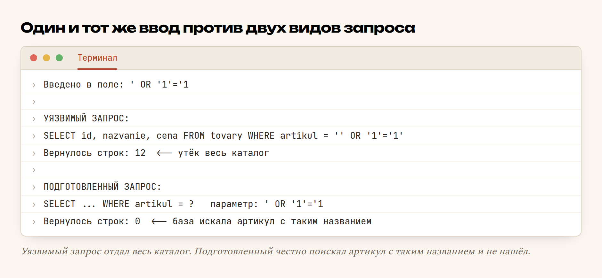

# Глава 33. Запросы с параметрами и SQL-инъекции

> **Часть VII. PHP + база = живой сайт** · Глава 33 из 60
> [← Глава 32](32-pdo.md) · [Глава 34 →](34-katalog-iz-bazy.md)

## 🎯 Зачем эта глава

Это самая важная глава по безопасности во всей книге.

**SQL-инъекция** — способ взлома, при котором злоумышленник через обычное поле
на сайте заставляет вашу базу выполнить чужой запрос. Прочитать все пароли.
Изменить цены. Удалить таблицы.

Она держится в списке самых опасных уязвимостей уже двадцать лет — не потому,
что её трудно предотвратить, а потому, что её легко случайно допустить.

Хорошая новость: **защита занимает одну строчку**. Плохая: если её не написать,
взлом займёт минуту, и сделает его не хакер, а школьник по видео из интернета.

Разберём, как это работает, и главное — увидим своими глазами.

## 📖 Как ломают

### **Уязвимый код**

```php
$artikul = $_GET['artikul'];
$sql = "SELECT * FROM tovary WHERE artikul = '$artikul'";
$stroki = db()->query($sql)->fetchAll();
```

Выглядит невинно. Человек ищет артикул `W71280`, получается запрос:

```sql
SELECT * FROM tovary WHERE artikul = 'W71280'
```

Работает.

### **А теперь введём другое**

Злоумышленник вводит в то же поле:

```
' OR '1'='1
```

Подставляем в шаблон и смотрим, что получилось:

```sql
SELECT * FROM tovary WHERE artikul = '' OR '1'='1'
```

Читаем: «выбери товары, где артикул пустой **или** единица равна единице».

Единица всегда равна единице. Условие истинно для **каждой** строки.

**База отдаст весь каталог.**

### **Почему так вышло**

Ключевая мысль, ради которой написана глава:

> База не различает, где ваш запрос, а где данные пользователя.
> Она видит **одну строку текста** и выполняет её целиком.

Кавычка, введённая человеком, **закрыла** вашу кавычку. Всё, что шло дальше,
стало частью запроса, а не данными.

## 🖥 Смотрим своими глазами

Не поверить на слово — правильно. Вот настоящий запуск: один и тот же ввод
против двух видов запроса.



**Уязвимый запрос вернул все 12 товаров** — при том, что искали конкретный
артикул. Каталог утёк целиком.

**Подготовленный запрос вернул 0 строк** — база честно поискала товар
с артикулом `' OR '1'='1` и не нашла такого. Именно так и должно быть.

Разница в коде — один вопросительный знак.

## 📖 Что ещё можно вытворить

Одним каталогом дело не ограничивается. Вот что бывает при той же дыре.

### **Обойти вход без пароля**

```php
$sql = "SELECT * FROM polzovateli
        WHERE email = '$email' AND parol = '$parol'";
```

Вводим в поле почты:

```
admin@site.tj' --
```

`--` в SQL означает «дальше комментарий». Получается:

```sql
SELECT * FROM polzovateli WHERE email = 'admin@site.tj' -- ' AND parol = '...'
```

Проверка пароля **закомментирована**. Вход выполнен от имени администратора.

### **Прочитать чужую таблицу**

```
' UNION SELECT email, parol_hash, 1, 1 FROM polzovateli --
```

`UNION` присоединяет к результату вторую выборку. В каталоге товаров окажутся
почты и хеши паролей всех пользователей.

### **Уничтожить данные**

```
'; DROP TABLE tovary; --
```

Точка с запятой заканчивает первый запрос, дальше идёт второй.

⚠️ **К счастью, PDO по умолчанию не выполняет несколько запросов в одном
вызове** — это лишний барьер. Но полагаться на него нельзя: остальные варианты
работают прекрасно.

## 📖 Защита: подготовленные запросы

```php
$st = db()->prepare('SELECT * FROM tovary WHERE artikul = ?');
$st->execute([$artikul]);
$stroki = $st->fetchAll();
```

Или через нашу обёртку из главы 32:

```php
$stroki = zapros('SELECT * FROM tovary WHERE artikul = ?', [$artikul]);
```

### **Почему это работает**

Разница принципиальная, а не косметическая.

**При склейке** база получает **одну строку**, где ваш запрос и данные
пользователя перемешаны. Разделить их она не может — уже поздно.

**При подготовленном запросе** происходит два отдельных действия:

1. **Сначала** база получает шаблон с `?` и разбирает его: «так, это SELECT,
   вот таблица, вот условие по столбцу artikul». Структура запроса **зафиксирована**.
2. **Потом** приходят данные. Они подставляются **как значения**, а не как часть
   запроса.

Что бы человек ни ввёл — хоть `' OR '1'='1`, хоть `DROP TABLE` — это останется
**текстом для сравнения**. База уже решила, что делает, и передумать не может.

Именно поэтому в примере выше поиск вернул 0 строк: база добросовестно искала
товар с артикулом `' OR '1'='1`.

### **Два вида меток**

```php
// Позиционные — по порядку
zapros('SELECT * FROM tovary WHERE brend = ? AND cena < ?', ['Bosch', 30000]);

// Именованные — по имени
zapros('SELECT * FROM tovary WHERE brend = :brend AND cena < :cena',
       ['brend' => 'Bosch', 'cena' => 30000]);
```

Позиционные короче, именованные читаемее при большом количестве параметров.
Смешивать в одном запросе нельзя.

## 📖 Что нельзя передать параметром

Важное ограничение, о которое спотыкаются.

**Параметром передаются только значения.** Имена таблиц, столбцов и направление
сортировки — нельзя:

```php
// ❌ Не сработает
zapros('SELECT * FROM tovary ORDER BY ?', ['cena']);
zapros('SELECT * FROM ?', ['tovary']);
```

База ведь уже разобрала структуру запроса — она не может задним числом узнать,
из какой таблицы выбирать.

### **Как быть с динамической сортировкой**

Правильно — **список допустимых значений**, как в главе 25:

```php
$dopustimye = [
    'cena_vozr' => 'cena ASC',
    'cena_ubyv' => 'cena DESC',
    'nazvanie'  => 'nazvanie ASC',
    'novye'     => 'sozdan DESC',
];

$kluch = $_GET['sort'] ?? 'nazvanie';
$sortirovka = $dopustimye[$kluch] ?? 'nazvanie ASC';

$tovary = zapros("SELECT * FROM tovary WHERE aktivnyi = 1 ORDER BY $sortirovka");
```

Подставляется **не то, что ввёл человек**, а то, что мы сами написали в массиве.
Введёт что угодно — получит сортировку по умолчанию.

**Это единственный правильный способ.** Не пытайтесь «очистить» имя столбца
регулярным выражением — рано или поздно ошибётесь.

## 📖 Динамические условия

В каталоге фильтры включаются по-разному. Как собрать запрос безопасно:

```php
function naiti_tovary(array $filtry): array
{
    $usloviya = ['aktivnyi = 1'];
    $parametry = [];

    if (!empty($filtry['zapros'])) {
        $usloviya[] = '(nazvanie LIKE ? OR artikul LIKE ?)';
        $parametry[] = '%' . $filtry['zapros'] . '%';
        $parametry[] = '%' . $filtry['zapros'] . '%';
    }

    if (!empty($filtry['brend'])) {
        $usloviya[] = 'brend = ?';
        $parametry[] = $filtry['brend'];
    }

    if (!empty($filtry['cena_ot'])) {
        $usloviya[] = 'cena >= ?';
        $parametry[] = (int) $filtry['cena_ot'];
    }

    if (!empty($filtry['tolko_v_nalichii'])) {
        $usloviya[] = 'ostatok > 0';
    }

    $sql = 'SELECT id, nazvanie, artikul, brend, cena, ostatok
            FROM tovary
            WHERE ' . implode(' AND ', $usloviya) . '
            ORDER BY nazvanie
            LIMIT 20';

    return zapros($sql, $parametry);
}
```

**Условия собираются из наших собственных строк**, данные пользователя идут
только в параметры. Массив `$usloviya` содержит написанный нами текст,
`$parametry` — то, что пришло извне. Они никогда не смешиваются.

⚠️ Обратите внимание на `LIKE`: проценты добавляются **к значению параметра**,
а не в текст запроса:

```php
$parametry[] = '%' . $zapros . '%';           // ✅
// а не: $sql .= "LIKE '%$zapros%'";          // ❌
```

## 📖 Список значений переменной длины

Частая задача: `WHERE id IN (1, 5, 9)`, где количество заранее неизвестно.

```php
function tovary_po_id(array $ids): array
{
    $ids = array_values(array_filter(array_map('intval', $ids)));
    if (empty($ids)) return [];

    // Столько же знаков вопроса, сколько значений
    $metki = implode(',', array_fill(0, count($ids), '?'));

    return zapros("SELECT * FROM tovary WHERE id IN ($metki)", $ids);
}
```

`array_map('intval', ...)` дополнительно превращает всё в целые числа —
двойная защита. Даже если бы метки не сработали, в запрос попали бы только числа.

## 📖 LIMIT и OFFSET — отдельная тонкость

```php
// ⚠️ С EMULATE_PREPARES => false может не сработать
zapros('SELECT * FROM tovary LIMIT ? OFFSET ?', [20, 40]);
```

MySQL ожидает в `LIMIT` числа, а PDO по умолчанию передаёт параметры строками.

Надёжный способ — привести к целому и подставить напрямую:

```php
$limit = 20;
$offset = max(0, ((int) $stranica - 1) * $limit);

$tovary = zapros("SELECT * FROM tovary WHERE aktivnyi = 1
                  ORDER BY nazvanie
                  LIMIT $limit OFFSET $offset");
```

Это **безопасно**, потому что `$limit` и `$offset` — гарантированно целые числа,
полученные приведением типа. Внедрить в них ничего невозможно.

**Правило: подставлять в запрос напрямую можно только то, что вы сами создали
или жёстко привели к числу.**

## 📖 Три уровня защиты

Хорошая система защищается не одной стенкой, а несколькими:

| Уровень | Что делает | Инструмент |
|---|---|---|
| **1. Проверка** | Не пускать заведомо неверные данные | `filter_var`, `in_array`, проверка типов |
| **2. Параметры** | Данные не могут стать кодом | `prepare` / `execute` |
| **3. Права** | Даже при взломе ущерб ограничен | Отдельный пользователь базы |

Про третий уровень стоит сказать отдельно.

⚠️ **Не подключайтесь к базе под `root`.** Создайте отдельного пользователя,
у которого есть права только на нужную базу и только нужные операции:

```sql
CREATE USER 'magazin_web'@'localhost' IDENTIFIED BY 'длинный_пароль';
GRANT SELECT, INSERT, UPDATE, DELETE ON magazin.* TO 'magazin_web'@'localhost';
```

Заметьте: нет права `DROP`. Даже если кто-то найдёт дыру, удалить таблицы
он не сможет — у пользователя просто нет такого права.

## 🔤 Разбор по словам

| Запись | Что делает |
|---|---|
| **SQL-инъекция** | Внедрение чужого кода в запрос через данные |
| `prepare()` | Отправить шаблон запроса. **Структура фиксируется** |
| `execute([...])` | Отправить данные отдельно |
| `?` | Позиционная метка |
| `:imya` | Именованная метка |
| `'%' . $x . '%'` | Проценты для `LIKE` — **в параметр**, не в запрос |
| `array_fill(0, count($ids), '?')` | Метки для `IN` переменной длины |
| `(int) $x` | Приведение к числу. Единственное безопасное «прямое» подставление |
| Список допустимых | Единственный способ для имён столбцов и сортировки |
| `GRANT` | Выдать пользователю базы ограниченные права |

## ⚠️ Грабли

**Склеивать запрос из строк.** Главная причина взломов. Всегда параметры.

**«Здесь же только цифры, ничего не случится».** Случится. Правило должно быть
безусловным, иначе однажды забудете.

**Экранировать вручную вместо параметров.** Функции вроде `addslashes`
не покрывают всех случаев. Параметры покрывают.

**Подставлять имя столбца из `$_GET`.** Только список допустимых значений.

**Проценты для `LIKE` внутри запроса.** Должны быть в значении параметра.

**Работать под `root`.** Отдельный пользователь с минимальными правами.

**Смешивать `?` и `:imya` в одном запросе.** Не сработает.

**Забыть, что `LIMIT` не принимает параметры в MySQL.** Приводите к `(int)`.

## 🏋️ Задачи

**Задача 33.1.** Напишите уязвимый запрос поиска и попробуйте его сломать
вводом `' OR '1'='1`. Убедитесь своими глазами.

⚠️ Только на своей учебной базе. Проверять чужие сайты без разрешения —
уголовное преступление в большинстве стран.

**Задача 33.2.** Перепишите тот же запрос на подготовленный и убедитесь,
что тот же ввод больше не работает.

**Задача 33.3.** Что вернёт каждый ввод в уязвимом запросе
`WHERE artikul = '$vvod'`? Разберите по шагам:

```
' OR 1=1 --
' UNION SELECT 1,2,3 --
admin' --
```

**Задача 33.4.** Найдите все уязвимости:

```php
$id = $_GET['id'];
$sort = $_GET['sort'];
$brend = $_GET['brend'];

$sql = "SELECT * FROM tovary
        WHERE id = $id AND brend = '$brend'
        ORDER BY $sort";
```

Три дыры. Перепишите безопасно.

**Задача 33.5.** Напишите функцию поиска с четырьмя необязательными фильтрами,
собирая условия и параметры отдельно.

**Задача 33.6.** Реализуйте `WHERE id IN (...)` для массива произвольной длины.

**Задача 33.7.** Сделайте безопасную сортировку по четырём вариантам
через список допустимых значений.

**Задача 33.8.** Создайте отдельного пользователя базы с ограниченными правами
и переключите на него свой проект. Убедитесь, что сайт работает, а `DROP TABLE`
из-под него не проходит.

**Задача 33.9.** Проверьте свой каталог из главы 25: попробуйте
`?brend=' OR '1'='1` и `?sort=1;DROP TABLE tovary`. Что произошло?

*Ответы — в [Приложении Г](../prilozheniya/4-G-otvety.md).*

## 🔗 В бою

Откройте любой файл с запросами в этом репозитории. Вы **не найдёте** ни одного
запроса, собранного склейкой с пользовательскими данными. Везде `prepare`
и параметры.

Посмотрите, как сделаны фильтры каталога: массив условий, массив параметров,
`implode(' AND ', $usloviya)` — ровно как в этой главе.

А сортировка сделана через список допустимых значений. Ключ приходит из адресной
строки, но подставляется не он, а заранее написанное нами выражение.

Это не перестраховка. Магазин работает в интернете, и попытки внедрения
приходят на любой сайт с первого дня — их шлют автоматические сканеры,
не разбирая, кто вы.

## 📌 Итог

- **SQL-инъекция** — данные пользователя становятся частью запроса.
- Причина одна: **склейка строк**. База не отличает ваш код от чужого текста.
- Защита: **`prepare` + `execute`**. Структура фиксируется до прихода данных.
- Проверено на живом примере: уязвимый запрос — 12 строк, подготовленный — 0.
- Параметром передаются **только значения**. Имена столбцов и сортировка —
  через **список допустимых**.
- Проценты для `LIKE` — в параметр.
- `LIMIT` в MySQL не принимает параметры: приводите к `(int)`.
- Динамические фильтры: **условия из своих строк, данные — в параметры**.
- Отдельный пользователь базы с минимальными правами.
- Правило безусловное: **никогда не склеивать запрос с данными извне**.

Дальше — выведем каталог из базы по-настоящему, с пагинацией.

[← Глава 32](32-pdo.md) · [Глава 34. Каталог из базы →](34-katalog-iz-bazy.md)
