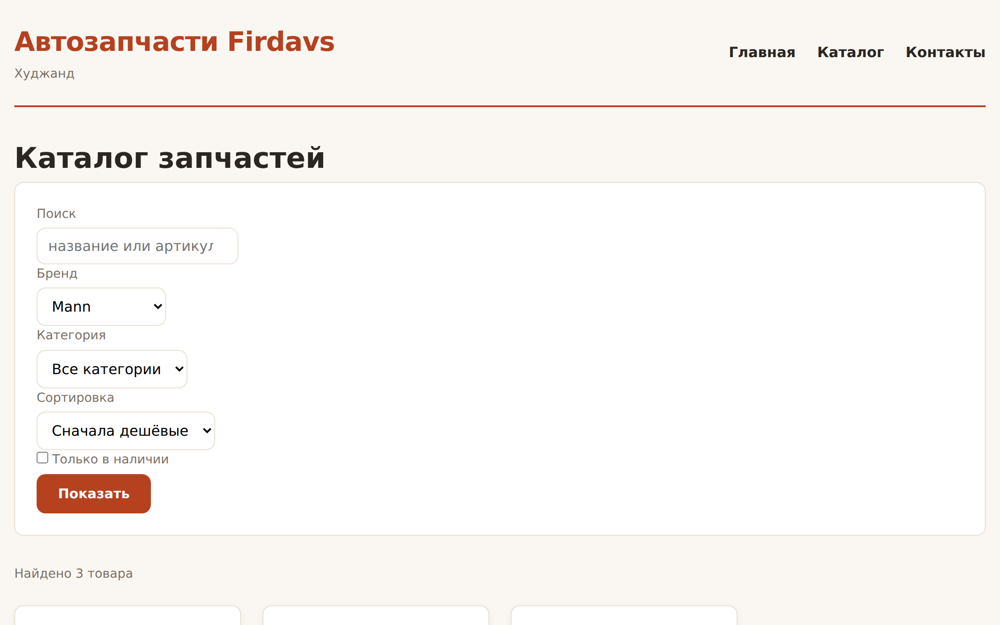
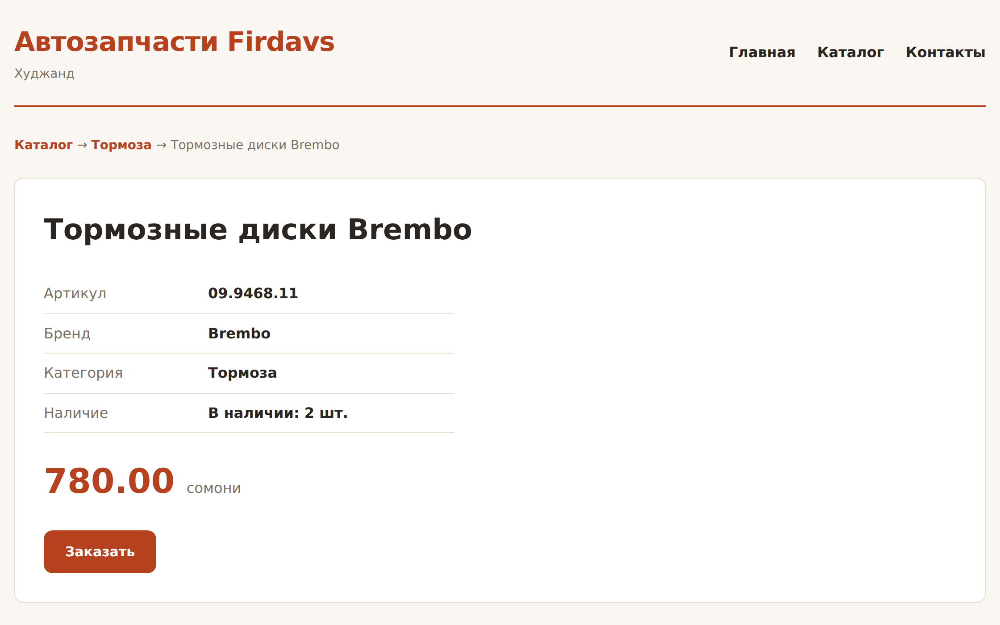

# Глава 34. Каталог из базы и пагинация

> **Часть VII. PHP + база = живой сайт** · Глава 34 из 60
> [← Глава 33](33-podgotovlennye-zaprosy.md) · [Глава 35 →](35-poisk-i-filtry.md)

## 🎯 Зачем эта глава

Подключение есть, запросы безопасны. Соберём настоящий каталог: товары
из базы, пагинация, категории, страница товара.

И разберём вопрос, который на этом этапе становится главным: **как не сделать
медленно**. Каталог — самая посещаемая страница магазина, и именно на ней
проще всего допустить ошибку, которая проявится через полгода.

## 📖 Два запроса вместо одного

Первое, что удивляет новичков: для каталога с пагинацией нужно **два** запроса.

```php
// 1. Сами товары — только текущая страница
$tovary = zapros('
    SELECT id, nazvanie, artikul, brend, cena, ostatok
    FROM tovary
    WHERE aktivnyi = 1 AND status = "opublikovan"
    ORDER BY nazvanie
    LIMIT 20 OFFSET 40
');

// 2. Сколько всего подходит — для номеров страниц
$vsego = zapros_znachenie('
    SELECT COUNT(*)
    FROM tovary
    WHERE aktivnyi = 1 AND status = "opublikovan"
');
```

Почему нельзя одним: `LIMIT 20` вернёт двадцать строк, и вы не узнаете,
сколько всего. А без этого не нарисовать «страница 3 из 47».

⚠️ **Условия в обоих запросах должны совпадать.** Расходятся условия — расходятся
числа: показываете «найдено 100», а листается только 60. Классическая ошибка,
которую замечают не сразу.

Чтобы условия не разъехались, собирайте их **один раз**:

```php
$usloviya = 'aktivnyi = 1 AND status = "opublikovan"';

$tovary = zapros("SELECT ... FROM tovary WHERE $usloviya ORDER BY nazvanie LIMIT ...");
$vsego  = zapros_znachenie("SELECT COUNT(*) FROM tovary WHERE $usloviya");
```

## 💻 Слой данных

Всю работу с базой держим в одном файле — страницы про SQL знать не должны.

```php
<?php
// includes/tovary.php
require_once __DIR__ . '/db.php';

/** Поля, которые нужны для карточки в каталоге. */
const POLYA_KARTOCHKI = 'id, nazvanie, artikul, brend, cena, ostatok, foto';

/**
 * Каталог: страница товаров плюс общее количество.
 *
 * Возвращает ['tovary' => [...], 'vsego' => int] — оба значения нужны
 * вызывающей стороне, а условия отбора должны быть одинаковыми,
 * поэтому собираем их здесь один раз.
 */
function katalog(array $filtry = [], int $stranica = 1, int $na_stranice = 12): array
{
    $usloviya = ['t.aktivnyi = 1', 't.status = "opublikovan"'];
    $parametry = [];

    if (!empty($filtry['kategoriya_id'])) {
        $usloviya[] = 't.kategoriya_id = ?';
        $parametry[] = (int) $filtry['kategoriya_id'];
    }

    if (!empty($filtry['brend'])) {
        $usloviya[] = 't.brend = ?';
        $parametry[] = $filtry['brend'];
    }

    if (!empty($filtry['tolko_v_nalichii'])) {
        $usloviya[] = 't.ostatok > 0';
    }

    $where = implode(' AND ', $usloviya);

    // Сортировка — только из списка допустимых, из адреса подставлять нельзя
    $sortirovki = [
        'nazvanie'  => 't.nazvanie ASC',
        'cena_vozr' => 't.cena ASC',
        'cena_ubyv' => 't.cena DESC',
        'novye'     => 't.sozdan DESC',
    ];
    $order = $sortirovki[$filtry['sort'] ?? ''] ?? $sortirovki['nazvanie'];

    // LIMIT не принимает параметры — приводим к числу сами
    $na_stranice = max(1, min(100, $na_stranice));
    $stranica    = max(1, $stranica);
    $offset      = ($stranica - 1) * $na_stranice;

    $tovary = zapros("
        SELECT " . POLYA_KARTOCHKI . "
        FROM tovary AS t
        WHERE $where
        ORDER BY $order
        LIMIT $na_stranice OFFSET $offset
    ", $parametry);

    $vsego = (int) zapros_znachenie("
        SELECT COUNT(*) FROM tovary AS t WHERE $where
    ", $parametry);

    return [
        'tovary'  => $tovary,
        'vsego'   => $vsego,
        'stranic' => max(1, (int) ceil($vsego / $na_stranice)),
    ];
}

/** Один товар для страницы товара. */
function tovar_po_id(int $id): ?array
{
    return zapros_odin('
        SELECT t.*, k.nazvanie AS kategoriya_nazvanie, k.chpu AS kategoriya_chpu
        FROM tovary AS t
        LEFT JOIN kategorii AS k ON k.id = t.kategoriya_id
        WHERE t.id = ? AND t.aktivnyi = 1
    ', [$id]);
}

/** Бренды с количеством — для выпадающего списка. */
function brendy_s_kolichestvom(): array
{
    return zapros('
        SELECT brend, COUNT(*) AS shtuk
        FROM tovary
        WHERE aktivnyi = 1 AND status = "opublikovan" AND brend <> ""
        GROUP BY brend
        ORDER BY brend
    ');
}

/** Дерево категорий одним запросом. */
function derevo_kategoriy(): array
{
    $vse = zapros('
        SELECT id, roditel_id, nazvanie, chpu
        FROM kategorii
        WHERE aktivnaya = 1
        ORDER BY poryadok, nazvanie
    ');

    $po_roditelyu = [];
    foreach ($vse as $k) {
        $po_roditelyu[$k['roditel_id'] ?? 0][] = $k;
    }
    return $po_roditelyu;
}

/** Похожие товары той же категории. */
function pohozhie_tovary(int $tovar_id, ?int $kategoriya_id, int $skolko = 4): array
{
    if ($kategoriya_id === null) return [];

    return zapros('
        SELECT ' . POLYA_KARTOCHKI . '
        FROM tovary
        WHERE kategoriya_id = ? AND id <> ? AND aktivnyi = 1 AND status = "opublikovan"
        ORDER BY ostatok DESC
        LIMIT ' . (int) $skolko,
        [$kategoriya_id, $tovar_id]
    );
}
```

### **Про дерево категорий — важный приём**

Обратите внимание на `derevo_kategoriy()`: категории берутся **одним запросом**,
а дерево строится в PHP.

Наивный способ выглядел бы так:

```php
// ❌ Проблема N+1 из главы 30
$razdely = zapros('SELECT * FROM kategorii WHERE roditel_id IS NULL');
foreach ($razdely as $r) {
    $r['deti'] = zapros('SELECT * FROM kategorii WHERE roditel_id = ?', [$r['id']]);
}
```

Пять разделов — шесть запросов. Двадцать разделов — двадцать один.

Правильный подход: **забрать всё одним запросом и разложить в PHP**. Группировка
массива в памяти стоит доли миллисекунды, а каждый запрос к базе — единицы
миллисекунд. Разница на порядок.

**Общее правило: лучше один большой запрос, чем много маленьких.**

## 💻 Страница каталога

```php
<?php
// index.php
require_once __DIR__ . '/includes/config.php';
require_once __DIR__ . '/includes/functions.php';
require_once __DIR__ . '/includes/tovary.php';

$filtry = [
    'kategoriya_id'    => (int) ($_GET['kategoriya'] ?? 0),
    'brend'            => trim($_GET['brend'] ?? ''),
    'tolko_v_nalichii' => isset($_GET['est']),
    'sort'             => $_GET['sort'] ?? '',
];

$stranica = max(1, (int) ($_GET['page'] ?? 1));
$rezultat = katalog($filtry, $stranica, 12);

$zagolovok = 'Каталог — ' . SAIT_NAZVANIE;
require __DIR__ . '/includes/header.php';
?>

<h1>Каталог запчастей</h1>

<form class="filtry" method="GET">
    <div class="ryad">
        <div>
            <label for="brend">Бренд</label>
            <select id="brend" name="brend">
                <option value="">Все бренды</option>
                <?php foreach (brendy_s_kolichestvom() as $b): ?>
                    <option value="<?= e($b['brend']) ?>"
                            <?= $filtry['brend'] === $b['brend'] ? 'selected' : '' ?>>
                        <?= e($b['brend']) ?> (<?= $b['shtuk'] ?>)
                    </option>
                <?php endforeach; ?>
            </select>
        </div>

        <div>
            <label for="sort">Сортировка</label>
            <select id="sort" name="sort">
                <option value="nazvanie">По названию</option>
                <option value="cena_vozr"
                        <?= $filtry['sort'] === 'cena_vozr' ? 'selected' : '' ?>>
                    Сначала дешёвые
                </option>
                <option value="cena_ubyv"
                        <?= $filtry['sort'] === 'cena_ubyv' ? 'selected' : '' ?>>
                    Сначала дорогие
                </option>
                <option value="novye"
                        <?= $filtry['sort'] === 'novye'     ? 'selected' : '' ?>>
                    Сначала новые
                </option>
            </select>
        </div>

        <label class="galka">
            <input type="checkbox" name="est" value="1" <?= $filtry['tolko_v_nalichii'] ? 'checked' : '' ?>>
            Только в наличии
        </label>

        <button type="submit">Показать</button>
    </div>
</form>

<p class="schetchik">
    Найдено <?= $rezultat['vsego'] ?>
    <?= sklonenie($rezultat['vsego'], 'товар', 'товара', 'товаров') ?>
    <?php if ($rezultat['stranic'] > 1): ?>
        · страница <?= $stranica ?> из <?= $rezultat['stranic'] ?>
    <?php endif; ?>
</p>

<?php if ($rezultat['vsego'] === 0): ?>
    <div class="pusto">
        <h3>Ничего не нашлось</h3>
        <p>Попробуйте сбросить фильтры.</p>
        <a class="knopka" href="?">Показать все товары</a>
    </div>
<?php else: ?>

    <div class="katalog">
        <?php foreach ($rezultat['tovary'] as $t): ?>
            <article class="tovar">
                <h3><a href="tovar.php?id=<?= $t['id'] ?>"><?= e($t['nazvanie']) ?></a></h3>
                <p class="artikul">Артикул: <?= e($t['artikul']) ?> · <?= e($t['brend']) ?></p>
                <p class="cena"><?= somoni((int) $t['cena']) ?> <span>сомони</span></p>
                <?php if ($t['ostatok'] > 0): ?>
                    <p class="nalichie">В наличии: <?= (int) $t['ostatok'] ?> шт.</p>
                <?php else: ?>
                    <p class="nalichie nety">Под заказ</p>
                <?php endif; ?>
                <a class="knopka" href="zakaz.php?id=<?= $t['id'] ?>">Заказать</a>
            </article>
        <?php endforeach; ?>
    </div>

    <?= stranicy($stranica, $rezultat['stranic']) ?>

<?php endif; ?>

<?php require __DIR__ . '/includes/footer.php'; ?>
```

## 💻 Умная пагинация

При сорока семи страницах показывать все номера бессмысленно. Сделаем
с многоточиями:

```php
<?php
// includes/functions.php (дополнение)

/**
 * Номера страниц вида: 1 … 4 5 [6] 7 8 … 47
 * Все текущие GET-параметры сохраняются, меняется только page.
 */
function stranicy(int $tekushaya, int $vsego, int $vokrug = 2): string
{
    if ($vsego <= 1) return '';

    $nomera = [1, $vsego];
    for ($i = $tekushaya - $vokrug; $i <= $tekushaya + $vokrug; $i++) {
        if ($i >= 1 && $i <= $vsego) $nomera[] = $i;
    }
    $nomera = array_values(array_unique($nomera));
    sort($nomera);

    $html = '<nav class="stranicy">';
    $predydushiy = 0;

    foreach ($nomera as $n) {
        if ($predydushiy && $n - $predydushiy > 1) {
            $html .= '<span class="mnogotochie">…</span>';
        }

        if ($n === $tekushaya) {
            $html .= '<span class="tekushaya">' . $n . '</span>';
        } else {
            $parametry = $_GET;
            $parametry['page'] = $n;
            $html .= '<a href="?' . http_build_query($parametry) . '">' . $n . '</a>';
        }

        $predydushiy = $n;
    }

    return $html . '</nav>';
}
```

## 🖥 На экране

Каталог из базы с фильтрами, сортировкой и пагинацией:



Страница товара с характеристиками и похожими товарами:



## 📖 Считаем запросы

Хорошая привычка: знать, сколько запросов делает страница.

```php
// includes/db.php — добавим счётчик
function zapros(string $sql, array $parametry = []): array
{
    static $schetchik = 0;
    $schetchik++;

    $nachalo = microtime(true);
    $st = db()->prepare($sql);
    $st->execute($parametry);
    $stroki = $st->fetchAll();
    $vremya = (microtime(true) - $nachalo) * 1000;

    if (defined('OTLADKA') && OTLADKA) {
        $GLOBALS['zaprosy_log'][] = [
            'nomer'  => $schetchik,
            'vremya' => round($vremya, 2),
            'sql'    => preg_replace('/\s+/', ' ', trim($sql)),
        ];
    }

    return $stroki;
}
```

И в подвале при отладке:

```php
<?php if (defined('OTLADKA') && OTLADKA && !empty($GLOBALS['zaprosy_log'])): ?>
    <div class="otladka">
        Запросов: <?= count($GLOBALS['zaprosy_log']) ?> ·
        суммарно <?= round(array_sum(array_column($GLOBALS['zaprosy_log'], 'vremya')), 1) ?> мс
    </div>
<?php endif; ?>
```

**Ориентир:** обычная страница — до 10 запросов. Больше 20 — почти наверняка
N+1, ищите цикл с запросом внутри.

⚠️ Отладочный вывод должен быть **выключен на боевом сайте**. Он показывает
структуру базы всем желающим.

## 📖 Кэширование — но осторожно

Некоторые данные меняются редко: список категорий, бренды, настройки.
Запрашивать их при каждом открытии страницы расточительно.

```php
function kategorii_kesh(): array
{
    $fail = __DIR__ . '/../storage/cache/kategorii.php';
    $zhizn = 3600;   // час

    if (file_exists($fail) && (time() - filemtime($fail)) < $zhizn) {
        return require $fail;
    }

    $dannye = derevo_kategoriy();

    if (!is_dir(dirname($fail))) mkdir(dirname($fail), 0775, true);
    file_put_contents($fail, '<?php return ' . var_export($dannye, true) . ';');

    return $dannye;
}
```

⚠️ **Что кэшировать можно, а что нельзя:**

| Можно | Нельзя |
|---|---|
| Категории, бренды | **Остатки товаров** |
| Настройки сайта | **Цены поставщика** |
| Меню | Корзина, личный кабинет |
| Тексты страниц | Всё, что зависит от пользователя |

Причина простая: покупатель увидит «в наличии 5 шт.», оформит заказ, а товара
уже нет. Или увидит старую цену и справедливо возмутится.

**Правило: кэшируйте то, что медленно меняется и не связано с деньгами.**

И помните порядок из главы 30: **сначала индексы, потом кэш**. Кэш поверх
медленного запроса — это спрятанная проблема, которая вернётся при первом же
сбросе кэша.

## 🔤 Разбор по словам

| Запись | Что делает |
|---|---|
| Два запроса | Данные страницы **и** `COUNT(*)`. Условия одинаковые |
| `implode(' AND ', $usloviya)` | Собрать условия из своих строк |
| Список сортировок | Единственный безопасный способ для `ORDER BY` |
| `LIMIT $n OFFSET $m` | Приведённые к `(int)` числа, не параметры |
| `ceil($vsego / $na_stranice)` | Сколько страниц |
| `http_build_query($_GET)` | Сохранить фильтры при переходе |
| Одним запросом + группировка в PHP | Лекарство от N+1 |
| `filemtime()` | Когда файл менялся — для кэша |
| `var_export($dannye, true)` | Превратить массив в код PHP |

## ⚠️ Грабли

**Разные условия в запросе данных и в `COUNT`.** Числа разойдутся. Собирайте
условия один раз.

**Запрос внутри цикла.** N+1. Один запрос плюс группировка в PHP.

**Забыть `ORDER BY` при `LIMIT`.** Порядок не гарантирован, страницы поедут.

**Не ограничить `$na_stranice`.** `?na_stranice=1000000` положит сервер.
`min(100, ...)`.

**Кэшировать остатки и цены.** Покупатель закажет то, чего нет.

**Оставить отладочный вывод на боевом сайте.** Выдаёт структуру базы.

**`SELECT *` в каталоге.** Тянет описания, которые в списке не нужны.

## 🏋️ Задачи

**Задача 34.1.** Соберите каталог из главы на своей базе. Проверьте фильтры,
сортировку, пагинацию.

**Задача 34.2.** Добавьте счётчик запросов в подвал. Сколько их на странице
каталога?

**Задача 34.3.** Сделайте фильтр по категории с деревом в боковой колонке.

**Задача 34.4.** Добавьте выбор количества товаров на странице: 12, 24, 48.
Ограничьте максимум.

**Задача 34.5.** Найдите N+1 и почините:

```php
$tovary = zapros('SELECT * FROM tovary LIMIT 20');
foreach ($tovary as $t) {
    $t['kategoriya'] = zapros_odin('SELECT nazvanie FROM kategorii WHERE id = ?',
                                    [$t['kategoriya_id']]);
}
```

**Задача 34.6.** Реализуйте кэш списка брендов на час. Проверьте, что после
добавления товара новый бренд появляется только через час — и подумайте,
хорошо ли это.

**Задача 34.7.** Сделайте страницу «Новинки»: 12 самых свежих товаров.

**Задача 34.8.** Замерьте время сборки страницы каталога. Потом залейте
в базу 50 000 товаров и замерьте снова. Что изменилось? Помогают ли индексы
из главы 30?

*Ответы — в [Приложении Г](../prilozheniya/4-G-otvety.md).*

## 🔗 В бою

Откройте `pages/` этого репозитория и сравните со своим каталогом.
Структура та же: слой данных отдельно, страница только показывает.

Одна деталь, которой у нас пока нет: в боевом каталоге цены **не хранятся
в базе целиком**. Часть товаров — свои, с ценой в таблице. Часть — от поставщика
AutoEuro, и их цена запрашивается живьём при показе.

Причина записана в CLAUDE.md проекта: **цены поставщика не кэшируем надолго**,
они меняются. В базе хранятся только названия — для поиска. Это компромисс
между скоростью и достоверностью, и он выбран сознательно: лучше показать
цену на полсекунды позже, чем продать по устаревшей.

## 📌 Итог

- Каталог с пагинацией — **два запроса**: данные и `COUNT(*)`. Условия
  собирайте один раз.
- Сортировка — только из **списка допустимых**.
- `LIMIT` и `OFFSET` — приведённые к `(int)` числа.
- **Один запрос плюс группировка в PHP** лучше, чем много запросов.
- Считайте запросы на странице. Больше 20 — ищите N+1.
- Кэшируйте медленно меняющееся: категории, бренды, настройки.
- **Не кэшируйте остатки, цены и всё, что связано с деньгами.**
- Сначала индексы, потом кэш.

Дальше — поиск и фильтры по-настоящему.

[← Глава 33](33-podgotovlennye-zaprosy.md) · [Глава 35. Поиск и фильтры →](35-poisk-i-filtry.md)
