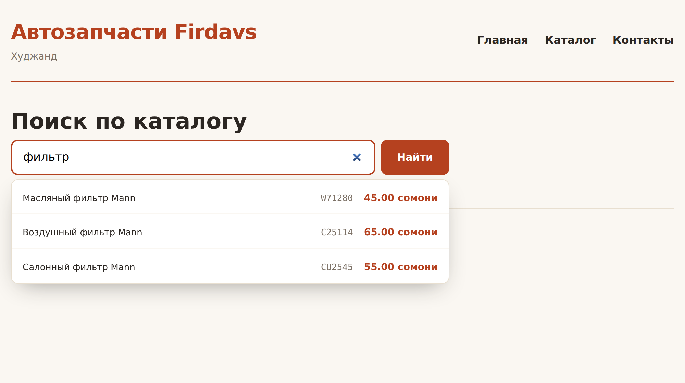
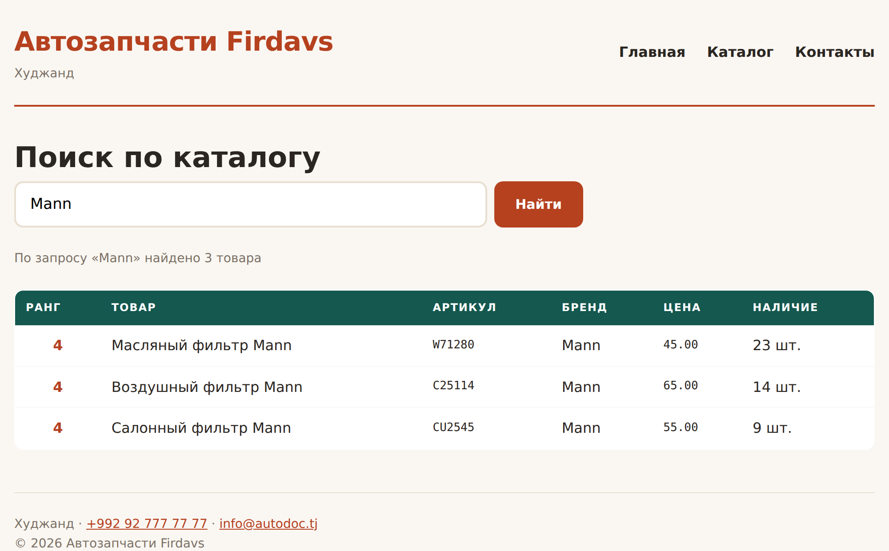

# Глава 35. Поиск и фильтры

> **Часть VII. PHP + база = живой сайт** · Глава 35 из 60
> [← Глава 34](34-katalog-iz-bazy.md) · [Глава 36 →](36-bezopasnost.md)

## 🎯 Зачем эта глава

Поиск — то, чем покупатель пользуется чаще всего. Человек приходит за конкретной
запчастью, а не листать каталог.

И поиск же — то, что чаще всего сделано плохо. «Ничего не найдено» при опечатке
в одну букву, ожидание по три секунды, результаты не в том порядке.

Разберём, как сделать поиск, который работает: быстро, снисходительно к опечаткам
и осмысленно ранжирует.

## 📖 Три уровня поиска

| Уровень | Инструмент | Когда |
|---|---|---|
| **1. Простой** | `LIKE '%текст%'` | До нескольких тысяч товаров |
| **2. Полнотекстовый** | `FULLTEXT` в MySQL | Десятки и сотни тысяч |
| **3. Отдельный движок** | Elasticsearch, Meilisearch | Миллионы, нужны опечатки и синонимы |

Не начинайте с третьего. Большинству магазинов хватает первых двух, а движок
поиска — это отдельный сервер, который надо ставить, настраивать и обновлять.

**Начните с простого, измерьте, усложняйте по необходимости.**

## 📖 Уровень 1: LIKE

```php
function poisk_prostoy(string $zapros, int $limit = 20): array
{
    $zapros = trim($zapros);
    if (mb_strlen($zapros) < 2) return [];

    $shablon = '%' . $zapros . '%';

    return zapros('
        SELECT id, nazvanie, artikul, brend, cena, ostatok
        FROM tovary
        WHERE aktivnyi = 1 AND status = "opublikovan"
          AND (nazvanie LIKE ? OR artikul LIKE ? OR brend LIKE ?)
        ORDER BY nazvanie
        LIMIT ' . (int) $limit,
        [$shablon, $shablon, $shablon]
    );
}
```

⚠️ Проверка `mb_strlen($zapros) < 2` не случайна. По одной букве найдётся
половина каталога — и запрос будет медленным, и результат бесполезным.

### **Ранжирование: сначала точные совпадения**

Проблема простого поиска: он возвращает всё вперемешку. Человек ищет `W71280`,
а первым идёт товар, у которого этот артикул мелькает в описании.

```php
function poisk_s_rangom(string $zapros, int $limit = 20): array
{
    $zapros = trim($zapros);
    if (mb_strlen($zapros) < 2) return [];

    $tochno  = $zapros;
    $nachalo = $zapros . '%';
    $vezde   = '%' . $zapros . '%';

    return zapros('
        SELECT id, nazvanie, artikul, brend, cena, ostatok,
               CASE
                   WHEN artikul = ?          THEN 1
                   WHEN artikul LIKE ?       THEN 2
                   WHEN nazvanie LIKE ?      THEN 3
                   WHEN nazvanie LIKE ?      THEN 4
                   ELSE 5
               END AS rang
        FROM tovary
        WHERE aktivnyi = 1 AND status = "opublikovan"
          AND (nazvanie LIKE ? OR artikul LIKE ? OR brend LIKE ?)
        ORDER BY rang, ostatok DESC, nazvanie
        LIMIT ' . (int) $limit,
        [$tochno, $nachalo, $nachalo, $vezde, $vezde, $vezde, $vezde]
    );
}
```

Логика ранжирования:

1. **Точное совпадение артикула** — человек знает, что ищет;
2. артикул начинается с запроса;
3. название начинается с запроса;
4. запрос встречается в названии;
5. всё остальное.

Внутри одного ранга — сначала товары в наличии. Показывать первым то, чего нет,
неправильно: человек кликнет и расстроится.

**Ранжирование — самая недооценённая часть поиска.** Найти нужное умеют все,
а показать нужное первым — нет.

## 📖 Уровень 2: FULLTEXT

Когда товаров становится много, `LIKE '%...%'` перестаёт справляться —
он не может пользоваться индексом и перебирает всю таблицу.

```sql
ALTER TABLE tovary ADD FULLTEXT KEY ft_poisk (nazvanie, opisanie);
```

```php
function poisk_polnotekstovyy(string $zapros, int $limit = 20): array
{
    $zapros = trim($zapros);
    if (mb_strlen($zapros) < 3) return [];

    // Каждому слову добавляем * — искать по началу слова
    $slova = preg_split('/\s+/u', $zapros, -1, PREG_SPLIT_NO_EMPTY);
    $podgotovlennyy = implode(' ', array_map(fn($s) => '+' . $s . '*', $slova));

    return zapros('
        SELECT id, nazvanie, artikul, brend, cena, ostatok,
               MATCH(nazvanie, opisanie) AGAINST (? IN BOOLEAN MODE) AS relevantnost
        FROM tovary
        WHERE aktivnyi = 1 AND status = "opublikovan"
          AND MATCH(nazvanie, opisanie) AGAINST (? IN BOOLEAN MODE)
        ORDER BY relevantnost DESC, ostatok DESC
        LIMIT ' . (int) $limit,
        [$podgotovlennyy, $podgotovlennyy]
    );
}
```

| Знак | Что означает |
|---|---|
| `+слово` | Слово **обязано** присутствовать |
| `-слово` | Слова быть **не должно** |
| `слово*` | Начинается с этих букв |
| `"фраза"` | Точная фраза |

**`MATCH ... AGAINST` возвращает число релевантности** — насколько строка
подходит. По нему и сортируем.

⚠️ У `FULLTEXT` в MySQL есть особенности, о которых стоит знать заранее:

- по умолчанию **игнорируются слова короче 4 символов** (настройка
  `innodb_ft_min_token_size`);
- есть список стоп-слов, которые не индексируются;
- **артикулы вроде `W71280` могут индексироваться неожиданно** — они не похожи
  на слова.

Поэтому на практике комбинируют: `FULLTEXT` по названию и описанию плюс обычный
`LIKE` по артикулу.

## 📖 Опечатки

Человек написал «калодки». Точного совпадения нет, и он видит «ничего не найдено» —
хотя товар есть.

### **Простое решение: показать похожее**

```php
function pohozhie_zaprosy(string $zapros, int $skolko = 5): array
{
    $vse = zapros('
        SELECT DISTINCT nazvanie FROM tovary
        WHERE aktivnyi = 1 AND status = "opublikovan"
    ');

    $s_rasstoyaniem = [];
    foreach ($vse as $stroka) {
        foreach (preg_split('/\s+/u', $stroka['nazvanie']) as $slovo) {
            if (mb_strlen($slovo) < 4) continue;
            $rasstoyanie = levenshtein(
                mb_strtolower($zapros),
                mb_strtolower($slovo)
            );
            if ($rasstoyanie <= 2) {
                $s_rasstoyaniem[$slovo] = $rasstoyanie;
            }
        }
    }

    asort($s_rasstoyaniem);
    return array_slice(array_keys($s_rasstoyaniem), 0, $skolko);
}
```

**`levenshtein()`** считает, сколько правок нужно, чтобы превратить одно слово
в другое. «калодки» → «колодки» — одна замена, расстояние 1.

⚠️ Функция работает **побайтово**, поэтому на русском тексте расстояния
получаются завышенными. Для точной работы нужна реализация для многобайтовых
строк — но для подсказок «возможно, вы имели в виду» точности хватает.

⚠️ И ещё: перебирать весь каталог на каждый запрос дорого. Такое считают
**только когда ничего не нашлось** — то есть редко.

### **Решение получше: словарь запросов**

Собирайте, что люди ищут:

```sql
CREATE TABLE poiskovye_zaprosy (
    id       INT AUTO_INCREMENT PRIMARY KEY,
    zapros   VARCHAR(255) NOT NULL,
    naydeno  INT NOT NULL DEFAULT 0,
    schetchik INT NOT NULL DEFAULT 1,
    poslednij DATETIME NOT NULL DEFAULT CURRENT_TIMESTAMP,
    UNIQUE KEY uniq_zapros (zapros)
);
```

```php
function zapisat_zapros(string $zapros, int $naydeno): void
{
    vypolnit('
        INSERT INTO poiskovye_zaprosy (zapros, naydeno)
        VALUES (?, ?)
        ON DUPLICATE KEY UPDATE
            schetchik = schetchik + 1,
            naydeno = VALUES(naydeno),
            poslednij = NOW()
    ', [mb_strtolower(trim($zapros)), $naydeno]);
}
```

**Что это даёт:**

- **Запросы с нулём результатов** — список того, чего людям не хватает.
  Прямое указание, какие товары завезти.
- **Популярные запросы** — подсказки в строке поиска.
- **Статистика** — что вообще ищут в вашем магазине.

Это одна из самых полезных таблиц в магазине, и её почти никто не заводит.

## 📖 Живые подсказки

Подсказки под строкой поиска — то, чего ждут от современного сайта.

**Точка на сервере:**

```php
<?php
// api/podskazki.php
require_once __DIR__ . '/../includes/db.php';

header('Content-Type: application/json; charset=utf-8');

$zapros = trim($_GET['q'] ?? '');
if (mb_strlen($zapros) < 2) {
    echo json_encode([]);
    exit;
}

$nachalo = $zapros . '%';
$vezde   = '%' . $zapros . '%';

// Сначала совпадения с начала, потом вхождения в середину
$stroki = zapros('
    SELECT id, nazvanie, artikul, cena,
           CASE WHEN artikul LIKE ? THEN 1
                WHEN nazvanie LIKE ? THEN 2
                ELSE 3 END AS rang
    FROM tovary
    WHERE aktivnyi = 1 AND status = "opublikovan"
      AND (nazvanie LIKE ? OR artikul LIKE ?)
    ORDER BY rang, ostatok DESC
    LIMIT 8
', [$nachalo, $nachalo, $vezde, $vezde]);

echo json_encode($stroki, JSON_UNESCAPED_UNICODE);
```

⚠️ **Здесь виден честный компромисс, о котором стоит подумать.**

Шаблон `$zapros . '%'` («начинается с») использует индекс и работает быстро.
Но он **не найдёт слово в середине**: по запросу «фильтр» товар «Масляный фильтр
Mann» не покажется, потому что название начинается не с этого слова.

Шаблон `'%' . $zapros . '%'` («содержит») находит, но не может использовать
индекс — база перебирает таблицу.

Поэтому в подсказках берут оба и **ранжируют**: совпадения с начала выше.
А чтобы медленная часть не мешала, ставят жёсткий `LIMIT 8` — база остановится,
как только наберёт восемь строк.

На каталоге в десятки тысяч товаров этого уже мало, и тогда переходят
на `FULLTEXT` или отдельный поисковый движок. Но начинать стоит отсюда:
работает, пишется за десять минут, и его хватает большинству магазинов.

**JavaScript в браузере:**

```javascript
const pole = document.querySelector('#poisk');
const spisok = document.querySelector('.podskazki');

// debounce из главы 18 — не дёргать сервер на каждую букву
const iskat = debounce(async () => {
    const zapros = pole.value.trim();

    if (zapros.length < 2) {
        spisok.innerHTML = '';
        spisok.hidden = true;
        return;
    }

    try {
        const otvet = await fetch('/api/podskazki.php?q=' + encodeURIComponent(zapros));
        const tovary = await otvet.json();

        if (tovary.length === 0) {
            spisok.innerHTML = '<div class="pusto">Ничего не нашлось</div>';
        } else {
            spisok.innerHTML = tovary.map(t => `
                <a class="podskazka" href="/tovar.php?id=${t.id}">
                    <span class="p-nazvanie">${ekranirovat(t.nazvanie)}</span>
                    <span class="p-artikul">${ekranirovat(t.artikul)}</span>
                    <span class="p-cena">${(t.cena / 100).toFixed(2)} сомони</span>
                </a>
            `).join('');
        }
        spisok.hidden = false;
    } catch (e) {
        spisok.hidden = true;
    }
}, 250);

pole.addEventListener('input', iskat);

// Закрывать подсказки по клику вне поля
document.addEventListener('click', (e) => {
    if (!e.target.closest('.poisk')) spisok.hidden = true;
});
```

**Новое здесь — `fetch`.** Это способ отправить запрос на сервер
из JavaScript **без перезагрузки страницы**. Подробно разберём в главе 49,
а пока запомните схему: `fetch` → `await` ответ → `await` разбор JSON.

`async` и `await` означают «дождись результата, не блокируя страницу».

⚠️ **`try/catch` обязателен.** Связь может оборваться, сервер — ответить
ошибкой. Без обработки подсказки просто перестанут работать без объяснений.

⚠️ И снова экранирование: данные приходят с сервера, но вставляются
через `innerHTML`. Помните главу 16 — экранируйте всегда.

## 📖 Фильтры с количеством

Хороший фильтр показывает, **сколько найдётся**, до нажатия:

```php
function fasety(array $filtry): array
{
    // Условия без фильтра по бренду — чтобы посчитать все бренды
    $usloviya = ['aktivnyi = 1', 'status = "opublikovan"'];
    $parametry = [];

    if (!empty($filtry['kategoriya_id'])) {
        $usloviya[] = 'kategoriya_id = ?';
        $parametry[] = (int) $filtry['kategoriya_id'];
    }

    $where = implode(' AND ', $usloviya);

    return [
        'brendy' => zapros("
            SELECT brend, COUNT(*) AS shtuk
            FROM tovary WHERE $where AND brend <> ''
            GROUP BY brend ORDER BY shtuk DESC, brend
        ", $parametry),

        'ceny' => zapros_odin("
            SELECT MIN(cena) AS min_cena, MAX(cena) AS max_cena
            FROM tovary WHERE $where
        ", $parametry),

        'v_nalichii' => (int) zapros_znachenie("
            SELECT COUNT(*) FROM tovary WHERE $where AND ostatok > 0
        ", $parametry),
    ];
}
```

Такие счётчики называются **фасетами**. «Bosch (23)», «Mann (14)» — человек
сразу видит, куда стоит идти, и не попадает в пустой результат.

## 🖥 На экране

Живые подсказки при вводе:



Результаты с ранжированием: точное совпадение артикула первым:



## 🔤 Разбор по словам

| Запись | Что делает |
|---|---|
| `LIKE 'текст%'` | Начинается с. **Использует индекс** |
| `LIKE '%текст%'` | Содержит. **Индекс не работает** |
| `FULLTEXT` | Индекс для поиска по словам |
| `MATCH ... AGAINST` | Полнотекстовый поиск, возвращает релевантность |
| `IN BOOLEAN MODE` | Режим с `+`, `-`, `*` |
| `CASE WHEN ... THEN` | Ранжирование прямо в запросе |
| `levenshtein()` | Расстояние между словами — для опечаток |
| `json_encode(..., JSON_UNESCAPED_UNICODE)` | JSON с читаемой кириллицей |
| `fetch()` | Запрос на сервер из JavaScript |
| `async` / `await` | Дождаться результата, не блокируя страницу |
| **Фасеты** | Счётчики «сколько найдётся» у фильтров |

## ⚠️ Грабли

**Искать по одной букве.** Медленно и бесполезно. Минимум два символа.

**`LIKE '%...%'` на большой таблице.** Полный перебор. `FULLTEXT` или поиск
«начинается с».

**Отдавать результаты без ранжирования.** Точное совпадение артикула должно
быть первым.

**Показывать первыми товары, которых нет.** Сортируйте по наличию внутри ранга.

**Подсказки без debounce.** Запрос на каждую букву положит сервер.

**Только «содержит» в подсказках без `LIMIT`.** Индекс не работает,
и запрос перебирает всю таблицу. Ранжируйте и обязательно ограничивайте выдачу.

**Не записывать запросы с нулевым результатом.** Теряете лучший источник
информации о том, чего людям не хватает.

**`fetch` без `try/catch`.** Оборвалась связь — подсказки молча умерли.

**Забыть экранирование в подсказках.** Данные с сервера тоже могут содержать
что угодно.

## 🏋️ Задачи

**Задача 35.1.** Сделайте поиск с ранжированием: точный артикул, начало
артикула, начало названия, вхождение.

**Задача 35.2.** Проверьте: найдётся ли товар при поиске по части артикула?
По бренду? По слову из середины названия?

**Задача 35.3.** Добавьте `FULLTEXT` и сравните скорость с `LIKE` на большой
таблице.

**Задача 35.4.** Сделайте живые подсказки с debounce 250 мс.

**Задача 35.5.** Заведите таблицу поисковых запросов и записывайте туда всё.
Через неделю посмотрите, что искали и чего не нашли.

**Задача 35.6.** Сделайте страницу «Ничего не найдено» полезной: похожие запросы,
популярные товары, кнопка «сообщить, что не хватает».

**Задача 35.7.** Добавьте фасеты: количество рядом с каждым брендом.

**Задача 35.8.** Сделайте фильтр по цене ползунком, с минимумом и максимумом
из базы.

**Задача 35.9.** Проверьте поиск на своём сайте: попробуйте найти товар
с опечаткой, по части слова, по артикулу с пробелом, заглавными буквами.
Что не работает?

*Ответы — в [Приложении Г](../prilozheniya/G-otvety.md).*

## 🔗 В бою

Поиск в autodoc.tj устроен интереснее, чем у нас, и по причине, которая
хорошо иллюстрирует главу.

Магазин работает с внешним поставщиком AutoEuro, у которого **API ищет только
по артикулу**. По названию он не умеет вовсе.

Решение: завели свою таблицу `ae_part_dictionary` — словарь «артикул → название».
Поиск по названию идёт по словарю, находит артикулы, а цены запрашиваются
у поставщика уже по ним.

Заодно это решает проблему скорости из главы 30: словарь маленький
и проиндексирован, а тяжёлая таблица с ценами в поиске не участвует.

Такие обходные пути — обычное дело. Внешние сервисы почти никогда не умеют
ровно того, что вам нужно, и задача разработчика — построить мост.

## 📌 Итог

- Три уровня: `LIKE` → `FULLTEXT` → отдельный движок. Начинайте с простого.
- Минимум **два символа** в запросе.
- **Ранжирование важнее полноты.** Точный артикул — первым, в наличии — выше.
- `LIKE 'текст%'` использует индекс, `LIKE '%текст%'` — нет.
- `FULLTEXT` + `MATCH AGAINST` для больших каталогов.
- Опечатки: `levenshtein()`, но только когда ничего не нашлось.
- **Записывайте поисковые запросы.** Нулевые результаты — список того,
  что нужно завезти.
- Подсказки: `fetch` + debounce 250 мс + `try/catch` + экранирование.
- **Фасеты** — счётчики у фильтров, чтобы человек не попадал в пустоту.

Следующая глава — про безопасность целиком.

[← Глава 34](34-katalog-iz-bazy.md) · [Глава 36. Безопасность →](36-bezopasnost.md)
