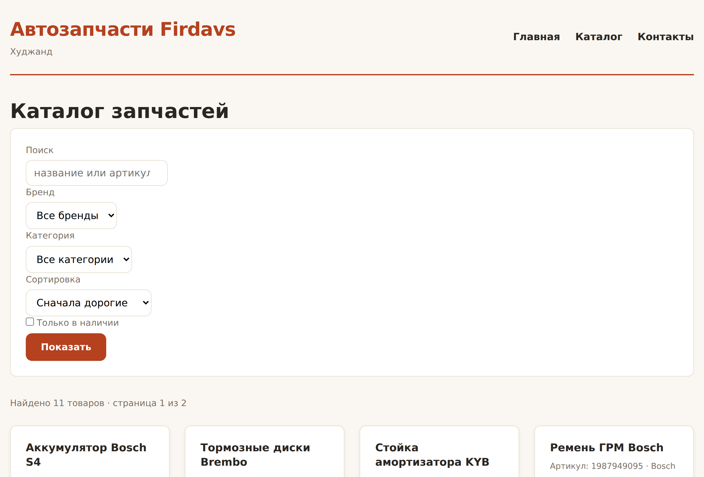
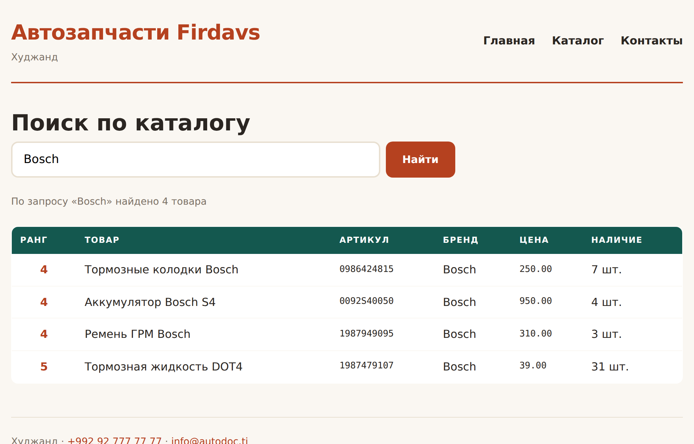
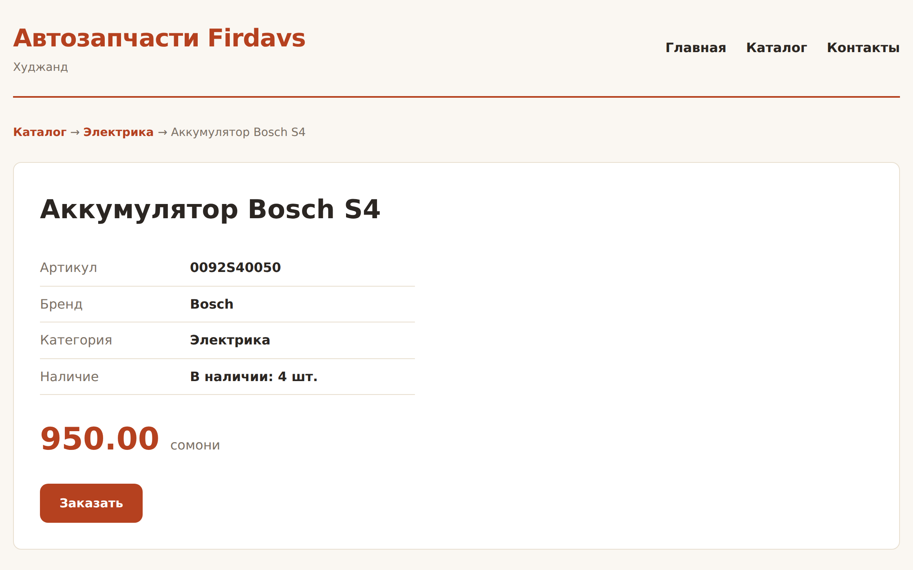

# Глава 37. Практика: рабочий каталог на базе

> **Часть VII. PHP + база = живой сайт** · Глава 37 из 60
> [← Глава 36](36-bezopasnost.md) · [Глава 38 →](38-sessii-i-korzina.md)

## 🎯 Зачем эта глава

Соберём всё, что накопилось за часть, в законченный каталог: база, безопасные
запросы, поиск, фильтры, пагинация, страница товара, защита от известных атак.

Это **опорная точка книги**. Дальше мы будем добавлять корзину, заказы, кабинеты
и маркетплейс — но фундамент останется этот.

Отдельно разберём то, чего в учебниках обычно нет: **как разложить проект,
чтобы он не превратился в кашу** к тридцатому файлу.

## 📖 Структура проекта

```
magazin/
├── config/
│   ├── db.php                    настройки базы
│   ├── db_credentials.php        пароли (в .gitignore!)
│   └── db_credentials.example.php образец для новых разработчиков
├── includes/
│   ├── bootstrap.php             единая точка входа
│   ├── db.php                    подключение и обёртки запросов
│   ├── functions.php             общие функции
│   ├── csrf.php                  защита форм
│   ├── tovary.php                всё про товары
│   ├── kategorii.php             всё про категории
│   ├── header.php
│   └── footer.php
├── assets/
│   ├── css/style.css
│   └── js/main.js
├── api/
│   └── podskazki.php             точка для JavaScript
├── storage/
│   ├── logs/                     логи
│   ├── cache/                    кэш
│   └── uploads/                  загруженные файлы
├── sql/
│   └── 001_nachalnaya_shema.sql  миграции
├── index.php                     каталог
├── tovar.php                     страница товара
└── poisk.php                     результаты поиска
```

### **`bootstrap.php` — одна точка входа**

Вместо пяти `require_once` в начале каждой страницы — один:

```php
<?php
// includes/bootstrap.php

declare(strict_types=1);

// --- Режим работы ---
define('OTLADKA', getenv('APP_DEBUG') === '1');

if (OTLADKA) {
    ini_set('display_errors', '1');
    error_reporting(E_ALL);
} else {
    ini_set('display_errors', '0');
    ini_set('log_errors', '1');
    ini_set('error_log', __DIR__ . '/../storage/logs/php-errors.log');
    error_reporting(E_ALL);
}

// --- Заголовки безопасности ---
header('X-Content-Type-Options: nosniff');
header('X-Frame-Options: SAMEORIGIN');
header('Referrer-Policy: strict-origin-when-cross-origin');

// --- Сессия ---
session_set_cookie_params([
    'lifetime' => 0,
    'path'     => '/',
    'httponly' => true,
    'secure'   => !empty($_SERVER['HTTPS']),
    'samesite' => 'Lax',
]);
session_start();

// --- Общий код ---
require_once __DIR__ . '/config.php';
require_once __DIR__ . '/db.php';
require_once __DIR__ . '/functions.php';
require_once __DIR__ . '/csrf.php';
require_once __DIR__ . '/tovary.php';
require_once __DIR__ . '/kategorii.php';
```

Теперь страница начинается одной строкой:

```php
<?php
require_once __DIR__ . '/includes/bootstrap.php';
```

**`declare(strict_types=1)`** заставляет PHP строго проверять типы: передали
строку туда, где ждали число, — сразу ошибка, а не тихое приведение.
Ставьте в каждом файле — ловит ошибки на раннем этапе.

### **Почему `storage/` отдельно**

Логи, кэш и загрузки — это **данные**, а не код. Их не хранят в git
и обязательно исключают из репозитория:

```
# .gitignore
config/db_credentials.php
storage/logs/*
storage/cache/*
storage/uploads/*
!storage/*/.gitkeep
```

Последняя строка нужна, чтобы сами папки в репозитории остались.

## 💻 Слой данных

```php
<?php
// includes/tovary.php
declare(strict_types=1);

const POLYA_KARTOCHKI = 't.id, t.nazvanie, t.artikul, t.brend, t.cena, t.ostatok, t.foto';

/** Разрешённые сортировки. Из адреса приходит только ключ. */
const SORTIROVKI = [
    'nazvanie'  => 't.nazvanie ASC',
    'cena_vozr' => 't.cena ASC',
    'cena_ubyv' => 't.cena DESC',
    'novye'     => 't.sozdan DESC',
    'ostatok'   => 't.ostatok DESC',
];

/**
 * Каталог с фильтрами и пагинацией.
 *
 * Условия собираются один раз и используются и для выборки, и для подсчёта —
 * иначе числа в пагинации разъедутся с реальным количеством.
 */
function katalog(array $filtry, int $stranica = 1, int $na_stranice = 12): array
{
    $usloviya = ['t.aktivnyi = 1', 't.status = :status'];
    $parametry = ['status' => 'opublikovan'];

    if (!empty($filtry['zapros']) && mb_strlen($filtry['zapros']) >= 2) {
        $usloviya[] = '(t.nazvanie LIKE :zapros OR t.artikul LIKE :zapros2 OR t.brend LIKE :zapros3)';
        $shablon = '%' . $filtry['zapros'] . '%';
        $parametry['zapros']  = $shablon;
        $parametry['zapros2'] = $shablon;
        $parametry['zapros3'] = $shablon;
    }

    if (!empty($filtry['kategoriya_id'])) {
        $usloviya[] = 't.kategoriya_id = :kategoriya';
        $parametry['kategoriya'] = (int) $filtry['kategoriya_id'];
    }

    if (!empty($filtry['brend'])) {
        $usloviya[] = 't.brend = :brend';
        $parametry['brend'] = $filtry['brend'];
    }

    if (!empty($filtry['cena_ot'])) {
        $usloviya[] = 't.cena >= :cena_ot';
        $parametry['cena_ot'] = (int) $filtry['cena_ot'] * 100;
    }

    if (!empty($filtry['cena_do'])) {
        $usloviya[] = 't.cena <= :cena_do';
        $parametry['cena_do'] = (int) $filtry['cena_do'] * 100;
    }

    if (!empty($filtry['tolko_v_nalichii'])) {
        $usloviya[] = 't.ostatok > 0';
    }

    $where = implode(' AND ', $usloviya);
    $order = SORTIROVKI[$filtry['sort'] ?? ''] ?? SORTIROVKI['nazvanie'];

    // LIMIT/OFFSET не принимают параметры — приводим к числу сами
    $na_stranice = max(1, min(48, $na_stranice));
    $stranica    = max(1, $stranica);
    $offset      = ($stranica - 1) * $na_stranice;

    $tovary = zapros("
        SELECT " . POLYA_KARTOCHKI . ", k.nazvanie AS kategoriya
        FROM tovary AS t
        LEFT JOIN kategorii AS k ON k.id = t.kategoriya_id
        WHERE $where
        ORDER BY $order
        LIMIT $na_stranice OFFSET $offset
    ", $parametry);

    $vsego = (int) zapros_znachenie("
        SELECT COUNT(*) FROM tovary AS t WHERE $where
    ", $parametry);

    return [
        'tovary'   => $tovary,
        'vsego'    => $vsego,
        'stranica' => $stranica,
        'stranic'  => max(1, (int) ceil($vsego / $na_stranice)),
    ];
}

function tovar_po_id(int $id): ?array
{
    return zapros_odin('
        SELECT t.*, k.nazvanie AS kategoriya, k.id AS kategoriya_id
        FROM tovary AS t
        LEFT JOIN kategorii AS k ON k.id = t.kategoriya_id
        WHERE t.id = :id AND t.aktivnyi = 1 AND t.status = :status
    ', ['id' => $id, 'status' => 'opublikovan']);
}

function pohozhie(int $tovar_id, ?int $kategoriya_id, int $skolko = 4): array
{
    if (!$kategoriya_id) return [];

    return zapros('
        SELECT ' . POLYA_KARTOCHKI . '
        FROM tovary AS t
        WHERE t.kategoriya_id = :kat AND t.id <> :id
          AND t.aktivnyi = 1 AND t.status = :status
        ORDER BY t.ostatok DESC
        LIMIT ' . (int) $skolko,
        ['kat' => $kategoriya_id, 'id' => $tovar_id, 'status' => 'opublikovan']
    );
}

function brendy_s_kolichestvom(): array
{
    return zapros('
        SELECT brend, COUNT(*) AS shtuk
        FROM tovary
        WHERE aktivnyi = 1 AND status = :status AND brend <> ""
        GROUP BY brend
        ORDER BY shtuk DESC, brend
    ', ['status' => 'opublikovan']);
}
```

### **Почему здесь именованные параметры**

В этой функции их семь и они появляются по-разному в зависимости от фильтров.
С позиционными `?` пришлось бы следить за **порядком** — а он меняется от набора
включённых фильтров.

С именованными порядок не важен: параметр найдётся по имени. При сложных условиях
это заметно надёжнее.

⚠️ Обратите внимание: `:zapros`, `:zapros2`, `:zapros3` — три разных имени
с одинаковым значением. В PDO с отключённой эмуляцией один параметр нельзя
использовать дважды в запросе.

## 💻 Страница каталога

```php
<?php
// index.php
require_once __DIR__ . '/includes/bootstrap.php';

$filtry = [
    'zapros'           => trim($_GET['q'] ?? ''),
    'kategoriya_id'    => (int) ($_GET['kategoriya'] ?? 0),
    'brend'            => trim($_GET['brend'] ?? ''),
    'cena_ot'          => (int) ($_GET['cena_ot'] ?? 0),
    'cena_do'          => (int) ($_GET['cena_do'] ?? 0),
    'tolko_v_nalichii' => isset($_GET['est']),
    'sort'             => $_GET['sort'] ?? '',
];

$stranica = max(1, (int) ($_GET['page'] ?? 1));
$r = katalog($filtry, $stranica, 12);

// Страница за пределами диапазона — честная 404, чтобы поисковик
// не набрал тысячи пустых адресов
if ($stranica > $r['stranic'] && $r['vsego'] > 0) {
    http_response_code(404);
}

$zagolovok = $filtry['zapros'] !== ''
    ? 'Поиск: ' . $filtry['zapros']
    : 'Каталог запчастей — ' . SAIT_NAZVANIE;

require __DIR__ . '/includes/header.php';
?>

<h1><?= $filtry['zapros'] !== '' ? 'Результаты поиска' : 'Каталог запчастей' ?></h1>

<form class="filtry" method="GET">
    <div class="ryad">
        <div class="pole-shirokoe">
            <label for="q">Поиск</label>
            <input type="search" id="q" name="q" value="<?= e($filtry['zapros']) ?>"
                   placeholder="название, артикул или бренд">
        </div>

        <div>
            <label for="brend">Бренд</label>
            <select id="brend" name="brend">
                <option value="">Все</option>
                <?php foreach (brendy_s_kolichestvom() as $b): ?>
                    <option value="<?= e($b['brend']) ?>"
                            <?= $filtry['brend'] === $b['brend'] ? 'selected' : '' ?>>
                        <?= e($b['brend']) ?> (<?= (int) $b['shtuk'] ?>)
                    </option>
                <?php endforeach; ?>
            </select>
        </div>

        <div class="uzkoe">
            <label for="cena_ot">Цена от</label>
            <input type="number" id="cena_ot" name="cena_ot" min="0"
                   value="<?= $filtry['cena_ot'] ?: '' ?>">
        </div>

        <div class="uzkoe">
            <label for="cena_do">до</label>
            <input type="number" id="cena_do" name="cena_do" min="0"
                   value="<?= $filtry['cena_do'] ?: '' ?>">
        </div>

        <div>
            <label for="sort">Сортировка</label>
            <select id="sort" name="sort">
                <option value="nazvanie">По названию</option>
                <option value="cena_vozr"
                        <?= $filtry['sort'] === 'cena_vozr' ? 'selected' : '' ?>>
                    Сначала дешёвые
                </option>
                <option value="cena_ubyv"
                        <?= $filtry['sort'] === 'cena_ubyv' ? 'selected' : '' ?>>
                    Сначала дорогие
                </option>
                <option value="ostatok"
                        <?= $filtry['sort'] === 'ostatok'   ? 'selected' : '' ?>>
                    Больше в наличии
                </option>
            </select>
        </div>

        <label class="galka">
            <input type="checkbox" name="est" value="1" <?= $filtry['tolko_v_nalichii'] ? 'checked' : '' ?>>
            Только в наличии
        </label>

        <button type="submit">Показать</button>
        <?php if (array_filter($filtry)): ?>
            <a class="sbros" href="index.php">Сбросить</a>
        <?php endif; ?>
    </div>
</form>

<p class="schetchik">
    Найдено <?= $r['vsego'] ?>
    <?= sklonenie($r['vsego'], 'товар', 'товара', 'товаров') ?>
    <?php if ($r['stranic'] > 1): ?>
        · страница <?= $r['stranica'] ?> из <?= $r['stranic'] ?>
    <?php endif; ?>
</p>

<?php if ($r['vsego'] === 0): ?>

    <div class="pusto">
        <h3>Ничего не нашлось</h3>
        <?php if ($filtry['zapros'] !== ''): ?>
            <p>По запросу «<?= e($filtry['zapros']) ?>» ничего нет.
               Попробуйте искать по артикулу или части названия.</p>
        <?php else: ?>
            <p>Попробуйте изменить фильтры.</p>
        <?php endif; ?>
        <a class="knopka" href="index.php">Показать все товары</a>
    </div>

<?php else: ?>

    <div class="katalog">
        <?php foreach ($r['tovary'] as $t): ?>
            <article class="tovar">
                <h3><a href="tovar.php?id=<?= (int) $t['id'] ?>"><?= e($t['nazvanie']) ?></a></h3>
                <p class="artikul">
                    <?= e($t['artikul']) ?>
                    <?php if ($t['brend'] !== ''): ?> · <?= e($t['brend']) ?><?php endif; ?>
                </p>
                <p class="cena"><?= somoni((int) $t['cena']) ?> <span>сомони</span></p>
                <?php if ((int) $t['ostatok'] > 0): ?>
                    <p class="nalichie">В наличии: <?= (int) $t['ostatok'] ?> шт.</p>
                <?php else: ?>
                    <p class="nalichie nety">Под заказ, 5 дней</p>
                <?php endif; ?>
                <a class="knopka" href="tovar.php?id=<?= (int) $t['id'] ?>">Подробнее</a>
            </article>
        <?php endforeach; ?>
    </div>

    <?= stranicy($r['stranica'], $r['stranic']) ?>

<?php endif; ?>

<?php require __DIR__ . '/includes/footer.php'; ?>
```

## 💻 Страница товара

```php
<?php
// tovar.php
require_once __DIR__ . '/includes/bootstrap.php';

$id = (int) ($_GET['id'] ?? 0);
$tovar = $id > 0 ? tovar_po_id($id) : null;

if ($tovar === null) {
    http_response_code(404);
    $zagolovok = 'Товар не найден';
    require __DIR__ . '/includes/header.php';
    ?>
    <div class="pusto">
        <h1>Товар не найден</h1>
        <p>Возможно, он снят с продажи или в ссылке опечатка.</p>
        <a class="knopka" href="index.php">Вернуться в каталог</a>
    </div>
    <?php
    require __DIR__ . '/includes/footer.php';
    exit;
}

$zagolovok = $tovar['nazvanie'] . ' — ' . SAIT_NAZVANIE;
$opisanie_stranicy = mb_substr(strip_tags($tovar['opisanie'] ?? ''), 0, 155);

require __DIR__ . '/includes/header.php';
?>

<nav class="hlebnye-kroshki">
    <a href="index.php">Каталог</a> →
    <?php if ($tovar['kategoriya_id']): ?>
        <a href="index.php?kategoriya=<?= (int) $tovar['kategoriya_id'] ?>">
            <?= e($tovar['kategoriya']) ?>
        </a> →
    <?php endif; ?>
    <span><?= e($tovar['nazvanie']) ?></span>
</nav>

<article class="tovar-podrobno">
    <h1><?= e($tovar['nazvanie']) ?></h1>

    <table class="harakteristiki">
        <tr><th>Артикул</th><td class="mono"><?= e($tovar['artikul']) ?></td></tr>
        <tr><th>Бренд</th><td><?= e($tovar['brend']) ?></td></tr>
        <?php if ($tovar['kategoriya']): ?>
            <tr><th>Категория</th><td><?= e($tovar['kategoriya']) ?></td></tr>
        <?php endif; ?>
        <tr><th>Наличие</th><td>
            <?= (int) $tovar['ostatok'] > 0
                ? 'В наличии: ' . (int) $tovar['ostatok'] . ' шт.'
                : 'Под заказ, срок 5 дней' ?>
        </td></tr>
    </table>

    <?php if (!empty($tovar['opisanie'])): ?>
        <h2>Описание</h2>
        <p><?= nl2br(e($tovar['opisanie'])) ?></p>
    <?php endif; ?>

    <p class="cena-bolshaya"><?= somoni((int) $tovar['cena']) ?> <span>сомони</span></p>

    <form method="POST" action="korzina.php">
        <?= csrf_pole() ?>
        <input type="hidden" name="tovar_id" value="<?= (int) $tovar['id'] ?>">
        <input type="number" name="kolichestvo" value="1" min="1"
               max="<?= max(1, (int) $tovar['ostatok']) ?>">
        <button type="submit">В корзину</button>
    </form>
</article>

<?php
$kat = $tovar['kategoriya_id'] ? (int) $tovar['kategoriya_id'] : null;
$rekomendacii = pohozhie((int) $tovar['id'], $kat);
?>
<?php if ($rekomendacii): ?>
    <h2>Похожие товары</h2>
    <div class="katalog">
        <?php foreach ($rekomendacii as $p): ?>
            <article class="tovar">
                <h3><a href="tovar.php?id=<?= (int) $p['id'] ?>"><?= e($p['nazvanie']) ?></a></h3>
                <p class="cena"><?= somoni((int) $p['cena']) ?> <span>сомони</span></p>
            </article>
        <?php endforeach; ?>
    </div>
<?php endif; ?>

<?php require __DIR__ . '/includes/footer.php'; ?>
```

**`nl2br(e($text))`** — сначала экранируем, потом переносы строк превращаем
в `<br>`. Порядок важен: наоборот получилось бы экранирование самих `<br>`.

## 🖥 На экране

Каталог со всеми фильтрами:



Поиск с сохранением фильтров в адресе:



Страница товара:



## 📖 Проверьте себя

Прежде чем идти дальше, прогоните свой каталог по списку:

**Работает:**
- [ ] Каталог открывается, товары из базы
- [ ] Поиск находит по названию, артикулу, бренду
- [ ] Фильтры по бренду, цене, наличию
- [ ] Сортировка четырьмя способами
- [ ] Пагинация сохраняет фильтры
- [ ] Страница товара с похожими
- [ ] Несуществующий товар отдаёт 404
- [ ] Пустой результат предлагает выход

**Безопасно:**
- [ ] `?brend=' OR '1'='1` ничего не ломает
- [ ] `?sort=1;DROP TABLE tovary` игнорируется
- [ ] `?q=<script>alert(1)</script>` показывается как текст
- [ ] `?page=-100` и `?page=999999` не ломают страницу
- [ ] У формы в корзину есть CSRF-токен

**Быстро:**
- [ ] Запросов на страницу не больше десяти
- [ ] Есть индексы на `artikul`, `brend`, `kategoriya_id`
- [ ] Каталог открывается быстрее 200 мс

## ⚠️ Грабли

**Разные условия в выборке и в `COUNT`.** Собирайте один раз.

**Один именованный параметр дважды в запросе.** С отключённой эмуляцией
не сработает — заводите отдельные имена.

**Не ограничить `$na_stranice`.** `?na_stranice=999999` положит сервер.

**200 вместо 404 для несуществующего товара.** Поисковик наберёт мусора.

**`nl2br` перед экранированием.** Сломает переносы.

**Забыть CSRF в форме корзины.** Товар положат за человека с чужого сайта.

**Хранить `storage/` в git.** Логи и загрузки — не код.

## 🏋️ Задачи

**Задача 37.1.** Соберите каталог целиком: структура папок, `bootstrap.php`,
слой данных, три страницы.

**Задача 37.2.** Пройдитесь по всему списку проверки. Каждый невыполненный
пункт — почините.

**Задача 37.3.** Добавьте фильтр по категории с деревом в боковой колонке.

**Задача 37.4.** Сделайте страницу категории с человеческим адресом:
`/kategoriya/tormoznye-kolodki` вместо `?kategoriya=3`.

**Задача 37.5.** Добавьте счётчик запросов и время сборки в подвал
при `OTLADKA`.

**Задача 37.6.** Залейте в базу 20 000 товаров и замерьте каталог.
Помогают ли индексы?

**Задача 37.7.** Сделайте страницу «Новинки» и «Со скидкой».

**Задача 37.8.** Добавьте на страницу товара микроразметку `schema.org`,
чтобы поисковик показывал цену прямо в выдаче.

**Задача 37.9.** Проверьте сайт на телефоне. Всё удобно?

*Ответы — в [Приложении Г](../prilozheniya/4-G-otvety.md).*

## 🔗 В бою

Сравните свою структуру с корнем этого репозитория: `includes/`, `pages/`,
`api/`, `sql/`, `storage/`, `config/`. Тот же принцип разделения.

Одно отличие бросится в глаза: в боевом проекте файлов гораздо больше,
и они разбиты по смыслу — не один `tovary.php`, а отдельные файлы под каталог,
под цены поставщика, под словарь поиска.

Это естественный рост. Начинайте с простого разделения, дробите по мере
необходимости. Преждевременное дробление на двадцать файлов, когда кода
на триста строк, — такая же ошибка, как складывать всё в один.

## 📌 Итог

- **`bootstrap.php`** — одна точка входа вместо пяти `require_once`.
- `declare(strict_types=1)` ловит ошибки типов рано.
- **Слой данных отдельно** от страниц. Страница не знает SQL.
- Условия для выборки и `COUNT` собираются **один раз**.
- Именованные параметры удобнее при сложных фильтрах. Каждое имя — своё.
- `LIMIT` ограничивайте сверху.
- Несуществующий товар — **404**.
- `storage/` и секреты — вне репозитория.
- Проверяйте себя списком: работает, безопасно, быстро.

**Часть VII закончена.** У вас настоящий каталог на базе данных.

Дальше начинается магазин: корзина, регистрация, заказы.

[← Глава 36](36-bezopasnost.md) · [Глава 38. Сессии и корзина →](38-sessii-i-korzina.md)
