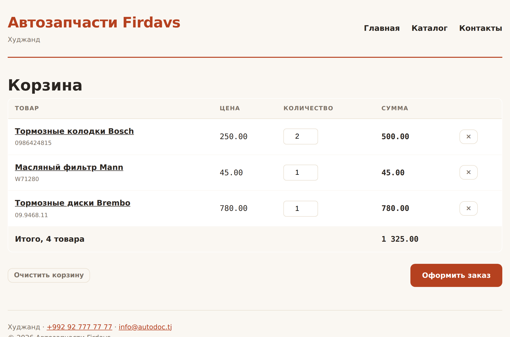

# Глава 38. Сессии и корзина

> **Часть VIII. Магазин** · Глава 38 из 60
> [← Глава 37](37-praktika-katalog-bd.md) · [Глава 39 →](39-registraciya-i-vhod.md)

## 🎯 Зачем эта глава

HTTP не помнит ничего. Каждый запрос для сервера — как первая встреча:
кто пришёл, что делал раньше, что положил в корзину — неизвестно.

Помните главу 2? Запрос, ответ, конец разговора. Никакой связи между запросами.

Но магазину нужно помнить. Покупатель кладёт товар на одной странице,
а оформляет заказ на другой — и корзина должна доехать.

Механизм, который это решает, называется **сессией**. Разберём его и сделаем
на нём настоящую корзину.

## 📖 Как сервер запоминает посетителя

Раз протокол не помнит, придумали обходной путь.

**Шаг 1.** Посетитель приходит впервые. Сервер выдаёт ему **длинный случайный
номер** — идентификатор сессии — и просит браузер его сохранить:

```
Set-Cookie: PHPSESSID=a7f3d9e2b1c8...; HttpOnly; SameSite=Lax
```

**Шаг 2.** Браузер сохраняет этот номер в **куках** и присылает обратно
с **каждым** следующим запросом:

```
Cookie: PHPSESSID=a7f3d9e2b1c8...
```

**Шаг 3.** Сервер по номеру находит папку с данными этого посетителя —
и вспоминает всё.

Аналогия: **номерок в гардеробе**. Номерок у вас, пальто у гардеробщика.
Сам номерок ничего не весит и ничего не говорит о пальто — но по нему находят.

### **Кука и сессия — разные вещи**

Путаница частая, поэтому разведём:

| | Кука | Сессия |
|---|---|---|
| Где хранится | **У посетителя**, в браузере | **На сервере** |
| Кто видит | Посетитель может прочитать и изменить | Только сервер |
| Размер | До 4 КБ | Сколько угодно |
| Что кладут | Идентификатор сессии, мелкие настройки | Корзину, права, данные пользователя |

**Правило: в куке — только номерок. Всё важное — в сессии на сервере.**

Кука лежит у посетителя, и он может её переписать. Положите туда `admin=1` —
и админом станет любой желающий.

## 📖 Работа с сессией

```php
// Правильный старт — как в bootstrap.php из главы 37
session_set_cookie_params([
    'lifetime' => 0,           // до закрытия браузера
    'path'     => '/',
    'httponly' => true,        // JavaScript не видит
    'secure'   => !empty($_SERVER['HTTPS']),
    'samesite' => 'Lax',
]);
session_start();

// Записать
$_SESSION['korzina'] = [];
$_SESSION['polzovatel_id'] = 42;

// Прочитать
$id = $_SESSION['polzovatel_id'] ?? null;

// Проверить
if (isset($_SESSION['polzovatel_id'])) { ... }

// Удалить одно значение
unset($_SESSION['korzina']);

// Завершить сессию целиком
session_destroy();
```

⚠️ **`session_start()` должен идти до любого вывода.** Он отправляет заголовок
`Set-Cookie`, а заголовки уходят раньше содержимого. Один пробел перед `<?php` —
и получите «headers already sent».

Именно поэтому мы вынесли старт сессии в `bootstrap.php`, который подключается
первой строкой.

## 📖 Корзина: три способа хранения

| Способ | Плюсы | Минусы |
|---|---|---|
| **В сессии** | Просто, быстро | Пропадает при смене устройства и по таймауту |
| **В базе** | Переживает всё, видна аналитике | Сложнее, лишние запросы |
| **Смешанно** | Гости в сессии, вошедшие в базе | Нужен перенос при входе |

Сделаем **смешанный** — так работают настоящие магазины.

### **Что хранить в корзине**

Только `id` товара и количество:

```php
$_SESSION['korzina'] = [
    1 => 2,     // товар №1, две штуки
    5 => 1,
];
```

⚠️ **Ни названий, ни цен.** Помните главу 18? Причины те же, но теперь
серьёзнее:

- **цена могла измениться** между добавлением и оформлением;
- **товар мог закончиться**;
- **название могли поправить**.

Всё это подтягивается из базы **в момент показа корзины**. Тогда покупатель
всегда видит правду, а не снимок недельной давности.

## 💻 Корзина

```php
<?php
// includes/korzina.php
declare(strict_types=1);

/** Что лежит в корзине: [id товара => количество]. */
function korzina_soderzhimoe(): array
{
    return $_SESSION['korzina'] ?? [];
}

/** Добавить. Возвращает текст ошибки или null, если всё хорошо. */
function korzina_dobavit(int $tovar_id, int $kolichestvo = 1): ?string
{
    if ($kolichestvo < 1) return 'Количество должно быть больше нуля';

    // Товар берём из базы — доверять пришедшему id нельзя
    $tovar = zapros_odin('
        SELECT id, nazvanie, ostatok
        FROM tovary
        WHERE id = ? AND aktivnyi = 1 AND status = "opublikovan"
    ', [$tovar_id]);

    if ($tovar === null) return 'Товар не найден или снят с продажи';

    $uzhe = korzina_soderzhimoe()[$tovar_id] ?? 0;
    $stanet = $uzhe + $kolichestvo;

    if ($stanet > (int) $tovar['ostatok']) {
        $ostalos = (int) $tovar['ostatok'];
        return $ostalos > 0
            ? "Доступно только $ostalos шт."
            : 'Товара нет в наличии';
    }

    $_SESSION['korzina'][$tovar_id] = $stanet;
    return null;
}

/** Изменить количество. Ноль — убрать позицию. */
function korzina_izmenit(int $tovar_id, int $kolichestvo): ?string
{
    if ($kolichestvo <= 0) {
        unset($_SESSION['korzina'][$tovar_id]);
        return null;
    }

    $ostatok = (int) zapros_znachenie('SELECT ostatok FROM tovary WHERE id = ?', [$tovar_id]);
    if ($kolichestvo > $ostatok) return "Доступно только $ostatok шт.";

    $_SESSION['korzina'][$tovar_id] = $kolichestvo;
    return null;
}

function korzina_ubrat(int $tovar_id): void
{
    unset($_SESSION['korzina'][$tovar_id]);
}

function korzina_ochistit(): void
{
    $_SESSION['korzina'] = [];
}

/**
 * Полные данные корзины: товары, суммы, предупреждения.
 * Цены и остатки берутся из базы прямо сейчас, а не из сессии.
 */
function korzina_podrobno(): array
{
    $soderzhimoe = korzina_soderzhimoe();

    if (empty($soderzhimoe)) {
        return ['pozicii' => [], 'summa' => 0, 'shtuk' => 0, 'preduprezhdeniya' => []];
    }

    // Один запрос на все товары — не N+1
    $metki = implode(',', array_fill(0, count($soderzhimoe), '?'));
    $tovary = zapros("
        SELECT id, nazvanie, artikul, cena, ostatok, aktivnyi, status
        FROM tovary WHERE id IN ($metki)
    ", array_keys($soderzhimoe));

    $po_id = array_column($tovary, null, 'id');

    $pozicii = [];
    $summa = 0;
    $shtuk = 0;
    $preduprezhdeniya = [];

    foreach ($soderzhimoe as $id => $kolichestvo) {
        $t = $po_id[$id] ?? null;

        // Товар исчез из каталога, пока лежал в корзине
        if ($t === null || (int) $t['aktivnyi'] !== 1 || $t['status'] !== 'opublikovan') {
            unset($_SESSION['korzina'][$id]);
            $preduprezhdeniya[] = 'Один товар снят с продажи и убран из корзины';
            continue;
        }

        // Остаток уменьшился, пока товар лежал в корзине
        if ($kolichestvo > (int) $t['ostatok']) {
            $kolichestvo = (int) $t['ostatok'];
            if ($kolichestvo === 0) {
                unset($_SESSION['korzina'][$id]);
                $preduprezhdeniya[] = e($t['nazvanie']) . ' закончился и убран из корзины';
                continue;
            }
            $_SESSION['korzina'][$id] = $kolichestvo;
            $preduprezhdeniya[] = e($t['nazvanie']) . ": осталось $kolichestvo шт., количество уменьшено";
        }

        $stoimost = (int) $t['cena'] * $kolichestvo;
        $summa += $stoimost;
        $shtuk += $kolichestvo;

        $pozicii[] = [
            'id'          => (int) $t['id'],
            'nazvanie'    => $t['nazvanie'],
            'artikul'     => $t['artikul'],
            'cena'        => (int) $t['cena'],
            'kolichestvo' => $kolichestvo,
            'stoimost'    => $stoimost,
            'ostatok'     => (int) $t['ostatok'],
        ];
    }

    return [
        'pozicii'          => $pozicii,
        'summa'            => $summa,
        'shtuk'            => $shtuk,
        'preduprezhdeniya' => $preduprezhdeniya,
    ];
}

/** Сколько штук — для значка в шапке. */
function korzina_schetchik(): int
{
    return array_sum(korzina_soderzhimoe());
}
```

### **Главная мысль этой функции**

Обратите внимание на два блока с предупреждениями.

Товар лежал в корзине три дня. За это время его могли снять с продажи,
он мог закончиться, цена могла вырасти.

**Наивная корзина об этом не узнает** и покажет старые данные. Человек оформит
заказ, а склад пуст — и разбираться придётся менеджеру по телефону.

Правильная корзина **сверяется с базой при каждом показе** и честно говорит:
«этого больше нет», «осталось меньше». Неприятно, но честно — и это лучше,
чем неприятный сюрприз после оплаты.

**Такие вещи и отличают учебный код от рабочего.**

## 💻 Обработчик действий

```php
<?php
// korzina.php
require_once __DIR__ . '/includes/bootstrap.php';
require_once __DIR__ . '/includes/korzina.php';

$soobshenie = null;
$oshibka = null;

if ($_SERVER['REQUEST_METHOD'] === 'POST') {
    csrf_proverit();

    $deystvie = $_POST['deystvie'] ?? '';
    $tovar_id = (int) ($_POST['tovar_id'] ?? 0);

    switch ($deystvie) {
        case 'dobavit':
            $kol = max(1, (int) ($_POST['kolichestvo'] ?? 1));
            $oshibka = korzina_dobavit($tovar_id, $kol);
            $soobshenie = $oshibka === null ? 'Товар добавлен в корзину' : null;
            break;

        case 'izmenit':
            $oshibka = korzina_izmenit($tovar_id, (int) ($_POST['kolichestvo'] ?? 0));
            break;

        case 'ubrat':
            korzina_ubrat($tovar_id);
            $soobshenie = 'Товар убран из корзины';
            break;

        case 'ochistit':
            korzina_ochistit();
            $soobshenie = 'Корзина очищена';
            break;
    }

    // PRG из главы 24: после POST — перенаправление,
    // иначе F5 повторит действие
    $_SESSION['flash'] = ['soobshenie' => $soobshenie, 'oshibka' => $oshibka];
    header('Location: korzina.php');
    exit;
}

// Сообщение, оставленное перед перенаправлением
$flash = $_SESSION['flash'] ?? [];
unset($_SESSION['flash']);

$k = korzina_podrobno();

$zagolovok = 'Корзина — ' . SAIT_NAZVANIE;
require __DIR__ . '/includes/header.php';
?>

<h1>Корзина</h1>

<?php if (!empty($flash['soobshenie'])): ?>
    <div class="uspeh-uzkiy"><?= e($flash['soobshenie']) ?></div>
<?php endif; ?>

<?php if (!empty($flash['oshibka'])): ?>
    <div class="oshibka-obshaya"><?= e($flash['oshibka']) ?></div>
<?php endif; ?>

<?php foreach ($k['preduprezhdeniya'] as $p): ?>
    <div class="preduprezhdenie"><?= $p ?></div>
<?php endforeach; ?>

<?php if (empty($k['pozicii'])): ?>

    <div class="pusto">
        <h3>Корзина пуста</h3>
        <p>Выберите запчасти в каталоге.</p>
        <a class="knopka" href="index.php">Перейти в каталог</a>
    </div>

<?php else: ?>

    <table class="korzina-tablica">
        <thead>
            <tr>
                <th>Товар</th><th>Цена</th><th>Количество</th><th>Сумма</th><th></th>
            </tr>
        </thead>
        <tbody>
        <?php foreach ($k['pozicii'] as $p): ?>
            <tr>
                <td>
                    <a href="tovar.php?id=<?= $p['id'] ?>"><?= e($p['nazvanie']) ?></a>
                    <div class="artikul"><?= e($p['artikul']) ?></div>
                </td>
                <td class="mono"><?= somoni($p['cena']) ?></td>
                <td>
                    <form method="POST" class="kolichestvo-forma">
                        <?= csrf_pole() ?>
                        <input type="hidden" name="deystvie" value="izmenit">
                        <input type="hidden" name="tovar_id" value="<?= $p['id'] ?>">
                        <input type="number" name="kolichestvo" value="<?= $p['kolichestvo'] ?>"
                               min="0" max="<?= $p['ostatok'] ?>"
                               onchange="this.form.submit()">
                    </form>
                </td>
                <td class="mono"><strong><?= somoni($p['stoimost']) ?></strong></td>
                <td>
                    <form method="POST">
                        <?= csrf_pole() ?>
                        <input type="hidden" name="deystvie" value="ubrat">
                        <input type="hidden" name="tovar_id" value="<?= $p['id'] ?>">
                        <button type="submit" class="knopka-tihaya">×</button>
                    </form>
                </td>
            </tr>
        <?php endforeach; ?>
        </tbody>
        <tfoot>
            <tr>
                <td colspan="3">Итого, <?= $k['shtuk'] ?>
                    <?= sklonenie($k['shtuk'], 'товар', 'товара', 'товаров') ?></td>
                <td class="mono"><strong><?= somoni($k['summa']) ?></strong></td>
                <td></td>
            </tr>
        </tfoot>
    </table>

    <div class="korzina-deystviya">
        <form method="POST">
            <?= csrf_pole() ?>
            <input type="hidden" name="deystvie" value="ochistit">
            <button type="submit" class="knopka-tihaya">Очистить корзину</button>
        </form>
        <a class="knopka" href="checkout.php">Оформить заказ</a>
    </div>

<?php endif; ?>

<?php require __DIR__ . '/includes/footer.php'; ?>
```

### **Приём «flash-сообщение»**

Обратите внимание на `$_SESSION['flash']`.

После POST мы перенаправляем (PRG из главы 24), но сообщение «товар добавлен»
нужно показать **после** перенаправления. Решение: положить его в сессию,
на следующей странице показать и сразу удалить.

Такое одноразовое сообщение называется **flash**. Есть в любом фреймворке,
и вот как оно устроено внутри.

## 📖 Перенос корзины при входе

Гость положил товары, потом вошёл в аккаунт. Корзину нужно сохранить.

```php
function korzina_perenesti_v_bazu(int $polzovatel_id): void
{
    $sessionnaya = korzina_soderzhimoe();
    if (empty($sessionnaya)) return;

    foreach ($sessionnaya as $tovar_id => $kolichestvo) {
        vypolnit('
            INSERT INTO korzina (polzovatel_id, tovar_id, kolichestvo)
            VALUES (?, ?, ?)
            ON DUPLICATE KEY UPDATE kolichestvo = kolichestvo + VALUES(kolichestvo)
        ', [$polzovatel_id, $tovar_id, $kolichestvo]);
    }

    korzina_ochistit();
}
```

`ON DUPLICATE KEY UPDATE` из главы 28: если товар уже был в базе-корзине,
количества складываются.

## 📖 Живая корзина без перезагрузки

Каждое действие перезагружает страницу — работает, но не современно.
Добавим обновление через `fetch`.

```php
<?php
// api/korzina.php
require_once __DIR__ . '/../includes/bootstrap.php';
require_once __DIR__ . '/../includes/korzina.php';

header('Content-Type: application/json; charset=utf-8');

if ($_SERVER['REQUEST_METHOD'] !== 'POST') {
    http_response_code(405);
    echo json_encode(['ok' => false, 'oshibka' => 'Метод не разрешён']);
    exit;
}

csrf_proverit();

$oshibka = korzina_dobavit(
    (int) ($_POST['tovar_id'] ?? 0),
    max(1, (int) ($_POST['kolichestvo'] ?? 1))
);

echo json_encode([
    'ok'        => $oshibka === null,
    'oshibka'   => $oshibka,
    'schetchik' => korzina_schetchik(),
], JSON_UNESCAPED_UNICODE);
```

```javascript
// assets/js/korzina.js
document.addEventListener('click', async (e) => {
    const knopka = e.target.closest('[data-v-korzinu]');
    if (!knopka) return;

    e.preventDefault();
    knopka.disabled = true;

    const dannye = new FormData();
    dannye.append('tovar_id', knopka.dataset.vKorzinu);
    dannye.append('kolichestvo', '1');
    dannye.append('csrf_token', document.querySelector('meta[name="csrf"]').content);

    try {
        const otvet = await fetch('/api/korzina.php', { method: 'POST', body: dannye });
        const r = await otvet.json();

        if (r.ok) {
            document.querySelector('.korzina-schetchik').textContent = r.schetchik;
            knopka.textContent = 'Добавлено';
            setTimeout(() => { knopka.textContent = 'В корзину'; }, 1200);
        } else {
            alert(r.oshibka);
        }
    } catch (err) {
        alert('Не удалось добавить. Проверьте связь.');
    } finally {
        knopka.disabled = false;
    }
});
```

⚠️ **CSRF-токен нужен и здесь.** Кладём его в `<meta>` в шапке:

```html
<meta name="csrf" content="<?= e(csrf_token()) ?>">
```

⚠️ `finally` выполнится в любом случае — и при успехе, и при ошибке.
Кнопка обязательно разблокируется, даже если что-то пошло не так.

## 🖥 На экране

Корзина с товарами:



## 🔤 Разбор по словам

| Запись | Что делает |
|---|---|
| `session_start()` | Начать сессию. **До любого вывода** |
| `$_SESSION['kluch']` | Данные на сервере, привязанные к посетителю |
| `PHPSESSID` | Кука с номерком сессии |
| `session_destroy()` | Завершить сессию |
| `httponly` | JavaScript не видит куку |
| `samesite` | Кука не уходит с чужих сайтов |
| **flash** | Одноразовое сообщение через сессию |
| `ON DUPLICATE KEY UPDATE` | Вставить или прибавить |
| `IN ($metki)` | Один запрос вместо N |
| `finally` | Выполнится в любом случае |

## ⚠️ Грабли

**Хранить в корзине цены.** Устареют. Только id и количество.

**Не сверяться с базой при показе.** Покажете товар, которого нет.

**Доверять `id` из формы.** Проверяйте, что товар существует и активен.

**Запрос в цикле по позициям корзины.** N+1. Один запрос через `IN`.

**Забыть PRG.** F5 повторит добавление.

**`session_start()` после вывода.** «Headers already sent».

**Хранить права в куке.** Посетитель их перепишет.

**Не проверять CSRF в `api/`.** Точка для JavaScript — такой же обработчик POST.

## 🏋️ Задачи

**Задача 38.1.** Сделайте корзину из главы. Проверьте: добавление, изменение
количества, удаление, очистку.

**Задача 38.2.** Проверьте сверку с базой: положите товар в корзину, потом
в другой вкладке уменьшите остаток до нуля, вернитесь и обновите.
Что показала корзина?

**Задача 38.3.** Добавьте счётчик корзины в шапку на всех страницах.

**Задача 38.4.** Сделайте добавление без перезагрузки через `fetch`.

**Задача 38.5.** Реализуйте flash-сообщения как отдельные функции
`flash_postavit()` и `flash_vzyat()`.

**Задача 38.6.** Что произойдёт и почему?

```php
$_SESSION['korzina'][$_POST['id']] = $_POST['kol'];
```

Найдите три проблемы.

**Задача 38.7.** Сделайте корзину в базе для вошедших пользователей
и перенос из сессии при входе.

**Задача 38.8.** Добавьте «отложенные» — второй список, куда можно перенести
товар из корзины.

**Задача 38.9.** Посмотрите в F12 → Application → Cookies на `PHPSESSID`.
Скопируйте значение, откройте сайт в другом браузере и подставьте эту куку.
Что произошло? Какой вывод про защиту сессии?

*Ответы — в [Приложении Г](../prilozheniya/G-otvety.md).*

## 🔗 В бою

В этом репозитории корзина покупателя живёт в `buyer/`. Загляните —
увидите ту же сверку с базой при каждом показе.

Одна деталь, которой у нас пока нет: в боевом магазине корзина может содержать
товары **разных продавцов**, и при оформлении она разбивается на подзаказы.
Это Фаза 2 проекта, и мы дойдём до неё в главе 46.

Ещё обратите внимание: цены товаров от поставщика AutoEuro в корзине
**запрашиваются заново** при оформлении. Причина записана в CLAUDE.md:
цены поставщика не кэшируются, они меняются. Показать в корзине вчерашнюю
цену — значит либо потерять деньги, либо объясняться с покупателем.

## 📌 Итог

- HTTP **не помнит** ничего. Сессия — обходной путь через куку-номерок.
- **В куке номерок, в сессии данные.** Кука на стороне посетителя, он её меняет.
- `session_start()` — до любого вывода.
- В корзине — **только id и количество**. Цены и остатки из базы при показе.
- **Сверяйтесь с базой каждый раз**: товар мог исчезнуть или закончиться.
- Один запрос через `IN` вместо запроса на каждую позицию.
- **PRG** после каждого действия, сообщение — через flash в сессии.
- Точки `api/` — такие же обработчики POST: проверяйте метод и CSRF.
- Гостевую корзину переносите в базу при входе.

Дальше — регистрация и вход.

[← Глава 37](37-praktika-katalog-bd.md) · [Глава 39. Регистрация и вход →](39-registraciya-i-vhod.md)
