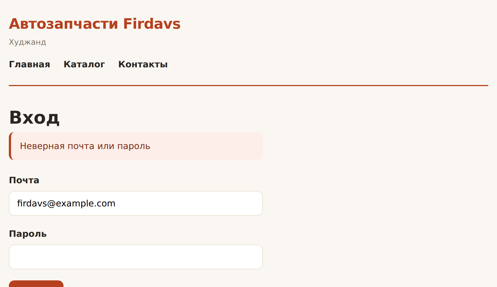

# Глава 39. Регистрация и вход

> **Часть VIII. Магазин** · Глава 39 из 60
> [← Глава 38](38-sessii-i-korzina.md) · [Глава 40 →](40-roli-i-dostup.md)

## 🎯 Зачем эта глава

Корзина есть, но покупатель для нас безымянный. Чтобы вести историю заказов,
показывать личный кабинет и пускать продавцов в их раздел, нужны аккаунты.

Регистрация и вход выглядят просто: две формы и одна таблица. На деле это
самое ответственное место в магазине — здесь хранятся чужие пароли и телефоны.

Мы уже разбирали `password_hash` в главе 36. Теперь соберём всё в работающую
систему и добавим то, о чём обычно забывают: восстановление пароля, выход,
защиту от перебора.

## 📖 Регистрация

```php
<?php
// includes/polzovateli.php
declare(strict_types=1);

/**
 * Создать пользователя. Возвращает id или бросает исключение с понятным текстом.
 */
function polzovatel_sozdat(string $email, string $parol, string $imya, string $telefon = ''): int
{
    $email = mb_strtolower(trim($email));

    if (polzovatel_po_email($email) !== null) {
        throw new RuntimeException('Пользователь с такой почтой уже зарегистрирован');
    }

    $hash = password_hash($parol, PASSWORD_DEFAULT);

    vypolnit('
        INSERT INTO polzovateli (email, parol_hash, imya, telefon, rol)
        VALUES (?, ?, ?, ?, "pokupatel")
    ', [$email, $hash, $imya, $telefon]);

    return posledniy_id();
}

function polzovatel_po_email(string $email): ?array
{
    return zapros_odin('SELECT * FROM polzovateli WHERE email = ?', [mb_strtolower(trim($email))]);
}

function polzovatel_po_id(int $id): ?array
{
    return zapros_odin('SELECT * FROM polzovateli WHERE id = ? AND aktivnyi = 1', [$id]);
}
```

### **Проверка данных**

```php
function proverit_registraciyu(array $d): array
{
    $oshibki = [];

    // Почта
    $email = filter_var(trim($d['email'] ?? ''), FILTER_VALIDATE_EMAIL);
    if ($email === false) {
        $oshibki['email'] = 'Проверьте адрес почты';
    }

    // Пароль
    $parol = $d['parol'] ?? '';
    if (mb_strlen($parol) < 8) {
        $oshibki['parol'] = 'Пароль от 8 символов';
    } elseif ($parol !== ($d['parol2'] ?? '')) {
        $oshibki['parol2'] = 'Пароли не совпадают';
    }

    // Имя
    if (mb_strlen(trim($d['imya'] ?? '')) < 2) {
        $oshibki['imya'] = 'Введите имя';
    }

    // Телефон — необязательный, но если ввели, проверим
    $telefon = trim($d['telefon'] ?? '');
    if ($telefon !== '' && !preg_match('/^\+?[0-9\s\-()]{9,20}$/', $telefon)) {
        $oshibki['telefon'] = 'Проверьте номер телефона';
    }

    // Согласие
    if (empty($d['soglasie'])) {
        $oshibki['soglasie'] = 'Нужно согласие на обработку данных';
    }

    return $oshibki;
}
```

### **О требованиях к паролю**

Раньше советовали требовать заглавные, цифры и спецсимволы. Сейчас подход
изменился, и вот почему.

Такие требования заставляют людей придумывать `Parol123!` — короткий пароль,
который легко подобрать, но трудно запомнить. В итоге его записывают на бумажке
или используют везде одинаковый.

**Современная рекомендация:**

- минимум **8 символов**, лучше 12;
- **никаких обязательных спецсимволов**;
- проверять по списку самых частых паролей;
- не запрещать длинные пароли и пробелы — парольная фраза надёжнее.

Длина важнее сложности. `лошадь синий батарея скрепка` надёжнее, чем `P@ssw0rd!`,
и запоминается лучше.

## 💻 Страница регистрации

```php
<?php
// registraciya.php
require_once __DIR__ . '/includes/bootstrap.php';
require_once __DIR__ . '/includes/polzovateli.php';

// Уже вошёл — незачем регистрироваться
if (!empty($_SESSION['polzovatel_id'])) {
    header('Location: kabinet.php');
    exit;
}

$oshibki = [];
$dannye = ['email' => '', 'imya' => '', 'telefon' => ''];

if ($_SERVER['REQUEST_METHOD'] === 'POST') {
    csrf_proverit();

    $dannye['email']   = trim($_POST['email'] ?? '');
    $dannye['imya']    = trim($_POST['imya'] ?? '');
    $dannye['telefon'] = trim($_POST['telefon'] ?? '');

    $oshibki = proverit_registraciyu($_POST);

    if (empty($oshibki)) {
        try {
            $id = polzovatel_sozdat(
                $dannye['email'],
                $_POST['parol'],
                $dannye['imya'],
                $dannye['telefon']
            );

            // Сразу впускаем — не заставляем логиниться после регистрации
            vojti($id);

            $_SESSION['flash'] = ['soobshenie' => 'Добро пожаловать!'];
            header('Location: kabinet.php');
            exit;

        } catch (RuntimeException $e) {
            $oshibki['email'] = $e->getMessage();
        }
    }
}

$zagolovok = 'Регистрация — ' . SAIT_NAZVANIE;
require __DIR__ . '/includes/header.php';
?>

<h1>Регистрация</h1>

<form method="POST" class="forma">
    <?= csrf_pole() ?>

    <div class="pole">
        <label for="email">Электронная почта</label>
        <input type="email" id="email" name="email" required
               value="<?= e($dannye['email']) ?>"
               class="<?= isset($oshibki['email']) ? 'plohoe' : '' ?>">
        <?php if (isset($oshibki['email'])): ?>
            <span class="podskazka"><?= e($oshibki['email']) ?></span>
        <?php endif; ?>
    </div>

    <div class="pole">
        <label for="imya">Ваше имя</label>
        <input type="text" id="imya" name="imya" required
               value="<?= e($dannye['imya']) ?>"
               class="<?= isset($oshibki['imya']) ? 'plohoe' : '' ?>">
        <?php if (isset($oshibki['imya'])): ?>
            <span class="podskazka"><?= e($oshibki['imya']) ?></span>
        <?php endif; ?>
    </div>

    <div class="pole">
        <label for="telefon">Телефон <span class="tihoe">необязательно</span></label>
        <input type="tel" id="telefon" name="telefon"
               value="<?= e($dannye['telefon']) ?>"
               placeholder="+992 92 777 77 77">
    </div>

    <div class="pole">
        <label for="parol">Пароль</label>
        <input type="password" id="parol" name="parol" required minlength="8"
               autocomplete="new-password"
               class="<?= isset($oshibki['parol']) ? 'plohoe' : '' ?>">
        <span class="tihoe">Минимум 8 символов. Длинная фраза надёжнее короткого набора знаков.</span>
        <?php if (isset($oshibki['parol'])): ?>
            <span class="podskazka"><?= e($oshibki['parol']) ?></span>
        <?php endif; ?>
    </div>

    <div class="pole">
        <label for="parol2">Повторите пароль</label>
        <input type="password" id="parol2" name="parol2" required
               autocomplete="new-password"
               class="<?= isset($oshibki['parol2']) ? 'plohoe' : '' ?>">
        <?php if (isset($oshibki['parol2'])): ?>
            <span class="podskazka"><?= e($oshibki['parol2']) ?></span>
        <?php endif; ?>
    </div>

    <div class="pole">
        <label class="galka">
            <input type="checkbox" name="soglasie" value="1" required>
            Согласен на обработку персональных данных
        </label>
        <?php if (isset($oshibki['soglasie'])): ?>
            <span class="podskazka"><?= e($oshibki['soglasie']) ?></span>
        <?php endif; ?>
    </div>

    <button type="submit">Зарегистрироваться</button>
</form>

<p>Уже есть аккаунт? <a href="vhod.php">Войти</a></p>

<?php require __DIR__ . '/includes/footer.php'; ?>
```

⚠️ **`autocomplete="new-password"`** подсказывает браузеру, что это форма
регистрации, — он предложит сгенерировать надёжный пароль и не подставит
сохранённый от другого сайта. Мелочь, а полезная.

## 📖 Вход

```php
<?php
// includes/auth.php
declare(strict_types=1);

/** Записать пользователя в сессию. */
function vojti(int $polzovatel_id): void
{
    // Меняем идентификатор сессии — защита от фиксации (глава 36)
    session_regenerate_id(true);

    $_SESSION['polzovatel_id'] = $polzovatel_id;
    $_SESSION['vhod_vremya'] = time();

    // Гостевую корзину переносим на пользователя
    if (function_exists('korzina_perenesti_v_bazu')) {
        korzina_perenesti_v_bazu($polzovatel_id);
    }
}

function vyjti(): void
{
    $_SESSION = [];

    // Удаляем и саму куку сессии, иначе браузер продолжит её присылать
    if (ini_get('session.use_cookies')) {
        $p = session_get_cookie_params();
        setcookie(session_name(), '', time() - 42000,
                  $p['path'], $p['domain'], $p['secure'], $p['httponly']);
    }

    session_destroy();
}

/** Текущий пользователь или null. Результат запоминается на время запроса. */
function tekushiy_polzovatel(): ?array
{
    static $polzovatel = false;

    if ($polzovatel !== false) {
        return $polzovatel;
    }

    $id = $_SESSION['polzovatel_id'] ?? null;
    $polzovatel = $id ? polzovatel_po_id((int) $id) : null;

    // Пользователя удалили или заблокировали, пока он был в сессии
    if ($id && $polzovatel === null) {
        vyjti();
    }

    return $polzovatel;
}

function voshel(): bool
{
    return tekushiy_polzovatel() !== null;
}
```

### **Ограничение попыток**

```php
/** Сколько неудачных попыток за последние 15 минут. */
function neudachnyh_popytok(string $email, string $ip): int
{
    return (int) zapros_znachenie('
        SELECT COUNT(*) FROM popytki_vhoda
        WHERE (email = ? OR ip = ?)
          AND udachno = 0
          AND vremya > DATE_SUB(NOW(), INTERVAL 15 MINUTE)
    ', [mb_strtolower($email), $ip]);
}

function zapisat_popytku(string $email, string $ip, bool $udachno): void
{
    vypolnit('
        INSERT INTO popytki_vhoda (email, ip, udachno) VALUES (?, ?, ?)
    ', [mb_strtolower($email), $ip, $udachno ? 1 : 0]);
}
```

⚠️ Считаем попытки **и по почте, и по IP-адресу**. Только по почте — можно
перебирать пароли к разным аккаунтам с одного адреса. Только по IP — можно
блокировать чужой аккаунт, намеренно вводя неверные пароли.

## 💻 Страница входа

```php
<?php
// vhod.php
require_once __DIR__ . '/includes/bootstrap.php';
require_once __DIR__ . '/includes/polzovateli.php';
require_once __DIR__ . '/includes/auth.php';

if (voshel()) {
    header('Location: kabinet.php');
    exit;
}

$oshibka = null;
$email = '';

if ($_SERVER['REQUEST_METHOD'] === 'POST') {
    csrf_proverit();

    $email = trim($_POST['email'] ?? '');
    $parol = $_POST['parol'] ?? '';
    $ip = $_SERVER['REMOTE_ADDR'] ?? '';

    if (neudachnyh_popytok($email, $ip) >= 5) {
        $oshibka = 'Слишком много попыток. Попробуйте через 15 минут.';
    } else {
        $polzovatel = polzovatel_po_email($email);

        // Одно сообщение на оба случая — чтобы нельзя было
        // перебором узнать, какие адреса зарегистрированы
        if ($polzovatel === null || !password_verify($parol, $polzovatel['parol_hash'])) {
            zapisat_popytku($email, $ip, false);
            $oshibka = 'Неверная почта или пароль';

        } elseif ((int) $polzovatel['aktivnyi'] !== 1) {
            $oshibka = 'Аккаунт заблокирован. Свяжитесь с нами.';

        } else {
            zapisat_popytku($email, $ip, true);

            // Хеш мог устареть: PHP со временем усиливает алгоритм
            if (password_needs_rehash($polzovatel['parol_hash'], PASSWORD_DEFAULT)) {
                vypolnit('UPDATE polzovateli SET parol_hash = ? WHERE id = ?',
                         [password_hash($parol, PASSWORD_DEFAULT), $polzovatel['id']]);
            }

            vojti((int) $polzovatel['id']);

            // Возвращаем туда, откуда пришли
            $kuda = $_SESSION['posle_vhoda'] ?? 'kabinet.php';
            unset($_SESSION['posle_vhoda']);
            header('Location: ' . $kuda);
            exit;
        }
    }
}

$zagolovok = 'Вход — ' . SAIT_NAZVANIE;
require __DIR__ . '/includes/header.php';
?>

<h1>Вход</h1>

<?php if ($oshibka !== null): ?>
    <div class="oshibka-obshaya"><?= e($oshibka) ?></div>
<?php endif; ?>

<form method="POST" class="forma">
    <?= csrf_pole() ?>

    <div class="pole">
        <label for="email">Почта</label>
        <input type="email" id="email" name="email" required
               value="<?= e($email) ?>" autocomplete="username">
    </div>

    <div class="pole">
        <label for="parol">Пароль</label>
        <input type="password" id="parol" name="parol" required
               autocomplete="current-password">
    </div>

    <button type="submit">Войти</button>
</form>

<p>
    <a href="vosstanovlenie.php">Забыли пароль?</a> ·
    <a href="registraciya.php">Регистрация</a>
</p>

<?php require __DIR__ . '/includes/footer.php'; ?>
```

### **`password_needs_rehash` — приём, о котором мало кто знает**

PHP со временем усиливает алгоритм хеширования. Пароли, захешированные пять лет
назад, слабее сегодняшних.

`password_needs_rehash` проверяет, устарел ли хеш. Если да — мы **пересчитываем
его прямо при входе**, пока пароль есть в открытом виде. Пользователь ничего
не замечает, а защита обновляется сама.

Три строчки кода, которые окупаются через годы.

## 📖 Восстановление пароля

Место, где легко наделать дыр. Правильная схема:

```php
/** Шаг 1: человек ввёл почту, отправляем ссылку. */
function zaprosit_vosstanovlenie(string $email): void
{
    $polzovatel = polzovatel_po_email($email);

    // Отвечаем одинаково, даже если такой почты нет.
    // Иначе форма превращается в способ проверить, кто у нас зарегистрирован.
    if ($polzovatel === null) {
        return;
    }

    $token = bin2hex(random_bytes(32));

    vypolnit('
        INSERT INTO sbros_parolya (polzovatel_id, token_hash, istekaet)
        VALUES (?, ?, DATE_ADD(NOW(), INTERVAL 1 HOUR))
    ', [$polzovatel['id'], hash('sha256', $token)]);

    $ssylka = SAIT_ADRES . '/novyi-parol.php?token=' . $token;
    otpravit_pismo($polzovatel['email'], 'Восстановление пароля',
        "Чтобы задать новый пароль, перейдите по ссылке:\n$ssylka\n\n" .
        "Ссылка действует один час. Если вы не запрашивали восстановление, просто удалите это письмо.");
}

/** Шаг 2: человек перешёл по ссылке и ввёл новый пароль. */
function primenit_novyi_parol(string $token, string $novyi_parol): bool
{
    $zapis = zapros_odin('
        SELECT * FROM sbros_parolya
        WHERE token_hash = ? AND ispolzovan = 0 AND istekaet > NOW()
    ', [hash('sha256', $token)]);

    if ($zapis === null) {
        return false;
    }

    vypolnit('UPDATE polzovateli SET parol_hash = ? WHERE id = ?',
             [password_hash($novyi_parol, PASSWORD_DEFAULT), $zapis['polzovatel_id']]);

    // Токен одноразовый
    vypolnit('UPDATE sbros_parolya SET ispolzovan = 1 WHERE id = ?', [$zapis['id']]);

    return true;
}
```

⚠️ **Четыре правила восстановления, каждое закрывает свою дыру:**

1. **Токен случайный и длинный** — `random_bytes(32)`, не `rand()` и не время.
2. **В базе хранится хеш токена**, а не сам токен. Утечка базы не даст войти
   в чужие аккаунты.
3. **Короткий срок жизни** — час. Не сутки.
4. **Одноразовый** — после использования помечается и больше не работает.

И пятое, не техническое: **отвечайте одинаково**, есть такая почта или нет.
Иначе форма восстановления становится способом узнать, кто у вас зарегистрирован.

## 📖 Шапка для вошедшего

```php
<?php $ya = tekushiy_polzovatel(); ?>

<nav class="polzovatel">
    <?php if ($ya): ?>
        <a href="kabinet.php"><?= e($ya['imya']) ?></a>
        <?php if ($ya['rol'] === 'admin' || $ya['rol'] === 'manager'): ?>
            <a href="/admin/">Админка</a>
        <?php endif; ?>
        <?php if ($ya['rol'] === 'prodavec'): ?>
            <a href="/seller/">Мои товары</a>
        <?php endif; ?>
        <form method="POST" action="vyhod.php" class="vstroennaya">
            <?= csrf_pole() ?>
            <button type="submit" class="knopka-tihaya">Выйти</button>
        </form>
    <?php else: ?>
        <a href="vhod.php">Войти</a>
        <a href="registraciya.php">Регистрация</a>
    <?php endif; ?>
</nav>
```

⚠️ **Выход должен быть формой POST**, а не ссылкой.

Причина неочевидная: если выход сделать ссылкой `<a href="vyhod.php">`, то любой
сайт сможет вставить `` — и браузер
жертвы «нажмёт» её сам. Человека будет постоянно выкидывать из аккаунта.

Это тот же CSRF из главы 36, только безобидный на первый взгляд.

## 🖥 На экране

Форма входа с ошибкой:



## 🔤 Разбор по словам

| Запись | Что делает |
|---|---|
| `password_hash($p, PASSWORD_DEFAULT)` | Захешировать пароль |
| `password_verify($p, $hash)` | Проверить пароль |
| `password_needs_rehash()` | Устарел ли алгоритм хеша |
| `session_regenerate_id(true)` | Сменить идентификатор сессии |
| `filter_var(..., FILTER_VALIDATE_EMAIL)` | Проверить почту |
| `bin2hex(random_bytes(32))` | Криптостойкий токен |
| `hash('sha256', $token)` | Хеш токена для хранения в базе |
| `autocomplete="new-password"` | Подсказка браузеру: это регистрация |
| `static $polzovatel` | Не запрашивать пользователя дважды за запрос |
| `$_SESSION['posle_vhoda']` | Куда вернуть после входа |

## ⚠️ Грабли

**Хранить пароль в открытом виде или в MD5.** Только `password_hash`.

**Разные сообщения «нет пользователя» и «неверный пароль».** Позволяет
перебрать базу адресов.

**Не менять идентификатор сессии после входа.** Фиксация сессии.

**Выход ссылкой.** Чужой сайт выкинет пользователя картинкой.

**Не ограничивать попытки.** Пароль подберут перебором.

**Хранить токен восстановления открытым.** Утечка базы — доступ ко всем аккаунтам.

**Токен восстановления на сутки.** Час достаточно.

**Требовать спецсимволы.** Люди придумают `Parol123!` и запишут на бумажке.

**Не удалять куку при выходе.** Браузер продолжит присылать старый идентификатор.

## 🏋️ Задачи

**Задача 39.1.** Сделайте регистрацию и вход. Проверьте: повторная почта,
короткий пароль, несовпадение паролей.

**Задача 39.2.** Посмотрите в базе, как выглядит хеш. Зарегистрируйте двух
человек с **одинаковым** паролем. Хеши разные? Объясните почему.

**Задача 39.3.** Реализуйте ограничение попыток и проверьте: шесть неверных
паролей подряд.

**Задача 39.4.** Сделайте выход формой POST. Проверьте, что ``
на другой странице больше не выкидывает вас.

**Задача 39.5.** Реализуйте восстановление пароля со всеми четырьмя правилами.
Письмо пока выводите на экран вместо отправки.

**Задача 39.6.** Найдите все проблемы:

```php
$p = zapros_odin("SELECT * FROM polzovateli WHERE email = '{$_POST['email']}'");
if (!$p) exit('Нет такого пользователя');
if ($p['parol'] !== md5($_POST['parol'])) exit('Неверный пароль');
$_SESSION['admin'] = true;
```

Их здесь минимум пять.

**Задача 39.7.** Добавьте «Запомнить меня»: долгоживущая кука с отдельным
токеном. Подумайте, чем это опаснее обычной сессии.

**Задача 39.8.** Сделайте так, чтобы после входа человек возвращался на ту
страницу, с которой его отправили авторизоваться.

**Задача 39.9.** Добавьте в личный кабинет смену пароля — с обязательным вводом
старого. Зачем нужен старый, если человек уже вошёл?

*Ответы — в [Приложении Г](../prilozheniya/4-G-otvety.md).*

## 🔗 В бою

Откройте `auth/` в этом репозитории. Увидите ту же схему: `password_hash`,
CSRF-токены, смена идентификатора сессии.

Обратите внимание на одну вещь, которой у нас пока нет: после регистрации
продавца его аккаунт получает статус `na_proverke`, а не сразу рабочий.
Магазин не пускает торговать кого попало — сначала модерация.

Это Фаза 1 маркетплейса, и мы дойдём до неё в главе 44.

## 📌 Итог

- Пароли — **только `password_hash` и `password_verify`**.
- Длина важнее сложности. Минимум 8, спецсимволы не требовать.
- **Одинаковое сообщение** при неверной почте и неверном пароле.
- `session_regenerate_id(true)` после входа.
- **Ограничивайте попытки** — и по почте, и по IP.
- `password_needs_rehash` обновляет старые хеши сами собой.
- Восстановление: **случайный токен, хеш в базе, час жизни, одноразовый**.
- Отвечайте одинаково, есть такая почта или нет.
- **Выход — форма POST**, не ссылка.
- При выходе удаляйте и куку сессии.

Дальше — роли и разграничение доступа.

[← Глава 38](38-sessii-i-korzina.md) · [Глава 40. Роли и доступ →](40-roli-i-dostup.md)
