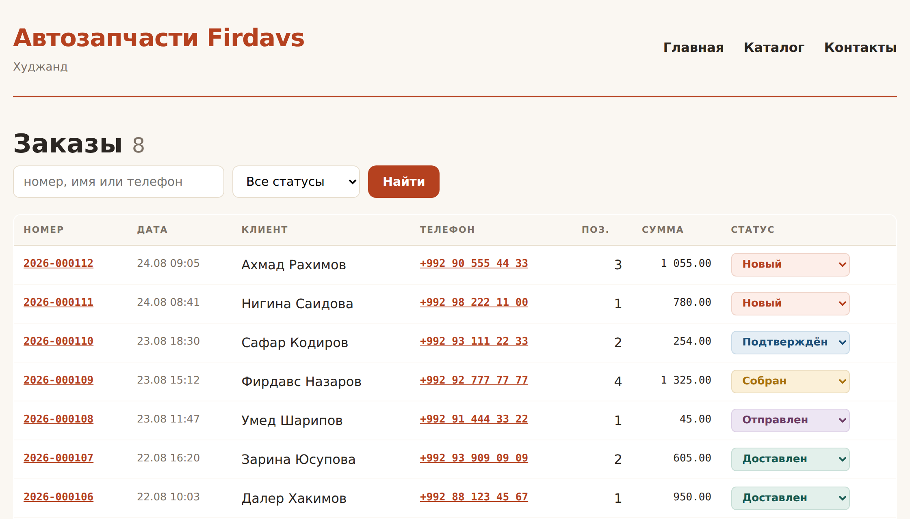

# Глава 42. Админка: товары и заказы

> **Часть VIII. Магазин** · Глава 42 из 60
> [← Глава 41](41-oformlenie-zakaza.md) · [Глава 43 →](43-uvedomleniya.md)

## 🎯 Зачем эта глава

Магазин работает, заказы приходят. Но чтобы добавить товар, нужно лезть в базу
через phpMyAdmin, а чтобы поменять статус заказа — писать SQL руками.

Так работать нельзя. Владельцу магазина нужен раздел, где он делает всё сам,
не зная слова «SQL».

Админка кажется скучной частью — «просто формы». На деле именно здесь
проявляется, понимаете ли вы, как люди работают. Плохая админка заставляет
делать двадцать кликов там, где хватило бы двух.

## 📖 Чем админка отличается от витрины

| | Витрина | Админка |
|---|---|---|
| Кто пользуется | Тысячи, случайные люди | Двое-трое, каждый день |
| Что важно | Красота, скорость | **Скорость работы, плотность информации** |
| Дизайн | Продающий | **Функциональный** |
| Мобильная версия | Обязательна | Желательна |

**Главный вывод: в админке важна не красота, а количество действий.**

Человек открывает её сто раз в день. Лишний клик, умноженный на сто, —
это потерянное время каждый день.

Три правила, которые стоит принять сразу:

1. **Показывайте больше на одном экране.** Таблица на 50 строк лучше,
   чем плитка на 12.
2. **Частые действия — в один клик.** Смена статуса заказа не должна требовать
   открытия карточки.
3. **Не прячьте важное за подтверждениями.** Спрашивайте «точно?» только
   у необратимого.

## 📖 Структура админки

```
admin/
├── index.php        сводка
├── tovary.php       список товаров
├── tovar.php        добавить и изменить
├── zakazy.php       список заказов
├── zakaz.php        карточка заказа
├── polzovateli.php  пользователи
└── nastroyki.php    настройки магазина
```

Защита — в одном месте:

```php
<?php
// admin/_zashita.php
require_once __DIR__ . '/../includes/bootstrap.php';
require_once __DIR__ . '/../includes/prava.php';

trebuetsya_rol('manager');
```

И первой строкой каждого файла админки:

```php
<?php require_once __DIR__ . '/_zashita.php'; ?>
```

⚠️ Помните главу 40: **проверка первой строкой**, до любых запросов и вывода.
И **в каждом файле** — забыть в одном означает открыть дверь.

## 💻 Сводка

С неё начинается день менеджера. Здесь должно быть видно, что требует внимания:

```php
<?php
// admin/index.php
require_once __DIR__ . '/_zashita.php';

// Одним запросом вместо шести — группировка делает работу за нас
$po_statusam = zapros('
    SELECT status, COUNT(*) AS shtuk, SUM(summa_itogo) AS summa
    FROM zakazy
    WHERE sozdan > DATE_SUB(NOW(), INTERVAL 30 DAY)
    GROUP BY status
');
$statistika = array_column($po_statusam, null, 'status');

$novyh = (int) ($statistika['novyi']['shtuk'] ?? 0);

$zakanchivaetsya = zapros('
    SELECT id, nazvanie, ostatok
    FROM tovary
    WHERE aktivnyi = 1 AND ostatok BETWEEN 1 AND 3
    ORDER BY ostatok
    LIMIT 10
');

$na_moderacii = (int) zapros_znachenie(
    'SELECT COUNT(*) FROM tovary WHERE status = "na_moderacii"'
);

$zagolovok = 'Админка';
require __DIR__ . '/_shapka.php';
?>

<h1>Сводка</h1>

<div class="plitki">
    <a class="plitka <?= $novyh > 0 ? 'trebuet-vnimaniya' : '' ?>" href="zakazy.php?status=novyi">
        <span class="chislo"><?= $novyh ?></span>
        <span class="podpis">новых заказов</span>
    </a>

    <a class="plitka <?= $na_moderacii > 0 ? 'trebuet-vnimaniya' : '' ?>"
       href="tovary.php?status=na_moderacii">
        <span class="chislo"><?= $na_moderacii ?></span>
        <span class="podpis">товаров на модерации</span>
    </a>

    <a class="plitka <?= count($zakanchivaetsya) > 0 ? 'trebuet-vnimaniya' : '' ?>"
       href="tovary.php?zakanchivaetsya=1">
        <span class="chislo"><?= count($zakanchivaetsya) ?></span>
        <span class="podpis">заканчивается</span>
    </a>

    <div class="plitka">
        <span class="chislo"><?= somoni((int) ($statistika['dostavlen']['summa'] ?? 0)) ?></span>
        <span class="podpis">выручка за 30 дней</span>
    </div>
</div>

<?php if ($zakanchivaetsya): ?>
    <h2>Скоро закончится</h2>
    <table class="spisok plotnaya">
        <?php foreach ($zakanchivaetsya as $t): ?>
            <tr>
                <td><a href="tovar.php?id=<?= (int) $t['id'] ?>"><?= e($t['nazvanie']) ?></a></td>
                <td class="chislo-yacheyka"><?= (int) $t['ostatok'] ?> шт.</td>
            </tr>
        <?php endforeach; ?>
    </table>
<?php endif; ?>

<?php require __DIR__ . '/_podval.php'; ?>
```

**Смысл сводки — не в цифрах, а в том, чтобы показать, где нужно действие.**
Класс `trebuet-vnimaniya` подсвечивает плитку, только если там есть работа.
Ноль новых заказов — плитка спокойная.

## 💻 Список заказов

```php
<?php
// admin/zakazy.php
require_once __DIR__ . '/_zashita.php';

$status = $_GET['status'] ?? '';
$zapros_poiska = trim($_GET['q'] ?? '');
$stranica = max(1, (int) ($_GET['page'] ?? 1));
const NA_STRANICE = 30;

$usloviya = ['1=1'];
$parametry = [];

$dopustimye_statusy = ['novyi','podtverzhden','sobran','otpravlen','dostavlen','otmenen'];
if (in_array($status, $dopustimye_statusy, true)) {
    $usloviya[] = 'z.status = ?';
    $parametry[] = $status;
}

if ($zapros_poiska !== '') {
    $usloviya[] = '(z.nomer LIKE ? OR z.klient_imya LIKE ? OR z.klient_telefon LIKE ?)';
    $shablon = '%' . $zapros_poiska . '%';
    array_push($parametry, $shablon, $shablon, $shablon);
}

$where = implode(' AND ', $usloviya);
$offset = ($stranica - 1) * NA_STRANICE;

$zakazy = zapros("
    SELECT z.*, COUNT(zt.id) AS pozicij
    FROM zakazy AS z
    LEFT JOIN zakaz_tovary AS zt ON zt.zakaz_id = z.id
    WHERE $where
    GROUP BY z.id
    ORDER BY z.sozdan DESC
    LIMIT " . NA_STRANICE . " OFFSET $offset
", $parametry);

$vsego = (int) zapros_znachenie("SELECT COUNT(*) FROM zakazy AS z WHERE $where", $parametry);

$zagolovok = 'Заказы';
require __DIR__ . '/_shapka.php';
?>

<h1>Заказы <span class="tihoe"><?= $vsego ?></span></h1>

<form class="filtry-admin" method="GET">
    <input type="search" name="q" value="<?= e($zapros_poiska) ?>"
           placeholder="номер, имя или телефон">
    <select name="status" onchange="this.form.submit()">
        <option value="">Все статусы</option>
        <?php foreach ($dopustimye_statusy as $s): ?>
            <option value="<?= $s ?>" <?= $status === $s ? 'selected' : '' ?>>
                <?= e(status_zakaza_podpis($s)) ?>
            </option>
        <?php endforeach; ?>
    </select>
    <button type="submit">Найти</button>
</form>

<table class="spisok plotnaya">
    <thead>
        <tr>
            <th>Номер</th><th>Дата</th><th>Клиент</th><th>Телефон</th>
            <th>Позиций</th><th>Сумма</th><th>Статус</th>
        </tr>
    </thead>
    <tbody>
    <?php foreach ($zakazy as $z): ?>
        <tr>
            <td class="mono">
                <a href="zakaz.php?id=<?= (int) $z['id'] ?>"><?= e($z['nomer']) ?></a>
            </td>
            <td class="tihoe"><?= date('d.m H:i', strtotime($z['sozdan'])) ?></td>
            <td><?= e($z['klient_imya']) ?></td>
            <td class="mono">
                <a href="tel:<?= e(preg_replace('/\D/', '', $z['klient_telefon'])) ?>">
                    <?= e($z['klient_telefon']) ?>
                </a>
            </td>
            <td class="chislo-yacheyka"><?= (int) $z['pozicij'] ?></td>
            <td class="chislo-yacheyka mono"><?= somoni((int) $z['summa_itogo']) ?></td>
            <td>
                <!-- Смена статуса прямо из списка: одно действие вместо трёх -->
                <form method="POST" action="zakaz_status.php" class="vstroennaya">
                    <?= csrf_pole() ?>
                    <input type="hidden" name="zakaz_id" value="<?= (int) $z['id'] ?>">
                    <select name="status" class="status-vybor s-<?= e($z['status']) ?>"
                            onchange="this.form.submit()">
                        <?php foreach ($dopustimye_statusy as $s): ?>
                            <option value="<?= $s ?>" <?= $z['status'] === $s ? 'selected' : '' ?>>
                                <?= e(status_zakaza_podpis($s)) ?>
                            </option>
                        <?php endforeach; ?>
                    </select>
                </form>
            </td>
        </tr>
    <?php endforeach; ?>
    </tbody>
</table>

<?= stranicy($stranica, max(1, (int) ceil($vsego / NA_STRANICE))) ?>

<?php require __DIR__ . '/_podval.php'; ?>
```

### **Три решения, экономящие время каждый день**

**Смена статуса прямо в списке.** Без открытия карточки. Менеджер обзванивает
клиентов и переводит заказы в «подтверждён» подряд — это десятки действий
в день.

**Телефон — ссылка `tel:`.** С рабочего компьютера через программу связи,
с телефона — прямой звонок. Не нужно копировать номер.

**Поиск сразу по трём полям.** Клиент звонит и говорит «я Ахмад, заказывал
вчера» — менеджер вводит «Ахмад» и находит. Не нужно спрашивать номер заказа.

## 💻 Смена статуса

```php
<?php
// admin/zakaz_status.php
require_once __DIR__ . '/_zashita.php';

if ($_SERVER['REQUEST_METHOD'] !== 'POST') {
    http_response_code(405);
    exit('Метод не разрешён');
}

csrf_proverit();

$zakaz_id = (int) ($_POST['zakaz_id'] ?? 0);
$novyi = $_POST['status'] ?? '';

$dopustimye = ['novyi','podtverzhden','sobran','otpravlen','dostavlen','otmenen'];
if (!in_array($novyi, $dopustimye, true)) {
    exit('Неизвестный статус');
}

$zakaz = zapros_odin('SELECT * FROM zakazy WHERE id = ?', [$zakaz_id]);
if ($zakaz === null) {
    http_response_code(404);
    exit('Заказ не найден');
}

$staryi = $zakaz['status'];

if ($staryi !== $novyi) {
    db()->beginTransaction();
    try {
        vypolnit('UPDATE zakazy SET status = ?, izmenen = NOW() WHERE id = ?',
                 [$novyi, $zakaz_id]);

        // Отмена — возвращаем товары на склад
        if ($novyi === 'otmenen' && $staryi !== 'otmenen') {
            $pozicii = zapros('SELECT tovar_id, kolichestvo FROM zakaz_tovary WHERE zakaz_id = ?',
                              [$zakaz_id]);
            foreach ($pozicii as $p) {
                if ($p['tovar_id']) {
                    vypolnit('UPDATE tovary SET ostatok = ostatok + ? WHERE id = ?',
                             [$p['kolichestvo'], $p['tovar_id']]);
                }
            }
        }

        // Сняли отмену — списываем обратно
        if ($staryi === 'otmenen' && $novyi !== 'otmenen') {
            $pozicii = zapros('SELECT tovar_id, kolichestvo, nazvanie FROM zakaz_tovary WHERE zakaz_id = ?',
                              [$zakaz_id]);
            foreach ($pozicii as $p) {
                if (!$p['tovar_id']) continue;
                $izmeneno = vypolnit('
                    UPDATE tovary SET ostatok = ostatok - ?
                    WHERE id = ? AND ostatok >= ?
                ', [$p['kolichestvo'], $p['tovar_id'], $p['kolichestvo']]);

                if ($izmeneno === 0) {
                    throw new RuntimeException(
                        'Не хватает товара «' . $p['nazvanie'] . '», чтобы вернуть заказ в работу'
                    );
                }
            }
        }

        zapisat_deystvie('smenil_status', 'zakaz', $zakaz_id);
        db()->commit();

        $_SESSION['flash'] = ['soobshenie' =>
            'Заказ ' . $zakaz['nomer'] . ': ' . status_zakaza_podpis($novyi)];

    } catch (Throwable $e) {
        db()->rollBack();
        $_SESSION['flash'] = ['oshibka' => $e->getMessage()];
    }
}

// Возвращаем туда, откуда пришли
$nazad = $_SERVER['HTTP_REFERER'] ?? 'zakazy.php';
header('Location: ' . $nazad);
exit;
```

⚠️ **Отмена возвращает товары на склад.** Об этом забывают, и остатки
постепенно уезжают от реальности. Через полгода в базе «минус три колодки»,
и никто не понимает, откуда.

⚠️ **Возврат из отмены проверяет наличие.** Пока заказ был отменён, товар
могли распродать. Тогда вернуть его в работу нельзя — и мы честно об этом
говорим, а не создаём отрицательный остаток.

## 💻 Форма товара

```php
<?php
// admin/tovar.php
require_once __DIR__ . '/_zashita.php';

$id = (int) ($_GET['id'] ?? 0);
$tovar = $id > 0 ? zapros_odin('SELECT * FROM tovary WHERE id = ?', [$id]) : null;
$novyi = $tovar === null;

$oshibki = [];
$d = $tovar ?? [
    'nazvanie' => '', 'artikul' => '', 'brend' => '', 'kategoriya_id' => 0,
    'cena' => 0, 'ostatok' => 0, 'opisanie' => '', 'status' => 'chernovik',
    'aktivnyi' => 1,
];

if ($_SERVER['REQUEST_METHOD'] === 'POST') {
    csrf_proverit();

    $d['nazvanie']      = trim($_POST['nazvanie'] ?? '');
    $d['artikul']       = trim($_POST['artikul'] ?? '');
    $d['brend']         = trim($_POST['brend'] ?? '');
    $d['kategoriya_id'] = (int) ($_POST['kategoriya_id'] ?? 0);
    // Цену вводят в сомони, храним в дирамах
    $d['cena']          = (int) round((float) ($_POST['cena'] ?? 0) * 100);
    $d['ostatok']       = max(0, (int) ($_POST['ostatok'] ?? 0));
    $d['opisanie']      = trim($_POST['opisanie'] ?? '');
    $d['status']        = $_POST['status'] ?? 'chernovik';
    $d['aktivnyi']      = isset($_POST['aktivnyi']) ? 1 : 0;

    if (mb_strlen($d['nazvanie']) < 3) $oshibki['nazvanie'] = 'Название от 3 символов';
    if ($d['artikul'] === '')          $oshibki['artikul']  = 'Артикул обязателен';
    if ($d['cena'] <= 0)               $oshibki['cena']     = 'Цена должна быть больше нуля';

    // Артикул уникален — проверяем до вставки, чтобы дать понятную ошибку
    $zanyat = zapros_znachenie(
        'SELECT id FROM tovary WHERE artikul = ? AND id <> ?',
        [$d['artikul'], $id]
    );
    if ($zanyat) $oshibki['artikul'] = 'Такой артикул уже есть у другого товара';

    if (empty($oshibki)) {
        if ($novyi) {
            vypolnit('
                INSERT INTO tovary
                    (nazvanie, artikul, brend, kategoriya_id, cena, ostatok,
                     opisanie, status, aktivnyi)
                VALUES (?, ?, ?, ?, ?, ?, ?, ?, ?)
            ', [
                $d['nazvanie'], $d['artikul'], $d['brend'],
                $d['kategoriya_id'] ?: null, $d['cena'], $d['ostatok'],
                $d['opisanie'], $d['status'], $d['aktivnyi'],
            ]);
            $id = posledniy_id();
            zapisat_deystvie('sozdal_tovar', 'tovar', $id);
        } else {
            vypolnit('
                UPDATE tovary SET
                    nazvanie = ?, artikul = ?, brend = ?, kategoriya_id = ?,
                    cena = ?, ostatok = ?, opisanie = ?, status = ?, aktivnyi = ?
                WHERE id = ?
            ', [
                $d['nazvanie'], $d['artikul'], $d['brend'],
                $d['kategoriya_id'] ?: null, $d['cena'], $d['ostatok'],
                $d['opisanie'], $d['status'], $d['aktivnyi'], $id,
            ]);
            zapisat_deystvie('izmenil_tovar', 'tovar', $id);
        }

        $_SESSION['flash'] = ['soobshenie' => 'Товар сохранён'];
        header('Location: tovar.php?id=' . $id);
        exit;
    }
}

$zagolovok = $novyi ? 'Новый товар' : 'Товар: ' . $d['nazvanie'];
require __DIR__ . '/_shapka.php';
?>

<h1><?= $novyi ? 'Новый товар' : 'Изменить товар' ?></h1>

<form method="POST" class="forma-admin">
    <?= csrf_pole() ?>

    <div class="ryad-poley">
        <div class="pole shirokoe">
            <label for="nazvanie">Название</label>
            <input type="text" id="nazvanie" name="nazvanie" required
                   value="<?= e($d['nazvanie']) ?>"
                   class="<?= isset($oshibki['nazvanie']) ? 'plohoe' : '' ?>">
            <?php if (isset($oshibki['nazvanie'])): ?>
                <span class="podskazka"><?= e($oshibki['nazvanie']) ?></span>
            <?php endif; ?>
        </div>

        <div class="pole">
            <label for="artikul">Артикул</label>
            <input type="text" id="artikul" name="artikul" required
                   value="<?= e($d['artikul']) ?>"
                   class="<?= isset($oshibki['artikul']) ? 'plohoe' : '' ?>">
            <?php if (isset($oshibki['artikul'])): ?>
                <span class="podskazka"><?= e($oshibki['artikul']) ?></span>
            <?php endif; ?>
        </div>

        <div class="pole">
            <label for="brend">Бренд</label>
            <input type="text" id="brend" name="brend" value="<?= e($d['brend']) ?>">
        </div>
    </div>

    <div class="ryad-poley">
        <div class="pole">
            <label for="cena">Цена, сомони</label>
            <input type="number" id="cena" name="cena" step="0.01" min="0" required
                   value="<?= number_format((int) $d['cena'] / 100, 2, '.', '') ?>"
                   class="<?= isset($oshibki['cena']) ? 'plohoe' : '' ?>">
            <?php if (isset($oshibki['cena'])): ?>
                <span class="podskazka"><?= e($oshibki['cena']) ?></span>
            <?php endif; ?>
        </div>

        <div class="pole">
            <label for="ostatok">Остаток, шт.</label>
            <input type="number" id="ostatok" name="ostatok" min="0"
                   value="<?= (int) $d['ostatok'] ?>">
        </div>

        <div class="pole">
            <label for="status">Статус</label>
            <select id="status" name="status">
                <option value="chernovik"   <?= $d['status'] === 'chernovik'   ? 'selected' : '' ?>>Черновик</option>
                <option value="opublikovan" <?= $d['status'] === 'opublikovan' ? 'selected' : '' ?>>Опубликован</option>
            </select>
        </div>

        <div class="pole">
            <label class="galka">
                <input type="checkbox" name="aktivnyi" value="1"
                       <?= (int) $d['aktivnyi'] === 1 ? 'checked' : '' ?>>
                Активен
            </label>
        </div>
    </div>

    <div class="pole">
        <label for="opisanie">Описание</label>
        <textarea id="opisanie" name="opisanie" rows="5"><?= e($d['opisanie']) ?></textarea>
    </div>

    <div class="knopki">
        <button type="submit">Сохранить</button>
        <a class="knopka-tihaya" href="tovary.php">К списку</a>
    </div>
</form>

<?php require __DIR__ . '/_podval.php'; ?>
```

### **Про цену в форме**

Обратите внимание: **менеджер вводит сомони, база хранит дирамы**.

```php
$d['cena'] = (int) round((float) $_POST['cena'] * 100);   // при сохранении
value="<?= number_format($d['cena'] / 100, 2, '.', '') ?>" // при показе
```

Требовать от человека вводить «25000» вместо «250.00» — верный способ получить
ошибки на порядок. Внутреннее представление данных не должно протекать
в интерфейс.

**Правило: система подстраивается под человека, а не наоборот.**

## 📖 Массовые действия

Когда товаров сотни, менять по одному невозможно:

```php
// В списке — галочки и общая форма
<form method="POST" action="tovary_massovo.php">
    <?= csrf_pole() ?>

    <div class="massovye-deystviya">
        <select name="deystvie">
            <option value="">Действие с отмеченными</option>
            <option value="opublikovat">Опубликовать</option>
            <option value="skryt">Снять с публикации</option>
            <option value="cena_plus_10">Поднять цену на 10%</option>
        </select>
        <button type="submit">Применить</button>
    </div>

    <table class="spisok plotnaya">
        <?php foreach ($tovary as $t): ?>
            <tr>
                <td><input type="checkbox" name="ids[]" value="<?= (int) $t['id'] ?>"></td>
                <td><?= e($t['nazvanie']) ?></td>
                ...
            </tr>
        <?php endforeach; ?>
    </table>
</form>
```

```php
// tovary_massovo.php
$ids = array_map('intval', $_POST['ids'] ?? []);
$ids = array_values(array_filter($ids));

if (empty($ids)) {
    $_SESSION['flash'] = ['oshibka' => 'Ничего не отмечено'];
    header('Location: tovary.php');
    exit;
}

$metki = implode(',', array_fill(0, count($ids), '?'));

$izmeneno = match ($_POST['deystvie'] ?? '') {
    'opublikovat'  => vypolnit("UPDATE tovary SET status = 'opublikovan' WHERE id IN ($metki)", $ids),
    'skryt'        => vypolnit("UPDATE tovary SET status = 'chernovik' WHERE id IN ($metki)", $ids),
    'cena_plus_10' => vypolnit("UPDATE tovary SET cena = ROUND(cena * 1.1) WHERE id IN ($metki)", $ids),
    default        => 0,
};

zapisat_deystvie('massovoe_deystvie', 'tovar', count($ids));
$_SESSION['flash'] = ['soobshenie' => "Изменено товаров: $izmeneno"];
header('Location: tovary.php');
exit;
```

⚠️ Массовые действия **опасны по природе**. Три обязательных условия:

1. **Только явно отмеченные**, никаких «применить ко всем найденным» без
   отдельного подтверждения;
2. **Запись в журнал** — кто и что сделал;
3. **Понятный отчёт** — «изменено товаров: 47», а не молчание.

## 🖥 На экране

Список заказов со сменой статуса прямо из таблицы:



## 🔤 Разбор по словам

| Запись | Что делает |
|---|---|
| `trebuetsya_rol('manager')` | Защита, первой строкой каждого файла |
| `onchange="this.form.submit()"` | Отправить форму сразу при выборе |
| `$_SERVER['HTTP_REFERER']` | Откуда пришёл — вернуть обратно |
| `array_column($x, null, 'status')` | Список в справочник по ключу |
| `implode(',', array_fill(...))` | Метки для `IN` переменной длины |
| `number_format($x / 100, 2, '.', '')` | Дирамы в сомони для поля ввода |
| `zapisat_deystvie()` | Журнал изменений |

## ⚠️ Грабли

**Забыть защиту в одном файле админки.** Одна открытая дверь обесценивает
все остальные замки.

**Не возвращать товары при отмене заказа.** Остатки уедут от реальности.

**Заставлять вводить дирамы.** Человек ошибётся на порядок.

**Массовые действия без журнала.** Потом не найти, кто испортил цены.

**Открывать карточку ради одного действия.** Частое действие — в один клик.

**Пагинация по 10 в админке.** Менеджеру нужно 50 строк на экране.

**Подтверждение на каждый чих.** Люди перестают читать и жмут «да» вслепую.

## 🏋️ Задачи

**Задача 42.1.** Сделайте админку: защита, сводка, список заказов, карточка
заказа.

**Задача 42.2.** Реализуйте смену статуса прямо из списка.

**Задача 42.3.** Сделайте возврат товаров на склад при отмене. Проверьте,
что остаток вернулся.

**Задача 42.4.** Сделайте форму товара с вводом цены в сомони.

**Задача 42.5.** Добавьте поиск заказов по номеру, имени и телефону.

**Задача 42.6.** Реализуйте массовые действия с журналом.

**Задача 42.7.** Проверьте защиту: зайдите покупателем на каждый файл админки
по прямому адресу. Все закрыты?

**Задача 42.8.** Добавьте на карточку заказа кнопку «Позвонить» и «Скопировать
адрес».

**Задача 42.9.** Дайте админку человеку, который её не видел, и попросите
подтвердить заказ. Сколько времени и кликов ушло? Что оказалось непонятным?

*Ответы — в [Приложении Г](../prilozheniya/G-otvety.md).*

## 🔗 В бою

Откройте `admin/` в этом репозитории. Увидите те же принципы: защита в начале
каждого файла, плотные таблицы, действия из списка.

Обратите внимание на `admin/orders.php` — там заказ показан **в разрезе
продавцов**: одна покупка может касаться трёх магазинов, и админ видит,
кто что должен собрать.

И на `admin/product_moderation.php` — очередь товаров на проверку. Продавец
выложил, менеджер одобрил или отклонил с причиной. Это Фаза 1 маркетплейса,
и мы дойдём до неё в главе 45.

## 📌 Итог

- Админка — не про красоту, а про **количество действий**.
- Защита **первой строкой каждого файла**, через общий `_zashita.php`.
- Сводка показывает **где нужно действие**, а не просто цифры.
- Частые действия — **из списка, без открытия карточки**.
- Телефон — ссылка `tel:`, поиск — сразу по нескольким полям.
- **Отмена заказа возвращает товары**, возврат из отмены проверяет наличие.
- Цену вводят в сомони, хранят в дирамах. **Система подстраивается под человека.**
- Массовые действия: только отмеченные, с журналом и отчётом.
- В админке 30-50 строк на страницу, не 10.

Дальше — уведомления: как сообщить о заказе покупателю и себе.

[← Глава 41](41-oformlenie-zakaza.md) · [Глава 43. Уведомления и письма →](43-uvedomleniya.md)
