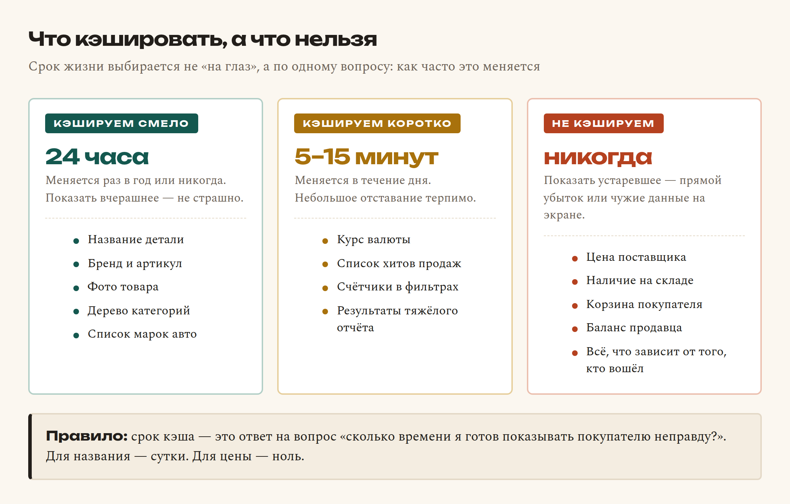
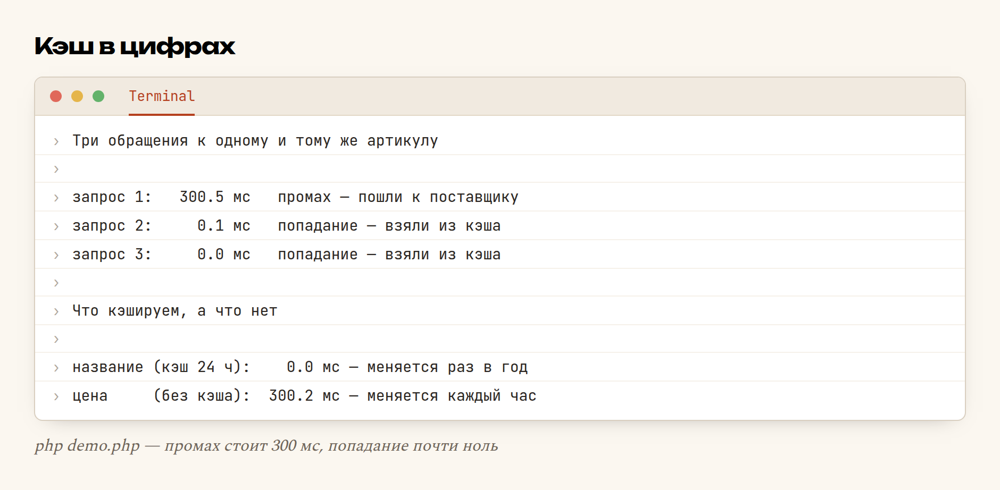

# Глава 52. Кэш: что хранить, а что нельзя

> **Часть X. Внешний мир** · Глава 52 из 60
> [← Глава 51](51-kursy-i-nacenki.md) · [Глава 53 →](53-git.md)

## 🎯 Зачем эта глава

Покупатель открыл карточку товара. Ваш сервер сходил к поставщику, подождал
триста миллисекунд, получил ответ и нарисовал страницу.

Через минуту тот же покупатель нажал «назад», потом снова открыл ту же карточку.
Сервер снова сходил к поставщику. Снова подождал триста миллисекунд. Получил
**тот же самый ответ**.

За день таких повторов набегают тысячи. Из них следует три неприятности:

- **страница тормозит** — покупатель ждёт чужой сервер, а не ваш;
- **лимит поставщика тает** — в главе 50 мы видели, чем это заканчивается;
- **вы зависите от чужого настроения** — поставщик прилёг, и ваш магазин лежит.

Лечение называется **кэш** (от английского *cache* — тайник, запас).
Идея на одну строчку: **спросил один раз — запомнил — дальше отвечай сам**.

Но у кэша есть обратная сторона, и она дороже. Кэш — это разрешение
показывать покупателю **устаревшие данные**. Если запомнить название детали
на сутки — ничего не случится. Если так же запомнить **цену** — вы будете
продавать по вчерашней цене себе в убыток и узнаете об этом в конце месяца.

Поэтому вся глава сводится к одному вопросу: **что можно запоминать, а что нельзя.**

## 📖 Разбираемся: кэш — это блокнот

Представьте продавца за прилавком. Покупатель спрашивает: «Сколько стоит
фильтр MANN W71480?» Продавец идёт на склад, ищет, возвращается — три минуты.

Следующий покупатель спрашивает **то же самое**. Идти на склад снова?
Нормальный продавец записал ответ в блокнот и отвечает сразу.

Блокнот — это и есть кэш. И у него ровно те же свойства, что у кэша в коде:

| В блокноте | В коде | Как называется |
|---|---|---|
| Записал ответ | Сохранили значение | **Запись в кэш** |
| Нашёл запись — ответил сразу | Значение нашлось | **Попадание** (*hit*) |
| Записи нет — пошёл на склад | Значения нет | **Промах** (*miss*) |
| «Эта запись от прошлого месяца, не верю» | Срок истёк | **TTL**, срок жизни |
| Вопрос, по которому ищем в блокноте | Строка-идентификатор | **Ключ** |

Три слова, которые дальше встречаются постоянно: **ключ**, **попадание**,
**срок жизни**. Больше в кэше ничего нет.

### Ключ: по чему ищем

Ключ — это строка, которая **однозначно** описывает запрос. Не «фильтр»,
а «название детали бренда MANN с артикулом W71480».

```
nazvanie:MANN:W71480
katalog:kategoriya=12:stranica=3:sort=cena
kurs:RUB
```

Правило простое: **всё, от чего зависит ответ, должно быть в ключе.**
Забыли положить в ключ номер страницы — и все страницы каталога получат
содержимое первой. Это классическая ошибка, к ней вернёмся в «Граблях».

### Срок жизни: сколько можно врать

Срок жизни (TTL, *time to live*) — сколько секунд ответ считается свежим.

Выбирают его не «на глаз», а по одному честному вопросу:

> **Сколько времени я готов показывать покупателю неправду?**

Для названия детали ответ — сутки: оно не менялось десять лет и не изменится.
Для цены поставщика ответ — **ноль секунд**.



### Где живёт кэш

Кэшей на самом деле несколько, и они складываются:

| Где | Что там держат | Кто управляет |
|---|---|---|
| **Браузер покупателя** | Картинки, CSS, JS | Заголовки `Cache-Control` |
| **Ваш сервер: файлы** | Ответы чужих API, тяжёлые отчёты | Ваш код (эта глава) |
| **Ваш сервер: таблица в БД** | То же, но с поиском и статистикой | Ваш код |
| **Внутри MySQL** | Буферы страниц, планы запросов | Сама СУБД |

Начинать нужно с самого простого — **файлового кэша**. Он не требует ничего,
кроме папки, и покрывает 90% случаев маленького магазина. Redis, Memcached
и прочие «взрослые» хранилища — это тот же блокнот, только быстрее и по сети;
переходить на них имеет смысл, когда серверов станет больше одного.

## 💻 Код: кэш на пятьдесят строк

Файл `kesh.php` — весь механизм целиком. Никаких библиотек: важно увидеть,
что кэш — это «запиши в файл и запомни, до какого времени верить».

```php
<?php
declare(strict_types=1);

const KESH_PAPKA = __DIR__ . '/kesh';

/** Положить значение в кэш на $sekund секунд. */
function kesh_put(string $klyuch, mixed $znachenie, int $sekund): void
{
    if (!is_dir(KESH_PAPKA)) {
        mkdir(KESH_PAPKA, 0777, true);
    }
    $dannye = ['do' => time() + $sekund, 'znachenie' => $znachenie];
    file_put_contents(
        kesh_put_k($klyuch),
        json_encode($dannye, JSON_UNESCAPED_UNICODE)
    );
}

/** Достать значение. Вернёт null, если его нет или срок истёк. */
function kesh_get(string $klyuch): mixed
{
    $fayl = kesh_put_k($klyuch);
    if (!is_file($fayl)) {
        return null;                     // промах: такого ключа нет
    }
    $dannye = json_decode((string) file_get_contents($fayl), true);
    if (!is_array($dannye) || $dannye['do'] < time()) {
        @unlink($fayl);                  // протухло — выкидываем
        return null;
    }
    return $dannye['znachenie'];
}

/** Имя файла считаем от ключа: hash спасает от кириллицы, слэшей и длины. */
function kesh_put_k(string $klyuch): string
{
    return KESH_PAPKA . '/' . hash('sha256', $klyuch) . '.json';
}
```

Три функции — уже рабочий кэш. Но пользоваться ими напрямую неудобно:
каждый раз пришлось бы писать «посмотри в кэш; если нет — посчитай; положи
обратно». Поэтому добавляем **главную функцию кэша**:

```php
/** Достать из кэша, а если нет — посчитать и положить. */
function kesh_pomni(string $klyuch, int $sekund, callable $kak_schitat): mixed
{
    $iz_kesha = kesh_get($klyuch);
    if ($iz_kesha !== null) {
        return $iz_kesha;
    }
    $znachenie = $kak_schitat();
    kesh_put($klyuch, $znachenie, $sekund);
    return $znachenie;
}
```

Теперь любое медленное место закрывается одной обёрткой:

```php
$tovar = kesh_pomni(
    'nazvanie:MANN:W71480',          // ключ
    86400,                           // сутки
    fn() => sprosit_postavshchika('W71480')   // что делать при промахе
);
```

Читается по-человечески: «запомни под таким ключом на сутки; если не помнишь —
вот как узнать».

### Сброс кэша: то, о чём забывают

Кэш умеет протухать сам, по сроку. Но иногда данные меняются **раньше срока** —
например, админ отредактировал название товара. Тогда запись нужно снести руками:

```php
function kesh_zabyt(string $klyuch): void
{
    @unlink(kesh_put_k($klyuch));
}

// В админке, сразу после сохранения товара:
$stmt = $pdo->prepare('UPDATE tovary SET nazvanie = ? WHERE id = ?');
$stmt->execute([$nazvanie, $id]);

kesh_zabyt("tovar:$id");             // ← без этой строки админ будет
kesh_zabyt('katalog:glavnaya');      //   видеть старое название сутки
```

**Правило:** где есть `UPDATE`, там же должен быть `kesh_zabyt`. Ищите их
парами — если в проекте есть кэш без единого сброса, это не кэш, а мина.

## 🔤 Разбор по словам

| Запись | Что это | Зачем здесь |
|---|---|---|
| `mixed` | Тип «что угодно» | Кэш хранит и строки, и массивы — заранее не знаем |
| `callable` | Тип «сюда можно передать функцию» | Мы принимаем не значение, а *способ его получить* |
| `fn() => ...` | Короткая запись функции (стрелочная) | То же, что `function () { return ...; }`, но в одну строку |
| `time()` | Текущее время в секундах с 1970 года | Целое число — с ним удобно сравнивать сроки |
| `time() + 86400` | «Через сутки» | 86400 = 60 × 60 × 24 |
| `??` | «Или, если слева null» | Короткая замена `isset(...) ? ... : ...` |
| `@unlink(...)` | Удалить файл, молча | `@` глушит ошибку, если файл уже удалён другим процессом |
| `hash('sha256', $s)` | Превратить строку в 64 шестнадцатеричных символа | Безопасное имя файла из любого ключа |
| `json_encode(..., JSON_UNESCAPED_UNICODE)` | Массив → строка JSON | Без флага кириллица превратилась бы в `Ф...` |
| `is_dir` / `is_file` | Проверки «существует ли папка / файл» | Чтобы не падать на первом запуске |
| `mkdir($p, 0777, true)` | Создать папку | `true` — создавать и родительские папки |
| `__DIR__` | Папка текущего файла | Кэш кладём рядом с кодом, а не «где запустили» |

Отдельно про `callable`. Почему мы передаём функцию, а не готовое значение?
Потому что значение пришлось бы вычислить **до** проверки кэша — то есть
сходить к поставщику в любом случае. Смысл был бы потерян. Передавая функцию,
мы говорим: «вот инструкция; выполни её, **только если** в кэше пусто».

## 🖥 На экране

Запускаем `demo.php` — три обращения к одному артикулу подряд:



Первый запрос честно ждёт поставщика: **300.5 мс**. Второй и третий берут
готовый ответ из файла: **0.1 мс** и **0.0 мс** — в три тысячи раз быстрее.

Нижняя половина — та самая граница. Название лежит в кэше сутки и достаётся
мгновенно. Цена **не кэшируется вообще** и каждый раз стоит полных 300 мс.
Эти 300 мс — плата за то, что покупатель видит настоящую цену. Она того стоит.

## ⚠️ Грабли

**Закэшировали цену.** Самая дорогая ошибка в главе. Поставщик поднял цену
утром, вы отдаёте вчерашнюю до вечера, продаёте в минус. Цена и наличие —
**никогда**. Если очень хочется — максимум 60 секунд, и то на свой страх.

**Ключ без параметров.** Классика:

```php
// ПЛОХО: ключ один, а страниц двадцать
$tovary = kesh_pomni('katalog', 600, fn() => zagruzit_katalog($stranica, $sort));

// ХОРОШО: всё, от чего зависит ответ, — в ключе
$klyuch = "katalog:str=$stranica:sort=$sort:kat=$kategoriya";
```

С первым вариантом покупатель на десятой странице увидит первую и решит,
что сайт сломан. Формально так и есть.

**Кэш персональных данных.** Если в ключе нет `id` пользователя, а в значении
лежит корзина или «мои заказы», — один покупатель увидит чужое. Это уже не баг,
а утечка. Всё, что зависит от того, кто вошёл, либо не кэшируется, либо
кэшируется **с `id` в ключе**.

**Кэш без срока.** `kesh_put($k, $v, 999999999)` — это не кэш, а вечная копия
чужой ошибки. Срок должен быть всегда.

**Закэшировали ошибку.** Поставщик вернул пустой ответ, вы бодро сохранили
его на сутки. Теперь товара «нет» до завтра. Проверяйте результат **до** записи:

```php
$otvet = sprosit_postavshchika($artikul);
if ($otvet === null || $otvet === []) {
    return null;                     // пустоту не сохраняем
}
kesh_put($klyuch, $otvet, 86400);
```

**Лавина при протухании.** Тысяча посетителей в момент истечения срока —
и все тысяча одновременно уходят к поставщику. Лечится «размазыванием»
срока случайной добавкой:

```php
kesh_put($klyuch, $otvet, 3600 + random_int(0, 600));   // 60–70 минут
```

**Забыли сбросить при редактировании.** Админ поменял цену, обновил страницу,
цена старая. Админ уверен, что сайт сломан. Сайт работает — просто нет
`kesh_zabyt`. Смотрите правило «где `UPDATE`, там и сброс».

**Кэш в публичной папке.** Если `kesh/` лежит внутри корня сайта, любой
может открыть `site.tj/kesh/abc123.json` и почитать. Держите папку **вне**
публичного корня — или закройте её `.htaccess` с `Deny from all`. И не
кладите её в git: там мусор, который меняется каждую минуту.

## 🏋️ Задачи

**Задача 52.1.** Соберите `kesh.php` и `demo.php` и запустите. Какие числа
получились у вас? Насколько попадание быстрее промаха?

**Задача 52.2.** Загляните в папку `kesh/` и откройте любой файл. Найдите
в нём поле `do`. Переведите это число в дату (`date('H:i:s', $do)`).

**Задача 52.3.** Поставьте срок 5 секунд. Запустите демо, подождите
шесть секунд, запустите снова. Что произошло и почему?

**Задача 52.4.** Добавьте счётчик попаданий и промахов. Выведите долю
попаданий в процентах после ста случайных запросов к десяти артикулам.

**Задача 52.5.** Закэшируйте каталог из главы 34 — с номером страницы,
сортировкой и категорией в ключе. Проверьте, что вторая страница показывает
вторую страницу.

**Задача 52.6.** Найдите в своём проекте все `UPDATE` по товарам и добавьте
рядом `kesh_zabyt`. Сколько мест нашлось?

**Задача 52.7.** Сделайте функцию `kesh_ochistit_vse()` — удаление всех
файлов кэша. Пригодится кнопкой в админке.

**Задача 52.8.** Реализуйте «размазывание» срока. Запишите сто ключей
и посмотрите, в какой промежуток попали их сроки.

**Задача 52.9.** Перепишите кэш на таблицу в базе вместо файлов
(`kesh_klyuch`, `znachenie`, `godno_do`). Что стало удобнее, что хуже?

**Задача 52.10.** Разберите свой магазин на три списка: кэшируем сутки,
кэшируем минуты, не кэшируем никогда. Обоснуйте каждый пункт третьего
списка одной фразой.

*Ответы — в [Приложении Г](../prilozheniya/G-otvety.md).*

## 🔗 В бою

В autodoc.tj граница проведена ровно так, как в этой главе, и проведена
она не из теории, а из синяков.

**Названия деталей кэшируются.** Таблица `ae_part_dictionary` — это и есть
кэш: артикул, бренд, название. AutoEuro умеет искать только по артикулу,
и без словаря поиск по слову «фильтр» был бы невозможен. Название детали
не меняется годами — держать его у себя безопасно.

**Цены не кэшируются.** В `AutoEuroPriceProvider` цена запрашивается живьём
на каждый показ. Это медленнее, и с этим сознательно смирились: показать
вчерашнюю цену дороже, чем подождать.

**Библиотека каталога — кэш чужого API.** Таблицы `catalog_library_*` хранят
всё, что однажды пришло от Parts-Catalogs: марки, деревья узлов, схемы.
Повторный заход в тот же узел **не тратит тариф** — данные берутся у себя.
Именно этот кэш держит витрину на плаву сейчас, когда пакетный сбор
остановлен до выяснения условий тарифа.

Обратите внимание на разницу: словарь названий и библиотека каталога — это
кэш **навсегда**, без срока. Так можно, потому что данные там неизменные.
Как только в кэш попадает что-то, что меняется, — срок обязателен.

## 📌 Итог

- Кэш — это **блокнот**: спросил один раз, запомнил, дальше отвечаешь сам.
- Три понятия: **ключ**, **попадание/промах**, **срок жизни**.
- Срок выбирается вопросом: *сколько я готов показывать неправду?*
- Названия, фото, категории — **сутки и больше**. Цена и наличие — **никогда**.
- **Всё, от чего зависит ответ, кладите в ключ** — включая страницу и фильтры.
- Персональные данные — только с `id` пользователя в ключе.
- **Где `UPDATE`, там и `kesh_zabyt`** — иначе админ будет видеть старое.
- **Пустой ответ и ошибку не кэшируем.**
- Срок с небольшой случайной добавкой спасает от лавины запросов.
- Папка кэша — **вне публичного корня** и вне git.

На этом внешний мир закончен. Дальше — ремесло: как не терять работу,
как читать ошибки и как выложить всё это в интернет.

[← Глава 51](51-kursy-i-nacenki.md) · [Глава 53. Git →](53-git.md)
