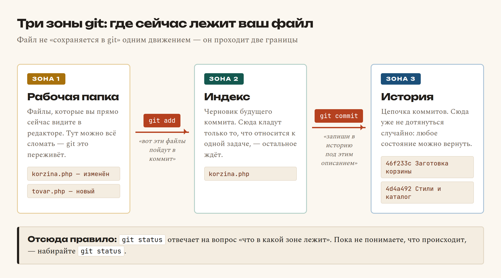
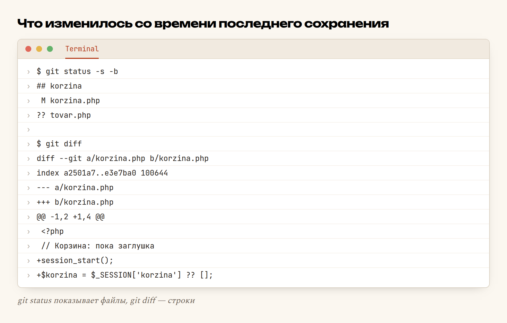
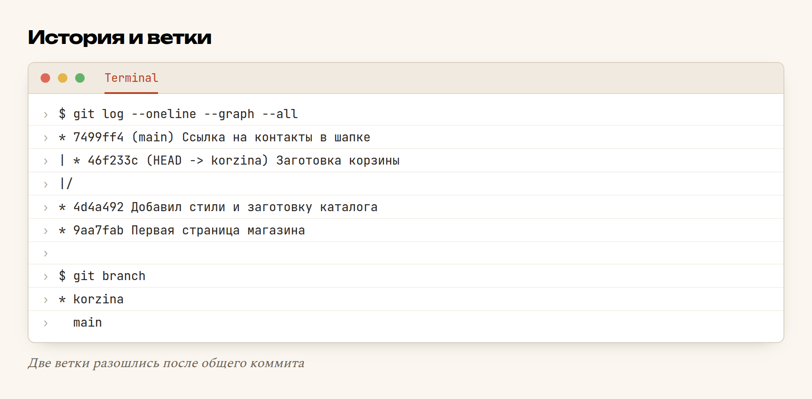

# Глава 53. Git: коммиты и ветки

> **Часть XI. Ремесло** · Глава 53 из 60
> [← Глава 52](52-kesh.md) · [Глава 54 →](54-github.md)

## 🎯 Зачем эта глава

Знакомая история. Вы полдня правили каталог, всё работало. Решили «немного
улучшить» — и сайт лёг с белым экраном. Вы пытаетесь вспомнить, что именно
меняли, и не можете. Вчерашней копии нет. Полдня работы превратились
в вечер отладки.

Или мягче: папка проекта выглядит так.

```
katalog.php
katalog_staryy.php
katalog_staryy2.php
katalog_RABOCHIY.php
katalog_final.php
katalog_final_TOCHNO.php
```

Это не смешно — это **отсутствие git**. Все шесть файлов — попытка
своими руками сделать то, что git делает автоматически и правильно.

**Git** — это машина времени для папки с кодом. Она умеет три вещи, и все
три вам понадобятся уже завтра:

- **запоминать состояние проекта** целиком, с описанием — что и зачем;
- **возвращать** любое сохранённое состояние, даже месячной давности;
- **вести несколько версий параллельно** — чтобы недоделанная корзина
  не мешала работающему каталогу.

Правило, которое стоит принять сразу: **код, которого нет в git, не существует.**
Он живёт до первой ошибки, до первого «ой, не тот файл удалил», до первой
сдохшей флешки.

## 📖 Разбираемся: три зоны

Главная путаница у новичка — почему «сохранить в git» это **две** команды,
а не одна. Потому что файл проходит две границы.



Зачем такая сложность? Ради одной вещи: **коммит должен быть про одну задачу.**

Вы правили корзину, а заодно поправили опечатку в футере и добавили
заготовку страницы товара. Если сохранить всё одним коммитом с описанием
«правки», то через месяц, когда корзина сломается, вы не сможете откатить
только корзину — откатится и футер, и заготовка.

Индекс позволяет сказать: «в этот коммит — только корзину, остальное потом».

### Коммит

**Коммит** (*commit*) — это снимок всего проекта плюс подпись: кто, когда
и зачем. У каждого коммита есть уникальный номер вроде `46f233c` — по нему
можно вернуться в это состояние в любой момент.

Коммиты выстраиваются в цепочку: каждый знает своего предшественника.
Эта цепочка и есть история проекта.

### Ветка

**Ветка** (*branch*) — это отдельная линия коммитов. Она нужна, когда
работающему нельзя мешать.

Представьте: магазин уже работает и продаёт. Вы начинаете делать корзину —
работы на три дня. Всё это время каталог должен продавать. Если вы правите
файлы «на живом», покупатель в середине вашего рабочего дня увидит
недоделанное.

Ветка решает это так:

```
main       ──●──●──●──────────────●        ← то, что видят покупатели
                  \              /
korzina            ●──●──●──●───┘          ← три дня работы над корзиной
```

Вы работаете в `korzina`, ломаете там что угодно, а `main` продолжает
продавать. Когда корзина готова и проверена — ветки **сливают** (*merge*),
и покупатели получают готовую корзину одним движением.

В этом проекте, autodoc.tj, правило записано жёстко: **в `main` не пушить
напрямую** — только ветка → pull request → слияние. Причина ровно та,
что описана выше: `main` — это то, что прямо сейчас продаёт.

## 💻 Код: команды, которые нужны каждый день

Их меньше, чем кажется. Вот весь ежедневный набор.

### Начало: один раз на проект

```bash
git init                       # завести git в текущей папке
git config user.name  "Firdavs"
git config user.email "firdavs@example.com"
```

Имя и почта попадут в каждый коммит — так видно, кто что сделал.

### Каждый день: сохранить работу

```bash
git status                     # что изменилось и в какой зоне
git diff                       # какие именно строки изменились
git add korzina.php            # положить файл в индекс
git add .                      # положить всё изменённое
git commit -m "Корзина: добавление товара и подсчёт суммы"
```

`git status` и `git diff` — это не «дополнительные» команды. Это то, что
набирают **перед каждым** `git add`, чтобы точно знать, что уходит в коммит.

### Посмотреть историю

```bash
git log --oneline              # список коммитов, по одной строке
git log --oneline --graph --all   # то же, но с картинкой веток
git show 46f233c               # что именно было в этом коммите
```

### Ветки

```bash
git branch                     # какие ветки есть и где я сейчас
git switch -c korzina          # создать ветку и перейти в неё
git switch main                # вернуться в main
git merge korzina              # влить корзину в текущую ветку
git branch -d korzina          # удалить ветку, когда влита
```

### Откатиться, когда всё сломалось

Три разные ситуации — три разные команды. Их путают чаще всего.

```bash
# 1. Испортил файл, ещё не коммитил — верни как было
git restore korzina.php

# 2. Добавил в индекс лишнее — убери из индекса (файл не тронется)
git restore --staged korzina.php

# 3. Коммит уже сделан и он плохой — сделай обратный коммит
git revert 46f233c
```

Обратите внимание на третью. Она **не стирает** историю, а добавляет
коммит-противоядие. Именно так и надо: история — это журнал, а не черновик.

> **Про `git reset --hard`.** Эта команда выбрасывает изменения без спроса
> и без возврата. Пока вы не уверены, что делаете, — не набирайте её.
> Почти всё, что вам нужно, делают `restore` и `revert`.

### Что не должно попасть в git

Создайте файл `.gitignore` в корне проекта:

```
config/db_credentials.php
kesh/
*.log
.DS_Store
node_modules/
```

**Секреты в git не кладут никогда.** Пароль базы, ключ API, токен —
попав в историю, они остаются там навсегда, даже если удалить файл
следующим коммитом. В этом проекте пароли живут в `site_settings`
или в git-ignored `config/db_credentials.php` — ровно по этой причине.

### Как писать описание коммита

Плохо: `правки`, `фикс`, `.`, `работает`, `ещё раз`.

Хорошо — так, чтобы через полгода было понятно **что** и **зачем**:

```
Корзина: пересчёт суммы при изменении количества
Каталог: индекс по kategoriya_id — страница грузилась 2 с
Исправлен вывод цены: округление вверх, а не по правилам математики
```

Простой тест: описание должно продолжать фразу «этот коммит...».
«Этот коммит правки» — не продолжает. «Этот коммит исправляет вывод цены» —
продолжает.

## 🔤 Разбор по словам

| Слово | Что означает | По-простому |
|---|---|---|
| **repository**, репозиторий | Папка проекта под наблюдением git | Ваш проект + вся его история |
| **commit**, коммит | Сохранённое состояние + описание | Точка, куда можно вернуться |
| **hash**, хэш | `46f233c` — номер коммита | Адрес точки во времени |
| **staged**, в индексе | Файл готов к коммиту | «Этот пойдёт в следующий снимок» |
| **branch**, ветка | Отдельная линия работы | Черновик, не мешающий рабочему |
| **HEAD** | Указатель «где я сейчас» | Ветка/коммит, в котором вы находитесь |
| **merge**, слияние | Объединить две ветки | «Готово — забирай в основную» |
| **conflict**, конфликт | Обе ветки правили одну строку | Git не знает, чью версию брать, — решаете вы |
| **remote**, удалённый | Копия на сервере (GitHub) | Общая точка, откуда берут все |
| **push / pull** | Отправить / забрать | Синхронизация с сервером |
| `-m "..."` | *message*, описание | Текст коммита прямо в команде |
| `.` в `git add .` | Текущая папка со всем внутри | «Всё изменённое» |

Отдельно про **конфликт**, потому что он пугает больше всего. Конфликт — это
не поломка. Это git говорит: «в файле `korzina.php`, в строке 14, у тебя
и у коллеги разное; я не угадываю — выбери сам». В файле появляется:

```
<<<<<<< HEAD
$itogo = $summa + $dostavka;
=======
$itogo = $summa * 1.05;
>>>>>>> korzina
```

Вы удаляете маркеры, оставляете правильный вариант, делаете `git add`
и `git commit`. Всё.

## 🖥 На экране

Смотрим, что показывает git после правок:



Читается так: `M korzina.php` — файл **изменён** (*modified*), git его знает.
`?? tovar.php` — файл **новый**, git его ещё не видел. Ниже `git diff`
показывает построчно: `+` — добавленные строки. Именно эти две строки
уйдут в коммит.

Теперь история после того, как ветки разошлись:



Видно всё сразу: два первых коммита общие; дальше `main` ушёл в «Ссылку
на контакты», а `korzina` — в «Заготовку корзины». Звёздочка в `git branch`
показывает, где вы сейчас.

## ⚠️ Грабли

**Коммит раз в неделю.** Тогда описание неизбежно превратится в «правки»,
а откатиться будет некуда. Правило: **коммит на каждую законченную мысль.**
Заработала кнопка — коммит. Поправили запрос — коммит.

**`git add .` не глядя.** Так в репозиторий попадают файлы с паролями,
временные дампы базы на 200 МБ и `.DS_Store`. Перед `add` — всегда `status`.

**Секрет в истории.** Закоммитили `db_credentials.php` с паролем, заметили,
удалили следующим коммитом — **пароль всё ещё в истории**. Лечение одно:
считать пароль скомпрометированным и **сменить его**. Профилактика —
`.gitignore` с первого дня.

**Работа прямо в `main`.** Пока проект ваш и один — сойдёт. Как только
магазин начал продавать, правка в `main` = правка на живом. Ветка стоит
десяти секунд.

**Страх конфликта.** Многие, увидев конфликт, удаляют папку и клонируют
заново, теряя работу. Конфликт — это вопрос, а не поломка. Ответьте на него.

**`git reset --hard` в панике.** Самый частый способ потерять день работы.
В панике — не эта команда, а `git status` и глубокий вдох.

**Ветка живёт месяц.** Чем дольше ветка отдельно от `main`, тем больнее
слияние. Держите ветки короткими: задача — ветка — слили — удалили.

## 🏋️ Задачи

**Задача 53.1.** Заведите git в папке своего магазина. Сделайте `.gitignore`
и первый коммит. Что попало в него — проверьте через `git show --stat`.

**Задача 53.2.** Измените два файла. Положите в индекс **только один**,
сделайте коммит. Убедитесь через `git status`, что второй остался ждать.

**Задача 53.3.** Сделайте три коммита с осмысленными описаниями. Выведите
`git log --oneline`. Понятно ли по описаниям, что происходило?

**Задача 53.4.** Испортите файл, не коммитя. Верните его через `git restore`.

**Задача 53.5.** Создайте ветку `korzina`, сделайте в ней два коммита,
вернитесь в `main`. Убедитесь, что файлов корзины в `main` нет.

**Задача 53.6.** Слейте `korzina` в `main`. Посмотрите `git log --graph --all`
до и после.

**Задача 53.7.** Устройте конфликт нарочно: в двух ветках измените одну
и ту же строку по-разному, слейте. Разберите конфликт руками.

**Задача 53.8.** Сделайте заведомо плохой коммит и откатите его через
`git revert`. Проверьте, что история не стёрлась, а дополнилась.

**Задача 53.9.** Найдите в истории коммит недельной давности и посмотрите
`git show`. Сколько строк изменилось?

**Задача 53.10.** Напишите свой список правил для описаний коммитов —
пять пунктов. Проверьте по нему последние десять своих описаний.

*Ответы — в [Приложении Г](../prilozheniya/G-otvety.md).*

## 🔗 В бою

История этого репозитория — рабочий пример. Каждая функция магазина
приходила отдельной веткой: продавцы, модерация товаров, разбивка заказов,
балансы и выплаты. Ветка → проверка → слияние в `main`.

Почему так, а не «правлю сразу». Магазин работает. Если сломать `main`,
покупатель увидит поломку **сейчас**, а не когда вы закончите. Ветка —
это способ доделывать спокойно.

Второе правило проекта, тоже из практики: **не ломать рабочее**. Прежде
чем сливать ветку, витрину открывают и проверяют руками — каталог, карточка,
корзина, оформление. Тридцать секунд, которые окупаются каждый раз.

И третье: `config/db_credentials.php` в `.gitignore` с первого дня.
Не «потом добавим» — с первого дня.

## 📌 Итог

- **Кода, которого нет в git, не существует.**
- Файл проходит три зоны: **рабочая папка → индекс → история**.
- `git status` и `git diff` — **перед** каждым `git add`, всегда.
- Коммит — **на одну законченную мысль**, с описанием «что и зачем».
- Ветка — чтобы **недоделанное не мешало работающему**.
- В `main` — только проверенное, через слияние, а не напрямую.
- Испортил файл → `git restore`; плохой коммит → `git revert`.
- **Секреты — никогда в git.** `.gitignore` заводят до первого коммита.
- Конфликт — это **вопрос от git**, а не поломка.
- Ветки держим короткими: задача — ветка — слили — удалили.

Дальше — как этой историей делиться: GitHub, pull request и ревью.

[← Глава 52](52-kesh.md) · [Глава 54. GitHub →](54-github.md)
