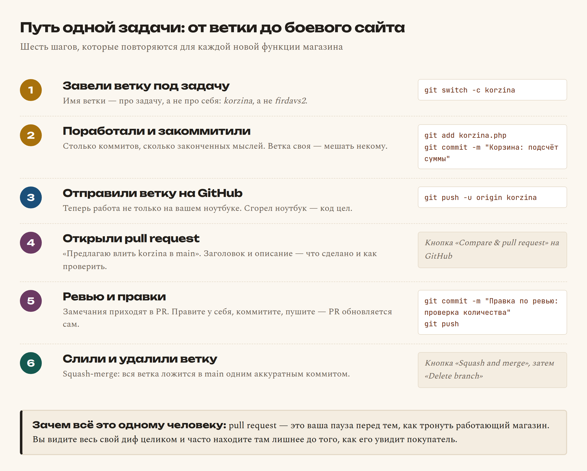
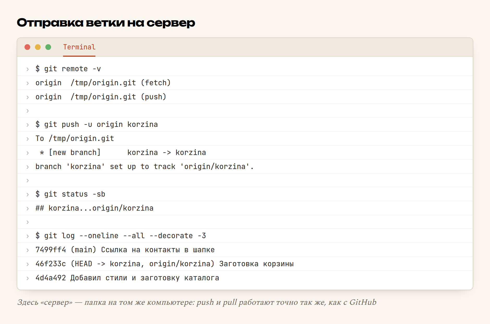

# Глава 54. GitHub: pull request и ревью

> **Часть XI. Ремесло** · Глава 54 из 60
> [← Глава 53](53-git.md) · [Глава 55 →](55-otladka.md)

## 🎯 Зачем эта глава

Git из прошлой главы живёт **на вашем компьютере**. Пока это ноутбук
и один разработчик, всё в порядке — ровно до одного из трёх событий:

- ноутбук украли, залили чаем или он просто перестал включаться;
- к проекту подключился второй человек, и надо как-то делиться кодом;
- заказчик спрашивает: «а покажи, что ты за неделю сделал».

**GitHub** — это git, живущий на чужом надёжном сервере, плюс сайт вокруг
него: обсуждения, ревью кода, задачи, автоматические проверки.

Есть и другие такие сервисы — GitLab, Bitbucket, Gitea. Работают они почти
одинаково; учить придётся один раз.

Ещё одно, о чём не говорят вслух: **GitHub — это ваше портфолио.** Когда
вы придёте за первым заказом, ссылка на репозиторий с внятной историей
коммитов скажет о вас больше любого резюме.

## 📖 Разбираемся: удалённый репозиторий

Прибавляется ровно одно понятие — **remote**, удалённый репозиторий.
Это копия вашего проекта на сервере. У неё принято имя `origin`.

Между вашей копией и `origin` ходят две команды:

| Команда | Направление | По-простому |
|---|---|---|
| `git push` | вы → сервер | «забирай мои коммиты» |
| `git pull` | сервер → вы | «дай мне то, чего у меня нет» |

Важно понять: `push` отправляет **коммиты**, а не файлы. Не закоммитили —
нечего и отправлять. Частая растерянность новичка «я запушил, а на GitHub
пусто» почти всегда означает «забыл `git commit`».

### Pull request: главная идея

**Pull request** (PR, «запрос на слияние») — это предложение:

> «Я сделал вот это в ветке `korzina`. Предлагаю влить её в `main`.
> Посмотрите, пожалуйста.»

PR — не техническая команда, а **место для разговора**. В нём видно:

- все изменённые строки, зелёным и красным;
- все коммиты ветки;
- комментарии — можно оставить прямо к конкретной строке;
- результат автоматических проверок, если они настроены.

Именно поэтому в правилах этого проекта записано: **в `main` не пушить
напрямую, только ветка → PR → squash-merge**. PR — это дверь с порогом
перед работающим магазином.



### Зачем PR, если я работаю один

Вопрос честный, и ответ не «так принято». Три настоящие причины:

**Первая.** В PR вы впервые видите свою работу **целиком**, а не по кусочкам.
Почти всегда там обнаруживается забытый `var_dump`, закомментированный
кусок или файл, попавший случайно.

**Вторая.** Описание PR заставляет сформулировать, что сделано. Если
не формулируется — обычно значит, что в одной ветке смешаны три задачи.

**Третья.** Через полгода вы откроете список PR и увидите историю проекта
человеческим языком, а не списком хэшей.

## 💻 Код: полный цикл

### Один раз: связать проект с сервером

Репозиторий создаётся кнопкой на сайте GitHub, после чего:

```bash
git remote add origin https://github.com/firdavs/magazin.git
git push -u origin main
```

`-u` (сокращение от `--set-upstream`) означает «запомни, что моя ветка
`main` связана с `origin/main`». После этого достаточно просто `git push`.

### Каждая задача: цикл из шести шагов

```bash
# 1. Свежий main — чтобы ветвиться от актуального
git switch main
git pull origin main

# 2. Ветка под задачу
git switch -c korzina

# 3. Работа и коммиты
git add korzina.php
git commit -m "Корзина: добавление товара и подсчёт суммы"

# 4. Отправка ветки
git push -u origin korzina

# 5. На сайте GitHub: кнопка «Compare & pull request»,
#    заголовок, описание, «Create pull request»

# 6. После слияния — прибраться
git switch main
git pull origin main
git branch -d korzina
```

Шаг 1 пропускают чаще всего — и потом получают конфликты на ровном месте.
Ветвиться нужно **от свежего** `main`.

### Как писать описание PR

Плохо: «правки корзины».

Хорошо — по трём вопросам, на которые захочет ответить проверяющий
(а через месяц — вы сами):

```markdown
## Что сделано
Корзина: добавление товара, изменение количества, удаление,
подсчёт итога с доставкой.

## Как проверить
1. Открыть /katalog.php, добавить два разных товара.
2. Изменить количество на 3 — сумма должна пересчитаться.
3. Обновить страницу (F5) — корзина должна сохраниться.

## Что осталось за рамками
Промокоды — отдельной задачей.
```

Три минуты на такое описание экономят полчаса переписки.

### Замечание пришло — что делать

Ничего особенного: правите у себя, коммитите, пушите **в ту же ветку**.

```bash
git add korzina.php
git commit -m "Правка по ревью: проверка количества на отрицательное"
git push
```

PR обновится сам — новый коммит появится в нём автоматически. Закрывать
и создавать новый PR не нужно.

### Squash-merge

При слиянии GitHub предлагает несколько вариантов. В этом проекте
используется **squash-merge**: все коммиты ветки складываются в **один**
коммит в `main`.

Почему так: в ветке коммиты рабочие — «поправил», «ещё раз», «теперь точно».
В истории `main` они не нужны. Нужна одна строка: «Корзина: добавление,
количество, удаление, итог». История `main` остаётся читаемой.

## 🔤 Разбор по словам

| Слово | Что означает | По-простому |
|---|---|---|
| **remote** | Удалённый репозиторий | Копия проекта на сервере |
| **origin** | Стандартное имя remote | «главный сервер этого проекта» |
| **push** | Отправить коммиты на сервер | «забирай моё» |
| **pull** | Забрать коммиты с сервера | «дай мне новое» = fetch + merge |
| **fetch** | Скачать, но не сливать | «покажи, что там, но не трогай мои файлы» |
| **clone** | Скачать проект целиком | Первый раз, когда проекта у вас нет |
| **pull request**, PR | Предложение влить ветку | Место для разговора о коде |
| **review**, ревью | Просмотр чужого кода | «читаю и говорю, что думаю» |
| **merge** | Слить ветку | Принять предложение |
| **squash** | Схлопнуть коммиты в один | Прибрать историю перед слиянием |
| **conflict** | Обе ветки правили одну строку | Git спрашивает, чью версию брать |
| **issue** | Задача или баг на GitHub | Список того, что надо сделать |
| **README.md** | Главный файл-описание | То, что видит открывший репозиторий |
| **fork** | Своя копия чужого проекта | Чтобы предлагать правки в чужое |
| `-u` | `--set-upstream` | «запомни связь ветки с серверной» |

## 🖥 На экране

Отправляем ветку на сервер:



Здесь «сервер» — обычная папка на том же компьютере: git не различает,
папка это или GitHub, команды одинаковые. Это, кстати, лучший способ
потренироваться, не заводя аккаунт:

```bash
git init --bare /tmp/origin.git        # «сервер»
git remote add origin /tmp/origin.git  # связали
git push -u origin korzina             # отправили
```

Читаем вывод. `* [new branch] korzina -> korzina` — ветки на сервере
не было, создалась. `branch 'korzina' set up to track 'origin/korzina'` —
связь запомнена, дальше хватит `git push`.

И самое полезное — `git status -sb`: строка `## korzina...origin/korzina`
означает «моя ветка и серверная совпадают». Если появится
`[ahead 2]` — у вас два незапушенных коммита. `[behind 3]` — на сервере
три коммита, которых нет у вас: пора `git pull`.

## ⚠️ Грабли

**Секрет уехал на GitHub.** Самая дорогая ошибка главы. Публичный
репозиторий индексируется поисковиками за минуты, а боты специально ищут
в репозиториях ключи API. Если ключ или пароль попал в PR — **меняйте его
немедленно**, удаления файла недостаточно: он остался в истории.

**Ветвление от старого `main`.** Не сделали `git pull` перед созданием
ветки — получите конфликты при слиянии. Десять секунд экономии, полчаса
разбирательств.

**Гигантский PR.** «Переделал всё» на 4000 строк никто не проверит —
ни коллега, ни вы сами. PR должен читаться за 15 минут. Не читается —
делите на несколько.

**PR без описания.** Заголовок «изменения», тело пустое. Проверяющий
вынужден разбираться по дифу, а через месяц по такому PR ничего не понять.

**Ответ на замечание новым PR.** Не надо: правки идут коммитами
в ту же ветку, PR обновится сам.

**Ревью как личная оценка.** Замечание относится к коду, а не к вам.
Это единственная профессиональная привычка, которую стоит воспитывать
специально: замечания — это бесплатное обучение.

**Забыли удалить ветку.** Через год в репозитории пятьдесят мёртвых веток,
и никто не помнит, какие живы. Слили — удалили.

## 🏋️ Задачи

**Задача 54.1.** Потренируйтесь без GitHub: сделайте `git init --bare`
в отдельной папке, привяжите её как `origin`, запушьте ветку.

**Задача 54.2.** Сделайте коммит, но **не** пушьте. Что показывает
`git status -sb`? Запушьте и посмотрите снова.

**Задача 54.3.** Заведите аккаунт на GitHub и создайте репозиторий
для своего магазина. Обязательно проверьте `.gitignore` **до** первого пуша.

**Задача 54.4.** Напишите `README.md`: что это за проект, как запустить,
какие страницы есть. Три абзаца.

**Задача 54.5.** Сделайте ветку, коммит, PR. Напишите описание по схеме
«что сделано / как проверить».

**Задача 54.6.** Оставьте комментарий к конкретной строке в собственном PR.
Найдите в своём дифе хотя бы одно место, которое стоит поправить.

**Задача 54.7.** Слейте PR через squash-merge и посмотрите `git log`
в `main`. Сколько коммитов добавилось?

**Задача 54.8.** Заведите на GitHub три issue по своим будущим задачам.
Свяжите одну из них с PR фразой `Closes #1` в описании.

**Задача 54.9.** Сделайте `git clone` своего репозитория в другую папку —
как будто вы за другим компьютером. Внесите там правку, запушьте,
заберите её в первой папке через `git pull`.

**Задача 54.10.** Устройте конфликт между двумя копиями: измените одну
строку в обеих и попробуйте запушить обе. Разберите, что произошло.

*Ответы — в [Приложении Г](../prilozheniya/G-otvety.md).*

## 🔗 В бою

Этот репозиторий устроен ровно так. В `NAVIGATION.md` есть история pull
request'ов: каждая функция магазина — отдельный PR с описанием, что сделано.

Что это даёт на практике. Когда через полгода выясняется, что комиссия
продавца считается не так, вопрос «когда и зачем мы это сделали» решается
за две минуты: находится PR, в нём — описание и обсуждение. Без PR
пришлось бы читать диф и гадать.

И вторая, более приземлённая польза: PR — это точка, где ловят «ой, я туда
случайно положил дамп базы». В `main` такое уже не вычистить без хирургии.

## 📌 Итог

- GitHub — это **git на надёжном сервере** плюс инструменты вокруг.
- `push` отправляет **коммиты**; не закоммитили — нечего отправлять.
- **Pull request** — предложение влить ветку и место для разговора о коде.
- PR полезен и одиночке: вы **видите свою работу целиком**.
- Перед новой веткой — **`git pull` в `main`**.
- Описание PR: **что сделано** и **как проверить**.
- Замечания правятся **коммитами в ту же ветку** — PR обновится сам.
- **Squash-merge** держит историю `main` читаемой.
- PR должен читаться **за 15 минут** — иначе делите.
- **Секрет, попавший на GitHub, считается скомпрометированным.** Меняйте.

Дальше — самое частое занятие программиста: разбираться, почему не работает.

[← Глава 53](53-git.md) · [Глава 55. Отладка →](55-otladka.md)
