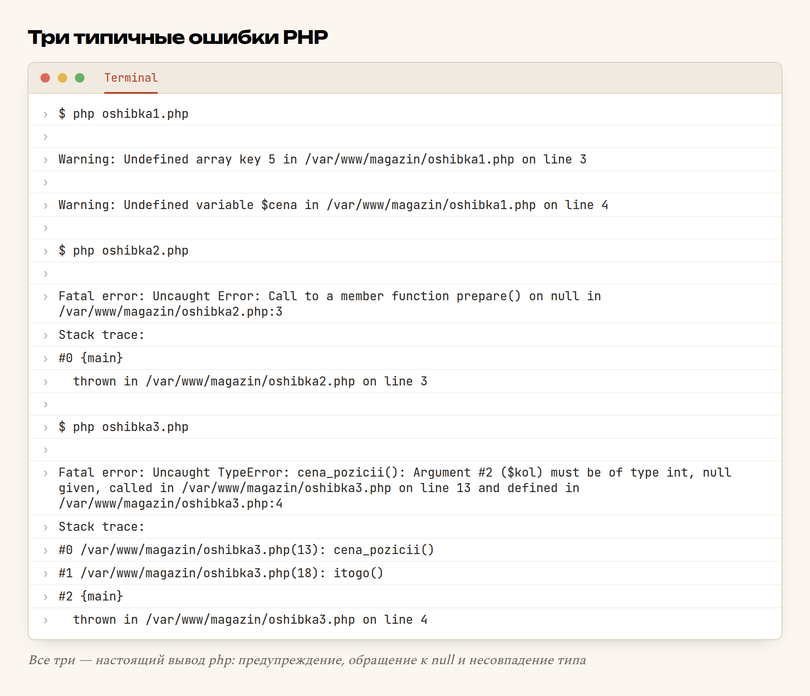
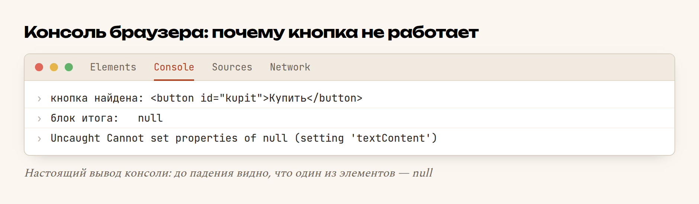

# Глава 55. Отладка: как читать ошибки

> **Часть XI. Ремесло** · Глава 55 из 60
> [← Глава 54](54-github.md) · [Глава 56 →](56-logi.md)

## 🎯 Зачем эта глава

Признаемся честно: большую часть рабочего времени программист не пишет код,
а разбирается, **почему написанное не работает**. Это не признак слабости —
это и есть профессия.

Разница между новичком и опытным не в том, что у второго не бывает ошибок.
Она в скорости: новичок ищет причину час, опытный — три минуты. Причём
разница не в знаниях, а в **методе**.

Типичный новичок, увидев красный текст:

1. пугается и **не читает** его;
2. начинает наугад менять строчки — «а вдруг заработает»;
3. меняет ещё что-нибудь;
4. через час не может вернуться к тому, что работало.

Между тем в этом красном тексте почти всегда написано **что** случилось,
**в каком файле** и **в какой строке**. Ошибка — это не ругань. Это отчёт.

Эта глава — про метод. После неё «сайт не работает» перестанет быть
приговором и станет задачей на десять минут.

## 📖 Разбираемся: анатомия ошибки

Любое сообщение PHP состоит из четырёх частей:

```
Fatal error: Uncaught TypeError: cena_pozicii(): Argument #2 ($kol)
must be of type int, null given in /var/www/magazin/oshibka3.php:4
    │            │                                        │        │
    │            │                                        │        └─ строка
    │            │                                        └─ файл
    │            └─ что именно не так
    └─ насколько всё плохо
```

**Насколько плохо** — три уровня:

| Уровень | Что значит | Скрипт продолжит работу? |
|---|---|---|
| **Notice / Deprecated** | «Так делать не стоит» | Да |
| **Warning** | «Что-то не то, но я выкрутился» | Да |
| **Fatal error** | «Всё, дальше не могу» | Нет |

Важно: **Warning тоже надо чинить.** «Undefined array key» означает, что
вместо цены в расчёт пошёл `null`. Скрипт доработает — и посчитает неправильно.
Молчаливо неправильный расчёт хуже, чем честное падение.

### Стек вызовов

Под фатальной ошибкой печатается **stack trace** — стек вызовов. Читать его
надо **снизу вверх**: это путь, которым программа пришла к беде.

```
#0 /var/www/magazin/oshibka3.php(13): cena_pozicii()
#1 /var/www/magazin/oshibka3.php(18): itogo()
#2 {main}
```

Читаем с конца: программа стартовала (`{main}`), на строке 18 вызвала
`itogo()`, та на строке 13 вызвала `cena_pozicii()` — и там всё сломалось.

Это очень ценно. Ошибка произошла в `cena_pozicii`, **но виновата не она**:
ей передали плохие данные. Чинить надо там, откуда пришёл `null`.

### Белый экран

Отдельный случай, пугающий сильнее всех: открываете страницу — **пусто**.
Ни текста, ни ошибки.

Это почти всегда означает: ошибка есть, но её **запретили показывать**.
На боевом сервере так и надо (глава 56), а вот на своём компьютере —
наоборот. Включите показ, положив рядом с проектом файл `.user.ini`:

```ini
display_errors = On
error_reporting = E_ALL
```

или временно, первой строкой скрипта:

```php
ini_set('display_errors', '1');
error_reporting(E_ALL);
```

Белый экран превратится в понятное сообщение. Это первое, что нужно
сделать, а не последнее.

## 💻 Код: метод в пять шагов

Пока ошибка не найдена, действуйте по шагам. Не «попробую поменять» —
именно по шагам.

### Шаг 1. Прочитать сообщение целиком

Да, на английском. Но слов там немного, и они повторяются:

| Сообщение | Перевод | Что искать |
|---|---|---|
| `Undefined variable $x` | Переменной `$x` не существует | Опечатка в имени или её не создали |
| `Undefined array key "cena"` | В массиве нет такого ключа | Другое имя ключа или пустые данные |
| `Call to a member function ... on null` | Обращение к методу у `null` | Объект не создался — обычно `$pdo` |
| `Call to undefined function ...` | Такой функции нет | Опечатка или не подключён файл |
| `syntax error, unexpected ...` | Синтаксис | Забытая `;`, `}` или кавычка **выше** |
| `Argument #N must be of type int, null given` | Типы не совпали | Данные пришли не те |
| `Headers already sent` | Что-то напечаталось до заголовков | Пробел или `echo` до `header()`/`session_start()` |
| `Too few arguments to function` | Забыли аргумент | Проверьте вызов |

### Шаг 2. Открыть указанный файл и строку

Прямо в нём. Не «примерно там» — точно на этой строке. При синтаксической
ошибке смотрите **строку и всё, что выше**: забытая точка с запятой
обнаруживается на следующей строке.

### Шаг 3. Посмотреть, что внутри переменных

Главный инструмент отладки в PHP — три функции:

```php
var_dump($korzina);       // тип, длина и содержимое — самое подробное
print_r($korzina);        // короче и читаемее для массивов
echo gettype($cena);      // только тип: integer, string, NULL...
```

Разница важна: `echo $x` при `$x = null` напечатает **пустоту**, и вы решите,
что переменная — пустая строка. `var_dump($x)` напечатает `NULL` и всё
объяснит.

Удобный приём — «допрос с выходом»:

```php
var_dump($korzina);
exit;                     // дальше не идём — смотрим, что здесь
```

### Шаг 4. Метод половинного деления

Не знаете, где ломается? Не ищите по всему файлу. Разделите пополам:

```php
// ... первая половина кода
var_dump('дошли до середины', $summa);
exit;
```

Сообщение напечаталось — беда во второй половине. Не напечаталось —
в первой. Повторите с половиной от половины. За 5-6 шагов вы локализуете
ошибку в файле на тысячу строк.

Это самый недооценённый приём в отладке. Он работает **всегда** и не требует
никаких инструментов.

### Шаг 5. Проверить границу

Ошибки любят границы — места, где данные переходят из рук в руки:

```php
// граница «браузер → PHP»
var_dump($_POST);
var_dump($_GET);

// граница «PHP → база»
var_dump($sql, $parametry);

// граница «база → PHP»
var_dump($stmt->rowCount(), $stroki);

// граница «PHP → браузер»
var_dump($tovary);
```

В девяти случаях из десяти окажется, что данные исчезли ровно на одной
из этих границ: имя поля в форме не совпало с ключом в `$_POST`, запрос
вернул ноль строк, в JSON приехало не то.

### Отладка запросов к базе

Отдельная боль: запрос «не работает», а почему — не видно. Заставьте PDO
говорить:

```php
$pdo = new PDO($dsn, $user, $pass, [
    PDO::ATTR_ERRMODE => PDO::ERRMODE_EXCEPTION,   // ← без этого PDO молчит
]);
```

С этой настройкой вместо тихого `false` вы получите внятное
`SQLSTATE[42S22]: Column not found: 1054 Unknown column 'cenaa'`.

А чтобы увидеть сам запрос с подставленными значениями:

```php
$sql = 'SELECT * FROM tovary WHERE kategoriya_id = ? AND cena < ?';
$parametry = [$kategoriya, $max_cena];

var_dump($sql, $parametry);          // смотрим, что уходит в базу
$stmt = $pdo->prepare($sql);
$stmt->execute($parametry);
var_dump($stmt->rowCount());         // и сколько вернулось
```

### Отладка JavaScript

В браузере всё то же самое, только инструмент другой — **консоль**
(F12 → Console):

```js
console.log('корзина:', korzina);       // обычный вывод
console.table(tovary);                  // массив объектов — таблицей
console.error('сюда не должны были попасть');
```

Вкладка **Network** показывает запросы к серверу: какой ушёл, что вернулось,
с каким кодом. Если `fetch` «не работает», ответ почти всегда там —
404, 500 или HTML вместо JSON.

## 🔤 Разбор по словам

| Запись | Что это | Зачем |
|---|---|---|
| `var_dump($x)` | Печатает тип и значение | Главный инструмент: показывает `NULL` и `false` явно |
| `print_r($x)` | Печатает читаемо | Для массивов, когда типы не важны |
| `exit` / `die` | Немедленно остановить скрипт | Чтобы дальше ничего не затёрло вывод |
| `gettype($x)` | Название типа строкой | Быстрая проверка «а это точно число?» |
| **stack trace** | Стек вызовов | Путь, которым программа пришла к ошибке |
| `#0`, `#1` | Кадры стека | Читать снизу вверх |
| `{main}` | Сам файл, вне функций | Начало пути |
| `ini_set(...)` | Изменить настройку PHP на лету | Включить показ ошибок на своей машине |
| `E_ALL` | «Все виды сообщений» | Показывать в том числе предупреждения |
| `ERRMODE_EXCEPTION` | Режим PDO «ругаться исключением» | Иначе ошибки базы молчат |
| `console.log(...)` | Вывод в консоль браузера | `var_dump` для JavaScript |
| **F12** | Открыть инструменты разработчика | Console, Network, Elements |

## 🖥 На экране

Три ошибки, которые вы встретите в первую же неделю:



Разбираем каждую.

**Первая.** `Undefined array key 5` — обратились к `$tovary[5]`, а в массиве
всего два элемента. И `Undefined variable $cena` — такой переменной вообще
нет. Обратите внимание: это **Warning**, скрипт пошёл дальше. Именно так
в расчёт и попадает `null` вместо цены.

**Вторая.** `Call to a member function prepare() on null` — классика.
Означает: `$pdo` не объект, а `null`. Значит, подключение к базе не удалось,
а вы этого не проверили. Чинить надо не эту строку, а место подключения.

**Третья.** Самая полезная: `Argument #2 ($kol) must be of type int,
null given`. Плюс стек: `cena_pozicii()` вызвана из `itogo()` со строки 13,
`itogo()` — со строки 18. Ошибка вылетела в `cena_pozicii`, а причина —
во входных данных: у второй позиции корзины нет ключа `kol`.

Теперь браузер. Кнопка «не работает»:



`Cannot set properties of null` — обращаемся к свойству у `null`. Строчкой
выше видно причину: `блок итога: null`. Селектор `#itogo` не нашёл ничего,
потому что в разметке `id="itog"`. Опечатка в одной букве.

Отсюда важнейшая привычка: **выводите промежуточные значения до того, как
упадёте.** Два `console.log` превратили загадку в очевидность.

## ⚠️ Грабли

**Не читать сообщение.** Ошибка — это отчёт, где написано что, где и почему.
Прочитать три строки быстрее, чем гадать полчаса.

**Менять код наугад.** «А вдруг так заработает» — путь к состоянию, когда
сломано всё и вернуться некуда. Если уж пробуете — **сначала коммит**
(глава 53), чтобы было куда откатиться.

**Чинить строку, где вылетело.** В стеке видно: упало в одном месте,
причина — в другом. Ищите **источник плохих данных**, а не место падения.

**Отключить показ ошибок, чтобы не мешали.** Ошибка никуда не денется —
вы просто ослепнете. Белый экран вместо сообщения не улучшает ситуацию.

**Забыть убрать `var_dump`.** Классика: покупатель видит на странице оплаты
дамп массива с внутренними данными. Перед коммитом ищите по проекту
`var_dump`, `print_r`, `console.log` и `exit`.

**Игнорировать Warning.** «Работает же» — до первого неправильного счёта.
Warning означает, что вы считаете не то, что думаете.

**Отлаживать на боевом.** Правки прямо на работающем сайте — это ошибки,
которые видит покупатель. Воспроизводите у себя.

## 🏋️ Задачи

**Задача 55.1.** Соберите `oshibka1.php`, `oshibka2.php`, `oshibka3.php`
и запустите. Прочитайте сообщения — какие файлы и строки они называют?

**Задача 55.2.** Почините все три. Что именно вы поменяли в каждой?

**Задача 55.3.** Сделайте синтаксическую ошибку: уберите `;` в середине
файла. На какой строке PHP сообщит об ошибке? Совпала ли она с той,
где вы удалили?

**Задача 55.4.** Выключите `display_errors` и повторите. Получили белый
экран? Включите обратно.

**Задача 55.5.** Возьмите файл на сто строк и найдите ошибку методом
половинного деления. За сколько шагов получилось?

**Задача 55.6.** Сделайте `$x = null` и сравните `echo $x` и `var_dump($x)`.
Почему первое опасно?

**Задача 55.7.** Уберите `ERRMODE_EXCEPTION` из подключения PDO и сделайте
запрос к несуществующему столбцу. Что произошло? Верните настройку.

**Задача 55.8.** Повторите ошибку с `#itogo`/`itog` в своём проекте.
Найдите её через консоль браузера.

**Задача 55.9.** Откройте вкладку Network и нажмите кнопку, отправляющую
`fetch`. Какой код ответа? Что в теле?

**Задача 55.10.** Напишите свой список из пяти шагов отладки и повесьте
рядом с монитором. В следующий раз при ошибке идите по нему.

*Ответы — в [Приложении Г](../prilozheniya/G-otvety.md).*

## 🔗 В бою

Реальная история из этого проекта. Поиск по слову «фильтр» возвращал пустой
список — при том, что фильтров в базе полно.

Разбор занял четыре минуты по шагам:

1. Открыли Network — запрос уходит, ответ `200`, тело `[]`. Значит,
   фронтенд ни при чём, дело на сервере.
2. Вывели `var_dump($sql, $parametry)` — запрос выглядел правильно.
3. Выполнили тот же запрос руками в базе — тоже пусто.
4. Присмотрелись к условию: `LIKE 'фильтр%'` — поиск **по началу строки**.
   А в базе название «Фильтр масляный MANN» начинается с заглавной,
   и запрошенные слова часто стоят в середине.

Ошибки в коде не было вообще: код делал ровно то, что написано. Неверным
было **условие поиска**. Починили — поиск стал искать и по вхождению,
а не только по началу.

Мораль: отладка не всегда заканчивается «нашёл баг». Иногда она
заканчивается «понял, что мы просили не то».

## 📌 Итог

- Ошибка — это **отчёт**: что, в каком файле, в какой строке.
- Три уровня: Notice, **Warning** (тоже чинить!), Fatal error.
- **Стек вызовов читают снизу вверх** — это путь к беде.
- Белый экран = ошибки скрыты. **Включите их** на своей машине.
- `var_dump` показывает `NULL` и `false`, `echo` — врёт пустотой.
- **Метод половинного деления** находит место за 5-6 шагов, всегда.
- Проверяйте **границы**: форма → PHP → база → PHP → браузер.
- Для базы обязателен `ERRMODE_EXCEPTION`, иначе PDO молчит.
- В браузере: **Console** — ошибки, **Network** — что ушло и что вернулось.
- **Убирайте отладочный вывод перед коммитом.**

Дальше — как узнать, что было ночью, когда никто не смотрел: логи.

[← Глава 54](54-github.md) · [Глава 56. Логи →](56-logi.md)
