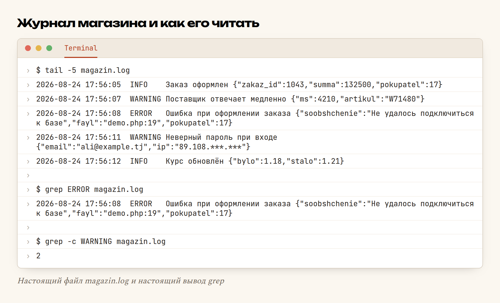

# Глава 56. Логи

> **Часть XI. Ремесло** · Глава 56 из 60
> [← Глава 55](55-otladka.md) · [Глава 57 →](57-deploy.md)

## 🎯 Зачем эта глава

Утром звонит владелец магазина: «Ночью покупатель не смог оформить заказ».

Вы открываете сайт — всё работает. Оформляете тестовый заказ — проходит.
Спрашиваете: «А что было на экране?» — «Не помню, ошибка какая-то».

И всё. Ошибку вы воспроизвести не можете, покупателя не найдёте, ночь
прошла. Отладка из прошлой главы тут бессильна: отлаживать нечего.

Спасает **лог** — журнал событий. Программа сама, в момент происшествия,
записывает в файл: что случилось, когда, с какими данными. Утром вы
открываете этот файл и **видите ту самую ночь**.

Разница огромная:

| Без логов | С логами |
|---|---|
| «Ночью что-то сломалось» | `03:14 ERROR Ошибка оформления, заказ 1043, покупатель 17` |
| Гадаем, воспроизводим, не находим | Открыли файл, прочитали, починили |
| «У нас всё работает» | «У нас 47 таких ошибок за сутки» |

Лог — это чёрный ящик самолёта. Пока всё хорошо, он не нужен. Когда
случилось — без него не разобраться.

## 📖 Разбираемся: что такое лог

**Лог** (журнал) — обычный текстовый файл, куда программа дописывает строки.
Ключевое слово — **дописывает**: старое никогда не стирается, новое
добавляется в конец.

Одна строка = одно событие. И у строки всегда одинаковый порядок частей:

```
2026-08-24 17:56:08  ERROR  Ошибка при оформлении заказа {"zakaz_id":1043}
└────── когда ─────┘  └ как плохо ┘ └── что случилось ──┘ └─ подробности ─┘
```

Почему формат обязан быть одинаковым: по логу потом **ищут**. Если строки
выглядят по-разному, найти в них что-то невозможно.

### Уровни: насколько это важно

Три уровня хватает на всё:

| Уровень | Когда | Пример |
|---|---|---|
| **INFO** | Обычное событие, всё хорошо | Заказ оформлен, курс обновлён |
| **WARNING** | Странно, но работаем | Поставщик отвечает 4 секунды, неверный пароль |
| **ERROR** | Не смогли сделать то, что должны | База недоступна, заказ не сохранился |

Зачем разделять? Чтобы утром не читать десять тысяч строк, а спросить:
«покажи только ERROR» — и получить пять.

### Три разных лога

Их легко перепутать, а они про разное:

| Лог | Кто пишет | Что там |
|---|---|---|
| **Лог веб-сервера** | Apache/nginx | Кто и какую страницу открыл, код ответа |
| **Лог ошибок PHP** | Сам PHP | Warning'и и Fatal error, которые вы не увидели |
| **Лог приложения** | **Вы**, своим кодом | События вашего магазина: заказы, оплаты, входы |

Первые два вам дают бесплатно — надо только знать, где они лежат. Третий
никто, кроме вас, не напишет. О нём и глава.

### Что записывать

Правило: **записывайте то, о чём вас спросят завтра.**

Спросят обязательно:

- **деньги** — заказ создан, оплачен, отменён, выплата продавцу;
- **вход и доступ** — вход, выход, неверный пароль, смена пароля;
- **действия админа** — товар отклонён, цена изменена, продавец заблокирован;
- **чужие сервисы** — запрос к поставщику, ответ, ошибка, время ответа;
- **всё, что упало** — любое пойманное исключение.

## 💻 Код: журнал на двадцать строк

```php
<?php
declare(strict_types=1);

const LOG_FAYL = __DIR__ . '/magazin.log';

function zapisat_v_log(string $uroven, string $soobshchenie, array $podrobnosti = []): void
{
    $stroka = sprintf(
        "%s  %-7s %s %s\n",
        date('Y-m-d H:i:s'),
        strtoupper($uroven),
        $soobshchenie,
        $podrobnosti ? json_encode($podrobnosti, JSON_UNESCAPED_UNICODE) : ''
    );
    file_put_contents(LOG_FAYL, $stroka, FILE_APPEND | LOCK_EX);
}

function log_info(string $s, array $p = []): void      { zapisat_v_log('info', $s, $p); }
function log_vnimanie(string $s, array $p = []): void  { zapisat_v_log('warning', $s, $p); }
function log_oshibka(string $s, array $p = []): void   { zapisat_v_log('error', $s, $p); }
```

Всё. Никаких библиотек не нужно — этого хватит на первые годы.

Два флага в `file_put_contents` делают тут всю работу:

- `FILE_APPEND` — **дописать в конец**, а не затереть файл;
- `LOCK_EX` — заблокировать файл на время записи, чтобы два одновременных
  посетителя не написали поверх друг друга.

### Как этим пользоваться

```php
// Заказ прошёл
log_info('Заказ оформлен', [
    'zakaz_id'  => $zakaz_id,
    'summa'     => $summa,
    'pokupatel' => $_SESSION['user_id'],
]);

// Поставщик тормозит — не ошибка, но знать надо
if ($ms > 3000) {
    log_vnimanie('Поставщик отвечает медленно', ['ms' => $ms, 'artikul' => $artikul]);
}

// Настоящая беда
try {
    oformit_zakaz($korzina);
} catch (Throwable $e) {
    log_oshibka('Ошибка при оформлении заказа', [
        'soobshchenie' => $e->getMessage(),
        'fayl'         => basename($e->getFile()) . ':' . $e->getLine(),
        'pokupatel'    => $_SESSION['user_id'] ?? null,
    ]);
    // Покупателю — вежливо и без подробностей
    exit('Не удалось оформить заказ. Попробуйте позже.');
}
```

Обратите внимание на последние две строки. **Покупатель не должен видеть
текст ошибки** — там имена таблиц и путь к файлам, подарок для взломщика.
Ему — вежливая фраза, вам — подробности в лог.

### Ловим всё, что не поймали

Даже аккуратный код иногда падает там, где `try` не стоит. Поставьте один
общий перехватчик в файле, который подключается первым:

```php
set_exception_handler(function (Throwable $e): void {
    log_oshibka('Непойманное исключение', [
        'soobshchenie' => $e->getMessage(),
        'fayl'         => $e->getFile() . ':' . $e->getLine(),
        'url'          => $_SERVER['REQUEST_URI'] ?? '',
    ]);
    http_response_code(500);
    exit('Что-то пошло не так. Мы уже разбираемся.');
});
```

Теперь **любая** необработанная ошибка попадёт в журнал вместе с адресом
страницы, на которой случилась.

### Как читать лог

Инструменты — обычные команды терминала:

```bash
tail -50 magazin.log              # последние 50 строк
tail -f magazin.log               # смотреть в живом времени, пока идёт работа
grep ERROR magazin.log            # только ошибки
grep -c WARNING magazin.log       # сколько предупреждений
grep '2026-08-24 03:' magazin.log # что было в три часа ночи
grep 'zakaz_id":1043' magazin.log # всё про конкретный заказ
```

`tail -f` — самая полезная. Запускаете её, потом нажимаете кнопку на сайте
и видите, как в журнал прилетают строки. Отладка вживую.

### Ротация: чтобы файл не съел диск

Лог растёт всегда. За полгода — гигабайты, и однажды диск кончится
и сайт ляжет. Лечение — **ротация**: раз в сутки старый файл переименовать,
начать новый, файлы старше месяца удалить.

На нормальном хостинге это делает `logrotate`, но простейший вариант —
писать в файл с датой в имени:

```php
const LOG_FAYL = __DIR__ . '/logs/magazin-' . date('Y-m-d') . '.log';
```

Каждый день — свой файл. Удалять старые — раз в месяц, руками или
по расписанию.

## 🔤 Разбор по словам

| Запись | Что это | Зачем |
|---|---|---|
| `FILE_APPEND` | Флаг «дописать в конец» | Без него каждая запись **стирает** предыдущие |
| `LOCK_EX` | Блокировка файла на запись | Два посетителя не испортят строку друг другу |
| `sprintf("%s %-7s ...")` | Собрать строку по шаблону | `%-7s` — выровнять уровень по левому краю в 7 символов |
| `date('Y-m-d H:i:s')` | Время в виде `2026-08-24 17:56:08` | Такой формат **сортируется как текст** |
| `strtoupper` | В верхний регистр | `error` → `ERROR`, чтобы искать одинаково |
| `Throwable` | Общий тип для всех ошибок и исключений | Ловит и `Exception`, и `Error` |
| `$e->getMessage()` | Текст ошибки | Что именно случилось |
| `$e->getFile()`, `getLine()` | Файл и строка | Где случилось |
| `set_exception_handler` | «Вот что делать с непойманными» | Общая страховка на весь сайт |
| `http_response_code(500)` | Сказать браузеру «ошибка сервера» | Чтобы поисковик не индексировал поломку |
| `tail -f` | Показывать конец файла и ждать новых строк | Наблюдать за логом вживую |
| `grep` | Искать строки по образцу | Основной способ читать логи |

## 🖥 На экране

Запускаем демо и смотрим, что получилось в журнале:



Пять строк — пять событий. Читаем, как отчёт о смене:

- **17:56:05** — заказ 1043 на 1325 сомони от покупателя 17. Всё хорошо.
- **17:56:07** — поставщик ответил за 4210 мс. Не поломка, но если таких
  строк за день сотня — пора разбираться.
- **17:56:08** — **ERROR**: не удалось подключиться к базе. Видно и файл,
  и строку, и какого покупателя это коснулось.
- **17:56:11** — неверный пароль. Одна такая строка — человек ошибся.
  Двести за минуту — подбирают пароль.
- **17:56:12** — курс изменился с 1.18 на 1.21. Через месяц, когда спросят
  «почему в тот день цены подскочили», ответ будет здесь.

Ниже — `grep ERROR`: из пяти строк осталась одна, та самая. Так и работают
с логом на боевом сервере, где строк не пять, а пятьдесят тысяч.

И `grep -c WARNING` — просто счётчик: два. Считать полезно: «вчера было 3,
сегодня 300» — это уже сигнал.

## ⚠️ Грабли

**Логов нет вообще.** Самая частая ситуация у новичка — и самая дорогая.
Первый же ночной сбой обойдётся дороже, чем двадцать строк логгера.

**Пароли и карты в логе.** Никогда не пишите в журнал пароль, номер карты,
код из SMS, токен. Лог читают многие, он попадает в бэкапы. Почту и телефон —
частично закрывайте: `ali@example.tj` → `a***@example.tj`.

**Забыли `FILE_APPEND`.** Файл будет содержать ровно одну строку — последнюю.
Классика, которая обнаруживается в самый неподходящий момент.

**Логируют всё подряд.** Строка на каждый шаг цикла — и за сутки 4 ГБ,
в которых ничего не найти. Пишите **события**, а не каждое действие.

**Лог в публичной папке.** `site.tj/magazin.log` откроет кто угодно, включая
поисковики. Держите логи **вне корня сайта** или закрывайте доступ.

**Никто не читает лог.** Журнал, в который не заглядывают, бесполезен.
Заведите привычку: раз в неделю — `grep ERROR` за неделю. Пять минут.

**Нет ротации.** Через год файл на 8 ГБ, диск полон, сайт лежит. Дата
в имени файла решает это одной строкой.

**В лог пишут то же, что показывают покупателю.** Наоборот: покупателю —
вежливую фразу, в лог — подробности.

## 🏋️ Задачи

**Задача 56.1.** Соберите `log.php` и `demo.php`, запустите, откройте
`magazin.log`. Все пять строк на месте?

**Задача 56.2.** Уберите `FILE_APPEND` и запустите ещё раз. Что стало
с файлом? Верните флаг.

**Задача 56.3.** Добавьте логирование в свой магазин: заказ оформлен,
вход выполнен, вход не удался.

**Задача 56.4.** Найдите в логе все ошибки: `grep ERROR`. Посчитайте
предупреждения: `grep -c WARNING`.

**Задача 56.5.** Запустите `tail -f magazin.log` в одном окне, а в другом
понажимайте кнопки на сайте. Что видно?

**Задача 56.6.** Поставьте `set_exception_handler`. Устройте падение
в случайном месте и проверьте, что оно попало в журнал.

**Задача 56.7.** Сделайте так, чтобы покупатель видел вежливую фразу,
а подробности шли в лог. Проверьте, что на экране нет ни имени таблицы,
ни пути к файлу.

**Задача 56.8.** Добавьте дату в имя файла. Убедитесь, что появился
`logs/magazin-2026-08-24.log`.

**Задача 56.9.** Напишите функцию `zamaskirovat_email('ali@example.tj')`,
возвращающую `a***@example.tj`. Примените в логировании входов.

**Задача 56.10.** Напишите скрипт `otchet.php`, который читает лог за день
и печатает: сколько заказов, сколько ошибок, сколько неудачных входов.

*Ответы — в [Приложении Г](../prilozheniya/4-G-otvety.md).*

## 🔗 В бою

В этом проекте логи решают три конкретные задачи.

**Ответы поставщика.** Каждый запрос к AutoEuro и Parts-Catalogs
записывается: артикул, время ответа, код. Именно по логам стало видно,
что токен комплектации протухает и `groups2` начинает отвечать 404 —
без журнала это выглядело бы как «иногда каталог не открывается».

**Расход тарифа.** Когда выяснилось, что правила расхода запросов
не такие, как считалось, первым делом полезли в логи: сколько запросов
и куда ушло. Разговор с поставщиком без этих цифр был бы разговором
ни о чём.

**Деньги.** Заказы, смены статусов, начисления продавцам — всё в журнале.
Таблица `seller_ledger` устроена по тому же принципу, что и лог:
**только дописывание, ничего не стирается**, а баланс считается суммой
записей. Это и есть логика журнала, доведённая до денег.

## 📌 Итог

- Лог — **чёрный ящик**: он показывает то, чего вы не видели.
- Одна строка — одно событие, **всегда в одном формате**.
- Три уровня хватает: **INFO**, **WARNING**, **ERROR**.
- `FILE_APPEND` — дописывать, `LOCK_EX` — не мешать друг другу.
- Записывать: **деньги, доступ, действия админа, чужие сервисы, падения**.
- **Пароли, карты и токены в лог не пишут никогда.**
- `set_exception_handler` ловит то, что не поймали вы.
- Покупателю — **вежливая фраза**, в журнал — подробности.
- Читают лог командами `tail -f` и `grep`.
- Без **ротации** лог однажды съест диск.

Дальше — как всё это выложить в интернет, чтобы работало не только у вас.

[← Глава 55](55-otladka.md) · [Глава 57. Деплой →](57-deploy.md)
