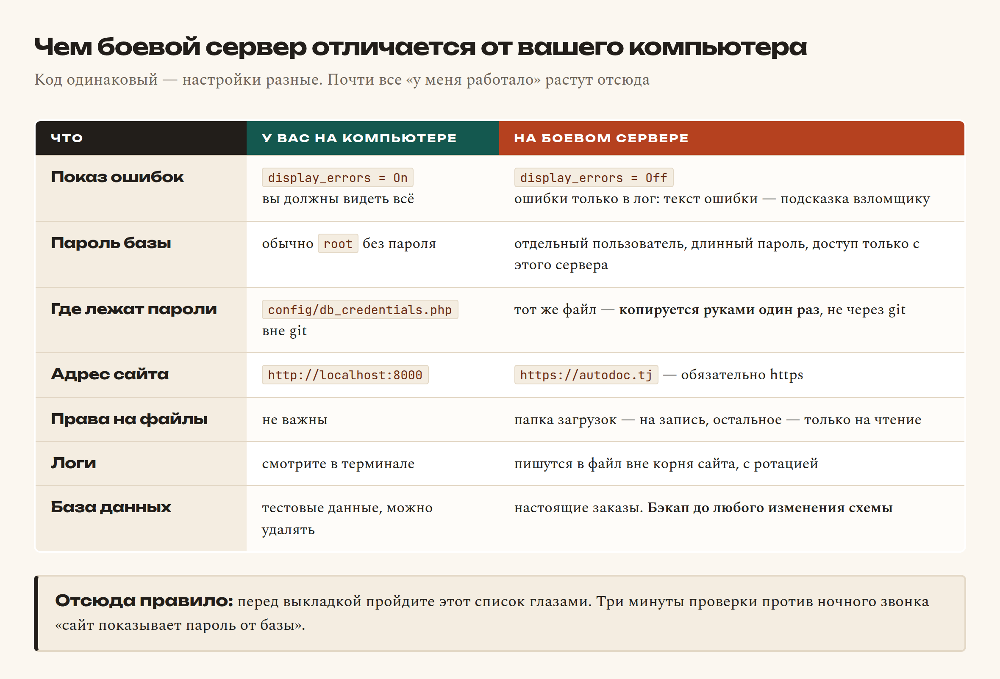
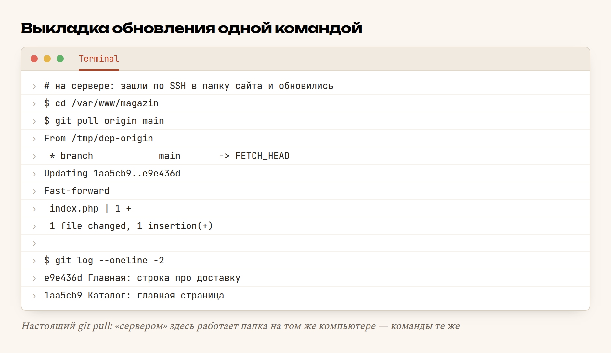

# Глава 57. Деплой на хостинг

> **Часть XI. Ремесло** · Глава 57 из 60
> [← Глава 56](56-logi.md) · [Глава 58 →](58-domen-https.md)

## 🎯 Зачем эта глава

До этой главы ваш магазин жил по адресу `http://localhost:8000` — то есть
существовал ровно для одного человека на земле. Для вас.

**Деплой** (от английского *deploy* — развернуть) — это выкладка сайта
на сервер, доступный всему интернету. Момент, когда проект перестаёт быть
учебным и становится настоящим.

Пугаться нечего: технически это «скопировать файлы и настроить пару вещей».
Но именно здесь новички теряют больше всего времени и нервов, потому что
всплывает то, чего на своём компьютере не было:

- «у меня работало, а тут белый экран»;
- «сайт открылся, но без картинок»;
- «база не подключается»;
- и самое неприятное — «сайт показал пароль от базы посетителю».

Разберём весь путь по шагам, включая то, что обычно узнают на своих ошибках.

## 📖 Разбираемся: что такое хостинг

**Хостинг** — чужой компьютер, который включён круглосуточно, подключён
к интернету толстым каналом и настроен так, чтобы отдавать сайты.

Для PHP-магазина есть три варианта:

| Вариант | Что это | Кому подходит |
|---|---|---|
| **Shared-хостинг** | Общий сервер, вам дают папку и панель управления | Первый сайт. Дёшево, ничего настраивать не надо |
| **VPS** | Отдельный виртуальный сервер, вы — администратор | Когда нужен свой софт и полный контроль |
| **Выделенный сервер** | Целая физическая машина | Крупные проекты |

Для первого магазина берите **shared-хостинг с панелью cPanel или ISPmanager**.
Там уже есть PHP, MySQL, почта и кнопка «выпустить сертификат HTTPS».
VPS — это интересно, но там вы отвечаете и за обновления системы,
и за безопасность, и за то, что сервер вообще запустится.

Выбирая, проверьте три вещи: **версия PHP не ниже 8.1**, **MySQL или MariaDB
есть**, **доступ по SSH есть**. Последнее особенно важно: без SSH выкладывать
придётся мышкой через файловый менеджер, а это медленно и чревато ошибками.

### Чем боевой сервер отличается от вашего компьютера

Это главное недоразумение всей главы. Код одинаковый — **окружение разное**.



Строчка, из-за которой чаще всего звонят ночью, — первая. На своём компьютере
`display_errors = On`, и это правильно. На боевом — **строго `Off`**.
Иначе первый же сбой покажет посетителю путь к файлам, имена таблиц,
а иногда и строку подключения к базе целиком.

## 💻 Код: выкладка по шагам

### Шаг 1. Подготовить проект

До первой выкладки — четыре вещи:

```bash
# 1. Всё закоммичено и запушено
git status                  # должно быть чисто

# 2. В .gitignore точно есть секреты и мусор
cat .gitignore
# config/db_credentials.php
# kesh/
# *.log
# zagruzki/

# 3. В проекте нет отладочного вывода
grep -rn "var_dump\|print_r\|console.log" --include="*.php" .

# 4. Есть файл-пример конфига, без настоящих паролей
cat config/db_credentials.example.php
```

Четвёртый пункт — маленькая, но очень полезная привычка. В git лежит
`db_credentials.example.php` с пустыми значениями и комментариями;
на сервере вы копируете его в `db_credentials.php` и вписываете настоящие
данные. Так и секретов в git нет, и понятно, что заполнять.

### Шаг 2. Залить код

Три способа, от худшего к лучшему:

```bash
# А. Мышкой через файловый менеджер панели — работает, но медленно
#    и легко забыть файл. Годится один раз, для пробы.

# Б. По SFTP (FileZilla) — быстрее, но обновления руками
#    и невозможно понять, что именно вы залили.

# В. Через git — правильный способ
ssh user@server.tj
cd /var/www/magazin
git clone https://github.com/firdavs/magazin.git .
```

Способ **В** лучше не потому, что модный. Он даёт две вещи, которых нет
у первых двух: вы **точно знаете**, какая версия сейчас на сайте
(`git log -1`), и обновление занимает одну команду.

### Шаг 3. Настроить базу

В панели хостинга создаёте базу и пользователя, потом заливаете структуру:

```bash
# Выгрузить схему у себя
mysqldump -u root --no-data magazin > shema.sql

# Залить на сервере
mysql -u magazin_user -p magazin_db < shema.sql
```

И вписываете доступы в `config/db_credentials.php` **прямо на сервере**:

```php
<?php
return [
    'host'   => 'localhost',
    'baza'   => 'magazin_db',
    'user'   => 'magazin_user',
    'parol'  => 'длинный-пароль-который-вам-выдал-хостинг',
];
```

Этот файл создаётся **один раз, руками, на сервере**. Через git он не ездит
никогда — он в `.gitignore`.

### Шаг 4. Указать корень сайта

Самая недооценённая настройка. В панели хостинга есть поле «корневая папка
сайта» (*document root*). Указывать надо **не** папку проекта, а папку
`public/` внутри неё:

```
/var/www/magazin/           ← сюда склонирован проект
    config/                 ← пароли: снаружи недоступны
    includes/               ← код: снаружи недоступен
    logs/                   ← журналы: снаружи недоступны
    public/                 ← ← ← корень сайта
        index.php
        katalog.php
        assets/
```

Смысл: всё, что не в `public/`, **физически недостижимо** из браузера.
Никто не откроет `site.tj/config/db_credentials.php`, потому что такого
пути с точки зрения веб-сервера не существует.

Если хостинг не даёт менять корень (бывает на самых дешёвых тарифах) —
закройте служебные папки файлом `.htaccess`:

```apache
# config/.htaccess, logs/.htaccess
Deny from all
```

### Шаг 5. Настроить PHP на боевой лад

Файл `.htaccess` в корне сайта или `.user.ini` — в зависимости от хостинга:

```ini
display_errors = Off
log_errors = On
error_log = /var/www/magazin/logs/php-errors.log
error_reporting = E_ALL
```

Читается так: ошибки **не показывать**, но **записывать** — все, включая
предупреждения. Ровно то, о чём была прошлая глава.

### Шаг 6. Права на файлы

```bash
chmod -R 755 /var/www/magazin          # читать и выполнять всем
chmod -R 775 /var/www/magazin/zagruzki # папка загрузок — ещё и на запись
chmod 600 /var/www/magazin/config/db_credentials.php   # только владельцу
```

Правило: **на запись открыто только то, что действительно пишется** —
папка загрузок, папка логов, папка кэша. Всё остальное — только чтение.

### Шаг 7. Проверить

Не «открыл главную, вроде работает». Пройдите список:

```
□ главная открывается
□ каталог, фильтры, страницы
□ карточка товара
□ поиск
□ добавление в корзину, изменение количества
□ оформление заказа — до конца, до записи в базу
□ вход и выход
□ админка: список заказов, смена статуса
□ загрузка картинки товара
□ страница 404 для несуществующего адреса
□ ошибки НЕ показываются посетителю
□ site.tj/config/db_credentials.php → 403 или 404
```

Последние два пункта — обязательные. Первый раз проверьте руками, потом
эта проверка станет привычкой.

### Обновление: то, ради чего всё затевалось

Дальше каждая выкладка выглядит так:

```bash
ssh user@server.tj
cd /var/www/magazin
git pull origin main
```

Одна команда. И, что важнее, **обратимая**: если что-то сломалось,
`git log --oneline` покажет, что приехало, а `git revert` вернёт как было.

### Миграции базы

Код обновился, а базе нужен новый столбец. Правило проекта: миграции
**идемпотентны** — их можно запускать сколько угодно раз без вреда:

```php
// migrations/2026_08_dobavit_status.php
$pdo->exec("
    CREATE TABLE IF NOT EXISTS zakazy_statusy (
        id     INT AUTO_INCREMENT PRIMARY KEY,
        kod    VARCHAR(32) NOT NULL UNIQUE,
        nazvanie VARCHAR(64) NOT NULL
    )
");

dbAddColumnIfMissing($pdo, 'zakazy', 'status', "VARCHAR(32) NOT NULL DEFAULT 'novyy'");
```

`CREATE TABLE IF NOT EXISTS` и проверка «есть ли столбец» — вот и весь секрет.
Запустили дважды по невнимательности — ничего не сломалось.

**И перед любой миграцией — бэкап:**

```bash
mysqldump -u user -p magazin_db > backup-$(date +%F).sql
```

Это не занудство. Это разница между «откатились за минуту» и «потеряли
заказы за месяц».

## 🔤 Разбор по словам

| Слово | Что это | По-простому |
|---|---|---|
| **деплой** | Выкладка на сервер | «Сделать сайт доступным людям» |
| **хостинг** | Сервер, отдающий ваш сайт | Чужой включённый компьютер |
| **shared** | Общий сервер на много сайтов | Дёшево, ничего не настраивать |
| **VPS** | Свой виртуальный сервер | Полный контроль и полная ответственность |
| **SSH** | Терминал на чужой машине | Командная строка сервера у вас на экране |
| **SFTP** | Копирование файлов по защищённому каналу | «Перетащить файлы на сервер» |
| **document root** | Корневая папка сайта | Что именно видно из браузера |
| `.htaccess` | Файл настроек Apache для папки | Правила: доступ, редиректы, PHP |
| `chmod 755` | Права: владельцу всё, остальным читать | Обычные права для кода |
| `chmod 600` | Только владельцу, и то без запуска | Для файлов с паролями |
| **бэкап** | Резервная копия | Спасение, когда всё пошло не так |
| **миграция** | Скрипт изменения структуры базы | «Добавить столбец на боевом» |
| **идемпотентный** | Повторный запуск ничего не портит | Можно выполнить дважды |
| `mysqldump` | Выгрузка базы в файл | Бэкап одной командой |

## 🖥 На экране

Так выглядит обновление сайта после того, как всё настроено:



Читаем вывод. `Updating 1aa5cb9..e9e436d` — сервер был на одном коммите,
стал на другом. `Fast-forward` — обновление прошло **без слияния**: на сервере
никто ничего не правил руками, история просто продвинулась вперёд.
`index.php | 1 +` — изменился ровно один файл, одна строка.

Именно эта прозрачность и нужна: вы видите, **что** уехало на боевой сайт.

Если вместо `Fast-forward` появится сообщение о конфликте — значит, кто-то
(скорее всего вы) правил файлы прямо на сервере. Так делать нельзя: правки
идут через git, иначе они потеряются при следующем обновлении.

## ⚠️ Грабли

**`display_errors = On` на бою.** Ошибка показывает путь к файлам, имена
таблиц и структуру проекта. Это подарок взломщику. Только `Off` + лог.

**Пароли уехали в git.** Смотрите главу 54: удалить файл недостаточно,
он остался в истории. Пароль считается скомпрометированным — **меняйте**.

**Корень сайта = папка проекта.** Тогда `site.tj/config/db_credentials.php`
скачивается любым желающим. Корень — только `public/`.

**Правки прямо на сервере.** «Быстренько поправлю тут одну строчку» — и
через неделю никто не помнит, чем боевой сайт отличается от репозитория,
а следующий `git pull` эти правки затрёт.

**Выкладка в пятницу вечером.** Классика жанра. Если что-то сломается,
чинить будете в выходные. Выкладывайте утром буднего дня.

**Миграция без бэкапа.** Одна опечатка в `ALTER TABLE` — и данных нет.
`mysqldump` занимает десять секунд.

**Забыли про права на папку загрузок.** Сайт работает, а картинки товаров
не загружаются: у веб-сервера нет прав на запись.

**Разные версии PHP.** У вас 8.3, на хостинге 7.4 — и половина синтаксиса
из книги не работает. Проверяйте **до** покупки: `php -v` по SSH.

**Нет проверки после выкладки.** Открыли главную, обрадовались, ушли.
А оформление заказа падает. Список из шага 7 — каждый раз.

## 🏋️ Задачи

**Задача 57.1.** Заведите `config/db_credentials.example.php` с пустыми
значениями и добавьте настоящий файл в `.gitignore`. Проверьте `git status`.

**Задача 57.2.** Перестройте проект под структуру с `public/`. Что пришлось
поменять в путях?

**Задача 57.3.** Найдите в проекте весь отладочный вывод командой `grep -rn`.
Сколько мест нашлось?

**Задача 57.4.** Сделайте `mysqldump` своей базы. Откройте файл — что там
внутри? Восстановите базу из него в новую базу.

**Задача 57.5.** Напишите миграцию, добавляющую столбец, — идемпотентно.
Запустите её три раза подряд.

**Задача 57.6.** Выберите хостинг: сравните три по цене, версии PHP,
наличию SSH и бесплатного HTTPS. Составьте табличку.

**Задача 57.7.** Выложите свой магазин. Пройдите весь список проверки
из шага 7 и запишите, что не заработало с первого раза.

**Задача 57.8.** Проверьте, что `site.tj/config/db_credentials.php`
не открывается. Какой код ответа вернулся?

**Задача 57.9.** Сделайте правку у себя, запушьте, обновите сайт через
`git pull`. Сколько времени заняло от правки до боевого сайта?

**Задача 57.10.** Напишите свой чек-лист выкладки — десять пунктов —
и положите его в `README.md` проекта.

*Ответы — в [Приложении Г](../prilozheniya/G-otvety.md).*

## 🔗 В бою

В этом проекте выкладка устроена именно так: код едет через git, секреты —
нет. Пароли и ключи API живут либо в таблице `site_settings` (и правятся
через форму в суперадминке), либо в git-ignored `config/db_credentials.php`.

Почему ключи в базе, а не в файле: их меняет **владелец магазина**, а не
программист. Поменялся договор с поставщиком — заказчик зашёл в настройки
и вписал новый ключ. Не нужно ни программиста, ни выкладки.

Второе, что стоит перенять, — **идемпотентные миграции**. В проекте они
написаны через `CREATE TABLE IF NOT EXISTS` и `dbAddColumnIfMissing()`.
Это позволяет не помнить, какие миграции уже выполнялись на боевом:
запустил все — лишние ничего не сделали.

И третье, самое главное правило проекта: **витрина должна работать после
любого коммита**. Не «потом поправим» — после каждого. Потому что между
вашим коммитом и покупателем стоит только `git pull`.

## 📌 Итог

- Деплой — это **скопировать код и настроить окружение**, не магия.
- Для первого магазина — **shared-хостинг**: PHP 8.1+, MySQL, SSH.
- Главная разница с локальной машиной — **настройки, а не код**.
- На бою `display_errors = Off`, `log_errors = On`. Всегда.
- **Корень сайта — `public/`**, всё остальное недостижимо из браузера.
- Секреты **не ездят через git** — файл создаётся на сервере руками.
- Выкладка через `git pull` — понятно, что приехало, и обратимо.
- Миграции — **идемпотентные**, и всегда **после бэкапа**.
- На запись открыто **только то, что пишется**.
- После каждой выкладки — **список проверки**, а не «вроде открылось».

Дальше — свой адрес в интернете, замочек в браузере и почта на своём домене.

[← Глава 56](56-logi.md) · [Глава 58. Домен и HTTPS →](58-domen-https.md)
