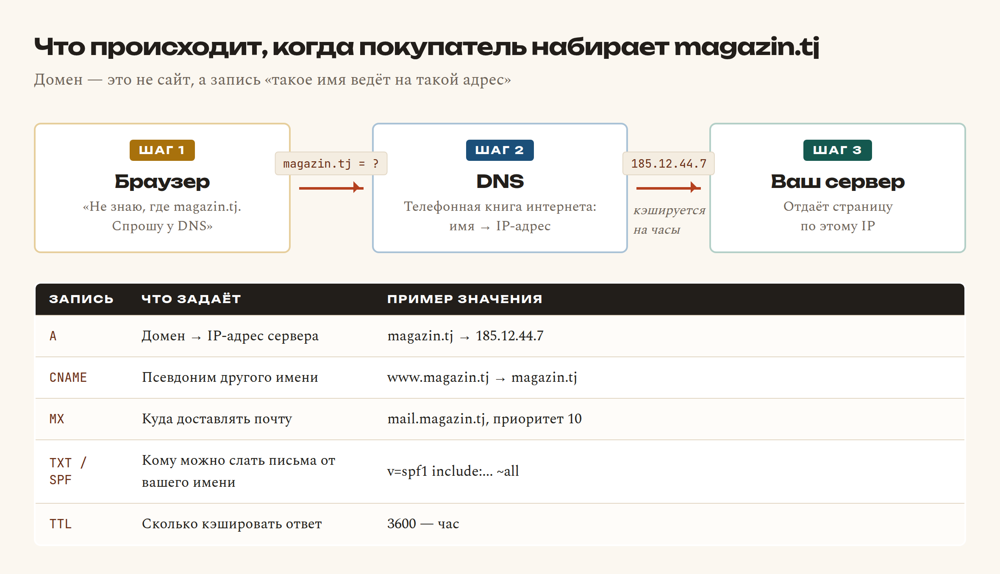
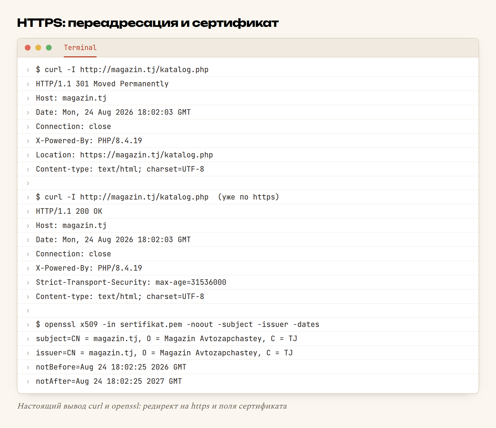

# Глава 58. Домен, HTTPS и почта

> **Часть XI. Ремесло** · Глава 58 из 60
> [← Глава 57](57-deploy.md) · [Глава 59 →](59-kuda-rasti.md)

## 🎯 Зачем эта глава

Сайт выложен и работает — по адресу вроде `185.12.44.7` или
`user123.hosting.tj`. Технически всё в порядке. Продавать так нельзя.

Три вещи отделяют «student-проект» от магазина, которому доверят деньги:

- **свой домен** — `avtozapchast.tj`, а не набор цифр;
- **замочек в браузере** — HTTPS, без которого браузер прямо пишет
  «Не защищено» рядом с формой оплаты;
- **почта на своём домене** — письма приходят с `zakaz@avtozapchast.tj`,
  а не с `magazin1998@mail.ru`, и попадают во «Входящие», а не в спам.

Ни одна из трёх не требует программирования. Все три — настройки, которые
делаются один раз. Но если их не сделать, покупатель просто закроет вкладку.

## 📖 Разбираемся: что такое домен

**Домен** — это имя. Не сайт, не сервер, не хостинг: **имя**, за которым
записан адрес.

Компьютеры находят друг друга по числам — **IP-адресам** вроде `185.12.44.7`.
Люди числа не помнят. Между людьми и числами стоит **DNS** — распределённая
телефонная книга интернета.



Из этой картинки следуют две вещи, которые объясняют 90% недоразумений.

**Первая.** Домен покупается **отдельно от хостинга**. Это разные услуги
и часто разные компании. Домен — у регистратора, сайт — у хостера,
а связывает их одна DNS-запись.

**Вторая.** Изменения в DNS **не мгновенны**. Ответ кэшируется на время,
указанное в TTL — обычно час, иногда сутки. Поменяли A-запись, а сайт
у вас открывается старый? Всё правильно, ждите. Это самая частая паника
новичка при переезде.

### Что покупать

| Зона | Цена в год | Кому |
|---|---|---|
| `.tj` | дороже, местная | Магазин для Таджикистана — самое то |
| `.com` | недорого, международная | Универсально, узнаваемо |
| `.store`, `.shop` | средне | Если `.com` занят |

Совет по имени: короткое, произносимое вслух по телефону, без дефисов
и без цифр. Проверка простая — продиктуйте вслух знакомому и попросите
записать. Записал правильно — имя годится.

### Что такое HTTPS

Обычный HTTP передаёт данные **открытым текстом**. Любой на пути — владелец
Wi-Fi в кафе, провайдер, администратор сети — видит всё: пароль, который
покупатель ввёл при входе, содержимое корзины, адрес доставки.

**HTTPS** = HTTP + шифрование. Тот же обмен, но в закрытом конверте.

Работает это через **сертификат** — файл, которым сервер доказывает
браузеру: «я действительно `avtozapchast.tj`». Сертификат выдаёт
**удостоверяющий центр**, которому браузеры доверяют.

Хорошая новость: сертификаты бесплатны. **Let's Encrypt** выдаёт их
автоматически, и на любом нормальном хостинге это кнопка в панели.

Плохая новость, если проигнорировать: без HTTPS браузер напишет
**«Не защищено»** прямо в адресной строке рядом с формой оплаты. Продажи
на этом заканчиваются.

## 💻 Код: настройка по шагам

### Шаг 1. Купить домен и направить на хостинг

В панели регистратора — раздел DNS. Нужны две записи:

```
Тип    Имя    Значение         TTL
A      @      185.12.44.7      3600
CNAME  www    avtozapchast.tj  3600
```

`@` означает сам домен, `www` — поддомен. Вторая запись нужна, чтобы
`www.avtozapchast.tj` вёл туда же, куда и без `www`.

IP-адрес берётся в панели хостинга. Ждать — от десяти минут до суток.

### Шаг 2. Выпустить сертификат

В панели хостинга: SSL/TLS → Let's Encrypt → выбрать домен → «Выпустить».
Одна кнопка. Обязательно отметьте **автопродление**: сертификат живёт
90 дней, и без автопродления однажды утром сайт встретит посетителей
красным предупреждением.

Проверить, что получилось, можно, посмотрев поля сертификата:

```bash
openssl x509 -in sertifikat.pem -noout -subject -issuer -dates
```

`subject` — кому выдан, `issuer` — кто выдал, `notAfter` — до какого числа
действует. Если `subject` и `issuer` совпадают — сертификат **самоподписанный**,
браузер ему не поверит. У настоящего в `issuer` будет удостоверяющий центр.

### Шаг 3. Заставить всех ходить по HTTPS

Сертификат выпущен, но `http://` продолжает работать. Надо перенаправлять.

Правильнее всего — на уровне веб-сервера, в `.htaccess`:

```apache
RewriteEngine On
RewriteCond %{HTTPS} !=on
RewriteRule ^(.*)$ https://%{HTTP_HOST}%{REQUEST_URI} [R=301,L]
```

Либо, если доступа к конфигу нет, — в PHP, первым делом на каждом запросе:

```php
<?php
// Принудительный переход на https
$zashchishcheno = ($_SERVER['HTTPS'] ?? '') === 'on'
    || ($_SERVER['HTTP_X_FORWARDED_PROTO'] ?? '') === 'https';

if (!$zashchishcheno) {
    $adres = 'https://' . $_SERVER['HTTP_HOST'] . $_SERVER['REQUEST_URI'];
    header('Location: ' . $adres, true, 301);
    exit;
}

header('Strict-Transport-Security: max-age=31536000');
```

Про вторую проверку — `HTTP_X_FORWARDED_PROTO`. Часто перед вашим PHP стоит
ещё один сервер (nginx или CDN), который сам расшифровывает HTTPS и дальше
общается с PHP по обычному HTTP. Без этой проверки получится **вечный цикл
переадресаций**: PHP думает, что защиты нет, и снова шлёт на `https://`.

`Strict-Transport-Security` — заголовок, который говорит браузеру:
«следующий год ходи ко мне **только** по HTTPS, даже не пробуй HTTP».
После первого визита покупатель защищён ещё и от подмены на этапе перехода.

### Шаг 4. Проверить, что нет «смешанного содержимого»

Страница по HTTPS, а картинка на ней подгружается по `http://` — браузер
ругается и убирает замочек. Лечится тем, что все внутренние ссылки делаются
**относительными**:

```html
<!-- ПЛОХО: жёстко забит протокол -->


<!-- ХОРОШО: относительный путь, протокол унаследуется -->

```

Проверка: F12 → Console. Все проблемы со смешанным содержимым туда
и напишутся.

### Шаг 5. Почта на своём домене

Два способа:

**Через хостинг.** В панели: «Почта» → создать ящик `zakaz@avtozapchast.tj`.
Просто и бесплатно, но письма таких ящиков часто улетают в спам.

**Через почтовый сервис** (Yandex 360, Google Workspace, Zoho). Настраивается
чуть дольше — надо прописать MX и TXT-записи в DNS, — зато письма доходят.
Для магазина это важнее удобства.

Три DNS-записи, которые решают судьбу ваших писем:

| Запись | Что говорит почтовым серверам |
|---|---|
| **MX** | «Почту для этого домена везите вот сюда» |
| **SPF** (TXT) | «Письма от моего имени вправе слать только эти серверы» |
| **DKIM** (TXT) | «Вот подпись, по ней проверьте, что письмо не подделали» |

Без SPF и DKIM ваши письма о заказах будут падать в спам, а от вашего
имени сможет писать кто угодно. Значения записей выдаёт почтовый сервис —
вам надо только скопировать их в панель регистратора.

### Отправка писем из кода

```php
// Простой вариант — встроенная функция
$zagolovki = [
    'From'         => 'zakaz@avtozapchast.tj',
    'Content-Type' => 'text/plain; charset=utf-8',
];
mail($pokupatel_email, 'Заказ №1043 принят', $tekst, $zagolovki);
```

`mail()` годится для «проверить, что работает». Для настоящего магазина
берите отправку через **SMTP** вашего почтового сервиса (библиотека
PHPMailer или symfony/mailer). Разница не в удобстве, а в доставляемости:
письма, отправленные через нормальный SMTP с настроенными SPF и DKIM,
доходят. Отправленные `mail()` с shared-хостинга — часто нет.

**Всегда** отправляйте письмо на действие с деньгами: заказ принят, статус
изменился, заказ отправлен. Покупателю нужно подтверждение, что его не
обманули; вам — след того, что было отправлено.

## 🔤 Разбор по словам

| Слово | Что это | По-простому |
|---|---|---|
| **домен** | Имя сайта | `avtozapchast.tj` |
| **регистратор** | Компания, у которой покупают домен | «Магазин имён» |
| **IP-адрес** | Числовой адрес машины в сети | `185.12.44.7` |
| **DNS** | Служба «имя → адрес» | Телефонная книга интернета |
| **A-запись** | Домен ведёт на этот IP | Главная связка |
| **CNAME** | Псевдоним другого имени | `www` → основной домен |
| **MX** | Куда доставлять почту | Адрес почтового сервера |
| **TTL** | Сколько кэшировать ответ DNS | Почему изменения не мгновенны |
| **HTTPS** | HTTP + шифрование | Замочек в браузере |
| **сертификат** | Файл-удостоверение сервера | «Я действительно этот сайт» |
| **Let's Encrypt** | Бесплатный удостоверяющий центр | Кнопка в панели хостинга |
| **самоподписанный** | Сертификат, который вы выдали себе сами | Для учёбы годится, для сайта — нет |
| **301** | Код «переехало навсегда» | Правильная переадресация на HTTPS |
| **HSTS** | Заголовок «только HTTPS» | Браузер даже не попробует HTTP |
| **смешанное содержимое** | HTTPS-страница тянет HTTP-ресурс | Замочек пропадает |
| **SPF / DKIM** | Записи «кто вправе слать от моего имени» | Защита от спам-фильтра и подделки |
| **SMTP** | Протокол отправки почты | Как письмо уходит к получателю |

## 🖥 На экране

Проверяем переадресацию и сертификат:



Первый запрос по HTTP получает **301 Moved Permanently** и заголовок
`Location: https://magazin.tj/katalog.php` — браузер тут же пойдёт по HTTPS.
Именно это и требуется: старые ссылки, закладки и записи в поисковике
продолжают работать.

Второй запрос — уже защищённый: **200 OK** и `Strict-Transport-Security:
max-age=31536000`. Число — это год в секундах.

Внизу — поля сертификата. Обратите внимание: `subject` и `issuer` **совпадают**.
Значит, сертификат самоподписанный — он выпущен для этого примера командой
`openssl` и годится только для тренировки. У настоящего сертификата
Let's Encrypt в `issuer` будет `R3` или `E5`, а браузер покажет замочек.

## ⚠️ Грабли

**Ждать DNS десять секунд.** Изменения расходятся от десяти минут до суток.
Не меняйте записи по десять раз в панике — сделайте один раз и подождите.

**Сертификат без автопродления.** Через 90 дней сайт встретит посетителей
красным экраном «Подключение не защищено». Включайте автопродление сразу.

**Забыть про `www`.** Половина покупателей наберёт с `www`. Без CNAME
они увидят ошибку.

**Вечный цикл переадресаций.** Самая частая ошибка при включении HTTPS
за прокси: PHP не видит `HTTPS=on` и снова шлёт на `https://`. Лечится
проверкой `HTTP_X_FORWARDED_PROTO`.

**Смешанное содержимое.** Одна картинка по `http://` — и замочка нет.
Все внутренние пути — относительные.

**Почта без SPF и DKIM.** Письма о заказах уходят в спам, покупатель
их не видит и звонит с вопросом «а вы приняли мой заказ?».

**HSTS с большим сроком до проверки.** Сначала убедитесь, что HTTPS работает
везде, и только потом ставьте `max-age` на год: браузер запомнит, и отменить
это будет непросто.

**Домен оформлен на кого-то другого.** Бывает, что «знакомый помог купить».
Через год знакомый недоступен, а домен — не ваш. Оформляйте на себя
и включите автопродление.

## 🏋️ Задачи

**Задача 58.1.** Придумайте три имени домена для своего магазина.
Продиктуйте каждое по телефону знакомому — какое записали без ошибок?

**Задача 58.2.** Выпустите самоподписанный сертификат:
`openssl req -x509 -newkey rsa:2048 -keyout kluch.pem -out sertifikat.pem
-days 365 -nodes`. Посмотрите его поля.

**Задача 58.3.** Сравните `subject` и `issuer` в своём сертификате.
Почему браузер такому не поверит?

**Задача 58.4.** Напишите переадресацию на HTTPS в PHP. Проверьте
через `curl -I` — какой код ответа и какой заголовок `Location`?

**Задача 58.5.** Найдите в своём проекте все ссылки с жёстким `http://`.
Сделайте их относительными.

**Задача 58.6.** Объясните своими словами, зачем нужен
`HTTP_X_FORWARDED_PROTO`. Что будет, если его не проверять?

**Задача 58.7.** Составьте таблицу DNS-записей для своего магазина:
A, CNAME, MX, TXT. Какие значения вы бы вписали?

**Задача 58.8.** Настройте отправку письма при оформлении заказа. Что
должно быть в теле письма? Составьте текст.

**Задача 58.9.** Отправьте себе тестовое письмо и посмотрите его заголовки
(в почтовом клиенте — «показать оригинал»). Найдите строки о проверке SPF.

**Задача 58.10.** Посчитайте годовую стоимость владения магазином: домен +
хостинг + почта. Сколько это в месяц?

*Ответы — в [Приложении Г](../prilozheniya/G-otvety.md).*

## 🔗 В бою

У этого проекта домен `autodoc.tj` — местная зона, короткое имя, диктуется
по телефону без запинки. Для магазина, который работает в Таджикистане,
`.tj` ещё и вопрос доверия: покупатель видит своё.

HTTPS обязателен по причине более приземлённой, чем «браузер ругается».
В магазине есть личные кабинеты — покупателя, продавца, администратора.
Каждый вход по HTTP означает, что пароль ушёл открытым текстом через
всю цепочку сетей. Один перехваченный пароль администратора — и весь
каталог с ценами и заказами в чужих руках.

Почта на своём домене нужна не для красоты: письма о заказах и статусах —
это то, что покупатель предъявит, если возникнет спор. Письмо с адреса
`zakaz@autodoc.tj` выглядит как документ. Письмо с бесплатного ящика —
как переписка.

## 📌 Итог

- **Домен — это имя**, за которым записан IP-адрес. Покупается отдельно
  от хостинга.
- **DNS не мгновенен**: изменения расходятся от минут до суток.
- A-запись — на сервер, CNAME для `www`, MX — для почты.
- **HTTPS обязателен**: без него браузер пишет «Не защищено».
- Сертификат — бесплатный, Let's Encrypt, **обязательно с автопродлением**.
- Переадресация HTTP → HTTPS кодом **301**, плюс заголовок **HSTS**.
- За прокси проверяйте **`HTTP_X_FORWARDED_PROTO`**, иначе будет цикл.
- Все внутренние пути — **относительные**, иначе смешанное содержимое.
- Почта на своём домене + **SPF и DKIM**, иначе спам.
- Письмо покупателю — на **каждое действие с деньгами**.

Дальше — куда расти, когда всё это уже умеешь.

[← Глава 57](57-deploy.md) · [Глава 59. Куда расти →](59-kuda-rasti.md)
