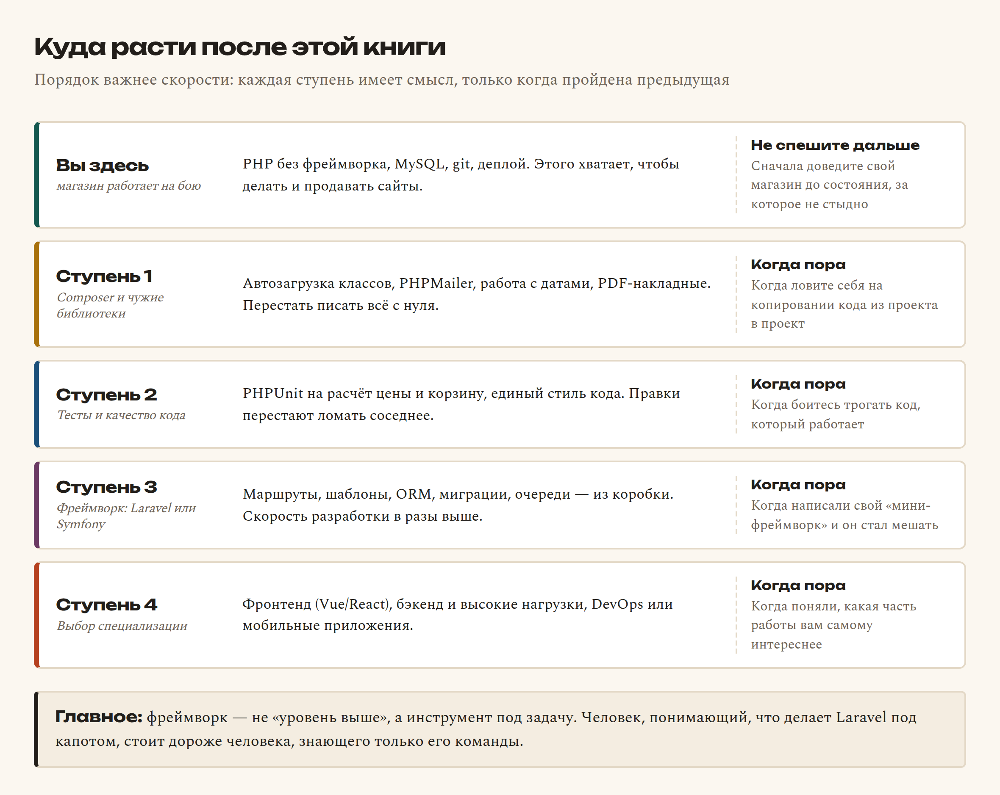
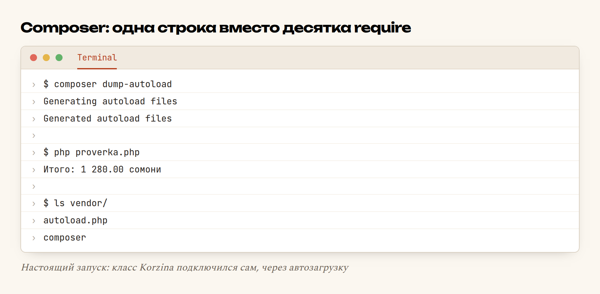

# Глава 59. Куда расти: фреймворки и Composer

> **Часть XII. Дальше** · Глава 59 из 60
> [← Глава 58](58-domen-https.md) · [Глава 60 →](60-kak-vesti-proekt.md)

## 🎯 Зачем эта глава

Пятьдесят восемь глав позади. У вас работающий магазин на настоящем домене,
с каталогом, корзиной, заказами, продавцами, админкой и подключённым
поставщиком. Вы умеете HTML, CSS, JavaScript, PHP, SQL, git и деплой.

Это не «основы». Это ровно тот набор, за который платят.

И тут возникает вопрос, на котором многие спотыкаются: **что дальше?**
В интернете кричат про Laravel, React, Docker, микросервисы, Kubernetes.
Кажется, что вы отстали навсегда.

Не отстали. Эта глава — карта: что действительно стоит выучить следующим,
в каком порядке и, главное, **когда именно** за это браться. Потому что
самая частая ошибка на этом этапе — прыгнуть на фреймворк слишком рано
и потерять полгода на магию, которую не понимаешь.

## 📖 Разбираемся: карта роста



Обратите внимание на правую колонку. Там не «через полгода», а **признак**:
когда конкретно эта ступень становится нужна. Учить что-то до того, как
почувствовал боль, которую оно лечит, — пустая трата времени: не понимаешь,
зачем, и забываешь через месяц.

### Ступень 1. Composer и чужие библиотеки

**Composer** — менеджер пакетов для PHP. Он делает две вещи:

- **скачивает чужие библиотеки** и следит за их версиями;
- **автоматически подключает классы** — вместо десятка `require`.

Вторая — важнее. И полезна, даже если вы ни одной чужой библиотеки
не поставите.

### Ступень 2. Тесты

**Тест** — это код, который проверяет ваш код. Звучит странно ровно
до первого случая, когда правка в расчёте доставки сломала расчёт скидки,
а заметили это через неделю по жалобе покупателя.

Начинать надо не со «всё покрыть тестами», а с **денег**: расчёт цены,
итог корзины, комиссия продавца, баланс. Пять тестов на эти функции окупают
себя в первый же месяц.

### Ступень 3. Фреймворк

**Фреймворк** — готовый каркас приложения. Он берёт на себя маршрутизацию,
шаблоны, работу с базой, миграции, авторизацию, отправку почты, очереди.

Для PHP их два всерьёз:

| | **Laravel** | **Symfony** |
|---|---|---|
| Характер | Быстро и удобно | Строго и предсказуемо |
| Порог входа | Ниже | Выше |
| Материалов на русском | Очень много | Меньше |
| Где чаще нужен | Стартапы, магазины, студии | Крупные компании, банки |

Для магазина — **Laravel**. Он ближе к тому, что вы уже делали, и учиться
по нему легче.

**Но: не раньше, чем ваш магазин заработает.** Причина простая. Фреймворк —
это набор ответов на вопросы, которых вы ещё не задавали. Тот, кто прошёл
эту книгу, откроет Laravel и увидит: маршруты — это то, что он делал руками;
Eloquent — обёртка над SQL, который он писал; миграции — те же
`CREATE TABLE IF NOT EXISTS`. Он выучит фреймворк за месяц и будет понимать,
что происходит внутри.

Тот, кто начал с Laravel, при первой же нестандартной задаче встанет.

### Ступень 4. Специализация

Через год-полтора появится ощущение, какая часть работы вам ближе. Тогда
и выбирать: фронтенд (Vue/React), бэкенд и нагрузки, DevOps, мобильные
приложения. Раньше — не надо: выбор без опыта делается по чужим словам,
а не по своим ощущениям.

## 💻 Код: Composer на практике

Начнём с автозагрузки — то, что можно применить к своему магазину сегодня.

### Проблема, которую решает автозагрузка

Сейчас в вашем проекте наверху каждого файла что-то такое:

```php
require __DIR__ . '/includes/db.php';
require __DIR__ . '/includes/korzina.php';
require __DIR__ . '/includes/tovary.php';
require __DIR__ . '/includes/zakazy.php';
require __DIR__ . '/includes/prodavcy.php';
// ...и ещё десяток
```

Забыли строку — `Call to undefined function`. Переименовали файл —
чините во всех местах. Добавили класс — не забудьте подключить везде.

### Как это выглядит с Composer

Файл `composer.json` в корне проекта:

```json
{
    "name": "firdavs/magazin",
    "description": "Магазин автозапчастей",
    "require": {
        "php": ">=8.1"
    },
    "autoload": {
        "psr-4": {
            "Magazin\\": "src/"
        }
    }
}
```

Строка `"Magazin\\": "src/"` читается так: «класс `Magazin\Korzina` лежит
в файле `src/Korzina.php`». Соглашение — вместо ручных подключений.

Класс, разложенный по этому правилу:

```php
<?php
declare(strict_types=1);

namespace Magazin;

final class Korzina
{
    /** @var array<int, array{cena:int, kol:int}> */
    private array $pozicii = [];

    public function dobavit(int $tovar_id, int $cena, int $kol = 1): void
    {
        $this->pozicii[$tovar_id]['cena'] = $cena;
        $this->pozicii[$tovar_id]['kol']  = ($this->pozicii[$tovar_id]['kol'] ?? 0) + $kol;
    }

    public function itogo(): int
    {
        $summa = 0;
        foreach ($this->pozicii as $p) {
            $summa += $p['cena'] * $p['kol'];
        }
        return $summa;
    }
}
```

И использование — **одна** строка подключения на весь проект:

```php
<?php
require __DIR__ . '/vendor/autoload.php';   // ← вместо десятка require

use Magazin\Korzina;

$korzina = new Korzina();
$korzina->dobavit(1, 25000, 2);   // фильтр, 250.00 сомони
$korzina->dobavit(2, 78000);      // тормозные колодки

echo 'Итого: ', number_format($korzina->itogo() / 100, 2, '.', ' '), " сомони\n";
```

Собирается автозагрузчик одной командой:

```bash
composer dump-autoload
```

### Полезные библиотеки

Когда автозагрузка освоена, ставить чужое просто:

```bash
composer require phpmailer/phpmailer   # нормальная отправка почты через SMTP
composer require nesbot/carbon         # даты по-человечески
composer require ramsey/uuid           # уникальные идентификаторы
composer require phpoffice/phpspreadsheet  # выгрузка прайса в Excel
composer require --dev phpunit/phpunit # тесты (только для разработки)
```

Появятся два файла и папка:

| Что | Зачем | В git? |
|---|---|---|
| `composer.json` | Что нужно проекту | **Да** |
| `composer.lock` | Какие версии стоят **сейчас** | **Да** |
| `vendor/` | Сам скачанный код | **Нет**, в `.gitignore` |

Почему `vendor/` не в git: это чужой код, он восстанавливается командой
`composer install` по `composer.lock`. А `composer.lock` в git обязательно —
он гарантирует, что на боевом сервере встанут **те же самые** версии,
что у вас. Без него однажды на сервере окажется библиотека новее, с другим
поведением, и вы будете искать причину до вечера.

### Первый тест

Раз уж завели Composer, вот как выглядит первый тест:

```php
<?php
use PHPUnit\Framework\TestCase;
use Magazin\Korzina;

final class KorzinaTest extends TestCase
{
    public function test_itog_schitaetsya_pravilno(): void
    {
        $korzina = new Korzina();
        $korzina->dobavit(1, 25000, 2);   // 2 × 250.00
        $korzina->dobavit(2, 78000);      // 1 × 780.00

        $this->assertSame(128000, $korzina->itogo());   // 1280.00 сомони
    }

    public function test_povtornoe_dobavlenie_uvelichivaet_kolichestvo(): void
    {
        $korzina = new Korzina();
        $korzina->dobavit(1, 25000);
        $korzina->dobavit(1, 25000);

        $this->assertSame(50000, $korzina->itogo());
    }
}
```

Читается как список утверждений о том, как всё должно работать. Запускается
командой `vendor/bin/phpunit`. И с этого момента любая правка корзины
проверяется за секунду, а не «вроде не сломал».

## 🔤 Разбор по словам

| Слово | Что это | По-простому |
|---|---|---|
| **Composer** | Менеджер пакетов PHP | Скачивает чужой код и подключает ваш |
| **пакет / библиотека** | Чужой готовый код | «Не писать самому то, что уже написано» |
| **автозагрузка** | Классы подключаются сами | Одна строка вместо десятка `require` |
| **PSR-4** | Правило «класс → путь к файлу» | Соглашение, по которому ищут файл |
| `namespace` | Пространство имён | Фамилия для класса: `Magazin\Korzina` |
| `use` | Импорт имени в файл | Чтобы писать `Korzina`, а не полный путь |
| `vendor/` | Папка со скачанным кодом | В git не кладут |
| `composer.lock` | Точные версии | Гарантия «у меня и на бою одинаково» |
| `--dev` | Пакет только для разработки | На боевой сервер не поедет |
| **фреймворк** | Готовый каркас приложения | Маршруты, шаблоны, база — из коробки |
| **ORM** | Таблица как объект PHP | `$tovar->cena` вместо `SELECT` |
| **тест** | Код, проверяющий код | «Проверь, что итог 1280» |
| `assertSame` | «Должно быть ровно это» | Утверждение в тесте |
| **CI** | Автоматический прогон тестов | Проверка на каждый push |

## 🖥 На экране

Собираем автозагрузчик и запускаем:



`Generating autoload files` — Composer прочитал `composer.json` и построил
карту «класс → файл». В папке `vendor/` появился `autoload.php`.

Дальше `php proverka.php` печатает **1 280.00 сомони**. Проверим руками:
250.00 × 2 + 780.00 = 1280.00. Сходится.

Главное здесь — то, чего **не** видно: в `proverka.php` нет ни одного
`require` для `Korzina.php`. Класс подключился сам, потому что лежит там,
где обещано в `composer.json`. Добавите завтра `Magazin\Zakaz` — он тоже
подключится сам, без единой правки в других файлах.

Обратите внимание: в `vendor/` только `autoload.php` и служебная папка —
ни одной чужой библиотеки мы не ставили. Автозагрузка работает сама
по себе, и это первое, ради чего стоит завести Composer.

## ⚠️ Грабли

**Прыгнуть на фреймворк сразу.** Самая дорогая ошибка на этом этапе.
Laravel без понимания того, что он делает внутри, — это набор заклинаний.
Первая же задача вне учебника поставит в тупик.

**`vendor/` в git.** Плюс десятки тысяч файлов в репозитории и конфликты
при каждом обновлении. В `.gitignore`.

**`composer.lock` **не** в git.** Обратная ошибка, и она хуже: на боевом
сервере встанут другие версии, чем у вас, и поведение разойдётся.

**`composer update` на боевом сервере.** `update` подтягивает новые версии
и переписывает `lock`. На сервере запускают только `composer install` —
он ставит ровно то, что записано в `lock`.

**Библиотека ради одной функции.** Тянуть пакет на 200 файлов, чтобы
обрезать строку, — плохая сделка. Каждая зависимость — это чужой код,
который надо обновлять и который может однажды сломаться.

**Учить всё сразу.** Laravel + React + Docker + Kubernetes параллельно =
не выучено ничего. Одна ступень за раз, до состояния «сделал работающий
проект».

**Считать, что «без фреймворка» — стыдно.** Огромная доля работающих
и зарабатывающих сайтов написана ровно так, как ваш магазин. Фреймворк —
инструмент, а не диплом.

## 🏋️ Задачи

**Задача 59.1.** Установите Composer. Проверьте: `composer --version`.

**Задача 59.2.** Заведите `composer.json` в своём магазине с автозагрузкой
`Magazin\` → `src/`.

**Задача 59.3.** Перенесите одну функцию магазина в класс с `namespace`.
Уберите соответствующий `require`. Работает?

**Задача 59.4.** Посчитайте, сколько `require` в вашем проекте. Сколько
из них уйдёт после перехода на автозагрузку?

**Задача 59.5.** Поставьте `phpunit` и напишите два теста на расчёт итога
корзины. Сломайте функцию нарочно — тест поймал?

**Задача 59.6.** Напишите тест на расчёт цены из главы 51: рубли, курс,
наценка, округление.

**Задача 59.7.** Добавьте `vendor/` в `.gitignore`, а `composer.lock` —
в git. Объясните своими словами, почему именно так.

**Задача 59.8.** Поставьте PHPMailer и отправьте письмо через SMTP.
Сравните доставляемость с `mail()`.

**Задача 59.9.** Откройте документацию Laravel, раздел «Routing». Найдите
в своём магазине то место, которое делает то же самое.

**Задача 59.10.** Составьте личный план на полгода: что учите первым,
вторым, третьим и по какому признаку поймёте, что пора дальше.

*Ответы — в [Приложении Г](../prilozheniya/4-G-otvety.md).*

## 🔗 В бою

Магазин autodoc.tj написан **без фреймворка** — на PHP 8 и PDO, каждая
страница отдельным файлом. И это осознанный выбор, а не «не осилили».

Причины конкретные. Проект должен работать на обычном хостинге
в Таджикистане. Его должен уметь поддержать местный разработчик, а не только
автор. Скорость страницы важнее удобства разработчика: покупатель на мобильном
интернете не ждёт.

Что при этом взято из «взрослого» подхода, потому что оно окупается:

- **PDO и подготовленные запросы** — как во всех фреймворках;
- **идемпотентные миграции** — своя, простая версия того же механизма;
- **настройки в базе**, а не в коде — то, что фреймворк даёт из коробки;
- **журнал операций** (`seller_ledger`) — приём из бухгалтерских систем.

Иными словами: фреймворка нет, а инженерные решения — те же. Это и есть
разница между «пишу без фреймворка, потому что не умею иначе»
и «пишу без фреймворка, потому что так лучше для этой задачи».

Когда проект дорастёт до команды из нескольких разработчиков — переход
на Laravel станет разумным. Но не раньше, чем появится вторая пара рук.

## 📌 Итог

- Того, что вы уже умеете, **достаточно, чтобы делать и продавать сайты**.
- Порядок роста: **Composer → тесты → фреймворк → специализация**.
- Учите ступень, **когда почувствовали боль**, которую она лечит.
- Composer полезен сразу — **автозагрузкой**, даже без чужих библиотек.
- `composer.json` и `composer.lock` — **в git**, `vendor/` — **нет**.
- На боевом — только **`composer install`**, никогда `update`.
- Тесты начинают **с денег**: цена, итог, комиссия, баланс.
- **Фреймворк — после работающего проекта**, а не вместо него.
- Laravel — для магазинов и студий, Symfony — для крупных компаний.
- Фреймворк — **инструмент, а не диплом**. Без него работают тысячи сайтов.

Осталась последняя глава — о том, как превратить всё это в работу.

[← Глава 58](58-domen-https.md) · [Глава 60. Как вести проект →](60-kak-vesti-proekt.md)
