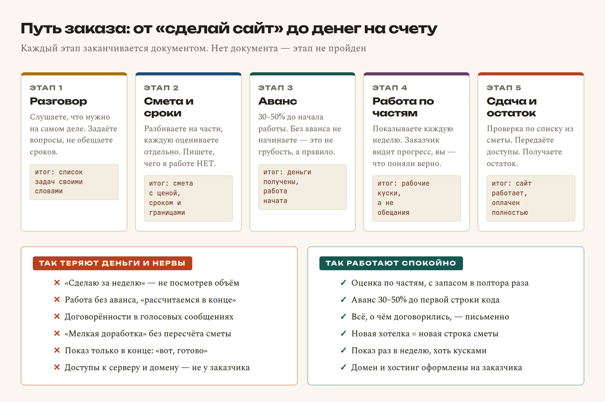

# Глава 60. Как вести проект и брать заказы

> **Часть XII. Дальше** · Глава 60 из 60
> [← Глава 59](59-kuda-rasti.md) · [Приложение А →](../prilozheniya/1-A-shpargalki.md)

## 🎯 Зачем эта глава

Все предыдущие пятьдесят девять глав были про то, **как делать**. Эта —
про то, **как на этом жить**.

Тема, которой в учебниках обычно нет, — и зря. Потому что провалы у начинающих
разработчиков случаются не из-за плохого кода. Они случаются так:

- «Сделаю за неделю» — а работы оказалось на два месяца;
- сделал всё, а заказчик пропал, не заплатив;
- «добавь ещё одну маленькую кнопочку» — и так двадцать раз, бесплатно;
- сдал проект, а через полгода звонят: «сайт лежит, чини» — тоже бесплатно;
- взял заказ, не понял задачу, потерял три месяца и репутацию.

Ни одну из этих бед не лечит знание PHP. Их лечат **договорённости**.
Разберём, как их выстраивать — так, чтобы работа приносила деньги,
а не ощущение, что вас использовали.

## 📖 Разбираемся: путь заказа



Ключевая мысль картинки — в подзаголовке: **каждый этап заканчивается
документом**. Не «поговорили и договорились», а written down. Пусть это
будет сообщение в мессенджере — важно, что оно есть и его можно перечитать.

Разберём этапы по одному.

### Этап 1. Разговор: слушать, а не обещать

Заказчик говорит: «Мне нужен сайт как у конкурента, только лучше».
Это не задача. Задача появляется после вопросов:

- Что сейчас **мешает** работать? (настоящая причина всегда тут)
- Кто будет **пользоваться**: покупатели, менеджеры, продавцы?
- Откуда берутся **товары и цены** — руками, из Excel, из чужого API?
- Как приходят **заказы** сейчас и что с ними происходит дальше?
- Что должно быть **на первом экране** через месяц после запуска?
- Кто будет **вести сайт** после сдачи?

Главное правило этапа: **на этом этапе не называть ни сроков, ни цены.**
«Мне нужно посмотреть объём, вернусь завтра со сметой» — нормальный,
профессиональный ответ. Названная в разговоре цифра прилипает навсегда.

### Этап 2. Смета: разбить и записать границы

Оценивать «сайт целиком» невозможно. Оценивать по частям — можно:

```
Каталог с фильтрами и поиском        ........  12 дней
Карточка товара                      ........   3 дня
Корзина и оформление заказа          ........   6 дней
Личный кабинет покупателя            ........   4 дня
Админка: товары, заказы, статусы     ........  10 дней
Подключение поставщика по API        ........   8 дней
Выкладка, домен, HTTPS, почта        ........   3 дня
                                     ────────────────
                                     Итого:     46 дней
```

Дальше — **умножить на 1,5**. Не потому, что вы медленный, а потому что
в оценку никогда не попадают: правки после показа, ожидание ответов
заказчика, доступы, которых нет, и то, что «не работает у клиента,
а у меня работает».

И самый важный кусок сметы — **чего в работе НЕТ**:

```
В работу НЕ входит:
— наполнение каталога товарами (передаём в Excel-шаблоне);
— тексты и фотографии;
— подключение онлайн-оплаты картой;
— мобильное приложение;
— продвижение и реклама;
— доработки после сдачи (обсуждаются отдельно).
```

Этот список экономит больше нервов, чем всё остальное вместе взятое.
Без него любая просьба звучит как «ну это же входит».

### Этап 3. Аванс

**30-50% до начала работы.** Это не признак недоверия — это признак того,
что вы профессионал, а не тот, кто «попробует».

Аргумент, если неловко произносить: «Аванс — обычная практика, он
подтверждает, что задача действительно в работе, и я резервирую под неё
время». Заказчик, который отказывается от аванса, почти всегда откажется
и от финального платежа.

### Этап 4. Работа по частям

Худшее, что можно сделать, — уйти на два месяца и появиться со словами
«готово». Потому что «готово» окажется не тем, что человек представлял,
и переделывать придётся всё.

Правильно — **показывать раз в неделю**, пусть кусками:

- неделя 1: каталог выводит товары из базы, без дизайна;
- неделя 2: фильтры и поиск работают;
- неделя 3: карточка товара, корзина;
- и так далее.

Заказчик видит движение и вовремя говорит «а можно вот тут иначе» —
когда переделать стоит час, а не месяц.

### Этап 5. Сдача

Сдача — это не «я закончил». Это:

1. пройти **список из сметы**, пункт за пунктом, вместе с заказчиком;
2. передать **все доступы**: хостинг, домен, база, админка, почта;
3. показать, **как пользоваться** админкой — лучше с записью экрана;
4. получить **остаток оплаты**;
5. договориться о **поддержке** — отдельно и письменно.

Пункт 2 — принципиальный. Домен и хостинг оформляются **на заказчика**,
даже если платите вы и потом выставляете счёт. Иначе вы становитесь
заложником: его бизнес зависит от ваших аккаунтов, а вы — от его
своевременной оплаты.

## 💻 Код: инструменты, которые держат проект

### Список задач, а не память

Память не работает. Работает список — хоть в блокноте, хоть в issues
на GitHub, хоть в таблице:

```
[ ] Каталог: фильтр по бренду              — 2 дня   — в работе
[ ] Каталог: постраничный вывод            — 1 день  — ждёт
[x] Карточка товара: галерея фото          — 2 дня   — сдано 12.08
[ ] Корзина: пересчёт при смене количества — 1 день  — ждёт
[!] Оплата картой                          — ???     — ЗАБЛОКИРОВАНО: нет эквайринга
```

Четыре состояния и всё. Отдельно отмечайте **заблокированное** — то, что
не двигается не по вашей вине. Это первое, что нужно показать заказчику
на еженедельном созвоне.

### README, который спасёт вас через год

В каждом проекте, с первого дня:

```markdown
# Магазин автозапчастей

## Что это
Интернет-магазин с каталогом, корзиной, заказами и кабинетом продавца.

## Как запустить у себя
1. `git clone ...`
2. Создать базу, залить `shema.sql`
3. Скопировать `config/db_credentials.example.php` → `db_credentials.php`
4. `php -S localhost:8000 -t public`

## Где что лежит
- `public/` — то, что видно из браузера
- `includes/` — общий код
- `admin/` — админка
- `logs/` — журналы (в git не входят)

## Что нельзя ломать
- Расчёт цены: `includes/cena.php` — там курс, наценка и доставка
- Миграции только идемпотентные

## Кому звонить
Хостинг — ..., домен — ..., поставщик API — ...
```

Через год вы вернётесь в этот проект и не вспомните ничего. README —
письмо самому себе в будущее.

### Договорённости по правкам

Формула, которую стоит выучить наизусть:

> «Да, это можно сделать. Это займёт примерно N дней и будет стоить X.
> Добавляю в список — начинаем сразу или после текущего этапа?»

Не «нет» (грубо и портит отношения) и не «ладно, сделаю» (бесплатная
работа, которой не будет конца). Просто **каждая новая хотелка — новая
строка сметы**. Заказчик почти всегда соглашается: он не жадный, он
просто не знал, что это работа.

### Поддержка после сдачи

Обязательно обговорите **до** сдачи, иначе будете чинить бесплатно вечно:

| Вариант | Что входит | Как считать |
|---|---|---|
| **Разовые правки** | По запросу | Почасовая ставка |
| **Абонемент** | N часов в месяц + мелкие правки | Фиксированная сумма |
| **Только аварии** | Сайт лежит — чиню срочно | Фикс + повышенная ставка за срочность |

Отдельно проговорите, что такое «авария»: сайт недоступен, заказы
не оформляются, деньги считаются неправильно. «Хочу другой оттенок
кнопки» — не авария.

### Как назначить цену

Три подхода, от простого к правильному:

1. **По часам.** Ваша ставка × часы. Просто, но наказывает за скорость:
   чем вы опытнее, тем меньше зарабатываете.
2. **За проект.** Оценка × 1,5 → фиксированная цена. Заказчику понятно,
   вам выгодно работать быстро. Требует хорошей сметы.
3. **По ценности.** Магазин принесёт владельцу N в месяц — цена от этого.
   Так работают опытные, но нужны примеры прошлых успехов.

Начинайте со второго. И помните про **нижнюю границу**: если после всех
расчётов выходит меньше, чем вы заработали бы на найме, — это не заказ,
а благотворительность.

## 🔤 Разбор по словам

| Слово | Что это | По-простому |
|---|---|---|
| **ТЗ** (техническое задание) | Описание того, что делаем | «Что именно будет сделано» |
| **смета** | Разбивка работы на части с ценами | Из чего складывается сумма |
| **аванс / предоплата** | Часть суммы до начала | Подтверждение серьёзности |
| **скоуп** (scope) | Границы работы | Что входит и что **не** входит |
| **скоуп-крип** | Незаметное разрастание задач | «Ещё одна кнопочка» ×20 |
| **дедлайн** | Крайний срок | Дата, к которой должно быть готово |
| **этап / веха** | Кусок работы со своим итогом | «Каталог готов» |
| **демо** | Показ промежуточного результата | Раз в неделю, хоть кусками |
| **приёмка** | Проверка по списку из сметы | «Сдано» = прошло все пункты |
| **поддержка** | Работы после сдачи | Отдельный договор, не бонус |
| **SLA** | Обещанное время реакции | «Отвечаю в течение 4 часов» |
| **портфолио** | Примеры ваших работ | То, что показывают вместо резюме |

## 🖥 На экране

Вернитесь к картинке в начале главы и посмотрите на две колонки внизу.

Левая — это не выдуманные страшилки. Это ровно тот список, который каждый
разработчик собирает на собственном опыте в первый год. Разница только
в том, что кто-то платит за него годом жизни, а кто-то читает и не платит.

Правая колонка кажется бюрократией — до первого случая, когда заказчик
говорит: «мы же договаривались, что оплата будет и на телефоне тоже».
Если есть смета со строкой «мобильное приложение не входит» — разговор
занимает минуту. Если нет — вы работаете ещё месяц бесплатно.

Особое внимание — последней строке в обеих колонках. **Домен и хостинг
оформлены на заказчика.** Это защищает обоих: заказчик не боится, что
исчезнет вместе с его сайтом, а вы не отвечаете за чужие неоплаченные счета.

## ⚠️ Грабли

**Назвать срок в первом разговоре.** «Ну, недели три, наверное» — и это
запомнят навсегда, независимо от того, что выяснится позже.

**Работать без аванса.** Заказчик, не готовый заплатить 30% за работу,
которую хочет получить, чаще всего не готов заплатить и 100%.

**Договорённости голосом.** Через месяц каждый помнит по-своему, и оба
искренне. Пишите: «фиксирую: делаем A, B, C; D не входит; срок — 15 сентября».

**Бесплатные «мелочи».** Каждая по отдельности — двадцать минут. Двадцать
таких — неделя работы, которую вы подарили.

**Исчезнуть на месяц.** Заказчик начинает нервничать, а вы рискуете
месяцем работы не в ту сторону. Раз в неделю — короткое сообщение,
даже если сказать нечего.

**Не передать доступы.** Кажется, что это гарантия оплаты. На деле —
причина конфликта и репутационной потери. Гарантия оплаты — аванс.

**Сдать без обучения.** Заказчик не знает, как добавить товар, и звонит
вам по каждому. Полчаса записи экрана экономят месяцы звонков.

**Взять заказ, который не понимаешь.** «Разберусь по ходу» иногда работает,
но чаще заканчивается срывом сроков. Честное «это не моя область, но могу
порекомендовать» сохраняет репутацию.

**Не считать своё время.** Ведите учёт хотя бы приблизительно. Через три
проекта вы будете оценивать сроки в разы точнее — но только если знаете,
сколько ушло на самом деле.

## 🏋️ Задачи

**Задача 60.1.** Составьте смету на свой магазин из этой книги: разбейте
на части и оцените каждую. Сравните с реальным временем, которое потратили.

**Задача 60.2.** Напишите список «что НЕ входит» из десяти пунктов
для типового заказа «интернет-магазин».

**Задача 60.3.** Напишите `README.md` для своего проекта по образцу
из главы. Дайте прочитать человеку со стороны — понял, как запустить?

**Задача 60.4.** Составьте список из десяти вопросов, которые вы зададите
заказчику на первой встрече.

**Задача 60.5.** Посчитайте свою минимальную ставку: расходы в месяц ÷
реальные рабочие часы. Ниже этой цифры браться нельзя.

**Задача 60.6.** Сформулируйте своими словами ответ на «а можно ещё
маленькую кнопочку?» — вежливо и с ценой.

**Задача 60.7.** Опишите три варианта поддержки для своего заказчика
с ценами.

**Задача 60.8.** Соберите портфолио: репозиторий магазина, ссылка
на работающий сайт, три экрана и абзац «что здесь сделано».

**Задача 60.9.** Найдите три площадки, где ищут разработчиков в вашем
городе или в интернете. Изучите, какие проекты и за какие деньги.

**Задача 60.10.** Напишите текст своего предложения на пять предложений:
что вы делаете, для кого, чем отличаетесь и как с вами связаться.

*Ответы — в [Приложении Г](../prilozheniya/4-G-otvety.md).*

## 🔗 В бою

Проект autodoc.tj — хороший пример того, как это выглядит в жизни, включая
неудобные места.

**Работа идёт этапами, и они записаны.** Фаза 1 — продавцы, товары,
модерация. Фаза 2 — заказы с разбивкой и комиссией. Фаза 3 делится
надвое: «деньги наружу» (балансы, выплаты) и «деньги внутрь» (онлайн-оплата).
Фаза 4 — отзывы, возвраты, buy-box. Каждая фаза имеет понятный итог.

**Часть работы заблокирована не по вине разработчика.** Онлайн-оплата
упирается в эквайринг в Таджикистане — это вопрос не кода, а банков.
Сквозная проверка второй фазы на боевом отложена **самим заказчиком**.
Обе вещи записаны прямым текстом в документации проекта. Это и есть
правильное поведение: заблокированное не прячут, его фиксируют.

**Ограничения поставщика тоже записаны.** Правила расхода тарифа
Parts-Catalogs не подтверждены, пакетный сбор каталога остановлен
до ответа. Через полгода никто не вспомнит, почему сбор на паузе, —
а в документе написано.

**И главное правило проекта, которое стоит переносить в любой заказ:**
*не ломать рабочее*. Витрина должна работать после любого коммита.
Заказчик, у которого магазин продаёт каждый день, оценит это выше,
чем любую новую функцию.

## 📌 Итог

- Провалы случаются **не из-за кода**, а из-за договорённостей.
- В первом разговоре — **слушать и спрашивать**, не называть сроков.
- Смета — **по частям**, итог **× 1,5**, и обязательно список **«что НЕ входит»**.
- **Аванс 30-50%** до начала. Без него не начинают.
- Показывать результат **раз в неделю**, кусками.
- Новая хотелка = **новая строка сметы**, а не бесплатная мелочь.
- Всё, о чём договорились, — **письменно**, хоть в мессенджере.
- Сдача = список из сметы + **доступы** + обучение + остаток оплаты.
- Домен и хостинг — **на заказчика**, всегда.
- Поддержка — **отдельный договор**, обговорённый до сдачи.

---

## Вы дошли до конца

Шестьдесят глав назад вы, возможно, не знали, что такое `<div>`.

Сейчас вы умеете верстать страницы, оживлять их скриптами, писать
серверный код, проектировать базы данных, защищаться от инъекций и XSS,
считать деньги без потерь на округлении, подключать чужие API, вести
историю в git, выкладывать сайт в интернет и разговаривать с заказчиком.

Это полный набор fullstack-разработчика. Не «основы» — рабочий набор.

Что делать дальше — по порядку:

1. **Доведите свой магазин.** Не до идеала, а до состояния «работает
   и не стыдно показать». Один законченный проект весит больше десяти
   начатых.
2. **Выложите его в интернет** и покажите живым людям. Пусть попробуют
   купить. Соберите замечания.
3. **Положите код на GitHub** с внятным README. Это ваше портфолио.
4. **Возьмите первый заказ** — пусть маленький, пусть у знакомых.
   Пройдите путь из этой главы целиком, включая смету и аванс.
5. **Возвращайтесь к книге** как к справочнику. Приложения А-Г для этого
   и написаны.

И последнее. Никто из работающих разработчиков не помнит всего наизусть.
Все смотрят документацию, все гуглят, все читают чужой код и все ошибаются.
Разница между новичком и опытным — не в объёме памяти, а в том, что
опытный знает: **любая непонятная ошибка разбирается по шагам, и он
разберётся**.

Теперь это знаете и вы. Удачи.

[← Глава 59](59-kuda-rasti.md) · [Приложение А. Шпаргалки →](../prilozheniya/1-A-shpargalki.md)
